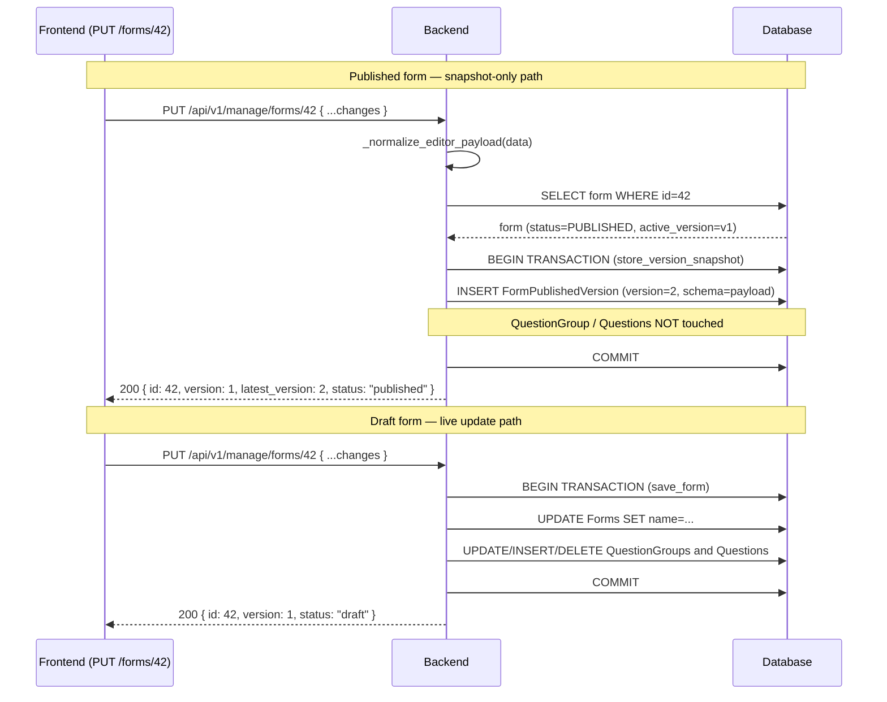
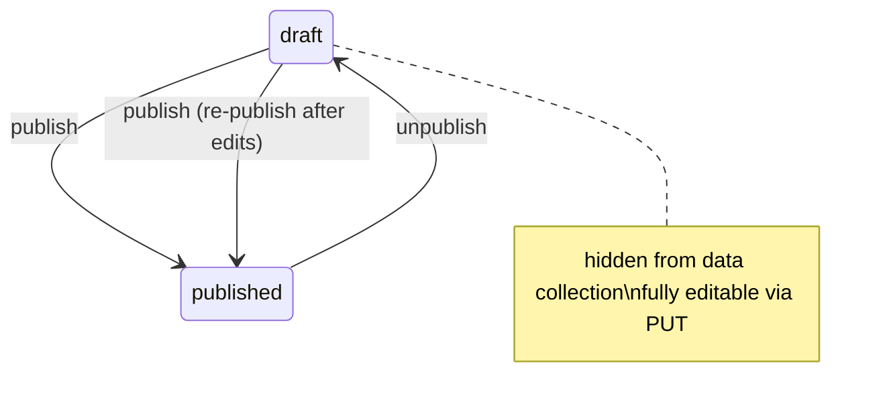

# Design: Form Builder Backend API

---

## Data Model Changes

### New Fields on `Forms`

```python
class FormStatus:
    draft = 1
    published = 2

    FieldStr = {
        draft: "draft",
        published: "published",
    }
```

Add to `Forms` model (`backend/api/v1/v1_forms/models.py`):

```python
status = models.IntegerField(
    choices=FormStatus.FieldStr.items(),
    default=FormStatus.draft,
)
published_at = models.DateTimeField(null=True, blank=True, default=None)
previous_version = models.ForeignKey(
    "self",
    on_delete=models.SET_NULL,
    related_name="next_versions",
    null=True,
    blank=True,
)
```

`previous_version` is separate from `parent` (which links monitoring forms to registration forms). The two FKs serve different concerns:

| FK | Purpose |
|---|---|
| `parent` | Registration ↔ Monitoring relationship (form type linkage) |
| `previous_version` | Version chain (form evolution over time) |

### Migration Strategy

```python
# Migration sets status = PUBLISHED for all existing rows
migrations.AddField(
    model_name='forms',
    name='status',
    field=models.IntegerField(
        default=2,  # PUBLISHED — existing forms are already live
        choices=...
    ),
)
migrations.AddField(
    model_name='forms',
    name='published_at',
    field=models.DateTimeField(null=True, blank=True, default=None),
)
migrations.AddField(
    model_name='forms',
    name='previous_version',
    field=models.ForeignKey(..., null=True, blank=True),
)
```

---

## API Contract

### URL Pattern Decision

The API uses two URL namespaces:

- `/api/v1/forms` — read-only, public, flat list (backward compat for mobile/web)
- `/api/v1/manage/forms` — authenticated CRUD for the form builder UI (`"Manage Forms"` OpenAPI tag)

| Method | URL | Purpose |
|---|---|---|
| `GET` | `/api/v1/forms` | Flat list (existing, `list_form`, no auth) |
| `GET` | `/api/v1/manage/forms` | Paginated list for form builder UI |
| `POST` | `/api/v1/manage/forms` | Create form |
| `GET` | `/api/v1/manage/forms/{id}` | Get form detail |
| `PUT` | `/api/v1/manage/forms/{id}` | Update form in-place (auto-increments version if published) |
| `DELETE` | `/api/v1/manage/forms/{id}` | Delete/archive form |
| `POST` | `/api/v1/manage/forms/{id}/publish` | Publish draft |
| `POST` | `/api/v1/manage/forms/{id}/duplicate` | Clone as new draft |
| `GET` | `/api/v1/manage/forms/{id}/versions` | List version chain |
| `POST` | `/api/v1/manage/forms/{id}/unpublish` | Hide published form from data collection (status → draft) |
| `GET` | `/api/v1/form/{id}` | Form for web/mobile rendering (existing, **unchanged**) |
| `GET` | `/api/v1/form/web/{id}` | Webform with admin cascade (existing, **unchanged**) |

The singular `/api/v1/form/{id}` endpoint stays as-is because mobile apps and the web form submission page reference it directly.

### Request Payload: `FormCreateSerializer`

Accepts the output of the frontend `editorToApi()` transformer. This is the shared contract between the two specs:

```json
{
  "name": "Household Survey 2026",
  "type": "registration",
  "approval_instructions": null,
  "parent": null,
  "question_group": [
    {
      "id": null,
      "name": "Household Information",
      "label": null,
      "order": 1,
      "repeatable": false,
      "repeat_text": null,
      "question": [
        {
          "id": null,
          "order": 1,
          "label": "Head of Household Name",
          "short_label": null,
          "name": "head_of_household_name",
          "type": "input",
          "meta": true,
          "required": true,
          "rule": null,
          "dependency": null,
          "dependency_rule": "AND",
          "api": null,
          "extra": null,
          "tooltip": null,
          "fn": null,
          "pre": null,
          "display_only": false,
          "option": []
        }
      ]
    }
  ]
}
```

**Accepted `type` values**: `1` (registration), `2` (monitoring), or strings `"registration"` / `"monitoring"` — both forms are equivalent  
**Accepted question `type` values**: `"input"`, `"number"`, `"text"`, `"date"`, `"option"`, `"multiple_option"`, `"cascade"`, `"image"`, `"autofield"`, `"attachment"`, `"signature"`, `"geo"`, `"administration"`

`"image"` is the canonical type name (aligned with `akvo-form-service` and the editor). The old `"photo"` string is no longer accepted — see D-3.

`"entity"` is **not** a valid `type` string for the backend API. Entity questions must be sent as `type: "cascade"` with `extra: { "type": "entity", "name": "..." }`. The FB-003 transformer (`editorToApi`) is responsible for converting the editor's `"entity"` type to `"cascade"` before sending. The reverse (`apiToEditor`) converts `cascade + extra.type=entity` back to `"entity"` for the editor.

### Response Format: `FormDetailSerializer`

Extended from the existing `FormDataSerializer`, adds `status`, `version`, `published_at`. Questions include `disable_delete` (true when answers exist, null otherwise — following `akvo-form-service` pattern to let the editor disable the delete button):

```json
{
  "id": 42,
  "name": "Household Survey 2026",
  "version": 1,
  "status": "draft",
  "published_at": null,
  "active_version_id": null,
  "type": 1,
  "approval_instructions": null,
  "parent": null,
  "question_group": [
    {
      "id": 1,
      "name": "Household Information",
      "question": [
        {
          "id": 10,
          "type": "input",
          "label": "Head of Household Name",
          "disable_delete": null
        },
        {
          "id": 11,
          "type": "number",
          "label": "Age",
          "disable_delete": true
        }
      ]
    }
  ]
}
```

### List Response (`GET /api/v1/forms`)

Extended `ListFormSerializer` adds `status` and `version` to each item:

```json
[
  {
    "id": 42,
    "name": "Household Survey 2026",
    "version": 1,
    "status": "draft",
    "type": 1
  }
]
```

---

## PUT Behavior by Status

PUT always returns `200`. The form ID never changes on edit. Behavior differs by status:



Version rules:
- **Published form**: `store_version_snapshot` inserts a new `FormPublishedVersion` with the payload as schema. Live rows (`QuestionGroup`, `Questions`) are untouched. `active_version` and `Forms.version` stay unchanged. Response is built from the new snapshot via `_form_detail_from_snapshot`.
- **Draft form**: `save_form` updates live rows. `version` stays unchanged. `create_published_version` is not called.
- `version` is always server-managed — values in the PUT payload are ignored.

**Invariant**: live question rows always equal the active version. Only `activate()` and first `publish` modify them.

---

## Decision Log

### D-1: Always In-Place PUT

**Options considered**:
1. **Version-on-edit**: PUT on published form creates a new draft version (original `201` design)
2. **Always in-place**: PUT always updates the record, returns `200`; published form auto-increments `version`

**Decision**: Always in-place (option 2).

**Rationale**:
- Version-on-edit created a new form record on every PUT of a published form, leaving stale duplicates in the list and forcing the frontend to handle two different response codes (`200` vs `201`) and navigate to a new form ID.
- Data integrity is already protected by the "can't delete answered questions" guard in `_save_questions` — there is no scenario where in-place editing corrupts existing `FormData` records.
- Auto-incrementing `version` on every PUT of a published form gives traceability without the complexity of creating new rows.
- `duplicate` action still exists for the explicit "create a copy" flow when needed.

---

### D-2: `parent` FK vs `previous_version` FK — Separate Fields

**Why not reuse `parent`?**

The `parent` FK already has a defined meaning: it links a monitoring form to its registration form. Overloading it to also mean "previous version" would make queries ambiguous — e.g., "give me the monitoring form for form #42" and "give me the previous version of form #42" would use the same field for unrelated traversals.

**Decision**: Add a new `previous_version` FK.

---

### D-3: Rename `photo` → `image` in `QuestionTypes`

**Problem**: The akvo-mis backend constant is `QuestionTypes.photo = 8`. The `akvo-react-form-editor` emits `"image"`. The `akvo-form-service` reference implementation also uses `image = 8` as the canonical name.

**Decision**: **Rename `photo` → `image`** in `QuestionTypes` in akvo-mis.

- Change constant name: `photo = 8` → `image = 8`
- Change `FieldStr`: `{photo: "Photo"}` → `{image: "image"}`
- Update all usages of `QuestionTypes.photo` in the codebase (search + replace)
- No DB migration needed — the integer value `8` is unchanged in the database
- `"photo"` is no longer accepted as a type string in API payloads; `"image"` is canonical

**Impact on FB-003**: The frontend transformer `editorToApi()` needs no alias mapping — `"image"` passes through unchanged. Remove the `EDITOR_TYPE_ALIASES` for image.

---

### D-4: Delete Strategy — Reject if Submissions Exist

**Options considered**:
1. Hard delete (cascade)
2. Soft delete / archive status
3. Reject if submissions exist, hard delete otherwise

**Decision**: Option 3 — reject with `409 Conflict` if form has submissions; allow hard delete otherwise. Add `ARCHIVED` status only if explicitly requested.

**Rationale**:
- Hard cascade delete of a form with submissions would orphan or corrupt `FormData` records.
- A full archive/soft-delete pattern adds model complexity that is not required for #228's follow-up.
- The safest default: block deletion when data exists, allow it when the form is genuinely unused (draft never published).

---

### D-5: Unique Constraint on `(form, name)` for Groups and Questions

The database enforces `UNIQUE (form_id, name)` on both `question_group` and `question` tables. The editor may produce groups or questions with the same label but different names, or may not provide a `name` at all.

**Rule**:
- If `name` is not provided in the payload, the backend generates one: `slugify(label)` + positional suffix if collision (`_1`, `_2`, etc.).
- If `name` is provided and collides, return `400` with a clear error.
- The frontend should surface this as a named uniqueness error when it occurs.

---

### D-6: Plain Function Helpers Instead of Sub-Serializers

**Problem**: The initial spec proposed DRF sub-serializers (`AddQuestionGroupSerializer`, `AddQuestionSerializer`) for nested writes. However, this pattern adds extra indirection for a write-only path and couples serialization concerns with ORM mutation.

**Decision**: Use plain transaction-wrapped helper functions in `api/v1/v1_forms/functions.py`:

| Function | Purpose |
|---|---|
| `save_form(data, instance=None)` | Create a new DRAFT form or update a draft form's live rows in-place; atomic |
| `store_version_snapshot(form, data, user)` | For published forms on PUT: store normalized payload as a new `FormPublishedVersion` schema. No live rows touched. Missing fields inherit from active version's schema; atomic |
| `create_published_version(form, user, activate=False)` | Create a `FormPublishedVersion` from live rows using `_build_schema_snapshot`. When `activate=True` (first publish or explicit republish): sets `Forms.active_version`, `Forms.version`, and on draft→published also `status`/`published_at`; atomic |
| `restore_from_snapshot(form, pv)` | Two-pass rollback applying snapshot to live rows: Pass 1 soft-deletes active rows absent from snapshot; Pass 2 restores/creates snapshot rows (via `qs.restore()` — creates new if ID not found), syncs all fields and options. Restores `form.name`, `form.approval_instructions`, sets `active_version = pv`, `version = pv.version`; atomic |
| `_build_schema_snapshot(form)` | Build immutable schema JSON from live rows using `prefetch_related` (3 queries total). Called by `create_published_version` |
| `duplicate_form(original_form)` | Deep copy any form as a new DRAFT; atomic |
| `validate_form_payload(data)` | Return list of error strings before touching the DB |
| `_form_detail_from_snapshot(form, pv)` | View helper: build `FormDetailSerializer`-shaped response from snapshot JSON. Batch-checks `disable_delete` in one query. Used by `retrieve()` and `update()` response for published forms |

**Pattern** (`save_form`):
```python
@transaction.atomic
def save_form(data, instance=None):
    type_val = data.get("type")
    if instance is None:
        # CREATE — name required; type defaults to registration
        form = Forms.objects.create(
            name=data["name"],
            type=_parse_form_type(type_val) if type_val else FormTypes.registration,
            status=FormStatus.draft, ...
        )
    else:
        # UPDATE — only update fields present in the payload
        if "name" in data: instance.name = data["name"]
        if type_val is not None: instance.type = _parse_form_type(type_val)
        instance.save(); form = instance

    # question_group only processed when key is explicitly in payload
    if instance is None or "question_group" in data:
        for group_data in data.get("question_group", []):
            _save_questions(group, group_data["question"], question_names)
    return form
```

**Benefit**: Validation (`validate_form_payload`) and mutation (`save_form`) are separate concerns. Views call `validate_form_payload` first, then `save_form`. The serializers layer (`FormDetailSerializer`) is read-only — no dual-role serializers.

---

### D-7: Protect Answered Questions/Groups from Deletion

**Problem**: Deleting a question or group that has existing `Answers` records would orphan data.

**Decision**: Follow the `akvo-form-service` pattern — check `Answers.objects.filter(question_id__in=qids).count()` before deleting any group or question. Raise `400` with a clear message if answers exist.

This applies to both:
- `PUT /api/v1/forms/{id}` — groups/questions removed from the payload
- `DELETE /api/v1/forms/{id}` — form-level delete (handled by the existing form-level `FormData` check)

**Error response**:
```json
{"message": "Can't delete question group", "details": "Question in group {id} has answers"}
{"message": "Can't delete question", "details": "Question {id} has answers"}
```

---

### D-8: Type Validation via `validate_form_payload`

**Decision**: Type validation lives in `validate_form_payload(data, partial=False)` in `functions.py`, not in a DRF serializer.

- **Create** (`partial=False`): `name` is required; `type` is optional (defaults to `registration`).
- **Update** (`partial=True`): both `name` and `type` are optional — only fields present in the payload are changed; `question_group` is only processed when the key exists in the payload.

```python
def validate_form_payload(data, partial=False):
    errors = []
    if not partial and not data.get("name"):
        errors.append("name is required")

    type_val = data.get("type")
    if type_val is not None:
        valid_ints = {FormTypes.registration, FormTypes.monitoring}  # {1, 2}
        valid_strs = {"registration", "monitoring"}
        if type_val not in valid_ints and type_val not in valid_strs:
            errors.append("type must be 1 (registration) or 2 (monitoring)")

    for gi, group in enumerate(data.get("question_group", [])):
        for qi, q in enumerate(group.get("question", [])):
            q_type = q.get("type", "")
            if getattr(QuestionTypes, q_type, None) is None:
                errors.append(
                    f"question_group[{gi}].question[{qi}].type: "
                    f"Invalid question type: {q_type!r}"
                )
    return errors
```

- The `create` view calls `validate_form_payload(request.data)` (partial=False).
- The `update` view calls `validate_form_payload(request.data, partial=True)`.
- The `getattr(QuestionTypes, q_type, None)` check requires exact lowercase attribute name for question types — `"photo"` fails, `"image"` passes.

---

---

### D-9: Granular Permission Foundation for FB-009

**Problem**: FB-009 ("Update Permission System") will need per-operation access control (`form:create`, `form:edit`, `form:publish`, `form:delete`, `form:view`). Deferring this entirely to FB-009 would require a backend schema re-wire alongside the UI work.

**Decision**: Define the five granular `FeatureAccessTypes` now; add a `FormBuilderAccess(required_access)` factory in `custom_permissions.py`; update each view to declare the minimum access it requires.

**Pattern** (`custom_permissions.py`):

```python
def FormBuilderAccess(required_access):
    """Return a permission class for the given granular access type."""
    class _Permission(BasePermission):
        def has_permission(self, request, view):
            if request.user.is_superuser:
                return True
            return request.user.user_user_role.filter(
                role__role_role_feature_access__type=FeatureTypes.form_builder,
                role__role_role_feature_access__access=required_access,
            ).exists()
    return _Permission
```

**ViewSet action mapping** (see D-10 for the ViewSet implementation):

| ViewSet action | HTTP method | `required_access` |
|---|---|---|
| `list` | GET | `form_view` |
| `create` | POST | `form_create` |
| `retrieve` | GET | `form_view` |
| `update` | PUT | `form_edit` |
| `destroy` | DELETE | superuser only |
| `publish` | POST | `form_publish` |
| `unpublish` | POST | `form_publish` |
| `duplicate` | POST | `form_create` |
| `versions` | GET | `form_view` + `form_edit` |
| `activate` | POST | `form_publish` |

**Seeder**: Admin role is seeded with all five granular types. Non-admin roles currently get no form builder access; FB-009 assigns granular types to them via the management UI.

**FB-009 migration path**: Add role management UI to assign/remove granular access types per role. No backend schema changes needed.

---

### D-10: ModelViewSet Instead of Individual `@api_view` Functions

**Problem**: Six separate `@api_view` functions with per-method inline permission checks, a `_handle_create_form` workaround for the DRF double-wrap issue, and no shared structure for the form builder CRUD surface.

**Decision**: Consolidate into a single `FormBuilderViewSet(ModelViewSet)` class.

**Pattern**:

```python
class FormBuilderViewSet(viewsets.ModelViewSet):
    pagination_class = Pagination  # project-wide custom pagination

    def get_queryset(self):
        if self.action == "list":
            return Forms.objects.filter(parent__isnull=True)
        return Forms.objects.all()

    def get_serializer_class(self):
        if self.action == "list":
            return ListFormSerializer
        return FormDetailSerializer

    def get_permissions(self):
        perm_map = {
            "list":      [IsAuthenticated, FormBuilderAccess(form_view)],
            "create":    [IsAuthenticated, FormBuilderAccess(form_create)],
            "retrieve":  [IsAuthenticated, FormBuilderAccess(form_view)],
            "update":    [IsAuthenticated, FormBuilderAccess(form_edit)],
            "destroy":   [IsAuthenticated, IsSuperAdmin],
            "publish":   [IsAuthenticated, FormBuilderAccess(form_publish)],
            "unpublish": [IsAuthenticated, FormBuilderAccess(form_publish)],
            "duplicate": [IsAuthenticated, FormBuilderAccess(form_create)],
            "versions":  [IsAuthenticated, FormBuilderAccess(form_view),
                          FormBuilderAccess(form_edit)],
        }
        return [p() for p in perm_map.get(self.action, [IsAuthenticated])]
```

Custom actions via `@action(detail=True, methods=["post"/"get"])`: `publish`, `unpublish`, `duplicate`, `versions`.

**URL namespace**: ViewSet routes use `/api/v1/manage/forms/...` (OpenAPI tag `"Manage Forms"`). `GET /api/v1/forms` remains as a separate `list_form` `@api_view(["GET"])` for backward compat — flat list, no auth, unchanged.

**`pagination_class = Pagination`**: The ViewSet uses the project's custom `Pagination` class. `GET /api/v1/manage/forms` returns `{current, total, total_page, data: [...]}`. `GET /api/v1/forms` (`list_form`) remains a flat JSON array.

**URL patterns stay manual** — DRF router not used; `re_path` entries use `FormBuilderViewSet.as_view({...})` style at `/manage/forms/...`.

**Removed**: `_handle_create_form`, `form_detail`, `publish_form`, `duplicate_form_view`, `form_versions` functions.

**Benefit**: Per-action permissions in one `get_permissions()` dict; `_handle_create_form` workaround eliminated; clean URL separation between read-only public list and authenticated form builder CRUD.

---

### D-11: Null-Safe Defaults for `dependency_rule` and `display_only`

**Problem**: The editor emits `dependency_rule: null` and `display_only: null` for fields that have no value set. `q_data.get("dependency_rule", "AND")` only uses the default when the key is **absent** — a present `null` passes through.

**Decision**: Use `or` fallback instead of `.get(..., default)`:
- `q_data.get("dependency_rule") or "AND"`
- `q_data.get("display_only") or False`
- `q_data.get("fn") or None`
- `q_data.get("pre") or None`

This normalizes `null`, `{}`, and absent key to the intended default.

---

### D-12: Publish / Unpublish via Existing `status` Field — No New Column

**Problem**: After `list_form` was updated to filter `status=published`, there is no way to temporarily hide a published form from data collection without a permanent deletion.

**Decision**: Reuse the existing `status` IntegerField with two endpoints: `publish` (extended to cover all publish transitions) and `unpublish` (replaces the old `disable`+`enable` pair). No migration needed — the column already exists.

**`unpublish` is a compound action (atomic)**:
1. Returns `400` if `form.status != published`.
2. Auto-activate latest snapshot if there are unactivated PUT snapshots (`latest_pv != active_version`). This ensures live rows equal the admin's latest intended state before editing begins.
3. Set `status=draft`.

Without step 2, an admin who PUT three times (v1→v2→v3 snapshots, v1 active) and then unpublishes would be editing from v1's live rows — silently editing a stale state.

**`publish` (extended)** now handles all publish transitions:
- **Already published**: activates the latest snapshot if one is pending (same as before).
- **Draft**: calls `create_published_version(form, user, activate=True)`, which creates a new snapshot from live rows and activates it. This covers both first publish and re-publish after unpublish uniformly.

**`published_at` guard**: `create_published_version` uses `form.published_at is None` to detect first-ever publish — not `form.status != published`. On re-publish (status=draft, published_at already set), only `status=published` is set; `published_at` is not overwritten.

**ViewSet permission**: both actions use `form_publish` access (same as `publish` and `activate`).

**Full corrected lifecycle**:


---

### D-13: Server-Side Batching for Large Forms — No Frontend Chunking

**Problem**: A production form e.g. has 7+ question groups, 100+ questions, and 200+ options. Naïve per-item DB calls produce 400–600 queries per PUT.

**Decision**: All performance fixes are server-side. The frontend sends one complete payload per save.

**Why not frontend chunking?**
- Chunking breaks atomicity — a partial failure leaves the form in an inconsistent state
- A snapshot must represent the complete form at one point in time; partial chunks would require server-side reassembly
- The actual payload size (~75–150 KB) is well within Django's 2.5 MB `DATA_UPLOAD_MAX_MEMORY_SIZE` default — there is no limit being hit

**Server-side batching strategy by operation**:

| Operation | N+1 risk | Fix |
|---|---|---|
| Published form PUT (`store_version_snapshot`) | None — one `INSERT` into `FormPublishedVersion` | Already O(1) |
| `GET /manage/forms/{id}` published | None — reads one snapshot row | Already O(1) via `_form_detail_from_snapshot` |
| `_build_schema_snapshot` (first publish) | Groups → questions → options | `prefetch_related("question_group_question__options")` — 3 queries total |
| Draft form PUT (`save_form`) | One query per question/group | `filter(id__in=ids).in_bulk()` before the loop; batch delete options with `filter(question__in=questions).delete()` |
| `restore_from_snapshot` (activate / unpublish) | One query per group and question | Pre-load all groups and questions with two `filter(form=form)` queries; use dicts keyed by ID inside the loop |

---

## Alignment Notes with FB-003

The following changes in this spec require updates to the frontend mock (spec #228):

| Change | Impact on spec #228 |
|---|---|
| URL is `POST /api/v1/forms` (plural) | Update Group D (URL registration) and Group G (transformer/API calls) in `implementation-plan.md` |
| `PUT /api/v1/forms/{id}` always returns `200` | `FormBuilderEdit.jsx` always stays on the same form; no navigation after save |
| Response includes `status` field | `FormBuilderList` should show status badge; `FormBuilderEdit` may show an informational banner when `status === "published"` |
| `image` is only accepted type string | `"photo"` is rejected; FB-003 transformer passes `"image"` unchanged |
| `disable_delete` in question response | FB-003 editor reads this to disable delete button for answered questions |

These are reflected in the updated FB-003 spec.
