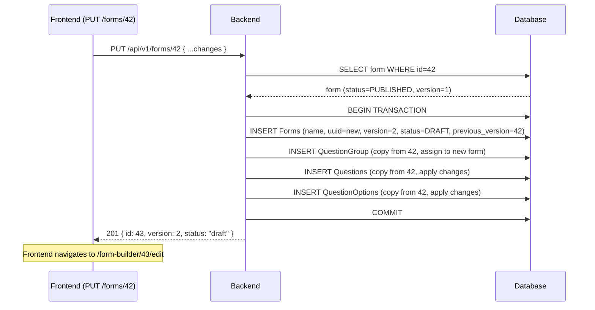

# Design: Form Builder Backend API

---

## Data Model Changes

### New Fields on `Forms`

```python
class FormStatus:
    draft = 1
    published = 2

    FieldStr = {
        draft: "draft",
        published: "published",
    }
```

Add to `Forms` model (`backend/api/v1/v1_forms/models.py`):

```python
status = models.IntegerField(
    choices=FormStatus.FieldStr.items(),
    default=FormStatus.draft,
)
published_at = models.DateTimeField(null=True, blank=True, default=None)
previous_version = models.ForeignKey(
    "self",
    on_delete=models.SET_NULL,
    related_name="next_versions",
    null=True,
    blank=True,
)
```

`previous_version` is separate from `parent` (which links monitoring forms to registration forms). The two FKs serve different concerns:

| FK | Purpose |
|---|---|
| `parent` | Registration ↔ Monitoring relationship (form type linkage) |
| `previous_version` | Version chain (form evolution over time) |

### Migration Strategy

```python
# Migration sets status = PUBLISHED for all existing rows
migrations.AddField(
    model_name='forms',
    name='status',
    field=models.IntegerField(
        default=2,  # PUBLISHED — existing forms are already live
        choices=...
    ),
)
migrations.AddField(
    model_name='forms',
    name='published_at',
    field=models.DateTimeField(null=True, blank=True, default=None),
)
migrations.AddField(
    model_name='forms',
    name='previous_version',
    field=models.ForeignKey(..., null=True, blank=True),
)
```

---

## API Contract

### URL Pattern Decision

Existing backend has a split pattern: `GET /api/v1/forms` (plural, list) and `GET /api/v1/form/{id}` (singular, detail/web). New CRUD endpoints use the **plural** pattern throughout:

| Method | URL | Purpose |
|---|---|---|
| `GET` | `/api/v1/forms` | List forms (existing, extended with `status`) |
| `POST` | `/api/v1/forms` | Create form (new) |
| `GET` | `/api/v1/forms/{id}` | Get form detail (new, mirrors `/form/{id}` + status) |
| `PUT` | `/api/v1/forms/{id}` | Update form or trigger version-on-edit (new) |
| `DELETE` | `/api/v1/forms/{id}` | Delete/archive form (new) |
| `POST` | `/api/v1/forms/{id}/publish` | Publish draft (new) |
| `POST` | `/api/v1/forms/{id}/duplicate` | Clone as new draft (new) |
| `GET` | `/api/v1/forms/{id}/versions` | List version chain (new) |
| `GET` | `/api/v1/form/{id}` | Form for web/mobile rendering (existing, **unchanged**) |
| `GET` | `/api/v1/form/web/{id}` | Webform with admin cascade (existing, **unchanged**) |

The singular `/api/v1/form/{id}` endpoint stays as-is because mobile apps and the web form submission page reference it directly. Breaking that URL would require a mobile app update.

### Request Payload: `FormCreateSerializer`

Accepts the output of the frontend `editorToApi()` transformer. This is the shared contract between the two specs:

```json
{
  "name": "Household Survey 2026",
  "type": "registration",
  "approval_instructions": null,
  "parent": null,
  "question_group": [
    {
      "id": null,
      "name": "Household Information",
      "label": null,
      "order": 1,
      "repeatable": false,
      "repeat_text": null,
      "question": [
        {
          "id": null,
          "order": 1,
          "label": "Head of Household Name",
          "short_label": null,
          "name": "head_of_household_name",
          "type": "input",
          "meta": true,
          "required": true,
          "rule": null,
          "dependency": null,
          "dependency_rule": "AND",
          "api": null,
          "extra": null,
          "tooltip": null,
          "fn": null,
          "pre": null,
          "display_only": false,
          "option": []
        }
      ]
    }
  ]
}
```

**Accepted `type` values**: `"registration"`, `"monitoring"`  
**Accepted question `type` values**: `"input"`, `"number"`, `"text"`, `"date"`, `"option"`, `"multiple_option"`, `"cascade"`, `"image"`, `"autofield"`, `"attachment"`, `"signature"`, `"geo"`, `"administration"`, `"entity"` (maps to `cascade`)

`"image"` is the canonical type name (aligned with `akvo-form-service` and the editor). The old `"photo"` string is no longer accepted — see D-3.

### Response Format: `FormDetailSerializer`

Extended from the existing `FormDataSerializer`, adds `status`, `version`, `published_at`. Questions include `disable_delete` (true when answers exist, null otherwise — following `akvo-form-service` pattern to let the editor disable the delete button):

```json
{
  "id": 42,
  "name": "Household Survey 2026",
  "version": 1,
  "status": "draft",
  "published_at": null,
  "type": 1,
  "approval_instructions": null,
  "parent": null,
  "question_group": [
    {
      "id": 1,
      "name": "Household Information",
      "question": [
        {
          "id": 10,
          "type": "input",
          "label": "Head of Household Name",
          "disable_delete": null
        },
        {
          "id": 11,
          "type": "number",
          "label": "Age",
          "disable_delete": true
        }
      ]
    }
  ]
}
```

### List Response (`GET /api/v1/forms`)

Extended `ListFormSerializer` adds `status` and `version` to each item:

```json
[
  {
    "id": 42,
    "name": "Household Survey 2026",
    "version": 1,
    "status": "draft",
    "type": 1
  }
]
```

---

## Version-on-Edit Strategy



The version chain:

```
Form #42 (version=1, status=PUBLISHED) ← previous_version ← Form #43 (version=2, status=DRAFT)
```

Existing `FormData` submissions still reference form `#42`. After the user is satisfied with `#43`, they publish it via `POST /api/v1/forms/43/publish`.

---

## Decision Log

### D-1: Version-on-Edit vs Lock-and-Edit

**Options considered**:
1. **Version-on-edit**: PUT on published form silently creates a new draft version
2. **Lock-and-edit**: Published form is locked; user must explicitly "create new version" before editing
3. **Reject**: Return `403` if trying to PUT a published form

**Decision**: Version-on-edit (option 1), returning `201` so the frontend knows a new form was created.

**Rationale**:
- Option 2 requires an extra UI step ("create new version") that adds friction without adding safety.
- Option 3 forces the user to navigate away and duplicate manually — same as option 2 but worse UX.
- Version-on-edit is transparent: the API contract (PUT returns 200 for draft, 201 for new version) lets the frontend navigate the user to the correct page automatically.
- The `201` status code signals to the frontend that `Location` is a different resource — a clear, idiomatic signal.

---

### D-2: `parent` FK vs `previous_version` FK — Separate Fields

**Why not reuse `parent`?**

The `parent` FK already has a defined meaning: it links a monitoring form to its registration form. Overloading it to also mean "previous version" would make queries ambiguous — e.g., "give me the monitoring form for form #42" and "give me the previous version of form #42" would use the same field for unrelated traversals.

**Decision**: Add a new `previous_version` FK.

---

### D-3: Rename `photo` → `image` in `QuestionTypes`

**Problem**: The akvo-mis backend constant is `QuestionTypes.photo = 8`. The `akvo-react-form-editor` emits `"image"`. The `akvo-form-service` reference implementation also uses `image = 8` as the canonical name.

**Decision**: **Rename `photo` → `image`** in `QuestionTypes` in akvo-mis.

- Change constant name: `photo = 8` → `image = 8`
- Change `FieldStr`: `{photo: "Photo"}` → `{image: "image"}`
- Update all usages of `QuestionTypes.photo` in the codebase (search + replace)
- No DB migration needed — the integer value `8` is unchanged in the database
- `"photo"` is no longer accepted as a type string in API payloads; `"image"` is canonical

**Impact on FB-003**: The frontend transformer `editorToApi()` needs no alias mapping — `"image"` passes through unchanged. Remove the `EDITOR_TYPE_ALIASES` for image.

---

### D-4: Delete Strategy — Reject if Submissions Exist

**Options considered**:
1. Hard delete (cascade)
2. Soft delete / archive status
3. Reject if submissions exist, hard delete otherwise

**Decision**: Option 3 — reject with `409 Conflict` if form has submissions; allow hard delete otherwise. Add `ARCHIVED` status only if explicitly requested.

**Rationale**:
- Hard cascade delete of a form with submissions would orphan or corrupt `FormData` records.
- A full archive/soft-delete pattern adds model complexity that is not required for #228's follow-up.
- The safest default: block deletion when data exists, allow it when the form is genuinely unused (draft never published).

---

### D-5: Unique Constraint on `(form, name)` for Groups and Questions

The database enforces `UNIQUE (form_id, name)` on both `question_group` and `question` tables. The editor may produce groups or questions with the same label but different names, or may not provide a `name` at all.

**Rule**:
- If `name` is not provided in the payload, the backend generates one: `slugify(label)` + positional suffix if collision (`_1`, `_2`, etc.).
- If `name` is provided and collides, return `400` with a clear error.
- The frontend should surface this as a named uniqueness error when it occurs.

---

### D-6: Plain Function Helpers Instead of Sub-Serializers

**Problem**: The initial spec proposed DRF sub-serializers (`AddQuestionGroupSerializer`, `AddQuestionSerializer`) for nested writes. However, this pattern adds extra indirection for a write-only path and couples serialization concerns with ORM mutation.

**Decision**: Use plain transaction-wrapped helper functions in `api/v1/v1_forms/functions.py`:

| Function | Purpose |
|---|---|
| `save_form(data, instance=None)` | Create a new DRAFT form or fully replace an existing DRAFT; atomic |
| `version_on_edit(original_form, data)` | Create a new DRAFT version of a PUBLISHED form; atomic |
| `duplicate_form(original_form)` | Deep copy any form as a new DRAFT; atomic |
| `validate_form_payload(data)` | Return list of error strings before touching the DB |

**Pattern** (`save_form`):
```python
@transaction.atomic
def save_form(data, instance=None):
    form_type = _form_type_str_to_int(data["type"])
    if instance is None:
        form = Forms.objects.create(name=data["name"], type=form_type, status=FormStatus.draft, ...)
    else:
        instance.name = data["name"]; instance.save(); form = instance

    for group_data in data.get("question_group", []):
        # update_or_create group via filter().update() + get() or create()
        _save_questions(group, group_data["question"], question_names)
    return form
```

**Benefit**: Validation (`validate_form_payload`) and mutation (`save_form`) are separate concerns. Views call `validate_form_payload` first, then `save_form`. The serializers layer (`FormDetailSerializer`) is read-only — no dual-role serializers.

---

### D-7: Protect Answered Questions/Groups from Deletion

**Problem**: Deleting a question or group that has existing `Answers` records would orphan data.

**Decision**: Follow the `akvo-form-service` pattern — check `Answers.objects.filter(question_id__in=qids).count()` before deleting any group or question. Raise `400` with a clear message if answers exist.

This applies to both:
- `PUT /api/v1/forms/{id}` — groups/questions removed from the payload
- `DELETE /api/v1/forms/{id}` — form-level delete (handled by the existing form-level `FormData` check)

**Error response**:
```json
{"message": "Can't delete question group", "details": "Question in group {id} has answers"}
{"message": "Can't delete question", "details": "Question {id} has answers"}
```

---

### D-8: Type Validation via `validate_form_payload`

**Decision**: Type validation lives in `validate_form_payload()` in `functions.py`, not in a DRF serializer:

```python
def validate_form_payload(data):
    """Return list of error strings, empty if valid."""
    errors = []
    if not data.get("name"):
        errors.append("name is required")
    if data.get("type") not in ("registration", "monitoring"):
        errors.append("type must be 'registration' or 'monitoring'")
    for gi, group in enumerate(data.get("question_group", [])):
        for qi, q in enumerate(group.get("question", [])):
            q_type = q.get("type", "")
            if getattr(QuestionTypes, q_type, None) is None:
                errors.append(
                    f"question_group[{gi}].question[{qi}].type: "
                    f"Invalid question type: {q_type!r}"
                )
    return errors
```

Views call `validate_form_payload(request.data)` before calling `save_form()`. Returns a list of error strings; callers return `400` with `errors[0]` on failure. The `getattr(QuestionTypes, q_type, None)` check requires exact attribute name match — same principle as the serializer approach, but without the DRF abstraction overhead.

---

## Alignment Notes with FB-003

The following changes in this spec require updates to the frontend mock (spec #228):

| Change | Impact on spec #228 |
|---|---|
| URL is `POST /api/v1/forms` (plural) | Update Group D (URL registration) and Group G (transformer/API calls) in `implementation-plan.md` |
| `PUT /api/v1/forms/{id}` may return `201` for published forms | `FormBuilderEdit.jsx` must handle both `200` (draft saved) and `201` (new version created) — navigate to `response.data.id` on success |
| Response includes `status` field | `FormBuilderList` should show status badge; `FormBuilderEdit` should show "Currently published — editing creates a new version" banner when `status === "published"` |
| `image` is only accepted type string | `"photo"` is rejected; FB-003 transformer passes `"image"` unchanged |
| `disable_delete` in question response | FB-003 editor reads this to disable delete button for answered questions |

These are reflected in the updated FB-003 spec.
