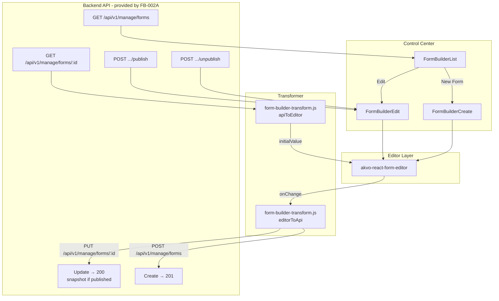
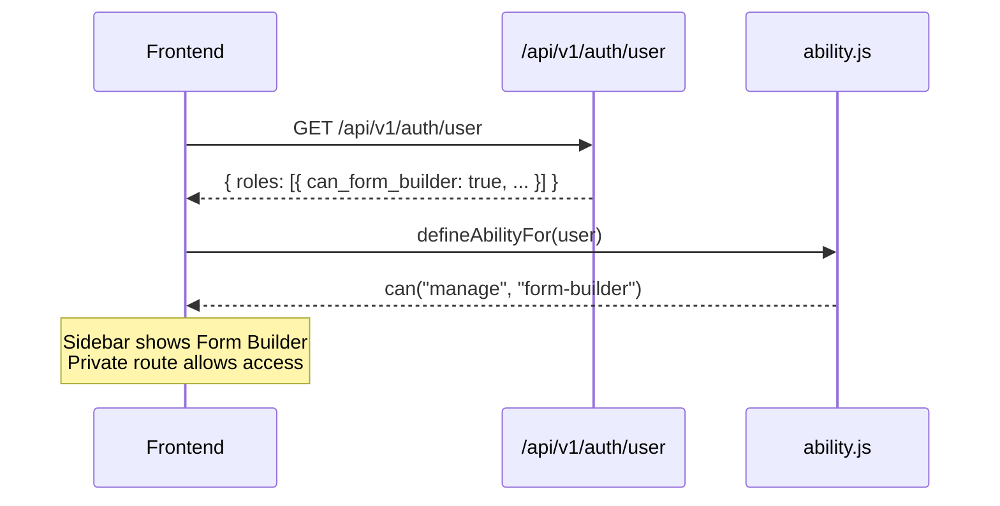

# Design: Form Builder Frontend Integration (FB-003)

**Issue**: #228
**Depends on**: [form-builder-backend-api](../form-builder-backend-api/README.md) (FB-002A)

---

## Architecture



---

## Permission Flow



---

## Save UX Flow (Edit — Published Form)

```mermaid
sequenceDiagram
    participant User
    participant FE as FormBuilderEdit
    participant API as Backend

    User->>FE: Opens form (status=published, version=1)
    FE->>FE: Shows info banner
    User->>FE: Makes changes, clicks Save
    FE->>API: PUT /api/v1/manage/forms/42
    API-->>FE: 200 { version: 1, latest_version: 2, status: "published" }
    note over API,FE: Snapshot v2 stored; active_version still v1
    FE->>FE: message.success("Form saved")
    FE->>FE: Update latest_version in local state

    User->>FE: Clicks Publish
    FE->>API: POST /api/v1/manage/forms/42/publish
    API-->>FE: 200 { version: 2, latest_version: 2, status: "published" }
    note over API,FE: active_version advanced to v2
    FE->>FE: message.success("Form published"), update version state
```

**Key invariant**: `version` = currently active snapshot version. `latest_version` = highest stored snapshot version. While `latest_version > version`, the published form serves the old content until the user explicitly publishes.

---

## Publish / Unpublish UX Flow

```mermaid
sequenceDiagram
    participant User
    participant FE as FormBuilderEdit
    participant API as Backend

    User->>FE: Clicks Unpublish (form is published)
    FE->>API: POST /api/v1/manage/forms/42/unpublish
    API-->>FE: 200 { status: "draft", ... }
    FE->>FE: Update status to "draft", hide Unpublish button

    User->>FE: Edits form, clicks Save (draft PUT - modifies live rows)
    FE->>API: PUT /api/v1/manage/forms/42
    API-->>FE: 200 { status: "draft", ... }

    User->>FE: Clicks Publish (re-publish after unpublish)
    FE->>API: POST /api/v1/manage/forms/42/publish
    API-->>FE: 200 { status: "published", published_at: "2026-...", version: 3 }
    note over API,FE: New snapshot created from live rows;<br/>published_at NOT overwritten
    FE->>FE: Update status to "published"
```

---

## Decision Log

### D-1: Navigate to `response.data.id` on Create Success

After a successful `POST /api/v1/manage/forms` (create), navigate to `/control-center/form-builder/${response.data.id}/edit`. `PUT` (edit save) always returns `200` with the same `id` — no navigation needed after save.

### D-2: No Mock Backend

FB-002A is the prerequisite. This branch calls real endpoints. No `msw`, `json-server`, or mock server.

**Impact**: This branch cannot be tested end-to-end until FB-002A is merged and deployed to dev.

### D-3: `image` is the Canonical Type — No Alias Needed

Both `akvo-react-form-editor` and the backend use `"image"`. `editorToApi()` passes it through unchanged.

### D-4: Auto-Save to localStorage

`WebformEditor` exposes only an `onSave` callback (triggered by the editor's built-in Save button). There is **no `onChange` event** — keystroke-level auto-save is not possible. Draft saves to localStorage happen inside the `onSave` handler with a 2 s debounce, providing crash/reload recovery.

Draft key pattern:
- Create page: `form-builder-draft-new`
- Edit page: `form-builder-draft-{formId}`

**Draft JSON shape**:
```json
{ "value": <editorOutput>, "savedAt": "<ISO timestamp>", "formVersion": <number> }
```

`formVersion` is the form's active version at draft-save time. Old drafts (before this field was added) omit it.

On successful API save (`200`): remove the draft key.

**Draft restore logic** (Edit page only):
1. Parse draft from localStorage.
2. If `draft.formVersion` is present AND differs from `apiData.version` → the form was published to a new version since the draft was saved. Remove the stale draft; load from API.
3. Otherwise, if `draft.savedAt > (apiData.published_at || "")` → use the draft; show dismissible Alert with message "We recovered your previous work — review it before saving." and a **"Load from server"** action button.
4. On "Load from server": clear localStorage draft, reload from API (skipping draft check), remount editor.

On version activation: clear the draft before reloading the editor.

**Why `typeof` check**: The `no-undefined` ESLint rule forbids referencing the `undefined` identifier. The implementation uses `typeof draft.formVersion !== "undefined"` instead of `draft.formVersion !== undefined`.

### D-5: Where CSS Is Imported

`akvo-react-form-editor/dist/index.css` is imported in `FormBuilderCreate.jsx` and `FormBuilderEdit.jsx`. Webpack deduplicates repeated CSS imports so there is no double-load.

### D-6: Snapshot vs In-Place for Published Forms

`PUT` on a published form does **not** touch live `QuestionGroup`/`Questions` rows. It stores a `FormPublishedVersion` snapshot. The active version only advances when the user explicitly calls `POST .../publish`. This means:

- The PUT response carries `version` (active, unchanged) and `latest_version` (incremented).
- The frontend should display `latest_version` as the "pending version" and `version` as the "live version".
- The info banner text should reflect this: "Changes saved as snapshot v{latest_version}. Click Publish to activate."

### D-7: Draft PUT vs Published PUT Behaviour

| Form status | What PUT does | Live rows change? | Snapshot created? |
|---|---|---|---|
| `draft` | Updates live rows in-place | ✅ Yes | ❌ No |
| `published` | Stores snapshot only | ❌ No | ✅ Yes |

The frontend does not need different code paths for draft vs published — the same `PUT` call works for both. The response shape is the same. The frontend reads `status` from the response to update its local state.

### D-8: Version History Drawer

`FormBuilderEdit` includes a lazy-loaded version history Drawer (implemented in FB-003; originally scoped to FB-003B):

- **Versions button** appears when `formStatus === "published"` or versions have already been fetched.
- Clicking opens a `Drawer` and calls `GET /manage/forms/{id}/versions` on demand.
- Drawer table: Version (Active badge), Published At, Published By, Set Active button.
- **Set Active** (non-active rows only): `POST /manage/forms/{id}/activate/{version_id}` → success clears localStorage draft, sets `initialValue = null`, re-fetches form via `loadForm(true)`, remounts editor with the activated version's content.
- `loadForm` is wrapped in `useCallback([formId])` to satisfy `react-hooks/exhaustive-deps` without any lint-disable comments.

### D-9: Version Preview — Editor Reload Pattern

When the user clicks **Preview** on a version row:

1. `previewLoadingId` is set to the version's `id` (shows spinner on that button).
2. The **previous `initialValue` is saved** in a local `prevValue` constant for error recovery.
3. **`setInitialValue(null)` is called immediately** — this causes the editor to unmount (Spin shown). This is required because `WebformEditor` ignores `initialValue` prop changes after mount; only a remount (null → non-null) reliably loads new content.
4. `GET /api/v1/manage/forms/{id}/versions/{version_id}` is fetched — returns `FormPublishedVersionSerializer` data + `schema` JSON field.
5. On success: the schema is passed to `apiToEditor()`, merged with current form-level metadata (`id`, `status`, etc.) from local state, and `setInitialValue(transformed)` triggers the remount.
6. On error: `setInitialValue(prevValue)` restores the previous editor state so the user doesn't lose their work; error notification shown.
7. Drawer closes (`setDrawerOpen(false)`).
8. `setPreviewingVersion({ id, version })` triggers a dismissible preview banner above the editor.
9. "Back to saved" button calls `loadForm(true)` (skips draft check, fetches real saved state) and clears `previewingVersion`.

**Why null-first**: `WebformEditor` from `akvo-react-form-editor` reads `initialValue` only on mount and ignores subsequent prop changes. Passing `null` removes the component from the DOM (the null guard renders `<Spin>` instead), and the next non-null `initialValue` triggers a fresh mount with the new content. The same pattern is used in `onActivateVersion` and `onExitPreview`.

**Why editor view, not Webform view**: The default tab in `WebformEditor` is the Editor tab. Showing the editor view is consistent with the page context — the user is already in a form-builder editing session.

**No Modal**: Closing the drawer and loading into the editor directly avoids a nested Modal-in-Drawer layout. The preview banner provides context that the current editor content is a snapshot, not the saved state.

**Active row highlight**: `rowClassName` on the Table applies a `.version-row-active` class to the active version row (green-1 background). No Preview button is rendered for the active row — it is already loaded in the editor.

### D-11: i18n — All Form Builder Strings in `ui-text.js`

All user-visible text in the form builder pages and sub-components is defined in `ui-text.js` under `formBuilder*` keys (plus `formBuilderStatusPublished`, `formBuilderStatusDraft`, `formBuilderResetDraft`). Dynamic strings use function keys:

```js
formBuilderPreviewingBanner: (v) => `Previewing snapshot v${v} — not the saved state.`,
formBuilderSnapshotPending:   (v) => `Changes saved as snapshot v${v}. Click Publish to activate.`,
formBuilderVersionActivated:  (n) => `Version ${n} is now active. Reloading editor…`,
formBuilderActivateVersionTitle: (v) => `Activate version ${v}?`,
```

The `text` object (derived from `uiText[activeLang]` via `useMemo`) is passed as a prop to `FormEditorBanners` and `VersionHistoryDrawer` so sub-components don't need their own language store subscriptions.

---

## Data Mapping

### camelCase → snake_case (Critical)

`akvo-react-form-editor` emits question fields in camelCase. The backend only reads snake_case. `editorToApi()` **must** normalize every question object:

```js
// editorToApi — question normalization
const normalizeQuestion = (q) => {
  const snake = camelToSnake(q);          // displayOnly→display_only, shortLabel→short_label, etc.
  snake.pre = snake.pre || null;          // normalize {} to null
  snake.name = snake.name || snakeCase(q.label);
  delete snake.question_group_id;        // editor extra, not a backend field
  return snake;
};
```

Key fields affected:

| Editor emits | Backend expects | `camelToSnake` handles it? |
|---|---|---|
| `displayOnly` | `display_only` | ✅ |
| `shortLabel` | `short_label` | ✅ |
| `dependencyRule` | `dependency_rule` | ✅ |
| `questionGroupId` | _(not a backend field, delete it)_ | delete manually |
| `pre: {}` | `pre: null` | normalize to null |

### Question Types: Editor String → API String

| Editor string | Sent to API as | Note |
|---|---|---|
| `input` | `input` | |
| `number` | `number` | |
| `text` | `text` | |
| `date` | `date` | |
| `option` | `option` | |
| `multiple_option` | `multiple_option` | |
| `cascade` | `cascade` | |
| `image` | `image` | canonical; both sides agree |
| `autofield` | `autofield` | |
| `attachment` | `attachment` | |
| `signature` | `signature` | |
| `geo` | `geo` | |
| `administration` | `administration` | |
| `entity` | `cascade` | Backend rejects `"entity"`; preserve `extra.type="entity"` |

### API Response → Editor Initial Value

`GET /api/v1/manage/forms/{id}` returns snake_case fields. `apiToEditor()` runs `snakeToCamel` on every question:

```
API field                       → Editor / page field
────────────────────────────────────────────────────────────
id                              → id
name                            → name
version                         → (page uses for "active version" badge)
latest_version                  → (page uses for "pending version" badge)
status                          → (page uses for info banner, publish button state)
published_at                    → (page uses; editor ignores)
active_version_id               → (page uses; editor ignores)
question_group[].id             → question_group[].id
question_group[].question[]     → snakeToCamel(question) — display_only→displayOnly
question[].type                 → cascade+extra.type=entity → "entity"
question[].option[]             → question[].option[]
```

---

## Frontend Component Structure

```
frontend/src/
├── pages/form-builder/
│   ├── FormBuilderList.jsx         — table with status badge, "New Form" button
│   ├── FormBuilderCreate.jsx       — editor + POST save + auto-save + draft restore
│   ├── FormBuilderEdit.jsx         — editor + PUT save + Publish + Unpublish
│   ├── style.scss                  — .version-row-active highlight rule
│   └── components/
│       ├── index.js                — barrel export
│       ├── FormStatusTag.jsx       — Published/Draft Tag (used in List)
│       ├── FormEditorBanners.jsx   — draft-restored / preview / info Alert group
│       └── VersionHistoryDrawer.jsx — version history Drawer + Table + actions
├── lib/
│   ├── form-builder-transform.js  — editorToApi(), apiToEditor() (pure JS)
│   └── ui-text.js                  — 40+ formBuilder* keys for all UI strings
└── components/can/
    └── ability.js                  — add can("manage", "form-builder") rule
```

### `FormEditorBanners` props

| Prop | Type | Required | Description |
|---|---|---|---|
| `draftRestored` | bool | ✅ | Show draft-recovered alert |
| `onDismissDraft` | func | ✅ | Called when alert is closed |
| `onResetDraft` | func | — | Shows "Load from server" action button; clears draft and reloads from API |
| `previewingVersion` | `{id, version}` or null | — | Show preview banner when set |
| `onExitPreview` | func | — | Called by "Back to saved" button |
| `infoBannerText` | string or null | — | Show info banner (e.g. snapshot-pending text) |
| `text` | uiText object | ✅ | Current language text map |
| `topSpacing` | bool | — | Adds `marginTop:16` to first alert (Create page context) |

### `VersionHistoryDrawer` props

`open`, `onClose`, `versions`, `loading`, `onRefresh`, `activatingId`, `previewLoadingId`, `onActivate(versionId, versionNumber)`, `onPreview(record)`, `text`

Pagination: `{ pageSize: 10, hideOnSinglePage: true }` — client-side, handles 99+ versions; hidden when ≤10 rows.
