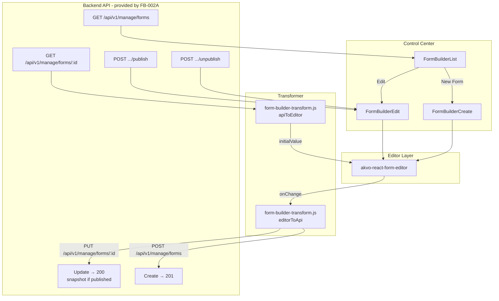
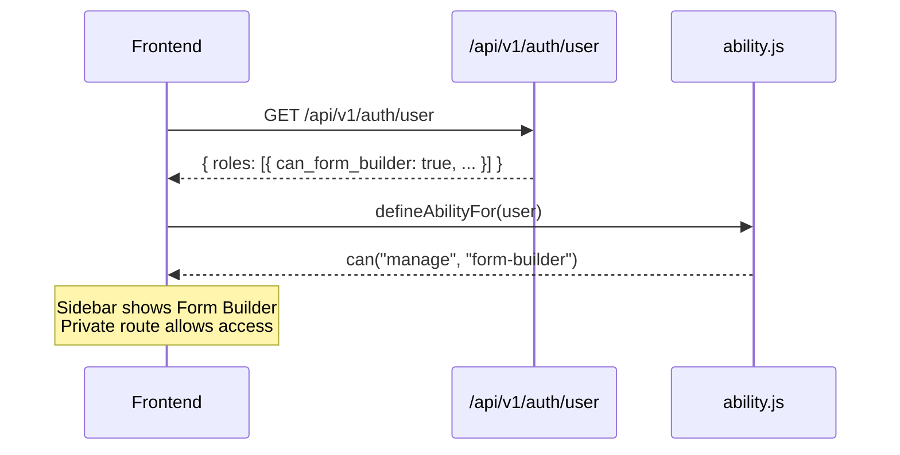

# Design: Form Builder Frontend Integration (FB-003)

**Issue**: #228
**Depends on**: [form-builder-backend-api](../form-builder-backend-api/README.md) (FB-002A)

---

## Architecture



---

## Permission Flow



---

## Save UX Flow (Edit — Published Form)

```mermaid
sequenceDiagram
    participant User
    participant FE as FormBuilderEdit
    participant API as Backend

    User->>FE: Opens form (status=published, version=1)
    FE->>FE: Shows info banner
    User->>FE: Makes changes, clicks Save
    FE->>API: PUT /api/v1/manage/forms/42
    API-->>FE: 200 { version: 1, latest_version: 2, status: "published" }
    note over API,FE: Snapshot v2 stored; active_version still v1
    FE->>FE: message.success("Form saved")
    FE->>FE: Update latest_version in local state

    User->>FE: Clicks Publish
    FE->>API: POST /api/v1/manage/forms/42/publish
    API-->>FE: 200 { version: 2, latest_version: 2, status: "published" }
    note over API,FE: active_version advanced to v2
    FE->>FE: message.success("Form published"), update version state
```

**Key invariant**: `version` = currently active snapshot version. `latest_version` = highest stored snapshot version. While `latest_version > version`, the published form serves the old content until the user explicitly publishes.

---

## Publish / Unpublish UX Flow

```mermaid
sequenceDiagram
    participant User
    participant FE as FormBuilderEdit
    participant API as Backend

    User->>FE: Clicks Unpublish (form is published)
    FE->>API: POST /api/v1/manage/forms/42/unpublish
    API-->>FE: 200 { status: "draft", ... }
    FE->>FE: Update status to "draft", hide Unpublish button

    User->>FE: Edits form, clicks Save (draft PUT - modifies live rows)
    FE->>API: PUT /api/v1/manage/forms/42
    API-->>FE: 200 { status: "draft", ... }

    User->>FE: Clicks Publish (re-publish after unpublish)
    FE->>API: POST /api/v1/manage/forms/42/publish
    API-->>FE: 200 { status: "published", published_at: "2026-...", version: 3 }
    note over API,FE: New snapshot created from live rows;<br/>published_at NOT overwritten
    FE->>FE: Update status to "published"
```

---

## Decision Log

### D-1: Navigate to `response.data.id` on Create Success

After a successful `POST /api/v1/manage/forms` (create), navigate to `/control-center/form-builder/${response.data.id}/edit`. `PUT` (edit save) always returns `200` with the same `id` — no navigation needed after save.

### D-2: No Mock Backend

FB-002A is the prerequisite. This branch calls real endpoints. No `msw`, `json-server`, or mock server.

**Impact**: This branch cannot be tested end-to-end until FB-002A is merged and deployed to dev.

### D-3: `image` is the Canonical Type — No Alias Needed

Both `akvo-react-form-editor` and the backend use `"image"`. `editorToApi()` passes it through unchanged.

### D-4: Auto-Save to localStorage

Editor state is auto-saved to localStorage after a 2 s debounce.

Draft key pattern:
- Create page: `form-builder-draft-new`
- Edit page: `form-builder-draft-{formId}`

On successful save (`200`): remove the draft key.
On successful publish: do **not** clear the draft — user may continue editing after publishing.

### D-5: Where CSS Is Imported

`akvo-react-form-editor/dist/index.css` is imported once in `App.js` (global) to avoid FOUC.

### D-6: Snapshot vs In-Place for Published Forms

`PUT` on a published form does **not** touch live `QuestionGroup`/`Questions` rows. It stores a `FormPublishedVersion` snapshot. The active version only advances when the user explicitly calls `POST .../publish`. This means:

- The PUT response carries `version` (active, unchanged) and `latest_version` (incremented).
- The frontend should display `latest_version` as the "pending version" and `version` as the "live version".
- The info banner text should reflect this: "Changes saved as snapshot v{latest_version}. Click Publish to activate."

### D-7: Draft PUT vs Published PUT Behaviour

| Form status | What PUT does | Live rows change? | Snapshot created? |
|---|---|---|---|
| `draft` | Updates live rows in-place | ✅ Yes | ❌ No |
| `published` | Stores snapshot only | ❌ No | ✅ Yes |

The frontend does not need different code paths for draft vs published — the same `PUT` call works for both. The response shape is the same. The frontend reads `status` from the response to update its local state.

---

## Data Mapping

### camelCase → snake_case (Critical)

`akvo-react-form-editor` emits question fields in camelCase. The backend only reads snake_case. `editorToApi()` **must** normalize every question object:

```js
// editorToApi — question normalization
const normalizeQuestion = (q) => {
  const snake = camelToSnake(q);          // displayOnly→display_only, shortLabel→short_label, etc.
  snake.pre = snake.pre || null;          // normalize {} to null
  snake.name = snake.name || snakeCase(q.label);
  delete snake.question_group_id;        // editor extra, not a backend field
  return snake;
};
```

Key fields affected:

| Editor emits | Backend expects | `camelToSnake` handles it? |
|---|---|---|
| `displayOnly` | `display_only` | ✅ |
| `shortLabel` | `short_label` | ✅ |
| `dependencyRule` | `dependency_rule` | ✅ |
| `questionGroupId` | _(not a backend field, delete it)_ | delete manually |
| `pre: {}` | `pre: null` | normalize to null |

### Question Types: Editor String → API String

| Editor string | Sent to API as | Note |
|---|---|---|
| `input` | `input` | |
| `number` | `number` | |
| `text` | `text` | |
| `date` | `date` | |
| `option` | `option` | |
| `multiple_option` | `multiple_option` | |
| `cascade` | `cascade` | |
| `image` | `image` | canonical; both sides agree |
| `autofield` | `autofield` | |
| `attachment` | `attachment` | |
| `signature` | `signature` | |
| `geo` | `geo` | |
| `administration` | `administration` | |
| `entity` | `cascade` | Backend rejects `"entity"`; preserve `extra.type="entity"` |

### API Response → Editor Initial Value

`GET /api/v1/manage/forms/{id}` returns snake_case fields. `apiToEditor()` runs `snakeToCamel` on every question:

```
API field                       → Editor / page field
────────────────────────────────────────────────────────────
id                              → id
name                            → name
version                         → (page uses for "active version" badge)
latest_version                  → (page uses for "pending version" badge)
status                          → (page uses for info banner, publish button state)
published_at                    → (page uses; editor ignores)
active_version_id               → (page uses; editor ignores)
question_group[].id             → question_group[].id
question_group[].question[]     → snakeToCamel(question) — display_only→displayOnly
question[].type                 → cascade+extra.type=entity → "entity"
question[].option[]             → question[].option[]
```

---

## Frontend Component Structure

```
frontend/src/
├── pages/form-builder/
│   ├── FormBuilderList.jsx         — table with status badge, "New Form" button
│   ├── FormBuilderCreate.jsx       — editor + POST save + auto-save
│   └── FormBuilderEdit.jsx         — editor + PUT save + Publish + Unpublish
├── lib/
│   └── form-builder-transform.js  — editorToApi(), apiToEditor() (pure JS)
└── components/can/
    └── ability.js                  — add can("manage", "form-builder") rule
```
