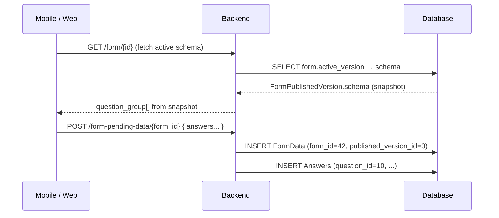

# Design: Form Schema Versioning (FB-002A)

**Depends on**: FB-002 (form builder backend CRUD API) merged  
**Related**: FB-003 (frontend integration), FB-009 (permission system UI)

---

## Problem

After FB-002, PUT always updates a form in-place. A published form's questions can be edited and deleted freely (with `allow_delete=true`). The `version` integer on `Forms` increments on every PUT, but there is no frozen snapshot of the question structure for any given version.

`FormData` currently only stores `form_id`. If a question is deleted after data was collected against it, the answer records become orphaned — the question row is gone and there is no way to reconstruct what the respondent was answering.

---

## Goal

1. At publish time, freeze the form's complete question structure as a snapshot (`FormPublishedVersion`).
2. `FormData` records reference the exact published version that was active when the submission was collected.
3. The form editor remains fully mutable — questions can be added, removed, and edited freely between publishes.
4. Users can choose which published version is "active" for new data collections (i.e., roll back to a previous version if needed).
5. Historical submissions can be browsed and rendered per version.

---

## Data Model

### Changes to `QuestionGroup` and `Questions` (done in feature/229 branch)

Both models extend the project-standard `SoftDeletes` mixin (`utils/soft_deletes_model.py`):

```python
from utils.soft_deletes_model import SoftDeletes

class QuestionGroup(SoftDeletes):
    ...

class Questions(SoftDeletes):
    ...
```

The mixin adds `deleted_at = DateTimeField(null=True)` and provides:
- `objects` — default manager, auto-filters `deleted_at__isnull=True` (active rows only)
- `objects_deleted` — only deleted rows
- `objects_with_deleted` — all rows
- `.soft_delete()` — sets `deleted_at = now()`
- `.hard_delete()` — removes the row permanently
- `.restore()` — clears `deleted_at`

The old `unique_together` constraint and named `UniqueConstraint` on `(form, name)` are replaced by a conditional constraint:

```python
models.UniqueConstraint(
    fields=["form", "name"],
    condition=models.Q(deleted_at__isnull=True),
    name="unique_active_form_question_group",  # or unique_active_form_question
)
```

This allows a soft-deleted row to share a name with a new active row.

Migration: `0008_remove_questiongroup_unique_form_question_group_and_more.py` (adds `deleted_at DateTimeField(null=True)`, removes old constraints, adds conditional ones).

---

### New model: `FormPublishedVersion`

```python
class FormPublishedVersion(models.Model):
    form = models.ForeignKey(
        Forms,
        on_delete=models.CASCADE,
        related_name="published_versions",
    )
    version = models.IntegerField()          # auto-increment per form
    schema = models.JSONField()              # complete snapshot (see below)
    published_at = models.DateTimeField(auto_now_add=True)
    published_by = models.ForeignKey(
        "v1_users.SystemUser",
        on_delete=models.SET_NULL,
        null=True,
    )

    class Meta:
        unique_together = ("form", "version")
        ordering = ["form", "version"]
```

### Changes to `Forms`

Add one new FK:

```python
active_version = models.ForeignKey(
    "FormPublishedVersion",
    on_delete=models.SET_NULL,
    related_name="active_for_forms",
    null=True,
    blank=True,
    default=None,
)
```

`active_version` is `null` while the form is a draft (no published version yet). It points to the `FormPublishedVersion` that is currently used for new data collections.

`Forms.version` (existing `IntegerField`) is now always kept in sync with the latest `FormPublishedVersion.version` by `create_published_version`. It is **not** incremented in `save_form` — only `create_published_version` manages it.

### Changes to `FormData`

Add one new FK:

```python
published_version = models.ForeignKey(
    "v1_forms.FormPublishedVersion",
    on_delete=models.SET_NULL,
    related_name="form_data",
    null=True,
    blank=True,
    default=None,
)
```

`null` for submissions collected before FB-002A was deployed (backward compat — treated as "schema unknown").

---

## Schema Snapshot Format

`FormPublishedVersion.schema` captures the complete form state at the time of the snapshot. It is immutable once created.

**Sources**:
- Created by `create_published_version` (first publish): built from live DB rows via `_build_schema_snapshot` — always accurate.
- Created by `store_version_snapshot` (PUT on published): built from the normalized PUT payload. Missing fields inherit from the current active version's schema.

```json
{
  "version": 2,
  "name": "Household Survey 2026",
  "approval_instructions": null,
  "question_group": [
    {
      "id": 1,
      "name": "household_info",
      "label": "Household Information",
      "order": 1,
      "repeatable": false,
      "repeat_text": null,
      "question": [
        {
          "id": 10,
          "order": 1,
          "name": "head_of_household",
          "label": "Head of Household",
          "short_label": null,
          "type": "input",
          "meta": true,
          "required": true,
          "rule": null,
          "dependency": null,
          "dependency_rule": "AND",
          "api": null,
          "extra": null,
          "tooltip": null,
          "fn": null,
          "pre": null,
          "display_only": false,
          "option": []
        }
      ]
    }
  ]
}
```

The snapshot intentionally omits `disable_delete` — that is a live-editor concern, not a submission-rendering concern.

---

## API Contract

### Existing endpoint changes

| Endpoint | Change |
|---|---|
| `POST /api/v1/manage/forms/{id}/publish` | Now creates `FormPublishedVersion`, sets `active_version`, returns updated form with `active_version_id` |
| `GET /api/v1/manage/forms/{id}` | Response now includes `active_version_id` |
| `POST /api/v1/form-pending-data/{form_id}` | Sets `published_version_id = form.active_version_id` on the new `FormData` record |

### New endpoints

| Method | URL | Purpose |
|---|---|---|
| `POST` | `/api/v1/manage/forms/{id}/activate/{version_id}` | Set `active_version` to a specific `FormPublishedVersion` |

### Modified endpoints

`GET /api/v1/manage/forms/{id}/versions` — **reused** to return `FormPublishedVersion` records.

Current implementation walks the `previous_version` FK chain (now obsolete — `previous_version` is never set after FB-002). After FB-002A it returns all `FormPublishedVersion` rows for the form, ordered by `version`.

**Response after FB-002A**:
```json
[
  {
    "id": 1,
    "version": 1,
    "published_at": "2026-05-01T08:00:00Z",
    "published_by": "admin@akvo.org",
    "is_active": false
  },
  {
    "id": 3,
    "version": 2,
    "published_at": "2026-06-03T10:00:00Z",
    "published_by": "admin@akvo.org",
    "is_active": true
  }
]
```

`FormVersionSerializer` (currently serializes `Forms` objects) is replaced by `FormPublishedVersionSerializer`.

#### `POST .../activate/{version_id}` response

Returns the updated `FormDetailSerializer` response with `active_version_id` set to the chosen version. The editor uses this to roll back to any previously published version without editing questions.

---

## Lifecycle

```mermaid
sequenceDiagram
    participant Editor as Form Editor
    participant BE as Backend
    participant DB as Database

    Editor->>BE: POST /manage/forms (create draft)
    BE->>DB: INSERT Forms (status=draft, active_version=null)

    Editor->>BE: PUT /manage/forms/{id} (edit questions, draft)
    BE->>DB: UPDATE Forms in-place (version unchanged while draft)

    Editor->>BE: POST /manage/forms/{id}/publish
    BE->>DB: INSERT FormPublishedVersion (version=1, schema=snapshot)
    BE->>DB: UPDATE Forms SET active_version=pv, version=1, status=published, published_at=now

    Editor->>BE: PUT /manage/forms/{id} (edit questions)
    note over BE,DB: Published → snapshot-only path (live rows untouched)
    BE->>DB: INSERT FormPublishedVersion (version=2, schema=payload)
    note over BE,DB: active_version still = pv_1; live rows unchanged

    Editor->>BE: POST /manage/forms/{id}/publish (make edits live)
    BE->>DB: Two-pass restore_from_snapshot(form, pv_2)
    BE->>DB: Apply v2 schema to live rows
    BE->>DB: UPDATE Forms SET active_version=pv_2, version=2, name=v2.name
    note over DB: New submissions now use version 2 schema

    Editor->>BE: POST /manage/forms/{id}/activate/{version_1_id}
    BE->>DB: Two-pass restore_from_snapshot(form, pv_1)
    BE->>DB: Apply v1 schema to live rows
    BE->>DB: UPDATE Forms SET active_version=pv_1, version=1, name=v1.name
    note over DB: Rolled back — new submissions use version 1 schema
```

---

## Data Collection Flow



The web form endpoint (`GET /api/v1/form/web/{id}`) and mobile endpoint (`GET /api/v1/form/{id}`) should both serve the schema from `form.active_version.schema` instead of the live question tables. This ensures the form rendered to the user exactly matches what is stored in the snapshot used for their submission.

---

## Historical Submissions

`FormData.published_version_id` enables:

- **Filter by version**: `GET /api/v1/data?form_id=42&version=1` — all submissions collected under version 1
- **Render correctly**: Use `published_version.schema` to look up question labels/types for an old submission's answers, even if those questions have since been deleted from the live tables
- **Audit trail**: Know exactly which question schema was active for any given submission

---

## `allow_delete` and Soft-Delete

`PUT /manage/forms/{id}` with `allow_delete: true` now **soft-deletes** questions and groups (sets `is_deleted=True`) instead of removing rows. This is the central design enabling version rollback:

| `allow_delete` | Question has no answers | Question has answers |
|---|---|---|
| `false` (default) | Hard-delete the question row (`.hard_delete()`) | Return `400 "Can't delete question"` |
| `true` | Soft-delete — sets `deleted_at = now()` (`.soft_delete()`) | Soft-delete — sets `deleted_at = now()` (`.soft_delete()`) |

Soft-deleted rows are:
- Invisible to the form editor and all serializer responses (`deleted_at__isnull=True` filter)
- Preserved in DB so existing `Answers` FKs remain valid
- Captured in any `FormPublishedVersion` snapshots that were created before deletion
- **Not** captured in new snapshots (created after soft-delete) — `_build_schema_snapshot` filters `deleted_at__isnull=True`

If you roll back to a published version that included a now-soft-deleted question, the `active_version.schema` still contains that question's definition, so the data collection form renders it correctly. New `Answers` can reference the soft-deleted question's ID because the row still exists.

Until FB-002A is deployed, `allow_delete=true` should be restricted to superusers in the UI (FB-003/FB-009).

---

## Impact on Existing Code

| File | Change | Status |
|---|---|---|
| `v1_forms/models.py` | `QuestionGroup`/`Questions` extend `SoftDeletes` mixin (`deleted_at`). Conditional unique constraints. `FormPublishedVersion` model. `Forms.active_version` FK | ✅ Done |
| `v1_data/models.py` | `published_version` nullable FK to `FormPublishedVersion` on `FormData` | ✅ Done |
| `v1_forms/migrations/0008_*` | `deleted_at DateTimeField(null=True)` + conditional constraint changes | ✅ Done |
| `v1_forms/migrations/0009_*` | `FormPublishedVersion` table, `Forms.active_version` FK | ✅ Done |
| `v1_data/migrations/0004_*` | `FormData.published_version` FK | ✅ Done |
| `v1_forms/functions.py` | `_build_schema_snapshot` with `prefetch_related` (3 queries); `store_version_snapshot` (PUT payload → snapshot, no live row changes); `create_published_version(activate=False/True)`; `restore_from_snapshot` with `qs.restore()` pattern (handles editor-generated IDs) + restores `name`/`approval_instructions` | ✅ Done |
| `v1_forms/serializers.py` | `deleted_at__isnull=True` on all querysets; `FormPublishedVersionSerializer`; `FormDetailSerializer` with `latest_version` field | ✅ Done |
| `v1_forms/views.py` | `_normalize_editor_payload`; `_form_detail_from_snapshot` helper (3 DB queries, batch disable_delete); `update` calls `store_version_snapshot` for published forms; `retrieve` returns latest snapshot for published forms; `publish` activates latest snapshot for already-published; `activate` calls `restore_from_snapshot`; versioned cache keys | ⏳ Pending |
| `v1_forms/tests/` | Split into `tests_manage_form_update`, `tests_manage_form_soft_delete`, `tests_manage_form_publish` | ✅ Done (need update for new PUT semantics) |
| `v1_data/views.py` | Set `published_version_id` on `FormData` create | ⏳ Pending (Group G) |
| `web_form_details` / `form_data` | Unchanged — serve live rows (which always = active version) | ✅ No change needed |
| Mobile `generate_sqlite` | Use `active_version.schema` JSON as question source | ⏳ Future sub-task |

---

## Migration Strategy

1. Add `FormPublishedVersion` table (no data migration needed — table starts empty).
2. Add `Forms.active_version` nullable FK (default null — all existing forms treated as having no snapshot).
3. Add `FormData.published_version` nullable FK (default null — existing submissions treated as "schema unknown").
4. Existing seeded/live forms with `status=published` remain functional: `active_version=null` → fall back to live question tables for rendering (backward compat until they are republished with FB-002A active).

---

## Decisions

| # | Decision |
|---|---|
| D-1 | Web/mobile form endpoints (`GET /api/v1/form/{id}`, `GET /api/v1/form/web/{id}`) return `404` when `active_version` is null. Draft forms are not accessible for data collection until published. |
| D-2 | `active_version` changes only in two cases: (1) first publish (draft→published), (2) explicit `activate()`. `PUT` on a published form creates a snapshot for history but does NOT touch `active_version` or live rows. `POST .../publish` on an already-published form activates the latest existing snapshot (no new snapshot created) — semantics: "make my pending PUT edits live". |
| D-3 | `GET /manage/forms/{id}/versions` is reused to list `FormPublishedVersion` records. No new endpoint needed. `FormVersionSerializer` is replaced by `FormPublishedVersionSerializer`. Published version count is unlimited. |
| D-4 | `allow_delete=true` on PUT triggers **soft-delete** (`deleted_at = now()`) via the `SoftDeletes` mixin instead of hard-delete. Soft-deleted rows are invisible to all read paths but remain in DB to preserve `Answers` FK validity and enable version rollback. Questions without answers are hard-deleted when `allow_delete=false` (default). See "allow_delete and Soft-Delete" section. |
| D-5 | `POST /activate/{version_id}` calls `restore_from_snapshot(form, pv)` — a two-pass structural restore. Pass 2 now uses `qs.restore()` before updating: if `restore()` returns 0 (ID not in DB — e.g. an editor-generated timestamp ID from a PUT snapshot), the row is created instead. This ensures any snapshot can be activated regardless of whether its question IDs exist in the live tables. |
| D-6 | Live rows (`QuestionGroup`, `Questions`, `QuestionOptions`) are the single source of truth for data collection and always equal the active version's schema. `store_version_snapshot` (PUT) only adds rows to `FormPublishedVersion` — never modifies live tables. This means `web_form_details` and `form_data` endpoints need no special snapshot-routing logic; they read live rows as before. |
| D-7 | **Publish / Unpublish reuses `status` — no new column.** `unpublish` action: (1) auto-activates the latest snapshot if there are unactivated PUT snapshots (ensures live rows = latest intended state), then (2) sets `status=draft`. While unpublished, the form is hidden from data collection and editable via draft PUT. `publish` action handles all draft→published transitions: first publish creates snapshot + sets published_at; re-publish after unpublish creates new snapshot from live rows but does NOT overwrite published_at (guard: `form.published_at is None`). `create_published_version` handles the published_at guard and, when `activate=True`, also restores `status=published` if the form is currently draft. |
