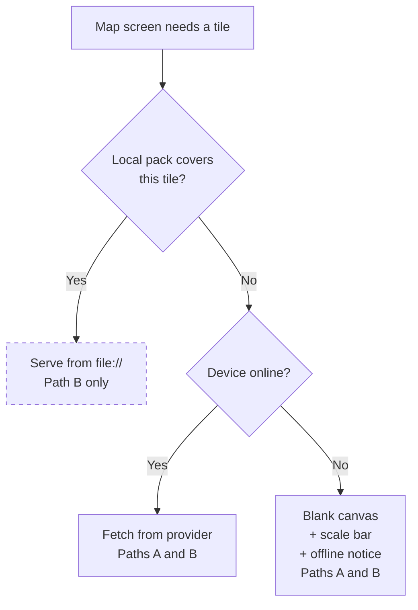

# Offline Satellite Imagery — Path Plan (Q1)

**Status**: Decision pending. Product/procurement call, not an engineering one.
**Parent**: [offline-polygon-validation-requirements.md](./offline-polygon-validation-requirements.md) — resolves its open question **Q1**.
**Scope**: What sits *beneath* the polygons on the FR-6 map review screen. Nothing else.

---

## 1. Why This Is a Separate Decision

Imagery is a **comprehension aid, not a correctness input**. Both paths below deliver every
other requirement in the parent spec identically:

| Concern | Affected by this decision? |
|---|---|
| Overlap detection maths (FR-3) | ❌ No |
| Blocking / submit gate (FR-4) | ❌ No |
| Error messages (FR-4.1) | ❌ No |
| Polygon capture (FR-1) | ❌ No |
| Geometry index (FR-7) | ❌ No |
| Background auto-record (FR-8) | ❌ No |
| **What the enumerator sees under the polygons (FR-6.5/6.6)** | ✅ **Yes — only this** |

A wrong choice here delays or inflates the map screen. It cannot make the validation wrong.
That is why it is safe to defer, and why it should not gate the rest of the build.

---

## 2. What the Acceptance Criteria Actually Demand

From the reference validator's `docs/basic-polygon-overlap-validation.md`, Scenarios 1 and 2,
verbatim:

> **Then** I should see the overlap in the validation app overlaid on a **high resolution
> satellite view** of the area
> **And** I should be able to select overlapping plots to see the farmer name for each

Two distinct demands, and they are **not** equally hard:

| Demand | Path A | Path B |
|---|---|---|
| See the overlap | ✅ | ✅ |
| Select a plot, see its name | ✅ | ✅ |
| **Overlaid on satellite imagery — offline** | ❌ | ✅ |

Path A meets the AC when online and misses one clause when offline. This is the entire
substance of the decision.

---

## 3. Path A — Polygons-Only Offline

**Current parent-spec position (D1 + D4).** The WebView Leaflet map fetches a satellite
basemap when online. Offline, tiles fail and polygons render on a plain background with a
scale bar, north arrow, and an explicit "satellite imagery unavailable offline" notice.

**Scope**: FR-6 exactly as already written, including FR-6.6. No additional requirements.

| Dimension | Assessment |
|---|---|
| New dependencies | None beyond `react-native-webview` (installed) and the geometry library (parent DEP-2) |
| Licensing | None — online tiles only, standard attribution |
| Device storage | ~0 |
| Offline experience | Correct geometry, correct names, correct overlap — **no ground truth** |
| Residual risk | Parent RISK-3 stands: one AC clause unmet offline |

### Where Path A is genuinely weak

An enumerator sees *that* polygon A intersects polygon B, but not *why*. They cannot see that
a river, track, ridge, or treeline runs between the two plots. For settling a real boundary
dispute with a farmer standing next to them, that context is often the whole point of opening
the map.

Path A answers "is there a conflict?" It does not answer "who is right?"

---

## 4. Path B — Pre-Downloaded Offline Imagery

Satellite raster tiles for a chosen area are downloaded on wifi, stored via `expo-file-system`,
and served to the **same** WebView Leaflet map from local files.

**Critically: still no native map SDK.** Leaflet accepts a `file://` tile URL template exactly
as it accepts a remote one, so parent decision D4 and the whole §3.1 component split survive
untouched. Path B is an extension of Path A, not a replacement.

### Additional requirements over Path A

- **FR-B1** Settings screen to download imagery for a selected administration area.
- **FR-B2** Download is explicit and wifi-aware — never automatic, never on mobile data.
- **FR-B3** Progress, cancel, and resume for a long multi-hundred-megabyte transfer.
- **FR-B4** Per-area storage displayed, with delete; a storage cap and eviction policy.
- **FR-B5** Tile resolution order: **local pack → network → Path A blank canvas.**
- **FR-B6** Downloaded imagery carries a capture date where the provider exposes one, feeding
  the FR-6.7 staleness disclaimer.
- **FR-B7** Tile packs survive app upgrade; a routine update must not wipe them.
- **FR-B8** A partially-downloaded area is never presented as complete — the map must not show
  blank tiles inside a region the user believes is downloaded.

| Dimension | Assessment |
|---|---|
| New dependencies | None *new*, but substantial work in `expo-file-system` and download orchestration |
| Licensing | ⚠️ **The actual blocker — §5** |
| Device storage | ~50–100 MB per area at z15–18 (the reference validator's estimate) |
| Offline experience | Full ground context — satisfies the AC wording |
| Residual risk | Licensing, storage operations, download UX on poor connectivity |

---

## 5. The Real Blocker: Licensing, Not Code

Serving local tiles to Leaflet is straightforward. **Obtaining tiles you may legally store is
not.**

| Provider | Bulk offline caching | Notes |
|---|---|---|
| OpenStreetMap standard tiles | ❌ **Prohibited** by the tile usage policy | Also not satellite — irrelevant here regardless |
| Mapbox raster tiles | ⚠️ Offline permitted **only via their SDKs** | Exactly what D4 avoids — forces Path B′ |
| Esri World Imagery | ⚠️ Offline permitted **on specific paid plans** | Viable route; terms must be confirmed |
| MapTiler Satellite | ⚠️ Offline permitted **on specific paid plans** | Viable route; terms must be confirmed |
| Google satellite | ❌ No offline redistribution | Not available at any tier |
| Bing Maps Aerial | ⚠️ Enterprise agreement dependent | Confirm before assuming |

**Path B must not be committed to until a provider and plan are confirmed in writing.** The
engineering estimate is meaningless until that is settled, because the answer determines
whether Path B or Path B′ is what actually gets built.

The reference validator resolved this by adopting the Mapbox SDK plus a `MAPBOX_DOWNLOADS_TOKEN` — i.e.
it took Path B′ and reversed the equivalent of D4.

---

## 6. Path B′ — If Licensing Forces a Native SDK

If the chosen provider permits offline packs only through its own SDK, Path B collapses into
Path B′: adopt the native map SDK and its offline tile store, matching the reference validator.

**What changes:**

- Parent §3.1's WebView split is **discarded**; the map screen is rebuilt with native components.
- `GeoGeometry`, `RecordedMarkers`, `GeoDrawingMapHandlers` no longer collapse into a WebView
  page — they become native map overlays.
- The RN↔WebView `postMessage` bridge (parent RISK-6) **disappears** — a genuine simplification.
- New: SDK licence cost, token handling in the build, a larger FR-6 rewrite.

**Important nuance**: parent decision D8 (background auto-record) already forces a development
build, so the *build-tooling* objection to a native module is **already spent**. What remains
against B′ is licence cost and rewrite scope — not "we'd need a dev client."

This means B′ is **less unattractive than it looks at first glance**, and it should be
re-evaluated on its merits rather than dismissed on D4's original reasoning.

---

## 7. The Seam That Keeps Both Paths Open

Path A is a strict subset of Path B. Building FR-B5's resolution order **from day one** — even
with only two of its three branches implemented — makes imagery a later configuration change
rather than a refactor.

**Ship Path A** = implement the resolver with the dashed branch stubbed to always miss.
**Add Path B later** = implement the local-pack branch plus FR-B1–B8. Nothing else moves.

What must be true for this seam to hold:

- The map's tile URL is produced by **one function**, never hardcoded in the Leaflet page.
- That function is given the current viewport and returns a template — local or remote.
- The offline-notice state (FR-6.6) is driven by the resolver's outcome, not by a
  network-connectivity check.

If those three hold, the Path A → Path B upgrade touches one module.

---

## 8. Decision Matrix

| Criterion | Path A | Path B | Path B′ |
|---|---|---|---|
| Meets AC offline | ❌ | ✅ | ✅ |
| Licensing dependency | None | **Blocking** | **Blocking** |
| Preserves D4 (no native map SDK) | ✅ | ✅ | ❌ |
| Preserves §3.1 WebView split | ✅ | ✅ | ❌ |
| Eliminates RISK-6 (postMessage bridge) | ❌ | ❌ | ✅ |
| Device storage cost | ~0 | 50–100 MB/area | 50–100 MB/area |
| New subsystem to build | None | Download + storage mgmt | SDK integration + offline mgr |
| Can ship without a procurement decision | ✅ | ❌ | ❌ |
| Recoverable if the choice is wrong | ✅ upgrade path | ✅ | ⚠️ larger rewrite to undo |

---

## 9. Recommendation

**Ship Path A. Build the §7 seam. Decide B vs B′ in parallel.**

Reasoning:

1. **Path B is not blocked on engineering.** It is blocked on a licensing decision that can
   proceed in parallel and gates no other requirement in the parent spec.
2. **Path A is a strict subset.** With the §7 resolver in place, adding imagery later changes
   one module — no rework of validation, capture, storage, or the RN↔WebView bridge.
3. **Correctness never depended on imagery.** Blocking, error messages, and overlap maths are
   identical across all three paths. Path A already satisfies "prevented from continuing until
   the problem is resolved."
4. **The riskiest unknowns are elsewhere** — the RN↔WebView bridge (RISK-6) and background
   location (D8). Adding a tile-download subsystem to the first release compounds two
   already-unproven areas.
5. **Field evidence beats speculation.** Shipping A tells you whether enumerators actually hit
   the "I can't tell why these overlap" wall, or whether geometry alone resolves most disputes.
   That evidence should inform whether B is worth its licence cost.

### Phasing

| Phase | Content | Gated on |
|---|---|---|
| **1** | Path A + §7 resolver seam | Nothing — proceed now |
| **2** *(parallel, non-blocking)* | Confirm provider, plan, and offline terms in writing | Product / procurement |
| **3** | Path B (local-pack branch + FR-B1–B8) **or** Path B′ (native SDK) | Phase 2 outcome |

Phase 3's shape is chosen by Phase 2's answer, not by engineering preference.

---

## 10. Decisions Needed

| # | Question | Owner | Blocks |
|---|---|---|---|
| 1 | Is a polygons-only offline map acceptable for MVP? | Product | Phase 1 scope |
| 2 | Is there budget and appetite for a commercial imagery licence permitting offline packs? | Product / procurement | Phase 3 existence |
| 3 | If yes — does the provider allow offline tiles **without** mandating their SDK? | Engineering, once the provider is known | **Path B vs B′** |
| 4 | Which administration level is the download unit? (region / district / custom bbox) | Product + Engineering | FR-B1, storage math |
| 5 | What is the per-device storage cap, and what is the eviction policy at the cap? | Product | FR-B4 |

Decision 3 is the pivotal one: it alone determines whether D4 survives.

---

## 11. To Verify Before Committing to Path B

Not yet established — do not treat any of these as known:

- **Actual tile count and byte size** for one representative area at z15–18. The 50–100 MB
  figure is inherited from the reference validator's context, not measured for ours.
- **Download duration** over a realistic field-office connection, which drives whether FR-B3's
  resume is a nicety or a necessity.
- **WebView `file://` tile access** under Android's scoped storage in a release build — it
  works in principle, but the exact `expo-file-system` directory and WebView origin settings
  need a spike.
- **Provider terms in writing**, not a marketing page. §5's table is a starting point for that
  conversation, not a substitute for it.
- **Whether enumerators actually need imagery**, from Path A field use. This is the cheapest
  evidence available and it arrives free with Phase 1.
