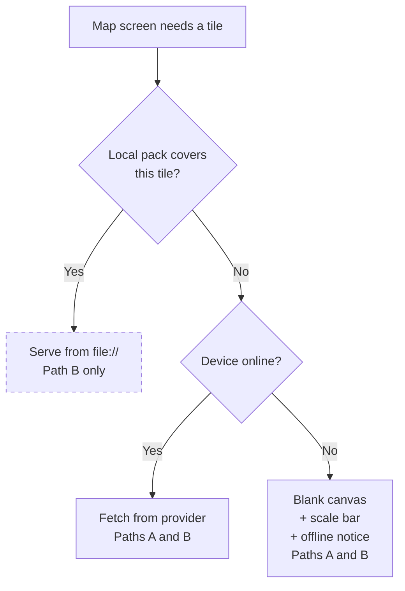

# Offline Satellite Imagery — Path Plan (Q1)

**Status**: Phase 1 **built**; offline imagery still a pending product/procurement decision.
**Updated 2026-09-25.** Decision 1 was answered on 2026-09-24: Path A ships. GEO-008 is **Built**.
Its map review screen and the §7 resolver seam exist. Only the offline tile subsystem itself is
unbuilt:

| Piece | State | Where |
|---|---|---|
| Map review screen (FR-6), Path A offline behaviour | ✅ Built — GEO-008 | `app/src/pages/OverlapMapView.js` |
| §7 resolver seam: one tile source for all three map screens | ✅ Built — GEO-008 | `app/src/lib/map-tiles.js` → `{{tileUrl}}` in `app/assets/map-draw.html` |
| Offline notice driven by the resolver, not connectivity | ✅ Built — GEO-008 | `hasTiles` from `currentTileSource` |
| Satellite basemap **online** | ❌ Not built — OSM street tiles until a provider is chosen | `NETWORK_TILE_TEMPLATE` in `map-tiles.js` (§12.3) |
| `file://` tile spike | ❌ Not run | §12.1 |
| Offline tile subsystem: local-pack lookup, download, storage (FR-B1–B8) | ❌ Not built — gated on licensing | §7 integration point, §12.4–12.5 |

**Anyone starting Phase 3 should begin at the §7 integration point**, not build a second tile
path. One premise has also weakened: see the **⚠️ note in §6**.

**Parent**: [offline-polygon-validation-requirements.md](./offline-polygon-validation-requirements.md) — resolves its open question **Q1**.
**Scope**: What sits *beneath* the polygons on the FR-6 map review screen. Nothing else.

---

## 1. Why This Is a Separate Decision

Imagery is a **comprehension aid, not a correctness input**. Both paths below deliver every
other requirement in the parent spec identically:

| Concern | Affected by this decision? |
|---|---|
| Overlap detection maths (FR-3) | ❌ No |
| Blocking / submit gate (FR-4) | ❌ No |
| Error messages (FR-4.1, now GEO-007 D-11) | ❌ No |
| Polygon capture (FR-1) | ❌ No |
| Geometry index (FR-7) | ❌ No |
| Background auto-record (FR-8) | ❌ No |
| **What the enumerator sees under the polygons (FR-6.5/6.6)** | ✅ **Yes — only this** |

A wrong choice here delays or inflates the map screen. It cannot make the validation wrong.
That is why it is safe to defer, and why it should not gate the rest of the build.

---

## 2. What the Acceptance Criteria Actually Demand

From the reference validator's `docs/basic-polygon-overlap-validation.md`, Scenarios 1 and 2,
verbatim:

> **Then** I should see the overlap in the validation app overlaid on a **high resolution
> satellite view** of the area
> **And** I should be able to select overlapping plots to see the farmer name for each

Two distinct demands, and they are **not** equally hard:

| Demand | Path A | Path B |
|---|---|---|
| See the overlap | ✅ | ✅ |
| Select a plot, see its name | ✅ | ✅ |
| **Overlaid on satellite imagery — offline** | ❌ | ✅ |

Path A meets the AC when online and misses one clause when offline. This is the entire
substance of the decision.

---

## 3. Path A — Polygons-Only Offline

**Current parent-spec position (D1 + D4) — built in GEO-008.** The WebView Leaflet map fetches a
basemap when online. That is OpenStreetMap street tiles until a satellite provider is chosen
(§12.3). Offline, the resolver returns no tiles, so no tile layer is built at all, and polygons
render on a plain background with a scale bar and an explicit "imagery unavailable offline"
notice. No north arrow was built: a Leaflet map never rotates, so it is always north-up.

**Scope**: FR-6 exactly as already written, including FR-6.6. No additional requirements.

| Dimension | Assessment |
|---|---|
| New dependencies | None beyond `react-native-webview` (installed) and the geometry library (parent DEP-2) |
| Licensing | None — online tiles only, standard attribution |
| Device storage | ~0 |
| Offline experience | Correct geometry, correct names, correct overlap — **no ground truth** |
| Residual risk | Parent RISK-3 stands: one AC clause unmet offline |

### Where Path A is genuinely weak

An enumerator sees *that* polygon A intersects polygon B, but not *why*. They cannot see that
a river, track, ridge, or treeline runs between the two plots. For settling a real boundary
dispute with a farmer standing next to them, that context is often the whole point of opening
the map.

Path A answers "is there a conflict?" It does not answer "who is right?"

---

## 4. Path B — Pre-Downloaded Offline Imagery

Satellite raster tiles for a chosen area are downloaded on wifi, stored via `expo-file-system`,
and served to the **same** WebView Leaflet map from local files.

**Critically: still no native map SDK.** Leaflet accepts a `file://` tile URL template exactly
as it accepts a remote one, so parent decision D4 and the whole §3.1 component split survive
untouched. Path B is an extension of Path A, not a replacement.

### Additional requirements over Path A

- **FR-B1** Settings screen to download imagery for a selected administration area.
- **FR-B2** Download is explicit and wifi-aware — never automatic, never on mobile data.
- **FR-B3** Progress, cancel, and resume for a long multi-hundred-megabyte transfer.
- **FR-B4** Per-area storage displayed, with delete; a storage cap and eviction policy.
- **FR-B5** Tile resolution order: **local pack → network → Path A blank canvas.**
- **FR-B6** Downloaded imagery carries a capture date where the provider exposes one, feeding
  the FR-6.7 staleness disclaimer.
- **FR-B7** Tile packs survive app upgrade; a routine update must not wipe them.
- **FR-B8** A partially-downloaded area is never presented as complete — the map must not show
  blank tiles inside a region the user believes is downloaded.

| Dimension | Assessment |
|---|---|
| New dependencies | None *new*, but substantial work in `expo-file-system` and download orchestration |
| Licensing | ⚠️ **The actual blocker — §5** |
| Device storage | ~50–100 MB per area at z15–18 (the reference validator's estimate) |
| Offline experience | Full ground context — satisfies the AC wording |
| Residual risk | Licensing, storage operations, download UX on poor connectivity |

---

## 5. The Real Blocker: Licensing, Not Code

Serving local tiles to Leaflet is straightforward. **Obtaining tiles you may legally store is
not.**

| Provider | Bulk offline caching | Notes |
|---|---|---|
| OpenStreetMap standard tiles | ❌ **Prohibited** by the tile usage policy | Also not satellite — irrelevant here regardless |
| Mapbox raster tiles | ⚠️ Offline permitted **only via their SDKs** | Exactly what D4 avoids — forces Path B′ |
| Esri World Imagery | ⚠️ Offline permitted **on specific paid plans** | Viable route; terms must be confirmed |
| MapTiler Satellite | ⚠️ Offline permitted **on specific paid plans** | Viable route; terms must be confirmed |
| Google satellite | ❌ No offline redistribution | Not available at any tier |
| Bing Maps Aerial | ⚠️ Enterprise agreement dependent | Confirm before assuming |

**Path B must not be committed to until a provider and plan are confirmed in writing.** The
engineering estimate is meaningless until that is settled, because the answer determines
whether Path B or Path B′ is what actually gets built.

The reference validator resolved this by adopting the Mapbox SDK plus a `MAPBOX_DOWNLOADS_TOKEN` — i.e.
it took Path B′ and reversed the equivalent of D4.

---

## 6. Path B′ — If Licensing Forces a Native SDK

If the chosen provider permits offline packs only through its own SDK, Path B collapses into
Path B′: adopt the native map SDK and its offline tile store, matching the reference validator.

**What changes:**

- Parent §3.1's WebView split is **discarded**; the map screen is rebuilt with native components.
- `GeoGeometry`, `RecordedMarkers`, `GeoDrawingMapHandlers` no longer collapse into a WebView
  page — they become native map overlays.
- The RN↔WebView `postMessage` bridge (parent RISK-6) **disappears** — a genuine simplification.
- New: SDK licence cost, token handling in the build, a larger FR-6 rewrite.

**Important nuance**: parent decision D8 (background auto-record) forces a development build, so
the *build-tooling* objection to a native module is **spent** — but only once D8 ships.

> ⚠️ **That premise has weakened since it was written (checked 2026-09-24).** D8 is **not built**:
> `expo-dev-client` is not a dependency and the `development` profile in `app/eas.json` still has
> no `"developmentClient": true`. GEO-004 shipped **foreground** recording only. And GEO-014 D-4
> moved tap-disabling onto its own `allowTapping` key, which made background recording
> **conditional** on a programme setting that key to `false` rather than part of the phase-3
> baseline — so it may never ship at all.
>
> Read the nuance as conditional: *if* D8 ships, B′ costs no extra build tooling. Until then, B′
> still carries the dev-client cost that D4 argued against, and anyone re-opening this decision
> must check which world they are in rather than inheriting this paragraph.

This means B′ is **less unattractive than it looks at first glance** — provided D8 lands. It
should be re-evaluated on its merits rather than dismissed on D4's original reasoning, and
re-costed if D8 does not.

---

## 7. The Seam That Keeps Both Paths Open

Path A is a strict subset of Path B. Building FR-B5's resolution order **from day one** — even
with only two of its three branches implemented — makes imagery a later configuration change
rather than a refactor.

**Ship Path A** = implement the resolver with the dashed branch stubbed to always miss.
**Add Path B later** = implement the local-pack branch plus FR-B1–B8. Nothing else moves.

What must be true for this seam to hold:

- The map's tile URL is produced by **one function**, never hardcoded in the Leaflet page.
- That function is given the current viewport and returns a template — local or remote.
- The offline-notice state (FR-6.6) is driven by the resolver's outcome, not by a
  network-connectivity check.

If those three hold, the Path A → Path B upgrade touches one module.

### Built in GEO-008: the integration point for Phase 3

All three conditions hold. `app/src/lib/map-tiles.js` is the only place a tile URL is decided:

- `resolveTileSource({ bounds, online, findLocalPack })` returns `{ kind, template, hasTiles }` and
  tries local → network → none, in that order.
- `findLocalPack` defaults to `noLocalPack`, a stub that always misses. That stub **is** Path A.
- `currentTileSource({ bounds })` is what the screens call. It supplies `online` from `UIState`.
- Three callers pass their viewport as `bounds`: `MapDrawView` (capture), `GeometryView` (detail
  preview) and `OverlapMapView` (review). Each bakes the template into `map-draw.html` as
  `{{tileUrl}}`. A `null` template builds no tile layer at all.
- The offline notice on the review screen reads `hasTiles`, never connectivity.

**What Phase 3 changes here, and nothing else in this file:**

1. Replace the `noLocalPack` default with a real lookup that returns `{ template }` for a pack
   covering `bounds`, or `null`.
2. **Make that lookup awaited.** `resolveTileSource` currently calls `findLocalPack(bounds)`
   synchronously. A real lookup reads a pack manifest from disk, so it becomes
   `await findLocalPack(bounds)`. `currentTileSource` is already async, and so are its three
   callers, precisely so that this change touches no screen.
3. Give the WebViews file access (§12.1) so that a `file://` template loads.

The download and storage subsystem (FR-B1–B4, B6–B8) is entirely new code beside this module, and
none of it exists yet.

---

## 8. Decision Matrix

| Criterion | Path A | Path B | Path B′ |
|---|---|---|---|
| Meets AC offline | ❌ | ✅ | ✅ |
| Licensing dependency | None | **Blocking** | **Blocking** |
| Preserves D4 (no native map SDK) | ✅ | ✅ | ❌ |
| Preserves §3.1 WebView split | ✅ | ✅ | ❌ |
| Eliminates RISK-6 (postMessage bridge) | ❌ | ❌ | ✅ |
| Device storage cost | ~0 | 50–100 MB/area | 50–100 MB/area |
| New subsystem to build | None | Download + storage mgmt | SDK integration + offline mgr |
| Can ship without a procurement decision | ✅ | ❌ | ❌ |
| Recoverable if the choice is wrong | ✅ upgrade path | ✅ | ⚠️ larger rewrite to undo |

---

## 9. Recommendation

**Ship Path A. Build the §7 seam. Decide B vs B′ in parallel.**

Reasoning:

1. **Path B is not blocked on engineering.** It is blocked on a licensing decision that can
   proceed in parallel and gates no other requirement in the parent spec.
2. **Path A is a strict subset.** With the §7 resolver in place, adding imagery later changes
   one module — no rework of validation, capture, storage, or the RN↔WebView bridge.
3. **Correctness never depended on imagery.** Blocking, error messages, and overlap maths are
   identical across all three paths. Path A already satisfies "prevented from continuing until
   the problem is resolved."
4. **The riskiest unknowns are elsewhere** — the RN↔WebView bridge (RISK-6) and background
   location (D8). Adding a tile-download subsystem to the first release compounds two
   already-unproven areas.
5. **Field evidence beats speculation.** Shipping A tells you whether enumerators actually hit
   the "I can't tell why these overlap" wall, or whether geometry alone resolves most disputes.
   That evidence should inform whether B is worth its licence cost.

### Phasing

| Phase | Content | Gated on |
|---|---|---|
| **1** | Path A + §7 resolver seam | ✅ **Done** — built in GEO-008 (2026-09-24) |
| **2** *(parallel, non-blocking)* | Confirm provider, plan, and offline terms in writing | Product / procurement |
| **3** | Path B (local-pack branch + FR-B1–B8) **or** Path B′ (native SDK) | Phase 2 outcome |

Phase 3's shape is chosen by Phase 2's answer, not by engineering preference.

---

## 10. Decisions Needed

| # | Question | Owner | Blocks |
|---|---|---|---|
| 1 | ~~Is a polygons-only offline map acceptable for MVP?~~ **Yes, 2026-09-24** (GEO-008 D-3), with integration prep now (§12) | Product | Phase 1 scope |
| 2 | Is there budget and appetite for a commercial imagery licence permitting offline packs? | Product / procurement | Phase 3 existence |
| 3 | If yes — does the provider allow offline tiles **without** mandating their SDK? | Engineering, once the provider is known | **Path B vs B′** |
| 4 | Which administration level is the download unit? (region / district / custom bbox) — size arithmetic in §12.4 | Product + Engineering | FR-B1, storage math |
| 5 | What is the per-device storage cap, and what is the eviction policy at the cap? | Product | FR-B4 |

Decision 3 is the pivotal one: it alone determines whether D4 survives.

---

## 11. To Verify Before Committing to Path B

Not yet established — do not treat any of these as known:

- **Actual tile count and byte size** for one representative area at z15–18. The 50–100 MB
  figure is inherited from the reference validator's context, not measured for ours.
- **Download duration** over a realistic field-office connection, which drives whether FR-B3's
  resume is a nicety or a necessity.
- **WebView `file://` tile access** under Android's scoped storage in a release build — it
  works in principle, but the exact `expo-file-system` directory and WebView origin settings
  need a spike.
- **Provider terms in writing**, not a marketing page. §5's table is a starting point for that
  conversation, not a substitute for it.
- **Whether enumerators actually need imagery**, from Path A field use. This is the cheapest
  evidence available and it arrives free with Phase 1.

---

## 12. Integration Prep for Phase 3 (added 2026-09-24, updated 2026-09-25)

Decision 1 is answered, and Path A has shipped in GEO-008 together with the §7 seam. Offline
imagery is still wanted, so the aim here is to make Phase 3 **short** once Phase 2 returns an
answer. That means retiring the unknowns now, not building the download subsystem early. Of the
items below, only the seam is built. The spike (§12.1) and the vendor conversation (§12.3) are
still to do.

### 12.1 Does Path B need a development build? — answer it with a spike, not a guess

| Path | Native code beyond Expo Go? | Dev build? |
|---|---|---|
| A — polygons only | No | **No** |
| B — `file://` tiles into the existing Leaflet WebView | No. `expo-file-system` and `react-native-webview` both ship in Expo Go, and `allowFileAccess` / `baseUrl` are JS props | **No, if the spike passes** |
| B′ — native map SDK (Mapbox / MapLibre) | Yes, a config plugin | **Yes** |
| *(GEO-004 D8 background recording, if it ever ships)* | Yes | Yes |

The one thing that could push Path B into a dev build is Android WebView refusing `file://` tiles
from a page loaded as an HTML string. All three map screens (capture, detail preview, review)
still load with `originWhitelist={['about:blank']}` and `source={{ html }}`, with no `baseUrl` and
no file access.
If that access is refused, the fallback is a local HTTP server, which *is* native.

**Spike (~2h, not run yet):** copy a handful of `{z}/{x}/{y}` tiles into
`FileSystem.documentDirectory + 'tiles/spike/'`. Pass a `findLocalPack` that returns their
template (see the §7 integration point). Set
`baseUrl` and `allowFileAccess` on the WebView. Check that the tiles render in **Expo Go and in an
EAS release APK**, since the two can differ on file access. Use `documentDirectory`, not
`cacheDirectory`: the OS may purge the cache, which would break FR-B7.

- **Pass** → Path B stays in Expo Go, and the dev-build question only comes back if B′ is chosen.
- **Fail** → make the dev-build switch (§12.2) *before* Phase 3, on evidence.

**Recommendation: do not switch to a dev build now.** Nothing on the table needs one, and the
switch changes every developer's daily loop for a benefit that may never come.

### 12.2 What switching to a dev build would cost the Docker setup

Written down so the switch is a known task, not a surprise. The **release pipeline does not
change**: `apk-release.yml` already builds a native APK through EAS. Only local development
moves off Expo Go.

1. Add `expo-dev-client`, and set `"developmentClient": true` on the `development` profile in
   `app/eas.json`.
2. **Build the dev client on EAS, not in the container.** `mobileapp` runs
   `akvo-node-20-alpine`, which has no JDK or Android SDK, so `expo run:android` inside Docker
   would need a new multi-GB image. `EXPO_TOKEN` already passes through
   `docker-compose-mobile.yml`. Rebuild only when a native dependency or `app.json` plugin
   changes; JS changes still hot-reload from Metro.
3. **`start.sh` rewrites `app.json` on every container start** (slug and Android package, from
   `APK_SHORT_NAME`). A dev client is compiled with a fixed package and URL scheme, so Metro must
   run with the **same `APK_SHORT_NAME` the client was built with**, or the QR / deep link will
   not open it. This is the one real footgun in the switch.
4. Metro stays in the container on the same ports (8081 / 19000) with
   `REACT_NATIVE_PACKAGER_HOSTNAME`. `expo start` targets the dev client automatically once
   `expo-dev-client` is installed. **Verify** that `EXPO_OFFLINE=1` still serves a manifest the
   dev client accepts while `updates.url` is configured. It should, but it is untested here.
5. README: "install Expo Go" becomes "install the dev-client APK".

Worth checking whether the team already sideloads an SDK-53-matching Expo Go rather than using the
Play Store build. If so, "install one APK by hand" is already the norm, and the dev client costs
less than it looks.

### 12.3 Start the vendor conversation now — one request, three answers

The online basemap is **not** satellite today: `NETWORK_TILE_TEMPLATE` in `map-tiles.js` points at
OpenStreetMap street tiles, and it is the one line that changes when a provider is chosen.
GEO-008's "satellite basemap when online" is the only acceptance criterion of GEO-008 left
unmet, and it needs a provider anyway, so ask that provider in the same request:

1. Online satellite tiles for a mobile app: plan and price.
2. May tiles be **bulk-downloaded and stored on device**, and on which plan?
3. May stored tiles be rendered by **our own client (Leaflet in a WebView)**, or only through
   their SDK?

Answer 3 is §10 decision 3. It alone decides Path B versus Path B′, and therefore whether a dev
build is ever needed.

### 12.4 The download unit: the administration bounding box — exists, but not usable yet

SEED-003 already gives each administration a `Bounding Box` attribute
(`minLng,minLat,maxLng,maxLat`), written by the CSV generator notebook (step 4), validated by
`administration_csv_seeder`, parsed by `v1_profile/bbox.py`. That is the right *source* for FR-B1.
Three gaps stand between it and a tile download:

1. **It never reaches the device.** The mobile administration SQLite is built from
   `Administration` model fields plus `full_path_name`. Attributes are not included. Phase 3 has
   to ship the box, as a column in that SQLite or on the endpoint that lists downloadable areas.
2. **It is the largest ring only.** For seeding pins that is correct; the notebook explains why
   (antimeridian, archipelagos). For imagery it is not: every smaller island is left out, and the
   map shows blank tiles inside an area the user believes is downloaded. That violates FR-B8.
   Tile download needs **all rings' boxes, kept as a list**. A single union would re-open the
   antimeridian problem the notebook solved.
3. **A box over-downloads.** The notebook's own step 8 measures roughly half of a box falling
   inside its unit, so expect about 2× the tiles the unit strictly needs. This is acceptable, but
   it feeds the storage arithmetic below.

**Size arithmetic** (equator, z15–18, ~25 KB per satellite JPEG, box area × ~1.33 for the lower
zooms):

| Box | Tiles | Size |
|---|---|---|
| 7 km × 7 km | ~2.8k | ~70 MB |
| 10 km × 10 km | ~5.7k | ~140 MB |
| 30 km × 30 km (a typical district) | ~51k | **~1.3 GB** |

The inherited 50–100 MB-per-area figure therefore implies a unit about **7 km across**, which is
village or ward scale, not district. Either the download unit is the **lowest administration
level**, or z18 is dropped for larger units (each zoom level less is about 4× fewer tiles), or the
unit is a bbox around the enumerator's **assigned plots** rather than an administration. That is
decision 4, and the figures above are estimates until §11's measurement is done.

No code for 12.4 now. Items 1 and 2 are Phase 3 work, and building them before the licensing
answer is scaffolding for a path that may be B′, where the SDK brings its own region model.

### 12.5 What is deliberately *not* prepared

The download manager, settings screen, progress / resume, and eviction (FR-B1–B4, B8). Each one
depends on the provider's terms and on decision 4. The resolver seam (§7) is already built in
GEO-008. With the spike (§12.1), which has not been run, it is all Phase 3 needs in place
beforehand.
