# Polygon Validation — Task Breakdown & Estimates

**Purpose**: Implementable sub-tasks with reference-validator code links, component split, and estimates.
**Estimating convention**: 1 day = 8 hours. 1 week = 5 days = 40 hours. One developer.

**Estimates assume AI-assisted implementation throughout.** A unit of code is generated in
minutes and then reviewed and corrected — roughly **5 minutes generating, 30 minutes reviewing**,
so a typical unit of work is costed at **~0.5h**, not the 2–4h it would take hand-written.
Every task below is decomposed into those units in its `Hours` breakdown.

**What this model does NOT compress** — and what therefore dominates the remaining numbers:

| Not compressible | Why |
|---|---|
| On-device build → install → reproduce cycles | Wall-clock, regardless of who wrote the code |
| Debugging a WebView inside React Native | Hard to inspect; no shortcut |
| Field-testing GPS capture | Someone has to physically walk around outside |
| Upstream npm release (`akvo-react-form-editor`) | Process latency, not typing |
| Genuine unknowns with no precedent | AI writes a first draft fast; it cannot tell you whether the draft is *correct* on a real device |

Across phase 1, **non-code time is now roughly half the total**. That is the honest shape of an
AI-assisted estimate: writing the code stopped being the bottleneck.

**Excluded**: human code-review turnaround, QA cycles, EAS build queue time, release management,
and product back-and-forth. These are real and should be added by whoever schedules the work.

**Related docs**:
- [offline-polygon-validation-requirements.md](./offline-polygon-validation-requirements.md) — full requirements, decisions D1–D13
- [offline-satellite-imagery-plan.md](./offline-satellite-imagery-plan.md) — T11 detail

**Per-task design docs** — each task has a filled `FEATURE_DESIGN_TEMPLATE` in `doc/design/`:

| Task | Design doc | Phase |
|---|---|---|
| T1 | [GEO-001 — Polygon capture: draw on the map](../design/GEO-001-polygon-capture-draw-on-map.md) | 🟢 1 |
| T6 | [GEO-002 — Polygon shape validation](../design/GEO-002-polygon-shape-validation.md) | 🟢 1 |
| T7 | [GEO-003 — Minimum polygon size](../design/GEO-003-minimum-polygon-size.md) | 🟢 1 |
| T12 | [GEO-004 — GPS boundary walking](../design/GEO-004-gps-boundary-walking.md) | 🟡 2 |
| T2 | [GEO-005 — Datapoint list geometry](../design/GEO-005-datapoint-list-geometry.md) | 🔵 3 |
| T3 | [GEO-006 — Local geometry index](../design/GEO-006-local-geometry-index.md) | 🔵 3 |
| T4 | [GEO-007 — Polygon overlap detection](../design/GEO-007-polygon-overlap-detection.md) | 🔵 3 |
| T5 | [GEO-008 — Overlap map review](../design/GEO-008-overlap-map-review.md) | 🔵 3 |
| T8 | [GEO-009 — geoConfig authoring UI](../design/GEO-009-geoconfig-authoring-ui.md) | 🔵 3 |
| T9 | [GEO-010 — geoConfig persistence & tests](../design/GEO-010-geoconfig-persistence-tests.md) | 🔵 3 |
| — | [GEO-011 — Overall QA: manual test script](../design/GEO-011-overall-qa.md) | all phases |
| T10 | *no design doc — needs a spike and a requirements pass first* | deferred |
| T11 | [offline-satellite-imagery-plan.md](./offline-satellite-imagery-plan.md) *(three paths, decision pending)* | deferred |

GEO numbering follows the phase order, so GEO-001…003 is phase 1, GEO-004 is phase 2, and
GEO-005…010 is phase 3.

---

## Background — What This Is For

*Plain-language context for anyone new to this work.*

### The requirement, in one line

> Some programmes must prove **exactly which piece of land produced which result** — and have
> that proof survive an independent audit.

Ordinary monitoring counts things: how many water points, how many households, what service
level. A growing class of programmes instead attaches a **benefit, a payment, or a legal right
to a specific piece of ground**. For those, a boundary is not decoration — it *is* the record.

### Which sectors need this

| Sector | What a plot boundary proves |
|---|---|
| **Land-based carbon (afforestation, agroforestry, bamboo, REDD+)** | Which land grew the trees a carbon credit is issued for |
| **Land tenure / cadastral registration** | Who holds title to which ground |
| **Agricultural subsidy & input distribution** | Which farm qualifies for which payment |
| **Conservation concessions & protected areas** | Where a management or access right applies |
| **Resettlement & land compensation** | Which household is owed compensation for which land |
| **Irrigation schemes & catchment management** | Which area holds which abstraction right |

The common pattern: **money or a right attached to ground, verified by someone outside the
organisation collecting the data.**

### Why overlapping boundaries are a serious problem

If two boundaries overlap, the same ground is counted twice — which means a benefit issued
twice. In carbon programmes that is a credit sold for carbon that does not exist; in land
registration it is two people holding title to one plot; in subsidy programmes it is a double
payment.

These programmes are typically audited by an **accredited third-party verifier** against a
published methodology, with a registry issuing the certificates. Duplicate geometry is precisely
what such an audit is designed to catch, and it is expensive to discover late.

### What goes wrong in practice

Field assessment of a carbon-forestry programme using this kind of workflow reported:

| Reported problem | Consequence |
|---|---|
| **Two-thirds of plots showed issues** — overlaps, boundary mismatches, planting outside the recorded polygon | The dataset is not audit-ready |
| **No clear assignment between mappers**, so several people mapped the same plot — sometimes producing nested polygons | Duplicate geometry entering the registry |
| **Polygon inaccuracy from GPS calibration and weak satellite basemaps** | Boundaries that cannot be trusted |
| **Repeated re-walks — up to 3–4 iterations** of the same plot | Enumerator time and morale |
| **24–48 hour delay between upload and verification**, letting errors spread; teams resisted re-walking | Corrections arrive after the team has left the area |
| Validation performed by **manual cross-checks** across fragmented storage (mobile tool, Dropbox, spreadsheets, desktop GIS) | Slow, unrepeatable, hard to audit |

The shape of the problem is consistent: **finding an overlap is a desk job**. A GIS analyst
cleans polygons and removes overlaps *after* upload — by which time the mapping team has left,
so every correction costs a return visit.

### What this feature changes, in one sentence

> **Move the overlap check from an analyst's desk 24–48 hours later onto the enumerator's phone,
> while they are still standing on the plot.**

An overlap caught in the field costs two minutes: redraw and re-validate. The same overlap
caught at a desk costs a return visit — or slips through into an audit.

### How that maps to the tasks below

| Reported problem | Addressed by |
|---|---|
| Several mappers collecting the same plot | **T4** — offline overlap detection *(phase 3)* |
| Boundary mismatches, features outside the polygon | **T6, T7** — shape and minimum-area validation *(phase 1)* |
| 24–48h feedback delay | **T1 + T4** — the check runs on-device, with no network |
| Repeated re-walks | Errors caught before the enumerator leaves the plot |
| Weak satellite basemaps | **T11** — see the flag below |
| Manual cross-checks, fragmented storage | **T2, T3** — geometry synced into one queryable local index |

**Priority flag**: T11 (offline satellite imagery) is currently marked *low priority*, yet
"weak satellite basemaps" is reported as a direct cause of polygon inaccuracy, and programmes of
this type face external audit — where visual evidence is usually expected. Worth re-testing with
the product owner before T11 is deferred. See
[offline-satellite-imagery-plan.md](./offline-satellite-imagery-plan.md).

---

## Current State & The Gap

Before the task detail: what already exists, what is missing, and why the split is not where
most people assume.

### The pipeline today

A polygon question has to survive four layers. Three of them already work.

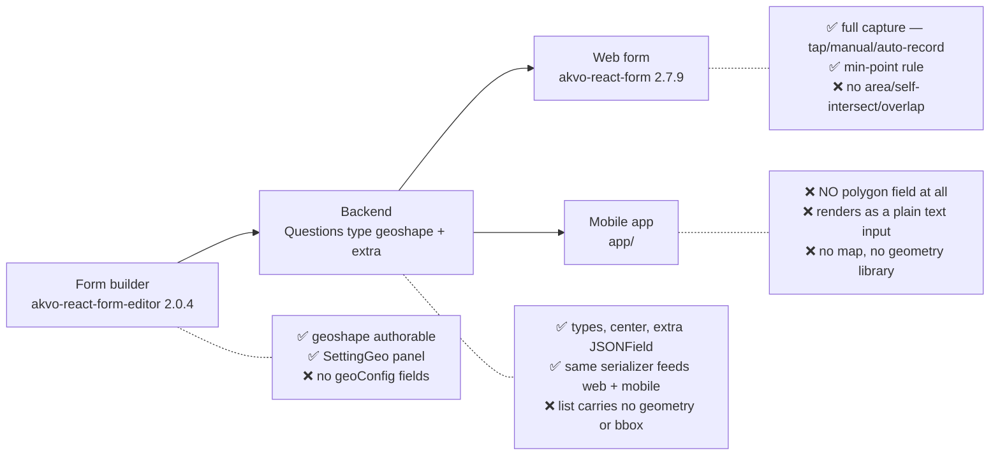

### Layer by layer

| Layer | What works today | What is missing |
|---|---|---|
| **Backend** | `geoshape`=14, `geotrace`=15 with `center`; `Questions.extra` is a free-form `JSONField` already serialized to mobile; XLSForm export maps both types | Geometry + bbox on the datapoint list (**T2**); `geoConfig` round-trip tests (**T9**) |
| **Form builder** | `geotrace`/`geoshape` are authorable; `SettingGeo` panel exists and already authors a structured value (`center`) | The overlap / shape / min-size checkboxes and their numeric fields (**T8**) |
| **Web form** | Full polygon capture via ARF `TypeGeoDrawing` — tap, drag-marker, auto-record, accuracy threshold, i18n in 5 languages | Any validation beyond the min-point rule; manage-data cells render a raw coordinate array |
| **Mobile app** | `TypeGeo.js` — a **single lat/lng point**. `datapoints` already holds local *and* synced records offline. `react-native-webview` installed. Validation plumbing (`feedback` + submit gate) already exists | **Everything polygon**: capture, map, geometry library, overlap, shape and area checks, geometry index (**T1, T3–T7**) |

### The gap, stated plainly

> **Backend and web are largely ready. Mobile has no polygon capability whatsoever, and
> nobody — on any platform — has the validation logic.**

That resolves into three distinct gaps, and they are not equally sized:

**Gap 1 — Mobile cannot capture a polygon.**
Today a `geoshape` question *does* reach the app (same serializer as web) and falls through the
`default:` branch of [`QuestionField.js:157`](../../app/src/form/components/QuestionField.js#L157)
— rendering a **plain text input**. This is the single largest task (**T1**, 9 days) and it was
not in the original task list. Every "implement … in app" task depends on it.

**Gap 2 — Nobody has the validation logic.**
Not web, not mobile. ARF implements the min-point rule and nothing else: no area check, no
self-intersection check, no overlap detection. The logic exists only in the reference validator's **Kotlin**, so it
has to be written in JavaScript for the first time (**T4, T6, T7**).

**Gap 3 — Nothing is configurable, and nothing syncs.**
The `extra.geoConfig` namespace exists as a convention (ARF uses `accuracyThreshold`) but has no
authoring UI (**T8**), and the geometry a device needs for offline overlap checks has no
efficient way to reach it (**T2, T3**).

### Why this shape matters for planning

Three consequences that are easy to get wrong:

1. **The work is not where it looks.** The layers people expect to be hardest — backend schema
   and web capture — are already done. Roughly a third of the feature exists. The mobile half
   is at zero.
2. **"Implement polygon overlap in app" is not a standalone task.** It sits on top of T1 and T3.
   Scheduled alone, it produces code that cannot be integrated or demoed.
3. **The reference validator is a reference, not a source.** It is Kotlin/JTS against a different data format, so
   every mobile task is a *reimplementation* guided by it, not a port — except **T1**, which
   genuinely is a port, but of **ARF #192**, not of the reference validator.

### One thing that is already true and should not be re-litigated

Web capture works. `akvo-react-form-editor@2.0.4` can author polygon questions and ARF `2.7.9`
renders them — with no akvo-mis frontend code involved. Whether a given form *has* a polygon
question is a form-authoring choice, made per form in the builder. This work makes the mobile
client capable of the same thing; it does not restrict either client.

---

## Summary

### Phase 1 — Capture & validity · **17h ≈ 2 days**

*Ships standalone value: polygons can be captured on mobile, and every captured polygon is
guaranteed to be a valid shape. No backend change, no sync change, no configuration.*

| ID | Task | Component | Hours | Days | of which non-code |
|---|---|---|---|---|---|
| **T1** | Polygon capture — **draw on the map** *(prerequisite)* | Mobile | **12** | **1.5** | 6h device debug/test |
| **T6** | Shape validation (min points, self-intersection) | Mobile | **2.5** | **0.5** | — |
| **T7** | Minimum polygon size validation | Mobile | **2.25** | **0.25** | — |
| | **Phase 1 total** | | **~17h** | **~2 days** | **~6h (35%)** |

### Phase 2 — GPS boundary walking · **8h ≈ 1 day** (+1 day background)

*Adds the Kobo-style capture mode. Still no backend or sync work.*

| ID | Task | Component | Hours | Days |
|---|---|---|---|---|
| **T12** | Polygon capture — **walk the boundary (GPS)** | Mobile | **8** | **1** |
| **T12-bg** | …continuing to record when backgrounded | Mobile | **7** | **1** |

### Phase 3 — Overlap detection · **33h ≈ 4 days**

*The whole overlap capability, moved down the list on reviewer feedback. Everything here exists
only to serve overlap detection — including the sync and configuration work.*

| ID | Task | Component | Hours | Days | of which non-code |
|---|---|---|---|---|---|
| **T2** | Extend datapoint list with geometry + bbox | Backend | **5.5** | **1** | — |
| **T3** | Local geometry index + sync consumption | Mobile | **8** | **1** | 2h volume testing |
| **T8** | `geoConfig` authoring UI (3 fields) | Frontend (upstream + host) | **5** | **1** | 2h upstream release |
| **T9** | Backend persistence + API tests for `geoConfig` | Backend | **2.5** | **0.5** | — |
| **T4** | **Polygon overlap detection** | Mobile | **7.5** | **1** | 2.5h spike + perf test |
| **T5** | Overlap map review screen | Mobile | **4.5** | **0.5** | 1.5h device pass |
| | **Phase 3 total** | | **~33h** | **~4 days** | **~6h** |

### Deferred — gated on a decision, not on engineering

| ID | Task | Component | Days |
|---|---|---|---|
| **T10** | Blur detection *(spike first — see §T10)* | Mobile | **~8** *(rough)* |
| **T11** | Offline satellite imagery *(see §T11)* | Mobile | **~11** *(rough)* |

---

### Why overlap moved down — and what it took with it

Reviewer feedback: *"the polygon overlap is one of the major things … I would put it much lower
on the list."*

Acting on that turned out to be a larger simplification than simply moving one row, because
**four other tasks exist only to serve overlap detection**:

| Task | Why it is overlap-only |
|---|---|
| **T2** — datapoint list geometry | The device only needs other people's geometry in order to compare against it |
| **T3** — local geometry index | A spatial index whose only query is the overlap candidate lookup |
| **T5** — map review screen | Reached from an overlap error; there is nothing else to review |
| **T8 / T9** — `geoConfig` + tests | Of the three configurable keys, two (`detectOverlaps`, `overlapThreshold`) are overlap-only, and the third (`accuracyThreshold`) is inert until GPS capture lands in phase 2 |

**Consequence: phase 1 needs no configuration and no backend work at all.** Shape and area
validation run at fixed floors (FR-5.B), so there is nothing to author. Phase 1 is three mobile
tasks — 17 hours — and it still delivers something real: a polygon question that works on mobile
and cannot produce an invalid shape.

**Phase 1: ~2 days.** Phase 2 adds 1–2 days. Phase 3 adds ~4 days.
Total is unchanged at ~50h + GPS; the ordering is what changed.

> **Read these numbers correctly.** They are *build* hours under AI-assisted implementation
> against a working reference (ARF #192 for capture, the reference validator for the geometry
> maths). They carry **no contingency**. The two places a schedule will actually slip are the
> RN↔WebView coordinate bridge (RISK-6, no precedent anywhere) and `@turf` behaviour on a real
> device — both are time-boxed as spikes below, but a spike that fails costs days, not hours.
> Whoever schedules this should add contingency explicitly rather than assume it is baked in.

**Capture is deliberately phased**: T1 ships manual drawing; T12 adds Kobo-style GPS walking
and reuses T1's map host and bridge, so none of that foundation is paid twice.

Parallelisation is possible — see [§Sequencing](#sequencing).

---

## UX & Data Flow

### Today vs proposed — the enumerator's workflow

The clearest way to see what this feature buys is to follow one plot through both worlds.

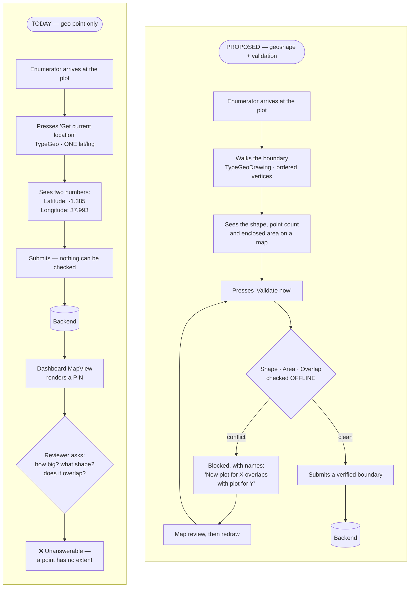

The difference is not mainly *what gets stored*. It is **where the error is caught** — at the
plot with the farmer present, rather than never.

### Why verification is impossible today, in both places

This is not a UI polish gap. Neither client can represent a boundary at all.

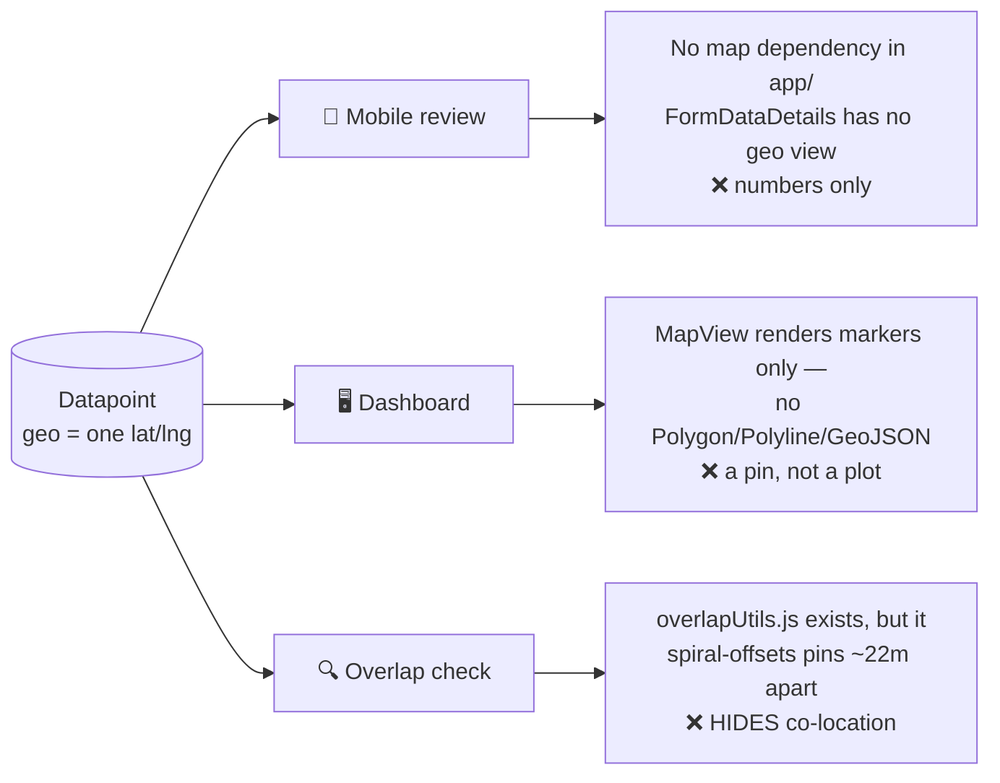

Verified in the code:

| Where | What it can show | Evidence |
|---|---|---|
| **Mobile capture** | Two numbers — `Latitude: …` / `Longitude: …` as text | [`TypeGeo.js:90-95`](../../app/src/form/fields/TypeGeo.js#L90) |
| **Mobile review** | Nothing spatial — no map library is installed at all | `app/package.json` has no leaflet / react-native-maps / mapbox |
| **Dashboard** | A marker pin. `renderMarker` emits a `custom-marker` span; there is no `Polygon`, `Polyline` or `GeoJSON` anywhere | [`MapView.jsx:34`](../../frontend/src/components/map-view/MapView.jsx#L34) |
| **"Overlap" today** | Cosmetic only — when two datapoints fall within ~11 m, the pins are pushed ~22 m apart in a spiral so both stay clickable | [`overlapUtils.js`](../../frontend/src/components/map-view/overlapUtils.js) |

That last row is the sharpest illustration of the gap. **The only overlap logic in the system
today makes co-located records look further apart than they are.** It is a legibility fix for
crowded pins — but its practical effect is that two records on the same ground are rendered as
two tidy, separate markers.

### What changes, concretely

| | Today | Proposed |
|---|---|---|
| **What is captured** | One point per `geo` question — a centroid at best | An ordered boundary: `[[lat,lng], …]` |
| **Capture effort** | One button press, standing anywhere near the plot | Walk the boundary, or tap it on a map |
| **What the enumerator sees** | Two numbers | Shape on a map, point count, GPS accuracy, enclosed area |
| **Can size be known?** | ❌ No | ✅ Geodesic area, shown during capture |
| **Can shape be checked?** | ❌ Nothing to check | ✅ Min points, self-intersection |
| **Can duplicates be caught?** | ❌ Not at all | ✅ Offline, before submit |
| **When is a conflict found?** | Never, or by manual inspection long after | At the plot, with the farmer present |
| **Cost to fix a conflict** | A return visit — if the record is ever questioned | Two minutes: redraw and re-validate |
| **Dashboard view** | A pin | A polygon *(display parity is optional — FR-1.17)* |

### The feature in one picture

Three phases, and only the first two need connectivity.

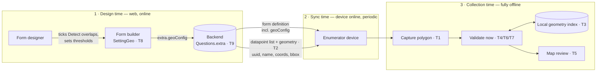

The design-time checkbox is what switches phase 2's second arrow on. No checkbox, no geometry
feed, no device storage cost, no overlap checking — the feature is entirely opt-in per question.

### Enumerator journey

Everything below happens with the radio off.

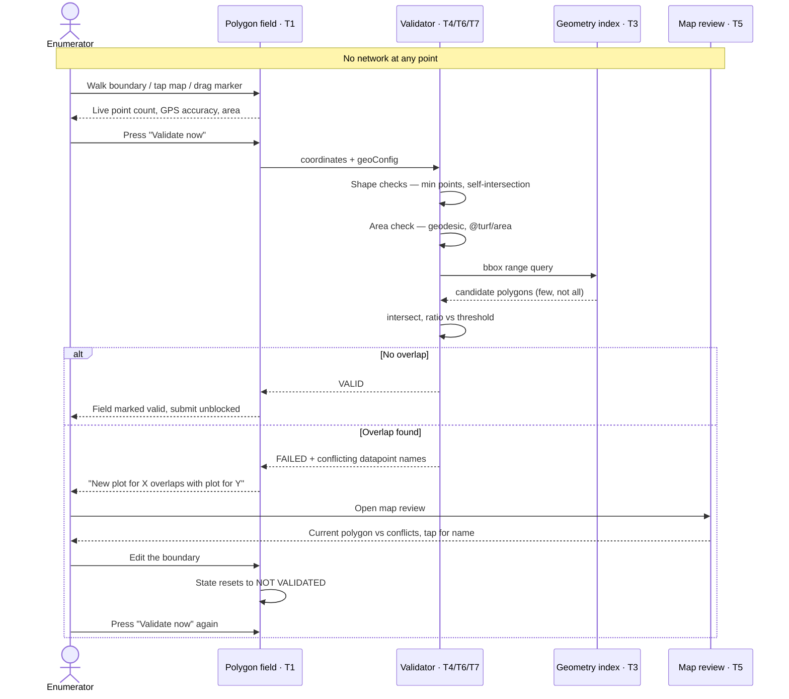

### Field validation states

The explicit button (decision D7) is what keeps the cost bounded — but it creates a state that
must not become an escape hatch.

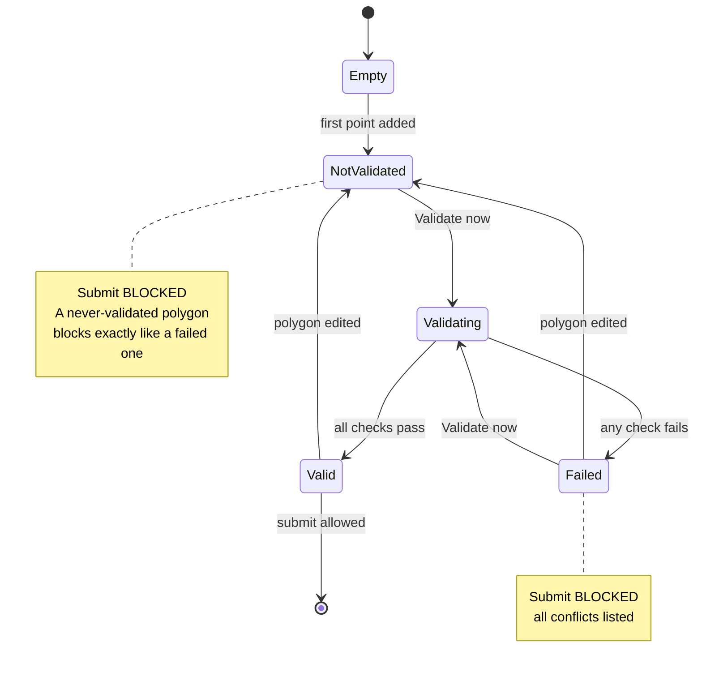

`Valid --> NotValidated` on edit is the rule that prevents a stale pass being mistaken for a
fresh one. Without it, an enumerator could validate, then redraw the boundary into a conflict,
and still submit.

### Inside the overlap check

Why 10,000 stored plots does not mean 10,000 geometry operations:

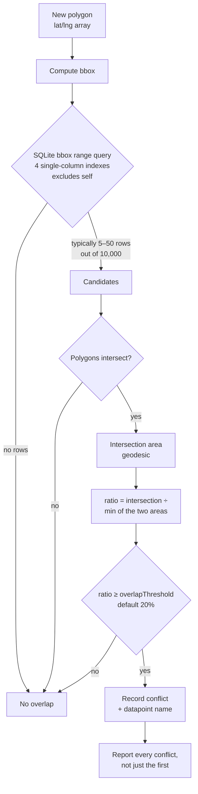

The bounding-box pre-filter is doing the heavy lifting: cheap indexed integer comparisons
eliminate almost everything before any polygon maths runs.

### What feeds the geometry index

Two writers, one table — this is why both of the reference validator's scenarios collapse into a single query for us.

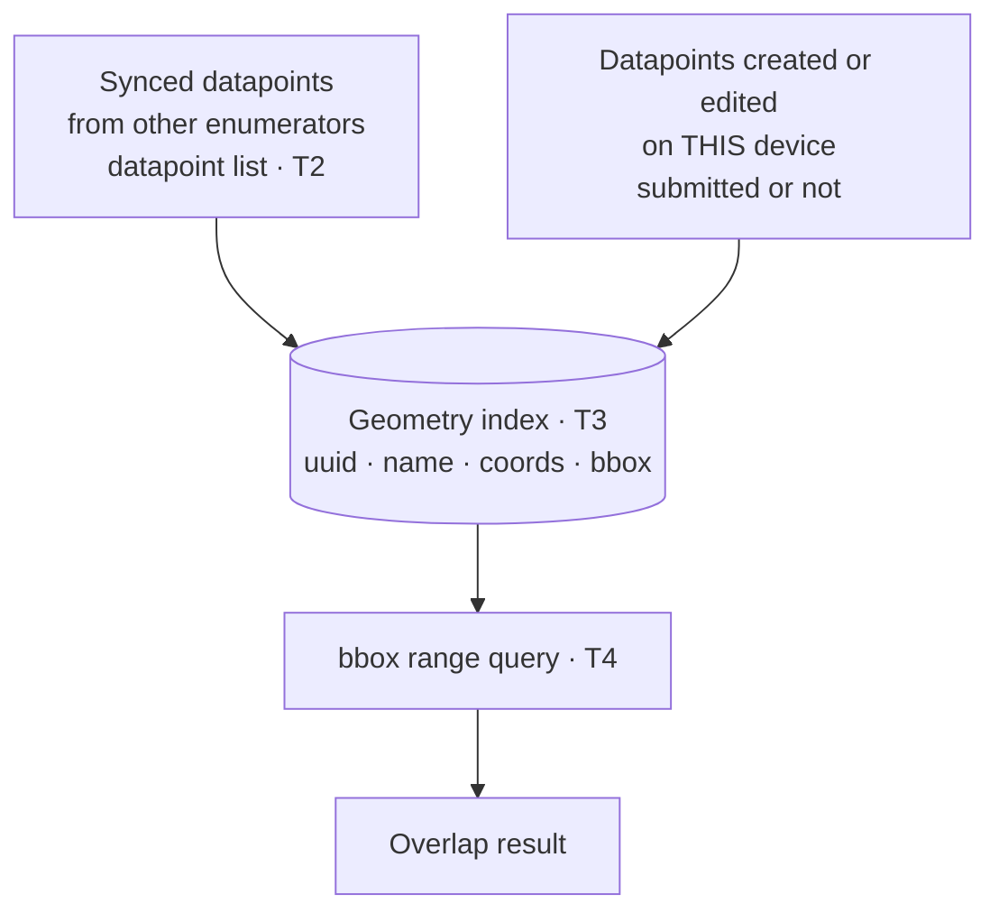

The reference validator needed a separate `plots` table with `isDraft`, `instanceName` and submission-matching
because it cannot see Kobo's submissions. Our `datapoints` table already holds local **and**
synced records, so that entire lifecycle is dropped (see T3).

---

## Challenges & How the Design Responds

### Field reality

**C1 · There is no network where the work happens.**
Enumerators walk plot boundaries in places with no signal, and two overlapping plots may be
collected hours apart by the same person on the same device.
→ **Response**: every check runs against local SQLite. No server round-trip, no "sync first"
prompt, no degraded mode. The only online steps are receiving the form definition and the
geometry feed, both of which happen before fieldwork.
→ *Owned by*: T3, T4. *Residual*: a plot collected on a **different** device today is only
caught after both have synced.

**C2 · GPS drift makes "overlap" ambiguous.**
Two genuinely adjacent plots will show a sliver of intersection purely from GPS error, and
blocking on that would make the feature unusable.
→ **Response**: the threshold is a **percentage of the smaller polygon's area**, not an absolute
overlap, defaulting to **20%**. Minor boundary touching passes; substantial overlap fails. It is
per-question configurable because field conditions differ.
→ *Owned by*: T4, T8. *Residual*: 20% is inherited from the reference validator, not measured against our terrain.

**C3 · Seeing a conflict is not the same as resolving one.**
An error message tells the enumerator *that* two plots overlap, but they are standing in a field
with a farmer who wants to know *why*.
→ **Response**: the map review screen (T5) shows both polygons with names, so the conflict is
inspectable rather than asserted.
→ *Residual*: **this is the weakest point of the current plan.** Without satellite imagery
offline, the enumerator cannot see the river, track, or treeline that would settle the dispute.
That is exactly what T11 buys, and why it is costed separately rather than dropped.

**C4 · The phone goes in a pocket during a boundary walk.**
Auto-record samples GPS on an interval, but the screen locks and the enumerator switches apps.
→ **Response**: background auto-record with a foreground service and a persistent notification,
plus graceful degradation to foreground-only if the separate background-location permission is
refused.
→ *Residual*: **not in this breakdown's estimates** — add ~3 days, and note that Expo Go cannot
run it (needs `expo-dev-client` + an `expo-location` config plugin).

### Scale & performance

**C5 · A partially-synced device reports "no overlap" instead of an error.**
The geometry already reaches the device — `downloadDatapointsJson` stores the full answer set
locally, and a **skip-unchanged** guard
([`sync-datapoints.js:150-155`](../../app/src/lib/sync-datapoints.js#L150)) means only the first
sync costs one request per datapoint. Bandwidth is therefore *not* the problem. The problem is
that `datapoint_sync_queue` carries `lastPage`/`totalPage`: sync is resumable, so
**partially-synced states are normal**, and a 60%-synced form checks against 60% of the
candidates and passes. A missing candidate does not error — it silently validates.
→ **Response**: T2 extends the existing `/device/datapoint-list` with geometry, a server-computed
bbox, and a **completeness signal**, so the device knows whether it holds the full candidate set.
Extending the endpoint the sync already calls avoids a second sync loop entirely.
→ *Owned by*: T2, T3. *Residual*: the completeness signal is the piece most likely to be dropped
as "nice to have" — it is the reason the task exists.

**C5b · Building the index would mean parsing every polygon on the phone.**
The per-datapoint JSON carries raw coordinates and no bounding box, so T3 would have to parse
~180-vertex polygons across every datapoint on a low-end Android device just to index them.
→ **Response**: the bbox is computed server-side (T2) and consumed directly.
→ *Owned by*: T2.

**C6 · Nobody should pay for a feature they did not enable.**
Most forms have no polygon question, and most polygon questions do not need overlap detection.
→ **Response**: the extra geometry fields are gated on `extra.geoConfig.detectOverlaps`.
Unticked means the datapoint-list response is byte-identical to today — no added payload, no
device storage, no indexing work. This gating is also what makes the checkbox's help text
truthful: without it the flag would control nothing, since datapoints sync regardless.
→ *Owned by*: T2, T8.

**C7 · Geometry maths on the JS thread could stall the form.**
Turf runs in JavaScript on the same thread as the UI, and `validateAllGroups()` re-validates
every question of every group on submit.
→ **Response**: two mitigations stacked. The **bbox pre-filter** cuts 10,000 candidates to
typically 5–50 before any polygon maths. The **explicit "Validate now" button** means the work
is user-initiated, one polygon at a time, with a progress indicator — never on blur, never on
Next, never once per group per submit. The submit gate reuses the **stored** result.
→ *Owned by*: T3, T4.

**C8 · Auto-record produces far more points than test data suggests.**
A 30-minute boundary walk at 10-second intervals is ~180 vertices, not the 5-point shapes
developers test with.
→ **Response**: called out explicitly in T3 as a thing to measure — storage, index size and
intersection cost should be checked against realistic captures.
→ *Residual*: unmeasured. This is the estimate most likely to move.

### Data integrity

**C9 · Two clients must produce the same data.**
A plot collected on the web and one collected on mobile have to be indistinguishable to the
backend, or overlap detection compares incompatible shapes.
→ **Response**: the mobile field is a **port** of ARF's `TypeGeoDrawing`, preserving the
`[[lat, lng], …]` value format exactly. No mobile-specific encoding.
→ *Owned by*: T1.

**C10 · Configuration can be lost silently.**
If `extra` is filtered anywhere in the publish path, mobile receives defaults, every threshold
the designer set is ignored, and **nothing reports an error**.
→ **Response**: T9 tests the full create → publish → mobile-fetch round-trip explicitly, rather
than assuming the `JSONField` survives.
→ *Owned by*: T9.

**C11 · Porting the reference validator verbatim would introduce three silent bugs.**
It is a working implementation, which makes copy-paste tempting.
→ **Response**: each trap is documented with its symptom —
(a) its area maths is an equirectangular approximation, so use geodesic `@turf/area`;
(b) its `MIN_VERTICES = 4` counts a duplicated closing point our format does not have, so the
threshold is **3** — copying 4 fails every valid triangle;
(c) it parses ODK geoshape strings and WKT, while ours is an already-parsed array.
→ *Owned by*: T4, T6, T7.

**C12 · Sync must not widen data access.**
A new bulk endpoint is an easy place to accidentally leak datapoints across tenants or
assignments.
→ **Response**: T2 explicitly requires existing mobile-assignment and tenant scoping, with
tests. An enumerator receives geometry only for datapoints they could already see.
→ *Owned by*: T2.

### Delivery

**C13 · The largest task was missing from the list.**
Polygon capture does not exist on mobile — a `geoshape` question currently renders as a plain
text input.
→ **Response**: surfaced as T1 (9 days) with the 7 integration touchpoints enumerated, including
the two quiet failures where the field looks correct and validates wrongly.
→ *Residual*: if T1 is descoped, nothing else on mobile can be integrated or demoed.

**C14 · Part of the work is in a repo we do not release.**
The form builder is `akvo-react-form-editor`, imported wholesale.
→ **Response**: T8 is split into upstream (3d) and host integration (1d), with the fallback
documented — and rejected, because `QuestionCustomParams` writes flat, array-wrapped, string
values on every question type.
→ *Residual*: upstream release cadence is outside the team's control.

**C15 · Two items cannot be estimated honestly yet.**
→ **Response**: both are marked rough and gated on a decision rather than padded.
**T10 blur detection** depends on Google ML Kit, which Expo's managed workflow does not provide;
and its hybrid targets *text on documents*, which may not be our use case at all.
**T11 offline imagery** is blocked on **licensing, not engineering** — whether the provider
mandates its own SDK decides between an ~11-day extension and a rewrite of T5.

---

## Reference Validator — Code Map

Repository: [akvo/african-bamboo-odk-external-validations](https://github.com/akvo/african-bamboo-odk-external-validations)
Package root: `app/src/main/java/org/akvo/afribamodkvalidator/`

| File | Lines | Ports to |
|---|---|---|
| `validation/PolygonValidator.kt` | 134 | T6, T7 — vertex count, area, self-intersection |
| `validation/OverlapChecker.kt` | 136 | T4 — bbox computation, intersection ratio, threshold |
| `validation/GeoValueParser.kt` | 87 | T6 — input parsing (see note on format below) |
| `data/entity/PlotEntity.kt` | ~90 | T3 — bbox columns + index strategy |
| `data/dao/PlotDao.kt` | ~110 | T3, T4 — `findOverlapCandidates` bbox query |
| `validation/PolygonValidationActivity.kt` | 264 | T4 — orchestration order |
| `validation/MapPreviewActivity.kt` | 479 | T5 — map review screen |
| `validation/MapboxOfflineManager.kt` | 122 | T11 — offline tile management |
| `validation/BlurDetector.kt` | 233 | T10 — hybrid OCR + Laplacian |
| `ui/screen/OfflineMapScreen.kt` | ~600 | T11 — download UI |

### Three places it must NOT be copied verbatim

**1. Area calculation is an approximation, not geodesic.**
`PolygonValidator.calculateAreaInSquareMeters()` multiplies square degrees by
`111320.0 * cos(latitude)`. That is an equirectangular approximation. Our **NFR-7 requires
geodesic area** — use `@turf/area`, which is geodesic, rather than porting this arithmetic.

**2. Vertex count convention differs.**
It uses `MIN_VERTICES = 4` — "3 distinct points + 1 closing point", because ODK geoshape
strings repeat the first point at the end. **Our format (from ARF) does not duplicate the
closing point**, so the equivalent threshold is **3**, not 4. Getting this wrong makes every
valid triangle fail validation.

**3. Input format differs.**
It parses ODK geoshape (`"lat lng alt acc; lat lng alt acc; …"`) and WKT. **Our format is
`[[lat, lng], [lat, lng], …]`** — a JSON array, already parsed. `GeoValueParser.kt` is a
reference for *validation ordering*, not for parsing code to port.

---

## Backend Tasks

### T2 — Extend the datapoint list with geometry · **5.5h ≈ 1 day** · 🔵 **phase 3**

**Hours** (AI-assisted; ~0.5h per generated-and-reviewed unit):

| Unit | h |
|---|---|
| Serializer: geometry + bbox fields on the list response | 0.5 |
| Server-side bbox computation (decide denormalised vs per-request) | 1 |
| Gate on `extra.geoConfig.detectOverlaps` | 0.5 |
| Completeness signal | 1 |
| Tests — tenant scoping, gating on/off, pagination | 1.5 |
| Migration, if bbox is denormalised | 1 |
| **Total** | **5.5** |

Implements "sync the least possible to make this work" — by **extending the endpoint that
already exists**, not adding a new one.

#### Why not a new endpoint, and why not the status quo either

The geometry already reaches the device today. `fetchFormDatapointsPageByPage(formId, …)` →
[`downloadDatapointsJson`](../../app/src/lib/sync-datapoints.js#L126) stores the full answer set
in `datapoints.json`, so any polygon is already local after sync.

The existing path is also less wasteful than it first appears: `downloadDatapointsJson` has a
**skip-unchanged** guard ([`sync-datapoints.js:150-155`](../../app/src/lib/sync-datapoints.js#L150))
comparing `lastUpdated` against `existing.syncedAt` and returning **before** the network call.
Only the *first* sync costs one request per datapoint.

So the case for change is **not bandwidth**. It is three other things:

| # | Concern | Severity |
|---|---|---|
| 1 | **Partial sync yields false passes.** `datapoint_sync_queue` carries `lastPage`/`totalPage` — resumable sync means partially-synced states are normal. A 60%-synced form checks against 60% of plots and reports *no overlap*. A missing candidate does not error, it **passes** | 🔴 Correctness |
| 2 | **No bbox means parsing every polygon on-device.** The per-datapoint JSON carries raw coordinates only. Building T3's index would mean parsing ~180-vertex polygons across every datapoint on a low-end Android phone | 🟠 Performance |
| 3 | **`detectOverlaps` would control nothing.** Datapoints sync regardless, so the checkbox could not honour "sync the least possible" | 🟡 Requirement |

Concern 1 is the one that matters: **a validation feature that silently passes is worse than one
that errors.**

#### Deliverable

Extend the **existing** `/device/datapoint-list` response — do not build a parallel endpoint.

For forms whose `geoshape` question has `extra.geoConfig.detectOverlaps === true`, each row
gains:

- `question_id` — which geoshape question the geometry belongs to
- the polygon coordinate array
- `bbox` — `min_lat`, `max_lat`, `min_lon`, `max_lon`, **computed server-side**
- a **completeness signal** so the device knows whether it holds the full candidate set

Rows for forms without the flag are unchanged — no new fields, no added payload.

#### Requirements

- Additive and backward compatible: older app builds ignore unknown fields.
- Gated on `detectOverlaps`, so the checkbox genuinely controls payload — this is what makes
  the builder's help text true.
- Bounding box computed server-side. Decide whether it is denormalised on write or computed per
  request; at 100 rows per page the latter may be acceptable, but measure it.
- Reuses the existing pagination (`page_size=100` max) and `last_updated` cursor. No new sync
  loop on the device.
- Respects existing mobile-assignment and tenant scoping. **Do not widen data access** — an
  enumerator must not receive geometry for datapoints they could not already see.

#### Acceptance

- With `detectOverlaps` off, the response is byte-identical to today.
- With it on, the device can build T3's index **without fetching any per-datapoint JSON** and
  without parsing coordinates to derive bboxes.
- The device can tell a complete candidate set from a partial one.
- Tenant/assignment scoping covered by tests.

#### Watch out

- The completeness signal is the part most likely to be dropped as "nice to have". It is the
  reason this task exists — without it, overlap detection reports false passes on a partial sync.
- Payload growth is bounded by vertex count, and auto-record makes ~180-vertex polygons routine.
  If page payloads get large, send bbox only in the list and fetch full coordinates lazily for
  the few candidates a bbox query actually returns.

### T9 — Backend persistence + API tests for `geoConfig` · **2.5h ≈ 0.5 day** · 🔵 **phase 3**

**Hours** (AI-assisted; ~0.5h per generated-and-reviewed unit):

| Unit | h |
|---|---|
| Round-trip tests: create → publish → mobile fetch | 1 |
| Reject nonsensical values (negative area, threshold outside 0–100) | 0.5 |
| Verify `extra` survives the `FormPublishedVersion` snapshot | 1 |
| **Total** | **2.5** |

**Good news: no model change is required.** `Questions.extra` is already a free-form
`JSONField` ([`models.py:148`](../../backend/api/v1/v1_forms/models.py#L148)), already
serialized to mobile via `WebFormDetailSerializer`, and already round-tripped by the form
builder — `FormDetailQuestionSerializer` lists `extra` among its fields
(`backend/api/v1/v1_forms/serializers.py:643`).

**Deliverable**
- Tests proving `extra.geoConfig` survives form create → publish → mobile fetch unchanged.
- Validation that rejects nonsensical values (negative area, threshold outside 0–100).
- Confirm `geoConfig` is carried into form **versioning/publish snapshots**, not dropped.

**Watch out** — publishing creates a `FormPublishedVersion` snapshot. If `extra` is filtered
anywhere in that path, mobile silently receives defaults and every threshold setting is ignored
with no error.

---

## Frontend Tasks

### T8 — `geoConfig` authoring UI · **5h ≈ 1 day** · 🔵 **phase 3**

**Hours** (AI-assisted; ~0.5h per generated-and-reviewed unit):

| Unit | h |
|---|---|
| `SettingGeo`: 3 controls + conditional reveal | 1 |
| Store wiring, `geoshape`-only scoping | 0.5 |
| i18n keys in the editor | 0.5 |
| **Upstream build, test, version bump, npm release** *(process, not typing)* | 2 |
| Host integration + round-trip verification | 1 |
| **Total** | **5** |

Covers three of the manager's items in one panel, because they share a home:

- "checkbox: detect overlaps with other answers to this question"
- "shape validation. Check box to enable and then configure with integer for number of points"
- "minimum polygon size — see ui for shape validation (checkbox etc)"

**Where this work lives — important**

The form builder is **`akvo/akvo-react-form-editor`**, a separate repo, imported wholesale at
[`FormBuilderCreate.jsx:3`](../../frontend/src/pages/form-builder/FormBuilderCreate.jsx#L3).

**This is mostly upstream work, not akvo-mis frontend work.** Split:

| Sub-task | Repo | Days |
|---|---|---|
| T8a — Extend `SettingGeo.jsx` with the geoConfig panel | `akvo-react-form-editor` | 3 |
| T8b — Version bump, integrate, verify round-trip | `akvo-mis/frontend` | 1 |

**Why `SettingGeo.jsx` is the right home** — it is already scoped to exactly the three geo
types (`[geo, geotrace, geoshape]`), already uses `InputNumber`, and already authors a
structured value (`center`). **`center` is the exact precedent**: authored in `SettingGeo` →
persisted by the backend → consumed by ARF `TypeGeoDrawing`. `geoConfig` follows the same path.

#### Exactly three fields are configurable

Authored at **question level**, in `extra.geoConfig`, on **`geoshape` questions only**:

| Control | Key | Type | Default |
|---|---|---|---|
| GPS accuracy threshold (m) — *already exists in ARF #192* | `accuracyThreshold` | number | `15` |
| ☑ Detect overlaps with other answers to this question | `detectOverlaps` | boolean | `false` |
| … overlap threshold % *(revealed only when ticked)* | `overlapThreshold` | number | `20` |

```json
"extra": {
  "geoConfig": {
    "accuracyThreshold": 15,
    "detectOverlaps": true,
    "overlapThreshold": 20
  }
}
```

#### Everything else is a hardcoded floor — build no UI for it

These are **validity checks, not policy**. They are constants in the mobile code, never appear
in `geoConfig`, and have no builder control:

| Rule | Value | Why no checkbox |
|---|---|---|
| Parses as a polygon | — | Nothing to validate otherwise |
| Minimum vertices | `3` | Below 3 it is not a polygon |
| No self-intersection | — | Area is ambiguous on a self-crossing ring |
| Minimum area | `10 m²` | 3.2 m × 3.2 m — catches double-taps, below any real plot |

**There are deliberately no `validateShape`, `validateMinArea`, `minPoints` or `minAreaSqm`
keys.** An enable-checkbox for "should this be a valid polygon?" has no meaningful *off* state.

⚠️ **This narrows the original request.** The task list asked for shape validation and minimum
size as builder checkboxes with configurable integers. Those checks are still implemented
(**T6**, **T7**) — they are simply always on, at fixed floors, rather than authored per form.
Flag this back to the requester rather than letting it pass silently.

**Requirements**
- `overlapThreshold` is revealed only when `detectOverlaps` is ticked.
- Values written as **numbers**, nested under `extra.geoConfig` — not strings, not top level.
- The overlap checkbox needs help text stating the consequence: *enabling this syncs the
  geometry of all other responses to this question onto the enumerator's device.*
- **Panel appears on `geoshape` only** — not on `geo`, not on `geotrace`, not on any other type.
  Consistent with D6, which scopes all validation to `geoshape`.
- Consequence: a `geotrace` question carries no `geoConfig` and keeps ARF's built-in 15 m
  default. Nothing regresses; geotrace just gains no new configurability.

**Do NOT use `QuestionCustomParams`** — the editor's generic custom-params escape hatch looks
like a shortcut but is wrong here on three counts:

| Limitation | Consequence |
|---|---|
| Writes to question **top level** (`{ ...q, [objKey]: value }`) | Produces `question.overlapThreshold`, not `extra.geoConfig.overlapThreshold` |
| **Always array-wraps**, and `type: 'input'` is a text field (`Array.isArray(val) ? val : [val]`) | `20` is stored as `["20"]` — a string in an array |
| **Not type-scoped** — global "Custom Parameter" tab | Geo settings appear on text, number and date questions |

**Acceptance**
- Ticking each checkbox and saving produces the expected `extra.geoConfig` JSON.
- Reopening the form in the builder restores the checkbox and numeric state.
- Values survive publish and appear unchanged in the mobile form payload.

---

## Mobile Tasks

### T1 — Polygon capture: draw on the map · **12h ≈ 1.5 days** · 🟢 **phase 1** · prerequisite for everything

Not in the original list. Nothing else on mobile can be integrated without it.
**Phase 1 of capture** — manual drawing only. GPS boundary-walking is split out as **T12**.

**Port target**: `TypeGeoDrawing` from **`akvo/akvo-react-form` #192**, commit `e7d786d`.
It defines the capture half of this
feature, so this is a **port, not a design exercise**.

**Hours** (AI-assisted; ~0.5h per generated-and-reviewed unit):

| Sub-task | Unit | h |
|---|---|---|
| **T1a** | Bundle Leaflet as an offline asset | 0.5 |
| | Leaflet page — render polygon + vertex markers, tap, drag | 1 |
| | `postMessage` bridge, both directions | 0.5 |
| | **On-device debugging — WebView load race, message timing, Android quirks** | 4 |
| **T1b** | Tap-to-add | 0.5 |
| | Drag a vertex to correct it | 0.5 |
| | Undo / remove point / clear + confirm | 0.5 |
| | `CoordinatePreview` (plain text port) | 0.5 |
| **T1c** | The 7 integration touchpoints (1–3 lines each) | 1 |
| | Unit tests — schema, `transformValue`, name generation | 1 |
| | **Device pass** | 2 |
| | **Total** | **12** |

**Scope**: the enumerator taps the map to place each vertex, drags a vertex to correct it, and
undoes or clears. No GPS involvement beyond "centre the map on me".

> **The drawing interaction itself is ~2h.** Writing the Leaflet page and the bridge is another
> ~2h. **Half of this task — 6 of the 12 hours — is device debugging and testing**, because
> there is no map in the app today and a WebView inside React Native is awkward to inspect.
> That 6h is the part AI does not compress, and the part most likely to be wrong in either
> direction. T1a's foundation is a one-off cost that T12 then reuses for free.

#### ⚠️ Drawing-first has a hard dependency on visible imagery

This ordering decision has a consequence worth confronting before it is locked in:

| Capture mode | Works offline with a blank map? |
|---|---|
| **Walk the boundary (T12)** | ✅ Yes — GPS needs no tiles. The plot shape comes from the enumerator's feet |
| **Draw on the map (T1)** | ❌ **No** — you cannot trace a boundary you cannot see |

An enumerator standing in a field with no signal sees an empty canvas. There is nothing to
tap *against*. So shipping drawing-only means one of:

1. **T11 (offline satellite imagery) becomes a blocker**, not low priority — it is what makes
   drawing usable in the field at all; or
2. Drawing happens **where there is connectivity** — which is not at the plot, and undermines
   "catch the overlap while the enumerator is still standing on it"; or
3. Accept that phase 1 is a **connected-only** capability, and treat true offline capture as
   arriving with T12.

Option 3 is a legitimate MVP position, but it should be stated out loud rather than discovered
in the field. See [offline-satellite-imagery-plan.md](./offline-satellite-imagery-plan.md).

#### Config consequence for phase 1

`geoConfig.accuracyThreshold` has **no effect** while only drawing exists — it gates GPS fixes,
and there are none. Two options for T8:

- Author all three keys now and let `accuracyThreshold` sit inert until T12; or
- Ship two keys (`detectOverlaps`, `overlapThreshold`) and add the third with T12.

The second is tidier but means a second upstream `akvo-react-form-editor` release. Recommend
the first — the key already exists in ARF #192 anyway, so it costs nothing to author it early.

**Component mapping** — ARF's five `src/support/` components split two ways:

| ARF component | Lines | Destination |
|---|---|---|
| `TypeGeoDrawing.jsx` | 503 | `app/src/form/fields/TypeGeoDrawing.js` — hosts WebView + RN controls |
| `CoordinatePreview.jsx` | 63 | `app/src/form/support/CoordinatePreview.js` — pure text, straight port |
| `GeoDrawingControls.jsx` | 325 | `app/src/form/support/GeoDrawingControls.js` — RNEUI buttons |
| `GeoGeometry.jsx` | 55 | → **into the WebView Leaflet page** |
| `RecordedMarkers.jsx` | 81 | → **into the WebView Leaflet page** |
| `GeoDrawingMapHandlers.jsx` | 106 | → **into the WebView Leaflet page** |

**Web → Expo API swaps**:

| ARF (web) | `app/` |
|---|---|
| `navigator.geolocation.getCurrentPosition` | `loc.getCurrentLocation` ([`app/src/lib/loc.js`](../../app/src/lib/loc.js)) |
| `navigator.geolocation.watchPosition` | `expo-location` `watchPositionAsync` |
| antd `Modal.confirm` / `Modal.error` | RN `Alert` |
| `form.setFieldsValue({ [id]: … })` | `FormState.update((s) => { s.currentValues = … })` |
| `uiText` prop | existing `i18n.text(activeLang)` |

**Value format — the cross-client contract**: `[[lat, lng], [lat, lng], …]`. A datapoint
collected on mobile and one collected on web must be **indistinguishable to the backend**.
Do not invent a mobile-specific encoding.

**i18n**: ARF already defines ~40 `geoDrawing*` keys, translated to en/id/in/fr/de in
`src/locale/*.json`. **Reuse the key names** so translations transfer rather than being
re-authored.

#### T1c — the 7 integration touchpoints

Adding the type to `QUESTION_TYPES` alone gives a field that **renders but validates wrongly**.
All seven must land together:

| # | File | Change | Symptom if skipped |
|---|---|---|---|
| 1 | [`app/src/lib/constants.js:26`](../../app/src/lib/constants.js#L26) | Add `geoshape`, `geotrace` | Type never matches |
| 2 | [`QuestionField.js:157`](../../app/src/form/components/QuestionField.js#L157) | `case` → `<TypeGeoDrawing>` | Renders a **plain text input** |
| 3 | `form/fields/TypeGeoDrawing.js` + [`fields/index.js`](../../app/src/form/fields/index.js) | New component + export | Nothing to render |
| 4 | [`form/lib/index.js:364`](../../app/src/form/lib/index.js#L364) | `case` → `Yup.array()`, mirroring `'geo'` | Falls to `default: Yup.string()` — **an array fails a string schema** |
| 5 | [`form/lib/index.js:406`](../../app/src/form/lib/index.js#L406) | Exclude polygon types from datapoint-name generation | Raw coordinates leak into the datapoint name |
| 6 | [`form/lib/index.js:462`](../../app/src/form/lib/index.js#L462) | Add `geo`-style `'' → []` branch in `transformValue` | Empty polygon becomes `''`; breaks resume |
| 7 | [`FormNavigation.js:56`](../../app/src/form/support/FormNavigation.js#L56), [`:102`](../../app/src/form/support/FormNavigation.js#L102) | Add polygon types to the defaultVal list | Unanswered polygon defaults to `''` not `null` — **wrong required-check** |

**Items 4 and 7 are the quiet failures** — the field looks right on screen and validates wrongly.

**Acceptance**
- A `geoshape` question renders a map with capture controls, not a text box.
- Tap, manual-marker, and auto-record all append points.
- Points survive leaving and re-entering the question group, and form save/resume.
- Value shape matches ARF exactly.

**Watch out** — the RN↔WebView bridge has **no ARF precedent** (ARF's Leaflet runs in the same
JS context). Tap and marker-drag originate in the WebView; GPS points originate in RN. Both must
converge on one ordered list. This is the likeliest source of dropped or duplicated points.

---

### T3 — Local geometry index + sync consumption · **8h ≈ 1 day** · 🔵 **phase 3**

**Hours** (AI-assisted; ~0.5h per generated-and-reviewed unit):

| Unit | h |
|---|---|
| Table + single-column bbox indexes in `tables.js` | 0.5 |
| Migration + backfill for existing installs | 1.5 |
| CRUD module | 0.5 |
| Consume T2's list fields during sync | 1 |
| Keep index correct on local create / edit | 1 |
| Completeness tracking | 0.5 |
| Unit tests | 1 |
| **Device testing at realistic volume** | 2 |
| **Total** | **8** |

**Deliverable**
- New SQLite table storing, per datapoint: `uuid`, `datapointId`, `formId`, `questionId`,
  `name`, coordinates, and bbox columns `minLat, maxLat, minLon, maxLon`.
- Single-column indexes on each bbox column.
- Populated from T2's extended datapoint list — **no per-datapoint JSON fetch and no
  on-device coordinate parsing needed to build the bboxes** — and from locally-created or
  edited datapoints.
- Migration + backfill for installs that already hold datapoints.

**Reference**: `data/entity/PlotEntity.kt` — the index-strategy comment is the useful part:

> Single-column bbox indexes allow SQLite to choose the most selective index for range
> conditions. **Composite indexes are ineffective for range-only queries.**

Follow that. A composite index across the four bbox columns will not be used by the planner.

**What to drop from it** — `PlotEntity`'s `isDraft`, `instanceName`, and `submissionUuid`
draft-matching machinery. The reference validator needs it because it cannot see Kobo's
submissions. Our `datapoints`
table already holds local **and** synced records, so this whole lifecycle is dead weight here.

**Requirements**
- Index stays correct on: local create, local edit, sync arrival, and re-sync of a changed
  datapoint.
- Forms with no `geoshape` question do no indexing work.
- Sync only runs for questions with `detectOverlaps` enabled (ties to T2 and T8).

**Watch out** — auto-record at 10-second intervals makes large point counts routine: a
30-minute boundary walk yields ~180 points. Storage and index size should be checked against
realistic captures, not 5-point test shapes.

---

### T4 — Polygon overlap detection · **7.5h ≈ 1 day** · 🔵 **phase 3** *(moved down on reviewer feedback)*

**Hours** (AI-assisted; ~0.5h per generated-and-reviewed unit):

| Unit | h |
|---|---|
| **Spike: verify `@turf` submodules work in React Native** | 1 |
| bbox range query + candidate fetch | 0.5 |
| Intersection ratio vs threshold | 0.5 |
| "Validate now" button, 3 states, progress | 1 |
| State reset on edit; submit gate reads stored result | 1 |
| Error assembly — multiple conflicts, repeat instance | 0.5 |
| Unit tests with known fixtures | 1.5 |
| **Perf test at 10,000 plots** | 1.5 |
| **Total** | **7.5** |

**Geometry library**: `@turf/turf` is already a declared dependency in
[`frontend/package.json:9`](../../frontend/package.json#L9) and is **pure JS, so it runs in
React Native**. Import the **scoped submodules** — `@turf/area`, `@turf/intersect`,
`@turf/bbox`, `@turf/kinks` — never the full `@turf/turf` bundle, which would bloat the mobile
bundle.

**Algorithm** — port from `validation/OverlapChecker.kt`:

1. Compute the new polygon's bbox.
2. Query candidates via the bbox range query — the reference validator's
   `PlotDao.findOverlapCandidates`:
   ```sql
   SELECT * FROM plots
   WHERE uuid != :excludeUuid
     AND minLon <= :maxLon AND maxLon >= :minLon
     AND minLat <= :maxLat AND maxLat >= :minLat
   ```
3. For each candidate: `intersects()` → `intersection()` → area.
4. `overlapPercentage = intersectionArea / min(newArea, candidateArea) * 100`.
5. Fail if `>= threshold` (default **20**, from `extra.geoConfig.overlapThreshold`).

**Trigger — explicit "Validate now" button** (decision D7). Validation runs **only** on press:
never on blur, never on Next, never on each pass of `validateAllGroups()`. This is what keeps
the cost bounded.

But that creates a state to close:

- Editing the polygon after a successful validation resets it to **not yet validated**.
- **Submission requires a current, passing validation** for every non-empty `geoshape` answer —
  a never-validated polygon must block submit exactly as a failed one does. Without this the
  button becomes an opt-out from the whole feature.
- The submit gate reuses the **stored result**; it does not re-run the geometry work.

**Error message** (D-parent FR-4.1), using the name `generateDataPointName` already produces:

```
New plot for <current datapoint name> overlaps with plot for <existing datapoint name>
```

**Scope rules**
- `geoshape` **only** — `geotrace` is never overlap-checked (D6).
- Candidates = same form, all local datapoints, submitted or not, synced or not (D2).
- **Region/administration is never a filter.** Ported verbatim from the reference validator's
  `plot-overlap-detection.md`: filtering by region produces false negatives on boundary plots
  and on mis-selected regions, and defeats fraud detection.
- The datapoint being edited is excluded from its own check.
- Polygons in a repeatable group are checked against other datapoints but **never against each
  other within the same submission** (D9).

**Acceptance**
- Overlap ≥ threshold blocks submit; below threshold does not.
- All simultaneous overlaps are reported, not just the first.
- Works with the radio off.
- ≤ 500 ms against 10,000 stored plots.

---

### T5 — Overlap map review screen · **4.5h ≈ 0.5 day** · 🔵 **phase 3**

**Hours** (AI-assisted; ~0.5h per generated-and-reviewed unit):

*Reuses T1a's WebView map host and bridge — none of that is re-paid here.*

| Unit | h |
|---|---|
| Render multiple polygons, current vs conflicting colours | 0.5 |
| Auto-fit viewport to all polygons | 0.5 |
| Tap a polygon → show datapoint name | 0.5 |
| Tile-source resolver seam + offline notice | 1 |
| Navigation from the error, scale bar, disclaimer | 0.5 |
| **Device pass** | 1.5 |
| **Total** | **4.5** |

**Reference**: `validation/MapPreviewActivity.kt` (479 lines) for behaviour, not code.

**Deliverable** — a read-only screen reachable from the overlap error:
- Current polygon in one colour, overlapping polygons in another (the reference validator uses cyan / red).
- Viewport auto-fits all displayed polygons.
- Tapping a polygon shows that datapoint's name — explicitly required by the reference validator's Scenarios 1 and 2.
- Satellite basemap **when online**; offline, polygons render on a plain background with a
  scale reference and a clear "imagery unavailable offline" notice.
- Disclaimer that satellite imagery may be outdated.

**Offline imagery is deliberately out of scope here** — see T11 and the
[imagery plan](./offline-satellite-imagery-plan.md).

**Build the tile-source seam now**: the map's tile URL must come from **one function** that
takes the viewport and returns a template, and the offline notice must be driven by that
function's outcome rather than by a connectivity check. With that seam, T11 later changes one
module instead of forcing a rewrite.

---

### T6 — Shape validation · **2.5h ≈ 0.5 day** · 🟢 **phase 1**

**Hours** (AI-assisted; ~0.5h per generated-and-reviewed unit):

| Unit | h |
|---|---|
| Parse check, min-points, `@turf/kinks` self-intersection | 0.5 |
| i18n messages | 0.5 |
| Wire into the validator | 0.5 |
| Tests with known fixtures | 1 |
| **Total** | **2.5** |

**Reference**: `validation/PolygonValidator.kt`.

| Check | Rule | Message |
|---|---|---|
| Format | Value parses as a polygon | "Invalid polygon format. Unable to parse the shape data." |
| Vertices | `>= 3` — **fixed constant, not read from config** | "Polygon has too few vertices. A valid shape requires at least 3 points." |
| Self-intersection | No edge crosses another | "Polygon lines intersect or cross each other. Please redraw the shape." |

- Self-intersection via `@turf/kinks` (the reference validator uses JTS `polygon.isValid`).
- Messages translatable through the existing `i18n` layer — not hardcoded English.
- `geoshape` only (D6).
- **Vertex threshold is 3, not the reference validator's 4** — see the "do not copy verbatim" note above.

---

### T7 — Minimum polygon size validation · **2.25h ≈ 0.25 day** · 🟢 **phase 1**

**Hours** (AI-assisted; ~0.5h per generated-and-reviewed unit):

| Unit | h |
|---|---|
| `@turf/area` + threshold check | 0.5 |
| Live enclosed-area display during capture (T1) | 0.5 |
| i18n message | 0.25 |
| Tests — known square at several latitudes | 1 |
| **Total** | **2.25** |

| Check | Rule | Message |
|---|---|---|
| Area | `> 10 m²` — **fixed constant, not read from config** | "Polygon area is too small. Minimum required: 10 square meters." |

- Use **`@turf/area`**, which is geodesic. **Do not port the reference validator's
  `calculateAreaInSquareMeters()`** — it is an equirectangular approximation
  (`111320.0 * cos(lat)`) and violates NFR-7.
- The same area figure feeds the live "enclosed area" display during capture (T1).
- Unit-test against known fixtures — a square of known side length at several latitudes.

Estimated separately from T6 per the manager's list, though the two share the validation
plumbing; if scheduled together, the combined cost is closer to **3 days than 4**.

---

### T12 — Polygon capture: walk the boundary (GPS) · **8h ≈ 1 day** · 🟡 **phase 2**

**Hours** (AI-assisted; ~0.5h per generated-and-reviewed unit):

| Unit | h |
|---|---|
| Satellite-lock / fix-quality gating before recording starts | 1 |
| `watchPositionAsync` + interval capture | 1 |
| Record-on-click at current position | 0.5 |
| Live position marker + accuracy display | 0.5 |
| Lifecycle teardown (unmount, group change, submit) | 1 |
| **Field testing — physically walking a boundary** | 4 |
| **Total** | **8** |

Over half of this task is someone walking around outside with a phone. That part does not compress, and it is the only way to find out whether the accuracy gating behaves.

Split out of T1 at the product owner's request. **Phase 1 ships drawing only**; this task adds
the Kobo-style GPS capture an enumerator uses while physically walking a plot perimeter.

**Depends on T1** — it reuses T1a's WebView map host, the coordinate bridge, and all seven
integration touchpoints, so none of that is re-paid here.

**Port target**: the auto-record half of ARF `TypeGeoDrawing` (`TypeGeoDrawing.jsx:285-334`),
which already implements `watchPosition` + interval capture + accuracy filtering on web.

| Sub-task | Days | Content |
|---|---|---|
| T12a | 1 | Satellite lock / fix-quality gating before recording can start |
| T12b | 1.5 | `watchPositionAsync` + capture on an interval (every N seconds) |
| T12c | 0.5 | Record-on-click — append a point at the current position on demand |
| T12d | 1 | Live position marker, real-time accuracy display, recording status |
| T12e | 1 | Lifecycle correctness — teardown on unmount, group change, submit, background |

**Requirements**

- **Satellite lock before start.** Recording cannot begin on a stale or absent fix; the
  enumerator is told what is being waited for rather than seeing a dead button.
- **Accuracy threshold.** A fix worse than `geoConfig.accuracyThreshold` (default 15 m) is
  **discarded, not appended** — matching ARF `TypeGeoDrawing.jsx:318`. The point count must not
  advance on a rejected fix, and the enumerator must be able to see why.
- **Interval capture.** Points appended every N seconds while walking (10 s in ARF).
- **Record on click.** A manual "record this point" action for corners and boundary markers,
  independent of the interval.
- **Live feedback.** Current GPS position shown distinctly from recorded vertices, with its
  accuracy, so the enumerator can judge whether to keep walking or wait for a better fix.
- **Mixed capture.** Points from GPS and points placed by tapping (T1) converge on one ordered
  list — the value format does not record which mode produced a vertex.
- **Teardown.** No path may leave a GPS watch or interval running. This is the most likely
  field complaint if missed: a forgotten subscription drains the battery silently.

**Watch out**

- **This is where RISK-5 becomes real.** At 10-second intervals a 30-minute boundary walk yields
  ~180 vertices. Storage, index size and intersection cost should be measured against captures
  of that size, not against 5-point test shapes.
- `geoConfig.accuracyThreshold` only starts doing anything when this task lands.

**Not included — background recording (+3 days)**

Continuing to record while the screen is locked or the app is backgrounded is a **separate
increment**, because it changes the build:

- `expo-dev-client` added; `"developmentClient": true` on the EAS `development` profile
- `expo-location` config plugin with background location and permission strings
- A `TaskManager` background location task, started with `foregroundService`
- A **persistent notification** while recording, with a Stop action
- `requestBackgroundPermissionsAsync` — a **second, separately grantable** Android permission
  that users refuse independently of foreground

**Expo Go cannot run any of this** — its fixed native binary lacks the required permissions.
No SDK upgrade is needed (SDK 53 + `expo-location ~18.1.6` already support it); what is needed
is a development build. `./dc-mobile.sh` is unaffected: the container still runs Metro, only the
client on the handset changes.

Without background recording, an enumerator must keep the screen awake and the app foregrounded
for the whole walk — which is exactly what they will not do. **Foreground-only GPS capture is
usable for a demo and frustrating in the field**; plan for the +3 days before real field use.

---

## Open Question

### T10 — Blur detection · **8 days (rough)** — needs a decision before committing

The manager asked "Anything else? Blurry image detection?" The reference validator has it:
`validation/BlurDetector.kt` (233 lines) + `BlurValidationActivity.kt` (345 lines).

**Its approach is a documented hybrid**, per its own header comment:

1. **ML Kit OCR confidence** (primary) — if OCR cannot read it, a human cannot either.
   Catches motion blur.
2. **Laplacian variance** (fallback) — used when OCR finds < 5 text elements, e.g. non-Latin
   scripts such as Amharic.

Benchmarked on a Samsung SM-A145F: OCR alone 83%, Laplacian alone 83%, **hybrid 100%**.

**Why this is not a straight port** — and why the estimate is soft:

- It calls **Google ML Kit natively**. There is no equivalent in Expo's managed workflow; it
  would need a native module or a config plugin, adding a dependency the app does not have.
- A pure-JS Laplacian over a downscaled bitmap is feasible in RN but is the **83% branch**, not
  the 100% hybrid.
- Its use case is reading **text on documents**. If our use case is photos of infrastructure or
  people, the OCR branch may not apply at all — which changes the design, not just the port.

**Recommend**: treat T10 as a **separate spike + requirements pass**, not a sub-task of this
work. It shares no code with polygon validation. Decide first what the target images are, then
estimate.

---

## Low Priority

### T11 — Offline satellite imagery · **11 days (rough)**

Explicitly lower priority per the manager. Fully costed in
**[offline-satellite-imagery-plan.md](./offline-satellite-imagery-plan.md)** — three paths,
decision matrix, and named decision owners.

**Headline**: the blocker is **licensing, not engineering.**

| Provider | Bulk offline caching |
|---|---|
| OpenStreetMap standard tiles | ❌ Prohibited by tile usage policy — and not satellite |
| Mapbox raster tiles | ⚠️ Permitted **only via their SDKs** — forces a native map library |
| Esri / MapTiler | ⚠️ Permitted on **specific paid plans** — the viable route |
| Google satellite | ❌ No offline redistribution |

The manager's note that this "requires map lib change" is correct **only if** the provider
mandates its own SDK. If an Esri- or MapTiler-style licence allows raw tiles, they can be served
to the existing WebView Leaflet map from `file://` with **no map library change at all**.

That single question — *does the provider mandate its SDK?* — decides between an ~11-day
extension and a larger rewrite of T5. It should be answered before the task is scheduled.

**Not yet verified, and assumed in the estimate**: the 50–100 MB-per-area figure is inherited
from the reference validator's context and has never been measured for ours; WebView `file://` tile access under
Android scoped storage in a release build needs a spike.

---

## Sequencing

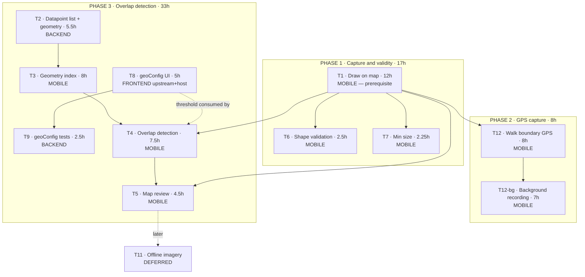

### What can start immediately

**Phase 1 has a single starting point — T1.** T6 and T7 are small and depend on it, so phase 1
is effectively one developer for two days. There is no parallelism to exploit and no backend or
frontend involvement at all.

Parallelism only appears in **phase 3**, where three independent starting points open up:

| Track | Task | Independent of |
|---|---|---|
| Backend | T2 → (T9) | everything else |
| Frontend | T8 → T9 | everything else |
| Mobile | T3 → T4 → T5 | needs T1 done, and T3 needs T2 |

Suggested allocation once phase 3 begins:

| Developer | Phase 1 (2d) | Phase 2 (1–2d) | Phase 3 (4d) |
|---|---|---|---|
| Mobile | T1, T6, T7 | T12, T12-bg | T3 (1d), T4 (1d), T5 (0.5d) |
| Backend | — | — | T2 (1d), T9 (0.5d) |
| Frontend | — | — | T8 (1d) |

**Critical path**
- Phase 1: T1 → T6/T7 = **17h ≈ 2 days**
- Through phase 3: T1 → T3 → T4 → T5 = **32h ≈ 4 days** of mobile work, with T2 needing to land
  before T3 starts

If the schedule is tight, **T1a (the WebView bridge) is the piece to prototype first** — it
carries the most unknowns and has no ARF precedent, and everything in all three phases sits on
top of it.

---

## Splitting Between a Mobile Dev and a Full-Stack Dev

### Who owns what

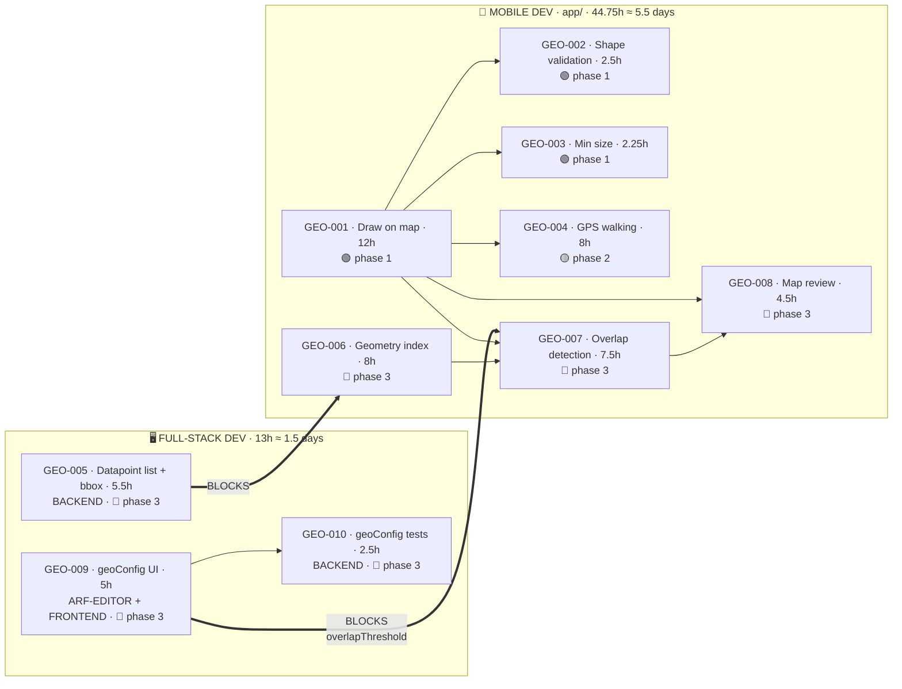

**The two thick arrows are the whole scheduling problem.** Everything else is within one lane.

### The split is heavily lopsided

| Role | Hours | Days | Share |
|---|---|---|---|
| 📱 Mobile | **44.75** *(+7h background)* | ~5.5 | **77 %** |
| 🖥️ Full-stack | **13** | ~1.5 | 23 % |

| Phase | Mobile | Full-stack |
|---|---|---|
| 🟢 1 — Capture & validity | 16.75h | **0h — nothing to do** |
| 🟡 2 — GPS walking | 8h *(+7h bg)* | **0h — nothing to do** |
| 🔵 3 — Overlap detection | 20h | 13h |

**Phases 1 and 2 have no full-stack work at all.** The full-stack developer is idle for the
first ~3.5 days if the phases are worked strictly in order.

### The scheduling insight: start the full-stack work early

The full-stack tasks are **small but blocking**. If they wait until phase 3 begins, the mobile
developer stalls twice — once waiting for GEO-005 before GEO-006, and again waiting for GEO-009
before GEO-007.

```mermaid
gantt
    title Recommended overlap — full-stack runs ahead, not alongside
    dateFormat X
    axisFormat %s

    section Mobile
    GEO-001 Draw on map        :m1, 0, 12
    GEO-002 + GEO-003          :m2, after m1, 5
    GEO-004 GPS walking        :m3, after m2, 8
    GEO-006 Geometry index     :m4, after m3, 8
    GEO-007 Overlap detection  :m5, after m4, 8
    GEO-008 Map review         :m6, after m5, 5

    section Full-stack
    GEO-005 Datapoint list     :done, f1, 0, 6
    GEO-009 geoConfig UI       :done, f2, after f1, 5
    npm release latency        :crit, f3, after f2, 8
    GEO-010 geoConfig tests    :f4, after f3, 3
```

**Start GEO-005 and GEO-009 on day one**, in parallel with GEO-001. Both are independent of all
mobile work. By the time the mobile developer reaches phase 3, both blockers are already merged
and released.

| Task | Start when | Why |
|---|---|---|
| **GEO-005** | Day 1, immediately | Blocks GEO-006. No dependency on anything |
| **GEO-009** | Day 1, immediately | Blocks GEO-007, **and carries npm release latency** (§GEO-009) |
| **GEO-010** | After GEO-009 releases | Tests the round trip GEO-009 creates |

### Why GEO-009 in particular must start first

It is 5 hours of work spanning **three repositories**:

1. `akvo-react-form-editor` — extend `SettingGeo.jsx` (upstream PR)
2. npm version bump and release — **process latency, not typing**
3. `akvo-mis/frontend` — bump the dependency, verify the round trip

The release step sits outside the team's control and has no hour estimate that means anything.
Started on day one it is invisible; started in phase 3 it becomes the critical path.

### If only one developer is available

Work the phases in order and accept ~7 days. The lopsided split means a second developer buys
roughly **1.5 days of parallelism, not half the timeline** — and only if they start early.

---

## Assumptions Behind These Estimates

State these back if any is wrong — several would move the numbers materially.

1. **T1 is in scope.** If polygon capture is expected to already exist, the plan is wrong by
   1.5 days and nothing else can be integrated.
1b. **Phase 1 is drawing-only, and drawing needs a visible basemap.** If field use must work
   offline from day one, either T11 (offline imagery) or T12 (GPS walking) has to come with it.
2. **Estimates exclude** code review turnaround, QA, release management, and the EAS build cycle.
3. **T8a lands upstream** in `akvo-react-form-editor` and is released. If upstream changes are
   blocked, the fallback (`customParams`) is worse and forces flat, array-wrapped, string-typed
   config keys the app must then unwrap.
4. **Background auto-record** is out of both T1 and T12's 5 days — it is costed at **+3 days**
   inside T12, and needs `expo-dev-client` plus an `expo-location` config plugin. Expo Go
   cannot run it.
5. **`@turf` submodules work in React Native** as expected. Pure JS, so this is low risk, but it
   has not been verified in this app.
6. **T10 and T11 are rough.** Both need a decision before they can be estimated properly.
