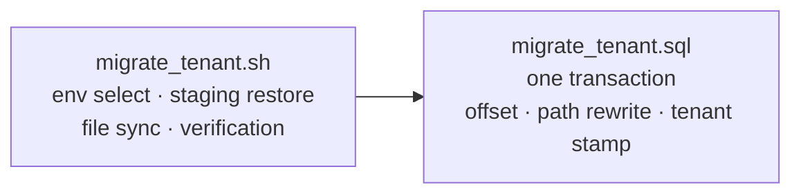
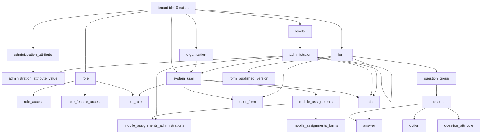

# Migrating the mohhs single-host install into the multi-tenant workspace

**Status**: done — migrated to production 2026-09-22
**Date**: 2026-09-22
**Design**: [MT-014](../design/MT-014-single-host-to-workspace-migration.md)
**Implementation**: `migration/migrate-tenant.sh`, `migration/import.sql`,
`migration/verify.sql`
**Delivery shape**: a bash entrypoint driving one SQL transform (see
[Delivery shape](#delivery-shape))

Run green locally and then against production: 8 forms, 180
administrations, 6 users, 135 submissions, 4366 answers into workspace
`mohhs`, 5 140 files transferred, every other workspace untouched. The
production workspace is live at `mohhs.mis.akvo.org`.

## Goal

Move the whole of the existing single-host `mohhs` deployment — database and
file storage — into the multi-tenant SaaS instance as the workspace
`mohhs`, reachable at `<subdomain>.<BASE_DOMAIN>`. The same procedure must
run unchanged against production, driven from a developer machine through
`kube` / `kubectl`.

Source material: `storage/mohhs/db/mohhs.sql` (9.5 MB `pg_dump`, plain
format) and `storage/mohhs/storage/` (1.4 GB).

## What this is not

It is **not** a database restore. The target is shared-table
multi-tenancy — a single `public` schema in a single database, a `tenant`
table, and a nullable `tenant_id` FK on nine root tables
([backend/utils/tenant_model.py](../../backend/utils/tenant_model.py)).
Every other model is scoped by traversal through a `TENANT_PATH`
([backend/utils/tenant_scoped_model.py](../../backend/utils/tenant_scoped_model.py)).
There is no schema or database boundary to dump into, so the operation is
a row-level import into a live database that already holds nine other
workspaces.

## Verified facts

These were checked against the dump and the running dev database, not
assumed.

### Schema drift is additive only

The dump carries 63 rows in `django_migrations`; the live database carries
77. All 14 of the difference are the multi-tenancy work itself:

| Migration | Nature |
|---|---|
| `v1_users.0002_tenant_systemuser_tenant` | new table + nullable FK |
| `v1_users.0003_organisation_tenant_…` | nullable FK |
| `v1_users.0004_backfill_default_tenant` | data migration |
| `v1_users.0005_systemuser_is_active` | additive column |
| `v1_users.0006_unique_email_per_tenant` | constraint change |
| `v1_profile.0007`, `0008` | nullable FKs on 4 models + `Role` |
| `v1_profile.0009_alter_rolefeatureaccess_access_…` | choice/type tweak |
| `v1_forms.0009_forms_tenant` | nullable FK |
| `v1_jobs.0005_alter_jobs_type` | choice/type tweak |
| `v1_visualization.0002`–`0005` | new `dashboard`, `dashboard_widget` tables |

No column is dropped or narrowed on any data-bearing table. The dump's
tables are a column-wise subset of the live ones.

### Volume is small

| Table | Rows |
|---|---|
| `answer` | 4366 |
| `question` | 787 |
| `option` | 492 |
| `administrator` | 180 |
| `data` | 135 |
| `form_published_version` | 66 |
| `question_group` | 63 |
| `mobile_assignments_forms` | 29 |
| `form` | 8 |
| `mobile_assignments_administrations` | 7 |
| `system_user` | 6 |
| `mobile_assignments` | 5 |
| `levels` | 3 |
| `user_form` | 3 |
| `organisation` | 2 |

Roughly 6 000 rows after exclusions. Excluded entirely:

- **Operational tables** — `django_session`, `django_q_task`,
  `django_q_ormq`, `django_admin_log`, `django_content_type`,
  `auth_permission`, `django_migrations`. They belong to the old install,
  not to the workspace.
- **`jobs`** (102 rows) — dropped per D4; exports are regenerated on
  demand.
- **`mobile_apks`** (11 rows) — dropped per D5; they are mobile release
  history, and only the current APK matters.

**Empty in the source, so nothing to migrate**: `data_approval`, `batch`,
`batch_data`, `batch_comment`, `batch_attachment`, `answer_history`,
`role`, `role_access`, `role_feature_access`, `user_role`, `entities`,
`entity_data`, `dashboard`.

### Two ID regimes, and only one collides

`form`, `question` and `question_group` use epoch-millisecond primary
keys. All 858 such IDs in the dump were checked against the live database:
**zero collisions**. They must be preserved as-is — mobile clients and
stored form JSON reference form IDs directly, so renumbering them would
break already-deployed apps.

Every other table uses a plain serial and **will** collide. Live maxima at
time of writing: `administrator` 15233, `answer` 29723, `option` 1265,
`data` 644, `system_user` 41, `levels` 44, `organisation` 45.

### File storage is global and flat

[backend/utils/storage.py](../../backend/utils/storage.py) has no tenant
concept: `upload(file, folder, filename)` writes to
`STORAGE_PATH/<folder>/<filename>`, and nginx serves those folders
un-namespaced. Filenames are UUID-suffixed, so merging one install's
folders into another's carries no realistic collision risk.

Source contents:

| Folder | Files | Disposition |
|---|---|---|
| `images/` | 5114 | **copy** — referenced by answers |
| `datapoints/` | 26 | **copy** (also regenerable via `generate_data_json`) |
| `download_datapoint_report/` | 91 | skip — `jobs` dropped (D4) |
| `download/` | 6 | skip — `jobs` dropped (D4) |
| `upload/` | 5 | skip — transient |
| `master_data/` | 2 | skip — regenerate via `generate_sqlite` |
| `apk/` | 1 | skip — `mobile_apks` dropped (D5) |

So the file transfer is two folders, 5140 files.

The one genuinely per-tenant path is mobile master-data SQLite, and it
lives under `MASTER_DATA` (`./source/<subdomain>/`), not `STORAGE_PATH`
([backend/utils/custom_generator.py](../../backend/utils/custom_generator.py)).
It is regenerated, never copied.

### Target workspace already exists and is scaffolded

`tenant` id 10, subdomain `mohhs`, created 2026-09-22. Registration already
produced 3 `levels`, 1 root `administrator`, and one superadmin account
(`system_user` id 41) — referred to below as the **registration
superadmin**. A partial unique index
`unique_root_administration_per_tenant` forbids a second root
administration in the same workspace.

### The source has no role model, and one user collides

All 6 source users have `is_superuser = true` and none is soft-deleted.
`role`, `role_access`, `role_feature_access` and `user_role` are all
empty — the old install governed access purely by the superuser flag and
never assigned a role to anyone.

`system_user` is column-identical between source and target apart from the
two additive columns (`tenant_id`, `is_active`). Neither has an
`administration_id`: user scope comes entirely from `user_role`, which is
empty. Imported users therefore arrive with no administration scope.

This is benign for isolation. `for_user`
([backend/utils/tenant_scoped_model.py](../../backend/utils/tenant_scoped_model.py))
filters on `user.tenant` with **no superuser bypass**, and
`django.contrib.admin` is installed but routed nowhere — there is no
`admin.site.urls` anywhere in the backend. A superuser in tenant 10 sees
tenant 10 and nothing else. The import reproduces the old install's access
posture rather than repairing it; assigning real roles is separate
follow-up work, not part of this migration.

One hard conflict: **one source account shares its email address with the
registration superadmin** — source `system_user` id 2 against tenant 10's
id 41. The `unique_email_per_tenant` constraint is on
`(email, tenant_id)`, so inserting the source row would violate it. Of the
remaining five, one shares an address with a user in tenant 1 (a different
workspace, so no constraint applies) and four exist nowhere in the target.

A pre-flight query, not a hardcoded list, must find these: any source email
that already exists under the target tenant is a collision, and the run
refuses rather than guesses if it finds one the plan does not account for.

### Production topology

- GKE, namespace `akvo-mis-namespace`, present on both the `test` and
  `production` clusters (`kube test` / `kube prod` switch credentials).
- Three Deployments: `backend`, `frontend`, `worker`. No Postgres
  StatefulSet — the backend pod runs 2/2, the sidecar being the Cloud SQL
  proxy. Database access therefore goes through a pod, not a service.
- Storage is PVC `akvo-mis`, 10 Gi RWX on `managed-nfs-storage`, mounted
  at `/app/storage`. 1.4 GB fits, and the claim is upgradable (D7) if it
  ever does not.
- A nightly `CronJob` `akvo-mis-jobs` runs at 23:00.

No per-tenant dump, restore, export or import tooling exists anywhere in
the repo.

## Decisions taken

| # | Decision | Consequence |
|---|---|---|
| D1 | Wipe the registration scaffolding, keep the login | Tenant 10's 3 levels and root administrator are deleted; the dump's hierarchy is imported wholesale; the registration superadmin survives and is re-pointed at the imported root. |
| D2 | Carry password hashes over | All 6 users log in with their existing mohhs passwords. Sessions and queued jobs are still discarded. |
| D9 | Reset the target workspace totally | **Supersedes the second half of D1.** Every row tenant 10 owns is deleted before import, including the registration superadmin; the `tenant` row survives. A superadmin is recreated with `createsuperuser --tenant=<subdomain>`. |
| D3 | Re-dump at cutover, then decommission | This snapshot is the rehearsal dataset. The script is proven locally against it, then a fresh dump is taken from live mohhs at cutover so nothing submitted in the interim is lost. The old single-host install goes read-only, then off. |
| D4 | Drop `jobs` and their exports | 102 `jobs` rows and the 97 generated report files are not migrated. Users regenerate exports on demand. |
| D5 | Drop `mobile_apks` | 11 rows are mobile release history; only one APK exists and only the current one matters. Neither rows nor file are migrated. |
| D6 | Skip the duplicate user, remap its references | The colliding source account (id 2) is not inserted. Tenant 10's registration superadmin (id 41) is kept, and every FK referencing source id 2 is repointed at 41. Follows from D1. |
| D7 | PVC capacity is not a constraint | The 10 Gi `akvo-mis` PVC is upgradable, so the 1.4 GB transfer needs no size negotiation. Free space is still checked before the run. |
| D8 | Scope is the multi-tenancy migration only | Cutover sequencing, read-only windows and decommissioning sign-off are handled separately. |

D3 makes **re-runnability a hard requirement**, not a nicety: the same
procedure runs at least twice against production-shaped data.

## Delivery shape

A bash entrypoint driving a single SQL transform, mirroring the existing
`seeder.sh` idiom (a wrapper taking `--tenant=<subdomain>` and threading
it through).

The transform is set-based — offset serial PKs, rewrite
`administrator.path`, stamp `tenant_id` — which is one statement per table
in SQL. Doing it through the Django ORM would be far more code for 6 000
rows and would still shell out to `psql` to load the dump, so the ORM earns
nothing here. The shell half exists because restoring to a staging schema,
moving 1.4 GB of files, and switching between `./dc.sh` locally and
`kube prod` + `kubectl exec` in production is shell work either way.

Keeping the SQL in its own file makes the destructive half reviewable as a
single artifact.

## Functional requirements

**FR-1 — Complete transfer.** Every workspace-owned row in the source
reaches tenant 10: forms with their question groups, questions, options and
question attributes; published versions; levels, administrations and
administration attributes; organisations; users and form assignments;
submitted data and answers; mobile assignments with their form and
administration links. Operational tables, `jobs` (D4) and `mobile_apks`
(D5) are excluded; the approval, batch and role tables are empty at source
and so migrate as nothing.

**FR-2 — Tenant attribution.** Every imported row in the nine
FK-carrying tables (`administration_attribute`, `administrator`,
`dashboard`, `entities`, `form`, `levels`, `organisation`, `role`,
`system_user`) carries `tenant_id = 10`. Traversal-scoped rows must be
reachable from a tenant-10 root by their declared `TENANT_PATH` — no
orphans.

**FR-3 — Form identity preserved.** `form.id`, `question.id` and
`question_group.id` are unchanged by the import.

**FR-4 — Serial IDs remapped without breaking references.** Colliding
serial PKs are offset consistently across every referencing FK.
`administrator.path`, which encodes ancestry as a dot-separated ID trail
(`7254.7255.7256.`), must be rewritten in lockstep with the offset.
Sequences are advanced past the imported maxima afterwards.

**FR-5 — Scaffolding replaced (D1, superseded by D9).** Everything tenant
10 owns is deleted before import, the `tenant` row aside — levels, root
administrator and the registration superadmin alike. A superadmin is
recreated afterwards with
`./manage.py createsuperuser --tenant=<subdomain>`.

D1 originally kept the registration superadmin and re-pointed it at the
imported hierarchy. A total reset was chosen instead during design: it
removes the "which account survives?" special case, and makes the reset a
clean inverse of the import. See D-9 in
[MT-014](../design/MT-014-single-host-to-workspace-migration.md).

**FR-6 — Credentials preserved (D2).** Password hashes import verbatim;
`is_active` is set so existing users can sign in immediately.

**FR-10 — Duplicate accounts reconciled (D6).** Any source account whose
email already exists under the target tenant is skipped, and every FK
referencing it — `data.created_by`, `data.updated_by`,
`user_form.user_id`, `mobile_assignments.user_id` and any other — is
repointed at the surviving target row. Collisions are found by querying,
not by a hardcoded list. After the import no `(email, tenant_id)` pair is
duplicated, and no row references a source user id that was never
inserted.

**FR-7 — Files transferred.** `images/` and `datapoints/` merge into the
target's global folders. Every file referenced by an imported answer
resolves after the move.

**FR-8 — Re-runnable (D3).** Running the procedure a second time against
the same target either produces the same result or refuses cleanly. It
never half-applies.

**FR-9 — Runs in production from a developer machine.** The same artifact
executes locally via `./dc.sh` and against production via `kube prod`
plus `kubectl exec` / `kubectl cp`, with no hand-editing between the two.

## Non-functional requirements

**NFR-1 — No collateral damage.** The nine other workspaces in the target
database are untouched. A post-import check compares their row counts
before and after.

**NFR-2 — Atomic and reversible.** The database side runs in a single
transaction. A documented rollback exists for the case where the
transaction has already committed and files are already copied.

**NFR-3 — Dry-run before commit.** The operator can see what would be
inserted, and the ID offset that would be applied, without writing.

**NFR-4 — Verifiable.** Acceptance is checked by assertion, not by
eyeballing the UI.

**NFR-5 — Production safety.** Cutover accounts for the nightly
`akvo-mis-jobs` CronJob and for PVC free space, both checked before the
run rather than discovered during it.

## Dependency order

Rows must be inserted parents-first. The shape of the constraint graph:

Only tables with rows to migrate are shown — the approval, batch, role and
history tables are empty at source, and `jobs` and `mobile_apks` are
excluded by D4 and D5.

`administrator` is self-referential, which is what makes the `path`
rewrite in FR-4 load-bearing.

## Acceptance criteria

1. `http://mohhs.<BASE_DOMAIN>:3000/control-center` lists 8 forms.
2. An old mohhs user signs in with their existing password and sees only
   mohhs data.
3. Submitted-data counts per form match the source install exactly.
4. The administration hierarchy renders to full depth; spot-checked
   `path` values resolve to the correct ancestors.
5. Photo answers render — the image files resolve over `/images/`.
6. A user from another workspace is refused at the mohhs host, and a
   mohhs user is refused at another workspace's host.
7. Row counts for the other nine tenants are unchanged (NFR-1).
8. `generate_sqlite --tenant=mohhs` produces a usable master-data file and
   a mobile assignment syncs against it.
9. The procedure runs end to end against the production cluster using only
   `kube` / `kubectl` from a developer machine.

## Open questions

All five original open questions are resolved — see D4 through D8. Q4
("do in-flight approvals still resolve?") turned out to be moot on
inspection: the source has no approval, batch or role rows at all.

What remains is follow-up work outside this migration's scope:

- **No roles are assigned after import.** All 6 imported users are
  superusers with no `user_role`, faithfully reproducing the source
  install. Isolation holds — `for_user` has no superuser bypass and
  `admin.site.urls` is not routed — but the workspace has no least
  privilege. Assigning real roles (`default_roles_seeder` plus a
  who-gets-what decision) is separate work.
- **Cutover sequencing** — read-only window, decommissioning sign-off —
  is deliberately out of scope per D8.
