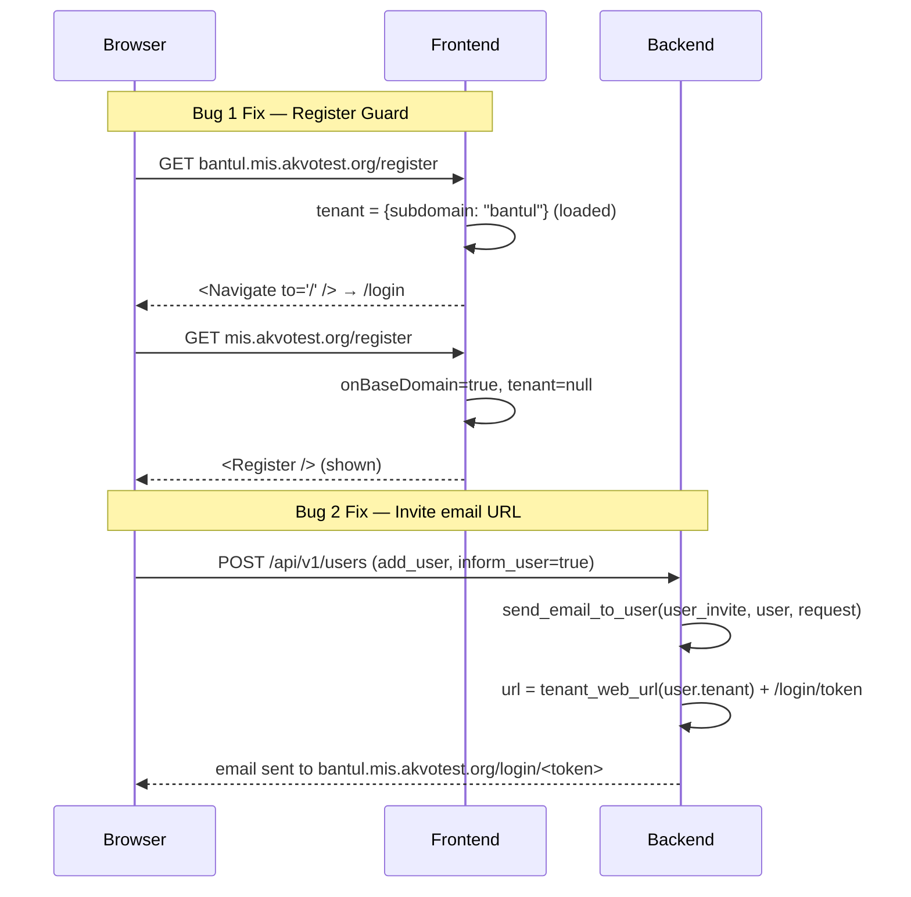

# Feature Specification: AUTH-003 Subdomain Registration Guard & Invitation Email Fix

## Overview
Two related auth-flow defects in the multi-tenant (`mis.akvotest.org`) deployment:
1. **Registration accessible on tenant subdomains** — the `/register` route is reachable from any host (e.g. `bantul.mis.akvotest.org/register`), but registration should only be available on the base domain (`mis.akvotest.org`). Visiting `/register` on a subdomain should redirect to the workspace's login page (or root).
2. **Invitation email points to WEBDOMAIN, not the tenant's URL** — `send_email_to_user` (`views.py:101`) hardcodes `WEBDOMAIN` for the "Set Password" link in the `user_invite` email. On a multi-tenant deployment, `WEBDOMAIN` is the base domain (`https://mis.akvotest.org`), so invited users receive a link to the wrong host.

## Problem Statement — 5W1H
*   **Who**: Tenant admins (invite flow) and new registrants (sign-up flow).
*   **What**: Guard `/register` to base-domain only. Fix invite email URL to use `tenant_web_url`.
*   **Where**: `frontend/src/App.js`, `frontend/src/pages/login/components/LoginForm.jsx`, `backend/api/v1/v1_users/views.py`.
*   **When**: When `BASE_DOMAIN` is set (SaaS deployment); no-ops on single-host installs.
*   **Why**: Tenant subdomains have no registration form; a visible form there is confusing and broken. Invited users can't set their password if the link is wrong.
*   **How**: Frontend: redirect `/register` to `/` when `tenant` is loaded and is not null. Backend: replace `WEBDOMAIN` with `tenant_web_url(user.tenant)` in `send_email_to_user`.

## Architecture Overview

## Backend
### DB Model Changes
None. No schema changes or migrations required.

### Logic Changes
*   **`backend/api/v1/v1_users/views.py`**:
    *   In `send_email_to_user(type, user, request)`, update the URL generation for the login link.
    *   Replace `f"{WEBDOMAIN}/login/{signing.dumps(user.pk)}"` with `f"{tenant_web_url(user.tenant)}/login/{signing.dumps(user.pk)}"`.
    *   `tenant_web_url` is already imported and handles single-host vs multi-tenant fallback automatically.

## Frontend
### Routing Changes
*   **`frontend/src/App.js`**:
    *   Update the `<Route exact path="/register" ... />`.
    *   Add condition: `!baseDomain() || onBaseDomain ? <Register /> : <Navigate to="/" />`.

### UI Component Changes
*   **`frontend/src/pages/login/components/LoginForm.jsx`**:
    *   Hide the "Create an account" link when loaded on a subdomain.
    *   Extract `tenant` from the `store`.
    *   Compute visibility flag `showRegister = !baseDomain() || !tenant`.

## Verification
### Automated Tests
*   `python manage.py test api.v1.v1_users.tests.tests_add_user` (New test to verify the invite email URL targets the tenant host)
*   `npx react-scripts test --testPathPattern=Register.test` (New test to verify `/register` redirects on subdomains)

### Manual Steps
1.  Open `bantul.mis.akvotest.org/register` → should redirect to `/login` or root.
2.  Open `mis.akvotest.org/register` → registration form renders normally.
3.  On `bantul.mis.akvotest.org/login` → "Create an account" link must NOT appear.
4.  Invite a new user from a tenant workspace (`bantul`) with "Notify user" checked → receive email → "Set Password" link must point to `bantul.mis.akvotest.org/login/<token>`, not `mis.akvotest.org/login/<token>`.

## Estimation
| Task | Details | Hours (Min-Max) | Confidence |
|------|---------|-----------------|------------|
| T-001 | Backend: fix `send_email_to_user` invite URL | 0.5 - 1.0 | High |
| T-002 | Backend: add invite-email URL test | 0.5 - 1.0 | High |
| T-003 | Frontend: guard `/register` route in App.js | 0.5 - 1.0 | High |
| T-004 | Frontend: hide "Create an account" on LoginForm | 0.5 - 1.0 | High |
| T-005 | Frontend: add Register route guard test | 0.5 - 1.5 | Medium |
| T-006 | Manual QA verification | 0.5 - 1.0 | High |
| **Total** | | **3.0 - 6.5** | |
