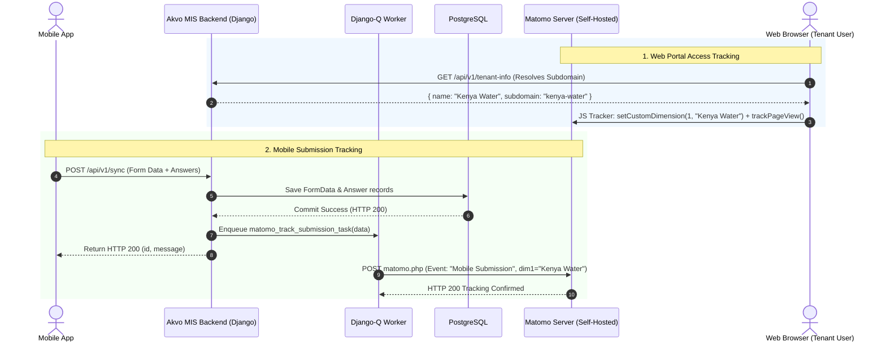

# ANALYTICS-001: Matomo Analytics for Akvo MIS (Per-Tenant Access & Mobile Submissions)

## Overview
This specification defines the analytics architecture and implementation plan for Akvo MIS using a self-hosted (or cloud) Matomo instance. The solution tracks:
1. **Per-Tenant Access**: Web portal visits and pageviews dynamically tagged with `tenant_name` and `tenant_subdomain`.
2. **Mobile Data Submissions**: Reliable, offline-resilient submission event tracking capturing `tenant_name`, `form_name`, and `submitter` as custom parameters for historical aggregation and reporting.
3. **Matomo Reporting Dashboard**: Standardized setup for visualizing multi-tenant activity, submission growth curves, and form distribution.

---

## 5W1H Analysis
- **Who**: MIS Superadmins, Tenant Administrators, and Project Managers.
- **What**: Web access metrics per tenant and historical mobile submission event tracking with tenant tagging.
- **Where**:
  - Backend: `backend/utils/matomo.py`, `backend/api/v1/v1_mobile/views.py`, `backend/mis/settings.py`.
  - Frontend: `frontend/src/util/matomo.js`, `frontend/src/App.js`, `frontend/src/lib/config.js`.
  - Matomo: Self-hosted instance (Docker/VM), Custom Dimensions, Event Tracking, Custom Dashboard.
- **When**: Real-time on web page views; asynchronously on backend receipt and persistence of mobile submissions (`/sync`).
- **Why**: Provide historical visibility into workspace adoption and mobile enumerator productivity across multiple tenants without leaking PII or adding mobile network overhead.
- **How**: Hybrid model — client-side Matomo JS tracker for SPA web visits + server-side non-blocking Matomo HTTP Tracking API for mobile submissions.

---

## Architecture Overview



---

## 1. Backend Implementation

### 1.1 Matomo Tracking Service
**File**: `backend/utils/matomo.py`
- Implements a resilient client for the [Matomo HTTP Tracking API](https://developer.matomo.org/api-reference/tracking-api).
- Sends tracking payloads using `requests.post` to `https://<MATOMO_URL>/matomo.php`.
- Supports:
  - `track_page_view(url, tenant_name, user_id=None)`
  - `track_event(category, action, name=None, value=None, tenant_name=None, custom_dimensions=None, user_id=None)`
- Configured with non-blocking error trapping: errors are logged to Sentry/Logger but **never fail the caller**.

### 1.2 Mobile Sync Integration
**File**: `backend/api/v1/v1_mobile/views.py`
- In `sync_pending_form_data(request, version)`:
  - When a form is successfully saved and published (not an interim draft), dispatch a tracking event:
    - **Category**: `"Mobile Submission"`
    - **Action**: `"Form Published"`
    - **Name**: `form.name` (e.g. `"Water Point Survey"`)
    - **Dimension 1 (`dimension1`)**: `user.tenant.name` (or `"Default"`)
    - **Dimension 2 (`dimension2`)**: `form.id`
    - **User ID**: `str(user.id)`
  - Offload to background worker or async helper to ensure zero latency overhead on mobile sync.

### 1.3 Settings Configuration
**File**: `backend/mis/settings.py`
- Add settings (Matomo is enabled automatically whenever `MATOMO_SITE_ID` is configured; defaults to `None` for zero-overhead no-op in environments without Matomo):
  ```python
  MATOMO_SITE_ID = env.int("MATOMO_SITE_ID", default=None)
  MATOMO_URL = env.str("MATOMO_URL", default="")
  MATOMO_AUTH_TOKEN = env.str("MATOMO_AUTH_TOKEN", default="")
  MATOMO_DIM_TENANT = env.int("MATOMO_DIM_TENANT", default=None)
  ```
- **Enablement & Dimension Rules**:
  - The backend service checks `if not getattr(settings, "MATOMO_SITE_ID", None) or not getattr(settings, "MATOMO_URL", ""): return` to immediately early-exit without network calls.
  - Custom dimension for tenant (`dimension{MATOMO_DIM_TENANT}=...`) is only appended if `MATOMO_DIM_TENANT` is configured (not `None`).

---

## 2. Frontend Implementation

### 2.1 Matomo Client Helper
**File**: `frontend/src/util/matomo.js`
- Initializes Matomo Tracker script in `window._paq`.
- Environment Variables (no hardcoded fallback numbers; if empty or null, feature is inactive):
  - `REACT_APP_MATOMO_URL` (default: `""`)
  - `REACT_APP_MATOMO_SITE_ID` (default: `""`)
  - `REACT_APP_MATOMO_DIM_TENANT` (default: `""`)
  - `REACT_APP_MATOMO_DIM_SUBDOMAIN` (default: `""`)
- Exposes:
  - `initMatomo()`: Only mounts `<script>` if `REACT_APP_MATOMO_URL` and `REACT_APP_MATOMO_SITE_ID` are set.
  - `setTenantDimensions({ tenantName, subdomain })`: Only calls `setCustomDimension` if the respective dimension ID env var is non-empty.
  - `trackPageView(locationPath)`

### 2.2 Route & Tenant Synchronization
**File**: `frontend/src/App.js`
- Subscribes to route navigation via React Router `useLocation()`.
- Reads `store.useState(s => s.tenant)`.
- Updates Matomo Custom Dimensions whenever tenant changes and triggers `trackPageView()`.

---

## 3. Matomo Self-Hosted Configuration & Dashboard Setup

### 3.1 Custom Dimensions Setup
1. **Dimension 1**: `Tenant Name` (*Scope: Visit & Action*)
2. **Dimension 2**: `Subdomain` (*Scope: Visit*)
3. **Dimension 3**: `Platform` (*Scope: Action*)

### 3.2 Reporting Dashboard Widgets
1. **Historical Submissions per Tenant**:
   - Report: `Visitors -> Custom Dimensions -> Tenant Name`
   - Secondary Dimension: `Event Name` (Form Name)
2. **Submission Trends Evolution**:
   - Report: `Behavior -> Events -> Event Categories (Mobile Submission)`
   - Graph: Row evolution / daily line chart
3. **Web Portal Access per Tenant**:
   - Report: `Visitors -> Custom Dimensions -> Tenant Name` (Metric: Visits, Actions, Unique Visitors)

---

## 4. Verification & Testing

### 4.1 Automated Tests
- **Backend Tests**:
  - `tests_matomo_service.py`: Verify HTTP tracking payloads, error silencing, and dimension mapping.
  - `tests_mobile_sync_analytics.py`: Verify `sync_pending_form_data` triggers Matomo tracking call with correct tenant name.
  - Command: `./dc.sh exec backend python manage.py test api.v1.v1_mobile.tests utils.tests`
- **Frontend Tests**:
  - `matomo.test.js`: Verify `_paq` script injection and pageview dispatch on route change.
  - Command: `./dc.sh exec frontend npm test src/util/__test__/matomo.test.js`

### 4.2 Manual Verification
1. Submit a form from the mobile app (or mock `/sync` payload).
2. Inspect Matomo **Real-Time Event Log** to confirm event under Category `Mobile Submission` with `Tenant Name = <Tenant>`.
3. Browse the web frontend across two different workspace subdomains and verify visits reflect under the respective `Tenant Name` dimensions.

---

## 5. Vibe Coding Estimation ⏱️

- **Confidence Level**: High
- **Dependencies**: Matomo self-hosted instance URL and Site ID

| Task ID | Component & Description | Vibe Coding (Dev) | Automated Testing | QA & Review | Total Est. Time | Priority |
| :--- | :--- | :---: | :---: | :---: | :---: | :--- |
| **ANA-01** | Backend Matomo Service Helper (`utils/matomo.py` + settings) | 30m | 20m | 15m | **65m (1.1h)** | P1 |
| **ANA-02** | Mobile Sync Event Tracking in `v1_mobile/views.py` | 30m | 25m | 15m | **70m (1.2h)** | P1 |
| **ANA-03** | Frontend Matomo Tracker Helper & Route Listener (`App.js`) | 35m | 20m | 15m | **70m (1.2h)** | P1 |
| **ANA-04** | Matomo Dashboard & Segment Documentation Guide | 20m | - | 15m | **35m (0.6h)** | P2 |
| **Total** | **Full Feature Implementation** | **115m** | **65m** | **60m** | **240m (4.0h)** | - |
