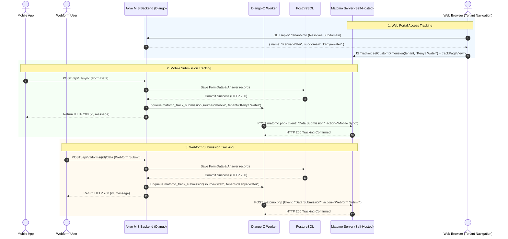

# ANALYTICS-001: Matomo Analytics for Akvo MIS (Per-Tenant Access & Data Submissions)

## Overview
This specification defines the analytics architecture and implementation plan for Akvo MIS using a self-hosted (or cloud) Matomo instance. The solution tracks:
1. **Per-Tenant Web Access**: Web portal visits and pageviews dynamically tagged with `tenant_name` and `tenant_subdomain`.
2. **Data Submissions (Mobile & Web)**: Reliable submission event tracking capturing `tenant_name`, `form_name`, and `platform` (`mobile` vs `web`) for historical aggregation, channel comparison, and tenant reporting.
3. **Matomo Reporting Dashboard**: Standardized setup for visualizing multi-tenant activity, submission growth curves, and form distribution.

---

## 5W1H Analysis
- **Who**: MIS Superadmins, Tenant Administrators, and Project Managers.
- **What**: Web access metrics per tenant and historical data submission event tracking across Mobile App and Webforms with tenant tagging.
- **Where**:
  - Backend: `backend/utils/matomo.py`, `backend/api/v1/v1_mobile/views.py` (Mobile Sync), `backend/api/v1/v1_data/views.py` (Webform Submit), `backend/mis/settings.py`.
  - Frontend: `frontend/src/util/matomo.js`, `frontend/src/App.js`, `frontend/src/lib/config.js`.
  - Matomo: Self-hosted instance (Docker/VM), Custom Dimensions, Event Tracking, Custom Dashboard.
- **When**: Real-time on web page views; asynchronously on backend receipt and persistence of mobile and webform submissions.
- **Why**: Provide full historical visibility into workspace adoption and data collection volume across multiple tenants without leaking PII or adding client-side network overhead.
- **How**: Hybrid model — client-side Matomo JS tracker for SPA web visits + server-side non-blocking Matomo HTTP Tracking API for mobile sync and webform submissions.

---

## Architecture Overview



---

## 1. Backend Implementation

### 1.1 Matomo Tracking Service
**File**: `backend/utils/matomo.py`
- Implements a resilient client for the [Matomo HTTP Tracking API](https://developer.matomo.org/api-reference/tracking-api).
- Sends tracking payloads using `requests.post` to `https://<MATOMO_URL>/matomo.php`.
- Supports:
  - `track_page_view(url, tenant_name=None, user_id=None)`
  - `track_submission_event(tenant_name, form_name, form_id, source="mobile", user_id=None)`
- Configured with non-blocking error trapping: errors are logged to Sentry/Logger but **never fail the caller**.
- Strict early-exit if `MATOMO_SITE_ID` is `None` or `MATOMO_URL` is empty.

### 1.2 Mobile & Webform Submission Integration
- **Mobile Submissions** (`backend/api/v1/v1_mobile/views.py`):
  - In `sync_pending_form_data(request, version)`:
    - When a form is successfully saved and published (not an interim draft), dispatch:
      - **Category (`e_c`)**: `"Data Submission"`
      - **Action (`e_a`)**: `"Mobile Sync"`
      - **Name (`e_k`)**: `form.name` (e.g. `"Water Point Survey"`)
      - **Custom Dimension (Tenant)**: `user.tenant.name` (if `MATOMO_DIM_TENANT` is configured)
      - **User ID (`uid`)**: `str(user.id)`
- **Webform Submissions** (`backend/api/v1/v1_data/views.py`):
  - In `SubmitDirectFormData` and `SubmitFormDataAnswerSerializer`:
    - When form data is submitted and published via web:
      - **Category (`e_c`)**: `"Data Submission"`
      - **Action (`e_a`)**: `"Webform Submit"`
      - **Name (`e_k`)**: `form.name`
      - **Custom Dimension (Tenant)**: `request.user.tenant.name` (if `MATOMO_DIM_TENANT` is configured)
      - **User ID (`uid`)**: `str(request.user.id)`

### 1.3 Settings Configuration
**File**: `backend/mis/settings.py`
- Add settings (Matomo is enabled automatically whenever `MATOMO_SITE_ID` is configured; defaults to `None` for zero-overhead no-op in environments without Matomo):
  ```python
  MATOMO_SITE_ID = env.int("MATOMO_SITE_ID", default=None)
  MATOMO_URL = env.str("MATOMO_URL", default="")
  MATOMO_AUTH_TOKEN = env.str("MATOMO_AUTH_TOKEN", default="")
  MATOMO_DIM_TENANT = env.int("MATOMO_DIM_TENANT", default=None)
  ```
- **Enablement & Dimension Rules**:
  - The backend service checks `if not getattr(settings, "MATOMO_SITE_ID", None) or not getattr(settings, "MATOMO_URL", ""): return` to immediately early-exit without network calls.
  - Custom dimension for tenant (`dimension{MATOMO_DIM_TENANT}=...`) is only appended if `MATOMO_DIM_TENANT` is configured (not `None`).

---

## 2. Frontend Implementation

### 2.1 Matomo Client Helper
**File**: `frontend/src/util/matomo.js`
- Initializes Matomo Tracker script in `window._paq`.
- Environment Variables (no hardcoded fallback numbers; if empty or null, feature is inactive):
  - `REACT_APP_MATOMO_URL` (default: `""`)
  - `REACT_APP_MATOMO_SITE_ID` (default: `""`)
  - `REACT_APP_MATOMO_DIM_TENANT` (default: `""`)
  - `REACT_APP_MATOMO_DIM_SUBDOMAIN` (default: `""`)
- Exposes:
  - `initMatomo()`: Only mounts `<script>` if `REACT_APP_MATOMO_URL` and `REACT_APP_MATOMO_SITE_ID` are set.
  - `setTenantDimensions({ tenantName, subdomain })`: Only calls `setCustomDimension` if the respective dimension ID env var is non-empty.
  - `trackPageView(locationPath)`

### 2.2 Route & Tenant Synchronization
**File**: `frontend/src/App.js`
- Subscribes to route navigation via React Router `useLocation()`.
- Reads `store.useState(s => s.tenant)`.
- Updates Matomo Custom Dimensions whenever tenant changes and triggers `trackPageView()`.

---

---

## 3. Matomo Self-Hosted Configuration & Prerequisites (Multi-Project Shared Instance)

### 3.1 Multi-Project Shared Instance Isolation Safeguards
When your Matomo instance is shared across multiple applications (e.g. Akvo MIS, Flow, Lumen, RSR), follow these isolation rules to prevent cross-project pollution:

1. **Website (Site ID) Isolation**:
   - Akvo MIS MUST have its own dedicated Website entry (e.g. `Akvo MIS`) with its own distinct `Site ID`.
   - All tracking data, custom dimensions, and dashboard reports are strictly partitioned by this `Site ID`.
2. **Per-Site Custom Dimensions Scoping**:
   - Matomo binds Custom Dimensions to the active website. **Always select `Akvo MIS` in the top site dropdown** before creating custom dimensions.
   - This guarantees that `Dimension 1` (`Tenant Name`) in Akvo MIS operates independently and never collides with `Dimension 1` in other projects.
3. **Dedicated Least-Privilege Service Account (`token_auth`)**:
   - Do NOT use a global Superuser token.
   - Create a dedicated user (e.g. `mis-backend-tracker`) under **Administration -> System -> Users**.
   - Grant this user **`Write` (or `Admin`) permission ONLY to the Akvo MIS Website/Site ID** (and `No Access` to other projects).
   - Generate the `token_auth` from this service user. If rotated or compromised, other projects remain completely unaffected.

### 3.2 Mandatory Sequential Order of Operations
> [!IMPORTANT]
> **Order of Setup is Critical**: You MUST create the Website (`Akvo MIS`) **first** before configuring custom dimensions. Custom dimensions in Matomo are attached directly to a specific Website (Site ID). Configuring dimensions before creating the site will cause dimensions to attach to other projects or fail.

```
┌────────────────────────────────────────────────────────────────────────┐
│ 1. Add Website ("Akvo MIS") ➔ Matomo assigns unique Site ID (e.g. 3)  │
└───────────────────────────────────┬────────────────────────────────────┘
                                    │
                                    ▼
┌────────────────────────────────────────────────────────────────────────┐
│ 2. Select "Akvo MIS" in top site dropdown ➔ Create Custom Dimensions   │
│    - Dimension 1: "Tenant Name" (Scope: Visit)                         │
│    - Dimension 2: "Subdomain" (Scope: Visit)                           │
└───────────────────────────────────┬────────────────────────────────────┘
                                    │
                                    ▼
┌────────────────────────────────────────────────────────────────────────┐
│ 3. Create Service User ("mis-backend-tracker") ➔ Grant Write to Site 3 │
│    - Generate token_auth for Django backend tracking                   │
└───────────────────────────────────┬────────────────────────────────────┘
                                    │
                                    ▼
┌────────────────────────────────────────────────────────────────────────┐
│ 4. Configure Privacy ➔ Enable 2-byte IP Anonymization                  │
└────────────────────────────────────────────────────────────────────────┘
```

### 3.3 Step-by-Step Server Setup Guide (One-Time)
Before running the integration code in production, execute the following steps in sequence on the shared Matomo instance:

1. **Step 1: Create Dedicated Website for Akvo MIS (FIRST)**
   - Click the **Gear icon (⚙️)** in the top bar to open **Administration**.
   - Navigate to **Websites -> Manage** (in some Matomo versions/themes, labeled **Measurables -> Manage**, or click the site selector at top-left and select **"Manage Websites"**).
   - Click **Add a new website**:
     - **Name**: `Akvo MIS` (or `Akvo MIS Production`)
     - **Main URL**: `https://<your-base-domain>` (e.g. `https://akvo.org`)
   - Click **Save** and note the generated **`Site ID`** (e.g. `3`).

2. **Step 2: Create Custom Dimensions (Scoped to Akvo MIS Site)**
   - Select **`Akvo MIS`** from the website selector dropdown at the top navigation bar.
   - Go to **Websites -> Custom Dimensions** (or **Measurables -> Custom Dimensions**).
     *(Note: If Custom Dimensions is not listed in the menu, go to **Administration -> System -> Plugins** and activate the built-in **CustomDimensions** plugin).*
   - Click **Create a new custom dimension**:
     - **Name**: `Tenant Name` | **Scope**: `Visit` | **Active**: `Yes`
     - Note the assigned **Dimension ID** (e.g. `1`).
   - Click **Create a new custom dimension** (Optional for subdomain):
     - **Name**: `Subdomain` | **Scope**: `Visit` | **Active**: `Yes`
     - Note the assigned **Dimension ID** (e.g. `2`).

3. **Step 3: Generate Auth Token (`token_auth`) for Backend Server-Side Tracking**
   - **Fastest Method**:
     - Click **Personal** on the left menu (or your user avatar in the top-right) -> **Security -> Auth tokens**.
     - Click **Create new token** with description `Akvo MIS Backend Tracking`.
     - Enter your password to confirm and copy the 32-character hexadecimal token.
   - **Alternative (Dedicated Service User for strict multi-project isolation)**:
     - Go to **Administration (⚙️) -> System -> Users -> Add a new user** (Username: `mis-backend-tracker`, Email: any team email e.g. `tech@akvo.org`).
     - In **User Permissions**, assign **`Write`** access to `Akvo MIS` (and `No Access` to other projects).
     - Log in as `mis-backend-tracker` -> **Personal -> Security -> Auth tokens** -> generate token.

4. **Step 4: Configure Privacy & IP Anonymization**
   - Go to **Administration (⚙️) -> Privacy -> Anonymize data**.
   - Ensure **Anonymize Visitors' IP addresses** is checked (masking 2 bytes, e.g. `192.168.xxx.xxx`) for GDPR compliance.

### 3.4 Environment Variables Configuration

#### Backend (`backend/.env`):
```bash
MATOMO_URL=https://matomo.your-server.com
MATOMO_SITE_ID=3
MATOMO_AUTH_TOKEN=your_generated_token_auth
MATOMO_DIM_TENANT=1
```

#### Frontend (`frontend/.env`):
```bash
REACT_APP_MATOMO_URL=https://matomo.your-server.com
REACT_APP_MATOMO_SITE_ID=3
REACT_APP_MATOMO_DIM_TENANT=1
REACT_APP_MATOMO_DIM_SUBDOMAIN=2
```

### 3.5 Reporting Dashboard & Key Widgets Setup

Follow these step-by-step instructions in the Matomo UI to create and configure the dashboard:

#### Step 1: Create the Dashboard
1. Log in to your Matomo instance (e.g., `https://matomo.cloud.akvo.org`).
2. Select your website from the top website selector (e.g. site ID `8`).
3. In the left navigation menu, click **Dashboard**.
4. In the top sub-bar (next to the date picker), click the **Dashboard** dropdown menu (or click **Dashboard** $\rightarrow$ **Manage dashboards**).
5. Click **Create new dashboard**.
6. Enter the name: `Akvo MIS - Tenant & Submissions Overview`.
7. Choose your preferred layout (e.g. **2 columns** or **3 columns**) or select **Empty dashboard** to customize from scratch.
8. Click **Create** / **Save**.

#### Step 2: Add Recommended Widgets
In the top dashboard sub-bar, click **Widgets** (or **Add a widget**) and select the following widgets:

1. **Submissions by Channel (Mobile vs Web)**:
   - Category: `Behavior` $\rightarrow$ `Events`
   - Select: `Event Actions` (shows `Mobile Sync` vs `Webform Submit` counts and totals)
2. **Submissions by Form**:
   - Category: `Behavior` $\rightarrow$ `Events`
   - Select: `Event Names` (shows breakdown of submissions per form name)
3. **Data Submissions Evolution (Trend Over Time)**:
   - Category: `Behavior` $\rightarrow$ `Events`
   - Select: `Events Overview` or `Event Categories` $\rightarrow$ click row evolution on `Data Submission`
4. **Traffic & Visits per Tenant**:
   - Category: `Visitors` $\rightarrow$ `Custom Dimensions`
   - Select: `tenant_name` (Dimension 1) to view visits, actions, and unique users per workspace
5. **Subdomain Distribution**:
   - Category: `Visitors` $\rightarrow$ `Custom Dimensions`
   - Select: `subdomain` (Dimension 2)
6. **Top Visited MIS Pages**:
   - Category: `Behavior`
   - Select: `Pages` (shows URL paths such as `/control-center`, `/data`, `/reports`)

#### Step 3: Create Recommended Custom Reports (Custom Widget Names & Multi-Level Breakdowns)

Standard Matomo widgets use fixed system titles (e.g. *Actions: Event Actions*). To have **custom widget names** and nested breakdowns, navigate to **Custom Reports** $\rightarrow$ **Manage Custom Reports** (or click **Create new report**) and create the following 4 reports:

---

##### Report 1: Tenant Submissions Overview (Mobile vs Web) — *Primary Submissions Tracker*
* **Purpose**: Track total form submissions per tenant workspace and see the distribution between Mobile App and Webform.
* **Report Name**: `Tenant Submissions Overview` *(Becomes widget title)*
* **Report Type**: `Table`
* **Dimensions**:
  1. Dimension 1: `Visitors` $\rightarrow$ `Tenant Name`
  2. Dimension 2: `Events` $\rightarrow$ `Event Action` *(breaks down into `Mobile Sync` vs `Webform Submit`)*
* **Metrics**:
  - `Total Events` *(tracks count of submissions)*
  - `Visitors` $\rightarrow$ `Visits`
  - `Visitors` $\rightarrow$ `Unique Visitors`
* **Filter**:
  - `Events` $\rightarrow$ `Event Category` **equals** `Data Submission`

---

##### Report 2: Submissions by Form & Workspace — *Form-Level Volume Breakdown*
* **Purpose**: Identify which specific surveys/forms are receiving submissions within each workspace.
* **Report Name**: `Submissions by Form & Tenant`
* **Report Type**: `Table`
* **Dimensions**:
  1. Dimension 1: `Visitors` $\rightarrow$ `Tenant Name`
  2. Dimension 2: `Events` $\rightarrow$ `Event Name` *(individual Form Title)*
  3. Dimension 3: `Events` $\rightarrow$ `Event Action` *(Mobile vs Web)*
* **Metrics**:
  - `Total Events`
* **Filter**:
  - `Events` $\rightarrow$ `Event Category` **equals** `Data Submission`

---

##### Report 3: Tenant Web Activity & Page Usage — *Workspace Engagement*
* **Purpose**: Track user engagement, pageviews, and feature usage (`/control-center`, `/data`, `/reports`) per workspace.
* **Report Name**: `Tenant Web Activity`
* **Report Type**: `Table`
* **Dimensions**:
  1. Dimension 1: `Visitors` $\rightarrow$ `Tenant Name`
  2. Dimension 2: `Behaviour` $\rightarrow$ `Page URL` (or `Page Title`)
* **Metrics**:
  - `Behaviour` $\rightarrow$ `Pageviews`
  - `Visitors` $\rightarrow$ `Visits`
  - `Visitors` $\rightarrow$ `Unique Visitors`
* **Filter**: *None (records all web browsing activity)*

---

##### Report 4: Submission Trends Over Time — *Historical Growth Chart*
* **Purpose**: Visual timeline graph showing how submissions grow over time across days, weeks, and months.
* **Report Name**: `Submission Trends Over Time`
* **Report Type**: `Evolution` *(renders a time-series graph directly without dimensions)*
* **Metrics**:
  - `Total Events`
* **Filter**:
  - `Events` $\rightarrow$ `Event Category` **equals** `Data Submission`

---

#### Step 4: Add Custom Reports to Dashboard & Organize Layout

1. Go back to **Dashboard** in the left navigation.
2. Click **Manage Dashboard** $\rightarrow$ **Add a widget** (or the top **Widgets** dropdown).
3. Under the category **Custom Reports**, click each of your new custom reports to add them to the dashboard.
4. **Recommended 2-Column Dashboard Layout**:
   - **Left Column**:
     - `Tenant Submissions Overview` (Table)
     - `Submissions by Form & Tenant` (Table)
   - **Right Column**:
     - `Submission Trends Over Time` (Evolution Graph)
     - `Tenant Web Activity` (Table)
     - `Visits in real-time` (Real-time live visits stream)
5. **Date Scope & Real-time Verification**:
   - Set the date range at the top to **"Today"** or **"Day"** for real-time validation.
   - Select **"Week / Month"** for aggregated historical trend analysis.

---

## 4. Verification & Testing

### 4.1 Automated Tests
- **Backend Tests**:
  - `tests_matomo_service.py`: Verify HTTP tracking payloads, error silencing, and dimension mapping.
  - `tests_mobile_sync_analytics.py`: Verify `sync_pending_form_data` triggers Matomo tracking with `action="Mobile Sync"`.
  - `tests_webform_analytics.py`: Verify webform submission triggers Matomo tracking with `action="Webform Submit"`.
  - Command: `./dc.sh exec backend python manage.py test api.v1.v1_mobile.tests api.v1.v1_data.tests utils.tests`
- **Frontend Tests**:
  - `matomo.test.js`: Verify `_paq` script injection and pageview dispatch on route change.
  - Command: `./dc.sh exec frontend npm test src/util/__test__/matomo.test.js`

### 4.2 Manual Verification
1. Submit a form from the mobile app $\rightarrow$ verify Matomo event `Category="Data Submission"`, `Action="Mobile Sync"`, `Tenant="<Tenant>"`.
2. Submit a form from the web dashboard $\rightarrow$ verify Matomo event `Category="Data Submission"`, `Action="Webform Submit"`, `Tenant="<Tenant>"`.
3. Browse the web frontend across two different workspace subdomains and verify visits reflect under the respective `Tenant Name` dimensions.

---

## 5. Vibe Coding Estimation ⏱️

- **Confidence Level**: High
- **Dependencies**: Matomo self-hosted instance URL and Site ID

| Task ID | Component & Description | Vibe Coding (Dev) | Automated Testing | QA & Review | Total Est. Time | Priority |
| :--- | :--- | :---: | :---: | :---: | :---: | :--- |
| **ANA-01** | Backend Matomo Service Helper (`utils/matomo.py` + settings) | 30m | 20m | 15m | **65m (1.1h)** | P1 |
| **ANA-02** | Mobile & Webform Submission Event Tracking (`v1_mobile` & `v1_data`) | 35m | 30m | 15m | **80m (1.3h)** | P1 |
| **ANA-03** | Frontend Matomo Tracker Helper & Route Listener (`App.js`) | 35m | 20m | 15m | **70m (1.2h)** | P1 |
| **ANA-04** | Matomo Dashboard & Segment Documentation Guide | 20m | - | 15m | **35m (0.6h)** | P2 |
| **Total** | **Full Feature Implementation** | **120m** | **70m** | **60m** | **250m (4.2h)** | - |
