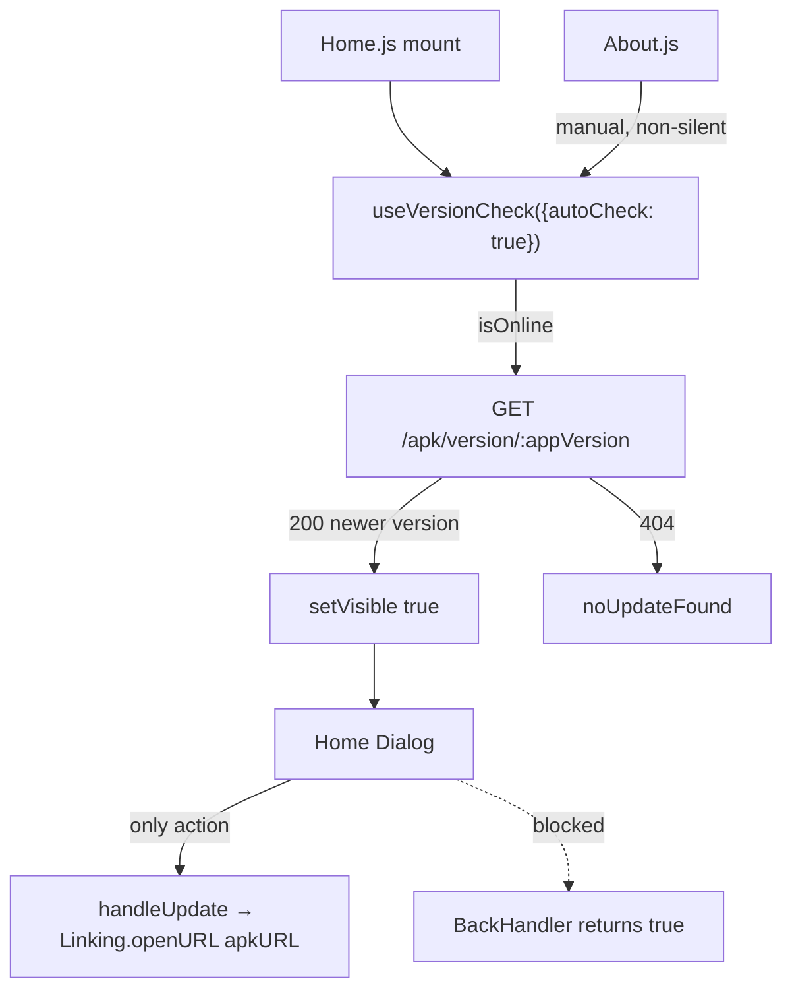
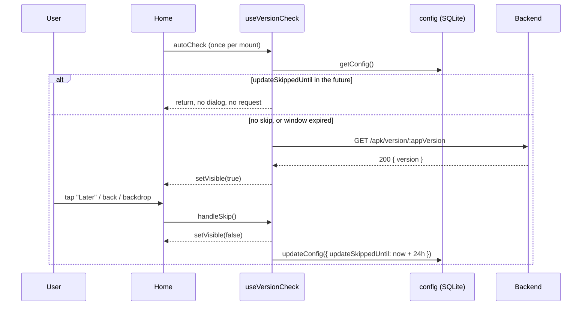

# Feature Design: Dismissible App Update Dialog

**Task ID**: APP-254
**Author**: Iwan Firmawan
**Date**: 2026-07-10
**Status**: Implemented
**Branch**: `feature/254-add-dismiss-button-to-app-update-dialog`
**Scope**: Mobile app only (`app/`). No backend, frontend, or API changes.

---

## 1. Context & Problem Statement

State as of `ea39c883`, the commit this branch started from.

```
Before this change:
- On Home mount, useVersionCheck({ autoCheck: true }) silently calls
  GET /apk/version/:appVersion. A 200 means a newer APK exists, and the
  Home dialog opens.
- The dialog cannot be closed: onBackdropPress is a no-op, the Android
  hardware back button is swallowed by a BackHandler listener, and the
  only action is "Update".
- A field worker who is online but cannot install a ~50MB APK right then
  (metered data, low battery, mid-survey) is locked out of the entire app.

Goal:
- Give the user a "Later" action that closes the dialog and keeps it closed
  for 24 hours, across app restarts.
- Keep the update prompt effective: it must reappear after the window.
```

### Current call graph



`hasChecked` (a `useRef`) already limits the silent check to once per mount, so
the dialog cannot re-open mid-session. Persistence is only needed to survive
remount (navigating back to Home) and app restart.

---

## 2. Requirements

### User Acceptance Criteria
- [x] The update dialog shows two actions: **Later** and **Update**.
- [x] Tapping **Later** closes the dialog immediately.
- [x] Android hardware back also dismisses the dialog (same effect as **Later**), instead of being swallowed.
- [x] The dialog does not reappear for 24 hours — including after killing and relaunching the app.
- [x] After 24 hours, the next online Home visit shows it again.
- [x] While dismissed, the user can open forms and collect data normally.
- [x] The manual "check for update" flow in `About` is unaffected: it always shows its result, even inside a skip window.

### Technical Acceptance Criteria
- [x] No new npm/native dependency, therefore no forced EAS rebuild to ship the schema change (see [D-1](#d-1-where-to-persist-the-skip-timestamp)).
- [x] Skip timestamp survives app restart.
- [x] A failure to persist the timestamp still dismisses the dialog (dismissal must never be blocked by a DB error, see [D-6](#d-6-persistence-failure-behaviour)).
- [x] Existing installs migrate without data loss and without re-prompting spuriously.
- [ ] `npm run lint` and `npm run prettier-check` pass in `app/`.

---

## 3. Data Model Changes

Mobile SQLite only. No Django models touched.

### Modified Models

| Table | Change | Reason |
|-------|--------|--------|
| `config` | Add `updateSkippedUntil DATETIME` (nullable) | ISO-8601 instant before which the auto update dialog stays suppressed |

`config` is the existing singleton row (`id = 1`) that already holds
`syncInterval`, `syncWifiOnly`, `lang`, `imageQuality` — device-scoped
preferences. A skip deadline is the same kind of value.

`app/src/database/tables.js`:

```javascript
{
  name: 'config',
  fields: {
    // ...existing fields
    imageQuality: "VARCHAR(20) DEFAULT 'low'",
    updateSkippedUntil: 'DATETIME',   // ISO string; NULL = never skipped
  },
},
```

### Migration Strategy

Follows `06_add_imageQuality_to_config.js` exactly.

New file `app/src/database/migrations/07_add_updateSkippedUntil_to_config.js`:

```javascript
import sql from '../sql';

const tableName = 'config';
const fieldName = 'updateSkippedUntil';
const fieldType = 'DATETIME';

const up = async (db) => {
  await sql.addNewColumn(db, tableName, fieldName, fieldType);
};

const down = () => {
  throw new Error(
    'Migration 07 is irreversible. To remove updateSkippedUntil, create a new forward migration.',
  );
};

export { up, down };
```

Wired up in three places:

| File | Change |
|------|--------|
| `app/src/database/migrations/index.js` | `export * as m07 from './07_add_updateSkippedUntil_to_config';` |
| `app/src/lib/constants.js` | `DATABASE_VERSION` `6 → 7` |
| `app/App.js` | import `m07`; add the `currentDbVersion === 6` block |

```javascript
// App.js — migrateDbIfNeeded, appended after the m06 block
if (currentDbVersion === 6) {
  await sql.withTransaction(db, async (txDb) => {
    await m07.up(txDb);
    await txDb.execAsync('PRAGMA user_version = 7');
  });
  currentDbVersion = 7;
}
```

Migration properties, matching the invariants already documented in `App.js`:
- **Default for existing rows**: `NULL` → falsy → no skip window → dialog behaves as today on first launch after upgrade. Correct.
- **Data preservation**: `ALTER TABLE ... ADD COLUMN`, additive only.
- **Idempotent**: `sql.addNewColumn` checks column existence before adding, and the transaction sets `user_version` atomically, so a crash mid-migration is retried safely on next launch.
- **Rollback**: forward-only, consistent with migrations 03–06.

---

## 4. API Contract

No changes. The existing endpoint is unchanged and still the only network call:

| Method | URL | Purpose | Auth |
|--------|-----|---------|------|
| GET | `/apk/version/:appVersion` | 200 + `{version}` if a newer APK exists; 404 if current | Required |

The skip check happens **before** this request, so a dismissed user makes no
version request at all — a small bandwidth win on metered connections.

---

## 5. Decision Log

### D-1: Where to persist the skip timestamp

**Options Considered**:
1. `expo-secure-store` — as suggested in issue #254.
2. `@react-native-async-storage/async-storage` — as suggested in issue #254.
3. Existing `config` table in SQLite via `crudConfig`.

Neither (1) nor (2) is currently in `app/package.json`.

**Decision**: Option 3 — a nullable `updateSkippedUntil` column on `config`.

**Rationale**:
- Both alternatives are **native modules**. Adding one means the JS bundle can no longer run against the currently installed APK or the existing dev client — every developer and tester needs a new EAS build before this branch runs at all. That is a large ceremony for one timestamp.
- `expo-sqlite` is already installed, the DB is already open app-wide via `SQLiteProvider`, and `crudConfig.getConfig` / `crudConfig.updateConfig` already exist. Nothing new is introduced except one column.
- `config` is semantically the right home: it is the device-preferences singleton (`syncInterval`, `syncWifiOnly`, `lang`, `imageQuality`).
- `expo-secure-store` is specifically for secrets (Keychain / Android Keystore). A skip deadline is not a secret, and SecureStore is the slower of the two proposed options.

**Cost accepted**: one migration file, one line in `tables.js`, one export, one `DATABASE_VERSION` bump. AsyncStorage would have saved the migration (~20 lines) at the price of a native dependency and a rebuild gate.

**Impact**: `DATABASE_VERSION` 6 → 7. Mobile DB only; backend and web untouched.

**Revisit if**: a background task (e.g. `SYNC_FORM_SUBMISSION_TASK_NAME`) ever needs to read this value without an open DB handle, or a second unrelated key-value need appears. Then AsyncStorage earns its keep.

### D-2: Suppression window semantics

**Options Considered**:
1. Store the dismissal instant; compare `now - dismissedAt > 24h`.
2. Store the deadline `now + 24h`; compare `now < updateSkippedUntil`.

**Decision**: Option 2 — store the deadline.

**Rationale**: The read path becomes a single comparison with no arithmetic, and the window length lives at exactly one call site (`handleSkip`). Changing 24h to 12h later touches one constant and does not reinterpret already-stored rows in a surprising way.

**Impact**: `SKIP_UPDATE_DURATION_MS` in `app/src/lib/constants.js` alongside the other tunables.

### D-3: Whether the skip check applies to the manual check in `About`

**Options Considered**:
1. Skip window suppresses every `checkVersion()` call.
2. Skip window suppresses only the silent/automatic call from Home.

**Decision**: Option 2 — gate on `silent === true`.

**Rationale**: `About` calls `checkVersion(false)`, which opens the dialog immediately with a "Checking for update" state — the user explicitly asked. Suppressing it would make the button appear broken. The 24-hour window is about *unsolicited interruption*, not about hiding the information.

**Impact**: `checkVersion` reads `config` only on the silent path.

### D-4: What the Android back button should do

**Options Considered**:
1. Keep swallowing back (`() => true`).
2. Delete the `BackHandler` effect entirely.
3. Route back through `handleSkip`.

**Decision**: Option 3.

**Rationale**: (1) contradicts the whole feature. (2) is worse than it looks — RNEUI's `Dialog` does not close itself on back, so back would navigate away from `Home` while the dialog is still mounted over the next screen. (3) makes back mean exactly what "Later" means, which is what Android users expect from a dismissible dialog.

**Impact**: `Home.js` `BackHandler` listener calls `handleSkip()` and returns `true`.

### D-5: Flat window, not version-aware

**Options Considered**:
1. Flat 24h window: once dismissed, no prompt until the deadline passes, regardless of what version the server offers.
2. Version-aware reset: store the dismissed version alongside the deadline; a *newer* version than the dismissed one re-prompts immediately.

**Decision**: Option 1 — flat window.

**Rationale**: Option 2 inverts the ordering that makes this design cheap. The
skip check currently runs *before* `GET /apk/version/:appVersion`, so a dismissed
user issues no request at all — free bandwidth on a metered connection, which is
the exact situation that makes a user press "Later". To reset on version change
you must first learn the available version, so the request has to fire on every
Home mount even inside the window, and only then can you decide whether to render.
That buys back at most 24 hours of prompt staleness — the window expires on its
own — at the price of a per-mount request, a second column
(`updateSkippedVersion`), and a comparison branch.

**Impact**: `config` needs exactly one new column. The silent path stays
zero-request while dismissed.

**Revisit if**: releases become frequent enough that a 24h stale prompt is a real
problem, or if the response gains a `mandatory` flag (see §11) — at that point
the request must fire anyway and Option 2 becomes nearly free.

### D-6: Persistence failure behaviour

**Decision**: `handleSkip` closes the dialog first / regardless; a failed write is reported to Sentry and swallowed.

**Rationale**: `crudConfig.updateConfig` throws if the `config` row is missing or the DB is locked. A user must never be re-trapped in a blocking dialog because of a write error. The worst case of a swallowed failure is that the dialog reappears on next launch — annoying, not blocking. The inverse (a thrown error leaving `visible === true`) reintroduces exactly the bug we are fixing.

---

## 6. Type/Constant Mappings

| Constant | File | Value | Meaning |
|----------|------|-------|---------|
| `DATABASE_VERSION` | `app/src/lib/constants.js` | `7` | Bumped from `6` |
| `SKIP_UPDATE_DURATION_MS` | `app/src/lib/constants.js` | `24 * 60 * 60 * 1000` | Suppression window |
| `config.updateSkippedUntil` | SQLite | ISO-8601 string / `NULL` | `NULL` = never dismissed |

| Translation key | `en` | `fr` |
|-----------------|------|------|
| `buttonLater` | `Later` | `Plus tard` |

`app/src/lib/i18n/ui-text.js` currently carries `en` and `fr` only; both get the key.

---

## 7. Implementation

### Files changed

| File | Change |
|------|--------|
| `app/src/database/tables.js` | Add `updateSkippedUntil: 'DATETIME'` to `config.fields` |
| `app/src/database/migrations/07_add_updateSkippedUntil_to_config.js` | **New** — mirrors migration 06 |
| `app/src/database/migrations/index.js` | Export `m07` |
| `app/src/lib/constants.js` | `DATABASE_VERSION = 7`; add `SKIP_UPDATE_DURATION_MS` |
| `app/App.js` | Import `m07`; add `currentDbVersion === 6` migration block |
| `app/src/hooks/use-version-check.js` | Add `handleSkip`; gate the silent check on the skip window |
| `app/src/pages/Home.js` | Add the **Later** dialog button; route `BackHandler` to `handleSkip` |
| `app/src/lib/i18n/ui-text.js` | Add `buttonLater` (en, fr) |

`app/src/pages/About/About.js` needs no change — it destructures only what it
already uses. It does gain an indirect dependency on `SQLiteProvider` through the
hook, which it satisfies today; any future test rendering `About` must now provide
a `useSQLiteContext` mock.

### `use-version-check.js`

The hook took no DB handle. It gains one from `useSQLiteContext()`;
both call sites (`Home`, `About`) already render under `SQLiteProvider`.

```javascript
const db = useSQLiteContext();

const checkVersion = useCallback(
  async (silent = false) => {
    if (!isOnline) {
      return;
    }
    if (silent) {
      const config = await crudConfig.getConfig(db);
      const skippedUntil = config?.updateSkippedUntil;
      if (skippedUntil && new Date(skippedUntil) > new Date()) {
        return;
      }
    }
    setChecking(true);
    // ...unchanged: api.get, setUpdateInfo, setVisible
  },
  [db, appVersion, isOnline, trans.newVersionAvailable, trans.noUpdateFound],
);

const handleSkip = useCallback(async () => {
  setVisible(false); // D-6: never let a write error re-trap the user
  try {
    const skipUntil = new Date(Date.now() + SKIP_UPDATE_DURATION_MS).toISOString();
    await crudConfig.updateConfig(db, { updateSkippedUntil: skipUntil });
  } catch (error) {
    Sentry.captureMessage('[VersionCheck] Unable to persist update skip');
    Sentry.captureException(error);
  }
}, [db]);
```

`checkVersion` becoming `async` is safe: the `autoCheck` effect calls it
fire-and-forget, and `About` does not await it. The `hasChecked` ref still
locks the effect to one run per mount before the `await` is reached.

`handleSkip` is added to the hook's return value.

### `Home.js`

```javascript
const {
  visible: updateDialogVisible,
  updateInfo,
  handleUpdate,
  handleSkip,
} = useVersionCheck({ autoCheck: true });

useEffect(() => {
  if (!updateDialogVisible) {
    return () => {};
  }
  const subscription = BackHandler.addEventListener('hardwareBackPress', () => {
    handleSkip();
    return true;
  });
  return () => subscription.remove();
}, [updateDialogVisible, handleSkip]);
```

```jsx
<Dialog isVisible={updateDialogVisible} onBackdropPress={handleSkip}>
  <Dialog.Title title={trans.updateRequiredTitle} />
  <Text>{updateInfo.text}</Text>
  <Dialog.Actions>
    <Dialog.Button testID="update-skip-button" onPress={handleSkip}>
      {trans.buttonLater}
    </Dialog.Button>
    <Dialog.Button testID="update-confirm-button" onPress={handleUpdate}>
      {trans.buttonUpdate}
    </Dialog.Button>
  </Dialog.Actions>
</Dialog>
```

Backdrop press now dismisses as well — with an explicit **Later** action present,
a no-op backdrop is just a dead zone.

### Resulting flow



---

## 8. Compatibility & Migration

### Backward Compatibility
- [x] Existing API consumers unaffected — no API surface changed
- [x] Existing local data preserved — additive `ALTER TABLE`
- [x] CLI tools / seeders unaffected — mobile-only change

### Mobile App Impact
- [x] Sync endpoints affected: none
- [x] SQLite schema changes: **yes** — `config.updateSkippedUntil`, `DATABASE_VERSION` 6 → 7
- [x] Version detection: unchanged; still `GET /apk/version/:appVersion`
- [x] New native dependency: **no** — this branch runs on the existing dev client and existing APK bundles

### Downgrade note
An older JS bundle running against a `user_version = 7` database hits
`currentDbVersion >= DATABASE_VERSION` and returns early. The extra column is
simply ignored. No crash.

### Seeder/CLI Compatibility
- [x] Existing seeders work
- [x] No new seeder commands

---

## 9. Security Considerations

- [x] **Permission model**: none needed. `config` is device-local, single-user, and already holds preferences of equivalent sensitivity.
- [x] **Input validation**: `updateSkippedUntil` is never user-typed. It is written only by `handleSkip` from `Date.now()` and read through a single `new Date(...) > new Date()` comparison. A corrupt or non-parseable value yields `Invalid Date`, whose comparison is `false` → dialog shows. Fail-open is the safe direction here (it prompts, it does not suppress).
- [x] **No new attack vectors**: no new dependency, no new network call, no new IPC surface, no secrets stored.
- [x] **Not a security control**: the update prompt is advisory, not an enforcement mechanism. Making it dismissible does not weaken any guarantee the app previously offered — a user could already decline by killing the app.
- [x] `crudConfig.updateConfig` uses `sql.updateRow`, which builds a parameterised `UPDATE ... SET col = ? WHERE id = ?`. Column names come from our own literal, not from input.

---

## 10. Testing Strategy

**No automated tests ship with this change.** The mobile suite's shared fixtures
(`__mocks__/expo-sqlite.js` still mocks the pre-SDK-53 `openDatabase(...).transaction`
API and exports no `useSQLiteContext`) are stale enough that a new hook test would
be testing the mocks, not the hook. Refreshing them is its own task, out of scope
for #254.

Verification is therefore manual:

| Scenario | Expected |
|----------|----------|
| Fresh install, online, newer APK on server | Dialog appears with **Later** and **Update** |
| Tap **Later** | Dialog closes; forms open; a submission can be created |
| Kill and relaunch within 24h | No dialog; no `/apk/version/...` request in the network log |
| Hardware back while dialog visible | Dialog closes; stays on Home, does not navigate |
| Backdrop tap while dialog visible | Same as **Later** |
| Set `config.updateSkippedUntil` to a past instant, relaunch | Dialog reappears |
| `About` → *Update application* during the window | Result still shown (window ignored) |
| Upgrade an APK carrying `user_version = 6` | Migration 07 runs once; `PRAGMA user_version` = 7; no data lost |
| Offline | No dialog, no request |

Lint before commit:

```bash
cd app
npm run lint
npm run prettier-check
```

**Follow-up worth filing**: refresh `app/__mocks__/expo-sqlite.js` to the async
`expo-sqlite` API and add `useSQLiteContext`, then backfill unit tests for
`use-version-check` (skip window open / expired / `NULL` / unparseable, `handleSkip`
deadline arithmetic, `handleSkip` with a rejecting `updateConfig`, and the
non-silent path bypassing the window).

---

## 11. Resolved Questions

All three questions raised during design review are closed. None block implementation.

- [x] **Should "Later" be hidden for a *mandatory* release?** — **No.** Not in scope, and not planned. The `/apk/version/:appVersion` response carries only `{version}`; adding a `mandatory: true` flag plus a `force` branch in the hook would reintroduce the blocking dialog this issue exists to remove. If a genuinely breaking sync-protocol change ever ships, the server can reject the old client's sync calls directly — enforcement belongs at the API boundary, not in a dialog the user can bypass by killing the app.
- [x] **Is 24 hours the right window?** — **Yes.** Ship a flat 24h via `SKIP_UPDATE_DURATION_MS`. No escalating or decaying interval based on dismissal count: that needs a counter column, a policy nobody has validated, and it optimises a problem we have not observed. One constant, one call site; changing it later is a one-line diff.
- [x] **Should the window reset when the available version changes?** — **No.** See [D-5](#d-5-flat-window-not-version-aware). Version-aware reset forces the version request to fire on every Home mount even while dismissed, which throws away the zero-request property that makes "Later" cheap on a metered connection. The window self-expires within 24h, so the worst case it prevents is a prompt that is at most one day stale.

---

## 12. References

- Issue: akvo-mis #254 — *Add dismiss button to app update dialog*
- Prior art (migration shape): `app/src/database/migrations/06_add_imageQuality_to_config.js`
- Prior art (migration wiring): `app/App.js` → `migrateDbIfNeeded`
- Code as it was before this change: `app/src/pages/Home.js:236-242` (BackHandler) and `:375-381` (Dialog), at commit `ea39c883`
- Same code after: `app/src/pages/Home.js:240-245` and `:379-388`
- Related: `b9a8bb96` *inject apk server url from APP_DOMAIN secret* (#253) — established `apkURL` used by `handleUpdate`

---

## Approval

| Role | Name | Date | Status |
|------|------|------|--------|
| Developer | Iwan Firmawan | 2026-07-10 | Implemented |
| Tech Lead | | | |
| Product | | | |
