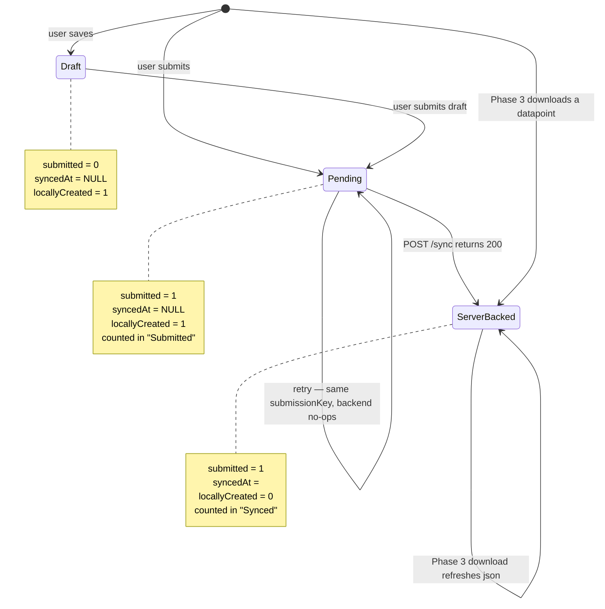
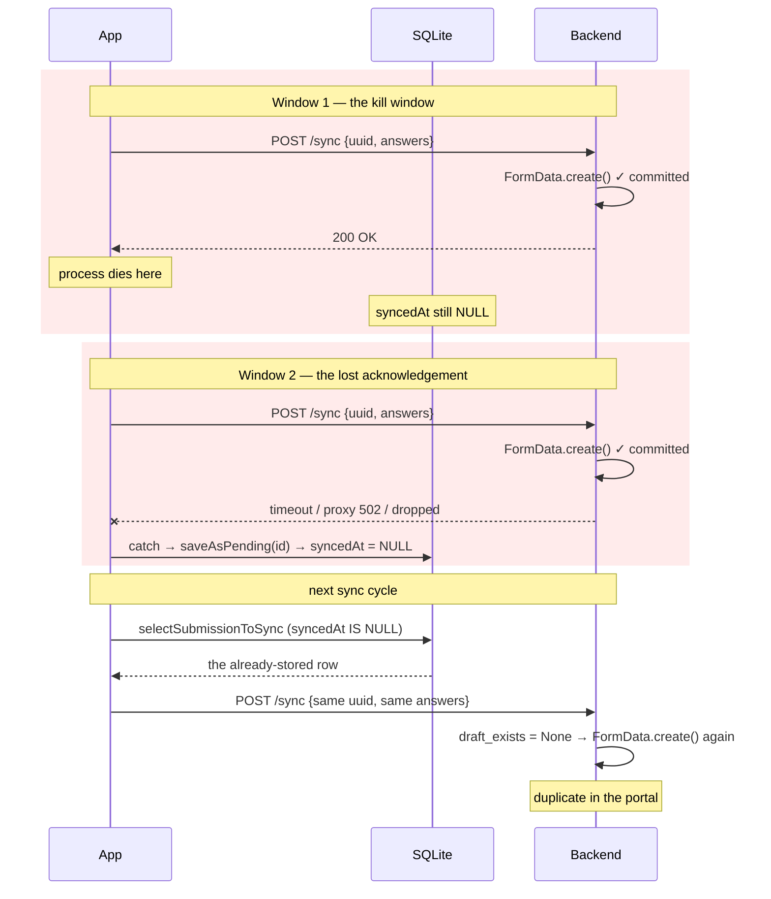
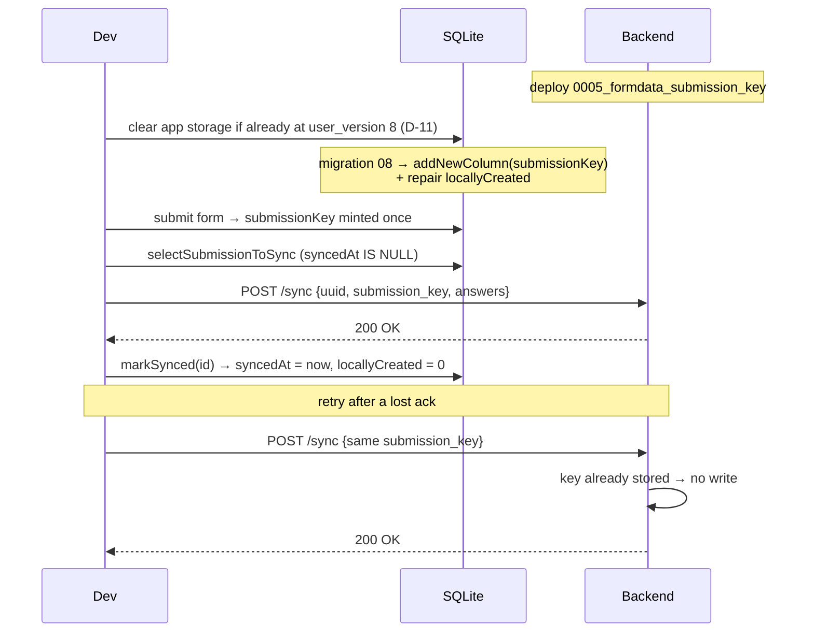

# Feature Design Document

## Feature: Submitted Datapoint Lifecycle & Sync Idempotency (mobile)

**Task ID**: APP-255
**Author**: Iwan Firmawan
**Date**: 2026-07-10
**Status**: Draft
**Issue**: #255 — Submitted forms persist in local database

> Supersedes and absorbs APP-255B (per-submission idempotency key), which is folded into §3, §4 and D-6 through D-10. The mobile app is not yet deployed to production, so both changes ship in one release and share a single SQLite migration — see D-11.

---

## 1. Context & Problem Statement

```
Currently:
- Every locally-created submission stays in the `datapoints` table forever with
  `locallyCreated = 1`, even after the backend has confirmed it.
- The Home form card derives its "Submitted" counter from `locallyCreated = 1`,
  so the counter never drains after a successful sync.
- Migration 05 back-filled `locallyCreated = 1` onto EVERY pre-existing row,
  including datapoints that were downloaded from the server. On an upgraded
  device the "Submitted" counter therefore equals the total datapoint count.
- `downloadDatapointsJson` inserts server datapoints using the backend's primary
  key, silently deleting whatever local row already occupies that id.
- POST /device/sync is not idempotent. A killed app or a lost HTTP response
  causes the same submission to be sent twice, and the backend stores it twice.

Goal:
- `locallyCreated` becomes a truthful provenance flag: 1 means "this row exists
  only on this device", 0 means "the backend has this row".
- The Home "Submitted" counter reflects work still pending upload, and reaches
  zero after a successful sync.
- Local rows are never destroyed to achieve this, and no local row can be
  destroyed by an unrelated server datapoint sharing its id.
- A submission that reaches the backend twice is stored once, regardless of what
  the network or the OS did to the acknowledgement.
```

### Why the original plan cannot ship

The plan in #255 proposes `DELETE FROM datapoints WHERE submitted = 1 AND syncedAt IS NOT NULL`.

| Claim in the plan | Reality |
|---|---|
| That predicate identifies locally-submitted forms | [`sync-datapoints.js:198-215`](../../app/src/lib/sync-datapoints.js#L198-L215) inserts **every server-downloaded datapoint** with exactly `submitted: 1, syncedAt: lastUpdated`. The DELETE wipes the entire local datapoint store on each sync cycle. |
| The "Submitted" list is an outbox | [`Submission.js:138`](../../app/src/pages/Submission.js#L138) queries `submitted = 1` and is the **datapoint list**. Tapping a row opens `FormOptions` to attach a monitoring submission ([`Submission.js:110-114`](../../app/src/pages/Submission.js#L110-L114)). Synced registration datapoints must live there. |
| Re-syncing may duplicate data in the portal | **True, but deleting rows would not prevent it.** Duplication needs a resend, and a resend needs `syncedAt` to be `NULL` again. Retaining synced rows is not the cause; the acknowledgement protocol is — D-6. |

The reported symptom is a *counter and provenance* bug, not a *retention* bug. The duplication the reporter suspected is real, but sits on a different axis and needs a different fix. Both are in scope for this design.

> **Correction.** An earlier revision of this document asserted "the backend de-duplicates on the mobile-supplied `uuid`; no portal duplication exists." That is false. The de-duplication lookup is scoped to drafts of registration forms only. D-6 records what was actually verified.

---

## 2. Requirements

### User Acceptance Criteria
- [ ] After a successful sync, the Home form card shows `Submitted: 0`.
- [ ] The synced datapoint remains reachable in the datapoint list so monitoring data can still be attached to it.
- [ ] A submission awaiting backend approval still counts as pending work until upload succeeds, and stops counting once it does.
- [ ] No datapoint ever disappears from the device as a side effect of downloading an unrelated datapoint.
- [ ] A surveyor whose phone dies mid-sync, or who syncs on a flaky connection, never sees their submission twice in the web portal.
- [ ] Two genuine monitoring visits to the same datapoint still produce two rows.

### Technical Acceptance Criteria
- [ ] `locallyCreated = 1` ⟺ the backend has never acknowledged this row.
- [ ] No `DELETE` is introduced against `submitted = 1` rows.
- [ ] Local primary keys are never assigned from backend primary keys.
- [ ] `POST /device/sync` is idempotent with respect to a client-supplied submission token, for **every** form type and every `is_draft` / `is_pending` combination.
- [ ] Idempotency is enforced by a database constraint, not only by an application-level lookup — concurrent retries must not both insert.
- [ ] Web-portal submissions, which carry no token, are unaffected.
- [ ] The counter predicates are covered by tests that execute real SQL against the real schema — see D-5, the current suite executes none.

### Corrected Acceptance Criteria

Two criteria from the original issue are withdrawn, because they describe a screen that is not an outbox:

- ~~"Submitted list only shows pending (unsynced) submissions"~~ → replaced by *"Home `Submitted` counter shows only pending submissions"*.
- ~~"Successfully synced submissions are removed from local storage"~~ → replaced by *"Successfully synced submissions are re-labelled as server-backed, not removed"*.

---

## 3. Data Model Changes

### Mobile (SQLite)

| Table | Change | Reason |
|---|---|---|
| `datapoints` | `locallyCreated` — **semantics only**, no schema change | Cleared to 0 once the backend acknowledges the upload (D-1). |
| `datapoints` | Add `submissionKey TEXT` | Per-submission idempotency token, minted on-device. Declared in [`tables.js`](../../app/src/database/tables.js) and added by migration 08 — see D-11. |

### Backend (Postgres)

| Model | Change | Reason |
|---|---|---|
| `FormData` | Add `submission_key = models.CharField(max_length=64, null=True, unique=True, default=None)` | The idempotency key. `null=True` so rows predating this change — and every web-portal submission, which has no token — remain valid. |

Postgres treats `NULL` as distinct under a `UNIQUE` index, so unlimited rows may carry `NULL` without colliding. The whole design leans on that: no back-fill is required, and no partial index is needed (D-9).

### Semantics of `locallyCreated`

| Column | Today | After |
|---|---|---|
| `locallyCreated` | Set to 1 at creation, **never cleared**. Back-filled to 1 for all pre-existing rows. | Set to 1 at creation, cleared to 0 the moment the backend acknowledges the upload. |
| `syncedAt` | Upload timestamp | unchanged |
| `submitted` | 0 = draft, 1 = submitted | unchanged |

### State machine



There is no terminal delete state for `submitted = 1`. Rows only leave the table when a draft round-trips (`deleteDraftIdIsNull` / `deleteDraftSynced`), which is existing, correct behaviour.

### Migration Strategy

**Mobile — one migration, doing both jobs.** [`08_submission_key_and_locally_created.js`](../../app/src/database/migrations/08_submission_key_and_locally_created.js):

```javascript
const up = async (db) => {
  await sql.addNewColumn(db, tableName, 'submissionKey', 'TEXT');
  await db.execAsync(`UPDATE ${tableName} SET locallyCreated = 0 WHERE syncedAt IS NOT NULL`);
};
```

`submissionKey` is also declared in `tables.js`, following the precedent of `locallyCreated` (migration 05): `createTable` builds it on a fresh database, `addNewColumn` adds it to an existing one. `addNewColumn` checks `PRAGMA table_info` first, so both paths converge and the migration stays idempotent.

Migration 08 was originally `08_repair_locally_created.js`, adding nothing and only repairing the flag. It is **rewritten in place** rather than followed by an `09` — see D-11. `DATABASE_VERSION` stays at `8`.

- **Idempotent**: re-running is a no-op, which matters because the transaction rolls back and retries on next launch if it throws.
- **Data preservation**: no rows deleted, one column added, one column corrected.
- **Rollback**: none, matching migrations 05 and 07 — `down()` throws. A correction ships as migration 09.

**Backend — one migration**, `0005_formdata_submission_key.py` (next free number in [`v1_data/migrations/`](../../backend/api/v1/v1_data/migrations/)):

```python
migrations.AddField(
    model_name="formdata",
    name="submission_key",
    field=models.CharField(max_length=64, null=True, unique=True, default=None),
)
```

Adding a nullable column takes no table rewrite in Postgres 12, but building the unique index holds a lock. If the `data` table is large in production, ship it as `AddIndexConcurrently` wrapped in `SeparateDatabaseAndState`. Measure first.

---

## 4. API Contract

`POST /api/v1/device/sync` gains one optional field. No new endpoints.

```json
{
  "formId": 1001,
  "uuid": "aaaaaaaa-bbbb-cccc-dddd-eeeeeeeeeeee",
  "submission_key": "b2c3d4e5-f6a7-...",
  "name": "Household 12",
  "answers": { "1-0": "Jane Doe" }
}
```

| Case | Behaviour | Status |
|------|-----------|--------|
| `submission_key` absent | Today's behaviour, unchanged. Old builds and the web portal keep working. | 200 |
| `submission_key` unseen | Store it on the new `FormData`. | 200 |
| `submission_key` already stored | **No write.** Return the same response as the original call. | 200 |

Returning `200` rather than `409` is deliberate: a replay is not a client error, and the client has no useful recovery beyond treating it as success. Making the endpoint *look* idempotent keeps `processBatch` unchanged on the happy path.

### Handler sketch

```python
submission_key = request.data.get("submission_key")
if submission_key and FormData.objects.filter(submission_key=submission_key).exists():
    return Response({"message": "ok"}, status=status.HTTP_200_OK)
```

The early return must sit **before** `SubmitPendingFormSerializer` runs. The `unique` constraint remains the real guard: two retries racing from one device can both pass the `exists()` check, and only the index stops the second `INSERT`. Catch `IntegrityError` around `serializer.save()` and convert it to the same `200`.

### Endpoints relied upon

| Endpoint | Behaviour relied upon |
|---|---|
| `POST /device/sync` | Returns 200 only after `serializer.save()` persists the row. This is the acknowledgement signal for D-1. |
| `GET /device/datapoint-list` | Filters `is_pending=False, is_draft=False` ([`views.py:665-668`](../../backend/api/v1/v1_mobile/views.py#L665-L668)) and, when `form_id` is supplied, `parent__isnull=True`. This is what disqualifies download-confirmation in D-1. |

---

## 5. Decision Log

### D-1: Where is "the backend has this row" confirmed?

**Options Considered**:

1. **Delete on sync** (the original plan) — remove `submitted = 1 AND syncedAt IS NOT NULL`.
2. **Flip on download confirmation** — clear `locallyCreated` inside `downloadDatapointsJson` when Phase 3 matches the row by `uuid`.
3. **Flip on upload acknowledgement** — clear `locallyCreated` in the same write that sets `syncedAt`, when `POST /sync` returns 200.

**Decision**: Option 3.

**Rationale**:

Option 1 is disqualified in §1 — it deletes the datapoint list.

Option 2 is the intuitive one, but it does not hold once the backend filters are accounted for. Phase 3 can never confirm two large classes of row:

- **Submissions awaiting approval.** `get_datapoint_download_list` filters `is_pending=False`, and a submission to an approval-enabled form is saved with `is_pending=True` ([`v1_data/serializers.py:436`](../../backend/api/v1/v1_data/serializers.py#L436)). Such a row would sit at `Submitted: 1` until an approver acts — possibly for weeks.
- **Monitoring submissions.** `onSyncDataPoint` only iterates `selectLatestFormVersion`, which filters `parentId IS NULL` ([`crud-forms.js:50`](../../app/src/database/crud/crud-forms.js#L50)). Monitoring datapoints are never downloaded, so their flag would never clear.

Option 2 also collides with the skip-unchanged guard — see D-3.

Option 3 uses a signal that already exists and is already trusted: the same HTTP 200 that sets `syncedAt`. If that response is good enough to mark a row as synced and drop it out of the upload queue, it is good enough to mark the row as server-backed. It introduces **no new failure mode**, and it works uniformly for registration, monitoring, pending-approval, and auto-approved submissions.

**Impact**: `markSynced` added to `crud-datapoints.js`; `processBatch` in `background-task.js` calls it; `synced` re-derived in both `crud-forms.js` queries. `registered`, `submitted` and `draft` keep their predicates — see §6.

---

### D-2: Stop assigning local primary keys from backend primary keys

**Options Considered**:

1. Keep `id: dpID` and the pre-emptive `deleteById`, and add a guard that checks the victim row is not locally created.
2. Drop `id: dpID` and the `deleteById` entirely; let SQLite assign the local key.

**Decision**: Option 2.

**Rationale**: [`sync-datapoints.js:214`](../../app/src/lib/sync-datapoints.js#L214) ran

```javascript
await crudDataPoints.deleteById(txDb, { id: dpID });   // dpID = backend FormData.id
await crudDataPoints.saveDataPoint(txDb, datapointData); // datapointData.id = dpID
```

`dpID` is the backend's `FormData.id`. Local rows draw from SQLite's autoincrement counter over the *same* small-integer space. Downloading backend datapoint `id = 3` therefore deletes whichever local row happens to hold `id = 3` — which can be an unsynced draft or a submission still queued for upload. That is silent, unrecoverable data loss.

The `deleteById` existed only to avoid a PK conflict caused by reusing `dpID` in the first place. Row identity is already `uuid + form`, which `getByUUID` establishes before the insert. Nothing outside this function reads `dpID`; every consumer of `datapoint.id` ([`FormOptions`](../../app/src/pages/FormOptions.js), [`FormPage`](../../app/src/pages/FormPage.js), [`Submission`](../../app/src/pages/Submission.js)) treats it as a local key. Removing both lines eliminates the collision class rather than guarding one instance of it.

**Impact**: `sync-datapoints.js` only. This was `crudDataPoints.deleteById`'s only call site, so the export is left dead — see §10.

---

### D-3: The skip-unchanged guard must not gate the flip

`downloadDatapointsJson` short-circuits when the local copy looks fresh:

```javascript
if (existing?.syncedAt && lastUpdated && existing.syncedAt >= lastUpdated) {
  return;
}
```

`existing.syncedAt` is stamped client-side when the upload response lands, whereas `lastUpdated` is the server's `updated` column, set slightly earlier. For a row the device itself just uploaded, `existing.syncedAt >= lastUpdated` is reliably true, so the function returns before reaching any update.

Under D-1 (flip at upload) this guard is harmless and stays exactly as it is — the flip has already happened by the time Phase 3 runs. This is a further argument against D-1 option 2: that design would have needed the guard relaxed, re-opening a redundant `GET` for every already-current datapoint on every sync.

**Decision**: leave the guard untouched. Recorded here so the next reader does not "fix" it.

---

### D-4: Write a narrow `markSynced` instead of reusing `updateDataPoint`

`processBatch` used to confirm an upload with:

```javascript
await crudDataPoints.updateDataPoint(db, { ...d, syncedAt: new Date().toISOString() });
```

`d` is a raw row, so `d.json` is already a JSON **string**. `updateDataPoint` then runs `JSON.stringify(json)` over it, double-encoding the payload on every sync. That is why `selectDataPointById` carries a double-parse workaround ([`crud-datapoints.js:8-12`](../../app/src/database/crud/crud-datapoints.js#L8-L12)).

Two columns need writing here, so a targeted `markSynced(db, id)` sets exactly `syncedAt` and `locallyCreated`, touches no other column, and removes the corruption at its source:

```javascript
markSynced: async (db, id) =>
  sql.updateRow(db, 'datapoints', { id }, { syncedAt: new Date().toISOString(), locallyCreated: 0 }),
```

**Decision**: add `markSynced`, use it in `processBatch`. Leave `updateDataPoint` alone — `FormPage` calls it with a parsed object, where the stringify is correct. The double-parse workaround in `selectDataPointById` stays, because legacy rows already carry double-encoded JSON.

---

### D-5: The existing SQLite tests cannot verify any of this

Every counter change in this design is a change to a SQL predicate. The current suite cannot detect a wrong predicate, because it never runs SQL. Three independent failures, each sufficient on its own:

1. **The suite does not execute.** `jest.config.js` declares `preset: 'jest-expo'`, and `jest-expo` is absent from `node_modules`. No workflow in [`.github/workflows/`](../../.github/workflows/) invokes the mobile tests, so this has gone unnoticed.
2. **The mock targets an API the code abandoned.** [`__mocks__/expo-sqlite.js`](../../app/__mocks__/expo-sqlite.js) implements `db.transaction(tx => tx.executeSql(query, params, cb))` — the pre-SDK-50 callback API. [`sql.js`](../../app/src/database/sql.js) calls `execAsync`, `runAsync`, `getAllAsync`, and `getFirstAsync` exclusively.
3. **The tests call the old signatures.** `crud-datapoints.test.js` invokes `selectSubmissionToSync()` with no `db` argument. Every crud function has taken `(db, args)` since the SDK 53 migration.

The tests assert that a hand-rolled mock returns the array it was handed. They would pass against `DELETE FROM datapoints`.

**Decision**: run the real SQL against an in-memory database, scoped to the modules this design touches.

**Rationale**: repairing the mocks to assert on the SQL *string* only asserts that we wrote what we wrote. It cannot catch the class of bug this design exists to fix — `submitted = 1 AND locallyCreated = 1` is a perfectly well-formed string.

Node 22 (the repo runs 22.20) exposes SQLite in the standard library, so this costs **no new dependency**. `sql.js` touches the database object through exactly four methods, so the adapter is small:

```javascript
// app/src/database/__tests__/helpers/memory-db.js
import { DatabaseSync } from 'node:sqlite';

export const openMemoryDb = () => {
  const db = new DatabaseSync(':memory:');
  return {
    execAsync: async (sql) => db.exec(sql),
    runAsync: async (sql, ...params) => db.prepare(sql).run(...params),
    getAllAsync: async (sql, ...params) => db.prepare(sql).all(...params),
    getFirstAsync: async (sql, ...params) => db.prepare(sql).get(...params) ?? null,
    closeAsync: async () => db.close(),
  };
};
```

**Scope**: replaces `crud-datapoints.test.js` and `crud-forms.test.js`. `crud-config`, `crud-sessions`, and `crud-users` carry the same rot and are **left alone** — reviving the whole suite is not APP-255's job.

> **Status**: designed and prototyped, **not in the implementation commit.** The harness is held locally and lands separately. The behaviour changes in D-1 through D-4 shipped first, verified manually.

---

### D-6: Why the portal duplicates, and why `uuid` cannot fix it

**The backend does not de-duplicate published submissions.** [`views.py:266`](../../backend/api/v1/v1_mobile/views.py#L266) looks the incoming `uuid` up through `FormData.objects_draft`, which is `DraftSoftDeletesManager(only_draft=True)` and therefore filters `is_draft=True` ([`draft_model.py`](../../backend/utils/draft_model.py)). The filter also carries `form__parent__isnull=True`. So the lookup matches **drafts of registration forms and nothing else**. A resent published submission finds no match, falls through to `SubmitPendingFormSerializer.create()`, which calls `.create(data)` unconditionally ([`v1_data/serializers.py:629`](../../backend/api/v1/v1_data/serializers.py#L629)) and inserts a new row. Nothing stops it at the schema level either — `uuid` is `CharField(max_length=255, null=True)` with no `unique` and no `unique_together`.

**A resend is reachable without any user error.** The only guard is client-side: `selectSubmissionToSync` filters `syncedAt IS NULL`. Two windows reopen it.



Window 1 needs only an OS process kill between two adjacent statements. Window 2 needs only a network that fails on the way back.

For a draft, the resend is harmless: `draft_exists` matches and `SubmitUpdateDraftFormSerializer` updates in place. For a published or monitoring submission, it duplicates. Two rows then share a `uuid`, and since `FormData.save_to_file` writes `f"{self.uuid}.json"`, they also clobber each other's export.

**`uuid` cannot become the idempotency key.** It identifies a **datapoint**, not a submission. `SubmitPendingFormSerializer.create()` depends on that:

```python
if data.get("uuid") and obj_data.form.parent:
    parent_data = FormData.objects.filter(
        uuid=data["uuid"], form__parent__isnull=True,
    ).first()
```

A monitoring submission carries its parent's `uuid` so the backend can link it. Two monitoring visits to one household are two correct rows with one `uuid`. A `unique` constraint on `uuid` would reject valid data, and `unique_together(form, uuid)` would reject the second visit to the same monitoring form.

**No audit log.** The third "Additional Investigation" item asks for a "synced and deleted" log. After D-1 nothing is deleted, so the log would record no events. Forensics on the duplicate window is better served by a Sentry breadcrumb around the `api.post`/`markSynced` pair, carrying the `uuid` and the local id. A dedicated SQLite table is speculative.

**Decision**: introduce a per-submission token. D-7 through D-10 specify it.

---

### D-7: Where does the idempotency token come from?

**Options Considered**:

1. Derive it server-side by hashing `(form, created_by, uuid, answers)`.
2. Generate it on-device, once, when the `datapoints` row is first submitted.
3. Reuse the mobile `datapoints.id`.

**Decision**: Option 2.

**Rationale**: Option 1 makes an edited resubmission look like a replay, silently dropping the edit; it also makes the key depend on answer serialisation, which is exactly the thing `updateDataPoint` has historically corrupted (D-4). Option 3 is not globally unique — every device numbers its rows from 1, so two devices collide immediately, and the `unique` constraint would reject the second surveyor's submission.

Option 2 gives a token that is stable across retries (it lives in SQLite alongside `syncedAt`, and `saveAsPending` must not clear it), unique across devices (`Crypto.randomUUID()`, already imported by [`FormPage`](../../app/src/pages/FormPage.js)), and orthogonal to answer content.

**Impact**: `FormPage.js` mints the key; `crud-datapoints.js` persists it; `background-task.js` sends it.

---

### D-8: Do not narrow the client window instead

**Options Considered**:

1. Server-side idempotency only.
2. Write `syncedAt` *before* the POST, and roll it back only on a definite `4xx`.

**Decision**: Option 1. Option 2 is **rejected, not deferred.**

**Rationale**: Option 2 is tempting because it is a two-line client change needing no backend deploy. It is also wrong. Writing `syncedAt` before the request means a submission that genuinely fails to reach the server — airplane mode, DNS failure, a 500 raised before the view runs — is marked synced and **never retried**. That trades a visible duplicate for a silent data loss, which is the worse failure for a field survey. The `saveAsPending` reset exists precisely to guarantee at-least-once delivery.

At-least-once delivery plus a server-side dedupe gives exactly-once *storage*. Both windows in D-6 become harmless once the second POST is a no-op.

---

### D-9: The unique index needs no `WHERE` clause

`submission_key` is `NULL` for every row the web portal creates and for every row predating this change. Postgres treats `NULL`s as distinct under `UNIQUE`, so a plain unique index already permits unlimited `NULL`s. Recorded because "unique column, mostly null" reliably prompts a reviewer to ask for a partial index.

`max_length=64` rather than 36: a UUID is 36 characters, and the slack leaves room for a prefixed scheme (`v2:<uuid>`) without another migration.

---

### D-10: The existing `draft_exists` lookup stays

It serves a different purpose — updating a draft in place across successive saves, where the client *intends* an overwrite and deliberately reuses the datapoint `uuid`. `submission_key` guards against *unintended* replays. The two coexist:

- Draft save, same `uuid`, **new** `submission_key` each save → `draft_exists` matches → update in place. Correct today, correct after.
- Retry of one submission, same `submission_key` → early return. New.

So drafts mint a fresh `submission_key` per save, while a submission mints one per submission and reuses it on every retry. This is the one place the two mechanisms can be confused; state it in the implementation.

---

### D-11: Fold `submissionKey` into migration 08 rather than adding an 09

**Options Considered**:

1. New migration `09_add_submissionKey_to_datapoints.js`, plus `DATABASE_VERSION` → 9 and another branch in `migrateDbIfNeeded`.
2. Declare the column in `tables.js` only, and recreate the local database. No migration at all.
3. Rewrite migration 08 in place so it adds `submissionKey` **and** repairs `locallyCreated`.

**Decision**: Option 3.

**Rationale**: the mobile app is not deployed to production, and migration 08 has not left this branch. There is no installed base whose `user_version` has passed 8, so 08 is not yet a historical fact and can still be edited. Rewriting it keeps the migration list short and keeps one release's schema work in one file, which is how a reader will expect to find it.

Option 1 is what you would be forced into after release: append-only, never edit. It costs an extra file, an extra `DATABASE_VERSION` bump, and an extra `migrateDbIfNeeded` branch, all to express a change that belongs to the same release. Correct discipline, wrong moment.

Option 2 — `tables.js` only, wipe the device — is tempting given that storage can be cleared, and it deletes even more code. It was rejected because `addNewColumn` is *already* idempotent and costs one line: `sql.addNewColumn(db, 'datapoints', 'submissionKey', 'TEXT')`. Paying one line to keep the upgrade path working for a teammate who forgets to wipe is a better trade than saving it and handing them a `no such column: submissionKey` crash. The column is declared in both `tables.js` and the migration, exactly as `locallyCreated` is (migration 05).

**The cost, stated plainly**: a device that already ran the *old* migration 08 sits at `user_version = 8`, so `migrateDbIfNeeded` early-returns and the rewritten `up()` never runs. That device will lack `submissionKey` and the first write naming it will fail. This affects only developers who ran this branch before this commit, and clearing app storage fixes it. **The moment a build reaches a real surveyor, editing a shipped migration stops being an option** and any further schema change needs its own forward migration.

---

## 6. Counter Semantics

`locallyCreated` currently does double duty as provenance *and* lifecycle. After D-1 it is provenance only, and lifecycle is read from `syncedAt`.

### `selectLatestFormVersion` (Home form card)

| Counter | Today | After | Note |
|---|---|---|---|
| `registered` | `submitted = 1 AND locallyCreated = 0` | unchanged predicate | Not read by [`Home.js`](../../app/src/pages/Home.js), but [`BaseLayout/Content.js:34`](../../app/src/components/BaseLayout/Content.js#L34) renders it as the card title suffix — `Household (147)`. Its meaning ("datapoints the backend has") is already correct, and once D-1 clears the flag a synced local submission correctly joins the count. |
| `submitted` | `submitted = 1 AND locallyCreated = 1` (+ monitoring subquery) | unchanged predicate | Now drains to 0 after upload, because the flag is cleared. **No SQL change.** |
| `draft` | `submitted = 0` | unchanged | |
| `synced` | `syncedAt IS NOT NULL AND (submitted = 0 OR locallyCreated = 1)` | `submitted = 1 AND locallyCreated = 0 AND syncedAt IS NOT NULL` (+ monitoring subquery) | Old predicate would read 0 forever once the flag is cleared. New one means "datapoints the backend has", which keeps the existing i18n label honest. |

Only `synced` changes. `registered` and `submitted` keep their exact predicates, which is the point: fixing the flag's meaning fixes both counters for free.

`registered` and `synced` select overlapping sets — every `locallyCreated = 0` row carries a `syncedAt`. They stay separate because `synced` folds in the monitoring subquery and `registered` does not: the card *title* counts registration datapoints, the *subtitle* counts everything the backend holds for this form tree.

### `getFormOptions` (monitoring form list)

| Counter | Today | After |
|---|---|---|
| `submitted` | `submitted = 1 AND locallyCreated = 1` | `submitted = 1` |
| `draft` | `submitted = 0 AND syncedAt IS NULL` | unchanged |
| `synced` | `locallyCreated = 1 AND syncedAt IS NOT NULL` | `submitted = 1 AND syncedAt IS NOT NULL` |

This query is scoped to `f.parentId = ?` and `dp.uuid = ?`, so every row it sees is a monitoring submission for one datapoint. `{item.name} ({item.submitted})` in [`FormOptions.js:61`](../../app/src/pages/FormOptions.js#L61) should count *all* monitoring submissions for that datapoint, synced or not — dropping `locallyCreated` from the predicate restores that and survives the flag flip.

---

## 7. Compatibility & Migration

### Backward Compatibility
- [x] Web-portal submissions never set `submission_key`; `NULL` is unconstrained.
- [x] Old app builds omit the field; the handler skips the dedupe branch and behaves exactly as today.
- [x] No existing `FormData` row is modified.
- [x] Rows already carrying backend-derived local ids keep working — identity is `uuid + form`.
- [x] `deleteDraftIdIsNull` / `deleteDraftSynced` untouched; draft round-trip behaviour is unchanged.

### Mobile App Impact
- Sync endpoints affected: `POST /device/sync` gains one optional request field.
- SQLite schema changes: `submissionKey TEXT`, added by migration 08 and declared in `tables.js`.
- `DATABASE_VERSION` stays at `8` — migration 08 is rewritten, not appended to (D-11).
- Devices that ran the pre-rewrite migration 08 must clear app storage; they are already at `user_version = 8` and will not re-run it.

### Rollout order

Backend first. An app build sending `submission_key` to a backend that does not know the field is harmless — DRF ignores unknown keys — but the reverse gives no protection. There is no window in which the pair is worse than today.

### Upgrade path



### Seeder/CLI Compatibility
- [x] Seeders construct `FormData` directly and leave `submission_key` at its `None` default.

---

## 8. Security Considerations

- [x] No permission model change; all mobile-local writes stay device-local.
- [x] `markSynced` takes an integer local id, parameterised through `sql.updateRow`.
- [x] D-2 **closes** an integrity hole: an unlucky backend id can no longer delete an arbitrary local row.
- [x] `submission_key` is opaque and client-supplied. It is never used for authorisation — `IsMobileAssignment` and `assignment` scoping still decide what a device may write.
- [x] A malicious client can suppress its *own* submission by replaying a key it already used. It cannot suppress or read anyone else's: the dedupe branch returns a constant `{"message": "ok"}` and leaks nothing about the matched row.
- [x] The `unique` index is global, so a client could in principle burn a key another client would later choose. With 122 bits of UUID entropy this is not practical, and the failure mode is a rejected insert, not a cross-tenant read.

---

## 9. Testing Strategy

> **Not satisfied by the implementation commit.** The mobile harness was built and run locally — 20 passing tests — but is held back. Treat the mobile rows as specification, not merged coverage.

### Prerequisites

The mobile suite does not currently run at all (D-5). Three steps precede any mobile row below:

1. `cd app && yarn install` — restores the missing `jest-expo` preset.
2. **That is not enough.** `jest-expo@53.0.14` reaches for `expo-modules-core/src/Refs`, which does not exist in the installed `expo-modules-core@2.5.0`; the preset throws before a single test runs. Rather than churn Expo versions for an unrelated bug, split `jest.config.js` into two `projects`: an `app` project keeping `preset: 'jest-expo'` and ignoring `<rootDir>/src/database/`, and a `database` project on `testEnvironment: 'node'` with no preset. Nothing under `src/database` imports Expo.
3. Add the `node:sqlite` adapter (D-5) and declare the builtin in `.eslintrc.json` — `eslint-plugin-import` does not strip the `node:` prefix:
   ```json
   "settings": { "import/core-modules": ["node:sqlite"] }
   ```

### Coverage

Mobile database tests open a fresh in-memory database, build the schema from `tables.js`, and apply migrations 03→08 before inserting fixtures. Real SQL, real schema, no mock.

| Test Type | Coverage |
|---|---|
| Unit — `crud-datapoints.test.js` | `markSynced(db, id)` sets `syncedAt` and `locallyCreated = 0` on exactly the target row, and leaves `json` **byte-identical** — the D-4 double-encode regression test. |
| Unit — `crud-datapoints.test.js` | `saveAsPending` clears `syncedAt` and **preserves** `submissionKey` (D-7). If it cleared the key, every retry would insert. |
| Unit — `crud-forms.test.js` | `selectLatestFormVersion` over one pending submission, one synced submission, one downloaded datapoint, one draft → `submitted: 1, draft: 1, synced: 2, registered: 2`. Assert the *numbers*, not the query text. |
| Unit — `crud-forms.test.js` | `getFormOptions` counts all monitoring submissions for a `uuid` regardless of `locallyCreated`, per §6. |
| Unit — migration 08 | Seed as migration 05 leaves it (every row `locallyCreated = 1`), run `up`. Rows with `syncedAt` become `0`; rows without stay `1`. A `submissionKey` column exists and is `NULL` on every row. Re-run — nothing changes, and the second `addNewColumn` does not throw. `down()` throws. |
| Integration — `sync-datapoints` | Download backend datapoint `id = 3` while a local unsynced draft occupies `id = 3`. The draft survives with its answers intact; the datapoint lands under a fresh autoincrement id. **Fails on `main`** — the D-2 regression test. |
| Integration — `background-task` | After `processBatch` receives a 200, the row is absent from the next `selectSubmissionToSync` and carries `locallyCreated = 0`. Stub `api.post`; the database is real. |
| Unit — backend | `POST /device/sync` twice with one `submission_key` creates one `FormData`. Assert the row count, not the status code. |
| Unit — backend | Two monitoring submissions, same `uuid`, **different** `submission_key` → two rows. This fails if someone "simplifies" the key back to `uuid`. |
| Unit — backend | `submission_key` omitted → two POSTs create two rows. Pins the old-build and web-portal path. |
| Integration — backend | Concurrent identical POSTs (threaded, real DB) → one row, one `IntegrityError` swallowed, both callers get `200`. The `exists()` check alone cannot pass this. |
| Manual | Submit offline → `Submitted: 1`. Reconnect, sync → `Submitted: 0`, `Synced: 1`; row still in the datapoint list and still opens `FormOptions`. Repeat on an approval-enabled form. Then force-kill the app between the POST and `markSynced` and confirm one row in the portal. |

The manual row is not a formality. Nothing automated proves the Home card renders the counter it was handed, and D-1's behaviour under pending approval is a backend interaction no in-memory database can stand in for.

---

## 10. Open Questions

- [ ] After migration 08, a device whose submission was uploaded but *rejected* by an approver still shows `locallyCreated = 0`. The backend never tells the app about a rejection. Acceptable for this release, or does #255 also expect a rejected-submission state?
- [ ] Should the dedupe branch return the stored row's `id`, so a future client can reconcile after a lost acknowledgement? `POST /sync` currently returns only `{"message": "ok"}`. Cheap now, awkward later.
- [ ] `save_to_file` writes `f"{uuid}.json"`. Two legitimate monitoring submissions already share a `uuid` — do they already clobber each other's export, independent of this bug? Possibly a second, unrelated defect.
- [ ] Should `submission_key` be indexed `CONCURRENTLY`? Depends on the row count of `data` in production. Measure before writing the migration.
- [ ] D-11 expires the day a build reaches a real surveyor. From then on migrations are append-only; who owns enforcing that?
- [ ] `selectDataPointById`'s double-parse workaround becomes dead for rows written after D-4, but must stay for legacy rows. Worth a migration to normalise historical `json` later?
- [ ] D-2 removed `crudDataPoints.deleteById`'s only call site, so the export is now dead code. Delete it, or keep it as a deliberate CRUD-completeness affordance?
- [ ] **No CI job runs the mobile tests.** `.github/workflows/main.yml` covers backend and frontend only, which is why the rot in D-5 went unobserved. Adding `cd app && yarn test` is one line, but it goes red until `crud-config` / `crud-sessions` / `crud-users` are ported.
- [ ] `node:sqlite` prints an `ExperimentalWarning` on Node 22 (unflagged from 22.5, stable from 24). Harmless; `--no-warnings` if it bothers anyone.

---

## 11. References

- Issue #255 — Submitted forms persist in local database
- Branch `feature/255-submitted-forms-persist-in-local-database`
- [APP-254 — Dismissible update dialog](APP-254-dismissible-update-dialog.md), which claims migration slot 07
- Migration 05 back-fill rationale: [`05_add_locallyCreated_to_datapoints.js:9-14`](../../app/src/database/migrations/05_add_locallyCreated_to_datapoints.js#L9-L14)
- Draft manager semantics: [`utils/draft_model.py`](../../backend/utils/draft_model.py)
- Unconditional insert: [`v1_data/serializers.py:629`](../../backend/api/v1/v1_data/serializers.py#L629)

---

## Approval

| Role | Name | Date | Status |
|------|------|------|--------|
| Developer | Iwan Firmawan | | |
| Tech Lead | | | |
| Product | | | |
