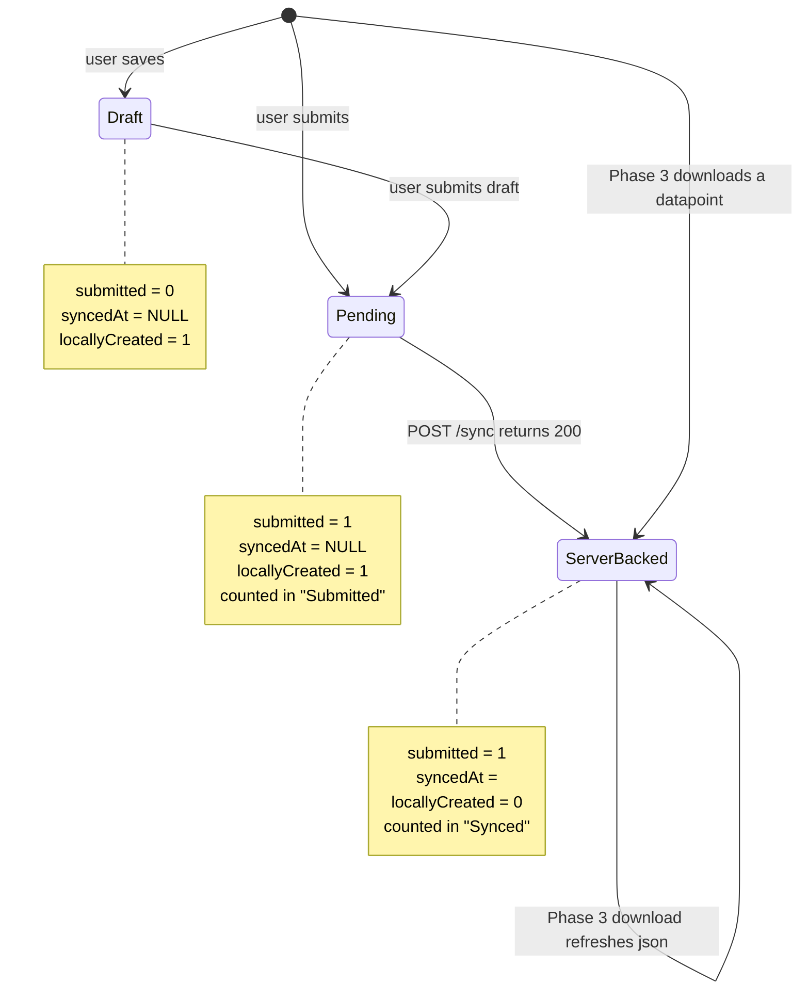
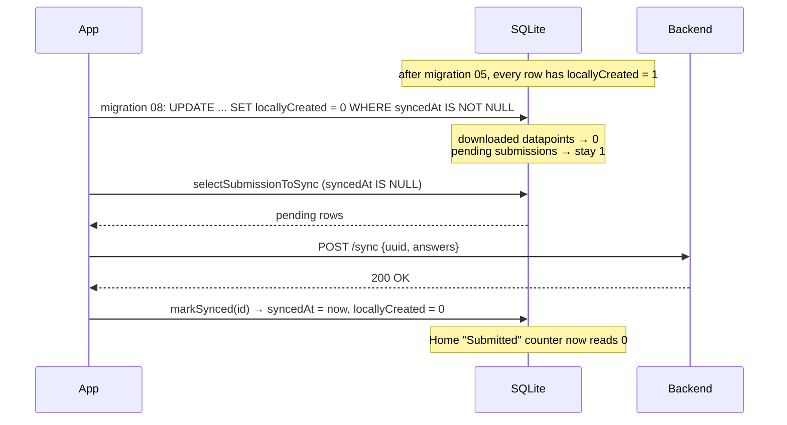

# Feature Design Document

## Feature: Submitted Datapoint Lifecycle (mobile)

**Task ID**: APP-255
**Author**: Iwan Firmawan
**Date**: 2026-07-10
**Status**: Draft
**Issue**: #255 — Submitted forms persist in local database

---

## 1. Context & Problem Statement

```
Currently:
- Every locally-created submission stays in the `datapoints` table forever with
  `locallyCreated = 1`, even after the backend has confirmed it.
- The Home form card derives its "Submitted" counter from `locallyCreated = 1`,
  so the counter never drains after a successful sync.
- Migration 05 back-filled `locallyCreated = 1` onto EVERY pre-existing row,
  including datapoints that were downloaded from the server. On an upgraded
  device the "Submitted" counter therefore equals the total datapoint count.
- `downloadDatapointsJson` inserts server datapoints using the backend's primary
  key, silently deleting whatever local row already occupies that id.

Goal:
- `locallyCreated` becomes a truthful provenance flag: 1 means "this row exists
  only on this device", 0 means "the backend has this row".
- The Home "Submitted" counter reflects work still pending upload, and reaches
  zero after a successful sync.
- Local rows are never destroyed to achieve this, and no local row can be
  destroyed by an unrelated server datapoint sharing its id.
```

### Why the original plan cannot ship

The plan in #255 proposes `DELETE FROM datapoints WHERE submitted = 1 AND syncedAt IS NOT NULL`.

| Claim in the plan | Reality |
|---|---|
| That predicate identifies locally-submitted forms | [`sync-datapoints.js:198-215`](../../app/src/lib/sync-datapoints.js#L198-L215) inserts **every server-downloaded datapoint** with exactly `submitted: 1, syncedAt: lastUpdated`. The DELETE wipes the entire local datapoint store on each sync cycle. |
| The "Submitted" list is an outbox | [`Submission.js:138`](../../app/src/pages/Submission.js#L138) queries `submitted = 1` and is the **datapoint list**. Tapping a row opens `FormOptions` to attach a monitoring submission ([`Submission.js:110-114`](../../app/src/pages/Submission.js#L110-L114)). Synced registration datapoints must live there. |
| Re-syncing may duplicate data in the portal | It cannot. `selectSubmissionToSync` only selects `syncedAt IS NULL` ([`crud-datapoints.js:37`](../../app/src/database/crud/crud-datapoints.js#L37)), and the backend de-duplicates on the mobile-supplied `uuid` ([`views.py:247-268`](../../backend/api/v1/v1_mobile/views.py#L247-L268)). **No portal duplication exists.** |

The user-visible symptom is real; the diagnosis is not. The symptom is a *counter and provenance* bug, not a *retention* bug.

---

## 2. Requirements

### User Acceptance Criteria
- [ ] After a successful sync, the Home form card shows `Submitted: 0`.
- [ ] The synced datapoint remains reachable in the datapoint list so monitoring data can still be attached to it.
- [ ] A submission awaiting backend approval still counts as pending work until upload succeeds, and stops counting once it does.
- [ ] No datapoint ever disappears from the device as a side effect of downloading an unrelated datapoint.

### Technical Acceptance Criteria
- [ ] `locallyCreated = 1` ⟺ the backend has never acknowledged this row.
- [ ] No `DELETE` is introduced against `submitted = 1` rows.
- [ ] Local primary keys are never assigned from backend primary keys.
- [ ] Upgraded devices repair their back-filled `locallyCreated` values exactly once.
- [ ] The counter predicates and the migration are covered by tests that execute real SQL against the real schema — see D-5, the current suite executes none. **Not met by the implementation commit**; the test harness is held back (§9).

### Corrected Acceptance Criteria

Two criteria from the original issue are withdrawn, because they describe a screen that is not an outbox:

- ~~"Submitted list only shows pending (unsynced) submissions"~~ → replaced by *"Home `Submitted` counter shows only pending submissions"*.
- ~~"Successfully synced submissions are removed from local storage"~~ → replaced by *"Successfully synced submissions are re-labelled as server-backed, not removed"*.

---

## 3. Data Model Changes

### Schema

No column is added or removed. `datapoints.locallyCreated TINYINT DEFAULT 0` already exists (migration 05).

### Semantics (the actual change)

| Column | Today | After |
|---|---|---|
| `locallyCreated` | Set to 1 at creation, **never cleared**. Back-filled to 1 for all pre-existing rows. | Set to 1 at creation, cleared to 0 the moment the backend acknowledges the upload. |
| `syncedAt` | Upload timestamp | unchanged |
| `submitted` | 0 = draft, 1 = submitted | unchanged |

### State machine



There is no terminal delete state for `submitted = 1`. Rows only leave the table when a draft round-trips (`deleteDraftIdIsNull` / `deleteDraftSynced`), which is existing, correct behaviour.

### Migration Strategy

New forward migration [`08_repair_locally_created.js`](../../app/src/database/migrations/08_repair_locally_created.js). Slot 07 is occupied by [`07_add_updateSkippedUntil_to_config.js`](../../app/src/database/migrations/07_add_updateSkippedUntil_to_config.js) from APP-254, so this design takes the next free number.

```javascript
const tableName = 'datapoints';

// Migration 05 back-filled locallyCreated = 1 onto every existing row, including
// rows that had been downloaded from the server. Any row carrying a syncedAt
// timestamp is, by definition, already known to the backend.
const up = async (db) => {
  await db.execAsync(`UPDATE ${tableName} SET locallyCreated = 0 WHERE syncedAt IS NOT NULL`);
};

// The pre-migration locallyCreated values were wrong, so there is nothing to
// restore. To change the flag semantics, create a new forward migration.
const down = () => {
  throw new Error('Migration 08 is irreversible. Create a new forward migration instead.');
};

export { up, down };
```

It needs three registrations, not one — the runner is driven by `PRAGMA user_version`, and a migration the runner never calls is inert:

1. Export it from [`migrations/index.js`](../../app/src/database/migrations/index.js): `export * as m08 from './08_repair_locally_created';`
2. Add a step to `migrateDbIfNeeded` in [`App.js`](../../app/App.js), inside `sql.withTransaction` so the `user_version` bump commits atomically with the data change:
   ```javascript
   if (currentDbVersion === 7) {
     await sql.withTransaction(db, async (txDb) => {
       await m08.up(txDb);
       await txDb.execAsync('PRAGMA user_version = 8');
     });
     currentDbVersion = 8;
   }
   ```
3. Bump `DATABASE_VERSION` to `8` in [`constants.js`](../../app/src/lib/constants.js). `migrateDbIfNeeded` early-returns when `currentDbVersion >= DATABASE_VERSION`, so leaving it at `7` would skip step 2 entirely.

- **Idempotent**: re-running is a no-op, which matters because the transaction rolls back and retries on next launch if it throws.
- **Data preservation**: no rows deleted; no column added or dropped. This is the first data-only migration in the app — 03 through 07 all call `addNewColumn`. Nothing in `sql.js` needs to change; `execAsync` is already used by migration 05's back-fill.
- **Rollback**: none, matching the precedent set by migrations 05 and 07 — `down()` throws. A correction ships as migration 09.

Rows with `syncedAt IS NULL` keep `locallyCreated = 1` and are correctly counted as pending.

---

## 4. API Contract

No backend change. No new endpoints. The mobile app already sends `uuid` on `POST /sync` and the backend already keys on it.

For reference, the two backend behaviours this design depends on:

| Endpoint | Behaviour relied upon |
|---|---|
| `POST /device/sync` | Returns 200 only after `serializer.save()` persists the row, keyed on the mobile `uuid`. This is the acknowledgement signal. |
| `GET /device/datapoint-list` | Filters `is_pending=False, is_draft=False` ([`views.py:665-668`](../../backend/api/v1/v1_mobile/views.py#L665-L668)) and, when `form_id` is supplied, `parent__isnull=True`. |

---

## 5. Decision Log

### D-1: Where is "the backend has this row" confirmed?

**Options Considered**:

1. **Delete on sync** (the original plan) — remove `submitted = 1 AND syncedAt IS NOT NULL`.
2. **Flip on download confirmation** — clear `locallyCreated` inside `downloadDatapointsJson` when Phase 3 matches the row by `uuid`.
3. **Flip on upload acknowledgement** — clear `locallyCreated` in the same write that sets `syncedAt`, when `POST /sync` returns 200.

**Decision**: Option 3.

**Rationale**:

Option 1 is disqualified in §1 — it deletes the datapoint list.

Option 2 is the intuitive one, and it is what I sketched when we discussed approaches, but it does not hold once the backend filters are accounted for. Phase 3 can never confirm two large classes of row:

- **Submissions awaiting approval.** `get_datapoint_download_list` filters `is_pending=False`, and a submission to an approval-enabled form is saved with `is_pending=True` ([`v1_data/serializers.py:436`](../../backend/api/v1/v1_data/serializers.py#L436)). Such a row would sit at `Submitted: 1` until an approver acts — possibly for weeks.
- **Monitoring submissions.** `onSyncDataPoint` only iterates `selectLatestFormVersion`, which filters `parentId IS NULL` ([`crud-forms.js:50`](../../app/src/database/crud/crud-forms.js#L50)). Monitoring datapoints are never downloaded, so their flag would never clear.

Option 2 also collides with the skip-unchanged guard — see D-3.

Option 3 uses a signal that already exists and is already trusted: the same HTTP 200 that sets `syncedAt` ([`background-task.js:240-245`](../../app/src/lib/background-task.js#L240-L245)). If that response is good enough to mark a row as synced and drop it out of the upload queue, it is good enough to mark the row as server-backed. It introduces **no new failure mode**, and it works uniformly for registration, monitoring, pending-approval, and auto-approved submissions.

**Impact**: `markSynced` added to `crud-datapoints.js`; `processBatch` in `background-task.js` calls it; `synced` re-derived in both `crud-forms.js` queries. `registered`, `submitted` and `draft` keep their predicates — see §6.

---

### D-2: Stop assigning local primary keys from backend primary keys

**Options Considered**:

1. Keep `id: dpID` and the pre-emptive `deleteById`, and add a guard that checks the victim row is not locally created.
2. Drop `id: dpID` and the `deleteById` entirely; let SQLite assign the local key.

**Decision**: Option 2.

**Rationale**: [`sync-datapoints.js:214`](../../app/src/lib/sync-datapoints.js#L214) runs

```javascript
await crudDataPoints.deleteById(txDb, { id: dpID });   // dpID = backend FormData.id
await crudDataPoints.saveDataPoint(txDb, datapointData); // datapointData.id = dpID
```

`dpID` is the backend's `FormData.id`. Local rows draw from SQLite's autoincrement counter over the *same* small-integer space. Downloading backend datapoint `id = 3` therefore deletes whichever local row happens to hold `id = 3` — which can be an unsynced draft or a submission still queued for upload. That is silent, unrecoverable data loss, and it is the one confirmed defect in this area.

The `deleteById` exists only to avoid a PK conflict caused by reusing `dpID` in the first place. Row identity is already `uuid + form`, which `getByUUID` establishes on line 146 before the insert. Nothing outside this function reads `dpID`; every consumer of `datapoint.id` ([`FormOptions`](../../app/src/pages/FormOptions.js), [`FormPage`](../../app/src/pages/FormPage.js), [`Submission`](../../app/src/pages/Submission.js)) treats it as a local key. Removing both lines eliminates the collision class rather than guarding one instance of it.

Existing installs already hold rows whose `id` came from the backend. No migration is needed: `uuid + form` remains their identity, and SQLite's autoincrement will not reissue a used id.

**Impact**: `sync-datapoints.js` only. The `deleteById` call and `id: dpID` go, and `id` drops out of the response destructuring since `dpID` now has no reader. This was `crudDataPoints.deleteById`'s only call site, so the export is left dead — see §10.

---

### D-3: The skip-unchanged guard must not gate the flip

`downloadDatapointsJson` short-circuits when the local copy looks fresh:

```javascript
if (existing?.syncedAt && lastUpdated && existing.syncedAt >= lastUpdated) {
  return;
}
```

`existing.syncedAt` is stamped client-side with `new Date().toISOString()` at the moment the upload response lands, whereas `lastUpdated` is the server's `updated` column, set slightly earlier. For a row the device itself just uploaded, `existing.syncedAt >= lastUpdated` is reliably true, so the function returns before reaching any update.

Under D-1 (flip at upload) this guard is harmless and stays exactly as it is — the flip has already happened by the time Phase 3 runs. This is a further argument against D-1 option 2: that design would have needed the guard relaxed, re-opening a redundant `GET` for every already-current datapoint on every sync.

**Decision**: leave the guard untouched. Recorded here so the next reader does not "fix" it.

---

### D-4: Write a narrow `markSynced` instead of reusing `updateDataPoint`

`processBatch` currently confirms an upload with:

```javascript
await crudDataPoints.updateDataPoint(db, { ...d, syncedAt: new Date().toISOString() });
```

`d` is a raw row, so `d.json` is already a JSON **string**. `updateDataPoint` then runs `JSON.stringify(json)` over it ([`crud-datapoints.js:120`](../../app/src/database/crud/crud-datapoints.js#L120)), double-encoding the payload on every sync. That is why `selectDataPointById` carries a double-parse workaround ([`crud-datapoints.js:8-12`](../../app/src/database/crud/crud-datapoints.js#L8-L12)).

We need to write two columns here. Writing them through a targeted `markSynced(db, id)` sets exactly `syncedAt` and `locallyCreated`, touches no other column, and removes the corruption at its source:

```javascript
markSynced: async (db, id) =>
  sql.updateRow(db, 'datapoints', { id }, { syncedAt: new Date().toISOString(), locallyCreated: 0 }),
```

The call site collapses to `await crudDataPoints.markSynced(db, d.id);`. The double-parse workaround in `selectDataPointById` stays, because legacy rows already carry double-encoded JSON.

**Decision**: add `markSynced`, use it in `processBatch`. Leave `updateDataPoint` alone — `FormPage` calls it with a parsed object, where the stringify is correct.

---

### D-5: The existing SQLite tests cannot verify any of this

Every change in this design is a change to a SQL predicate. The current suite cannot detect a wrong predicate, because it never runs SQL. Three independent failures, each sufficient on its own:

1. **The suite does not execute.** `jest.config.js` declares `preset: 'jest-expo'`, and `jest-expo` is absent from `node_modules`. `npx jest` dies with `Preset jest-expo not found`. No workflow in [`.github/workflows/`](../../.github/workflows/) invokes the mobile tests, so this has gone unnoticed.
2. **The mock targets an API the code abandoned.** [`__mocks__/expo-sqlite.js`](../../app/__mocks__/expo-sqlite.js) implements `db.transaction(tx => tx.executeSql(query, params, cb))` — the pre-SDK-50 callback API. [`sql.js`](../../app/src/database/sql.js) calls `execAsync`, `runAsync`, `getAllAsync`, and `getFirstAsync` exclusively. The mock's `executeSql` is never reached.
3. **The tests call the old signatures.** `crud-datapoints.test.js` invokes `crudDataPoints.selectSubmissionToSync()` and `selectDataPointsByFormAndSubmitted({ form, submitted })` with no `db` argument. Every crud function has taken `(db, args)` since the SDK 53 migration.

The tests assert that a hand-rolled mock returns the array it was handed. They would pass against `DELETE FROM datapoints`.

**Options Considered**:

1. Repair the mocks so `execAsync`/`getAllAsync` are intercepted, and assert on the SQL string passed in.
2. Run the real SQL against an in-memory SQLite database.
3. Ship the predicate changes with manual verification only.

**Decision**: Option 2, scoped to the two modules this design touches.

**Rationale**: Option 1 asserts that we wrote the SQL we wrote. It cannot catch the class of bug this design exists to fix — `submitted = 1 AND locallyCreated = 1` is a perfectly well-formed string. Option 3 is how migration 05's back-fill shipped.

Node 22 (the repo runs 22.20) exposes SQLite in the standard library, so option 2 costs **no new dependency**. `sql.js` touches the database object through exactly four methods, so the adapter is small:

```javascript
// app/src/database/__tests__/helpers/memory-db.js
import { DatabaseSync } from 'node:sqlite';

// expo-sqlite's async surface over node:sqlite's sync one. sql.js calls nothing else.
export const openMemoryDb = () => {
  const db = new DatabaseSync(':memory:');
  return {
    execAsync: async (sql) => db.exec(sql),
    runAsync: async (sql, ...params) => db.prepare(sql).run(...params),
    getAllAsync: async (sql, ...params) => db.prepare(sql).all(...params),
    getFirstAsync: async (sql, ...params) => db.prepare(sql).get(...params) ?? null,
    closeAsync: async () => db.close(),
  };
};
```

Tests then build the schema from [`tables.js`](../../app/src/database/tables.js), run migrations 03→08 in order, insert fixture rows, and assert on counter output. That exercises the predicates, the migration, and the schema together — the three things that can break here.

**Scope**: this design replaces `crud-datapoints.test.js` and `crud-forms.test.js`, the two files whose modules it edits. `crud-config`, `crud-sessions`, and `crud-users` carry the same rot and are **left alone** — reviving the whole suite is not APP-255's job. Restoring `jest-expo` (`yarn install` in `app/`) is a prerequisite, and wiring the mobile tests into CI is filed as debt in §10.

**Impact**: one new test helper, two test files rewritten, `package.json` untouched.

> **Status**: designed and prototyped, **not in the implementation commit.** The harness is held locally and lands separately, so this section describes intent rather than merged code. The behaviour changes in D-1 through D-4 ship first, verified manually.

---

## 6. Counter Semantics

`locallyCreated` currently does double duty as provenance *and* lifecycle. After D-1 it is provenance only, and lifecycle is read from `syncedAt`. The four counters in [`crud-forms.js`](../../app/src/database/crud/crud-forms.js) must be re-derived accordingly.

### `selectLatestFormVersion` (Home form card)

| Counter | Today | After | Note |
|---|---|---|---|
| `registered` | `submitted = 1 AND locallyCreated = 0` | unchanged predicate | Not read by [`Home.js`](../../app/src/pages/Home.js), but [`BaseLayout/Content.js:34`](../../app/src/components/BaseLayout/Content.js#L34) renders it as the card title suffix — `Household (147)`. Keep it. Its meaning ("datapoints the backend has") is already correct, and once D-1 clears the flag, a synced local submission correctly joins the count. |
| `submitted` | `submitted = 1 AND locallyCreated = 1` (+ monitoring subquery) | unchanged predicate | Now drains to 0 after upload, because the flag is cleared. **No SQL change.** |
| `draft` | `submitted = 0` | unchanged | |
| `synced` | `syncedAt IS NOT NULL AND (submitted = 0 OR locallyCreated = 1)` | `submitted = 1 AND locallyCreated = 0 AND syncedAt IS NOT NULL` (+ monitoring subquery) | Old predicate would read 0 forever once the flag is cleared. New one means "datapoints the backend has", which is what "Synced" should mean and keeps the existing i18n label honest. |

Only `synced` changes. `registered` and `submitted` keep their exact predicates, which is the point: fixing the flag's meaning fixes both counters for free.

`registered` and `synced` now select overlapping sets — every `locallyCreated = 0` row carries a `syncedAt`, from either the download path or `markSynced`. They stay separate because `synced` folds in the monitoring subquery and `registered` does not: the card *title* counts registration datapoints, the *subtitle* counts everything the backend holds for this form tree.

### `getFormOptions` (monitoring form list)

| Counter | Today | After |
|---|---|---|
| `submitted` | `submitted = 1 AND locallyCreated = 1` | `submitted = 1` |
| `draft` | `submitted = 0 AND syncedAt IS NULL` | unchanged |
| `synced` | `locallyCreated = 1 AND syncedAt IS NOT NULL` | `submitted = 1 AND syncedAt IS NOT NULL` |

This query is scoped to `f.parentId = ?` and `dp.uuid = ?`, so every row it sees is a monitoring submission for one datapoint. `{item.name} ({item.submitted})` in [`FormOptions.js:61`](../../app/src/pages/FormOptions.js#L61) should count *all* monitoring submissions for that datapoint, synced or not — dropping `locallyCreated` from the predicate restores that and survives the flag flip.

---

## 7. Compatibility & Migration

### Backward Compatibility
- [x] No backend change; no API consumer affected.
- [x] No SQLite column added or dropped.
- [x] Rows already carrying backend-derived ids keep working — identity is `uuid + form`.
- [x] `deleteDraftIdIsNull` / `deleteDraftSynced` untouched; draft round-trip behaviour is unchanged.

### Mobile App Impact
- Sync endpoints affected: none.
- SQLite schema changes: none (data-only migration 08).
- Version detection: not required; migration 08 runs on first launch after upgrade, immediately after APP-254's migration 07.

### Upgrade path for existing devices



### Seeder/CLI Compatibility
- [x] No seeder involvement.

---

## 8. Security Considerations

- [x] No permission model change; all writes are device-local.
- [x] No new input crosses a trust boundary. `markSynced` takes an integer local id, parameterised through `sql.updateRow`.
- [x] D-2 **closes** an integrity hole rather than opening one: a hostile or merely unlucky backend id can no longer delete an arbitrary local row.

---

## 9. Testing Strategy

> **This section is not satisfied by the implementation commit.** The harness below was built and run locally — 20 passing tests — but is held back from the branch. Treat every row as a specification for the follow-up, not as merged coverage.

### Prerequisites

The mobile suite does not currently run at all (D-5). Three steps precede any test in this table:

1. `cd app && yarn install` — restores the missing `jest-expo` preset.
2. **Do not expect that to be enough.** `jest-expo@53.0.14` reaches for `expo-modules-core/src/Refs`, which does not exist in the installed `expo-modules-core@2.5.0`; the preset throws before a single test runs. Rather than churn Expo versions for a bug unrelated to this issue, split `jest.config.js` into two `projects`: an `app` project keeping `preset: 'jest-expo'` and ignoring `<rootDir>/src/database/`, and a `database` project on `testEnvironment: 'node'` with no preset. Nothing under `src/database` imports Expo, so it needs none.
3. Add `app/src/database/__tests__/helpers/memory-db.js` (D-5), the `node:sqlite` adapter, and declare the builtin in `.eslintrc.json` — `eslint-plugin-import` does not strip the `node:` prefix and will report `node:sqlite` as unresolved:
   ```json
   "settings": { "import/core-modules": ["node:sqlite"] }
   ```

None of these are optional: without them there is no way to observe a SQL predicate, and every row in this table is about a SQL predicate.

### Coverage

All database tests below open a fresh in-memory database, create the schema from `tables.js`, and apply migrations 03→08 in order before inserting fixtures. Real SQL, real schema, no mock.

| Test Type | Coverage |
|---|---|
| Unit — `crud-datapoints.test.js` (rewrite) | `markSynced(db, id)` sets `syncedAt` and `locallyCreated = 0` on exactly the target row, and leaves `json` **byte-identical** — this is the D-4 double-encode regression test, and it fails against the current `updateDataPoint` call. |
| Unit — `crud-forms.test.js` (rewrite) | `selectLatestFormVersion` over a form holding one pending submission, one synced submission, one downloaded datapoint, and one draft returns `submitted: 1, draft: 1, synced: 2`. Assert the *numbers*, not the query text — the whole point of D-5. |
| Unit — `crud-forms.test.js` (rewrite) | `getFormOptions` counts all monitoring submissions for a `uuid` regardless of `locallyCreated`, per §6. Seed one synced and one pending monitoring row; expect `submitted: 2, synced: 1`. |
| Unit — migration 08 | Seed the table as migration 05 leaves it (every row `locallyCreated = 1`), run `up`. Rows with `syncedAt` become `0`; rows without stay `1`. Run `up` again — nothing changes. `down()` throws. |
| Integration — `sync-datapoints` | Download backend datapoint `id = 3` while a local unsynced draft occupies `id = 3`. The draft survives with its answers intact; the datapoint lands under a fresh autoincrement id. This test **fails on `main`** — it is the D-2 regression test, and the reason D-2 is in this design. |
| Integration — `background-task` | After `processBatch` receives a 200, the row is absent from the next `selectSubmissionToSync` and carries `locallyCreated = 0`. Stub `api.post`; the database is real. |
| Manual | Submit on-device while offline → `Submitted: 1`. Reconnect, sync → `Submitted: 0`, `Synced: 1`. The row is still in the datapoint list and still opens `FormOptions`. Repeat against an approval-enabled form to confirm the counter drains before an approver acts (the D-1 rationale). |

The manual row is not a formality. Nothing automated here proves the Home card renders the counter it was handed, and D-1's behaviour under pending approval is a backend interaction no in-memory database can stand in for.

---

## 10. Open Questions

- [ ] After migration 08, a device whose submission was uploaded but *rejected* by an approver still shows `locallyCreated = 0`. The backend never tells the app about a rejection. Is that acceptable for this release, or does #255 also expect a rejected-submission state? (Out of scope as written.)
- [ ] `selectDataPointById`'s double-parse workaround becomes dead for all rows written after D-4 ships, but must stay for legacy rows. Worth a migration 09 to normalise historical `json` in a later release?
- [ ] D-2 removed `crudDataPoints.deleteById`'s only call site, so the export is now dead code. Left in place rather than widening this commit — delete it, or keep it as a deliberate CRUD-completeness affordance?
- [ ] The unused `fetchDatapointsPageByPage` (no `form_id`) would return monitoring datapoints too, since the backend only applies `parent__isnull=True` when `form_id` is supplied. If monitoring datapoints should survive a device wipe, that is a separate design.
- [ ] **No CI job runs the mobile tests.** `.github/workflows/main.yml` covers backend and frontend only, which is why the rot described in D-5 went unobserved. Adding `cd app && yarn test` to CI is a one-line change, but it will go red until `crud-config` / `crud-sessions` / `crud-users` are ported to the `node:sqlite` helper. Sequence it after this design lands, or the branch is blocked on unrelated files.
- [ ] `node:sqlite` prints an `ExperimentalWarning` on Node 22 (it is unflagged from 22.5 and stable from 24). Harmless in test output; worth a `--no-warnings` in the jest invocation if it bothers anyone.

---

## 11. References

- Issue #255 — Submitted forms persist in local database
- Branch `feature/255-submitted-forms-persist-in-local-database`
- [APP-254 — Dismissible update dialog](APP-254-dismissible-update-dialog.md), which claims migration slot 07
- Migration 05 back-fill rationale: [`05_add_locallyCreated_to_datapoints.js:9-14`](../../app/src/database/migrations/05_add_locallyCreated_to_datapoints.js#L9-L14)
- Backend de-duplication on `uuid`: [`v1_mobile/views.py:247-268`](../../backend/api/v1/v1_mobile/views.py#L247-L268)

---

## Approval

| Role | Name | Date | Status |
|------|------|------|--------|
| Developer | Iwan Firmawan | | |
| Tech Lead | | | |
| Product | | | |
