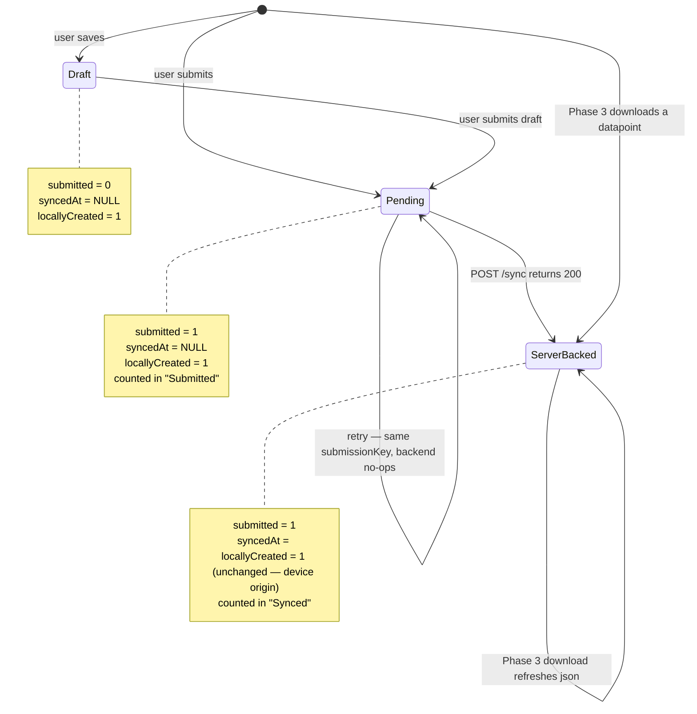
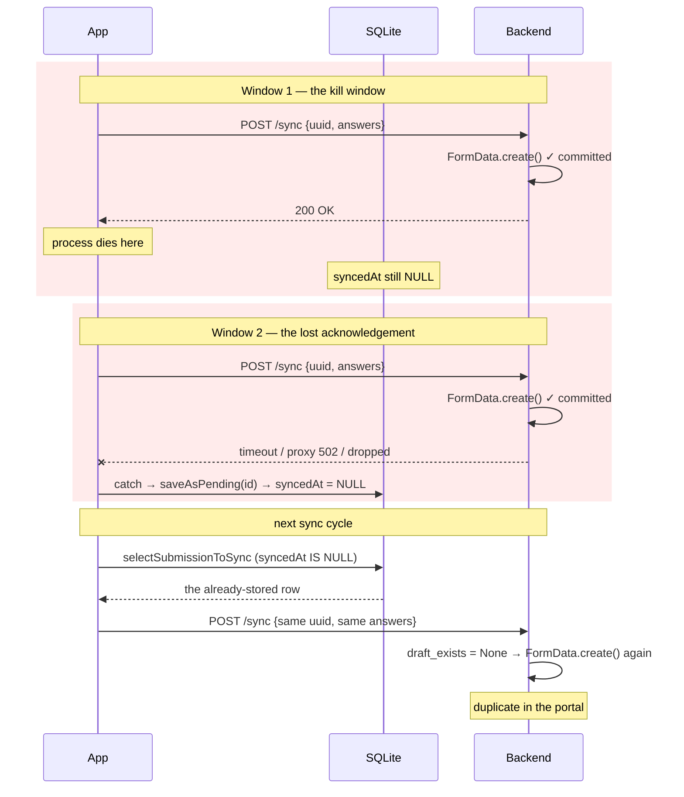
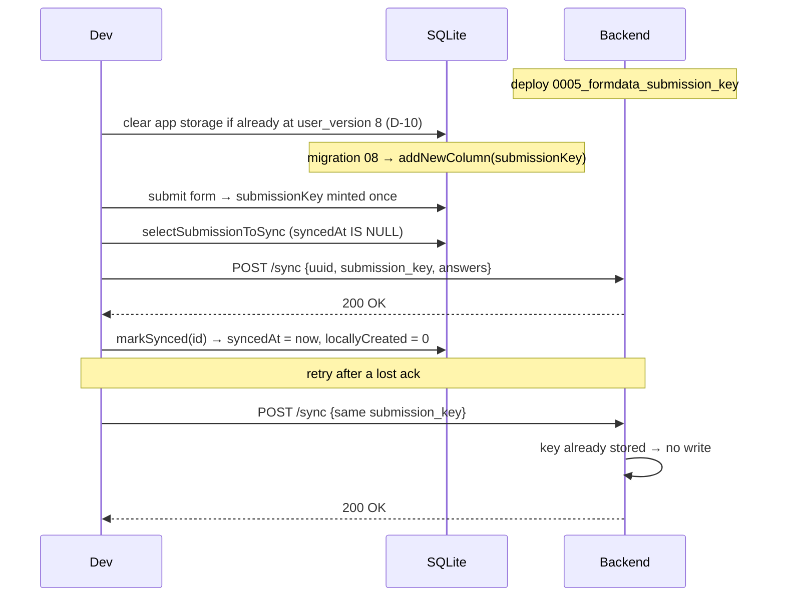

# Feature Design Document

## Feature: Submitted Datapoint Lifecycle & Sync Idempotency

**Task ID**: APP-255
**Author**: Iwan Firmawan
**Date**: 2026-07-10
**Status**: Draft
**Issue**: #255 — Submitted forms persist in local database

---

## 1. Context & Problem Statement

```
Currently:
- Every locally-created submission stays in the `datapoints` table forever with
  `locallyCreated = 1`, even after the backend has confirmed it.
- The Home form card derives its "Submitted" counter from `locallyCreated = 1`,
  so the counter never drains after a successful sync.
- Migration 05 back-filled `locallyCreated = 1` onto EVERY pre-existing row,
  including datapoints that were downloaded from the server. On an upgraded
  device the "Submitted" counter therefore equals the total datapoint count.
- `downloadDatapointsJson` inserts server datapoints using the backend's primary
  key, silently deleting whatever local row already occupies that id.
- POST /device/sync is not idempotent. A killed app or a lost HTTP response
  causes the same submission to be sent twice, and the backend stores it twice.

Goal:
- `locallyCreated` becomes a truthful provenance flag: 1 means "this row exists
  only on this device", 0 means "the backend has this row".
- The Home "Submitted" counter reflects work still pending upload, and reaches
  zero after a successful sync.
- Local rows are never destroyed to achieve this, and no local row can be
  destroyed by an unrelated server datapoint sharing its id.
- A submission that reaches the backend twice is stored once, regardless of what
  the network or the OS did to the acknowledgement.
```

### Why the cleanup query proposed in #255 cannot ship

The issue proposes `DELETE FROM datapoints WHERE submitted = 1 AND syncedAt IS NOT NULL`.

| Claim in the issue | Reality |
|---|---|
| That predicate identifies locally-submitted forms | [`sync-datapoints.js:198-215`](../../app/src/lib/sync-datapoints.js#L198-L215) inserts **every server-downloaded datapoint** with exactly `submitted: 1, syncedAt: lastUpdated`. The DELETE wipes the entire local datapoint store on each sync cycle. |
| The "Submitted" list is an outbox | [`Submission.js:138`](../../app/src/pages/Submission.js#L138) queries `submitted = 1` and is the **datapoint list**. Tapping a row opens `FormOptions` to attach a monitoring submission ([`Submission.js:110-114`](../../app/src/pages/Submission.js#L110-L114)). Synced registration datapoints must live there. |
| Re-syncing may duplicate data in the portal | **True, but deleting rows would not prevent it.** Duplication requires a resend, and a resend requires `syncedAt` to be `NULL` again. Retaining synced rows is not the cause; the acknowledgement protocol is — D-5. |

The reported symptom is a *counter and provenance* bug, not a *retention* bug. The duplication the reporter suspected is real, sits on a different axis, and needs a different fix. Both are in scope here.

---

## 2. Requirements

### User Acceptance Criteria
- [ ] After a successful sync, the Home form card shows `Submitted: 0`.
- [ ] The synced datapoint remains reachable in the datapoint list so monitoring data can still be attached to it.
- [ ] A submission awaiting backend approval still counts as pending work until upload succeeds, and stops counting once it does.
- [ ] No datapoint ever disappears from the device as a side effect of downloading an unrelated datapoint.
- [ ] A surveyor whose phone dies mid-sync, or who syncs on a flaky connection, never sees their submission twice in the web portal.
- [ ] Two genuine monitoring visits to the same datapoint still produce two rows.

### Technical Acceptance Criteria
- [ ] `locallyCreated = 1` ⟺ this device created the row (immutable origin flag, D-17); `syncedAt IS NOT NULL` ⟺ the backend has acknowledged it. The two are independent, so "device data that has / has not synced" is a queryable audit.
- [ ] No `DELETE` is introduced against `submitted = 1` rows.
- [ ] Local primary keys are never assigned from backend primary keys.
- [ ] `POST /device/sync` is idempotent with respect to a client-supplied submission token, for **every** form type and every `is_draft` / `is_pending` combination.
- [ ] Idempotency is enforced by a database constraint, not only by an application-level lookup — concurrent retries must not both insert.
- [ ] Web-portal submissions, which may carry no token, are unaffected.

### Corrected Acceptance Criteria

Two criteria from the original issue are withdrawn, because they describe a screen that is not an outbox:

- ~~"Submitted list only shows pending (unsynced) submissions"~~ → replaced by *"Home `Submitted` counter shows only pending submissions"*.
- ~~"Successfully synced submissions are removed from local storage"~~ → replaced by *"Successfully synced submissions are re-labelled as server-backed, not removed"*.

---

## 3. Data Model Changes

### Mobile (SQLite)

| Table | Change | Reason |
|---|---|---|
| `datapoints` | `locallyCreated` — **semantics only**, no schema change | Cleared to 0 once the backend acknowledges the upload (D-1). |
| `datapoints` | Add `submissionKey TEXT` | Per-submission idempotency token, minted on-device. Declared in [`tables.js`](../../app/src/database/tables.js) and added by migration 08 (D-10). |

### Backend (Postgres)

| Model / serializer | Change | Reason |
|---|---|---|
| `FormData` | Add `submission_key = models.CharField(max_length=64, null=True, unique=True, default=None)` | The idempotency key. `null=True` so rows predating this change, and any keyless submission, remain valid. |
| `SubmitFormDataSerializer` | Add `submission_key = serializers.CharField(required=False, allow_null=True)` and list it in `Meta.fields` | The nested `data` serializer that both the mobile view and the webform pass through. `required=False` is what keeps every existing caller working (D-11, D-12). |

Postgres treats `NULL` as distinct under a `UNIQUE` index, so unlimited rows may carry `NULL` without colliding. The design leans on that: no back-fill is required, and no partial index is needed (D-8).

### Semantics of `locallyCreated`

Two orthogonal axes (D-17): `locallyCreated` is provenance, `syncedAt` is lifecycle. Neither counter nor sync step mutates the provenance flag.

| Column | Today (broken) | After (D-17) |
|---|---|---|
| `locallyCreated` | Set to 1 at creation, and migration 05 back-filled 1 onto **downloaded** rows too — so it no longer meant "device-created". | Set to 1 at creation on a device write, `0` (schema default) on a download. **Immutable thereafter.** `1` = this device made it; `0` = the server did. |
| `syncedAt` | Upload timestamp | unchanged — `NULL` until the backend acknowledges, `<ts>` after. This is the only signal that a row is server-backed. |
| `submitted` | 0 = draft, 1 = submitted | unchanged |

### State machine



Under D-17 the sync 200 sets `syncedAt` and leaves `locallyCreated` alone. A downloaded datapoint enters `ServerBacked` directly with `locallyCreated = 0`; a device submission enters it with `locallyCreated = 1`. The two are distinguishable forever, which is the whole point.

There is no terminal delete state for `submitted = 1`. Rows only leave the table when a draft round-trips (`deleteDraftIdIsNull` / `deleteDraftSynced`), which is existing, correct behaviour.

### Migration Strategy

> **The two "migrations" in this design carry opposite risk.** The Django migration **runs against the production database** and is append-only from the day it deploys. The SQLite migration runs only on developer devices, because the mobile app is not released yet. D-10's reasoning applies to the mobile one and **must never** be applied to the Django one.
>
> Nothing in this design modifies an existing Django migration. `0005_formdata_submission_key.py` is a **new file**. [`0003_add_visualization_indexes.py`](../../backend/api/v1/v1_data/migrations/0003_add_visualization_indexes.py) is cited only as the existing example of the `atomic = False` + `RunSQL` pattern in this repo — copy its shape, do not touch it.

**Mobile — one migration, adding one column** (D-17). [`08_add_submission_key.js`](../../app/src/database/migrations/08_add_submission_key.js):

```javascript
const up = async (db) => {
  await sql.addNewColumn(db, tableName, 'submissionKey', 'TEXT');
};
```

The `UPDATE ... SET locallyCreated = 0` that an earlier revision folded in is **gone** (D-17). It cannot repair migration 05's over-broad back-fill: among the `(locallyCreated = 1, syncedAt = <ts>)` rows that migration 05 produced, a device-synced submission and a downloaded datapoint are already indistinguishable, so no `UPDATE` can restore the origin flag. The only correct state is a fresh database — downloads default to `0`, device writes set `1` — and D-10 already requires wiping every dev device. Provenance correctness comes from the wipe, not from SQL.

`submissionKey` is also declared in `tables.js`, following the precedent of `locallyCreated` (migration 05): `createTable` builds it on a fresh database, `addNewColumn` adds it to an existing one. `addNewColumn` checks `PRAGMA table_info` first, so both paths converge and the migration stays idempotent. `DATABASE_VERSION` stays at `8` (D-10).

- **Idempotent**: re-running is a no-op, which matters because the transaction rolls back and retries on next launch if it throws.
- **Data preservation**: no rows deleted, one column added.
- **Rollback**: none, matching migrations 05 and 07 — `down()` throws. A correction ships as migration 09.

**Backend — one new migration.** `data` grows without bound in production (D-14), so the column and its index are added separately:

```python
# NEW FILE: backend/api/v1/v1_data/migrations/0005_formdata_submission_key.py
class Migration(migrations.Migration):
    atomic = False  # CREATE INDEX CONCURRENTLY can't run in a txn

    dependencies = [("v1_data", "0004_formdata_published_version")]

    operations = [
        # Metadata-only in Postgres 12: nullable, no default.
        migrations.AddField(
            model_name="formdata",
            name="submission_key",
            field=models.CharField(max_length=64, null=True, default=None),
        ),
        migrations.SeparateDatabaseAndState(
            # Builds without an exclusive lock; writes continue throughout.
            database_operations=[
                migrations.RunSQL(
                    sql=(
                        "CREATE UNIQUE INDEX CONCURRENTLY IF NOT EXISTS "
                        "data_submission_key_uniq ON data (submission_key);"
                    ),
                    reverse_sql=(
                        "DROP INDEX CONCURRENTLY IF EXISTS "
                        "data_submission_key_uniq;"
                    ),
                ),
            ],
            # Django's model state still believes the field is unique.
            state_operations=[
                migrations.AlterField(
                    model_name="formdata",
                    name="submission_key",
                    field=models.CharField(
                        max_length=64, null=True, unique=True, default=None
                    ),
                ),
            ],
        ),
    ]
```

The `IF NOT EXISTS` / `DROP ... IF EXISTS` pair matters: `CREATE INDEX CONCURRENTLY` can fail part-way and leave an `INVALID` index behind, and the retry must not trip over it. See D-14.

---

## 4. API Contract

Two endpoints gain one optional field each. No new endpoints, no breaking change.

Both already funnel through the same serializer, which is where the guard belongs (D-11):

| Endpoint | Caller | Builds |
|---|---|---|
| `POST /api/v1/device/sync` | mobile app | `SubmitPendingFormSerializer` |
| `POST /api/v1/form-pending-data/:form_id` | webform ([`Forms.jsx:244`](../../frontend/src/pages/forms/Forms.jsx#L244)) | `SubmitPendingFormSerializer` |

`submission_key` is added to `SubmitFormDataSerializer` — the nested `data` serializer — so both callers carry it in the same place, and both are de-duplicated by the same code.

```jsonc
// POST /form-pending-data/:form_id  — webform
{
  "data": {
    "administration": 12,
    "name": "Household 12",
    "geo": null,
    "uuid": "aaaaaaaa-...",          // monitoring only
    "submission_key": "b2c3d4e5-..." // new, optional
  },
  "answer": [{ "question": 1, "value": "Jane Doe", "index": 0 }]
}
```

The mobile view assembles the same `data` dict before handing it over, so it sets `payload["submission_key"]` exactly where it already sets `payload["uuid"]` ([`v1_mobile/views.py:247-248`](../../backend/api/v1/v1_mobile/views.py#L247-L248)).

| Case | Behaviour | Status |
|------|-----------|--------|
| `submission_key` absent | Today's behaviour, unchanged. Old mobile builds, cached webform bundles, and every seeder keep working. | 200 |
| `submission_key` unseen | Store it on the new `FormData`. | 200 |
| `submission_key` already stored | **No write.** Return the same response as the original call. | 200 |

Returning `200` rather than `409` is deliberate: a replay is not a client error, and neither caller has a useful recovery beyond treating it as success. Making both endpoints *look* idempotent keeps `processBatch` and `submitFormData` unchanged on the happy path.

### Endpoints relied upon

| Endpoint | Behaviour relied upon |
|---|---|
| `POST /device/sync` | Returns 200 only after `serializer.save()` persists the row. This is the acknowledgement signal for D-1. |
| `GET /device/datapoint-list` | Filters `is_pending=False, is_draft=False` ([`views.py:665-668`](../../backend/api/v1/v1_mobile/views.py#L665-L668)) and, when `form_id` is supplied, `parent__isnull=True`. This is what disqualifies download-confirmation in D-1. |

---

## 5. Decision Log

### D-1: Where is "the backend has this row" confirmed?

> **Amended by [D-17](#d-17-locallycreated-is-an-immutable-origin-flag--supersedes-the-flag-clearing-in-d-1-and-d-4).** The decision below to clear `locallyCreated` on the sync 200 was wrong — it destroyed the device-vs-server provenance axis. D-17 keeps the flag immutable and reads lifecycle from `syncedAt` instead. What survives from D-1 is the *timing* — the sync 200 is still the acknowledgement signal that sets `syncedAt`.

**Options Considered**:

1. **Delete on sync** (the issue's proposal) — remove `submitted = 1 AND syncedAt IS NOT NULL`.
2. **Flip on download confirmation** — clear `locallyCreated` inside `downloadDatapointsJson` when Phase 3 matches the row by `uuid`.
3. **Flip on upload acknowledgement** — clear `locallyCreated` in the same write that sets `syncedAt`, when `POST /sync` returns 200.

**Decision**: Option 3.

**Rationale**:

Option 1 is disqualified in §1 — it deletes the datapoint list.

Option 2 is the intuitive one, but it does not hold once the backend filters are accounted for. Phase 3 can never confirm two large classes of row:

- **Submissions awaiting approval.** `get_datapoint_download_list` filters `is_pending=False`, and a submission to an approval-enabled form is saved with `is_pending=True` ([`v1_data/serializers.py:436`](../../backend/api/v1/v1_data/serializers.py#L436)). Such a row would sit at `Submitted: 1` until an approver acts — possibly for weeks.
- **Monitoring submissions.** `onSyncDataPoint` only iterates `selectLatestFormVersion`, which filters `parentId IS NULL` ([`crud-forms.js:50`](../../app/src/database/crud/crud-forms.js#L50)). Monitoring datapoints are never downloaded, so their flag would never clear.

Option 2 also collides with the skip-unchanged guard — see D-3.

Option 3 uses a signal that already exists and is already trusted: the same HTTP 200 that sets `syncedAt`. If that response is good enough to mark a row as synced and drop it out of the upload queue, it is good enough to mark the row as server-backed. It introduces **no new failure mode**, and it works uniformly for registration, monitoring, pending-approval, and auto-approved submissions.

**Impact**: `markSynced` added to `crud-datapoints.js`; `processBatch` in `background-task.js` calls it; `synced` re-derived in both `crud-forms.js` queries. `registered`, `submitted` and `draft` keep their predicates — see §6.

---

### D-2: Stop assigning local primary keys from backend primary keys

**Options Considered**:

1. Keep `id: dpID` and the pre-emptive `deleteById`, and add a guard that checks the victim row is not locally created.
2. Drop `id: dpID` and the `deleteById` entirely; let SQLite assign the local key.

**Decision**: Option 2.

**Rationale**: [`sync-datapoints.js:214`](../../app/src/lib/sync-datapoints.js#L214) ran

```javascript
await crudDataPoints.deleteById(txDb, { id: dpID });   // dpID = backend FormData.id
await crudDataPoints.saveDataPoint(txDb, datapointData); // datapointData.id = dpID
```

`dpID` is the backend's `FormData.id`. Local rows draw from SQLite's autoincrement counter over the *same* small-integer space. Downloading backend datapoint `id = 3` therefore deletes whichever local row happens to hold `id = 3` — which can be an unsynced draft or a submission still queued for upload. That is silent, unrecoverable data loss.

The `deleteById` existed only to avoid a PK conflict caused by reusing `dpID` in the first place. Row identity is already `uuid + form`, which `getByUUID` establishes before the insert. Nothing outside this function reads `dpID`; every consumer of `datapoint.id` ([`FormOptions`](../../app/src/pages/FormOptions.js), [`FormPage`](../../app/src/pages/FormPage.js), [`Submission`](../../app/src/pages/Submission.js)) treats it as a local key. Removing both lines eliminates the collision class rather than guarding one instance of it.

**Impact**: `sync-datapoints.js` only. This was `crudDataPoints.deleteById`'s only call site, so the export becomes dead and is removed — see **D-16**.

---

### D-3: The skip-unchanged guard must not gate the flip

`downloadDatapointsJson` short-circuits when the local copy looks fresh:

```javascript
if (existing?.syncedAt && lastUpdated && existing.syncedAt >= lastUpdated) {
  return;
}
```

`existing.syncedAt` is stamped client-side when the upload response lands, whereas `lastUpdated` is the server's `updated` column, set slightly earlier. For a row the device itself just uploaded, `existing.syncedAt >= lastUpdated` is reliably true, so the function returns before reaching any update.

Under D-1 (flip at upload) this guard is harmless and stays exactly as it is — the flip has already happened by the time Phase 3 runs. This is a further argument against D-1 option 2: that design would have needed the guard relaxed, re-opening a redundant `GET` for every already-current datapoint on every sync.

**Decision**: leave the guard untouched. Recorded here so the next reader does not "fix" it.

---

### D-4: Write a narrow `markSynced` instead of reusing `updateDataPoint`

> **Amended by [D-17](#d-17-locallycreated-is-an-immutable-origin-flag--supersedes-the-flag-clearing-in-d-1-and-d-4).** The reason for `markSynced` existing — writing a couple of columns without re-stringifying `d.json` — is correct and stands. What changes is *which* columns: under D-17 it writes **only** `syncedAt`, not `locallyCreated`. Read the snippet below as `{ syncedAt: ... }`.

`processBatch` confirms an upload with:

```javascript
await crudDataPoints.updateDataPoint(db, { ...d, syncedAt: new Date().toISOString() });
```

`d` is a raw row, so `d.json` is already a JSON **string**. `updateDataPoint` then runs `JSON.stringify(json)` over it, double-encoding the payload on every sync.

Two columns need writing here, so a targeted `markSynced(db, id)` sets exactly `syncedAt` and `locallyCreated`, touches no other column, and removes the corruption at its source:

```javascript
markSynced: async (db, id) =>
  sql.updateRow(db, 'datapoints', { id }, { syncedAt: new Date().toISOString(), locallyCreated: 0 }),
```

**Decision**: add `markSynced`, use it in `processBatch`. Leave `updateDataPoint` alone — `FormPage` calls it with a parsed object, where the stringify is correct.

Removing this writer removes the last source of double-encoded JSON, which is what makes D-15 possible.

---

### D-5: Why the portal duplicates, and why `uuid` cannot fix it

**The backend does not de-duplicate published submissions.** [`views.py:266`](../../backend/api/v1/v1_mobile/views.py#L266) looks the incoming `uuid` up through `FormData.objects_draft`, which is `DraftSoftDeletesManager(only_draft=True)` and therefore filters `is_draft=True` ([`draft_model.py`](../../backend/utils/draft_model.py)). The filter also carries `form__parent__isnull=True`. So the lookup matches **drafts of registration forms and nothing else**. A resent published submission finds no match, falls through to `SubmitPendingFormSerializer.create()`, which calls `.create(data)` unconditionally ([`v1_data/serializers.py:629`](../../backend/api/v1/v1_data/serializers.py#L629)) and inserts a new row. Nothing stops it at the schema level either — `uuid` is `CharField(max_length=255, null=True)` with no `unique` and no `unique_together`.

**A resend is reachable without any user error.** The only guard is client-side: `selectSubmissionToSync` filters `syncedAt IS NULL`. Two windows reopen it.



Window 1 needs only an OS process kill between two adjacent statements. Window 2 needs only a network that fails on the way back.

For a draft, the resend is harmless: `draft_exists` matches and `SubmitUpdateDraftFormSerializer` updates in place. For a published or monitoring submission, it duplicates.

**A duplicate costs more than one extra portal row.** [`FormData.save_to_file`](../../backend/api/v1/v1_data/models.py#L106) writes `f"{self.uuid}.json"`. Two registration rows sharing a `uuid` therefore overwrite each other's export, and `datapoint-list` then hands the mobile app the same `uuid` twice. (Monitoring submissions never export — `save_to_file` opens with `if self.form.parent: return None`, and both call sites filter `form__parent__isnull=True`. Only approved registration datapoints are written.)

**`uuid` cannot become the idempotency key.** It identifies a **datapoint**, not a submission. `SubmitPendingFormSerializer.create()` depends on that:

```python
if data.get("uuid") and obj_data.form.parent:
    parent_data = FormData.objects.filter(
        uuid=data["uuid"], form__parent__isnull=True,
    ).first()
```

A monitoring submission carries its parent's `uuid` so the backend can link it. Two monitoring visits to one household are two correct rows with one `uuid`. A `unique` constraint on `uuid` would reject valid data, and `unique_together(form, uuid)` would reject the second visit to the same monitoring form.

**No audit log.** The issue asks for a "synced and deleted" log. After D-1 nothing is deleted, so the log would record no events. Forensics on the duplicate window is better served by a Sentry breadcrumb around the `api.post`/`markSynced` pair, carrying the `uuid` and the local id. A dedicated SQLite table is speculative.

**Decision**: introduce a per-submission token. D-6 through D-9 specify it.

---

### D-6: Where does the idempotency token come from?

**Options Considered**:

1. Derive it server-side by hashing `(form, created_by, uuid, answers)`.
2. Generate it on-device, once, when the `datapoints` row is first submitted.
3. Reuse the mobile `datapoints.id`.

**Decision**: Option 2.

**Rationale**: Option 1 makes an edited resubmission look like a replay, silently dropping the edit; it also makes the key depend on answer serialisation, which is exactly what D-4 has just stopped corrupting. Option 3 is not globally unique — every device numbers its rows from 1, so two devices collide immediately, and the `unique` constraint would reject the second surveyor's submission.

Option 2 gives a token that is stable across retries (it lives in SQLite alongside `syncedAt`, and `saveAsPending` must not clear it), unique across devices (`Crypto.randomUUID()`, already imported by [`FormPage`](../../app/src/pages/FormPage.js)), and orthogonal to answer content.

**Impact**: `FormPage.js` mints the key; `crud-datapoints.js` persists it; `background-task.js` sends it.

---

### D-7: Do not narrow the client window instead

**Options Considered**:

1. Server-side idempotency only.
2. Write `syncedAt` *before* the POST, and roll it back only on a definite `4xx`.

**Decision**: Option 1. Option 2 is **rejected, not deferred.**

**Rationale**: Option 2 is tempting because it is a two-line client change needing no backend deploy. It is also wrong. Writing `syncedAt` before the request means a submission that genuinely fails to reach the server — airplane mode, DNS failure, a 500 raised before the view runs — is marked synced and **never retried**. That trades a visible duplicate for a silent data loss, which is the worse failure for a field survey. The `saveAsPending` reset exists precisely to guarantee at-least-once delivery.

At-least-once delivery plus a server-side dedupe gives exactly-once *storage*. Both windows in D-5 become harmless once the second POST is a no-op.

---

### D-8: The unique index needs no `WHERE` clause

`submission_key` is `NULL` for every row predating this change and for any caller that omits it. Postgres treats `NULL`s as distinct under `UNIQUE`, so a plain unique index already permits unlimited `NULL`s. Recorded because "unique column, mostly null" reliably prompts a reviewer to ask for a partial index.

`max_length=64` rather than 36: a UUID is 36 characters, and the slack leaves room for a prefixed scheme (`v2:<uuid>`) without another migration.

---

### D-9: The existing `draft_exists` lookup stays

It serves a different purpose — updating a draft in place across successive saves, where the client *intends* an overwrite and deliberately reuses the datapoint `uuid`. `submission_key` guards against *unintended* replays. The two coexist:

- Draft save, same `uuid`, **new** `submission_key` each save → `draft_exists` matches → update in place. Correct today, correct after.
- Retry of one submission, same `submission_key` → early return. New.

So drafts mint a fresh `submission_key` per save, while a submission mints one per submission and reuses it on every retry. This is the one place the two mechanisms can be confused; state it in the implementation.

---

### D-10: Put `submissionKey` in migration 08 rather than adding an 09

> Under [D-17](#d-17-locallycreated-is-an-immutable-origin-flag--supersedes-the-flag-clearing-in-d-1-and-d-4) migration 08 does one thing — add `submissionKey` — and is named [`08_add_submission_key.js`](../../app/src/database/migrations/08_add_submission_key.js). The `locallyCreated` repair this decision once bundled in has been removed; the reasoning below about *editing an unshipped migration in place* is unchanged and is why the edit is allowed at all.

**Options Considered**:

1. New migration `09_add_submissionKey_to_datapoints.js`, plus `DATABASE_VERSION` → 9 and another branch in `migrateDbIfNeeded`.
2. Declare the column in `tables.js` only, and recreate the local database. No migration at all.
3. Add `submissionKey` to migration 08 by editing it in place (it had not shipped).

**Decision**: Option 3.

**Rationale**: a migration runs **once per device**, and then never again — `migrateDbIfNeeded` records the fact in `PRAGMA user_version` and skips it forever after. That is why the normal rule is *never edit an old migration, only add new ones*: the devices that already ran the old version will not re-run your edit.

Migration 08 has not shipped. No phone outside this team has ever run it. So there is nothing to preserve, and editing it is free. It also keeps one release's schema work in one file, which is where a reader will look for it.

Option 1 is what we will be forced to do after release. Today it costs an extra file, an extra `DATABASE_VERSION` bump, and an extra branch in `migrateDbIfNeeded` — all to describe a change belonging to the same unreleased work.

Option 2 deletes even more code, but `addNewColumn` is already idempotent and costs one line. That line keeps the app working for a teammate who pulls this branch and forgets to wipe; without it they get `no such column: submissionKey`. The column is declared in *both* `tables.js` and the migration, exactly as `locallyCreated` is (migration 05).

**What this costs today**: a device that already ran the pre-rewrite migration 08 sits at `user_version = 8`, so the rewritten `up()` will never run on it and `submissionKey` will be missing. Clearing app storage rebuilds the database from `tables.js`.

**When this stops being allowed**: the first time a build containing migration 08 is installed by anyone outside this team. From that moment 08 is frozen, and any further change to `datapoints` needs a new migration 09.

> This reasoning covers **SQLite only**. The Django migration in §3 is deployed to a production database and is append-only from day one.

---

### D-11: One guard in the serializer, not one per view

**Options Considered**:

1. An early return in `v1_mobile/views.py`, before `SubmitPendingFormSerializer` runs.
2. The same early return copied into `v1_data/views.py` `PendingFormDataView.post`.
3. A single guard inside `SubmitPendingFormSerializer.create()`.

**Decision**: Option 3.

**Rationale**: the mobile sync view and the webform's `POST /form-pending-data/:form_id` ([`views.py:616`](../../backend/api/v1/v1_data/views.py#L616)) construct the *same* serializer and both finish with `serializer.save()` returning `{"message": "ok"}`. A guard in one view leaves the other duplicating. A guard in both is the same code twice, and the next caller — a bulk importer, a new endpoint — silently gets neither.

`create()` is the single point every submission routes through, so the guard goes there and returns the already-stored instance instead of inserting:

```python
def create(self, validated_data):
    data = validated_data.get("data")
    key = data.get("submission_key")
    if key:
        existing = FormData._base_manager.filter(submission_key=key).first()
        if existing:
            return existing          # no insert, no answers written
    ...
    try:
        # The savepoint keeps a losing INSERT from poisoning an outer
        # transaction, so the recovery query below can still run.
        with transaction.atomic():
            obj_data = self.fields.get("data").create(data)
    except IntegrityError:
        # Lost the race with a concurrent retry. The row exists; adopt it.
        if not key:
            raise
        return FormData._base_manager.get(submission_key=key)
```

Returning an existing instance from `create()` is legal — DRF only assigns it to `serializer.instance`. The early return also skips the `for answer in validated_data.get("answer")` loop, which is the point: a guard placed after `save()` would deduplicate the `FormData` row and still double every `Answers` row.

**Why the `transaction.atomic()` savepoint.** `ATOMIC_REQUESTS` is off today, so a failed `INSERT` leaves the connection usable and the recovery `.get()` runs. Turn `ATOMIC_REQUESTS` on and the whole request becomes one transaction: the `IntegrityError` poisons it, and the recovery query raises `TransactionManagementError` instead. The savepoint contains the failure either way, so the recovery clause does not silently become unreachable when a setting changes. The `if not key: raise` re-raise keeps an unrelated `IntegrityError` — a bad FK, say — from being swallowed as a phantom replay.

**Why `_base_manager` and not `objects`.** `FormData.objects` is a `DraftSoftDeletesManager`, whose `get_queryset()` falls through to `SoftDeletesManager` and filters `deleted_at__isnull=True`. A soft-deleted row still occupies the `submission_key` in the unique index, so `objects.filter(...)` would miss it, the `INSERT` would raise `IntegrityError`, and the recovery `.get()` would raise `DoesNotExist`. `_base_manager` is Django's documented escape hatch for exactly this — find the row regardless of what the default manager hides.

**The `unique` constraint remains the real guard.** Two retries racing from one device can both pass the `filter().first()` check; only the index stops the second `INSERT`. That is why the `except IntegrityError` clause is not optional, and why §9.1(C) tests it against committed transactions rather than trusting the lookup.

**Impact**: `v1_data/serializers.py` (`SubmitFormDataSerializer` gains the field; `SubmitPendingFormSerializer.create()` gains the guard). Both views are untouched apart from the mobile one passing the key through alongside `uuid`.

#### How does the serializer know whether a payload came from mobile or the webform?

**It doesn't, and it must not.** The guard is origin-agnostic by design: one `submission_key`, one row, whoever sent it. If `create()` branched on the caller, the two paths would drift and one of them would stop being idempotent — precisely the bug this decision exists to prevent.

Origin is decided by *which view ran*, never by inspecting `request.data`:

| Signal | Mobile | Webform |
|---|---|---|
| URL | `/api/v1/device/sync` | `/api/v1/form-pending-data/:form_id` |
| Permission class | `IsMobileAssignment` | `IsAuthenticated` |
| `request.auth` | `MobileAssignmentToken` → `.assignment` | JWT for a `SystemUser` |
| Serializer context | `{"user", "form", "is_draft"}` | `{"user", "form"}` |
| `data["submitter"]` | set to `assignment.name` by the view | absent |

`submitter` correlates with origin today, which makes it an inviting discriminator. It is not one: it is an optional, client-supplied model field, so any caller can set it. **Never infer trust or behaviour from a payload field.**

If a future requirement genuinely needs per-origin behaviour, pass it explicitly through the serializer context — `context={"source": "mobile"}` — set by the view that already knows. That keeps the knowledge where authentication established it, instead of re-deriving it from user input.

---

### D-12: The webform mints a key too

**Decision**: [`Forms.jsx`](../../frontend/src/pages/forms/Forms.jsx) generates a `submission_key` and includes it in `dataPayload` next to `uuid`.

**Rationale**: the duplicate window is not mobile-specific. `submitFormData` awaits `api.post('form-pending-data/...')` and, on any thrown error, shows a toast and re-enables the submit button ([`Forms.jsx:255-262`](../../frontend/src/pages/forms/Forms.jsx#L255-L262)). A request that succeeded server-side but timed out or died in the proxy on the way back leaves the user staring at "something went wrong" with a live submit button. They press it again. Two rows.

The key must be minted **once per submission attempt and reused across retries** — a `useRef` seeded on first submit, cleared only on confirmed success:

```javascript
const submissionKeyRef = useRef(null);
// in submitFormData, before building the payload:
if (!submissionKeyRef.current) {
  submissionKeyRef.current = crypto.randomUUID();
}
// on success, after the POST resolves:
submissionKeyRef.current = null;
```

Minting inside the payload literal instead would give every retry a fresh key and restore the bug. `crypto.randomUUID()` requires a secure context; it is available on `localhost` and HTTPS, which covers dev and production.

**Known gap: an edit after a failed submit is swallowed.** Clearing the key only on success is not sufficient. Take the exact scenario the key exists for — the POST lands, the row is stored, the response is lost, the user sees "something went wrong". If they now *correct an answer* and press submit again, the same key goes up, the guard recognises a replay, and `200` comes back **without writing**. Their edit is discarded and they are told it saved.

The key identifies a submission's *content*, so any edit must invalidate it:

```javascript
const onChange = ({ progress }) => {
  // Any edit makes the next submit a new submission, not a replay.
  submissionKeyRef.current = null;
  setPercentage(progress.toFixed(0));
};
```

The write is to a ref, so it costs nothing. The trade-off is deliberate: after this, "ack lost → user edits → resubmits" leaves the original row in the portal beside the edited one. Two distinct submissions were made, so two rows is the correct outcome, and it is strictly better than silently dropping the second.

This fix is **not** in the implementation commits; it belongs with the webform's own follow-up work. The mobile app does not carry the gap — `FormPage` mints a fresh key on every write, so an edited resubmission is a new submission by construction.

**Backward compatibility**: additive on both tiers. A webform bundle served from cache omits the field and behaves exactly as today, because `submission_key` is `required=False` on the serializer and `null=True` on the model.

Eslint: `frontend/.eslintrc.json` sets `curly: "error"`, so the `if` above needs its braces, and `prefer-const` wants `const submissionKeyRef`.

---

### D-13: The response body stays `{"message": "ok"}`

**Question**: should the dedupe branch return the stored row's `id`, so a client could reconcile after a lost acknowledgement?

**Decision**: no. Keep the body exactly as it is.

**Rationale**: nobody would read the field. After D-2, the mobile app no longer stores the backend's `FormData.id` anywhere — local rows use SQLite autoincrement and identity is `uuid + form`. `processBatch` branches on `res.status === 200` and never inspects the body. `submitFormData` in `Forms.jsx` ignores the response entirely. Adding `id` today ships a field with zero readers, on two endpoints, forever.

Adding it later is not awkward. Both clients ignore unknown response fields, so widening a `200` body is backward compatible for every existing caller — the opposite of adding a *request* field, which the server must be taught to accept. The cost of deferring is one line, in a future where a reader actually exists.

---

### D-14: Add the column and its unique index in separate operations

**Context**: `data` grows without bound in production. There is no "small table" case to optimise for.

**Decision**: `AddField` without `unique`, then `CREATE UNIQUE INDEX CONCURRENTLY` inside `SeparateDatabaseAndState`, in a migration marked `atomic = False`. This is the shape shown in §3.

**Why the plain form is wrong here.** `AddField(..., unique=True)` looks like one operation but does two:

| Step | Cost on a large `data` |
|---|---|
| Add a nullable column with no default | Metadata-only in Postgres 12. Microseconds. Safe. |
| Build the implied `UNIQUE` index | Full table scan under `ACCESS EXCLUSIVE`. **Every read and write to `data` blocks until it finishes.** |

The second step is worse than it first appears: a btree indexes `NULL`s, so the index covers *every* row in `data`, not just the few carrying a `submission_key`. Build time tracks total table size and grows forever, while the number of keyed rows is irrelevant.

`data` is the table behind the datapoint list, the webform submit path, and the mobile sync endpoint. Locking it during a deploy takes the whole product down for the duration.

**Trade-offs of `CONCURRENTLY`:**

| | Plain `AddField(unique=True)` | Split + `CONCURRENTLY` |
|---|---|---|
| Lock | `ACCESS EXCLUSIVE`, whole table, whole build | `SHARE UPDATE EXCLUSIVE`; reads and writes continue |
| Speed | Faster (single scan) | Slower — two table scans, waits for open transactions |
| Transactional | Yes; a failure rolls back cleanly | **No.** `atomic = False`; a failure leaves an `INVALID` index behind |
| Recovery from failure | Nothing to do | `DROP INDEX` the invalid one and re-run. `IF NOT EXISTS` / `DROP ... IF EXISTS` make the retry safe |
| Django state | Handled automatically | Needs `SeparateDatabaseAndState` so the ORM still believes the field is `unique` |

The "not transactional" row is the real cost, and it is why the SQL carries `IF NOT EXISTS` and the reverse carries `DROP INDEX CONCURRENTLY IF EXISTS`. A half-built index is recoverable; an hour of downtime is not.

**Precedent**: [`0003_add_visualization_indexes.py`](../../backend/api/v1/v1_data/migrations/0003_add_visualization_indexes.py) already uses `atomic = False` + `RunSQL` + `CREATE INDEX CONCURRENTLY IF NOT EXISTS` on this same table. `0005` follows it. **`0003` itself is not modified.**

**Deploy note**: because `atomic = False`, this migration cannot be wrapped in a transaction with any other. Run it on its own. If the index build fails, `DROP INDEX CONCURRENTLY IF EXISTS data_submission_key_uniq;` and re-run — the `AddField` step will no-op.

---

### D-15: Remove the double-parse workaround, in both places

**Context**: `selectDataPointById` unwraps `json` twice ([`crud-datapoints.js:8-12`](../../app/src/database/crud/crud-datapoints.js#L8-L12)), and [`Submission.js:65-66`](../../app/src/pages/Submission.js#L65-L66) does the same thing again in the UI layer.

**Decision**: remove both; parse once.

**Rationale**: three findings, in ascending weight.

**No writer produces double-encoded JSON any more.** The corruption had exactly one source: `processBatch` calling `updateDataPoint(db, {...d, syncedAt})`, where `d` came from `selectSubmissionToSync` — a raw SQL row whose `json` is already a string — and `updateDataPoint` ran `JSON.stringify` over it. D-4 replaces that call with `markSynced`. Every remaining writer passes an object: `FormPage` passes `transformAnswers(...)`, `sync-datapoints` passes the API's `answers`, and the draft-sync path at [`SyncService.js:444`](../../app/src/components/SyncService.js#L444) passes `d.json` from `/draft-list`, which the backend serialises as a `SerializerMethodField` **dict**, not a string.

**The workaround is duplicated and applied inconsistently.** It lives in `selectDataPointById` and again in `Submission.js`. Meanwhile `selectDataPointsByFormAndSubmitted` returns the raw row with no unwrapping at all. Three read paths, two different decoding rules.

**That inconsistency is actively dangerous, and this is the real argument.** The paths that carry the workaround are the *display* paths — `FormPage`, `FormOptions`, `Submission`. The path that does not is the *upload* path: `processBatch` does a single `JSON.parse(d.json.replace(/''/g, "'"))`. If anyone reintroduces the double-encode, the screens keep looking correct while `answerValues` becomes a string, `answerValues[file.id] = ...` silently no-ops against a string primitive, and the device POSTs a string where the backend expects an answers object. The workaround does not prevent that regression; it hides it from the one place where it would be noticed, and lets corrupted data reach the server.

Removing it makes a future regression *more* visible: the screens break too, which is where someone would look.

**Safety**: double-encoded rows exist only on devices where the pre-D-4 `processBatch` ran — the same devices D-10 already requires to clear app storage. Verified by the manual check in §9.2.

**Impact**: `selectDataPointById` parses once; `Submission.js` drops its duplicate. The `.replace(/''/g, "'")` unescape stays — writers still escape on the way in.

---

### D-16: Delete `crudDataPoints.deleteById`

**Decision**: remove the export.

**Rationale**: three reasons, in ascending weight.

It has **no callers**. `grep -rn "deleteById" app/src` returns only its own definition. D-2 removed the last one.

**Dead CRUD is not this codebase's convention**, which was the only argument for keeping it "for completeness". The sibling helpers usually cited earn their place: `crudForms.deleteForm` is called from [`Home.js:126`](../../app/src/pages/Home.js#L126), and `sql.truncateTable` from [`LogoutButton.js:34`](../../app/src/components/LogoutButton.js#L34). `deleteById` would be the only orphan — keeping it does not preserve a pattern, it starts one.

**It is a trap sitting next to the code that was just fixed.** The function is a thin wrapper over `sql.deleteRow(db, 'datapoints', id)`. Its entire history is being called with a *backend* `FormData.id` from `downloadDatapointsJson`, where it deleted whichever local row happened to share that integer (D-2). Nothing in its name or signature says which id-space it expects. The next person needing "delete a datapoint locally" will find it and reach for it. Re-adding it later costs one line and `git log` remembers the body; leaving it gives the D-2 bug a ready-made surface to grow back on.

A comment saying "do not pass a backend id here" would be a comment about a function that should not exist.

**Impact**: `crud-datapoints.js` only.

---

### D-17: `locallyCreated` is an immutable origin flag — supersedes the flag-clearing in D-1 and D-4

> This decision **corrects a flaw in D-1 and D-4.** Read it as authoritative wherever it conflicts with them. The banners on those two decisions point here.

**The flaw.** D-1 clears `locallyCreated` to `0` the moment a submission syncs (`markSynced` writes both `syncedAt` and `locallyCreated = 0`). §6 claimed this left the flag "provenance only". It does the opposite. Once cleared, a **device-created row that has synced is byte-identical to a row downloaded from the server** — both are `locallyCreated = 0, syncedAt = <ts>`. The flag became a *lifecycle* signal ("acknowledged or not") and the *provenance* axis (device vs server) was destroyed.

That axis is not cosmetic. It is what lets the app answer "of the data this device produced, how much has reached the server?" — the natural audit for an offline-first field tool. Under the flag-clearing model that question is unanswerable, because device-synced and downloaded rows are indistinguishable.

**The correct model: two orthogonal axes.**

| Axis | Column | Meaning | Mutability |
|---|---|---|---|
| Provenance | `locallyCreated` | `1` = born on this device; `0` = came from the server | **Immutable** — set once at insert, never changed |
| Lifecycle | `syncedAt` | `NULL` = the backend has not acknowledged it; `<ts>` = it has | Set once on the sync 200 |

Truth table:

| Row | `locallyCreated` | `syncedAt` |
|---|---|---|
| Device submission, not yet synced | `1` | NULL |
| Device submission, synced | `1` (**kept**) | `<ts>` |
| Downloaded from server | `0` (schema default) | `<ts>` |

Every audit is then a plain query:

- Device-created total → `locallyCreated = 1`
- Device-created **synced** → `locallyCreated = 1 AND syncedAt IS NOT NULL`
- Device-created **pending** → `locallyCreated = 1 AND syncedAt IS NULL`
- Downloaded → `locallyCreated = 0`

**This still fixes the original #255 counter bug.** The reason the "Submitted" counter never drained was never that the flag stayed `1` — it was that (a) migration 05 back-filled `locallyCreated = 1` onto *downloaded* rows, so they wrongly counted as submissions, and (b) the counter did not consult `syncedAt`, so it could not tell pending from done. D-1 "fixed" this by nuking the flag on sync. The real fix is:

- **(a)** downloaded rows carry `locallyCreated = 0` (the schema default), which holds on a freshly-built database — and D-10 already requires wiping every dev device, so no back-fill is needed;
- **(b)** the pending counter gains `AND syncedAt IS NULL`, so it drains as rows sync **while the origin flag is preserved**.

The flip-on-sync was solving the wrong half of the bug and paying for it with the provenance axis.

**Decision**:

1. `markSynced` writes **only** `syncedAt`. It no longer touches `locallyCreated`. (Amends D-4; the double-encode reason for `markSynced` existing at all still stands.)
2. Migration 08 **drops** its `UPDATE ... SET locallyCreated = 0 WHERE syncedAt IS NOT NULL` line and does nothing but add `submissionKey`. It is renamed [`08_add_submission_key.js`](../../app/src/database/migrations/08_add_submission_key.js) to match. Provenance correctness on-device comes from the D-10 wipe, not from SQL — migration 05's back-fill cannot be un-done by query, because it already collapsed device-synced and downloaded rows into the same `locallyCreated = 1`.
3. The Home-card counters are re-derived on the two-axis model — see §6.

**Why a wipe is the only honest repair.** Migration 05 set `locallyCreated = 1` on *every* pre-existing row. Among the resulting `(1, syncedAt=<ts>)` rows, a device-synced submission and a downloaded datapoint are already indistinguishable — the information needed to separate them was never stored. No `UPDATE` can recover it. A fresh database, where downloads default to `0` and device writes set `1`, is the only state where provenance is correct. D-10 already mandates the wipe, so this costs nothing new.

**Impact**: `crud-datapoints.js` (`markSynced`), migration 08 (+ `index.js`, `App.js` import), `crud-forms.js` (`selectLatestFormVersion` counters). No backend change. No change to `getFormOptions`, which never referenced `locallyCreated`.

---

## 6. Counter Semantics

Under D-17, `locallyCreated` is provenance and `syncedAt` is lifecycle — two orthogonal axes. Every counter is derived by combining them, and none of them mutates the flag.

### `selectLatestFormVersion` (Home form card)

| Counter | Predicate (D-17) | Means | Consumer |
|---|---|---|---|
| `registered` | `submitted = 1 AND syncedAt IS NOT NULL` | Every registration datapoint the backend holds, whoever made it (downloaded **+** this device's synced submissions). | Card title suffix `Household (147)` — [`BaseLayout/Content.js:34`](../../app/src/components/BaseLayout/Content.js#L34). |
| `submitted` | `submitted = 1 AND locallyCreated = 1 AND syncedAt IS NULL` (+ monitoring subquery) | This device's submissions **still waiting to upload**. Drains as `syncedAt` fills in; the flag stays `1`. | Subtitle `Submitted: N`. |
| `draft` | `submitted = 0` | Unchanged. | Subtitle `Draft: N`. |
| `synced` | `submitted = 1 AND locallyCreated = 1 AND syncedAt IS NOT NULL` (+ monitoring subquery) | This device's submissions **that reached the server** — the audit number. | Subtitle `Synced: N`. |

The set relationships are now clean and non-overlapping in intent:

- `registered` is origin-agnostic (`syncedAt IS NOT NULL`); it is the total on the server.
- `submitted` + `synced` partition **this device's** submissions by lifecycle: `syncedAt IS NULL` vs `syncedAt IS NOT NULL`. Their sum is the device's lifetime output; the split is exactly the sync audit.
- `registered − synced` = datapoints the device did *not* create = downloads. Falls out for free.

**Why `registered` changes from D-1's version.** D-1 had `registered = submitted = 1 AND locallyCreated = 0`. Under D-17 a device's *synced* submission is `locallyCreated = 1`, so that predicate would now count downloads only and the card title would silently drop the surveyor's own synced work. Switching to `syncedAt IS NOT NULL` keeps the title meaning "everything the backend has for this form".

The monitoring subqueries fold in on the same axes: pending device monitoring is `mdp.locallyCreated = 1 AND mdp.submitted = 1 AND mdp.syncedAt IS NULL` (for `submitted`), and synced device monitoring is `mdp.locallyCreated = 1 AND mdp.submitted = 1 AND mdp.syncedAt IS NOT NULL` (for `synced`).

### `getFormOptions` (monitoring form list)

| Counter | Today | After |
|---|---|---|
| `submitted` | `submitted = 1 AND locallyCreated = 1` | `submitted = 1` |
| `draft` | `submitted = 0 AND syncedAt IS NULL` | unchanged |
| `synced` | `locallyCreated = 1 AND syncedAt IS NOT NULL` | `submitted = 1 AND syncedAt IS NOT NULL` |

This query is scoped to `f.parentId = ?` and `dp.uuid = ?`, so every row it sees is a monitoring submission for one datapoint. `{item.name} ({item.submitted})` in [`FormOptions.js:61`](../../app/src/pages/FormOptions.js#L61) is a **total** count of monitoring visits for that datapoint, synced or not — which is why it never references `locallyCreated`. It is therefore independent of D-17: the origin flag being immutable or not does not affect a count that ignores origin. `getFormOptions` needs no change.

---

## 7. Compatibility & Migration

### Backward Compatibility
- [x] `submission_key` is `required=False` on the serializer and `null=True` on the model. Any caller that omits it — an old mobile build, a cached webform bundle, a seeder, a direct `FormData.objects.create` — takes the exact path it takes today.
- [x] Multiple `NULL` keys coexist; Postgres treats them as distinct under `UNIQUE` (D-8).
- [x] No existing `FormData` row is modified, and no back-fill runs.
- [x] `POST /form-pending-data/:form_id` and `POST /device/sync` keep their request shape, their `200`, and their `{"message": "ok"}` body.
- [x] Rows already carrying backend-derived local ids keep working — identity is `uuid + form`.
- [x] `deleteDraftIdIsNull` / `deleteDraftSynced` untouched; draft round-trip behaviour is unchanged.

### Mobile App Impact
- Sync endpoints affected: `POST /device/sync` gains one optional request field.
- SQLite schema changes: `submissionKey TEXT`, added by migration 08 and declared in `tables.js`. `locallyCreated` is unchanged in schema; only its *lifecycle* changes — it is no longer cleared on sync (D-17).
- `DATABASE_VERSION` stays at `8` — migration 08 is edited in place, not appended to (D-10).
- Devices already at `user_version = 8` must clear app storage; they will not re-run the rewritten migration.

### Frontend Impact
- [`Forms.jsx`](../../frontend/src/pages/forms/Forms.jsx) mints a `submission_key` per submission attempt and reuses it across retries (D-12).
- No change to `akvo-react-form`, the form definition, or the response handling.

### Rollout order

Backend first, then either client in any order. A client sending `submission_key` to a backend that does not know the field is harmless — DRF drops unknown keys — but the reverse gives no protection. There is no window in which any pairing is worse than today.

### Upgrade path



### Seeder/CLI Compatibility
- [x] Seeders construct `FormData` directly and leave `submission_key` at its `None` default.

---

## 8. Security Considerations

- [x] No permission model change; all mobile-local writes stay device-local.
- [x] `markSynced` takes an integer local id, parameterised through `sql.updateRow`.
- [x] D-2 **closes** an integrity hole: an unlucky backend id can no longer delete an arbitrary local row.
- [x] `submission_key` is opaque and client-supplied. It is never used for authorisation — `IsMobileAssignment` and `assignment` scoping still decide what a device may write.
- [x] A malicious client can suppress its *own* submission by replaying a key it already used. It cannot suppress or read anyone else's: the dedupe branch returns a constant `{"message": "ok"}` and leaks nothing about the matched row.
- [x] The `unique` index is global, so a client could in principle burn a key another client would later choose. With 122 bits of UUID entropy this is not practical, and the failure mode is a rejected insert, not a cross-tenant read.

---

## 9. Testing Strategy

Automated coverage is **backend only** (§9.1). The mobile and frontend changes are verified manually (§9.2).

### 9.1 Backend tests

The guard lives in one place (D-11) but is reached through two endpoints, so the tests sit next to the callers that exercise it. Existing convention decides the split: every `/device/sync` test is in [`v1_mobile/tests/`](../../backend/api/v1/v1_mobile/tests/), because only that package's `AssignmentTokenTestHelperMixin` mints a device token; `v1_data/tests/` exercises `FormData` and `/form-pending-data` with a plain authenticated user.

#### A. `v1_mobile/tests/tests_api_sync_idempotency.py` (new) — the mobile endpoint

Mirrors the `setUp` of [`tests_api_sync.py`](../../backend/api/v1/v1_mobile/tests/tests_api_sync.py): seeders, an admin user, a `MobileAssignment` with a passcode, then `self.get_assignment_token(self.passcode)`.

```python
class MobileSyncIdempotencyTest(
    TestCase, AssignmentTokenTestHelperMixin, ProfileTestHelperMixin
):
```

| Test | Asserts | Why it exists |
|---|---|---|
| `test_replayed_submission_key_stores_one_row` | Two identical POSTs, one `submission_key` → `FormData` count is 1, both responses `200`. | The headline guarantee. **Assert the row count, not the status** — a broken build returns `200` twice regardless. |
| `test_replay_does_not_duplicate_answers` | After the replay, `Answers.objects.filter(data=row).count()` is unchanged. | A guard placed *after* `serializer.save()` would dedupe the `FormData` row and still double every answer. This is the test that catches it. |
| `test_omitted_submission_key_creates_two_rows` | Two POSTs, no key → two rows. | Pins the old-build path. A future "just always dedupe on uuid" breaks monitoring, and this fails first. |
| `test_distinct_keys_create_distinct_rows` | Monitoring form, same `uuid`, different keys → two rows, both parented to the same registration datapoint. | **D-5.** Fails if anyone reverts the key to `uuid`. |
| `test_draft_resave_still_updates_in_place` | `?is_draft=true` twice with **different** keys → one row, latest answers win. | **D-9.** `draft_exists` must keep working; the two mechanisms must not collide. |
| `test_replay_of_published_submission_is_noop` | POST, then `?is_published=true` replay with the same key → one row, still published. | The exact D-5 window — a published submission is what `draft_exists` cannot catch. |
| `test_replay_finds_soft_deleted_row` | Soft-delete the row, replay the key → no new row, no `IntegrityError` reaches the caller. | **D-11.** Fails if the lookup uses `FormData.objects` instead of `_base_manager`; the manager filters `deleted_at__isnull=True` while the unique index does not. |

#### B. `v1_data/tests/tests_submission_key.py` (new) — the model and the webform

Two concerns that are not mobile: the constraint itself, and the webform endpoint that D-12 sends a key through. `TestCase` + `ProfileTestHelperMixin`, matching [`tests_publish_draft_data.py`](../../backend/api/v1/v1_data/tests/tests_publish_draft_data.py).

| Test | Asserts | Why it exists |
|---|---|---|
| `test_submission_key_defaults_to_none` | A `FormData` created without the field has `submission_key is None`. | Pins the seeder path (§7). |
| `test_multiple_rows_may_hold_null_submission_key` | Three rows with `submission_key=None` all save. | **D-8.** If anyone "tightens" this to `NOT NULL` or adds a partial index, every legacy row and every keyless submission breaks. |
| `test_duplicate_submission_key_raises_integrity_error` | A second row with an existing key raises `IntegrityError`. | The constraint is the real guard, not the lookup. |
| `test_webform_replay_stores_one_row` | `POST /form-pending-data/:id` twice with one key → one row. | **D-12.** The webform reaches the same guard through a different view and a different permission class. |
| `test_webform_without_key_creates_two_rows` | Two keyless webform POSTs → two rows. | Backward compatibility: a cached old bundle must behave exactly as today. |

`test_duplicate_submission_key_raises_integrity_error` needs care. Django's `TestCase` wraps each test in a transaction, so an `IntegrityError` poisons it and every later query raises `TransactionManagementError`. Wrap the failing save:

```python
with self.assertRaises(IntegrityError), transaction.atomic():
    FormData.objects.create(..., submission_key=key)
```

#### C. `v1_data/tests/tests_submission_key_concurrency.py` (new) — the race

The `filter().first()` lookup cannot survive two racing retries; neither racer sees the other's uncommitted `INSERT`. Only the unique index stops the second one, and the `except IntegrityError` clause is what turns that into a successful no-op. Proving it needs real committed transactions, so this test **cannot** use `django.test.TestCase`:

```python
class SubmissionKeyConcurrencyTest(TransactionTestCase, ProfileTestHelperMixin):
    # threads need committed rows and their own connections
```

Two threads submit the same `submission_key` through `SubmitPendingFormSerializer`, each calling `close_old_connections()` on the way out. Assert one row survives and no error escapes to either caller.

**Verified to actually race.** A threaded test that passes proves nothing if both threads take the early-return path. Instrumenting the `except IntegrityError` branch to raise a sentinel makes it surface from exactly one thread, confirming the recovery clause is what absorbs the loser. Without this test that clause is untested and will rot into a `pass`.

`TransactionTestCase` truncates tables between tests and is slow, so keep it to one test.

#### Running

```bash
./dc.sh exec backend python manage.py test api.v1.v1_mobile.tests.tests_api_sync_idempotency
./dc.sh exec backend python manage.py test api.v1.v1_data.tests.tests_submission_key
./dc.sh exec backend python manage.py test api.v1.v1_data.tests.tests_submission_key_concurrency
./dc.sh exec backend flake8
```

### 9.2 Manual verification

The mobile and frontend changes are checked by hand. Each row states the decision it protects, so a failure points at a cause.

| Check | Steps | Expected | Protects |
|---|---|---|---|
| Counter drains | Clear app storage. Submit a form offline. | Home card shows `Submitted: 1`, `Synced: 0`. | D-1 |
| | Reconnect and sync. | `Submitted: 0`, `Synced: 1`. Row still in the datapoint list; still opens `FormOptions`. | D-1, §6 |
| Approval-enabled form | Repeat the above on a form with approvers, without approving. | Counter still drains — the flip does not wait for the download. | D-1 |
| Answers survive the round trip | Reopen a synced datapoint from the list. | Answers render; the form is not blank. | D-15 |
| No local row is destroyed | Create an unsynced draft, then trigger a datapoint download. | The draft is still present with its answers. | D-2 |
| Duplicate window | Submit, then force-kill the app between the POST and `markSynced`. Relaunch and let it sync. | Exactly one row in the web portal. | D-5, D-6 |
| Webform retry | Submit the webform with the network throttled so the response is lost. Press submit again. | Exactly one row in the portal. | D-12 |
| Webform without a key | Submit from a build that omits `submission_key`. | Two submissions create two rows; nothing errors. | D-12, §7 |

The first and third rows cannot be replaced by an automated check: nothing else proves the Home card renders the counter it was handed, and the pending-approval behaviour is a backend interaction no in-memory database can stand in for.

---

## 10. Open Questions

- [x] **A rejected submission still shows `locallyCreated = 0`.** The backend never tells the app about a rejection. **Accepted for this release.** The flag means "the backend has this row", which remains true after a rejection. Surfacing approval state on the device is a separate feature, not a correctness bug here.
- [x] **Should the dedupe branch return the stored row's `id`?** No — D-13.
- [x] **Does `save_to_file` clobber exports for monitoring submissions?** No. Monitoring submissions never export; only approved registration datapoints do. Collisions at `{uuid}.json` are a *symptom* of the D-5 duplication bug, not an independent defect, and `submission_key` removes the cause.
- [x] **Should `submission_key` be indexed `CONCURRENTLY`?** Yes — D-14.
- [x] **`selectDataPointById`'s double-parse workaround.** Remove it, and its duplicate in `Submission.js` — D-15.
- [x] **`crudDataPoints.deleteById` is dead code.** Delete the export — D-16.

---

## 11. References

- Issue #255 — Submitted forms persist in local database
- Branch `feature/255-submitted-forms-persist-in-local-database`
- [APP-254 — Dismissible update dialog](APP-254-dismissible-update-dialog.md), which claims migration slot 07
- Migration 05 back-fill rationale: [`05_add_locallyCreated_to_datapoints.js:9-14`](../../app/src/database/migrations/05_add_locallyCreated_to_datapoints.js#L9-L14)
- Draft manager semantics: [`utils/draft_model.py`](../../backend/utils/draft_model.py)
- Unconditional insert: [`v1_data/serializers.py:629`](../../backend/api/v1/v1_data/serializers.py#L629)

---

## Approval

| Role | Name | Date | Status |
|------|------|------|--------|
| Developer | Iwan Firmawan | | |
| Tech Lead | | | |
| Product | | | |
