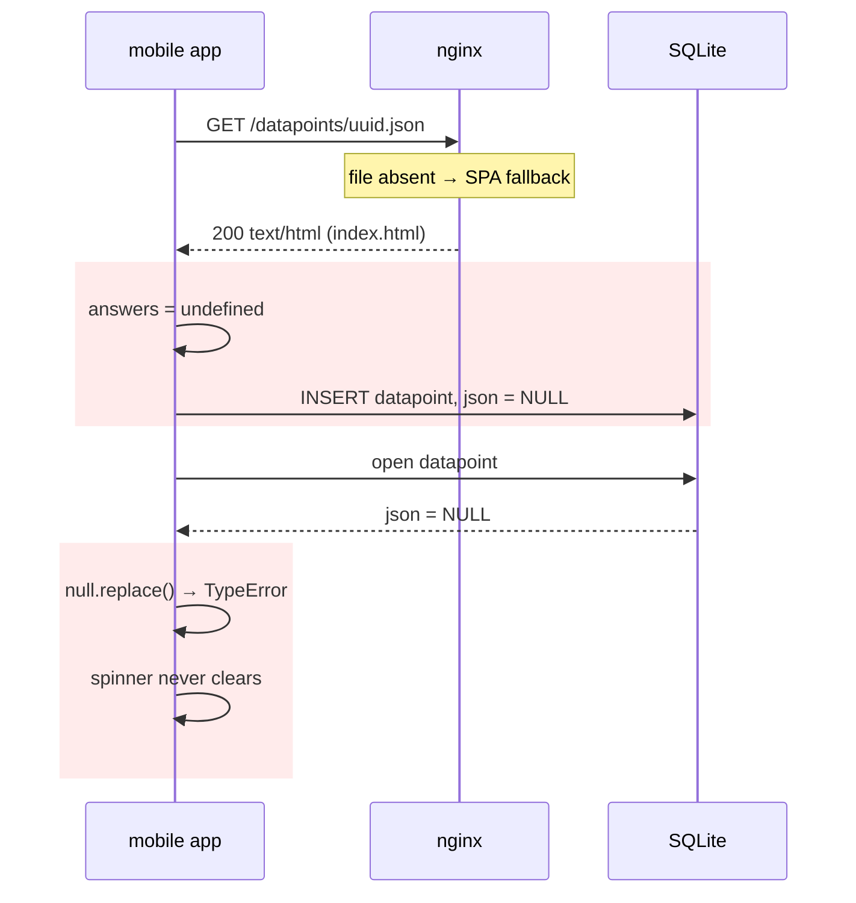

# Feature Design Document

## Feature: Datapoint Sync Resilience on the Device

**Task ID**: APP-407
**Author**: Iwan Firmawan
**Date**: 2026-09-14
**Status**: Implemented, pending release
**Issue**: #407 — Mobile forms not loading for Majuro Water
**Related incident**: Sentry `TypeError: Cannot read property 'replace' of null`
in `selectDataPointById` (mobile release 4.2.1, 2026-09-14), three crashes in a
row for one user opening one datapoint.

---

## 1. Context & Problem Statement

The app never reads answers from the API. It lists datapoints through
`/api/v1/device/datapoint-list`, downloads each one's file from
`{WEBDOMAIN}/datapoints/<uuid>.json`, and stores the `answers` object in the
`json` column of its local `datapoints` table. Every screen that opens a
datapoint reads that column back.

On `mis.akvotest.org`, twelve datapoints were listed to the app with no file
behind them on the server.

```
Currently:
- nginx rewrites /datapoints/<uuid>.json to /storage/datapoints/<uuid>.json
  and has no `location /storage`. A missing file falls through to
  `location /` and its SPA fallback, so the device receives index.html with
  HTTP 200 — a success, with an HTML string as the body.
- downloadDatapointsJson trusts the 200. It reads `answers` off that string,
  gets undefined, and inserts the datapoint with json = NULL.
- selectDataPointById does JSON.parse(current.json.replace(...)) with no
  guard, so reading that row throws TypeError. getByDraftId has the same
  shape.
- FormPage.fetchSavedSubmission sets loading true, and the throw escapes
  before anything sets it false. The form page keeps its spinner forever,
  which is what the user reported: "forms not loading".
- The row is already in SQLite, so every later sync and every later open
  hits it again. The device does not recover on its own.

Goal:
- A response that is not a datapoint is never stored, whatever status code
  carried it.
- A datapoint row that is already poisoned reads as "no answers" instead of
  throwing.
- The form page always leaves its loading state, on every path.
```

### Why this is the app's problem

The server is what served HTML with a 200, and fixing that is real work
(see §7). It does not help the devices in the field. Those devices already
hold rows with `json = NULL`, written by releases that are already
installed; no server change removes them, and the crash repeats on every
open until an app release lands. The app has to be able to survive a bad
response from its own backend.



---

## 2. Requirements

### User Acceptance Criteria
- [x] Opening a synced datapoint never hangs on a spinner and never crashes,
      including rows synced by an earlier release.
- [x] A datapoint whose answers could not be read opens as an empty form
      rather than failing.
- [x] A datapoint the server could not serve is retried on the next sync
      instead of being stored wrong once and kept.

### Technical Acceptance Criteria
- [x] `downloadDatapointsJson` stores nothing when the response body has no
      `answers` object, and reports it to Sentry.
- [x] Nothing is written locally for a skipped datapoint, so the next sync
      fetches it again with no extra bookkeeping.
- [x] `selectDataPointById` and `getByDraftId` read NULL or corrupt `json`
      as `null`.
- [x] `FormPage.fetchSavedSubmission` clears `loading` on success, on empty
      answers and on a thrown read.
- [x] No SQLite schema change, and no new sync endpoint or parameter.

---

## 3. Data Model Changes

None. No migration, no new column, no change to what a healthy datapoint
stores.

---

## 4. API Contract

Unchanged. The app calls the same endpoints with the same parameters; only
its handling of a malformed response differs.

---

## 5. Decision Log

### D-1: Skip the datapoint rather than store a partial row

**Options Considered**:
1. Store the datapoint with `json = NULL` and repair it later.
2. Store it with `json = '{}'` so reads do not throw.
3. Write nothing at all and let the next sync fetch it again.

**Decision**: Option 3.

**Rationale**: the sync inserts a local row only after a successful parse, so
skipping leaves no trace and the datapoint is simply fetched again next time
— no repair queue, no "incomplete" state to reconcile, no extra column. `{}`
is worse than it looks: it is indistinguishable from a datapoint that
genuinely has no answers, so the app would treat a failed download as an
empty datapoint forever.

**Impact**: a datapoint whose file is missing on the server stays absent from
the device until the server can serve it. That is the honest outcome — the
answers do not exist anywhere the device can reach.

### D-2: Validate the body, not the status code

**Decision**: `downloadDatapointsJson` checks that `answers` is an object,
and skips otherwise.

**Rationale**: the failure this fixes arrived as HTTP 200. Checking the
status would not have caught it, and adding a content-type check would only
cover this one way of being wrong. What the code actually needs is the
`answers` object; checking for exactly that is both narrower and stronger.

**Impact**: any future malformed response — a proxy error page, a truncated
body, an HTML login redirect — is skipped by the same guard, without knowing
in advance what shape it takes.

### D-3: One `parseAnswers` helper, not a guard per call site

**Decision**: `parseAnswers(raw)` in `crud-datapoints.js` returns `null` for
NULL, non-string and unparseable input, and both `selectDataPointById` and
`getByDraftId` use it.

**Rationale**: the two call sites had the same `JSON.parse(x.replace(...))`
expression, and only one of them had a null check — which is exactly how one
of them crashed. A single helper means the next reader of this column cannot
get it wrong, and the `''` → `'` unescaping stays in one place.

**Impact**: `parseAnswers` is exported so it can be tested directly against
NULL, corrupt text and the escaped-quote format.

### D-4: `finally` for the loading state

**Decision**: `fetchSavedSubmission` wraps its body in try/catch/finally,
reports the error to Sentry, and clears `loading` in `finally`.

**Rationale**: the spinner is what the user actually saw. Even with D-3
making this particular read safe, any throw between `setLoading(true)` and
the end of the function reproduces the symptom; `finally` fixes the class,
not the instance.

**Impact**: an unreadable datapoint now opens as an empty form. The user can
fill it in and submit rather than being stuck on a page that never loads.

### D-5: Report to Sentry, do not surface to the user

**Decision**: a skipped download calls `Sentry.captureMessage` with the URL;
a failed read calls `Sentry.captureException`. Neither shows a message in the
UI.

**Rationale**: the user cannot act on "this datapoint's file is missing on
the server" — they did nothing wrong and have no way to fix it. The people
who can act on it are the ones reading Sentry, and the URL contains only a
UUID, so nothing sensitive is logged.

**Impact**: the same failure that took four days to notice as a crash report
now arrives as a named event with the datapoint's URL in it.

---

## 6. Type/Constant Mappings

Not applicable.

---

## 7. Deferred: the server-side fix

**This change stops the app being harmed. It does not stop the server
causing the harm**, and the server work is explicitly out of scope for this
release.

What is still true after this ships:

| Gap | Effect |
|---|---|
| `/datapoints/<missing>.json` answers `200 text/html` from the SPA fallback | Every consumer of a storage URL sees a success for a file that is not there. The app now ignores it; nothing else does. |
| The JSON file is written only inside the Django-Q task `seed_approved_data`, on the worker | A worker outage — the 2026-09-10 incident was over a day — publishes datapoints with no file. The task also has no error handling. |
| The Excel bulk upload never writes the file at all | Datapoints uploaded by a superadmin are listed to devices and can never be downloaded. |
| The mobile draft-publish path writes the file but skips the materialized view refresh | Published drafts are missing from dashboards until something else refreshes the view. |
| Nothing detects a missing file | `generate_data_json` exists and must be run by hand, by someone who already knows. |

Until that work lands, the recovery for a datapoint the app refuses is to
regenerate the file on the server:

```bash
./dc.sh exec backend python manage.py generate_data_json
```

The design for the server-side change — a single `finalize_datapoint` entry
point that writes the file in the request, a `file_generated_at` stamp that
keeps unwritten datapoints out of the device's list, nightly reconciliation,
and the nginx `location /storage/` block — was worked out and is deliberately
held back rather than discarded. It needs its own task, its own deploy and
its own backfill, none of which belong in a mobile release.

---

## 8. Security Considerations

- [ ] No new endpoints, permissions or stored data.
- [ ] The Sentry message carries only the datapoint URL, whose variable part
      is a UUID — no answers, no user identity, no administration name.
- [ ] Refusing to store an unparsed response removes an injection surface
      rather than adding one: arbitrary server-supplied text no longer
      reaches the `json` column.

---

## 9. Testing Strategy

| Test Type | Coverage |
|-----------|----------|
| Unit — sync | `app/src/lib/__test__/sync-datapoints-null-json.test.js`: the SPA HTML body stores nothing (`insertRow` not called); a well-formed body still stores, with the answers serialised as before; `selectDataPointById` returns `json: null` for a NULL column; `parseAnswers` handles NULL, non-JSON text and the `''` escaped-quote format. |
| Unit — page | `app/src/pages/__tests__/FormPageMissingAnswers.test.js`: the form page clears its loading state and renders when stored answers are null, and when the read throws. |
| Manual | On a device holding a poisoned row from 4.2.1, open the datapoint: the form opens empty instead of spinning. Sync again: the datapoint is skipped, with a Sentry event naming its URL. |

Both suites pass, and mobile lint reports no errors:

```bash
./dc-mobile.sh exec mobileapp npm test -- sync-datapoints-null-json FormPageMissingAnswers
./dc-mobile.sh exec mobileapp npm run lint
```

---

## 10. Compatibility & Release

### Backward Compatibility
- [x] SQLite schema unchanged — no migration, and an upgrade touches no
      existing row.
- [x] Rows already carrying `json = NULL` are readable after the upgrade;
      they open as empty forms instead of crashing.
- [x] Works against any backend version. Nothing here depends on the server
      changes in §7, and nothing here conflicts with them.

### Rollout
- [x] Ships as an ordinary app release; no coordinated backend deploy.
- [ ] Bump the version with `./update-mobile-version.sh` before the build.
- [ ] After release, watch Sentry for `[sync-datapoints] no answers in
      datapoint file, skipped` — each event names a datapoint whose file the
      server owes, and the count is the size of the §7 problem.

---

## 11. Open Questions

- [ ] Should a datapoint skipped repeatedly — say, on five consecutive syncs
      — be surfaced in the app rather than only in Sentry? Only worth
      answering if §7 stays deferred for long enough for it to matter.

---

## 12. References

- Code: `app/src/lib/sync-datapoints.js` (`downloadDatapointsJson`),
  `app/src/database/crud/crud-datapoints.js` (`parseAnswers`,
  `selectDataPointById`, `getByDraftId`), `app/src/pages/FormPage.js`
  (`fetchSavedSubmission`).
- Related tasks: APP-255 (submitted datapoint lifecycle), MT-010 (mobile
  tenant isolation), #314 (missing photo recovery).
- Server side, deferred: `backend/api/v1/v1_data/models.py`
  (`save_to_file`), `backend/api/v1/v1_data/tasks.py`,
  `backend/api/v1/v1_jobs/seed_data.py`,
  `frontend/nginx/conf.d/default.conf`.

---

## Approval

| Role | Name | Date | Status |
|------|------|------|--------|
| Developer | Iwan Firmawan | 2026-09-14 | Implemented |
| Tech Lead | | | |
| Product | | | |
