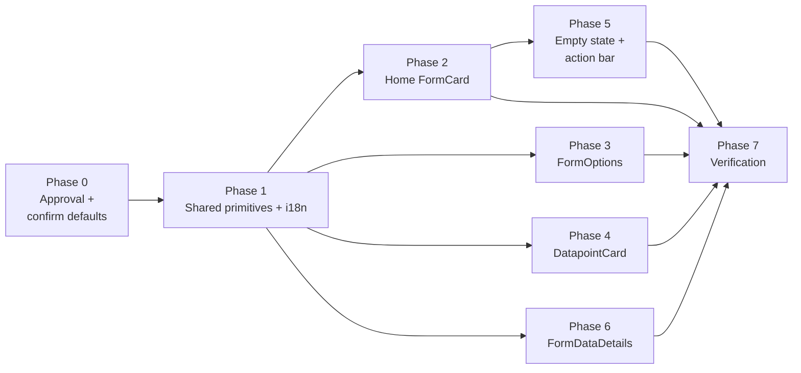

# Feature Design Document

## Feature: Mobile Redesign — Form Cards and Datapoint List Items

**Task ID**: APP-481
**Author**: Mobile developer
**Date**: 2026-09-28
**Status**: Implemented on `feature/481-mobile-redesign-cards-list-items` (device-checked 2026-09-28). This document describes what was built; A14 and A17–A25 record where it departs from the original story and from Figma.

---

## 1. Context & Problem Statement

```
Currently:
- The Home form list uses the shared components/Card.js (RNEUI Card) with four plain subtitle
  strings ("Version: 1.0.0", "Submitted: 2", ...). It follows the theme, but the layout is
  the old one.
- FormOptions (a datapoint's detail screen, with sections "Datapoint" and "Monitoring Forms")
  renders flat rows with hardcoded colors (#212121, #E0E0E0, #f5f5f5, #ccc). It shows only the
  submitted count, although its query already returns draft and synced counts.
- The datapoint list (pages/Submission.js) does not call useTheme at all and uses hardcoded
  colors throughout, with a yellow left accent on drafts.
- Home with zero forms renders a blank list; there is no empty state.
- FormDataDetails' section header is hardcoded (#f2f2f2).
- Result: these screens ignore dark mode, while the form fields (APP-474) and overlays
  (APP-477) already follow it.

Goal:
- Token-driven cards on Home, FormOptions and Submission that follow light, dark and auto
  themes, with no hardcoded colors, and no loss of navigation, swipe actions, sync progress or
  badges.
```

**User story**: As a user, I see form cards and datapoint list items styled with the new card design, adapting to both dark and light themes.

### Where each element lives today

| Element | Screen / component | Styling today |
|---|---|---|
| Home "Submissions container" | `pages/Home.js` → `BaseLayout/Content.js` → `components/Card.js` | Tokens, old layout |
| Monitoring form card | `pages/FormOptions.js` (`renderItem`) | Hardcoded |
| Section labels "DATAPOINT" / "MONITORING FORMS" | `pages/FormOptions.js` section headers | Hardcoded, not uppercase |
| Setting row "View details" | `pages/FormOptions.js` (same `renderItem`) | Hardcoded, label + chevron only |
| Datapoint card | `pages/Submission.js` | Hardcoded, no `useTheme` |
| Empty state (no forms / no datapoints) | none on Home; icon + text on Submission | Hardcoded on Submission |
| "New Submission" button | `pages/Submission.js` → `components/FAButton.js` (floating pill) | Hardcoded |
| Answer-list section header | `pages/FormData/FormDataDetails.js` | Hardcoded `#f2f2f2` |

---

## 2. Requirements

All colors are tokens from `app/src/lib/theme.js`, read through `useTheme()`. The values below are listed dark / light.

### User Acceptance Criteria

**Form card — Home ("Submissions container")**, confirmed against Figma node `6499:17432` (see §11)
- [ ] Two sections, as in Figma node `6499:17415`, each a collapsible header (title + caret) over its own container (A14); 16px screen padding, 12px gap from header to container:
  - **Latest submissions**: every form with data created in this app (`locallyCreated = 1`: new registrations, drafts, and new monitoring data on downloaded datapoints), newest first (`lastActivityAt`, A18). Hidden when empty, e.g. right after login.
  - **Earlier submissions**: every other form, in the current order (A20). Each form appears in exactly one section; hidden when empty.
  - Each header shows its section's count, collapsed or not (A21). The "Add form" row (A5) is the last row of whichever section comes last.
- [ ] Search filters both sections
- [ ] One container per section: `bg.surfaceElevated2` (`#1F1F1F` / `#FFFFFF`), radius 16, padding 16; 24px between sections
- [ ] The list scrolls down to the tab bar, with 16px bottom padding (A22)
- [ ] Forms separated by 1px `border.listDivider` (`#383838` / `#E2E2E2`), with 16px above and below each divider; no left border accent
- [ ] Per form: title 16 / w500 / line height 24 / `text.primary`; 2px gap; version 12 / w500 / line height 16 / `text.highlight`; 12px gap; stats row
- [ ] Stats row: items 20px apart, each **stacked** (count above label, 1px gap). Count 12 / w500 / line height 16, colored per D-2; label 12 / w400 / line height 16 / `text.tertiary`
- [ ] Last row "Add form": icon + text 16 / w500 / `text.tertiary`, 24px tall. It opens `AddNewForm`, and is hidden when the login's `authenticationType` includes `code_assignment`, the same rule as Settings' `add-more-forms` (A5)
- [ ] While a form syncs, a 4px progress bar (`text.highlight` fill on a `border.listDivider` track) shows under that form's stats row; there is no border highlight (A6)

**Form card — Monitoring (FormOptions)**
- [ ] Card `bg.surfaceElevated1` (`#141414` / `#FFFFFF`), 1px `border.subtle`, radius 16, padding 16 horizontal / 14 vertical, 10px gap
- [ ] Head row: clipboard icon `status.success`, title 16 / w700 / `text.primary`, chevron `text.tertiary`
- [ ] Version 12 / w400 / `text.tertiary`
- [ ] Stats row, 20px gap, each stat **stacked** (count above label), like Home (A3): count 16 / w700 colored per D-2; label 11 / w400 / `text.tertiary`

**Datapoint card (Submission list)**, confirmed against Figma nodes `6499:17458` (light) and `6259:6261` (dark). **The Figma design supersedes the story here** (see §11 and A7):
- [ ] Two collapsible sections, like Home (A14, A19): **Latest submissions** = datapoints with activity created in this app (the row itself or its monitoring data, A18), newest first; **Earlier submissions** = every other row, in the current order (A20). Each row appears once; an empty section is hidden. Every header shows its count (A21). The drafts-only family view keeps its per-form grouping, drawn with the same collapsible, counted `SectionHeader`. The "Last submission" sort chip is removed (A19)
- [ ] Separate cards, 8px apart (no dividers). Card fill `bg.surfaceElevated2` (the story says `surfaceElevated1`) with 1px `border.subtle`; min height 64; padding 16 horizontal, 11 vertical; radius 12 (`radius.md`; the Figma radius was not re-read, §11)
- [ ] Name 16 / **w500** / line height 24 / `text.primary` (the story says w700)
- [ ] One meta line under the name (2px gap): `Registered {date}` (drafts: `Created {date}`): `createdAt` for rows created in the app, `syncedAt` (the server's `last_updated`) for downloaded rows, whose `createdAt` is the download time (A18); 12 / w400 / line height 16 / `text.tertiary`. This **replaces** the story's key/value rows. The Figma `{administration} ·` prefix is deferred (A17).
- [ ] Status icon, 20px Ionicons, on the right (12px from the text, 16px from the edge): draft = `pencil` in `status.draft`; waiting to sync = `time` in `status.warning`; delivered to the server = `checkmark-circle` in `status.success`. Each icon carries an `accessibilityLabel` and the testID `status-${status}-${id}`. This replaces today's yellow left accent and the Draft badge.
- [ ] A legend under the list (12 / w300 / line height 16, `text.tertiary`) explaining **every status icon the list currently shows**, in icon-priority order: File missing, Pending upload, On web, Draft, Waiting to sync, Delivered to the server (A24). New EN/FR text only for the last two ("Waiting to sync" / "Delivered to the server"); the others reuse `photoMissingText`, `draftText`, `pendingWebLabel`, `onWebLabel`. `DatapointLegend`, testID `status-legend`, shown whenever the list has rows
- [ ] States the design doesn't draw (A7). The icon priority is **file missing > draft > waiting to sync > synced**:
  - File missing: `alert-circle` in `status.error` replaces the status icon, and the row still opens the retake flow
  - Draft bound for the web (`sendToWeb` or `draftId`): `cloud-upload` in `status.draft` replaces the pencil while it is pending, and `cloud-done` once it is synced, so today's "Pending upload" and "On web" labels stay distinguishable
  - Monitoring info: on the registration list, submitted rows append `· {n} monitoring` to the meta line, one line, truncated. It is part of the meta string, so the old `monitoring-meta-${id}` testID and its drafts / last-monitoring details are gone
  - Draft swipe actions (`ListItem.Swipeable`) are unchanged

**Empty state — Home (no forms) and Submission (no datapoints)**, per Figma nodes `6499:17376` (light) and `6218:1095` (dark) (A23)
- [ ] One shared `EmptyState` component: the stacked-paper illustration (146×181), then 27px, then a 290-wide centred text block (title 24 / w500 / line height 30 / letter-spacing −0.1 / `text.primary`; 8px; body 16 / w500 / line height 24 / `text.secondary`), then the hand-drawn arrow (142×160 box, image rotated −7.91°, overlapping the text by 7.5px). Top-aligned, 24px from the top of its area
- [ ] Illustration and arrow are the Figma SVGs rasterised to PNG at 1×/2×/3×, one file per theme (`app/assets/empty-state/`), since the app has no SVG renderer and adds no dependency
- [ ] Arrow position: on Submission, exactly as Figma (tip right of centre, over the full-width New submission button, A25); on Home, the tip is moved to the centre line, over the Settings tab (A23)
- [ ] Home: `bg.surfaceTertiary` (`#1B1B1B` / `#EAEAEA`) behind the empty state. Copy (EN): "No forms yet" / "Add a form from Settings to start collecting data." With a code-assignment login, the body instead reads "Forms assigned to you will appear here.", and there is no arrow (A8)
- [ ] Submission: shown once loading finishes with no rows; keeps the existing copy ("No data collected yet" / "Click New Submission to begin"). While loading, the spinner and "Fetching data" stay

**Action bar — Submission "New submission"**, per Figma node `6499:17412` (A25)
- [ ] `ActionBar` replaces `FAButton`: container `bg.surfaceElevated3` (`#242424` / `#FFFFFF`), top corners radius 24, padding 16 top / 24 bottom / 16 horizontal, pinned to the screen bottom and extended by the bottom safe-area inset
- [ ] Full-width button `buttonPrimary.bg`, radius 16, padding 16 vertical / 24 horizontal; label 16 / w700 / line height 24 / `buttonPrimary.text`, 8px gap, then a 24px Ionicons `add` in `buttonPrimary.text`
- [ ] The list's bottom padding clears the bar (104); `new-submission-button` testID kept

**Section labels**
- [ ] "DATAPOINT", "MONITORING FORMS", and the question-group headers on FormDataDetails (A9): 11 / w700 / `text.tertiary`, uppercase

**Setting row — "View details"**
- [ ] 1px bottom border `border.divider` (`#333333` / `#AFAFAF`)
- [ ] Icon box `input.bg`, radius 8, icon `icon.accent` (`#8CA2FF` / `#0434FF`)
- [ ] Label 16 / w500 / `text.primary`; description 12 / w400 / `text.tertiary`
- [ ] *Default* content (A10): Ionicons `document-text-outline`; description EN "See every answer in this datapoint", FR "Voir toutes les réponses de ce point de données"
- [ ] Chevron `bottomNav.deselected` (D-1)

**Behaviour preserved**
- [ ] Tapping a Home form still opens its submissions; tapping a monitoring form still opens it
- [ ] Draft swipe actions and the sync progress indicator still work; every state today's badges show (Draft, File missing, On web, Pending) is still visible through the status icon (A7)
- [ ] Switching theme re-renders every card without reopening the screen

### Technical Acceptance Criteria
- [ ] No hex literals in the touched components. A search for `#[0-9a-fA-F]{3,6}` returns nothing unless this doc approves the literal.
- [ ] The monitoring card's Draft and Synced counts come from the existing `crudForms.getFormOptions` columns (`draft`, `synced`), with no new queries (D-3)
- [ ] Uppercase section labels use `textTransform: 'uppercase'`; the EN/FR i18n strings are unchanged
- [ ] New visible text gets EN and FR keys in `lib/i18n/ui-text.js`: label-only stat labels (Draft reuses the existing `draftText`), the Home "Add form" row, the View details description, the empty-state title and both bodies, the datapoint legend, and the monitoring meta suffix
- [ ] Passes the app's Airbnb ESLint config (no prop spreading, no nested ternaries, no `for…of`)
- [ ] Existing testIDs are kept: `card-touchable-${id}`, `form-item-${id}`, `form-list`, `submission-item-${id}`, `delete-draft-${id}`, `send-to-web-${id}`, `section-${title}` (drafts-only form groups). Removed with their elements: `sort-last-submission-button` (A19), `retake-badge-${id}`, `on-web-${id}`, `pending-web-${id}`, `monitoring-meta-${id}` (A7). New: `section-header-latest` / `section-header-earlier`, `form-group-latest` / `form-group-earlier`, `stat-submitted` / `stat-draft` / `stat-synced`, `home-add-form`, `home-empty-state` / `home-empty-state-arrow`, `submission-empty-state` / `submission-empty-state-arrow`, `new-submission-button-bar` (the button keeps `new-submission-button`), `status-${status}-${id}`, `status-legend`, and `button-users` on Home's Users button

---

## 3. Data Model Changes

**No schema changes. No new SQLite queries.** Two existing queries change (A18):

- `crudForms.selectLatestFormVersion` gains `lastActivityAt`: one subquery taking `MAX(COALESCE(submittedAt, createdAt))` over the form's own rows and its monitoring forms' rows with `locallyCreated = 1` for this user (one extra `user` bind). NULL puts the form in "Earlier".
- `crudDataPoints.getMonitoringStats` narrows `lastSubmissionAt` to app-created monitoring submissions (`locallyCreated = 1`).

The monitoring card's counts already come from `crudForms.getFormOptions` (`app/src/database/crud/crud-forms.js`), which is scoped to one datapoint (`dp.uuid = ?`):

| Card label | Query column | Definition |
|---|---|---|
| Submitted | `submitted` | `dp.submitted = 1` |
| Draft | `draft` | `dp.submitted = 0`, including drafts downloaded from the web (this matches the Home card and the datapoint list) |
| Synced | `synced` | `dp.submitted = 1 AND dp.syncedAt IS NOT NULL` |

`FormOptions` renders only `submitted` today. The change is to pass all three to the card.

### Modified Models

| Model | Change | Reason |
|---|---|---|
| — | none | — |

### Migration Strategy

Not applicable, because the SQLite schema and stored data are unchanged (A18).

---

## 4. API Contract

No backend or API changes. This is a mobile change only.

---

## 5. Decision Log

### D-1: Chevron token on the setting row

**Options Considered**:
1. `bottomNav.border`, as the story states. Its actual dark value is `#1E293B`, not the `#475569` the story lists, so it is nearly invisible on `#000`.
2. `bottomNav.deselected`: `#475569` in both modes, which is the dark value the story intended.
3. Change `bottomNav.border` in `theme.js` to `#475569`.

**Decision**: Option 2.

**Rationale**: It gets the intended color without changing a token that the bottom navigation bar also uses.

**Impact**: `theme.js` is unchanged, and so is the bottom nav border.

### D-2: One count-color mapping for both form cards

**Options Considered**:
1. As written: Home colors Submitted `status.success` and Synced `text.primary`, while the monitoring card does the opposite.
2. Unify on Synced = success: Submitted `text.primary`, Draft `status.warning`, Synced `status.success`.
3. Unify on Submitted = success.

**Decision**: Option 2 on both cards, **reconfirmed (A15)**. The Home Figma node `6499:17432` uses option 1's Home mapping, but the same file's datapoint legend defines *green tick = delivered to the server*. The Home frame is the inconsistent one, and design is asked to update it.

**Rationale**: Green then means "reached the server" everywhere. Two cards coloring the same words differently would read as two different statuses.

**Impact**: This overrides the Home mapping in both the original story and the current Home frame. Design follow-up: recolor the Home frame's stats to match.

### D-3: Monitoring card counts

**Options Considered**:
1. Show only the submitted count and hide Draft and Synced.
2. Show all three counts.

**Decision**: Option 2. Investigation found that `getFormOptions` already selects `draft` and `synced` for the datapoint, so no new queries are needed.

**Rationale**: The data is already fetched; only the rendering was missing.

**Impact**: This is limited to `FormOptions.js` and the new card, with no database code touched.

### D-4: Dedicated components instead of extending Card.js

**Options Considered**:
1. Add variants (home / monitoring / datapoint) to `components/Card.js`.
2. New components per the story, replacing `Card.js`.

**Decision**: Option 2.

**Rationale**: The three layouts share almost no structure: Home is a divided group, and monitoring and datapoint are bordered cards. `Card.js` has one production caller, `BaseLayout/Content.js`, and its test already asserts a `submission-type-tag` that it no longer renders.

**Impact**: Remove `Card.js` and `Card.test.js`, and update `BaseLayout/Content.js` and its tests. Proposed components, under `app/src/components/`:

| Component | Used by | Renders |
|---|---|---|
| `FormCard` | Home (inside the grouped container), FormOptions | title, version, stats; `variant` = `home` or `monitoring` sets sizes and head-row icons |
| `DatapointCard` | Submission | name, one meta line, status icon (per Figma, A7) |
| `SectionLabel` | FormOptions, FormDataDetails (A9) | uppercase 11 / w700 label |
| `DatapointLegend` (exported from `DatapointCard.js`) | Submission | one line per status icon the list shows (A24) |
| `EmptyState` | Home, Submission (A23) | Figma illustration, title, body and optional arrow (`arrowTip` `right` / `centre`) |
| `ActionBar` | Submission (A25) | full-width primary button on a bottom sheet surface; replaces `FAButton` |
| `SectionHeader` | Home, Submission (A14, A19, A21) | section title, row count and collapse caret; own state, or controlled (`collapsed` + `onToggle`) as a `SectionList` header |
| `SettingRow` | FormOptions "View details" | icon box, label, description, chevron |

---

## 6. Type/Constant Mappings

Stat label to i18n key (existing keys, `lib/i18n/ui-text.js`):

| Card label | i18n key | Count color (D-2) |
|---|---|---|
| Submitted | `statSubmitted` (new) | `text.primary` |
| Draft | `draftText` (existing: "Draft" / "Brouillon") | `status.warning` |
| Synced | `statSynced` (new) | `status.success` |

The old labels (`submittedLabel`, `draftLabel`, `syncLabel`) are colon-suffixed strings (for example "Submitted: 2"). Because stats are stacked (A3), they are replaced by label-only keys: new `statSubmitted` and `statSynced`, and the existing `draftText` for drafts, so the card says "Draft" like the rest of the app rather than a new "Saved". The old keys are removed once nothing uses them after Phase 2.

---

## 7. Compatibility & Migration

### Backward Compatibility
- [x] No API consumers affected (mobile UI only)
- [x] Existing data preserved (no schema change)
- [x] CLI tools unaffected

### Mobile App Impact
- [ ] Sync endpoints affected: none
- [ ] SQLite schema changes: no
- [ ] Version detection: not needed; ships with the next app release

### Seeder/CLI Compatibility
- [x] Not applicable

---

## 8. Security Considerations

- [x] No permission changes: the cards display data the screens already load
- [x] No new input paths
- [x] No new attack vectors

---

## 9. Testing Strategy

| Test Type | Coverage (as built) |
|---|---|
| Unit | `components/__tests__/FormCard.test.js`: both variants, Submitted / Draft / Synced labels, D-2 count colors under `darkModePreference` `dark` and `light`, sync progress bar |
| Unit | `components/__tests__/DatapointCard.test.js`: `getStatus` priority table (A7), meta text color, status icon label and color in both modes, legend lists only the icons present (cloud states included, A24) |
| Unit | `components/__tests__/EmptyState.test.js`: per-theme illustration and arrow, arrow left out on request (A23) |
| Unit | `components/__tests__/ActionBar.test.js`: bar and button token colors in both modes, press (A25) |
| Unit | `components/BaseLayout/__tests__/Content.test.js`: counted sections, footer closes the last visible section, empty section hidden, collapse keeps the count, children when empty, press action |
| Integration | `pages/__tests__/FormOptions.test.js`: `getFormOptions` counts reach the monitoring card; View details row and description |
| Integration | `pages/__tests__/Home.test.js`: per-card stats (`stat-*`), French labels, Latest / Earlier split and order, each section alone, empty state with and without `code_assignment`, Add form row |
| Integration | `pages/__tests__/Submission.test.js` (new): Latest / Earlier split and order, counts, collapse, each section alone, drafts-only form groups with counts |
| Removed | `components/__tests__/Card.test.js` (with `Card.js`, D-4); `FAButton.js` had no test |
| Manual (device) | Home, FormOptions, Submission (including drafts-only) and scrolling to the tab bar (A22). The Figma empty state, the action bar and the per-icon legend (A23–A25) were checked against an HTML mock of the same layout in both themes, not yet on a device |

Notes:
- The jest suite doesn't run on the host; run it in the mobile container. Page tests stub `lib/background-task` (its `expo-task-manager` import has no native mock), and `__mocks__/@react-navigation/bottom-tabs.js` provides `BottomTabBarHeightContext` for `BaseLayout`.
- Failing before this work and still failing: Home's two `sync-datapoint-button` tests (that button is no longer on Home), `Stack`, `PageTitle`, `BaseLayout` and `StatusBanner`, and 19 of 30 tests in `database/crud` (identical with and without this change).

---

## 10. Open Questions — Answered

All questions are answered. **Basis** says where each answer comes from: *Figma* (the inspected nodes, §11), *code* (current behaviour in the repo), *prior decision* (§5), or *default* (a proposed answer with no source, which the approver confirms or overrides).

| # | Question | Answer | Basis |
|---|---|---|---|
| A3 | Stats: inline or stacked? | **Stacked** (count above label, 1px gap) on both cards. The monitoring card follows Home for consistency. | Figma (Home); default (monitoring, no node yet) |
| A5 | When does Home's "Add form" row show, and where does it go? | Hidden when `authenticationType` includes `code_assignment`, otherwise shown; opens `AddNewForm`. This mirrors Settings' `add-more-forms` and explains the slot hidden in Figma. | Code (`Settings.js`) + Figma |
| A6 | What does the sync-in-progress state look like in the grouped container? | The per-card border highlight is dropped; the existing 4px progress bar sits under that form's stats row (`text.highlight` fill, `border.listDivider` track). | Code (`Card.js` today); default placement |
| A7 | Where do the states the datapoint design leaves out go? | Priority file missing > draft > waiting > synced. File missing = `alert-circle` `status.error`; send-to-web draft = `cloud-upload` `status.draft`; monitoring info appended to the meta line; swipe actions unchanged. | Figma (icon slot, colors); default (extra icons) |
| A8 | Empty state: arrow, asset, background? | Superseded by A23 for the artwork: Figma's illustration and arrow, rasterised (no `react-native-svg`). Still: `bg.surfaceTertiary` on Home; no arrow for code-assignment logins. | Code (dependencies, nav tabs, A5 gate); default (copy) |
| A9 | Is FormDataDetails in scope? | **Yes.** Its `#f2f2f2` question-group header becomes `SectionLabel`. It's in the story's file set and the change is small. | Story file set |
| A10 | "View details" icon and text? | Ionicons `document-text-outline`; EN "See every answer in this datapoint", FR "Voir toutes les réponses de ce point de données". | Default |
| A11 | Where is the Figma `Card` tile (`6202:2546`) used? | **(a) Reference only; not part of APP-481.** No APP-481 surface uses it: Home's Submission Card and the Datapoint Item are separate components. Suggested follow-up ticket: the `MapDrawView` input-method picker (default / active / disabled). | Figma |
| A12 | Token mapping for the tile? | Recorded for the follow-up (fill `bg.surfaceElevated1` + `border.subtle`; active 2px `text.primary`; disabled `text.tertiary`). Not built here. | Moot per A11 |
| A13 | Strikethrough on disabled tiles? | Deferred to the follow-up. Recommendation: drop it and rely on color plus `accessibilityState`. | Moot per A11 |
| A14 | Home's two Figma sections ("Latest submissions" + "All submissions"): what goes in each? Collapse? | **Both built, split (A20).** Latest = every form with data created in this app (A18), newest first, no cap. The second section holds the other forms and is titled "Earlier submissions". An empty section is hidden, so right after login only Earlier shows. Every section header is collapsible, state held for the screen's lifetime only (not persisted). The overflow menu is not built (hidden in Figma). | Product decision (2026-09-28) + Figma |
| A15 | Count colors vs Figma? | **Keep D-2** (Synced green on both cards); design updates the Home frame. | Prior decision + Figma legend |
| A16 | Light `border.subtle` outline stronger than Home's dividers? | **Accepted.** The Figma datapoint list uses `border.subtle` in light mode on purpose. | Figma |
| A17 | Where does the meta line's `{administration}` come from? | **Deferred.** `datapoints` stores only `administrationId`, set only on rows downloaded from the server (locally created rows never set it), and resolving it to a name needs a cascade SQLite lookup, which §3 rules out. The meta line ships as `Registered {date}`; a follow-up can add the prefix with a batched cascade lookup. | Code (`crud-datapoints.js`, `lib/cascades.js`) |
| A18 | Downloaded datapoints carry the download time (`createdAt`, `submittedAt`), not their own dates. How is "recent" decided? | **Only data created in this app counts (`locallyCreated = 1`); downloaded rows never do.** A downloaded datapoint is never changed on the device; the only new activity on it is new monitoring data, which is itself created in the app with real timestamps. So: Home's `lastActivityAt` column on `selectLatestFormVersion` = newest `submittedAt ?? createdAt` over the form's and its monitoring forms' app-created rows (NULL = not in Latest); the datapoint list's "Latest submissions" section (A19) counts a row's own time only when it was created in the app, and the monitoring rollup's `lastSubmissionAt` only app-created monitoring submissions. The meta line shows `syncedAt` for downloaded rows (read-time only). No migration, no download-path or API change. | Product decision (2026-09-28) + code (`FormPage.js`, `sync-datapoints.js`) |
| A19 | Keep the datapoint list's "Last submission" sort chip? | **Removed.** Its job, surfacing recently worked datapoints, is now the "Latest submissions" section, the same Latest/Earlier split as Home, so both screens work the same way. The sections live inside the one `SectionList` (a controlled `SectionHeader` per section; a collapsed section renders its header with no rows), so a long list stays virtualized. | Product decision (2026-09-28) |
| A20 | Latest and All repeated the same rows (one datapoint; a monitoring list where every entry was made in the app). | **Split instead of overlap, on Home and Submission.** A row goes in Latest or in the second section, never both, and the second section is renamed "Earlier submissions" (FR "Soumissions précédentes"), since "All" would no longer be true. One recent row shows Latest alone; nothing recent shows Earlier alone. Row testIDs stay `submission-item-${id}` / `card-touchable-${id}`. Departs from the Figma label "All submissions". | Device check + product decision (2026-09-28) |
| A21 | Section counts? | **Every section header shows its row count**, on Home, the datapoint list and its drafts-only per-form groups alike (the drafts-only view already showed one). The count is the section's full size, so it stays visible while the section is collapsed. | Product decision (2026-09-28) |
| A22 | Home's last card was cropped above the tab bar. | **`BaseLayout` skips the bottom safe-area edge inside the tab navigator** (it reads `BottomTabBarHeightContext`). The tab bar already pads for the Android navigation bar, so the second inset left a dead strip on every tab screen (Home, Settings, Sync). Stack screens such as Submission keep the edge. Home's list padding also drops from 88 to 16: it cleared a floating button Home does not have. | Device check (2026-09-28) |
| A23 | Empty-state design (Figma `6499:17376` / `6218:1095`)? | **One `EmptyState` component on Home and Submission** with Figma's illustration and arrow. Two deviations: (1) on Home the arrow's tip is moved to the screen's centre line, over the Settings tab, since Home has no bottom button (Submission keeps Figma's position now that it has the full-width bar, A25). (2) The copy stays the app's localized strings, not Figma's "Get started with MIS app / Add data forms and more with the action bar": the app is white-labelled (the About text names the tenant's product), and the Home copy must point at Settings. `CenterLayout`'s `backgroundColor` prop, added only for the old Home empty state, is removed. | Figma + device layout (2026-09-28) |
| A24 | The legend explained only the clock and the tick, but drafts show a pencil, cloud-upload or cloud-done, and any row can show the red alert. | **The legend lists the icons present in the current list**, one line each, same icon and color as the card, in A7 priority order. A submitted-only list still shows just the clock and the tick; the drafts-only view explains its pencil and clouds. Labels reuse the badge strings those icons replaced, so no new i18n keys. | Device check (2026-09-28) |
| A25 | Submission's New submission button (Figma `6499:17412`)? | **A full-width bottom action bar (`ActionBar`) replaces the floating pill (`FAButton`, deleted: Submission was its only caller).** It keeps `FAButton`'s placement rule, absolutely positioned at the screen bottom and padded by the safe-area inset, so the bar's surface continues under the Android navigation bar. The plus is Ionicons `add` (the app's icon set) rather than Figma's `Iconset/add` SVG; both are a 24px plus. | Figma (2026-09-28) |

---

## 11. References

- Theme tokens: `app/src/lib/theme.js` (from the Figma `Dark.tokens.json` / `Light.tokens.json`)
- Related: APP-474 (form components on design tokens), APP-477 (overlays and `ConfirmDialog`)
- Counts query: `crudForms.getFormOptions`, `app/src/database/crud/crud-forms.js`
- Figma file `MIS-app`, `Card` component set, node `6202:2546`, inspected 2026-09-28:

  | Variant | Layout | Size | Padding | Icon → text gap | Border |
  |---|---|---|---|---|---|
  | `md` | row: icon (24), then title + description | 160×64 | 12 | 12 | default 1, active 2 |
  | `lg` | column: icon (24) above title + description | 160×112 | 16 | 16 | default 1, active 2 |

  Text: title 14 / w600, description 14 / w400, line height 20 (Inter). Radius 12 (`theme.radius.md`). Fill `grey/grey-100`; active border `grey/black`; disabled `grey/grey-500` with strikethrough. **There is no dark variant in the node**; see A12.
- Figma file `MIS-app`, Home "Submissions Container", node `6499:17432` (light mode), inspected 2026-09-28:
  - The Figma variables share names with the `theme.js` tokens (`text color/primary` → `text.primary`, `background/surface-elevated-2` → `bg.surfaceElevated2`, `border color/list-divider` → `border.listDivider`, `status color/success` and `warning` → `status.*`), and their light values match `theme.js` exactly.
  - Structure: header (title + collapse caret + hidden `DotsThreeVertical`) → 12px gap → container (padding 16) → [Submission Card → 16px → divider → 16px] × n → hidden 24px bottom slot (Add form).
  - Submission Card (296×87): title (16 / w500 / line height 24) → 2px → version (12 / w500 / line height 16) → 12px → stats. Each stat is count (12 / w500 / line height 16) → 1px → label (12 / w400 / line height 16), and stats sit 20px apart.
  - The 12px typography styles carry letter-spacing `0.04`. React Native `letterSpacing` is in points, so check whether Figma means px (negligible) or % (0.48pt) before adding it.
- Figma file `MIS-app`, "Submissions" datapoint list, nodes `6499:17458` (light) and `6259:6261` (dark), inspected 2026-09-28:
  - Every variable matches `theme.js` in both modes, including `status.draft` (`#FFE50D` / `#89570A`) and `border.subtle` (`#1F1F1F` / `#AFAFAF`). In dark mode `border.subtle` equals the card fill, so the outline only shows in light mode.
  - Structure: header "Submissions" (title + caret + hidden `DotsThreeVertical`) → 12px → `Datapoint Item` × n (328×64, 8px apart) → legend.
  - `Datapoint Item`: text block (x 16, 264 wide): Name (16 / w500 / line height 24) → 2px → Meta (12, line height 16); 20px icon container at x 292, vertically centred.
  - Card radius and the exact meta/legend weights (the node uses both `Typography/1/Regular` and `Typography/1/Light`) come from `get_design_context` at implementation time.

---

## 12. Implementation Plan

> **Status: all phases implemented.** The plan below is kept as built; §10 A14 and A17–A25 record the changes made during implementation and device checks.



### Phase 0 — Approval gate
- This document is approved (§ Approval). The approver confirms or overrides every *default* in §10 (A3 monitoring, A6, A7, A8 copy, A10, A14). An override updates §2 and this plan before Phase 1 starts.

### Phase 1 — Shared primitives and i18n
| File | Change |
|---|---|
| `app/src/components/SectionLabel.js` (new) | Uppercase label: 11 / w700 / `text.tertiary` via `textTransform` |
| `app/src/components/SectionHeader.js` (new) | Shared by Home and Submission ("Latest submissions", "Earlier submissions", drafts-only form groups): title, row count (A21) and collapse caret; collapsed state in local component state, or controlled (`collapsed` + `onToggle`) when used as a `SectionList` header (A14, A19); no overflow menu |
| `app/src/components/SettingRow.js` (new) | Icon box (`input.bg`, radius 8, `icon.accent`), label, description, chevron `bottomNav.deselected`, bottom border `border.divider` |
| `app/src/components/index.js` | Export the new components |
| `app/src/lib/i18n/ui-text.js` | EN and FR keys: `statSubmitted` / `statSynced` (Draft reuses `draftText`), Home "Add form", View-details description, empty-state title and two bodies, datapoint legend, monitoring meta suffix |

Tests: render both components under dark and light (`UIState.darkModePreference`) and assert the token colors.

### Phase 2 — Home form card (D-2, D-4)
| File | Change |
|---|---|
| `app/src/components/FormCard.js` (new) | `variant="home"`: title, version (`text.highlight`), stats row (20px gap, D-2 colors). Sync progress bar under the stats row (A6). |
| `app/src/components/BaseLayout/Content.js` | Takes `sections` ([{ key, title, data }]) and `footer`: each non-empty section is a counted, collapsible `SectionHeader` over its own container (`bg.surfaceElevated2`, radius 16, padding 16) with `border.listDivider` dividers and a `FormCard` per form; `footer` closes the last visible section. Keep the `card-touchable-${id}` and `card-non-touchable-${id}` testIDs. |
| `app/src/components/BaseLayout/index.js` | Skip the bottom safe-area edge inside the tab navigator (A22) |
| `app/src/pages/Home.js` | Pass structured counts (version, submitted, draft, synced) instead of preformatted subtitle strings; add the "Add form" row, hidden for `code_assignment` logins and opening `AddNewForm` (A5); render "Latest submissions" (forms with local activity, by `lastActivityAt`) and "Earlier submissions" (the other forms), each a collapsible, counted `SectionHeader` over its own container and hidden when empty; the "Add form" row closes the last one (A14, A18, A20, A21) |
| `app/src/components/Card.js`, `__tests__/Card.test.js` | Delete (D-4) |

Tests: update `BaseLayout/__tests__/Content.test.js` and `pages/__tests__/Home.test.js` (their `'Submitted: 2'`-style assertions), and add `FormCard` tests for the D-2 colors.

### Phase 3 — FormOptions (D-1, D-3)
| File | Change |
|---|---|
| `app/src/components/FormCard.js` | `variant="monitoring"`: bordered card (`bg.surfaceElevated1`, `border.subtle`, radius 16, padding 16 / 14), clipboard icon `status.success`, chevron `text.tertiary`, stacked 16 / w700 counts (A3) |
| `app/src/pages/FormOptions.js` | Monitoring rows become `FormCard` fed by the existing `submitted`, `draft` and `synced` columns; section headers become `SectionLabel`; "View details" becomes `SettingRow`; remove hardcoded colors from the `StyleSheet`. Keep `form-list` and `form-item-${id}`. |

Tests: new `FormOptions` test that mocks `crudForms.getFormOptions` and asserts all three counts render.

### Phase 4 — Datapoint card
| File | Change |
|---|---|
| `app/src/components/DatapointCard.js` (new) | Per Figma: name, one meta line (`Registered {date}`; administration prefix deferred, A17), right-hand status icon (draft / pending / synced → `status.draft` / `status.warning` / `status.success`). Extra states and icon priority per A7. |
| `app/src/pages/Submission.js` | Render collapsible, counted "Latest submissions" / "Earlier submissions" sections inside the `SectionList` (A20, A21), remove the "Last submission" chip, and render the legend (A14, A19); use `DatapointCard` for submitted and draft rows; keep `ListItem.Swipeable`, `submission-item-${id}` and `section-${title}`; replace hardcoded colors with `useTheme()`. Moving row rendering out brings the file under the 800-line limit (885 before, 757 after). |

Tests: `DatapointCard` unit tests: the meta line, each status icon, the A7 priority (file missing beats draft), dark and light.

### Phase 5 — Empty state and action bar
| File | Change |
|---|---|
| `app/src/components/EmptyState.js` (new) + `app/assets/empty-state/` | Figma illustration and arrow per theme, title, body, optional arrow (A23) |
| `app/src/pages/Home.js` | Render `EmptyState` as `Content`'s children when the user has no forms at all (not when a search matches nothing), on `bg.surfaceTertiary`; no arrow for `code_assignment` logins (A8) |
| `app/src/pages/Submission.js` | `EmptyState` replaces the old icon + text once loading finishes (A23) |
| `app/src/components/ActionBar.js` (new), `FAButton.js` (deleted) | Figma bottom action bar for New submission (A25) |

Tests: Home with zero forms renders the empty-state title; a `code_assignment` login gets the alternate body and no arrow; `EmptyState` picks the per-theme artwork; `ActionBar` colors in both themes.

### Phase 6 — FormDataDetails (A9)
| File | Change |
|---|---|
| `app/src/pages/FormData/FormDataDetails.js` | Replace the hardcoded `#f2f2f2` section header with `SectionLabel` |

### Phase 7 — Verification
1. `./dc-mobile.sh exec mobile npm run lint` and `npm run prettier-check`.
2. `./dc-mobile.sh exec mobile npx jest` (it doesn't run on the host); update snapshots only where the change is intended.
3. Search the touched files for `#[0-9a-fA-F]{3,6}`; only literals approved in this doc may remain.
4. **Manual device check**, reported with screenshots for approval:
   - Home, FormOptions, Submission and the empty state, in light, dark and auto
   - Switch theme with each screen open
   - Draft swipe actions, sync progress while a form syncs, every badge
5. Commit only after the device check is approved; do not push without explicit confirmation.

Done: lint 0 errors (6 `no-console` warnings in untouched files), prettier clean, no hex literals in the touched files, jest as in §9, device check on Home, FormOptions and Submission (2026-09-28). Still to check on a device: the empty state, the action bar and the per-icon legend (A23–A25).

---

## Approval

| Role | Name | Date | Status |
|------|------|------|--------|
| Developer | | | |
| Tech Lead | | | |
| Product | | | |
