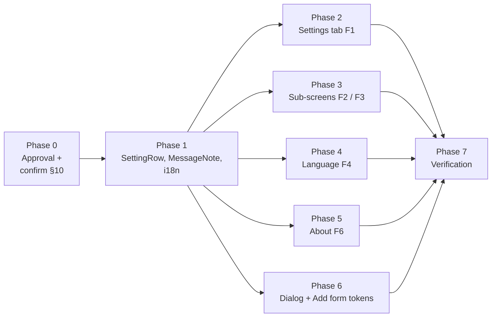

# Feature Design Document

## Feature: Mobile Redesign — Settings Screens

**Task ID**: APP-487
**Author**: Mobile developer
**Date**: 2026-09-29
**Status**: Implemented and committed on `feature/487-redesigns-settings` (2026-09-30): lint, prettier and jest pass (§9). Device check in light, dark and auto still pending (Phase 7).

---

## 1. Context & Problem Statement

```
Currently:
- pages/Settings.js (the Settings tab) is a flat list of title + description rows split by
  8px dividers. Some colors are hardcoded (#f9fafb dividers, #000 chevrons, #666 subtitles)
  and others come from useTheme, so the screen is half-themed and looks wrong in dark mode.
- The Settings tab has no working way to change the language. Its dialog is mounted, but
  `showLang` starts false and nothing sets it to true.
- "Appearance" and its values (Auto / Light / Dark) are hardcoded in English.
- pages/Settings/SettingsForm.js (Advanced / Geolocation / Image Quality) shows each value
  as a subtitle under the label, with hardcoded #ddd borders and #666 text and a
  default-colored RNEUI Switch.
- pages/Settings/DialogForm.js (the edit dialog) uses #2089dc for the slider and an
  unthemed Input and Dropdown, so its text is unreadable in dark mode.
- pages/Settings/AddNewForm.js uses 'red' for errors and an unthemed Input and Button.
- pages/About/About.js is hardcoded (#ddd, #666, #0434FF, #fff) and shows only the app
  name and version.
- The Reset action (components/LogoutButton.js) is a plain row; the design shows it as a
  red note card.

Goal:
- The Settings tab and every screen it opens match the Figma frames F1–F4 and F6 and use
  tokens from app/src/lib/theme.js, in light, dark and auto.
- Every new string has EN and FR text in lib/i18n/ui-text.js.
- No behaviour is lost: editing, toggles, reset, Add form, Appearance, About and the
  update check keep working, and Language works again.
```

**User story**: As a user, I see the Settings screens in the new design, in dark and light themes, and I can change every setting I could change before, including the language.

### Where each element lives today

| Element | Screen / component | Styling today |
|---|---|---|
| Settings tab list | `pages/Settings.js` (not inside `pages/Settings/`) | Mixed hardcoded / tokens |
| Reset row | `components/LogoutButton.js` | Tokens, old layout |
| Advanced / Geolocation / Image Quality | `pages/Settings/SettingsForm.js`, driven by `pages/Settings/config.js` | Hardcoded |
| Edit dialog (input, dropdown, slider) | `pages/Settings/DialogForm.js` inside `ConfirmDialog` | Hardcoded / unthemed |
| Language picker | `DialogForm` with `langConfig`, mounted in `pages/Settings.js` but never opened | Unthemed |
| Add form screen | `pages/Settings/AddNewForm.js` | Unthemed |
| About | `pages/About/About.js` | Hardcoded |
| Setting row | `components/SettingRow.js` (APP-481, chevron only) | Tokens |

---

## 2. Requirements

All colors are tokens from `app/src/lib/theme.js`, read through `useTheme()`. Values are listed dark / light where it matters. Type is Inter, as elsewhere in the redesign.

### User Acceptance Criteria

**Shared: section title** (Figma "Synchronization Container")
- [ ] 18 / w500 / line height 26 / letter-spacing −0.04 / `topNav.text`; padding 8 vertical, 16 horizontal; 8px bottom padding under each section's rows

**Shared: Setting Row** (Figma component `6226:1039`, variants Value / Toggle / Chevron / Accuracy; the code calls the Accuracy variant `level`, since Image Quality uses it too)
- [ ] Row: 1px bottom border `border.divider`, 12px gap, padding 8 top / 10 bottom. Height is 55 when the row has an icon box or no description, and 61 when it has a description and no icon box (Figma fixed heights, implemented as `minHeight`)
- [ ] Optional icon box: `input.bg`, radius 8, padding 8, 20px icon in `icon.accent`
- [ ] Text: label 16 / w500 / line height 24 / `text.primary`; optional description 12 / w400 / line height 16 / `text.tertiary`, 2px under the label, wrapping (F6's first row wraps to two lines)
- [ ] Control, one per row, or none (F6's first row):
  - **Chevron**: 20px `chevron-forward` in `bottomNav.deselected` (APP-481 D-1)
  - **Value**: 14 / w400 / line height 20 / `text.secondary`, one line, at most half the row, truncated with an ellipsis (Figma: "majuro-water…")
  - **Toggle**: switch, on-track `buttonPrimary.bg`, off-track `border.divider`, thumb `buttonPrimary.text` (A7)
  - **Level** (`control="level"`, any level value): chip, `bg.surfacePrimary`, radius 14, padding 10 horizontal / 4 vertical, 4px gap; 14px `LevelIcon`, then the level label 12 / w500 / line height 16 / `text.primary`

**Shared: Message Note** (Figma "Message Note", in F1, F2, F3 and F4)
- [ ] Card `bg.surfaceElevated3`, radius 16 (`radius.lg`), padding 12, 8px gap, full width inside 16px screen padding, 8px vertical margin
- [ ] 24px icon, then text 12 / w500 / line height 16 / letter-spacing 0.04
- [ ] Two tones: **info** (icon `information-circle` in `icon.accent`, text `text.secondary`) and **danger** (icon `refresh` and text both `input.errorText`: `#FF2C20` / `#C8170D`)
- [ ] Text comes in as `lines` (one `Text` per line, e.g. the reset title and description); with `onPress` the whole card is the touch target

**F1 · Settings tab** (Figma node `6499:17898`)
- [ ] Section **Application**, chevron rows with an icon box and a label (no description), in this order:
  1. Advanced Settings (`settings-outline`) → `SettingsForm` id 1
  2. Geolocation Settings (`map-outline`) → `SettingsForm` id 2
  3. Image Quality (`camera-outline`) → `SettingsForm` id 3
  4. Add Form (`add-circle-outline`) → `AddNewForm`; hidden for `code_assignment` logins, as today (A2)
  5. Language (`language-outline`) → the new Language screen (F4)
  6. Appearance (`contrast-outline`) → cycles Auto / Light / Dark as today; its description shows the current mode, translated (A2)
  7. About (`help-circle-outline`) → About (F6)
- [ ] Figma's **Account** row is not built (A3)
- [ ] Section **Data reset** with a danger Message Note: "Reset (clear all data)" on the first line, "Erases every local user, form and datapoint — including unsynced work" on the second. Tapping it opens the existing reset `ConfirmDialog` (`LogoutButton`), unchanged
- [ ] The screen scrolls when the list is taller than the viewport

**F2 · Advanced Settings** (Figma node `6499:17489`)
- [ ] Section **Server**: Server URL (Value), Passcode (Value). Both read-only, as today
- [ ] Section **Synchronization**: Sync Interval (description "How often submissions are sent", Value `{n} s`, tap opens the edit dialog); Sync Wi-Fi (description "Only sync when connected to Wi-Fi", Toggle)
- [ ] Info Message Note under the sections: "Treat this screen as sensitive. Anyone with your passcode can submit data as you, from any device."
- [ ] No icon boxes on sub-screen rows

**F3 · Geolocation Settings** (Figma node `6499:17576`)
- [ ] One section, titled **Location** (A5): GPS threshold (Value `{n} m`), Accuracy level (level chip with the level label), Geolocation timeout (Value `{n} s`). All three open the edit dialog, as today
- [ ] Rows show the config description when one exists (A6)
- [ ] No Message Note (A5)

**F4 · Language** (Figma node `6499:17716`)
- [ ] A new stack screen, `Language`, titled "Language" / "Langue"
- [ ] Two rows, **English** and **Français** (each language's own name), no others. Each row is 56 tall, padding 8 vertical / 16 horizontal, 16px gap; label 16 / w400 / line height 24 / letter-spacing 0.5 / `text.primary`
- [ ] Trailing checkbox, 18px, radius 2, in a 40px touch area: checked = `buttonPrimary.bg` fill with a 16px `checkmark` in `buttonPrimary.text`; unchecked = 2px border `icon.secondary` (A12)
- [ ] 1px `border.divider` under each row, inset 16px on both sides
- [ ] The rows come from `langConfig.options` (its French label becomes "Français"; the in-form language menu reads the same list)
- [ ] Tapping a row selects that language at once (single choice, no OK button). As the dialog did, it sets both `UIState.lang` (interface) and `FormState.lang` (question text), and saves `lang` to config (A13)
- [ ] Info Message Note, reworded from Figma to match the app's behaviour (A13): "Switching the language also changes question text when the form has a translation. Forms without one stay in their original language."

**F6 · About** (Figma node `6499:17812`; only the current content, A14)
- [ ] Rows, no section title, no icon boxes:
  1. `About {apkName}` with `aboutAppDescription` as the description, no control. The description is reworded to describe the generic Akvo MIS app instead of one deployment (§6)
  2. App version: Value `appVersion`
- [ ] "Check app update" (Figma node `6499:17856`): a bottom bar pinned to the screen bottom, padding 8 top / 16 bottom / 16 horizontal; full-width ghost button (no fill, radius 16, padding 16 vertical / 24 horizontal, 8px gap): 24px `refresh` icon and label 16 / w700 / line height 24, both `buttonGhost.color`; `buttonGhost.colorDisabled` when offline (A15)
- [ ] The button runs the existing `useVersionCheck` flow and dialog, unchanged; `update-button` testID kept

**Level icon** (accuracy level and image quality)
- [ ] One `LevelIcon` for every level option: MaterialCommunityIcons `signal-cellular-1` (low), `signal-cellular-2` (medium), `signal-cellular-3` (high), 14px in the row chip and 20px in the dropdown, color `status.success` (A8)
- [ ] Tiers: accuracy Lowest / Low → low, Balanced → medium, High / Highest → high; image quality Low → low, Medium → medium, High / Original → high
- [ ] Shown in the Setting Row's level chip (Geolocation's Accuracy level, Image Quality's Compression Level), in front of each option in the edit dialog's dropdown, and in front of the dropdown's selected value

**Image Quality sub-screen** (no frame, A9)
- [ ] Same rules as F2/F3: section **Photos**; Compression Level (level chip with the level label, opens the dropdown dialog), Save photos to gallery (description, Toggle)

**Edit dialog and Add form** (no frames; tokens only, layout unchanged, A9)
- [ ] `DialogForm`: slider track, thumb and icon `buttonPrimary.bg`; Input text `input.textInput`, underline `input.border`, placeholder `input.text`; Dropdown box `input.bg` with `input.border`, radius 8, selected text `input.textInput`, placeholder `input.text`, list `bg.surfaceElevated1`, items `text.primary`, active item `bg.surfaceChip`; description `text.secondary`
- [ ] `AddNewForm`: Input as above; button `buttonPrimary.bg` / `buttonPrimary.text`; error text `input.errorText` (was `'red'`); loading text `text.secondary`

**Behaviour preserved**
- [ ] Editing a number or dropdown setting still saves to the store and to SQLite (`crudConfig.updateConfig`)
- [ ] Toggles still store 0 / 1 and save to SQLite
- [ ] Reset still clears every table and returns to Get Started
- [ ] The update check still works from About
- [ ] Switching theme re-renders every Settings screen without reopening it

### Technical Acceptance Criteria
- [ ] No hex literals or named colors in the touched files; a search for `#[0-9a-fA-F]{3,6}` and `'red'` / `'#fff'` returns nothing
- [ ] New visible text has EN and FR keys in `lib/i18n/ui-text.js` (§6). Field labels and descriptions stay in `config.js`'s own `translations` (D-2)
- [ ] `SettingRow` stays backward compatible: with no `control` prop it renders the chevron, so FormOptions' "View details" row keeps working
- [ ] Passes the app's Airbnb ESLint config (no prop spreading, no nested ternaries, no `for…of`) and Prettier
- [ ] Existing testIDs are kept: `goto-settings-form-${i}`, `add-more-forms`, `dark-mode-toggle`, `list-item-logout`, `dialog-confirm-logout`, `settings-form-item-${i}`, `settings-form-switch-${i}`, `settings-form-dialog*`, `input-form-id`, `button-download-form`, `fetch-error-text`, `update-button`. New: `settings-language`, `settings-about`, `settings-section-${key}`, `settings-note`, `language-option-${value}`, `level-icon-${tier}`

---

## 3. Data Model Changes

**No schema or query changes.**

`pages/Settings/config.js` is static UI config, not stored data. Its changes:

| Change | Reason |
|---|---|
| Page names: "Advanced" → "Advanced Settings", "Geolocation" → "Geolocation Settings" (+ FR) | Figma F1/F2/F3 titles |
| Each page gets `icon` (`settings-outline` / `map-outline` / `camera-outline`) | F1 icon boxes |
| Each field gets `group`, the `ui-text` key of its section title (`settingsSectionServer` / `settingsSectionSync` / `settingsSectionLocation` / `settingsSectionPhotos`) | Section titles |
| Level fields get `levelKind` (`accuracy` for `gpsAccuracyLevel`, `imageQuality` for `imageQuality`) | Level chip and dropdown icons (A8) |
| Numeric fields get `unit` (`s` / `m`) | Figma shows `3600 s`; the old descriptions carried the unit |
| Advanced gets `note: 'settingsSensitiveNote'` (an i18n key) | F2 Message Note |
| Copy: "Sync interval" → "Sync Interval", description "How often submissions are sent"; "Sync Wifi" → "Sync Wi-Fi", description "Only sync when connected to Wi-Fi"; "Geolocation Timeout" → "Geolocation timeout" (+ FR) | Figma F2 / F3 |
| Remove each page's top-level `description` | Only the old Settings list read it; F1 rows have no description |
| `langConfig`: keep it, and change the French label from "French" to "Français" | `form/support/SaveDropdownMenu.js` (the in-form language menu) imports it, and F4 reads its options |

---

## 4. API Contract

No backend or API changes. This is a mobile change only.

---

## 5. Decision Log

### D-1: Extend `SettingRow` instead of adding a second row component

**Options Considered**:
1. Extend `components/SettingRow.js` with a `control` prop (`chevron` default, `value`, `toggle`, `level`, `none`) and an optional `icon`.
2. Keep `SettingRow` for chevron rows and write separate rows inside `SettingsForm.js` and `About.js`.

**Decision**: Option 1.

**Rationale**: Figma models all of them as variants of one component (`6226:1039`), and F2, F3 and F6 all use it. One component keeps padding, border and type in one place, and maps 1:1 to Figma for a later Code Connect.

**Impact**: `SettingRow` gains props; the chevron default keeps FormOptions unchanged. Its padding moves from 12 / 12 to 8 / 10 per Figma, which makes FormOptions' "View details" row 4px shorter. It is the same Figma component, so this is a correction.

### D-2: Where the translations live

**Options Considered**:
1. Move every Settings string, including field labels and descriptions, into `ui-text.js`.
2. New screen-level strings (section titles, notes, reset copy, Appearance, About rows, Language) go into `ui-text.js`; field labels and descriptions stay in `config.js`'s `translations`, which `i18n.transform` already reads.

**Decision**: Option 2.

**Rationale**: `config.js` already translates the fields, and its entries also drive the edit dialog. Moving them means rewriting the `i18n.transform` lookups in three files and changes nothing on screen.

**Impact**: Copy stays in two places, as today. §6 lists the new `ui-text.js` keys.

### D-3: `MessageNote` as a shared component

**Options Considered**:
1. Inline the card in each screen (reset in `LogoutButton`, info notes in `SettingsForm` and Language).
2. A `components/MessageNote.js` with `tone` (`info` / `danger`), `icon`, `lines` and an optional `onPress`.

**Decision**: Option 2.

**Rationale**: Figma uses one "Message Note" component in four frames, and the tone is its only variation.

**Impact**: `LogoutButton`'s trigger becomes a danger `MessageNote`; its dialog and reset logic are unchanged.

### D-4: Language as a screen, not a dialog

**Options Considered**:
1. Keep the `DialogForm` dropdown and only fix the dead trigger.
2. A new stack screen per F4.

**Decision**: Option 2.

**Rationale**: F4 is a full screen. With two languages, a list with checkboxes needs one tap where the dropdown dialog needed three (open, pick, OK).

**Impact**: New `pages/Settings/Language.js`, registered as `Language` in `navigation/index.js`. `pages/Settings.js` no longer mounts `DialogForm` or keeps dialog state. `langConfig` and `DialogForm`'s dropdown mode stay, because the in-form language menu (`SaveDropdownMenu`) still uses both.

---

## 6. Type/Constant Mappings

New `ui-text.js` keys (EN / FR):

| Key | EN | FR |
|---|---|---|
| `settingsApplication` | Application | Application |
| `settingsDataReset` | Data reset | Réinitialisation des données |
| `settingsResetTitle` | Reset (clear all data) | Réinitialiser (effacer toutes les données) |
| `settingsResetDesc` | Erases every local user, form and datapoint — including unsynced work | Efface tous les utilisateurs, formulaires et points de données locaux — y compris le travail non synchronisé |
| `settingsSectionServer` | Server | Serveur |
| `settingsSectionSync` | Synchronization | Synchronisation |
| `settingsSectionLocation` | Location | Localisation |
| `settingsSectionPhotos` | Photos | Photos |
| `settingsSensitiveNote` | Treat this screen as sensitive. Anyone with your passcode can submit data as you, from any device. | Considérez cet écran comme sensible. Toute personne disposant de votre code d'accès peut soumettre des données en votre nom, depuis n'importe quel appareil. |
| `appearance` | Appearance | Apparence |
| `appearanceAuto` | Auto | Automatique |
| `appearanceLight` | Light | Clair |
| `appearanceDark` | Dark | Sombre |
| `languageNote` | Switching the language also changes question text when the form has a translation. Forms without one stay in their original language. | Changer la langue modifie aussi le texte des questions lorsque le formulaire est traduit. Les formulaires sans traduction restent dans leur langue d'origine. |
| `checkAppUpdate` | Check app update | Vérifier les mises à jour |

Changed key: `aboutAppDescription` described one deployment (the Fiji DWS DataPro). It now describes the generic app: EN "Akvo MIS helps teams collect, sync and monitor field data, online or offline.", FR "Akvo MIS aide les équipes à collecter, synchroniser et suivre les données de terrain, en ligne ou hors ligne."

Reused keys: `langTitle` (Language / Langue), `about`, `appVersionLabel`, `settingAddFormTitle`, `settingsPageTitle`. Removed: `updateApp`, whose only caller was the old About button.

Language names are not translated: `English`, `Français`, each in its own language.

Icons (Ionicons, the app's icon set; A4):

| Figma asset | Ionicons |
|---|---|
| `outline/settings` | `settings-outline` |
| `iconset/map` | `map-outline` |
| `outline/photo-camera` | `camera-outline` |
| `iconset/placeholder` (Language) | `language-outline` |
| `outline/question` | `help-circle-outline` |
| `iconset/chevron-right` | `chevron-forward` |
| `iconset/rotate` (reset note, update button) | `refresh` |
| Message Note info icon | `information-circle` |
| `ChartBar` (level) | MaterialCommunityIcons `signal-cellular-1` / `-2` / `-3` |
| `check_small` | `checkmark` |
| — (Add Form row, not in F1) | `add-circle-outline` |
| — (Appearance row, not in F1) | `contrast-outline` |

---

## 7. Compatibility & Migration

### Backward Compatibility
- [x] No API consumers affected (mobile UI only)
- [x] Existing data preserved (no schema change; stored settings keep their keys and values)
- [x] CLI tools unaffected

### Mobile App Impact
- [x] Sync endpoints affected: none
- [x] SQLite schema changes: no
- [x] Version detection: not needed; ships with the next app release

### Seeder/CLI Compatibility
- [x] Not applicable

---

## 8. Security Considerations

- [x] No permission changes
- [x] No new input paths; the edit dialog keeps its input types, and Language only offers the two supported values
- [x] The passcode stays visible on Advanced Settings, as today and as in Figma; the new note tells users to treat the screen as sensitive

---

## 9. Testing Strategy

| Test Type | Coverage (as built) |
|---|---|
| Unit | `components/__tests__/SettingRow.test.js` (new): `getLevelTier` for every accuracy and image-quality value; value row colors, level chip icon, toggle passing a boolean, and the danger `MessageNote` color and press, under `darkModePreference` `dark` and `light` |
| Unit | `components/__tests__/LogoutButton.test.js`: the trigger shows the reset title; dialog tests unchanged |
| Integration | `pages/__tests__/Settings.test.js`: navigation passes `name: 'Advanced Settings'`; the Language row navigates to `Language`; Add form gate unchanged; snapshot |
| Integration | `pages/Settings/__tests__/Language.test.js` (new): the active language is checked; tapping Français sets `UIState.lang` and `FormState.lang` and saves `lang` to config |
| Integration | `pages/Settings/__tests__/SettingsForm.test.js` (rewritten): Advanced renders its fields under Server / Synchronization with the note; Geolocation shows Location and no note; editing Sync Interval updates the store and calls `crudConfig.updateConfig` |
| Integration | `DialogForm.test.js`, `AddNewForm.test.js`: behaviour unchanged; AddNewForm snapshot updated |
| Not written | `MessageNote` beyond the danger case, Appearance cycling, and an About page test |
| Manual (device) | Still to do: all Settings screens, the edit dialog and Add form, in light, dark and auto; switch theme with each screen open; change language both ways and restart the app; reset flow end to end |

Notes:
- The Settings page tests used to fail before any assertion ran: their import chain reaches `expo-task-manager`, which jest-expo can't load. They now stub `lib/background-task`, as APP-481's page tests do. Unblocked, two stale tests surfaced: `SettingsForm.test.js` asserted on a `mockDb` the component never receives, so it was rewritten; and the Settings and AddNewForm snapshots used `react-test-renderer`'s `create()`, which returns `null` under React 19, so they now use `render().toJSON()`.
- Result: the touched suites pass; the four suites that already failed (Stack, PageTitle, BaseLayout, StatusBanner) still fail. In the full suite, the 19 suites failing for reasons other than `ExpoTaskManager` fail exactly as they do on HEAD.
- `pages/__tests__/__snapshots__/FormData.test.js.snap` is obsolete (its test file is gone) and `jest -u` deletes it; it is left in place, as it is outside this change.

Run jest in the mobile container (`./dc-mobile.sh exec mobileapp npx jest`). The known failures on a missing `ExpoTaskManager` mock were already failing before this work.

---

## 10. Open Questions — Answered

All answered on 2026-09-29. **Basis**: *Figma* (the inspected nodes), *code* (current behaviour), *user* (the product owner's answer), or *default* (proposed here and accepted with the scope answer: "keep the current list plus Language, change the theme colors, proper icons, level icons, and the Figma positions and copy").

| # | Question | Answer | Basis |
|---|---|---|---|
| A1 | Is there a Language frame? | **Yes, F4 (`6499:17716`)**, English and French only. Built as a screen (D-4). | User + Figma |
| A2 | Appearance and Add Form are not in F1. Keep them? | **Keep the current list plus Language.** Add Form goes after Image Quality and Appearance after Language, both as chevron rows with icon boxes. | User |
| A3 | F1 has an **Account** row. | **Not built.** No account settings. | User |
| A4 | Figma icons are SVGs. | Ionicons equivalents (§6), because the app has no SVG renderer (APP-481 A25). The level icon is MaterialCommunityIcons, the only installed set with graded bars. | Prior decision + user ("proper icons") |
| A5 | F3's section is titled "Server", its first row reads "Server URL" with value 30, and it repeats F2's passcode note. These look copied from F2. | Section **Location**, first row **GPS threshold** (the field that exists), **no** note. | Default |
| A6 | F2 shows descriptions on Sync rows; F3 hides them. | Show a row's description whenever `config.js` has one, on every sub-screen. Units move into the value (`60 s`). | Default |
| A7 | The Figma toggle is 52×32. | React Native `Switch` with token colors; the platform sets its size. | Default |
| A8 | How are level options shown? | **One graded level icon (low / medium / high) wherever a level appears**: the accuracy and image-quality chips and their dropdown options. One color, `status.success`; the bar count carries the level. | User + default (color) |
| A9 | Image Quality, the edit dialog and Add Form have no frames. | Image Quality follows the F2/F3 rules (section **Photos**). The dialog and Add Form get tokens only; their layout is unchanged. | User |
| A10 | The frames' headers differ from `PageTitle`. | **Out of scope.** `PageTitle` is shared by every screen, so restyle it in its own ticket. | Default |
| A11 | Frame background is `bg.surfaceTertiary`; `BaseLayout` uses `bg.surfacePrimary`. | Keep `bg.surfacePrimary`: in dark, `surfaceTertiary` would sit under a `#000` header with a visible seam, and no dark frame was provided. | Default |
| A12 | F4's unchecked checkbox uses Material's `#49454F`, which is not a theme token. | `icon.secondary`. | Default |
| A13 | F4's note says the language changes "the application interface only". Is that right? | **No; the note is reworded (§6 `languageNote`) and the behaviour is kept.** Forms carry `translations` on the form, question groups, questions and options (`backend/api/v1/v1_forms/models.py`, served by `v1_forms/serializers.py`). The mobile `transformForm` (`form/lib/index.js`) renders them in `FormState.lang`, and the Settings language change sets that store as well as `UIState.lang`. The web `Webform` does the same: akvo-react-form's `translateForm` (`src/lib/index.js`) replaces the form, group, question, option, tooltip and extra text with the entry whose `translations[].language` matches `lang`. Both fall back to the base text when a form has no translation. Design follow-up: update the F4 note. | User + code |
| A14 | F6 shows forms, datapoints and last-sync stats. Build them? | **No.** About keeps its current content (app name and description, version) in the new rows. | User |
| A15 | F6's update button. | "Check app update" (Figma node `6499:17856`), running the existing version check. | User |

---

## 11. References

- Theme tokens: `app/src/lib/theme.js`
- Related: APP-474 (form fields on tokens), APP-477 (`ConfirmDialog`), APP-481 (`SettingRow`, `SectionLabel`; `doc/design/APP-481-mobile-cards-list-items.md`)
- Figma file `MIS-app` (`6iJSUHoHOXEdhY0xuP1MGv`), inspected 2026-09-29, light mode only:
  - `6499:17898` F1 · Settings: "Application" section with six chevron rows (icon box, label only, 55px), "Data reset" section with a danger Message Note
  - `6226:1039` Setting Row component set: Value / Toggle / Chevron / Accuracy variants, 61px default height, optional icon box and description
  - `6499:17489` F2 · Advanced Settings: Server (URL, Passcode), Synchronization (Sync Interval, Sync Wi-Fi), info Message Note
  - `6499:17576` F3 · Geolocation Settings: one section, three rows (see A5), same info note
  - `6499:17716` F4 · Language: English / Français with checkboxes, info Message Note
  - `6499:17812` F6 · About: About row with description, App version, three stats, ghost "Update available" button pinned to the bottom
  - F5 was not shared.
  - Every variable maps to a `theme.js` token (`text color/primary` → `text.primary`, `border color/divider` → `border.divider`, `text-field/text-field-background-color` → `input.bg`, `text-field/error-field-text-color` → `input.errorText`, `background/surface-elevated-3` → `bg.surfaceElevated3`, `button-ghost/button-ghost-default-color` → `buttonGhost.color`, `brand/purple-500` → `buttonPrimary.bg`), and the light values match.

---

## 12. Implementation Plan



### Phase 0: Approval gate
- Done: §10 answered 2026-09-29.

### Phase 1: Shared primitives and i18n
| File | Change |
|---|---|
| `app/src/components/SettingRow.js` | `icon` optional; `control` (`chevron` default / `value` / `toggle` / `level` / `none`) with `value`, `level`, `onValueChange`; padding 8 / 10; `minHeight` per §2 (D-1) |
| `app/src/components/SettingSection.js` (new) | Section title (§2) over 16px-padded rows; used by the Settings tab, its sub-screens and About |
| `app/src/components/MessageNote.js` (new) | `tone`, `icon`, `lines`, `onPress` (D-3) |
| `app/src/components/LevelIcon.js` (new) | `level` + `kind` (`accuracy` / `imageQuality`) → tier → `signal-cellular-{1,2,3}` (A8); `getLevelTier` exported for tests |
| `app/src/components/index.js` | Export `MessageNote`, `LevelIcon`, `SettingSection` |
| `app/src/lib/i18n/ui-text.js` | EN and FR keys from §6 |

### Phase 2: Settings tab (F1)
| File | Change |
|---|---|
| `app/src/pages/Settings.js` | `ScrollView` with two `SettingSection`s and `SettingRow` chevron rows (A2 order, §6 icons); Language row navigates to `Language`; Appearance translated; remove `DialogForm`, the language dialog state, the hardcoded colors and the `Divider`s |
| `app/src/components/LogoutButton.js` | Trigger becomes a danger `MessageNote` with the reset title and description; keep `list-item-logout` and the dialog |

### Phase 3: Sub-screens (F2, F3, Image Quality)
| File | Change |
|---|---|
| `app/src/pages/Settings/config.js` | §3 changes: names, `group`, `unit`, `note`, copy; remove top-level `description`; `langConfig` French label → "Français" |
| `app/src/pages/Settings/SettingsForm.js` | Group fields by `group` under section titles; rows via `SettingRow` (switch → `toggle`, fields with `levelKind` → `level`, otherwise `value` with unit); info note when the page has `note`; remove the hardcoded colors |

### Phase 4: Language (F4, D-4)
| File | Change |
|---|---|
| `app/src/pages/Settings/Language.js` (new) | Checkbox rows from `langConfig.options` and the info note; tapping writes `UIState.lang` and `FormState.lang` as today (A13) and saves `lang` with `crudConfig.updateConfig` |
| `app/App.js` | Restore `lang` from the config table at startup. The column existed but was never written or read, so the language reset to English on every launch |
| `app/src/pages/index.js`, `app/src/navigation/index.js` | Export and register the `Language` stack screen |

### Phase 5: About (F6)
| File | Change |
|---|---|
| `app/src/pages/About/About.js` | Two `SettingRow` rows per §2; pinned ghost "Check app update" button (A15); remove the hardcoded colors |
| `app/src/lib/i18n/ui-text.js` | Generic `aboutAppDescription` (§6); remove `updateApp` |

### Phase 6: Dialog and Add form tokens
| File | Change |
|---|---|
| `app/src/pages/Settings/DialogForm.js` | Token colors per §2; remove `#2089dc`; `LevelIcon` in the dropdown for fields with `levelKind` |
| `app/src/pages/Settings/AddNewForm.js` | Token colors per §2; remove `'red'` |

### Phase 7: Verification
1. `./dc-mobile.sh exec mobileapp npm run lint` and `npm run prettier-check`.
2. `./dc-mobile.sh exec mobileapp npx jest`; update snapshots only where the change is intended.
3. Search the touched files for `#[0-9a-fA-F]{3,6}`, `'red'` and `'#fff'`.
4. Manual device check in light, dark and auto, reported with screenshots for approval.
5. Committed on request before the device check (2026-09-30); the device check is still to be done. Do not push without explicit confirmation.

---

## Approval

| Role | Name | Date | Status |
|------|------|------|--------|
| Developer | | | |
| Tech Lead | | | |
| Product | | | |
