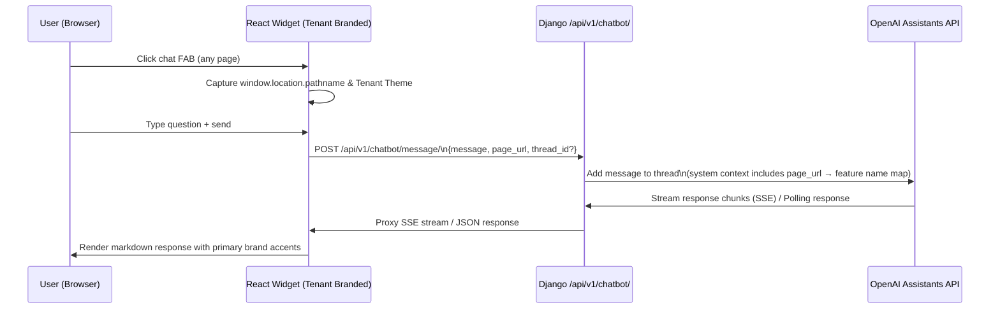

# AI Chatbot Knowledge Base — Feature Specification

**Feature ID**: CHATBOT-001
**Branch**: `feat/ai-chatbot-planning`
**Status**: Draft — Pending Manager Review
**Estimation Mode**: Vibe coding + manual test

---

## Overview

Build an in-app AI chatbot widget powered by **OpenAI Assistants API + Vector Store** that helps platform users navigate Akvo MIS features. The bot reads the current page URL to infer context, answers natural-language questions grounded in the platform's knowledge base, dynamically inherits tenant branding (colors & style), and floats over every authenticated page in the React frontend.

---

## 5W1H Analysis

| Dimension | Detail |
|-----------|--------|
| **Who** | Authenticated end-users of any Akvo MIS tenant (all roles) |
| **What** | Floating chat widget, backend proxy, one-shot PDF ingestion script |
| **Where** | Frontend: global overlay component with dynamic tenant branding. Backend: new Django app `api.v1.v1_chatbot` |
| **When** | Triggered by user clicking the chat FAB; KB PDF built once at deploy and re-uploaded when docs are updated |
| **Why** | Lower support friction during onboarding; users struggle to find relevant docs while inside complex pages (Form Builder, Approvals, etc.) |
| **How** | 1) Sphinx builds a single PDF from all RST docs. 2) Script uploads PDF to OpenAI Vector Store. 3) Chat message + `page_url` → backend injects page context into prompt → OpenAI Assistants thread → response |

---

## Architecture Overview



### URL → Feature Context (Backend)

The backend **derives** a human-readable context label directly from the URL path segments — no hardcoded map needed. New pages are automatically covered as long as their route follows the standard kebab-case naming convention already used in [App.js](/frontend/src/App.js).

| URL example | Derived context label |
|-------------|----------------------|
| `/control-center/form-builder/42/edit` | `Form Builder — Edit` |
| `/control-center/master-data/administration` | `Master Data — Administration` |
| `/control-center/approvals` | `Approvals` |
| `/control-center/users/add` | `Users — Add` |
| `/control-center/mobile-assignment` | `Mobile Assignment` |
| `/data` | `General Platform` |

---

## Phase 1 — Knowledge Base: PDF-Based Ingestion

**Goal**: Build and upload a single, consolidated PDF of the full Akvo MIS documentation to an OpenAI Vector Store.

### Format Decision: PDF vs Markdown Files

> [!IMPORTANT]
> **Decision: Use PDF.** Analysis below.

| Criterion | PDF (Sphinx `latexpdf` / WeasyPrint) | Multiple `.md` files |
|-----------|--------------------------------------|----------------------|
| **Source of truth** | Sphinx already generates a single structured document from all RST files — it is the canonical output. | Requires writing a custom RST parser to extract and clean content from 17+ individual files. |
| **Maintenance overhead** | Zero — regenerate PDF after any doc update with one command. No custom pipeline to maintain. | High — every RST directive, image ref, and role needs stripping; brittle against RST syntax changes. |
| **Upload complexity** | Single file upload to OpenAI Files API. | N files × upload + chunk management; file limits must be tracked. |
| **OpenAI Vector Store support** | ✅ PDF is a natively supported file type for file-search. Parsed automatically. | ✅ `.md` is also supported, but requires our own chunking and cleaning logic first. |
| **Coverage** | Complete — the PDF includes the table of contents, cross-references, and all pages in reading order. | Risk of missing content if RST conversion is incomplete or a file is skipped. |
| **Supplementary docs** | Additional PDFs (e.g. `akvo-react-form-editor` guide generated from RTD) can be uploaded alongside. | Additional `.md` files can also be added, but the same stripping problem applies. |
| **When to reconsider MD** | Only if chunking strategy or per-section metadata becomes critical (future, with admin panel). | — |

**Conclusion**: Use PDF for the initial implementation. It requires zero custom parsing, one upload step, and Sphinx already builds it. A future admin panel can revisit fine-grained chunk strategies if needed.

### Supplementary PDFs

To cover the Form Editor gap (noted in previous review), two supplementary PDFs are included:

| PDF | Content | Source |
|-----|---------|--------|
| `akvo-mis-docs.pdf` | Full platform documentation (all RST pages) | `make latexpdf` in `docs/` |
| `akvo-react-form-editor-docs.pdf` | Form Editor usage: question groups, question settings, skip logic, cascade setup, translations, preview | `akvo-react-form-editor` ReadTheDocs (`readthedocs.io/en/latest/`) — downloadable as PDF via RTD |

#### Why Two PDFs? — Form Editor & Runtime Knowledge Scope

> [!NOTE]
> The Akvo MIS Sphinx docs (`docs/source/*.rst`) cover the platform at a high level but **do not include** the detailed `akvo-react-form-editor` usage (the Form Builder UI component) or `akvo-react-form` runtime behaviour. The supplementary PDF closes this gap.

The Form Editor PDF should cover the following scope so the chatbot can answer granular Form Builder questions:

| Topic | What it covers |
|-------|---------------|
| **Editor Layout & Tabs** | Edit Form tab, Translations tab, Preview tab (rendered with `akvo-react-form`), JSON tab |
| **Question Groups** | Creating a new group, inserting via **INSERT GROUP**, ordering/reordering, configuring **repeatable groups** |
| **Question Settings** | Label, variable name, tooltip, required flag, double entry validation, min/max value bounds, field prefix/suffix |
| **Skip Logic & Dependencies** | Single and multi-question conditions (equals, not equals, greater/less than, in list); dependency chain behaviour |
| **Question Types (all 16)** | `input`, `number`, `text`, `date`, `option`, `multiple_option`, `cascade`, `tree`, `table`, `autofield` (computed formulas), `geo`, `geotrace`, `geoshape`, `entity`, `signature`, `attachment` |
| **Cascade Setup** | How cascade dropdowns wire to tenant root administration endpoints (`settingCascadeURL`) |
| **Translations** | Adding languages, translating question labels, group headers, and option choices |
| **Form Lifecycle (Akvo MIS context)** | Registration vs Monitoring form distinction (`parent_id`), publish/unpublish versioning snapshots, role-based permissions (View, Create, Edit, Publish, Delete) |
| **Validation & Drafts** | Required field checks, draft autosave (`saveDatapoint`), submission format and export |

**Source references for this scope:**
- `akvo-react-form-editor` — [GitHub repo](https://github.com/akvo/akvo-react-form-editor) & [ReadTheDocs](https://akvo-react-form-editor.readthedocs.io/en/latest/)
- `akvo-react-form` — [GitHub repo](https://github.com/akvo/akvo-react-form)
- Akvo MIS frontend: `FormBuilderCreate.jsx`, `FormBuilderEdit.jsx`, `Forms.jsx`, `ManageDraftForm.jsx`


### Ingestion Script: `scripts/upload_kb.py`

Simple, dependency-light Python script (no Django required):

```python
# scripts/upload_kb.py
import os
from openai import OpenAI

client = OpenAI(api_key=os.environ["OPENAI_API_KEY"])

PDF_FILES = [
    "docs/build/latex/akvo-mis-docs.pdf",
    "docs/assets/akvo-react-form-editor-docs.pdf",
]

def upload_kb():
    # Create or retrieve vector store
    vs = client.vector_stores.create(name="akvo-mis-kb")
    print(f"Vector Store ID: {vs.id}")

    # Upload PDFs and attach to vector store
    file_streams = [open(p, "rb") for p in PDF_FILES]
    batch = client.vector_stores.file_batches.upload_and_poll(
        vector_store_id=vs.id,
        files=file_streams
    )
    print(f"Status: {batch.status} | Files: {batch.file_counts}")
    print(f"\nAdd to .env: OPENAI_VECTOR_STORE_ID={vs.id}")

if __name__ == "__main__":
    upload_kb()
```

**To run:**
```bash
# Step 1 — Build the PDF (requires latexpdf / pdflatex)
cd docs && make latexpdf

# Step 2 — Upload to vector store
OPENAI_API_KEY=sk-... python scripts/upload_kb.py
```

> **Note**: If `latexpdf` is not available in the current environment, `sphinx-build -b rinoh` (via `rinohtype`) or exporting from ReadTheDocs as PDF are valid alternatives requiring no local LaTeX install.

---

## Phase 2 — Backend: `api.v1.v1_chatbot`

### New Django App Structure

```
backend/api/v1/v1_chatbot/
├── __init__.py
├── apps.py
├── utils.py            # get_page_context() — dynamic URL context derivation
├── views.py            # ChatMessageView with SSE streaming / JSON
├── serializers.py      # ChatRequestSerializer
├── urls.py             # path("chatbot/", ...)
├── management/
│   └── commands/
│       └── upload_kb.py   # Django management command
└── tests/
    └── test_chatbot.py
```

### New API Endpoint

**`POST /api/v1/chatbot/message/`** — requires JWT authentication

**Request:**
```json
{
  "message": "How do I add a question group?",
  "page_url": "/form-builder/123/edit",
  "thread_id": "thread_abc123"
}
```
> `thread_id` is optional — omit to start a new conversation thread.

**Response (SSE stream):**
```
data: {"delta": "To add a question group, "}
data: {"delta": "click Insert group here..."}
data: {"thread_id": "thread_abc123", "done": true}
```

### Backend Logic Flow

1. Validate JWT → `request.user` (tenant-scoped via existing middleware)
2. Derive `context_label` from `page_url` via `get_page_context()` (no hardcoded map)
3. Create or reuse OpenAI thread (`thread_id` from request)
4. **Inject page context into the user message** (see full explanation below)
5. Run the Assistant with `vector_store_id` file-search tool attached
6. Return JSON response (or SSE stream depending on chosen approach)

### How Page/Endpoint Context Is Passed

> [!IMPORTANT]
> This is the core mechanism that makes the chatbot context-aware. It requires no changes to OpenAI's API — the page context is prepended to the user's message on the **backend** before it is sent to the thread.

#### Mechanism: Dynamic URL Derivation

Instead of a hardcoded `URL_CONTEXT_MAP` dict (which would need manual updates every time a new page is added to [App.js](/frontend/src/App.js)), the backend **derives** the context label from the URL path segments themselves.

The function lives in a dedicated utility module `backend/api/v1/v1_chatbot/utils.py`:

```python
# backend/api/v1/v1_chatbot/utils.py
import re


def get_page_context(page_url: str) -> str:
    """
    Derive a human-readable page label from a URL path.
    No hardcoded map — new routes are covered automatically.

    Examples:
        '/control-center/form-builder/42/edit' → 'Form Builder — Edit'
        '/control-center/master-data/administration' → 'Master Data — Administration'
        '/control-center/approvals' → 'Approvals'
        '/data' → 'General Platform'
    """
    # Strip query string and trailing slash
    path = page_url.split("?")[0].rstrip("/")

    # Drop known container prefix segments
    path = re.sub(r"^/(control-center|data)", "", path).lstrip("/")

    # Drop dynamic path parameter segments (pure integers or UUID-shaped strings)
    segments = [
        s for s in path.split("/")
        if s
        and not re.match(r"^\d+$", s)
        and not re.match(r"^[0-9a-f-]{36}$", s)
    ]

    # Titlecase each segment (kebab-case → Title Words)
    label_parts = [s.replace("-", " ").title() for s in segments]

    return " — ".join(label_parts) if label_parts else "General Platform"
```

When the frontend sends `{ "message": "What is the Add button?", "page_url": "/control-center/form-builder/123/edit" }`, the backend:

1. Calls `get_page_context("/control-center/form-builder/123/edit")` → `"Form Builder — Edit"`
2. **Prepends** this context label to the user's message before adding it to the OpenAI thread:

```python
# In the view (views.py):
from .utils import get_page_context

context_label = get_page_context(page_url)
augmented_message = (
    f"[Context: User is on the '{context_label}' page]\n\n"
    f"{user_message}"
)
# This augmented_message is what gets added to the OpenAI thread.
```

3. The OpenAI Assistant, with the PDF vector store attached, uses the context label to **bias its file-search retrieval** toward the relevant documentation section, and to **anchor its answer** to the correct feature.

#### Example End-to-End

| Step | Value |
|------|-------|
| User is on | `/control-center/form-builder/42/edit` |
| User types | `"What is the Add button?"` |
| Frontend sends | `{ "message": "What is the Add button?", "page_url": "/control-center/form-builder/42/edit", "thread_id": "thread_xyz" }` |
| Backend maps | `/form-builder` → `"Form Builder"` |
| Backend augments | `"[Context: User is on the 'Form Builder' page]\n\nWhat is the Add button?"` |
| OpenAI retrieves | Relevant sections from the Form Builder chapter of the PDF |
| Bot answers | *"In the Form Builder, the **Add New Question** button appears inside each question group. Click it to add a question, then configure its type, label, and settings in the panel that opens."* |

> **Why this works even for cross-feature questions**: If a user on the Form Builder page asks *"How do I invite a user?"*, the context label is still prepended, but the OpenAI file-search simply retrieves the most relevant content from the PDF — which is the Administration / User Management chapter. The context label helps for ambiguous questions but does not block answers about other features.

### New Environment Variables

```bash
OPENAI_API_KEY=sk-...
OPENAI_ASSISTANT_ID=asst_...
OPENAI_VECTOR_STORE_ID=vs_...
```

### Requirements additions (`backend/requirements.txt`)

```
openai>=1.30.0
gevent>=22.10.0   # required for SSE streaming with gunicorn
```

### Django settings additions (`mis/settings.py`)

```python
OPENAI_API_KEY = environ.get("OPENAI_API_KEY", "")
OPENAI_ASSISTANT_ID = environ.get("OPENAI_ASSISTANT_ID", "")
OPENAI_VECTOR_STORE_ID = environ.get("OPENAI_VECTOR_STORE_ID", "")
```

---

## Phase 3 — Frontend: Tenant-Branded Chatbot Widget

### Multi-Tenant Brand & Style Awareness

The floating chat widget dynamically binds to the active tenant's brand configuration:
- **FAB & header accents**: Uses tenant CSS variables (e.g. `var(--primary-color)`)
- **Header badge**: Displays the bot persona name alongside the tenant logo/style
- **Message bubbles**: Accent colors follow tenant primary palette

### Component Structure

```
frontend/src/components/chatbot/
├── ChatbotWidget.jsx       # FAB + collapsible panel (tenant branded)
├── ChatbotMessages.jsx     # Message list with markdown rendering
├── ChatbotInput.jsx        # Text input + send button
└── chatbot.scss            # CSS with CSS variable tenant overrides
```

### UX Design

| Element | Behaviour |
|---------|-----------|
| **FAB** | Bottom-right fixed button, chat icon, tenant primary color |
| **Panel** | 380×520px slide-up card above FAB, glassmorphism consistent with Ant Design theme |
| **Context chip** | Small pill: e.g. `📍 Form Builder` — updates as user navigates |
| **Streaming** | Text renders token-by-token as SSE arrives |
| **Thread persistence** | `thread_id` stored in `sessionStorage` — clears on tab/browser close |
| **Persona header** | Bot name (e.g. *Mira*) shown in panel header |

### State Management

Local React `useState` + `useRef` only — no Redux/global store changes needed.

### New npm dependency

```
react-markdown   # render bot responses as Markdown
```

---

## Open Questions for Manager & Stakeholder Review

---

### 1. 🔁 Response Mode: Streaming (SSE) vs Polling

> [!IMPORTANT]
> This decision affects infrastructure configuration and user experience.

| Approach | Pros | Cons |
|----------|------|------|
| **Streaming (SSE + gevent)** | • Text streams token-by-token — best UX.<br>• Feels instant, no blank wait screen. | • Requires `gunicorn --worker-class gevent` update.<br>• Slightly higher memory per active streaming connection. |
| **Polling / JSON** | • Works with existing standard Gunicorn setup.<br>• Simpler implementation, no worker change. | • User waits 3–6s for full response before seeing anything.<br>• Worse onboarding experience — users feel the system is slow. |

**Recommendation**: **Streaming** — adding `gevent` to `requirements.txt` is low risk and yields significantly better UX.

---

### 2. 🤖 Bot Persona (MIS-Contextual Options)

> [!TIP]
> Persona options are scoped to the **Monitoring Information System** context. Grouped by personality archetype to help pick the right fit.

#### 🔵 Professional / Mission-Driven

| Name | Full Title | Tone |
|------|-----------|------|
| **Mira** | *Monitoring Intelligence & Response Assistant* | Calm, authoritative, precise. Reflects the monitoring DNA — ideal for org-wide deployments. ⭐ Recommended |
| **Vela** | *Verified Evidence & Learning Assistant* | Purposeful, evidence-focused. Suits programs where data verification and learning cycles matter. |
| **Trace** | *Tracking & Reporting Assistance for Connected Evidence* | Systematic, technical. Ideal for data-heavy users managing submissions and approval chains. |
| **Clarity** | *Your MIS Knowledge Companion* | Warm but precise. Emphasises cutting through complexity — great for new users during onboarding. |

#### 🟢 Field-Friendly / Human

| Name | Full Title | Tone |
|------|-----------|------|
| **Fieldhand** | *MIS Field Support* | Grounded, helpful, no-nonsense. Familiar to enumerators; suggests on-the-ground reliability. |
| **Scout** | *MIS Exploration & Support Guide* | Energetic, curious. Suggests scouting the platform for answers — suits mobile-first field users. |
| **Tally** | *Your MIS Count & Collect Companion* | Friendly, practical. References counting & data tally — relatable to form submission workflows. |
| **Akara** | *Akvo Knowledge & Response Assistant* | Warm, globally neutral name. "Akara" echoes "Akvo" and means "letter/script" in several languages. |

#### 🟣 Technical / Data-Centric

| Name | Full Title | Tone |
|------|-----------|------|
| **DataPoint** / **D.P.** | *Your MIS Data Guide* | Playful nod to the core unit of work — approachable for power users and form builders. |
| **Nexus** | *MIS Knowledge Hub* | Conveys connecting users to the right information across features and modules. |
| **Forma** | *Form & Data Assistant* | Form-building native — highly relevant to Form Builder and Submission users. |
| **Pulse** | *Real-Time Monitoring Intelligence* | Dynamic, modern. Suggests live data, active monitoring, and rapid response. |

#### 🟡 Navigation / Discovery

| Name | Full Title | Tone |
|------|-----------|------|
| **Atlas** | *Akvo MIS Navigation Guide* | Exploratory, knowledgeable. Helps users chart their way through platform features. |
| **Beacon** | *MIS Guidance & Support* | Reassuring, directional. A lighthouse guiding users through complex workflows. |
| **Quill** | *Your Form & Documentation Assistant* | Creative, detail-oriented. Suits content-heavy users — form designers, admins, data managers. |
| **Luma** | *Light Through Your MIS Journey* | Bright, approachable, optimistic. Great for onboarding-first contexts where user confidence matters. |

**Recommendation**: **Mira** for professional/multi-tenant deployments · **Scout** or **Luma** for onboarding-focused contexts.

---

### 3. 💰 OpenAI API Cost & Implementation Complexity

> [!IMPORTANT]
> **Development Complexity: Medium**
> Well-understood integration pattern. No custom ML/model training. Primary complexity is SSE streaming wiring between Django and React.

#### OpenAI Services & Pricing

| Service | Purpose | Pricing |
|---------|---------|---------|
| Files API | Upload RST/MD docs as searchable files | Free to upload |
| Vector Store | Store & search embedded KB chunks | $0.10 / GB / day |
| GPT-4o mini | Cost-efficient, sufficient for doc Q&A | $0.15 / 1M  input · $0.60 / 1M output tokens |
| GPT-4o | Higher quality answers (optional upgrade) | $2.50 / 1M input · $10.00 / 1M output tokens |

#### KB Storage Cost

| Item                                                       | Estimated Size | Monthly Cost        |
|------------------------------------------------------------|----------------|---------------------|
| Documentation PDFs (`akvo-mis-docs.pdf` + form editor PDF) | ~2–5 MB        | < **$0.05 / month** |

#### Per-Message Token Estimate

| Component | Tokens |
|-----------|--------|
| System prompt + URL context | ~300 |
| Retrieved KB chunks (file-search) | ~1,500 |
| Conversation history (last 5 turns) | ~500 |
| **Total input tokens** | **~2,300** |
| Bot response (output) | ~400 tokens |

#### Monthly Running Cost by Usage Scale

| Scenario | Messages/Month | GPT-4o mini *(recommended)* | GPT-4o |
|----------|---------------|--------------------------|--------|
| **Small** — 20 users × 5 msgs/day | 3,000 | ~$1.20 | ~$19 |
| **Medium** — 50 users × 10 msgs/day | 15,000 | ~$6 | ~$95 |
| **Large** — 100 users × 20 msgs/day | 60,000 | ~$25 | ~$380 |

**Recommendation**: Start with **GPT-4o mini**. Quality is sufficient for documentation Q&A. Upgrade to GPT-4o only if answer quality is insufficient during testing.

---

### 4. 🔄 Knowledge Base Re-Indexing Strategy

> [!IMPORTANT]
> Decision needed: Who triggers re-indexing when docs are updated?

- **Option A — CI/CD Automated**: Re-run `upload_kb` automatically whenever `docs/` files change on `main` push.
- **Option B — Manual Admin Command**: `python manage.py upload_kb` during deployment releases.

---

### 5. 🛡️ Rate Limiting & Cost Controls

> [!IMPORTANT]
> Decision needed: How to cap OpenAI spend.

- **Option A — Per-User Daily Limit**: e.g. 30 messages/user/day.
- **Option B — Per-Tenant Monthly Cap**: Token budget per workspace.
- **Option C — Monitor First**: Watch usage via OpenAI dashboard for the first month, then set limits based on real data.

---

## Verification Plan (Manual Vibe Testing)

| # | Test Scenario | Expected Result |
|---|--------------|----------------|
| 1 | Run `scripts/upload_kb.py` | Vector store created with both PDFs attached; `OPENAI_VECTOR_STORE_ID` generated |
| 2 | Switch tenant in frontend | FAB & widget accent colors update to tenant theme |
| 3 | On `/form-builder`, ask "How do I add a repeatable group?" | Response mentions gear icon + repeatable checkbox |
| 4 | On `/manage-data`, ask "How do I invite a new user?" | Correct answer, context from User Management docs |
| 5 | Ask follow-up referencing previous message | Thread context maintained correctly |
| 6 | Call `/api/v1/chatbot/message/` without JWT | 401 Unauthorized |
| 7 | Submit empty message | Validation error, no API call made |

---

## User Acceptance Criteria (UAC)

> [!IMPORTANT]
> These criteria define what the feature must achieve from the **user's perspective** to be accepted. All UAC must pass before the feature is considered shippable.

### UAC-1 — Chatbot Accessibility
- [ ] A floating chat button (FAB) is visible on every authenticated page of the platform.
- [ ] Clicking the FAB opens a chat panel without navigating away from the current page.
- [ ] The chat panel can be closed and re-opened without losing the current conversation.

### UAC-2 — Contextual Awareness
- [ ] The chat panel displays a context chip showing the current page/feature (e.g. `📍 Form Builder`).
- [ ] When asking a feature-specific question, the bot answers in the context of the page the user is on.
- [ ] When asking about a *different* feature while on another page, the bot still answers correctly without losing thread continuity.

### UAC-3 — Knowledge Base Quality
- [ ] The bot can correctly answer at least 80% of questions derived from the existing `docs/source/*.rst` documentation.
- [ ] The bot references steps, screenshots, or examples consistent with the actual platform UI.
- [ ] The bot does not fabricate features or steps that do not exist in the MIS platform.

### UAC-4 — Conversation Continuity
- [ ] Follow-up questions within the same session retain context from earlier messages.
- [ ] The conversation thread persists as the user navigates between pages within a session.
- [ ] Starting a new browser session starts a fresh conversation (no stale thread confusion).

### UAC-5 — Tenant Brand Consistency
- [ ] The chatbot widget accent colours match the active tenant's primary brand colour.
- [ ] The bot persona name (e.g. *Mira*) is displayed consistently in the panel header.

### UAC-6 — Security & Access
- [ ] The chatbot is only accessible to authenticated (logged-in) users.
- [ ] Unauthenticated access to the chat API returns a `401 Unauthorized` error.
- [ ] One tenant's users cannot access another tenant's conversation history.

---

## Technical Acceptance Criteria (TAC)

> [!IMPORTANT]
> These criteria define what must be true from a **technical/engineering perspective** before the feature is merged.

### TAC-1 — Backend API
- [ ] `POST /api/v1/chatbot/message/` requires a valid JWT and returns `401` without one.
- [ ] The endpoint validates required fields (`message`, `page_url`); returns `400` for missing/empty `message`.
- [ ] `get_page_context()` correctly derives labels from representative URLs (see TAC-5 tests).
- [ ] OpenAI thread IDs are correctly created on first message and reused on subsequent messages in the same session.

### TAC-2 — Knowledge Base Ingestion
- [ ] `docs/build/latex/akvo-mis-docs.pdf` builds cleanly from Sphinx via `make latexpdf`.
- [ ] `scripts/upload_kb.py` uploads both PDFs to OpenAI Files API and attaches them to the named Vector Store (`akvo-mis-kb`).
- [ ] `OPENAI_VECTOR_STORE_ID` is written to `.env` after successful ingestion.
- [ ] Django management command `python manage.py upload_kb` triggers the same pipeline without error.

### TAC-3 — Streaming / Response
- [ ] If streaming (SSE) is chosen: the Django backend returns a `StreamingHttpResponse` with `Content-Type: text/event-stream`.
- [ ] If polling is chosen: the endpoint returns a JSON response within 10 seconds under normal load.
- [ ] No unhandled exceptions are raised when the OpenAI API returns an error; the client receives a user-friendly error message.

### TAC-4 — Frontend Widget
- [ ] `<ChatbotWidget />` is mounted globally in `App.js` and only renders when the user is authenticated.
- [ ] The context chip updates in real-time when the user navigates between routes (no page reload required).
- [ ] `thread_id` is stored in `sessionStorage` and cleared on browser/tab close.
- [ ] Bot responses are rendered as Markdown (bold, lists, code blocks display correctly).
- [ ] The widget is fully keyboard-accessible (Tab to focus FAB, Enter to open/close, Enter to send message).

### TAC-5 — Code Quality
- [ ] All new backend code passes existing `flake8` linting rules.
- [ ] At minimum 4 unit tests are present for the `v1_chatbot` module:
  - `test_chatbot_requires_auth`
  - `test_chatbot_get_page_context_segments` — assert dynamic derivation for known URL shapes
  - `test_chatbot_get_page_context_fallback` — assert `"General Platform"` for unrecognised paths
  - `test_chatbot_serializer_validation`
- [ ] No new environment variables are hard-coded in source code; all use `environ.get(...)`.

### TAC-6 — Environment & Infrastructure
- [ ] `OPENAI_API_KEY`, `OPENAI_ASSISTANT_ID`, `OPENAI_VECTOR_STORE_ID` are documented in `env.example`.
- [ ] `docker-compose.override.yml` passes all three new env vars to the `backend` service.
- [ ] The `openai>=1.30.0` package is added to `backend/requirements.txt`.

---

## Files to Create / Modify

### New Files

| File | Description |
|------|-------------|
| `scripts/upload_kb.py` | One-shot PDF upload to OpenAI Vector Store |
| `backend/api/v1/v1_chatbot/__init__.py` | App init |
| `backend/api/v1/v1_chatbot/apps.py` | AppConfig |
| `backend/api/v1/v1_chatbot/utils.py` | `get_page_context()` — dynamic URL-segment context derivation |
| `backend/api/v1/v1_chatbot/views.py` | `ChatMessageView` with SSE streaming |
| `backend/api/v1/v1_chatbot/serializers.py` | `ChatRequestSerializer` |
| `backend/api/v1/v1_chatbot/urls.py` | URL patterns |
| `backend/api/v1/v1_chatbot/management/commands/upload_kb.py` | Management command |
| `backend/api/v1/v1_chatbot/tests/test_chatbot.py` | Unit tests |
| `frontend/src/components/chatbot/ChatbotWidget.jsx` | FAB + panel shell |
| `frontend/src/components/chatbot/ChatbotMessages.jsx` | Message list |
| `frontend/src/components/chatbot/ChatbotInput.jsx` | Input component |
| `frontend/src/components/chatbot/chatbot.scss` | Widget styles |

### Modified Files

| File | Change |
|------|--------|
| `backend/requirements.txt` | Add `openai>=1.30.0`, `gevent>=22.10.0` |
| `backend/mis/settings.py` | Add `v1_chatbot` to `API_APPS`, add 3 OpenAI env vars |
| `backend/mis/urls.py` | Add chatbot URL include |
| `frontend/src/App.js` | Mount `<ChatbotWidget />` inside authenticated layout |
| `frontend/src/components/index.js` | Export chatbot components |
| `.env` + `env.example` | Add `OPENAI_API_KEY`, `OPENAI_ASSISTANT_ID`, `OPENAI_VECTOR_STORE_ID` |
| `docker-compose.override.yml` | Pass OpenAI env vars to backend container |

---

## Estimation (AI-Assisted / Vibe Coding)

> [!NOTE]
> Estimates reflect **AI-pair-coding sessions** (Claude / Antigravity generating the implementation with developer review and direction), not solo manual development. Each task is a human-guided AI coding session, not hand-writing code from scratch.

| # | Task | Est. Time | Notes |
|---|------|-----------|-------|
| **KB Ingestion** | | | |
| 1 | Build PDF (`make latexpdf`) + download editor RTD PDF | 0.5h | One-time setup |
| 2 | `scripts/upload_kb.py` — upload PDFs, capture vector store ID | 0.5h | ~30 lines, AI generates it |
| 3 | Run script, verify in OpenAI dashboard, add env vars | 0.5h | Manual verification only |
| **Backend** | | | |
| 4 | Create Django app `v1_chatbot`, wire settings + urls | 0.5h | Boilerplate, AI scaffolds |
| 5 | `utils.py`: `get_page_context()` + unit tests (4 cases) | 0.5h | Pure function, AI generates + verifies |
| 6 | `ChatMessageView`: JWT auth, `get_page_context`, message augmentation | 0.75h | Core logic, AI generates |
| 7 | OpenAI thread + JSON response (polling, no SSE for now) | 1h | Simpler than SSE; fast to ship |
| 8 | Backend tests: auth, serializer validation | 0.25h | AI writes tests from spec |
| **Frontend** | | | |
| 9 | `ChatbotWidget.jsx` — FAB + collapsible panel with tenant brand | 1h | AI generates styled component |
| 10 | `ChatbotMessages.jsx` + `ChatbotInput.jsx` + Markdown render | 1h | AI generates |
| 11 | URL context chip + `sessionStorage` thread persistence | 0.5h | Simple React hook |
| 12 | `chatbot.scss` with CSS variable tenant overrides | 0.5h | AI styles from description |
| 13 | Mount `<ChatbotWidget />` in `App.js` (auth guard only) | 0.25h | One-line change |
| **Ship** | | | |
| 14 | End-to-end manual test (5 UAC scenarios) | 1h | Human-driven vibe test |
| 15 | `.env.example` + docker-compose updates | 0.25h | Copy-paste + verify |
| **Total** | | **~9h (1 day)** | |

> **Development complexity: Low-Medium.** Using AI pair coding, most boilerplate (Django app scaffold, React widget shell, test stubs) is generated in minutes. The main human effort is reviewing AI output, wiring components together, and manual testing. Upgrade to SSE streaming can be done in a follow-up sprint if needed.
