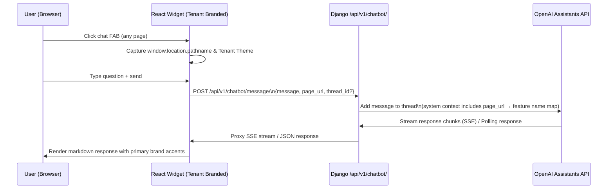

# AI Chatbot Knowledge Base — Feature Specification

**Feature ID**: CHATBOT-001
**Branch**: `feat/ai-chatbot-planning`
**Status**: Draft — Pending Manager Review
**Estimation Mode**: Vibe coding + manual test

---

## Overview

Build an in-app AI chatbot widget powered by **OpenAI Assistants API + Vector Store** that helps platform users navigate Akvo MIS features. The bot reads the current page URL to infer context, answers natural-language questions grounded in the platform's knowledge base, dynamically inherits tenant branding (colors & style), and floats over every authenticated page in the React frontend.

---

## 5W1H Analysis

| Dimension | Detail |
|-----------|--------|
| **Who** | Authenticated end-users of any Akvo MIS tenant (all roles) |
| **What** | Floating chat widget, backend proxy, RST-to-MD converter & vector ingestion pipeline |
| **Where** | Frontend: global overlay component with dynamic tenant branding. Backend: new Django app `api.v1.v1_chatbot` |
| **When** | Triggered by user clicking the chat FAB; KB converted to `.md` & indexed once at deploy + re-indexed on doc change |
| **Why** | Lower support friction during onboarding; users struggle to find relevant docs while inside complex pages (Form Builder, Approvals, etc.) |
| **How** | 1) `docs/source/*.rst` → `.md` files → OpenAI Vector Store. 2) Chat messages + current URL → backend proxy → OpenAI Assistants thread → response |

---

## Architecture Overview



### URL → Feature Context Map (Backend)

A simple dict in the backend translates `pathname` prefixes to friendly context strings injected into the system prompt:

| URL prefix | Context label |
|------------|--------------|
| `/form-builder` | "Form Builder" |
| `/manage-data` | "Data Management" |
| `/approvals` | "Approval Workflow" |
| `/master-data` | "Master Data Management" |
| `/users` or `/add-user` | "User Management" |
| `/roles` or `/add-role` | "Roles & Permissions" |
| `/dashboard` | "Dashboard" |
| `/mobile-assignment` | "Mobile Assignment" |
| `/downloads` | "Downloads & Exports" |
| `/settings` | "Settings" |
| *(anything else)* | "General Platform" |

---

## Phase 1 — Knowledge Base Ingestion Pipeline (RST ➔ Markdown ➔ Vector Store)

**Goal**: Convert all `docs/source/*.rst` files into clean `.md` Markdown files, then ingest into an OpenAI Vector Store.

### 1. Intermediate Markdown Generation (`docs/md/`)

A converter step transforms Sphinx/RST documents into readable markdown files (`docs/md/*.md`). Benefits:
- Manual auditing of the compiled knowledge base before indexing.
- Clean chunking for vector embeddings (stripping Sphinx directives like `:bolditalic:`, `.. image::`, etc.).

**Doc sources** (17 files ready for conversion):

| RST File | Topic |
|----------|-------|
| `formBuilder.rst` | Form Builder lifecycle |
| `questionTypes.rst` | Question types reference |
| `dependencies.rst` | Skip logic / dependencies |
| `formBuilderBestPractices.rst` | Form design best practices |
| `start.rst` | Get started / roles & permissions |
| `install.rst` | Installation |
| `administration.rst` | User & admin management |
| `approval.rst` | Approval workflow |
| `dataManagement.rst` | Data management |
| `MasterDataManagement.rst` | Master data / administration levels |
| `mobileApp.rst` | Mobile app guide |
| `inputChannel.rst` | Input channels |
| `outputs.rst` | Outputs & visualisations |
| `download.rst` | PDF downloads |
| `deployment.rst` | Deployment |

### 2. Script: `scripts/ingest_kb.py`

```
1. Read all *.rst from docs/source/
2. Parse & write converted .md files to docs/md/
3. Split Markdown into context blocks (~500 tokens each)
4. Upload .md files to OpenAI Files API
5. Create/update named Vector Store ("akvo-mis-kb")
6. Output vector_store_id → save to .env as OPENAI_VECTOR_STORE_ID
```

---

## Phase 2 — Backend: `api.v1.v1_chatbot`

### New Django App Structure

```
backend/api/v1/v1_chatbot/
├── __init__.py
├── apps.py
├── views.py            # ChatMessageView with SSE streaming / JSON
├── serializers.py      # ChatRequestSerializer
├── urls.py             # path("chatbot/", ...)
├── management/
│   └── commands/
│       └── ingest_kb.py   # Django management command
└── tests/
    └── test_chatbot.py
```

### New API Endpoint

**`POST /api/v1/chatbot/message/`** — requires JWT authentication

**Request:**
```json
{
  "message": "How do I add a question group?",
  "page_url": "/form-builder/123/edit",
  "thread_id": "thread_abc123"
}
```
> `thread_id` is optional — omit to start a new conversation thread.

**Response (SSE stream):**
```
data: {"delta": "To add a question group, "}
data: {"delta": "click Insert group here..."}
data: {"thread_id": "thread_abc123", "done": true}
```

### Backend Logic Flow

1. Validate JWT → `request.user` (tenant-scoped via existing middleware)
2. Map `page_url` → context label via `URL_CONTEXT_MAP`
3. Create or reuse OpenAI thread (`thread_id` from request)
4. Add user message with injected system context:
   > `"User is currently viewing: {context_label}. Answer based on the Akvo MIS documentation."`
5. Run the Assistant with `vector_store_id` file-search tool attached
6. Stream response chunks via `StreamingHttpResponse` + `text/event-stream`

### New Environment Variables

```bash
OPENAI_API_KEY=sk-...
OPENAI_ASSISTANT_ID=asst_...
OPENAI_VECTOR_STORE_ID=vs_...
```

### Requirements additions (`backend/requirements.txt`)

```
openai>=1.30.0
gevent>=22.10.0   # required for SSE streaming with gunicorn
```

### Django settings additions (`mis/settings.py`)

```python
OPENAI_API_KEY = environ.get("OPENAI_API_KEY", "")
OPENAI_ASSISTANT_ID = environ.get("OPENAI_ASSISTANT_ID", "")
OPENAI_VECTOR_STORE_ID = environ.get("OPENAI_VECTOR_STORE_ID", "")
```

---

## Phase 3 — Frontend: Tenant-Branded Chatbot Widget

### Multi-Tenant Brand & Style Awareness

The floating chat widget dynamically binds to the active tenant's brand configuration:
- **FAB & header accents**: Uses tenant CSS variables (e.g. `var(--primary-color)`)
- **Header badge**: Displays the bot persona name alongside the tenant logo/style
- **Message bubbles**: Accent colors follow tenant primary palette

### Component Structure

```
frontend/src/components/chatbot/
├── ChatbotWidget.jsx       # FAB + collapsible panel (tenant branded)
├── ChatbotMessages.jsx     # Message list with markdown rendering
├── ChatbotInput.jsx        # Text input + send button
└── chatbot.scss            # CSS with CSS variable tenant overrides
```

### UX Design

| Element | Behaviour |
|---------|-----------|
| **FAB** | Bottom-right fixed button, chat icon, tenant primary color |
| **Panel** | 380×520px slide-up card above FAB, glassmorphism consistent with Ant Design theme |
| **Context chip** | Small pill: e.g. `📍 Form Builder` — updates as user navigates |
| **Streaming** | Text renders token-by-token as SSE arrives |
| **Thread persistence** | `thread_id` stored in `sessionStorage` — clears on tab/browser close |
| **Persona header** | Bot name (e.g. *Mira*) shown in panel header |

### State Management

Local React `useState` + `useRef` only — no Redux/global store changes needed.

### New npm dependency

```
react-markdown   # render bot responses as Markdown
```

---

## Open Questions for Manager & Stakeholder Review

---

### 1. 🔁 Response Mode: Streaming (SSE) vs Polling

> [!IMPORTANT]
> This decision affects infrastructure configuration and user experience.

| Approach | Pros | Cons |
|----------|------|------|
| **Streaming (SSE + gevent)** | • Text streams token-by-token — best UX.<br>• Feels instant, no blank wait screen. | • Requires `gunicorn --worker-class gevent` update.<br>• Slightly higher memory per active streaming connection. |
| **Polling / JSON** | • Works with existing standard Gunicorn setup.<br>• Simpler implementation, no worker change. | • User waits 3–6s for full response before seeing anything.<br>• Worse onboarding experience — users feel the system is slow. |

**Recommendation**: **Streaming** — adding `gevent` to `requirements.txt` is low risk and yields significantly better UX.

---

### 2. 🤖 Bot Persona (MIS-Contextual Options)

> [!TIP]
> Persona options are scoped to the **Monitoring Information System** context. Grouped by personality archetype to help pick the right fit.

#### 🔵 Professional / Mission-Driven

| Name | Full Title | Tone |
|------|-----------|------|
| **Mira** | *Monitoring Intelligence & Response Assistant* | Calm, authoritative, precise. Reflects the monitoring DNA — ideal for org-wide deployments. ⭐ Recommended |
| **Vela** | *Verified Evidence & Learning Assistant* | Purposeful, evidence-focused. Suits programs where data verification and learning cycles matter. |
| **Trace** | *Tracking & Reporting Assistance for Connected Evidence* | Systematic, technical. Ideal for data-heavy users managing submissions and approval chains. |
| **Clarity** | *Your MIS Knowledge Companion* | Warm but precise. Emphasises cutting through complexity — great for new users during onboarding. |

#### 🟢 Field-Friendly / Human

| Name | Full Title | Tone |
|------|-----------|------|
| **Fieldhand** | *MIS Field Support* | Grounded, helpful, no-nonsense. Familiar to enumerators; suggests on-the-ground reliability. |
| **Scout** | *MIS Exploration & Support Guide* | Energetic, curious. Suggests scouting the platform for answers — suits mobile-first field users. |
| **Tally** | *Your MIS Count & Collect Companion* | Friendly, practical. References counting & data tally — relatable to form submission workflows. |
| **Akara** | *Akvo Knowledge & Response Assistant* | Warm, globally neutral name. "Akara" echoes "Akvo" and means "letter/script" in several languages. |

#### 🟣 Technical / Data-Centric

| Name | Full Title | Tone |
|------|-----------|------|
| **DataPoint** / **D.P.** | *Your MIS Data Guide* | Playful nod to the core unit of work — approachable for power users and form builders. |
| **Nexus** | *MIS Knowledge Hub* | Conveys connecting users to the right information across features and modules. |
| **Forma** | *Form & Data Assistant* | Form-building native — highly relevant to Form Builder and Submission users. |
| **Pulse** | *Real-Time Monitoring Intelligence* | Dynamic, modern. Suggests live data, active monitoring, and rapid response. |

#### 🟡 Navigation / Discovery

| Name | Full Title | Tone |
|------|-----------|------|
| **Atlas** | *Akvo MIS Navigation Guide* | Exploratory, knowledgeable. Helps users chart their way through platform features. |
| **Beacon** | *MIS Guidance & Support* | Reassuring, directional. A lighthouse guiding users through complex workflows. |
| **Quill** | *Your Form & Documentation Assistant* | Creative, detail-oriented. Suits content-heavy users — form designers, admins, data managers. |
| **Luma** | *Light Through Your MIS Journey* | Bright, approachable, optimistic. Great for onboarding-first contexts where user confidence matters. |

**Recommendation**: **Mira** for professional/multi-tenant deployments · **Scout** or **Luma** for onboarding-focused contexts.

---

### 3. 💰 OpenAI API Cost & Implementation Complexity

> [!IMPORTANT]
> **Development Complexity: Medium**
> Well-understood integration pattern. No custom ML/model training. Primary complexity is SSE streaming wiring between Django and React.

#### OpenAI Services & Pricing

| Service | Purpose | Pricing |
|---------|---------|---------|
| Files API | Upload RST/MD docs as searchable files | Free to upload |
| Vector Store | Store & search embedded KB chunks | $0.10 / GB / day |
| GPT-4o mini | Cost-efficient, sufficient for doc Q&A | $0.15 / 1M  input · $0.60 / 1M output tokens |
| GPT-4o | Higher quality answers (optional upgrade) | $2.50 / 1M input · $10.00 / 1M output tokens |

#### KB Storage Cost

| Item | Estimated Size | Monthly Cost |
|------|---------------|-------------|
| 17 RST docs as `.md` files | ~200 KB | < **$0.05 / month** |

#### Per-Message Token Estimate

| Component | Tokens |
|-----------|--------|
| System prompt + URL context | ~300 |
| Retrieved KB chunks (file-search) | ~1,500 |
| Conversation history (last 5 turns) | ~500 |
| **Total input tokens** | **~2,300** |
| Bot response (output) | ~400 tokens |

#### Monthly Running Cost by Usage Scale

| Scenario | Messages/Month | GPT-4o mini *(recommended)* | GPT-4o |
|----------|---------------|--------------------------|--------|
| **Small** — 20 users × 5 msgs/day | 3,000 | ~$1.20 | ~$19 |
| **Medium** — 50 users × 10 msgs/day | 15,000 | ~$6 | ~$95 |
| **Large** — 100 users × 20 msgs/day | 60,000 | ~$25 | ~$380 |

**Recommendation**: Start with **GPT-4o mini**. Quality is sufficient for documentation Q&A. Upgrade to GPT-4o only if answer quality is insufficient during testing.

---

### 4. 🔄 Knowledge Base Re-Indexing Strategy

> [!IMPORTANT]
> Decision needed: Who triggers re-indexing when docs are updated?

- **Option A — CI/CD Automated**: Re-run `ingest_kb` automatically whenever `docs/` files change on `main` push.
- **Option B — Manual Admin Command**: `python manage.py ingest_kb` during deployment releases.

---

### 5. 🛡️ Rate Limiting & Cost Controls

> [!IMPORTANT]
> Decision needed: How to cap OpenAI spend.

- **Option A — Per-User Daily Limit**: e.g. 30 messages/user/day.
- **Option B — Per-Tenant Monthly Cap**: Token budget per workspace.
- **Option C — Monitor First**: Watch usage via OpenAI dashboard for the first month, then set limits based on real data.

---

## Verification Plan (Manual Vibe Testing)

| # | Test Scenario | Expected Result |
|---|--------------|----------------|
| 1 | Run ingestion script → inspect `docs/md/` | Clean Markdown files, no RST directives |
| 2 | Switch tenant in frontend | FAB & widget accent colors update to tenant theme |
| 3 | On `/form-builder`, ask "How do I add a repeatable group?" | Response mentions gear icon + repeatable checkbox |
| 4 | On `/manage-data`, ask "How do I invite a new user?" | Correct answer, context from User Management docs |
| 5 | Ask follow-up referencing previous message | Thread context maintained correctly |
| 6 | Call `/api/v1/chatbot/message/` without JWT | 401 Unauthorized |
| 7 | Submit empty message | Validation error, no API call made |

---

## Files to Create / Modify

### New Files

| File | Description |
|------|-------------|
| `scripts/ingest_kb.py` | RST → MD converter + OpenAI Vector Store ingestion |
| `docs/md/` | Generated Markdown KB files (gitignored or committed) |
| `backend/api/v1/v1_chatbot/__init__.py` | App init |
| `backend/api/v1/v1_chatbot/apps.py` | AppConfig |
| `backend/api/v1/v1_chatbot/views.py` | `ChatMessageView` with SSE streaming |
| `backend/api/v1/v1_chatbot/serializers.py` | `ChatRequestSerializer` |
| `backend/api/v1/v1_chatbot/urls.py` | URL patterns |
| `backend/api/v1/v1_chatbot/management/commands/ingest_kb.py` | Management command |
| `backend/api/v1/v1_chatbot/tests/test_chatbot.py` | Unit tests |
| `frontend/src/components/chatbot/ChatbotWidget.jsx` | FAB + panel shell |
| `frontend/src/components/chatbot/ChatbotMessages.jsx` | Message list |
| `frontend/src/components/chatbot/ChatbotInput.jsx` | Input component |
| `frontend/src/components/chatbot/chatbot.scss` | Widget styles |

### Modified Files

| File | Change |
|------|--------|
| `backend/requirements.txt` | Add `openai>=1.30.0`, `gevent>=22.10.0` |
| `backend/mis/settings.py` | Add `v1_chatbot` to `API_APPS`, add 3 OpenAI env vars |
| `backend/mis/urls.py` | Add chatbot URL include |
| `frontend/src/App.js` | Mount `<ChatbotWidget />` inside authenticated layout |
| `frontend/src/components/index.js` | Export chatbot components |
| `.env` + `env.example` | Add `OPENAI_API_KEY`, `OPENAI_ASSISTANT_ID`, `OPENAI_VECTOR_STORE_ID` |
| `docker-compose.override.yml` | Pass OpenAI env vars to backend container |

---

## Estimation (Vibe Coding + Manual Test)

| # | Task | Min | Max | Confidence |
|---|------|-----|-----|-----------|
| 1 | RST-to-MD converter + `scripts/ingest_kb.py` | 2h | 3h | High |
| 2 | Run ingestion, verify Vector Store in OpenAI dashboard | 1h | 1.5h | High |
| 3 | Django app `v1_chatbot` + management command | 1h | 1.5h | High |
| 4 | `ChatMessageView` — validation + URL context map | 1h | 2h | High |
| 5 | OpenAI Assistants thread + SSE/JSON response handler | 2.5h | 4h | Medium |
| 6 | Backend unit tests (auth, context map, serializer) | 1h | 2h | High |
| 7 | `ChatbotWidget.jsx` with tenant brand binding | 1.5h | 2.5h | High |
| 8 | `ChatbotMessages.jsx` + `ChatbotInput.jsx` + Markdown | 1.5h | 2.5h | High |
| 9 | URL context chip + session-based thread management | 1h | 1.5h | High |
| 10 | `chatbot.scss` with tenant CSS variable overrides | 1h | 1.5h | High |
| 11 | End-to-end manual vibe test (7 scenarios) | 1h | 2h | High |
| 12 | `.env.example` + docker-compose env updates | 0.5h | 1h | High |
| **Total** | | **15h** | **25h** | |

> **Development complexity: Medium** — No custom ML training. Main risk is SSE streaming wiring (tasks 5 & 9 are the uncertainty band).
