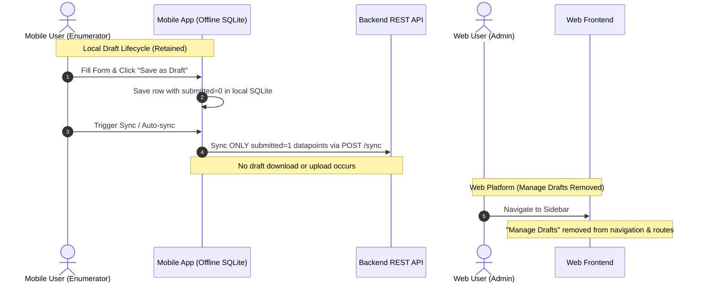

# DRAFT-002: Remove Drafts Syncing and Web Draft Management

## Overview
This specification details the complete removal of data submission draft syncing capabilities between the mobile app and backend, as well as the complete removal of the "Manage Drafts" module from the web platform.

Following this change:
1. **Mobile App**: Drafts will remain strictly offline/local-only on the device. Users can create, save, reopen, edit, and delete drafts locally. Drafts will NEVER be uploaded to the backend or downloaded during datapoint sync.
2. **Web Platform & Backend**: The "Manage Drafts" UI, navigation, routes, and corresponding backend API endpoints (for web and device draft listing, fetching, updating, publishing, and deleting) will be completely removed.

---

## Scope, UAC & TAC (Asana Task Breakdown)

### 📦 Task 1: Remove Draft Syncing from Mobile App (Keep Local Drafts)

#### User Acceptance Criteria (UAC)
- [ ] **Local Draft Offline Retention**: Enumerators can continue to create, save as draft, reopen, edit, and delete draft responses locally on the mobile app.
- [ ] **No Draft Background/Manual Upload**: Unfinished drafts (`submitted = 0`) are never uploaded to the server during auto-sync or manual sync.
- [ ] **No Draft Server Download**: Drafts created elsewhere or on other devices are never downloaded to the mobile app.
- [ ] **Removal of "Send to Web" Option**:
  - The "Save and send to web dashboard" option is removed from the form save dropdown and confirmation dialogs (only local "Save as draft" and "Discard" remain).
  - The "Send to Web" action, status indicator badge (`pendingWeb`), and related toast notifications are removed from the submission list and datapoint cards.
- [ ] **Seamless Submission Sync**: Completed form submissions (`submitted = 1`) continue to sync normally to the backend.

#### Technical Acceptance Criteria (TAC)
- [ ] **Query Isolation**: `selectSubmissionToSync` in `app/src/database/crud/crud-datapoints.js` strictly selects `WHERE submitted = 1 AND syncedAt IS NULL`, removing `sendToWeb = 1` and `draftId IS NOT NULL` clauses.
- [ ] **Sync Loop Decommissioning**:
  - Remove `onSyncDraftDatapoint` callback and invocation in `app/src/components/SyncService.js`.
  - Remove `fetchDraftDatapointsPageByPage` from `app/src/lib/sync-datapoints.js`.
  - Remove `draftInProgress` flag from `DatapointSyncState`, `Home.js`, and `LogoutButton.js`.
- [ ] **Payload Sanitization**: `processBatch` in `app/src/lib/background-task.js` removes `is_draft=true` query parameters and sync branches, routing exclusively to `/sync` for submitted records.
- [ ] **4xx Fallback Guard**: Keep `crudDataPoints.saveAsDraft(db, d.id)` for 4xx HTTP responses so rejected submissions drop safely back into local drafts without triggering infinite sync loops.
- [ ] **UI & i18n Cleanup**:
  - Remove `sendToWeb` prop handlers from `FormPage.js`, `SaveDropdownMenu.js`, and `SaveDialogMenu.js`.
  - Remove `sendToWebTitle`, `sendToWebMessage`, `sendToWebToast`, `buttonSaveNSendToWeb` from `app/src/lib/i18n/ui-text.js` (EN and FR).
- [ ] **Test Coverage**: All mobile test suites pass (`./dc-mobile.sh exec mobile npm test`) and linter checks pass (`./dc-mobile.sh exec mobile npm run lint`).

---

### 📦 Task 2: Remove Manage Drafts Functionality from Web Platform & Backend

#### User Acceptance Criteria (UAC)
- [ ] **Sidebar Cleanup**: The "Manage Drafts" link is completely removed from the web platform sidebar navigation menu.
- [ ] **Web Route Decommissioning**: Direct URL navigation to `/manage-draft` or `/manage-draft/:formId` redirects to a valid page or returns 404 (no broken/blank views).
- [ ] **Web Manage Draft Removal**: The web draft list, draft submission detail, and draft editing/publishing views are completely removed.
- [ ] **API Decommissioning**: All backend draft endpoints for web management and device draft listing/deletion are decommissioned.
- [ ] **Orphaned Drafts Cleanup Command (Optional / Operational)**:
  - An administrative Django management command (`python manage.py purge_orphaned_drafts`) is available to safely preview (`--dry-run`) and hard/soft delete lingering historical backend draft rows (`FormData.objects_draft.all()`).

#### Technical Acceptance Criteria (TAC)
- [ ] **Frontend Deletion**:
  - Delete `frontend/src/pages/manage-draft/` directory (`DraftDetail.jsx`, `ManageDraft.jsx`, `ManageDraftForm.jsx`, `style.scss`).
  - Remove `ManageDraft` and `ManageDraftForm` exports from `frontend/src/pages/index.js`.
  - Remove `/manage-draft` and `/manage-draft/:formId` routes from `frontend/src/App.js`.
  - Remove `menuManageDraft` item from `frontend/src/components/sidebar/index.jsx`.
  - Remove unused draft translation strings from `frontend/src/lib/ui-text.js` and update Jest snapshots (`frontend/src/lib/__test__/__snapshots__/ui-text.test.js.snap`).
- [ ] **Backend Mobile API Cleanup**:
  - Remove `/device/draft-list` and `/device/draft-list/<pk>` routes from `backend/api/v1/v1_mobile/urls.py`.
  - Remove `DraftFormDataViewSet` and `DraftFormDataSerializer` from `backend/api/v1/v1_mobile/views.py` and `serializers.py`.
  - Remove `is_draft` parameter handling in `SyncDataViewSet` and `SyncSerializer`.
- [ ] **Backend Web Data API Cleanup**:
  - Remove `/data/draft/` routes (`DraftFormDataListView`, `DraftFormDataDetailView`, `PublishDraftFormDataView`) from `backend/api/v1/v1_data/urls.py` and `views.py`.
  - Remove `FilterDraftFormDataSerializer` and `DraftFormDataDetailSerializer` from `backend/api/v1/v1_data/serializers.py`.
- [ ] **Backend Cleanup Management Command**:
  - Create `backend/api/v1/v1_data/management/commands/purge_orphaned_drafts.py` supporting `--dry-run` and optional `--tenant` filtering to delete historical server drafts.
  - Create unit tests for `purge_orphaned_drafts` command in `backend/api/v1/v1_data/tests/tests_purge_orphaned_drafts.py`.
- [ ] **Test Suite Cleanup**:
  - Remove obsolete test files: `tests_mobile_draft_list.py`, `tests_mobile_draft_delete.py`, and `tests_draft_data_*.py`.
  - Ensure all backend tests pass (`./dc.sh exec backend python manage.py test api.v1.v1_mobile api.v1.v1_data`) and flake8 passes.
  - Ensure all frontend tests pass (`./dc.sh exec frontend npm test -- -u`) and eslint passes.

---

## Architecture Overview



---

## 🗄️ Database & Migration Strategy (Backend & Mobile)

### 1. Recommended Backend Approach: API Decommissioning (Zero Migrations)
- **Decision: Retain `Draft` mixin on `FormData` and avoid database migrations**
  - `FormData(SoftDeletes, Draft)` inherits `is_draft = models.BooleanField(default=False)` from the `Draft` abstract model.
  - **Why this is the safest and recommended approach**:
    1. **Schema Stability & Zero Downtime**: No DDL table locks on the large `form_data` table. `makemigrations` produces `No changes detected`.
    2. **View Integrity**: Existing database views (such as `view_data_options` in `backend/api/v1/v1_visualization/migrations/0001_create_view_data_options.py`) query `AND is_draft = FALSE` and remain 100% stable without recreation.
    3. **Automatic Isolation**: `DraftSoftDeletesManager` ensures that `FormData.objects.all()` automatically excludes draft records (`is_draft=False`) across all active APIs, exports, and dashboards.
    4. **Clean Operational Purge**: `FormData.objects_draft` is retained exclusively for the administrative command `python manage.py purge_orphaned_drafts` to safely clean up historical server drafts.
  - **Verdict**: Backend requires **0 new migrations**.

---

### 2. Alternative Backend Scenario: Full DB Migration Removal
If the team decides to physically eliminate the `is_draft` column and `Draft` model manager from PostgreSQL via migrations, the following sequence must be handled:

1. **Mandatory Data Purge Migration (Step 1)**:
   - *Risk*: Dropping the `is_draft` column causes existing server draft rows in `form_data` to lose their `is_draft = True` flag. They would immediately be exposed as **live, published submissions** across all tenant dashboards, exports, and reports.
   - *Requirement*: A custom Django data migration must run first to delete all existing rows where `is_draft=True`:
     ```python
     def purge_existing_drafts(apps, schema_editor):
         FormData = apps.get_model('v1_data', 'FormData')
         FormData.objects.filter(is_draft=True).delete()
     ```
2. **PostgreSQL View Rebuild Migration (Step 2)**:
   - *Risk*: The SQL view `view_data_options` (created in `v1_visualization/migrations/0001_create_view_data_options.py`) explicitly references `AND is_draft = FALSE`. PostgreSQL will **fail and reject** dropping `is_draft` with a dependency error (`cannot drop column is_draft of relation form_data because view_data_options depends on it`).
   - *Requirement*: A migration in `v1_visualization` must:
     - Execute `DROP VIEW view_data_options;`
     - Allow `v1_data` to drop the column `is_draft`.
     - Execute `CREATE VIEW view_data_options AS ...` without the `is_draft` column reference.
3. **Model & Wide-Scale Queryset Refactoring (Step 3)**:
   - Remove `Draft` mixin from `class FormData(SoftDeletes, Draft):` → `class FormData(SoftDeletes):`.
   - Update `FormData.objects = SoftDeletesManager()`.
   - Audit and remove `is_draft=False` and `children__is_draft=False` filters across **25+ querysets** in `v1_data/views.py`, `v1_visualization/views.py`, `values_functions.py`, `functions.py`, and `escalation_functions.py`.
4. **Django Schema Migration (Step 4)**:
   - Run `makemigrations` to generate `RemoveField(model_name='formdata', name='is_draft')`.

---

### 3. Mobile SQLite Strategy (Zero Migrations)
- **Zero SQLite Migrations Needed Across All Scenarios**:
  - Local drafts rely strictly on `submitted = 0` (which remains in SQLite storage).
  - The auxiliary `sendToWeb` column already has `DEFAULT 0`. Leaving the column dormant causes zero issues and completely eliminates the risk of SQLite table recreation or schema rebuilds.
  - Mobile requires **0 SQLite migrations**.

---

### 4. Strategy Trade-Off Comparison

| Factor | Option A: API Decommission (Recommended) | Option B: Full DB Migration Removal |
| :--- | :--- | :--- |
| **Backend Migrations** | **0 migrations** | **2+ migrations** (Data purge + View drop/rebuild) |
| **Mobile SQLite Migrations** | **0 migrations** | **0 migrations** (Leave `sendToWeb` dormant) |
| **Database Lock / Downtime Risk** | **Zero risk** | **Medium/High** (DDL table lock on `form_data` + View rebuild) |
| **Codebase Refactor Scope** | Localized strictly to draft endpoints & UI | Wide (25+ backend querysets across visualization, escalation, data) |
| **Total Estimated Effort** | **5.5 hours** | **10.0 – 12.0 hours** |
| **Data Integrity Guarantee** | Drafts remain dormant & invisible by default manager | Requires prerequisite data purge migration to prevent data leaks |

---

## 1. Task 1: Remove Draft Syncing from Mobile App (Preserve Local Drafts)

### 1.1 Touchpoint Files
- `[MODIFY]` `app/src/components/SyncService.js`:
  - Remove `onSyncDraftDatapoint` and its invocation from the sync cycle.
  - Remove `fetchDraftDatapointsPageByPage` imports.
- `[MODIFY]` `app/src/lib/sync-datapoints.js`:
  - Remove `fetchDraftDatapointsPageByPage`.
- `[MODIFY]` `app/src/lib/background-task.js`:
  - In `processBatch`: Remove `syncURL` draft conditional logic (`?is_draft=true`), ensure `/sync` is only called for completed submissions (`submitted = 1`).
- `[MODIFY]` `app/src/database/crud/crud-datapoints.js`:
  - In `selectSubmissionToSync`: Filter strictly by `datapoints.submitted = 1`. Remove `datapoints.draftId IS NOT NULL` and `datapoints.sendToWeb = 1` branches.
  - Remove unused draft sync queries (`getDraftPendingSync`, `deleteDraftIdIsNull`, `deleteDraftSynced`, `setSendToWeb`).
- `[MODIFY]` `app/src/form/support/SaveDropdownMenu.js` & `app/src/form/support/SaveDialogMenu.js`:
  - Remove the "Save and send to web dashboard" option, keeping only standard local "Save as draft" and "Discard".
- `[MODIFY]` `app/src/pages/FormPage.js`:
  - Simplify `handleOnSaveAndExit` to always save locally without `sendToWeb` flag.
- `[MODIFY]` `app/src/pages/Submission.js`:
  - Remove "Send to Web" context action, modal confirm state, and toast.
- `[MODIFY]` `app/src/components/DatapointCard.js`:
  - Remove `pendingWeb` badge / draft upload status indicators.
- `[MODIFY]` `app/src/store/datapoint-sync.js` & `app/src/pages/Home.js`:
  - Remove `draftInProgress` property and listeners.
- `[MODIFY]` `app/src/lib/i18n/ui-text.js`:
  - Remove `sendToWebTitle`, `sendToWebMessage`, `sendToWebToast`, `buttonSaveNSendToWeb` (EN & FR).
- `[TEST]` Update mobile test suites:
  - `app/src/components/__tests__/DatapointCard.test.js`
  - `app/src/pages/__tests__/Submission.test.js`
  - `app/src/pages/__tests__/FormPage.test.js`
  - `app/src/pages/__tests__/Home.test.js`
  - `app/src/lib/__test__/background-datapoint-sync.test.js`

---

## 2. Task 2: Remove Manage Drafts from Web Platform & Decommission Backend Draft APIs

### 2.1 Web Frontend Touchpoint Files
- `[DELETE]` `frontend/src/pages/manage-draft/` (entire directory):
  - `DraftDetail.jsx`
  - `ManageDraft.jsx`
  - `ManageDraftForm.jsx`
  - `style.scss`
- `[MODIFY]` `frontend/src/pages/index.js`:
  - Remove exports for `ManageDraft` and `ManageDraftForm`.
- `[MODIFY]` `frontend/src/App.js`:
  - Remove imports and `<Route>` entries for `/manage-draft` and `/manage-draft/:formId`.
- `[MODIFY]` `frontend/src/components/sidebar/index.jsx`:
  - Remove "Manage Drafts" navigation link / menu item.
- `[MODIFY]` `frontend/src/lib/ui-text.js`:
  - Remove `menuManageDraft`, `manageDraftTitle`, `manageDraftText` (EN & FR).
- `[TEST]` `frontend/src/lib/__test__/ui-text.test.js`:
  - Update snapshot tests to reflect removed strings.

### 2.2 Backend Touchpoint Files
- `[MODIFY]` `backend/api/v1/v1_mobile/urls.py`:
  - Remove `/device/draft-list` and `/device/draft-list/<pk>` URL patterns.
- `[MODIFY]` `backend/api/v1/v1_mobile/views.py`:
  - Remove `DraftFormDataViewSet`.
  - In `SyncDataViewSet`: Remove `is_draft` parameter handling from `post()` action.
- `[MODIFY]` `backend/api/v1/v1_mobile/serializers.py`:
  - Remove `DraftFormDataSerializer`.
  - Remove `is_draft` parameter from `SyncSerializer`.
- `[MODIFY]` `backend/api/v1/v1_data/urls.py`:
  - Remove `DraftFormDataListView`, `DraftFormDataDetailView`, `PublishDraftFormDataView` routes.
- `[MODIFY]` `backend/api/v1/v1_data/views.py`:
  - Remove `DraftFormDataListView`, `DraftFormDataDetailView`, `PublishDraftFormDataView`.
- `[MODIFY]` `backend/api/v1/v1_data/serializers.py`:
  - Remove `FilterDraftFormDataSerializer`, `DraftFormDataDetailSerializer`.
- `[CREATE]` `backend/api/v1/v1_data/management/commands/purge_orphaned_drafts.py`:
  - Add management command to purge historical orphaned server draft rows (`FormData.objects_draft.all()`) with `--dry-run` and optional `--tenant` support.
- `[CREATE]` `backend/api/v1/v1_data/tests/tests_purge_orphaned_drafts.py`:
  - Add test coverage for the purge command.
- `[DELETE]` / `[MODIFY]` Backend Tests:
  - Remove `backend/api/v1/v1_mobile/tests/tests_mobile_draft_list.py`
  - Remove `backend/api/v1/v1_mobile/tests/tests_mobile_draft_delete.py`
  - Remove `backend/api/v1/v1_data/tests/tests_draft_data_list.py`
  - Remove `backend/api/v1/v1_data/tests/tests_draft_data_details.py`
  - Remove `backend/api/v1/v1_data/tests/tests_update_draft_data.py`
  - Remove `backend/api/v1/v1_data/tests/tests_publish_draft_data.py`
  - Remove `backend/api/v1/v1_data/tests/tests_delete_draft_data.py`
  - Remove `backend/api/v1/v1_data/tests/tests_add_new_draft.py`

---

## 3. Deterministic Verification Plan

### Automated Test Commands
1. **Backend Tests**:
   ```bash
   ./dc.sh exec backend python manage.py test api.v1.v1_mobile api.v1.v1_data
   ```
2. **Backend Lint**:
   ```bash
   ./dc.sh exec backend flake8
   ```
3. **Frontend Tests**:
   ```bash
   ./dc.sh exec frontend npm test -- -u
   ```
4. **Frontend Lint**:
   ```bash
   ./dc.sh exec frontend npm run lint
   ```
5. **Mobile Tests**:
   ```bash
   ./dc-mobile.sh exec mobile npm test
   ```
6. **Mobile Lint**:
   ```bash
   ./dc-mobile.sh exec mobile npm run lint
   ```

### Manual Verification Checklist
1. **Mobile Local Draft**: Open a form on mobile, fill in some fields, tap "Save as draft". Verify the draft appears in the form's draft list, can be reopened and edited, but does not attempt to upload during sync.
2. **Mobile Form Submit**: Submit a completed form, trigger sync, and verify it successfully uploads to backend (`/sync`).
3. **Web Sidebar**: Verify "Manage Drafts" no longer appears in the web navigation sidebar.
4. **Web Route Guard**: Manually navigating to `http://<tenant>.mis.local:3000/manage-draft` redirects or returns 404.

---

## 4. Vibe Coding Estimation Standard

| Task ID | Story / Task Description | Vibe Coding (Dev) | Automated Testing | QA & Review | Total Est. Time |
| :--- | :--- | :---: | :---: | :---: | :---: |
| **TASK-01** | **Mobile App**: Remove draft sync & send-to-web capabilities while preserving offline local drafts | 90m (1.5h) | 45m (0.75h) | 30m (0.5h) | **165m (2.75h)** |
| **TASK-02** | **Web & Backend**: Remove web Manage Drafts UI, routes, sidebar entry, and backend draft APIs | 90m (1.5h) | 45m (0.75h) | 30m (0.5h) | **165m (2.75h)** |
| **TOTAL** | **Full Feature Delivery** | **3.0h** | **1.5h** | **1.0h** | **5.5h (≤ 6.0h)** |
