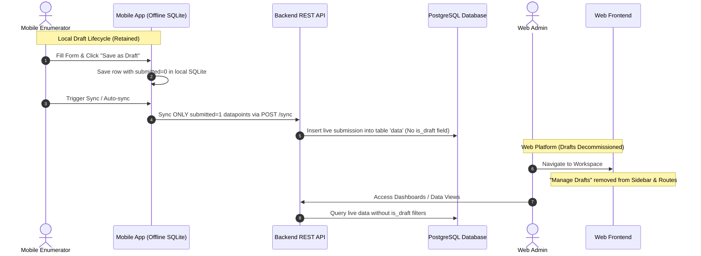
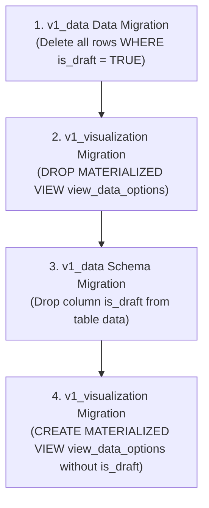

# DRAFT-002: Remove Drafts Syncing, Web Draft Management, and Database Schema

## Overview
This specification details the complete decommissioning and removal of draft synchronization between the mobile app and backend, the complete removal of the "Manage Drafts" module from the web platform, and the full physical removal of the `is_draft` column, `Draft` model mixin, and draft records from the PostgreSQL database schema.

Following this change:
1. **Mobile App**: Drafts remain strictly offline/local-only on the device (stored in local SQLite with `submitted = 0`). Drafts will NEVER be uploaded to the backend or downloaded during datapoint sync.
2. **Web Platform**: The "Manage Drafts" UI, navigation, routes, and corresponding translation strings will be completely removed.
3. **Backend REST API**: All endpoints for web and device draft listing, fetching, updating, publishing, and deleting will be decommissioned.
4. **Database & Schema**: All historical server draft rows will be permanently deleted via an atomic data migration, the Materialized View `view_data_options` will be rebuilt without `is_draft`, and the `is_draft` column will be dropped from table `data` (`FormData`).

---

## Scope, UAC & TAC (Asana Task Breakdown)

### 📦 Task 1: Remove Draft Syncing from Mobile App (Keep Local Drafts)

#### User Acceptance Criteria (UAC)
- [ ] **Local Draft Offline Retention**: Enumerators can continue to create, save as draft, reopen, edit, and delete draft responses locally on the mobile app.
- [ ] **No Draft Background/Manual Upload**: Unfinished drafts (`submitted = 0`) are never uploaded to the server during auto-sync or manual sync.
- [ ] **No Draft Server Download**: Drafts created elsewhere or on other devices are never downloaded to the mobile app.
- [ ] **Removal of "Send to Web" Option**:
  - The "Save and send to web dashboard" option is removed from the form save dropdown and confirmation dialogs (only local "Save as draft" and "Discard" remain).
  - The "Send to Web" action, status indicator badge (`pendingWeb`), and related toast notifications are removed from the submission list and datapoint cards.
- [ ] **Seamless Submission Sync**: Completed form submissions (`submitted = 1`) continue to sync normally to the backend.

#### Technical Acceptance Criteria (TAC)
- [ ] **Query Isolation**: `selectSubmissionToSync` in `app/src/database/crud/crud-datapoints.js` strictly selects `WHERE submitted = 1 AND syncedAt IS NULL`, removing `sendToWeb = 1` and `draftId IS NOT NULL` clauses.
- [ ] **Sync Loop Decommissioning**:
  - Remove `onSyncDraftDatapoint` callback and invocation in `app/src/components/SyncService.js`.
  - Remove `fetchDraftDatapointsPageByPage` from `app/src/lib/sync-datapoints.js`.
  - Remove `draftInProgress` flag from `DatapointSyncState`, `Home.js`, and `LogoutButton.js`.
- [ ] **Payload Sanitization**: `processBatch` in `app/src/lib/background-task.js` removes `is_draft=true` query parameters and sync branches, routing exclusively to `/sync` for submitted records.
- [ ] **4xx Fallback Guard**: Keep `crudDataPoints.saveAsDraft(db, d.id)` for 4xx HTTP responses so rejected submissions drop safely back into local drafts without triggering infinite sync loops.
- [ ] **UI & i18n Cleanup**:
  - Remove `sendToWeb` prop handlers from `FormPage.js`, `SaveDropdownMenu.js`, and `SaveDialogMenu.js`.
  - Remove `sendToWebTitle`, `sendToWebMessage`, `sendToWebToast`, `buttonSaveNSendToWeb` from `app/src/lib/i18n/ui-text.js` (EN and FR).
- [ ] **Test Coverage**: All mobile test suites pass (`./dc-mobile.sh exec mobile npm test`) and linter checks pass (`./dc-mobile.sh exec mobile npm run lint`).

---

### 📦 Task 2: Remove Manage Drafts from Web Platform Frontend

#### User Acceptance Criteria (UAC)
- [ ] **Sidebar Cleanup**: The "Manage Drafts" link is completely removed from the web platform sidebar navigation menu.
- [ ] **Web Route Decommissioning**: Direct URL navigation to `/manage-draft` or `/manage-draft/:formId` redirects to a valid page or returns 404 (no broken/blank views).
- [ ] **Web Manage Draft Removal**: The web draft list, draft submission detail, and draft editing/publishing views are completely removed.

#### Technical Acceptance Criteria (TAC)
- [ ] **Frontend Directory Deletion**:
  - Delete `frontend/src/pages/manage-draft/` directory (`DraftDetail.jsx`, `ManageDraft.jsx`, `ManageDraftForm.jsx`, `style.scss`).
  - Remove `ManageDraft` and `ManageDraftForm` exports from `frontend/src/pages/index.js`.
  - Remove `/manage-draft` and `/manage-draft/:formId` routes from `frontend/src/App.js`.
  - Remove `menuManageDraft` item from `frontend/src/components/sidebar/index.jsx`.
  - Remove unused draft translation strings (`menuManageDraft`, `manageDraftTitle`, `manageDraftText`) from `frontend/src/lib/ui-text.js`.
  - Update Jest snapshots (`frontend/src/lib/__test__/__snapshots__/ui-text.test.js.snap`).

---

### 📦 Task 3: Backend API Decommission, Database Purge & Schema Removal

#### User Acceptance Criteria (UAC)
- [ ] **API Decommissioning**: All backend draft endpoints for web management (`/api/v1/data/draft/`) and device draft listing/deletion (`/api/v1/mobile/device/draft-list/`) return 404.
- [ ] **Permanent Server Draft Purge**: All historical server draft rows in `form_data` (table `data`) are permanently purged prior to schema changes.
- [ ] **Schema & Column Removal**: The `is_draft` column is dropped from PostgreSQL table `data`, and `Draft` model mixins/managers are completely removed from backend code.
- [ ] **Zero Regression in Dashboards & Submissions**: Live submissions (`submitted = 1`) and visualizations operate seamlessly without `is_draft` query filters.

#### Technical Acceptance Criteria (TAC)
- [ ] **Backend API & Serializer Removal**:
  - Remove `/device/draft-list` and `/device/draft-list/<pk>` routes from `backend/api/v1/v1_mobile/urls.py`.
  - Remove `DraftFormDataViewSet` and `DraftFormDataSerializer` from `backend/api/v1/v1_mobile/views.py` and `serializers.py`.
  - Remove `is_draft` parameter from `SyncDataViewSet` and `SyncSerializer`.
  - Remove `/data/draft/` routes (`DraftFormDataListView`, `DraftFormDataDetailView`, `PublishDraftFormDataView`) from `backend/api/v1/v1_data/urls.py` and `views.py`.
  - Remove `FilterDraftFormDataSerializer` and `DraftFormDataDetailSerializer` from `backend/api/v1/v1_data/serializers.py`.
- [ ] **Database Migrations (Deterministic 4-Step Chain)**:
  1. `v1_data` Data Migration: Delete all existing rows with `is_draft = True` (`FormData.objects.filter(is_draft=True).delete()`).
  2. `v1_visualization` Schema Migration: `DROP MATERIALIZED VIEW view_data_options;`.
  3. `v1_data` Schema Migration: `migrations.RemoveField(model_name='formdata', name='is_draft')`.
  4. `v1_visualization` Schema Migration: `CREATE MATERIALIZED VIEW view_data_options AS ...` without `AND is_draft = FALSE`.
- [ ] **Model & Manager Cleanup**:
  - Update `FormData` in `backend/api/v1/v1_data/models.py` to inherit only from `SoftDeletes` (`class FormData(SoftDeletes):`).
  - Set `objects = SoftDeletesManager()` and `objects_deleted = SoftDeletesManager(only_deleted=True)`. Remove `objects_draft`.
  - Delete `backend/utils/draft_model.py`.
- [ ] **Queryset Cleanup**:
  - Remove `is_draft=False` and `children__is_draft=False` filters across `v1_data/views.py`, `v1_visualization/views.py`, `values_functions.py`, `functions.py`, and `escalation_functions.py`.
- [ ] **Test Suite Cleanup**:
  - Delete obsolete test files: `tests_mobile_draft_list.py`, `tests_mobile_draft_delete.py`, `tests_draft_data_list.py`, `tests_draft_data_details.py`, `tests_update_draft_data.py`, `tests_publish_draft_data.py`, `tests_delete_draft_data.py`, `tests_add_new_draft.py`.
  - Update visualization test fixtures to remove `is_draft` parameters.
  - All backend tests pass (`./dc.sh exec backend python manage.py test`) and `flake8` passes.

---

## Architecture Overview



---

## 🗄️ Database & Migration Sequence



### Step 1: Pre-Migration Data Purge
```python
def purge_server_drafts(apps, schema_editor):
    FormData = apps.get_model('v1_data', 'FormData')
    # Hard delete all draft records to cascade delete answers and avoid orphaned data
    FormData.objects.filter(is_draft=True).delete()
```

### Step 2: Drop Materialized View
```sql
DROP MATERIALIZED VIEW IF EXISTS view_data_options;
```

### Step 3: Drop Column in `FormData`
```python
migrations.RemoveField(
    model_name='formdata',
    name='is_draft',
),
```

### Step 4: Recreate Materialized View (without `is_draft`)
```sql
CREATE MATERIALIZED VIEW view_data_options as
    SELECT
        row_number() over (partition by true) as id,
        d.parent_id as parent_data_id,
        tmp.data_id,
        d.administration_id,
        d.form_id,
        to_jsonb(array_agg(
            concat(tmp.question_id, '||',
                lower(tmp.option_ids::text))
        )) as options
    FROM (
        SELECT
            a.data_id,
            a.question_id,
            a.id as answer_id,
            jsonb_agg(qo.id) as option_ids
        FROM answer a
        LEFT JOIN question q on q.id = a.question_id
        LEFT JOIN option qo ON qo.question_id = a.question_id
            AND qo.value = ANY(SELECT jsonb_array_elements_text(a.options))
        WHERE (q.type = 5 OR q.type = 6) AND a.options IS NOT NULL
        GROUP BY a.data_id, a.question_id, a.id
    ) tmp
    LEFT JOIN (
        SELECT *,
            ROW_NUMBER() OVER (PARTITION BY parent_id, form_id ORDER BY created DESC) as rn
        FROM data
        WHERE parent_id IS NOT NULL
            AND is_pending = FALSE
    ) d ON d.id = tmp.data_id AND d.rn = 1
    LEFT JOIN form f ON f.id = d.form_id
    WHERE f.parent_id IS NOT NULL
    GROUP BY tmp.data_id, d.administration_id, d.form_id, d.parent_id;
```

---

## 📁 Touchpoint Files

### Mobile App Touchpoints
- `[MODIFY]` `app/src/components/SyncService.js`
- `[MODIFY]` `app/src/lib/sync-datapoints.js`
- `[MODIFY]` `app/src/lib/background-task.js`
- `[MODIFY]` `app/src/database/crud/crud-datapoints.js`
- `[MODIFY]` `app/src/form/support/SaveDropdownMenu.js`
- `[MODIFY]` `app/src/form/support/SaveDialogMenu.js`
- `[MODIFY]` `app/src/pages/FormPage.js`
- `[MODIFY]` `app/src/pages/Submission.js`
- `[MODIFY]` `app/src/components/DatapointCard.js`
- `[MODIFY]` `app/src/store/datapoint-sync.js`
- `[MODIFY]` `app/src/pages/Home.js`
- `[MODIFY]` `app/src/lib/i18n/ui-text.js`
- `[TEST]` `app/src/components/__tests__/DatapointCard.test.js`
- `[TEST]` `app/src/pages/__tests__/Submission.test.js`
- `[TEST]` `app/src/pages/__tests__/FormPage.test.js`
- `[TEST]` `app/src/pages/__tests__/Home.test.js`
- `[TEST]` `app/src/lib/__test__/background-datapoint-sync.test.js`

### Web Frontend Touchpoints
- `[DELETE]` `frontend/src/pages/manage-draft/DraftDetail.jsx`
- `[DELETE]` `frontend/src/pages/manage-draft/ManageDraft.jsx`
- `[DELETE]` `frontend/src/pages/manage-draft/ManageDraftForm.jsx`
- `[DELETE]` `frontend/src/pages/manage-draft/style.scss`
- `[MODIFY]` `frontend/src/pages/index.js`
- `[MODIFY]` `frontend/src/App.js`
- `[MODIFY]` `frontend/src/components/sidebar/index.jsx`
- `[MODIFY]` `frontend/src/lib/ui-text.js`
- `[TEST]` `frontend/src/lib/__test__/ui-text.test.js`

### Backend Touchpoints
- `[MODIFY]` `backend/api/v1/v1_data/models.py`
- `[DELETE]` `backend/utils/draft_model.py`
- `[MODIFY]` `backend/api/v1/v1_mobile/urls.py`
- `[MODIFY]` `backend/api/v1/v1_mobile/views.py`
- `[MODIFY]` `backend/api/v1/v1_mobile/serializers.py`
- `[MODIFY]` `backend/api/v1/v1_data/urls.py`
- `[MODIFY]` `backend/api/v1/v1_data/views.py`
- `[MODIFY]` `backend/api/v1/v1_data/serializers.py`
- `[MODIFY]` `backend/api/v1/v1_visualization/views.py`
- `[MODIFY]` `backend/api/v1/v1_visualization/functions.py`
- `[MODIFY]` `backend/api/v1/v1_visualization/values_functions.py`
- `[MODIFY]` `backend/api/v1/v1_visualization/escalation_functions.py`
- `[MODIFY]` `backend/api/v1/v1_jobs/job.py`
- `[MODIFY]` `backend/api/v1/v1_forms/management/commands/form_seeder.py`
- `[CREATE]` `backend/api/v1/v1_data/migrations/0006_purge_draft_data.py`
- `[CREATE]` `backend/api/v1/v1_visualization/migrations/0006_drop_view_data_options.py`
- `[CREATE]` `backend/api/v1/v1_data/migrations/0007_remove_formdata_is_draft_and_recreate_index.py`
- `[CREATE]` `backend/api/v1/v1_visualization/migrations/0007_recreate_view_data_options.py`
- `[DELETE]` Backend Test Files:
  - `backend/api/v1/v1_mobile/tests/tests_mobile_draft_list.py`
  - `backend/api/v1/v1_mobile/tests/tests_mobile_draft_delete.py`
  - `backend/api/v1/v1_data/tests/tests_draft_data_list.py`
  - `backend/api/v1/v1_data/tests/tests_draft_data_details.py`
  - `backend/api/v1/v1_data/tests/tests_update_draft_data.py`
  - `backend/api/v1/v1_data/tests/tests_publish_draft_data.py`
  - `backend/api/v1/v1_data/tests/tests_delete_draft_data.py`
  - `backend/api/v1/v1_data/tests/tests_add_new_draft.py`

---

## 5. Deterministic Verification Plan

### Automated Test Commands
1. **Backend Tests**:
   ```bash
   ./dc.sh exec backend python manage.py test api.v1.v1_mobile api.v1.v1_data api.v1.v1_visualization
   ```
2. **Backend Lint**:
   ```bash
   ./dc.sh exec backend flake8
   ```
3. **Frontend Tests**:
   ```bash
   ./dc.sh exec frontend npm test -- -u
   ```
4. **Frontend Lint**:
   ```bash
   ./dc.sh exec frontend npm run lint
   ```
5. **Mobile Tests**:
   ```bash
   ./dc-mobile.sh exec mobile npm test
   ```
6. **Mobile Lint**:
   ```bash
   ./dc-mobile.sh exec mobile npm run lint
   ```

---

## 6. Vibe Coding Estimation Standard ⏱️

| Task ID | Component & Story Description | Vibe Coding (Dev) | Automated Testing | QA & Review | Total Est. Time |
| :--- | :--- | :---: | :---: | :---: | :---: |
| **TASK-01** | **Mobile App Draft Sync Removal** (Preserve local SQLite drafts, remove Send-to-Web, sanitize sync cycle) | 45m | 30m | 15m | **90m (1.5h)** |
| **TASK-02** | **Web Frontend Deletion** (Delete `pages/manage-draft/`, remove routes, remove sidebar item, clean up i18n) | 30m | 20m | 15m | **65m (~1.1h)** |
| **TASK-03** | **Backend API Decommission** (Remove `/device/draft-list`, `/data/draft/`, serializers, delete obsolete test files) | 40m | 30m | 15m | **85m (~1.4h)** |
| **TASK-04** | **Database Purge, Materialized View Rebuild & Schema Drop** (Purge draft rows, rebuild `view_data_options`, drop `is_draft` column, remove `draft_model.py`) | 50m | 35m | 20m | **105m (1.75h)** |
| **TASK-05** | **Queryset Refactor & Test Realignment** (Remove `is_draft=False` filters across visualization/data querysets, update test fixtures) | 45m | 40m | 20m | **105m (1.75h)** |
| **TOTAL** | **Full Feature Delivery** | **210m (3.5h)** | **155m (2.6h)** | **85m (1.4h)** | **450m (7.5h)** |
