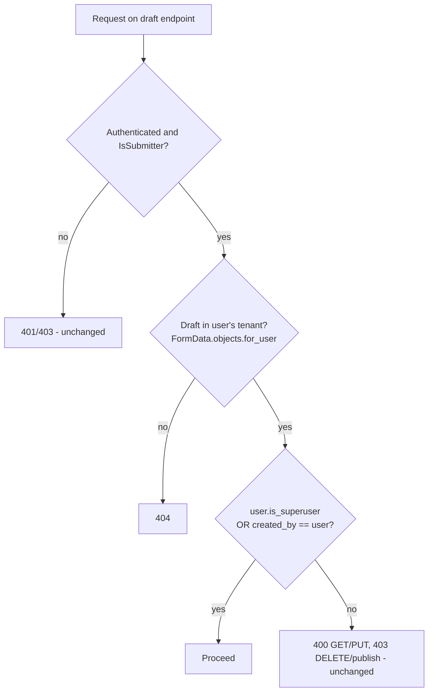

# Feature Design — Super Admin Access to All Drafts

---

## Feature: Super admin can view and manage every draft in their tenant

**Task ID**: DRAFT-459 (GitHub #459)
**Author**: Iwan F
**Date**: 2026-09-23
**Status**: Implemented

---

## 1. Context & Problem Statement

```
Currently:
- Every draft endpoint is owner-only: `created_by == request.user` is checked in
  the list query and in 4 inline checks (detail GET, PUT, DELETE, publish).
- A super admin (`SystemUser.is_superuser`) already passes `IsSubmitter` and the
  tenant filter (`for_user`). The owner check is the only thing blocking them.
- National-level super admins cannot oversee, finish or clean up drafts left by
  field staff.
- The iwsims role-subtree draft scope was never ported to akvo-mis.

Goal:
- A super admin can list, view, edit, delete and publish any draft in their
  own tenant.
- Behaviour for every other user is unchanged.
```

### Out of Scope
- Porting the iwsims role-subtree scope (admins/approvers seeing subordinate
  drafts). Tracked separately if needed.
- Audit log / notification when a super admin edits or deletes another user's
  draft.
- Mobile app draft behaviour.

---

## 2. Requirements

### Actors

| Actor | Draft access after this change |
|-------|--------------------------------|
| Super admin (`is_superuser`) | View, edit, delete, publish **any** draft in their tenant |
| Any other user (role-based) | Unchanged — own drafts only |

### User Stories

**US-1**: As a super admin, I want to see every draft for a form so I can
monitor data collection nationally.
- Given drafts created by users A and B in my tenant, when I open Manage Draft
  for that form, I see both, each with its creator's name.
- Given a draft in another tenant, I do not see it.

**US-2**: As a super admin, I want to edit and publish a field user's
unfinished draft so the data isn't lost.
- When I edit user A's draft and save, `created_by` is still user A.
- When I save user A's draft without answering the administration question,
  the draft keeps its administration, so it stays in user A's list.
- When I publish it, it goes directly to data (not pending) regardless of form
  approval settings.

**US-3**: As a super admin, I want to delete abandoned drafts.
- Deleting user A's draft returns success and removes it from the list.

**US-4**: As a submitter, my draft access is unchanged.
- I still see only my own drafts. Opening or deleting another user's draft
  is still rejected.

### User Acceptance Criteria
- [ ] A super admin opening Manage Draft sees drafts created by all users of the
      tenant for the selected form.
- [ ] The Manage Draft table shows a **Created by** column, and a
      "by <editor>" subtitle under **Last Updated**, so it is visible when a
      super admin has edited someone else's draft (audit trail).
- [ ] A super admin can open, edit, delete and publish another user's draft.
- [ ] A super admin's edit never moves another user's draft to the super
      admin's own administration (D-5).
- [ ] Publishing another user's draft as super admin goes straight to data
      (existing super admin rule), and `seed_approved_data` runs.
- [ ] A submitter still sees and handles only their own drafts.

### Technical Acceptance Criteria
- [ ] The superuser bypass is defined once and shared by all 5 code paths.
- [ ] Tenant isolation holds: another tenant's draft is 404 for a super admin.
- [ ] Non-superuser status codes are unchanged (400 on GET/PUT, 403 on
      DELETE/publish).
- [ ] No migration.
- [ ] `flake8` and frontend `eslint` pass.

---

## 3. Data Model Changes

### New Models
None.

### Modified Models
None. `FormData.created_by` / `updated_by` already exist.
`SubmitUpdateDraftFormSerializer.update()` already sets
`updated_by = context["user"]`, so a super admin's edit is attributed to them
while `created_by` keeps the original author.

### Migration Strategy
N/A — permission logic only.

---

## 4. API Contract

URLs, request bodies and response shapes are **unchanged**. Only who is
allowed through changes.

| Method | URL | Non-superuser (unchanged) | Super admin (new) |
|--------|-----|---------------------------|-------------------|
| GET | `/api/v1/draft-submissions/{form_id}/` | Own drafts | All tenant drafts for the form |
| GET | `/api/v1/draft-submission/{id}/` | Own → 200; other's → 400 | Any tenant draft → 200 |
| PUT | `/api/v1/draft-submission/{id}/` | Own → 200; other's → 400 | Any tenant draft → 200 |
| DELETE | `/api/v1/draft-submission/{id}/` | Own → 204; other's → 403 | Any tenant draft → 204 |
| POST | `/api/v1/publish-draft-submission/{id}/` | Own → 200; other's → 403 | Any tenant draft → 200 |

Out-of-tenant IDs return **404** for everyone, via the existing
`FormData.objects.for_user(user)` lookup.

The list response already carries `created_by` (full name) and `updated_by` via
`ListFormDataSerializer`:

```json
// GET /api/v1/draft-submissions/12/?page=1  (super admin)
{
  "current": 1,
  "total": 2,
  "total_page": 1,
  "data": [
    { "id": 101, "name": "Village A", "administration": "...", "created_by": "Enumerator One", "updated_by": null, "...": "..." },
    { "id": 102, "name": "Village B", "administration": "...", "created_by": "Enumerator Two", "updated_by": "Super Admin", "...": "..." }
  ]
}
```

### Access decision



---

## 5. Decision Log

### D-1: Where the superuser bypass lives

**Options Considered**:
1. Add `or request.user.is_superuser` inline at each of the 4 detail checks plus the list query.
2. One module-level helper in `v1_data/views.py`,
   `_can_manage_draft(user, draft) -> bool`, used by the 4 detail checks. The
   list view applies `created_by=user` only when `not user.is_superuser`.
3. Port the iwsims `_build_draft_scope_filter(user, access_type)` Q-builder.

**Decision**: Option 2.

**Rationale**: One definition of "who may touch this draft", with the
smallest diff. Option 3 carries role-subtree logic that #459 explicitly left
out of scope. If that scope is ported later, `_can_manage_draft` is the single
seam to extend.

**Impact**: `DraftFormDataDetailView.get/put/delete` and
`PublishDraftFormDataView.post` swap `draft.created_by_id != request.user.id`
for `not _can_manage_draft(request.user, draft)`.

### D-2: Keep existing status codes for non-superusers

**Options Considered**:
1. Switch to iwsims semantics (404 on GET/PUT out of scope).
2. Keep the current 400 / 403.

**Decision**: Option 2.

**Rationale**: Out of scope for #459, and existing tests and frontend error
handling depend on the current codes.

**Impact**: No regression in the existing draft tests.

### D-3: Super admin publish of another user's draft goes direct to data

**Options Considered**:
1. Reuse the existing rule `direct_to_data = is_superuser or not has_approval`.
2. Route through approval based on the creator's role.

**Decision**: Option 1 (confirmed by product: "full control").

**Rationale**: It matches how a super admin's own submissions already behave. A
super admin is the top of the approval chain.

**Impact**: Publishing on behalf of a field user skips approval. `created_by`
stays the field user.

### D-4: "Created by" column + "by <editor>" subtitle, shown to everyone

**Options Considered**:
1. Two new columns (Created by, Updated by). This squeezes the Name column,
   and datapoint names are long (e.g. "RWS 9 - Indonesia - Jakarta - …").
2. One new **Created by** column. The editor goes in a subtitle under the
   **Last Updated** date.
3. As option 2, but the subtitle reads "by Superadmin" when the editor is not
   the creator.

**Decision**: Option 2, shown to all users.

**Rationale**:
- One extra column keeps room for long names.
- The editor's actual name tells you *which* super admin edited, which matters
  when a tenant has more than one.
- Only a super admin can edit another user's draft, so a name that differs from
  Created by already means a super admin edited it.
- Option 3 would need a comparison. The list API returns names, not IDs, so
  comparing names breaks when two users share a name. Doing it properly needs a
  new API flag, which isn't worth it.

**Impact**: `ManageDraft.jsx` only, no API change:

```
Last Updated          | Name                         | Region  | Created by
2026-07-13 09:16 PM   | RWS 8 - Jakarta - East ...   | Jakarta | Enumerator One
by Enumerator One     |                              |         |
2026-07-10 10:49 PM   | RWS 9 - Indonesia - ...      | Jakarta | Enumerator Two
by Admin MIS          |                              |         |
```

- Last Updated cell: `updated || created` on the first line, then
  `by {updated_by || created_by}` as a secondary-text subtitle. A draft never
  edited has `updated_by = null`, so it falls back to the creator, the same way
  the date already falls back to `created`.
- New column `dataIndex: "created_by"`.
- The column label and the "by" prefix come from new `uiText` keys
  `draftCreatedByCol` ("Created by") and `draftUpdatedByPrefix` ("by").

### D-5: An edit keeps the draft's administration, not the editor's

Found during manual QA. A village admin saved a draft without answering the
administration cascade, which is optional while drafting. A super admin then
edited it, and the draft disappeared from the village admin's list.

**Cause**: `ManageDraftForm.jsx` builds `data.administration` from the
administration answer. With no answer, it fell back to
`authUser.administration.id`, the **editor's** administration. For the creator
that happens to be right. For a super admin it is the national root, so the
draft moved out of the creator's administration filter. `created_by` was not
affected.

**Options Considered**:
1. Backend: have `SubmitUpdateDraftFormSerializer` ignore `administration` when
   the editor is not the creator.
2. Frontend: when editing, fall back to the draft's own administration
   (`editData.administration`, already returned by `GET /draft-submission/{id}`)
   before the editor's.

**Decision**: Option 2.

**Rationale**: The bug is in the fallback, not the API. A super admin may still
deliberately change the administration by answering the question. New drafts
(no `editData`) keep the old fallback to the creator's own administration.

**Impact**: `ManageDraftForm.jsx` only:

```js
const fallbackAdministration =
  editData?.administration || authUser.administration.id;
```

---

## 6. Type/Constant Mappings

| Frontend | Backend | Notes |
|----------|---------|-------|
| `user.is_superuser` → CASL `can("manage","all")` | `SystemUser.is_superuser` | Already grants the `manage draft` ability in `components/can/ability.js` |
| Column `dataIndex: "created_by"` | `ListFormDataSerializer.get_created_by` | Full name string |
| Last Updated subtitle `by {updated_by \|\| created_by}` | `ListFormDataSerializer.get_updated_by` | Full name string, or `null` when never edited → fall back to creator |
| `editData.administration` (edit fallback, D-5) | `FormDataSerializer.administration` | Administration id of the draft being edited |

---

## 7. Compatibility & Migration

### Backward Compatibility
- [x] Existing API consumers unaffected (same URLs and shapes; only super admin gets wider results)
- [x] Existing data preserved
- [x] CLI tools still work

### Mobile App Impact
- [x] Sync endpoints affected: none (drafts are web-only endpoints)
- [x] SQLite schema changes: no
- [x] Version detection: N/A

### Seeder/CLI Compatibility
- [x] Existing seeders work (`fake_complete_data_seeder --draft` used by tests)
- [x] New seeder commands needed: none

---

## 8. Security Considerations

- [x] **Permission model**: bypass is gated solely on `is_superuser`. Role-based
      users gain nothing.
- [x] **Tenant isolation**: every detail lookup keeps
      `FormData.objects.for_user(user)`. The list keeps
      `Forms.objects.for_user(user)` → `form=form`. A tenant super admin cannot
      reach another tenant's drafts. Tenant-less legacy superusers keep the
      existing unscoped behaviour of `for_user`.
- [x] **Input validation**: unchanged (same serializers).
- [x] **Audit trail**: edits record `updated_by = super admin`. Answers
      re-created on edit get `Answers.created_by = super admin`, which is the
      existing behaviour for any editor. The "by <editor>" subtitle makes the
      last editor visible in the UI. A dedicated audit log (full edit history)
      is out of scope.
- [ ] **No new attack vectors**: to be verified with the cross-tenant test (§9).

---

## 9. Testing Strategy

All super admin cases live in one file,
`backend/api/v1/v1_data/tests/tests_superadmin_draft_access.py`, so they share
one setup: two submitters each create a draft through the API, plus one super
admin. The existing draft test files are unchanged and still pass (regression).

| Test Type | Coverage |
|-----------|----------|
| API — list | Super admin sees drafts from both submitters. A submitter sees only their own. |
| API — detail | Super admin GET on another user's draft → 200. Another submitter → 400. |
| API — update | Super admin PUT on another user's draft → 200. `created_by` unchanged, `updated_by == super admin`. |
| API — delete | Super admin DELETE on another user's draft → 204. Another submitter → 403. |
| API — publish | Super admin publish of another user's draft → 200, `is_draft False`, `is_pending False`, `created_by` unchanged. |
| Security | Super admin of another tenant: GET/DELETE on the draft → 404. |
| Frontend (manual) | Log in as super admin → Manage Draft lists all users' drafts with Created by. Editing another user's draft changes the Last Updated subtitle to "by <super admin name>". A draft that was never edited shows "by <creator>". Long names still wrap without crowding the other columns. Edit and save another user's draft that has no administration answer, then log in as its creator: the draft is still in their list (D-5). Publish and delete work. Log in as submitter → only own drafts. |

---

## 10. Open Questions

- [x] ~~Set `updated_by` on super admin edit?~~ Already done by `SubmitUpdateDraftFormSerializer.update()`.
- [x] ~~Does a super admin have an administration for the list filter?~~ Yes. `UserSerializer.get_administration` returns the tenant root for superusers, so `isAdministrationLoaded` resolves.
- [x] ~~Creator column visibility?~~ Everyone (D-4).
- [x] ~~Should the table also show `updated_by`?~~ Yes, for the audit trail, as a subtitle under Last Updated (D-4).

### Known issues, not fixed here
- On edit, the draft form prepends the existing name to the answer-based name
  (`ManageDraftForm.jsx`, `datapoint.name` + `names`), so the name grows on
  every save. This affects every editor, not only super admins.
- `QUESTION_TYPES.administration` is not defined in `lib/constants.js`.
  `transformers.js` and the save code only match each other because both are
  `undefined`.

---

## 11. References

- Related task: GitHub #459 (`feature/459-allowing-the-super-admin-to-view-drafts`)
- Prior art: iwsims `doc/claude/draft-submissions-scope/` (role-subtree scope, not ported)
- Tenant scoping: `doc/design/MT-003-tenant-isolation-read-filtering.md`

---

## Approval

| Role | Name | Date | Status |
|------|------|------|--------|
| Developer | Iwan F | 2026-09-23 | Approved |
| Tech Lead | | | |
| Product | | | |
