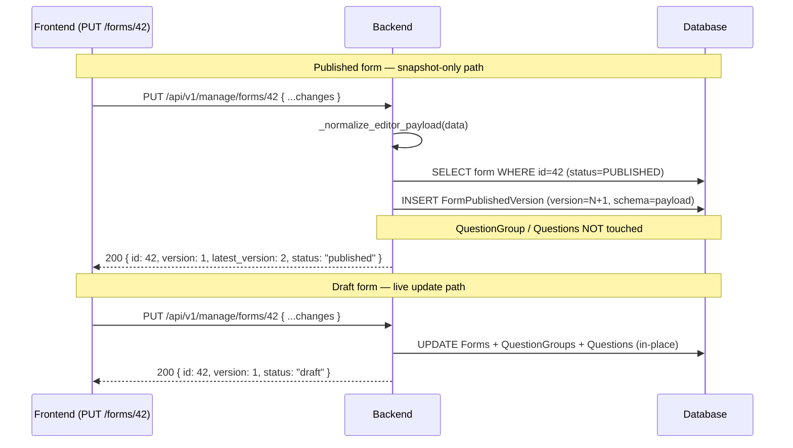
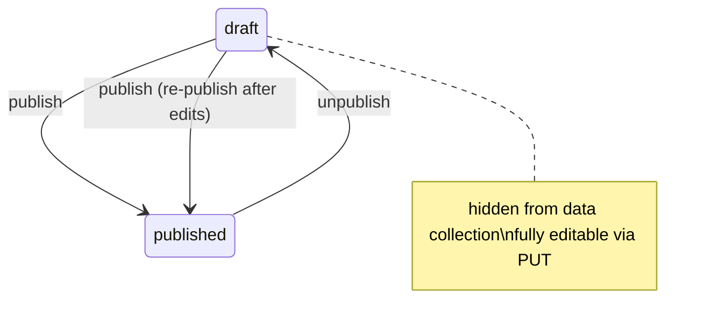

# Feature Design Document: Form Builder Backend CRUD API

**Task ID**: FB-002
**Author**: Iwan
**Date**: 2026-06-08
**Status**: Implemented

---

## 1. Context & Problem Statement

```
Currently:
- No write endpoints exist — all form changes require direct DB or seeder access
- This blocks non-developer admins from iterating on survey design
- Forms.version exists but has never been incremented; it has no meaning

Goal:
- Deliver a form lifecycle: DRAFT (editable) and PUBLISHED (live, immutable except via versioning)
- Published forms must not be mutated in-place — active submissions must reference the correct schema
- New /api/v1/manage/forms namespace for authenticated form builder CRUD
- Existing /api/v1/forms, /api/v1/form/{id}, /api/v1/form/web/{id} remain unchanged (backward compat)
```

---

## 2. Requirements

### User Acceptance Criteria

| # | Criterion |
|---|---|
| U-1 | Users can create a new form via API; it is saved as a draft |
| U-2 | Users can update a draft form (name, structure, questions) |
| U-3 | Users can publish a form to make it available for data collection |
| U-4 | Users can create a monitoring form linked to a published registration form |
| U-5 | Existing submissions remain linked to the correct form version when a form is edited post-publish |
| U-6 | Users can duplicate a form (creates a new draft copy) |
| U-7 | Users can list all versions of a form |
| U-8 | A published form can be unpublished for corrections and re-published when ready |

### Technical Acceptance Criteria

- [x] `FormStatus.draft = 1`, `FormStatus.published = 2` added to constants
- [x] `Forms.status`, `Forms.published_at`, `Forms.previous_version` fields added via migration
- [x] Existing rows default to `status=PUBLISHED` in migration
- [x] `FormBuilderViewSet(ModelViewSet)` consolidates all form builder CRUD
- [x] Five granular `FeatureAccessTypes` (form_view, form_create, form_edit, form_publish, form_delete) defined
- [x] `FormBuilderAccess(required_access)` factory in `utils/custom_permissions.py`
- [x] `_normalize_editor_payload()` translates camelCase/plural editor keys to snake_case/singular
- [x] `validate_form_payload(data, partial=False)` validates before any DB mutation
- [x] `save_form()`, `duplicate_form()`, `validate_form_payload()` in `v1_forms/functions.py`
- [x] `PUT` on published form calls `store_version_snapshot()`, returns 200 from snapshot
- [x] `PUT` on draft form updates live rows in-place
- [x] `GET /api/v1/manage/forms/{id}` on published form serves from latest snapshot (3 DB queries)
- [x] `DELETE` guarded by superuser; rejects 409 if submissions exist
- [x] `QuestionTypes.image = 8` (renamed from `photo`); `"photo"` rejected in payloads
- [x] All write operations wrapped in `@transaction.atomic`
- [x] All new endpoints have test coverage
- [x] `POST /api/v1/manage/forms` accepts optional `id` (and group/question `id`s) — uses editor-assigned IDs as PKs when provided (preserves dependency references across questions)

---

## 3. Data Model Changes

### New Constant: `FormStatus`

```python
class FormStatus:
    draft = 1
    published = 2

    FieldStr = {
        draft: "draft",
        published: "published",
    }
```

### New Fields on `Forms`

```python
status = models.IntegerField(
    choices=FormStatus.FieldStr.items(),
    default=FormStatus.draft,
)
published_at = models.DateTimeField(null=True, blank=True, default=None)
previous_version = models.ForeignKey(
    "self",
    on_delete=models.SET_NULL,
    related_name="next_versions",
    null=True,
    blank=True,
)
```

`previous_version` is separate from `parent` (monitoring ↔ registration linkage):

| FK | Purpose |
|---|---|
| `parent` | Registration ↔ Monitoring relationship (form type linkage) |
| `previous_version` | Version chain (form evolution — set on `duplicate`, not on PUT) |

### Migration

`0007_forms_previous_version_forms_published_at_and_more.py` — sets `default=2` (PUBLISHED) with `preserve_default=False` so all existing forms stay live.

---

## 4. API Contract

### URL Namespace

| Namespace | Purpose |
|---|---|
| `/api/v1/forms` | Read-only, public, flat list (backward compat for mobile/web) |
| `/api/v1/manage/forms` | Authenticated CRUD for the form builder UI |

### Full Endpoint Table

| Method | URL | Permission | Purpose |
|---|---|---|---|
| `GET` | `/api/v1/forms` | none | Flat list (existing, unchanged) |
| `GET` | `/api/v1/form/{id}` | none | Form for web/mobile rendering (existing, unchanged) |
| `GET` | `/api/v1/form/web/{id}` | none | Webform with admin cascade (existing, unchanged) |
| `GET` | `/api/v1/manage/forms` | `form_view` | Paginated list for form builder UI |
| `POST` | `/api/v1/manage/forms` | `form_create` | Create form (→ 201 draft) |
| `GET` | `/api/v1/manage/forms/{id}` | `form_view` | Get form detail |
| `PUT` | `/api/v1/manage/forms/{id}` | `form_edit` | Update form (→ 200 always) |
| `DELETE` | `/api/v1/manage/forms/{id}` | superuser | Delete form (409 if submissions exist) |
| `POST` | `/api/v1/manage/forms/{id}/publish` | `form_publish` | Publish/activate latest snapshot |
| `POST` | `/api/v1/manage/forms/{id}/unpublish` | `form_publish` | Hide from data collection (status → draft) |
| `POST` | `/api/v1/manage/forms/{id}/duplicate` | `form_create` | Clone as new draft |
| `GET` | `/api/v1/manage/forms/{id}/versions` | `form_view` | List all `FormPublishedVersion` snapshots |
| `GET` | `/api/v1/manage/forms/{id}/versions/{version_id}` | `form_view` | Single snapshot + full `schema` JSON |
| `POST` | `/api/v1/manage/forms/{id}/activate/{version_id}` | `form_publish` | Set specific published version as active |

### Request Payload (`FormCreateSerializer` contract)

```json
{
  "name": "Household Survey 2026",
  "type": "registration",
  "question_group": [
    {
      "id": null,
      "name": "household_information",
      "label": "Household Information",
      "order": 1,
      "repeatable": false,
      "repeat_text": null,
      "question": [
        {
          "id": null,
          "order": 1,
          "label": "Head of Household Name",
          "short_label": null,
          "name": "head_of_household_name",
          "type": "input",
          "meta": true,
          "required": true,
          "rule": null,
          "dependency": null,
          "dependency_rule": "AND",
          "api": null,
          "extra": null,
          "tooltip": null,
          "fn": null,
          "pre": null,
          "display_only": false,
          "option": []
        }
      ]
    }
  ]
}
```

- `type`: `1`/`2` (int) or `"registration"`/`"monitoring"` (string); defaults to `1` if omitted
- `"image"` is the only accepted type string for photo questions (`"photo"` rejected)
- `"entity"` is **not** a valid type — send `type: "cascade"` with `extra: {"type": "entity"}`

### Response Format (`FormDetailSerializer`)

```json
{
  "id": 42,
  "name": "Household Survey 2026",
  "version": 1,
  "status": "draft",
  "published_at": null,
  "active_version_id": null,
  "type": 1,
  "approval_instructions": null,
  "parent": null,
  "question_group": [
    {
      "id": 1,
      "name": "household_information",
      "question": [
        { "id": 10, "type": "input", "label": "Head of Household Name", "disable_delete": null },
        { "id": 11, "type": "number", "label": "Age", "disable_delete": true }
      ]
    }
  ]
}
```

`disable_delete: true` when answers exist (follows akvo-form-service pattern — editor disables delete button).

### PUT Behavior by Status



**Invariant**: live question rows always equal the active version. Only `activate()` and first publish modify them.

### Form Lifecycle



### Helper Functions in `functions.py`

| Function | Purpose |
|---|---|
| `save_form(data, instance=None)` | Create DRAFT or update draft live rows in-place; atomic |
| `store_version_snapshot(form, data, user)` | Published form PUT: store payload as `FormPublishedVersion` without touching live rows; atomic |
| `create_published_version(form, user, activate=False)` | Build snapshot from live rows; when `activate=True` sets `active_version`, `version`, `status`, `published_at`; atomic |
| `restore_from_snapshot(form, pv)` | Two-pass rollback: soft-delete absent rows, restore/create snapshot rows; atomic |
| `_build_schema_snapshot(form)` | Build immutable schema JSON from live rows (3 queries via `prefetch_related`) |
| `duplicate_form(original_form)` | Deep copy as new DRAFT; atomic |
| `validate_form_payload(data, partial=False)` | Return list of error strings before touching DB |
| `_form_detail_from_snapshot(form, pv)` | Build `FormDetailSerializer`-shaped response from snapshot JSON (batch `disable_delete` check) |

---

## 5. Decision Log

### D-1: Always In-Place PUT

**Options**: (1) Version-on-edit — PUT on published creates new draft record; (2) Always in-place — PUT updates same record, returns 200.

**Decision**: Always in-place (option 2).

**Rationale**: Version-on-edit created a new form record on every PUT of a published form, leaving stale duplicates in the list and forcing the frontend to handle two response codes (200 vs 201) and navigate to a new form ID. Data integrity is protected by the "can't delete answered questions" guard in `_save_questions`. Auto-incrementing `version` via snapshot gives traceability without creating new rows.

---

### D-2: `parent` FK vs `previous_version` FK — Separate Fields

`parent` already means "monitoring form linked to registration form". Overloading it to also mean "previous version" would make queries ambiguous.

**Decision**: Add a separate `previous_version` FK.

---

### D-3: Rename `photo` → `image` in `QuestionTypes`

`akvo-react-form-editor` emits `"image"`. `akvo-form-service` uses `image = 8`. The old `photo = 8` was akvo-mis-specific.

**Decision**: Rename `photo = 8` → `image = 8`. No DB migration needed (integer value unchanged). `"photo"` is no longer accepted in API payloads.

---

### D-4: Delete Strategy — Reject if Submissions Exist

**Options**: (1) Hard delete cascade; (2) Soft delete/archive; (3) Reject if submissions exist, hard delete otherwise.

**Decision**: Option 3 — 409 Conflict if form has submissions; hard delete otherwise.

**Rationale**: Cascade-deleting a form with submissions would orphan `FormData` records. Full archive pattern adds complexity not required here.

---

### D-5: Unique Constraint on `(form, name)` — Slugify with Positional Suffix

If `name` is absent in the payload, backend generates: `slugify(label)` + `_1`, `_2` suffix on collision. Provided `name` that collides → 400.

---

### D-6: Plain Function Helpers Instead of Sub-Serializers

DRF sub-serializers for nested writes couple serialization concerns with ORM mutation.

**Decision**: Plain `@transaction.atomic` helper functions in `functions.py`. Serializers are read-only response shapes only. `validate_form_payload` is separate from `save_form`.

---

### D-7: Protect Answered Questions/Groups from Deletion

Follow akvo-form-service pattern: check `Answers.objects.filter(question_id__in=qids).count()` before any delete. Raise 400 with:
```json
{"message": "Can't delete question", "details": "Question {id} has answers"}
```

Applies both to `PUT` (groups/questions removed from payload) and `DELETE` (form-level).

---

### D-8: `validate_form_payload(data, partial=False)`

- `partial=False` (create): `name` required; `type` optional (defaults to `registration`).
- `partial=True` (update): both optional; `question_group` only processed when key is present.
- Type validation: `getattr(QuestionTypes, q_type, None)` — exact lowercase attribute name required.

---

### D-9: Granular Permission Foundation for FB-009

Five granular `FeatureAccessTypes` defined now so FB-009 only needs a role management UI — no backend schema changes later.

| Access Type | Constant | Guards |
|---|---|---|
| `form_view` | 3 | GET list, retrieve, versions |
| `form_create` | 4 | POST create, duplicate |
| `form_edit` | 5 | PUT update |
| `form_publish` | 6 | POST publish, unpublish, activate |
| `form_delete` | 7 | DELETE (superuser gate still applies) |

---

### D-10: `FormBuilderViewSet(ModelViewSet)`

Consolidates all form builder CRUD into one class with `get_permissions()` dict. Eliminates `_handle_create_form` workaround and per-method inline permission checks.

`GET /api/v1/forms` (`list_form`) is retained as a standalone `@api_view(["GET"])` for backward compat — flat array, no auth, no pagination.

URL patterns use manual `re_path` (no DRF router) to maintain `/manage/forms/...` prefix.

---

### D-11: Null-Safe Defaults for `dependency_rule` and `display_only`

Editor emits `null` for absent fields. `q_data.get("dependency_rule", "AND")` does NOT use the default when the key is present with `null`.

**Decision**: Use `or` fallback: `q_data.get("dependency_rule") or "AND"`, `q_data.get("display_only") or False`.

---

### D-12: Publish / Unpublish via Existing `status` Field — No New Column

**`unpublish` is a compound action** (atomic):
1. Returns 400 if `form.status != published`.
2. Auto-activates latest snapshot if there are unactivated PUT snapshots (live rows = latest intended state).
3. Sets `status=draft`.

Without step 2, an admin who PUT three times (v1→v2→v3 snapshots, v1 active) and then unpublishes would edit from v1's stale live rows.

**`publish` handles all transitions**:
- Draft, never published: create snapshot, set `status=published`, `published_at=now()`.
- Draft, re-publish after unpublish: create snapshot, restore `status=published`. `published_at` NOT overwritten (guard: `form.published_at is None`).
- Already published + pending snapshots: activate latest snapshot.
- Already published, nothing pending: no-op.

---

### D-13: Server-Side Batching — No Frontend Chunking

Production forms can have 100+ questions and 200+ options. All performance fixes are server-side. Frontend sends one complete payload per save.

| Operation | Fix |
|---|---|
| Published PUT (`store_version_snapshot`) | O(1) — one INSERT into `FormPublishedVersion` |
| GET published form | O(1) — reads one snapshot row via `_form_detail_from_snapshot` |
| `_build_schema_snapshot` (first publish) | `prefetch_related("question_group_question__options")` — 3 queries |
| Draft PUT (`save_form`) | `filter(id__in=ids).in_bulk()` before loop; batch option delete |
| `restore_from_snapshot` | Pre-load all groups + questions in 2 queries; dict by ID in loop |

Payload size (~75–150 KB) is well within Django's 2.5 MB `DATA_UPLOAD_MAX_MEMORY_SIZE`. No chunking required.

---

## 6. Type/Constant Mappings

| API Type String | Backend Constant | DB Value | Notes |
|----------------|------------------|----------|-------|
| `input` | `QuestionTypes.input` | 13 | |
| `number` | `QuestionTypes.number` | 4 | |
| `text` | `QuestionTypes.text` | 3 | |
| `date` | `QuestionTypes.date` | 9 | |
| `option` | `QuestionTypes.option` | 5 | |
| `multiple_option` | `QuestionTypes.multiple_option` | 6 | |
| `cascade` | `QuestionTypes.cascade` | 7 | Generic cascade (no `extra.type`) |
| `administration` | `QuestionTypes.cascade` | 7 | `extra.type="administration"` |
| `entity` | `QuestionTypes.cascade` | 7 | `extra.type="entity"` |
| `image` | `QuestionTypes.image` | 8 | Renamed from `photo` |
| `geo` | `QuestionTypes.geo` | 1 | |
| `autofield` | `QuestionTypes.autofield` | 10 | |
| `attachment` | `QuestionTypes.attachment` | 11 | |
| `signature` | `QuestionTypes.signature` | 12 | |
| `geoshape` | `QuestionTypes.geoshape` | 14 | |
| `geotrace` | `QuestionTypes.geotrace` | 15 | |

See [[FB-002A]] for the full `administration`/`cascade`/`entity` semantic mapping.

---

## 7. Compatibility & Migration

### Backward Compatibility

- `GET /api/v1/forms` (flat list) — unchanged; adds `status` and `version` fields
- `GET /api/v1/form/{id}` — unchanged; used by mobile/web form rendering
- `GET /api/v1/form/web/{id}` — unchanged; used by web form submission page
- Existing `Forms` rows: migration sets `status=PUBLISHED` with `preserve_default=False`

### Renamed Constant Impact

- `QuestionTypes.photo = 8` → `QuestionTypes.image = 8` — all codebase usages updated
- No DB migration needed (integer value unchanged)

### Files Changed

| File | Change |
|---|---|
| `backend/api/v1/v1_forms/constants.py` | Add `FormStatus`; rename `photo → image` |
| `backend/api/v1/v1_forms/models.py` | Add `status`, `published_at`, `previous_version` to `Forms` |
| `backend/api/v1/v1_forms/migrations/0007_*.py` | Add fields; `status` default=2 |
| `backend/api/v1/v1_forms/functions.py` | New file: all helper functions |
| `backend/api/v1/v1_forms/serializers.py` | `ListFormSerializer`, `FormDetailSerializer`, `FormDetailQuestionSerializer`, `FormPublishedVersionSerializer` |
| `backend/api/v1/v1_forms/views.py` | `FormBuilderViewSet`; `_normalize_editor_payload` |
| `backend/api/v1/v1_forms/urls.py` | Add `/manage/forms/...` routes |
| `backend/utils/custom_permissions.py` | `FormBuilderAccess` factory |
| `backend/api/v1/v1_profile/constants.py` | Five `FeatureAccessTypes` |

---

## 8. Security Considerations

- [x] `FormBuilderAccess(required_access)` factory enforces per-action permission checks
- [x] All write endpoints require authentication (`IsAuthenticated`)
- [x] `DELETE` gated to superuser only
- [x] Granular access types (`form_view`, `form_create`, `form_edit`, `form_publish`, `form_delete`) isolate privileges
- [x] Answered questions protected from deletion (prevents answer orphaning)
- [x] `validate_form_payload` called before any DB mutation — rejects unknown question types

---

## 9. Testing Strategy

Tests in `backend/api/v1/v1_forms/tests/`:

| File | TestCase | Covers |
|---|---|---|
| `tests_manage_form_list.py` | `ManageFormListTestCase` | GET flat list + paginated + retrieve |
| `tests_manage_form_create.py` | `ManageFormCreateTestCase` | POST create |
| `tests_manage_form_update.py` | `ManageFormUpdateTestCase` | PUT draft/published, add/edit/delete question/option |
| `tests_manage_form_soft_delete.py` | `ManageFormSoftDeleteTestCase` | allow_delete guard, soft vs hard delete |
| `tests_manage_form_publish.py` | `ManageFormPublishTestCase` | publish, duplicate, versions, activate |
| `tests_manage_form_snapshot_put.py` | `ManageFormSnapshotPutTestCase` | snapshot PUT on published; unpublish/edit/republish; published_at preservation |
| `tests_manage_form_versions.py` | `ManageFormVersionDetailTestCase` | GET versions/{version_id} — 10 tests |
| `tests_manage_form_delete.py` | `ManageFormDeleteTestCase` | DELETE with/without submissions |

```bash
./dc.sh exec backend python manage.py test \
  api.v1.v1_forms.tests.tests_manage_form_list \
  api.v1.v1_forms.tests.tests_manage_form_create \
  api.v1.v1_forms.tests.tests_manage_form_update \
  api.v1.v1_forms.tests.tests_manage_form_soft_delete \
  api.v1.v1_forms.tests.tests_manage_form_publish \
  api.v1.v1_forms.tests.tests_manage_form_snapshot_put \
  api.v1.v1_forms.tests.tests_manage_form_versions \
  api.v1.v1_forms.tests.tests_manage_form_delete
```

---

## 10. Open Questions

- None. All Groups A–J implemented and tested.

---

## 11. References

- Superseded by: [[FB-002B]] (version schema — published version snapshots, soft-delete)
- Frontend consumer: [[FB-003]] (form builder frontend integration)
- Permission expansion: FB-009 (role management UI — no backend changes needed)
- Reference implementation: `example/akvo-form-service/backend/akvo/core_forms/`
- Branch: `feature/229-fb-002-implement-backend-form-crud-api`
- GitHub Issue: #229

---

## Approval

| Role | Name | Date | Status |
|------|------|------|--------|
| Developer | Iwan | 2026-06-08 | Implemented |
| Tech Lead | | | |
