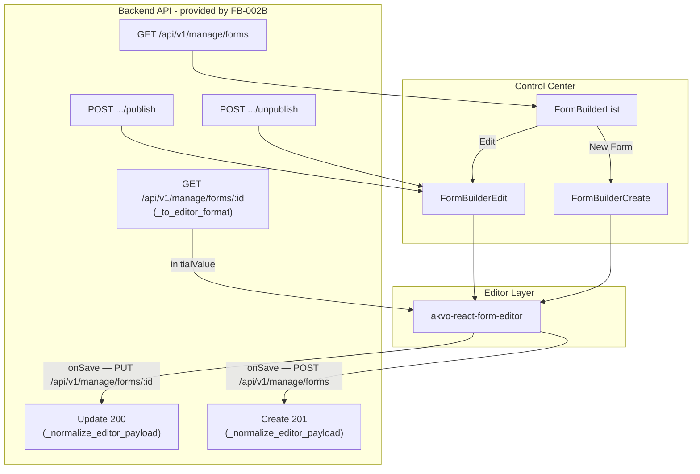
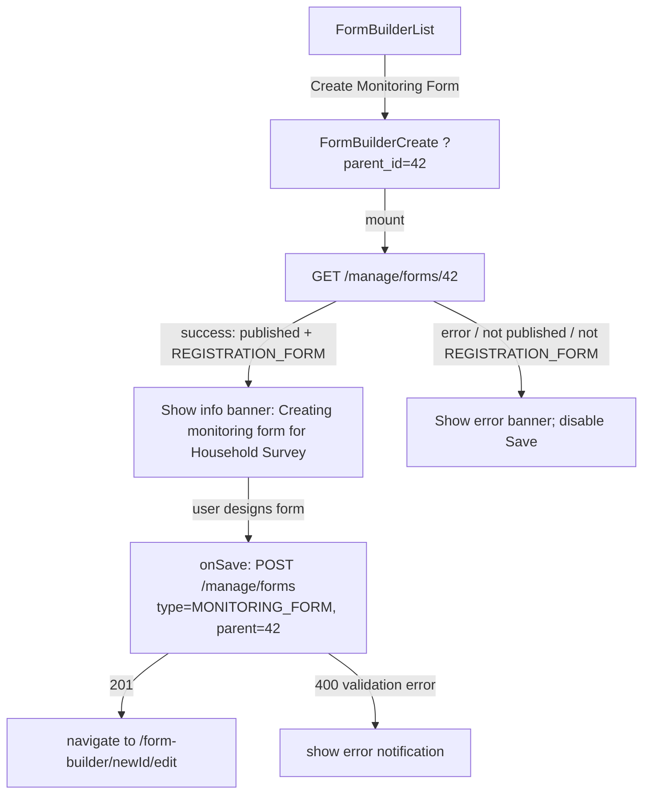
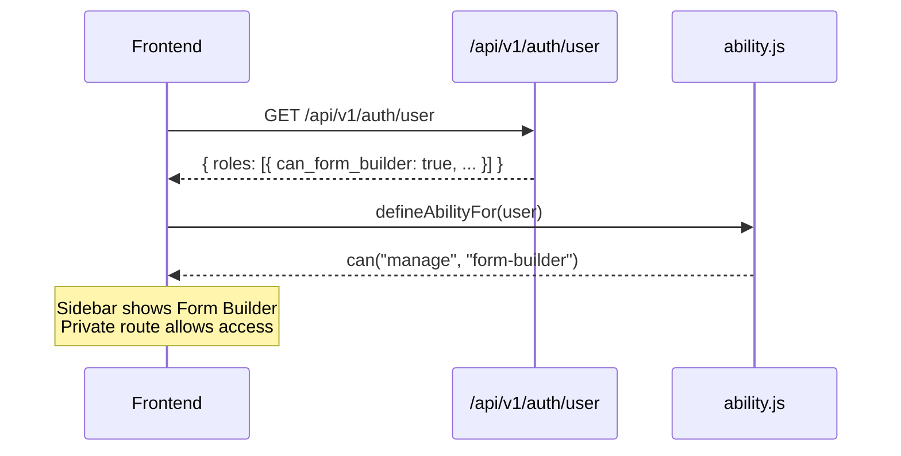

# Feature Design Document: Form Builder Frontend Integration

**Task ID**: FB-003
**Author**: Iwan
**Date**: 2026-06-08


```
Currently:
- Forms are defined only through backend seeders and raw JSON files
- No in-product UI for creating or editing forms
- Every form change requires developer access to the backend
- This blocks non-developer admins from iterating on survey design

Goal:
- Integrate akvo-react-form-editor into the Control Center
- Give users with form-builder permission a visual editor to create and edit forms
- Consume the real CRUD API delivered in FB-002/FB-002B
- No mock backend — this branch calls real endpoints after FB-002B is merged

Scope (frontend only):
- ability.js: add can("manage", "form-builder") rule using can_form_builder flag
- Pages: implement FormBuilderList, FormBuilderCreate, FormBuilderEdit
- ~~Lib: create form-builder-transform.js with editorToApi() and apiToEditor()~~ — **Deleted** (see D-13); backend now handles all transforms via `_to_editor_format` + `_normalize_editor_payload`
- Monitoring Form Flow: FormBuilderCreate supports `?parent_id` URL param; FormBuilderList adds "Create Monitoring Form" action; backend validates parent form (see D-14–D-17)
```

Already done in FB-002B (no changes needed in this branch):
- Routes `/control-center/form-builder`, `.../create`, `.../:formId/edit` — `App.js`
- Sidebar nav item with CASL check — `sidebar/index.jsx`
- `menuFormBuilder` UI text key — `ui-text.js`
- `akvo-react-form-editor@^2.0.3` installed — `frontend/package.json`
- Backend `FeatureTypes.form_builder = 2` and five granular `FeatureAccessTypes`
- `can_form_builder` field in `UserRoleSerializer`

---

## 2. Requirements

### User Acceptance Criteria

| # | Criterion |
|---|---|
| U-1 | Form Builder is accessible from the Control Center sidebar |
| U-2 | Only users with form-builder permission (and superusers) can access it |
| U-3 | Users can create a new form using the visual editor |
| U-4 | Users can edit existing forms using the visual editor |
| U-5 | Save operations show a loading state while the request is in flight |
| U-6 | Successful save shows a success notification |
| U-7 | Failed save shows an error notification with a message |
| U-8 | Users can preview the form while editing (built into the editor component) |
| U-10 | Form Builder list shows all forms with name, type, and status (Draft / Published) |
| U-11 | When editing a published form, users see an info banner about version snapshots |
| U-12 | Users can unpublish and re-publish a form |
| U-13 | Navigating to `/control-center/form-builder/create?parent_id=42` opens the form creator pre-configured for a monitoring form |
| U-14 | An info banner shows the parent form name: "Creating monitoring form for: {parentFormName}" |
| U-15 | On save, the form is created as `type=monitoring` with `parent=42` |
| U-16 | If the parent form ID is invalid, deleted, unpublished, or not a registration form, the page shows an error and blocks saving |
| U-17 | A "Create Monitoring Form" link/button exists on the FormBuilderList for each published registration form |
| U-18 | Navigating to the create page without `parent_id` retains the existing registration form behaviour |

### Functional Requirements

- **FR-1** Permission gate: `ability.js` grants `can("manage", "form-builder")` when any role has `can_form_builder: true`
- **FR-2** `FormBuilderList`: paginated table from `GET /api/v1/manage/forms`, status badge, Edit action, New Form button
- **FR-3** `FormBuilderCreate`: editor with `POST /api/v1/manage/forms`; navigate to edit page on success; pass `settingCascadeURL={ARF_CASCASE_URLS}` to `WebformEditor`
- **FR-4** `FormBuilderEdit`: fetch/transform on mount; PUT save; publish/unpublish buttons; info banner for published forms; pass `settingCascadeURL={ARF_CASCASE_URLS}` to `WebformEditor`
- **FR-5** ~~`form-builder-transform.js`~~ — **Deleted**. Backend handles all transforms. Frontend sends editor `onSave` output directly to the backend and uses `GET /manage/forms/{id}` response directly as `initialValue` (no JS conversion needed). See [[FB-002]] D-15.
- **FR-6** Publish: `POST .../publish` for draft→published and re-publish; activates pending snapshot when already published
- **FR-7** Unpublish: `POST .../unpublish`; same Publish button doubles as re-publish
- **FR-8** Version History Drawer: lazy-loaded, `GET .../versions`, Set Active with Popconfirm, Refresh button, client-side pagination (pageSize=10)
- **FR-9** Version Preview: `GET .../versions/{version_id}`, null-first editor remount, dismissible preview banner, "Back to saved" button
- **FR-10** Monitoring Form Flow: `FormBuilderCreate` reads `parent_id` from `useSearchParams()`; fetches parent form on mount; shows info banner with parent name or error state; injects `{type:2, parent:N}` in save payload; `FormBuilderList` shows "Create Monitoring Form" button for published registration rows

### Non-Functional Requirements

| # | Requirement |
|---|---|
| NF-1 | ~~Auto-save to localStorage~~ — **Removed** (see D-18); `akvo-react-form-editor` does not expose an `onChange` hook suitable for reliable auto-save |
| NF-2 | ~~Transformer is pure JS~~ — N/A; transforms moved to backend (see D-13) |
| NF-3 | All code passes `yarn lint` and `yarn prettier` in the frontend container |
| NF-4 | No `// eslint-disable-next-line` comments — fix code to satisfy rules |
| NF-5 | Single complete payload per save. No chunking or partial saves. |
| NF-6 | All user-visible strings in `ui-text.js` under `formBuilder*` keys |

### Technical Acceptance Criteria

- [x] `ability.js` grants form builder access from `can_form_builder` role field
- [x] ~~`editorToApi()` / `apiToEditor()`~~ — Deleted; transforms moved to backend `_to_editor_format` + `_normalize_editor_payload`
- [x] Both `FormBuilderCreate` and `FormBuilderEdit` pass `settingCascadeURL={ARF_CASCASE_URLS}` to `WebformEditor`
- [x] `FormBuilderList` renders status badge, pagination, empty state, loading skeleton
- [x] `FormBuilderCreate` navigates to edit on success (no localStorage)
- [x] `FormBuilderEdit` loads form, shows info banner when published, PUT+publish+unpublish work
- [x] ~~Stale draft detection~~ — removed; no localStorage
- [x] Version History Drawer opens on demand, Set Active calls activate endpoint
- [x] Version Preview remounts editor with snapshot content; Back to saved restores real state
- [x] Reusable `FormStatusTag`, `FormEditorBanners`, `VersionHistoryDrawer` components

**Monitoring Form Flow:**
- [x] `FormBuilderCreate` reads `parent_id` from `useSearchParams()`
- [x] When `parent_id` is present, fetch `GET /api/v1/manage/forms/{parent_id}` on mount; set error state if not found / not published / not `REGISTRATION_FORM`
- [x] `FormEditorBanners` renders info Alert (`infoBannerText`) and error Alert (`errorBannerText`) for parent form state
- [x] `onSave` payload includes `{ parent: Number(parent_id), type: MONITORING_FORM }` when `parent_id` is present; save button disabled when `parentError` is true
- [x] `FormBuilderList` adds "Create Monitoring Form" button for rows where `status === "published"` and `type === REGISTRATION_FORM`
- [x] Backend `validate_form_payload` validates `parent` references a published registration form (`type=FormTypes.registration`); returns 400 with `{"message": "Parent must be a published registration form"}` on failure

---

## 3. Data Model Changes

No new models. This is a frontend-only spec. All backend models are provided by [[FB-002]] and [[FB-002B]].

---

## 4. API Contract

All endpoints provided by FB-002B. This section documents what the frontend calls and expects.

### Endpoints Consumed

| Method | URL | When called |
|---|---|---|
| `GET` | `/api/v1/manage/forms` | `FormBuilderList` on mount |
| `POST` | `/api/v1/manage/forms` | `FormBuilderCreate` save |
| `GET` | `/api/v1/manage/forms/{id}` | `FormBuilderEdit` on mount |
| `PUT` | `/api/v1/manage/forms/{id}` | `FormBuilderEdit` save |
| `POST` | `/api/v1/manage/forms/{id}/publish` | Publish button |
| `POST` | `/api/v1/manage/forms/{id}/unpublish` | Unpublish button |
| `GET` | `/api/v1/manage/forms/{id}/versions` | Drawer on open |
| `GET` | `/api/v1/manage/forms/{id}/versions/{version_id}` | Version Preview |
| `POST` | `/api/v1/manage/forms/{id}/activate/{version_id}` | Set Active button |

### Architecture Overview



### Save UX Flow (Published Form)

```mermaid
sequenceDiagram
    participant User
    participant FE as FormBuilderEdit
    participant API as Backend

    User->>FE: Opens form (status=published, version=1)
    FE->>FE: Shows info banner
    User->>FE: Makes changes, clicks Save
    FE->>API: PUT /api/v1/manage/forms/42
    API-->>FE: 200 { version: 1, latest_version: 2, status: "published" }
    note over API,FE: Snapshot v2 stored; active_version still v1
    FE->>FE: message.success("Form saved"), update latest_version

    User->>FE: Clicks Publish
    FE->>API: POST /api/v1/manage/forms/42/publish
    API-->>FE: 200 { version: 2, latest_version: 2, status: "published" }
    FE->>FE: message.success("Form published"), update version state
```

### Data Mapping: Editor → Backend (`_normalize_editor_payload`)

The backend handles all camelCase → snake_case conversion. Frontend sends editor `onSave` output unchanged.

| Editor emits | Backend stores | Handler |
|---|---|---|
| `name` | `name` | passed through |
| `description` | `description` | passed through |
| `displayOnly` | `display_only` | `_CAMEL_FIELDS` |
| `shortLabel` | `short_label` | `_CAMEL_FIELDS` |
| `dependencyRule` | `dependency_rule` | `_CAMEL_FIELDS` |
| `variableName` | `variable_name` | `_CAMEL_FIELDS` |
| `variable` | `variable_name` | explicit rename (round-trip from `_to_editor_format`) |
| `questionGroupId` | _(removed)_ | `q.pop("questionGroupId", None)` |
| `pre: {}` | `pre: null` | `_normalize_editor_payload` |
| cascade + admin endpoint | `cascade + extra.type="administration"` | TODO — Part 1 of [[FB-002A]] |
| `question_groups` | `question_group` | key alias |
| group `repeatText` | `repeat_text` | key alias |

### Data Mapping: Backend → Editor (`_to_editor_format`)

The backend applies `_to_editor_format` to all manage-endpoint responses. Frontend uses responses directly as `initialValue` with no JS transformation.

```
Backend field                 → Editor initialValue field
──────────────────────────────────────────────────────────
id, name, version             → passed through
description                   → passed through
latest_version, status        → page: version badge / publish button state
published_at                  → page: draft stale check
active_version_id             → page: version history drawer
default_language              → defaultLanguage
variable_name                 → variable  (editor reads question.variable)
short_label                   → shortLabel
display_only                  → displayOnly
dependency_rule               → dependencyRule
hidden_string                 → hiddenString
required_double_entry         → requiredDoubleEntry
addon_before                  → addonBefore
addon_after                   → addonAfter
data_api_url                  → dataApiUrl
disable_delete                → disableDelete
```

### Frontend Component Structure

```
frontend/src/
├── pages/form-builder/
│   ├── FormBuilderList.jsx            — table, status badge, New Form button; "Create Monitoring Form" for published registration rows
│   ├── FormBuilderCreate.jsx          — editor + POST save + auto-save + draft restore; ?parent_id monitoring flow
│   ├── FormBuilderEdit.jsx            — editor + PUT save + Publish + Unpublish + Versions
│   ├── style.scss                     — .version-row-active highlight
│   └── components/
│       ├── index.js                   — barrel export
│       ├── FormStatusTag.jsx          — Published/Draft Tag
│       ├── FormEditorBanners.jsx      — preview / info / error Alert group; no draft banner
│       └── VersionHistoryDrawer.jsx   — Drawer + Table + Activate/Preview actions
├── lib/
│   ├── constants.js                   — ARF_CASCASE_URLS (re-exported via lib/index.js)
│   └── ui-text.js                     — 40+ formBuilder* keys
└── components/can/
    └── ability.js                     — add can("manage", "form-builder") rule

Deleted:
  frontend/src/lib/form-builder-transform.js   — transforms moved to backend
```

---

### Monitoring Form Flow

#### User Flow



#### `FormBuilderCreate.jsx` Changes

```jsx
import { useSearchParams } from "react-router-dom";
import { REGISTRATION_FORM, MONITORING_FORM } from "../../lib/constants";

const [searchParams] = useSearchParams();
const parentId = searchParams.get("parent_id");

const [parentForm, setParentForm] = useState(null);
const [parentError, setParentError] = useState(false);

// Read from global store first (populated by FormBuilderList)
const formFromStore = FormBuilderState.useState((s) =>
  s.forms.find((f) => f.id === Number(parentId))
);

const loadParentForm = useCallback(() => {
  if (!parentId) {
    return;
  }
  if (formFromStore) {
    if (formFromStore.status !== "published" || formFromStore.type !== REGISTRATION_FORM) {
      setParentError(true);
    } else {
      setParentForm(formFromStore);
    }
    return;
  }
  // Fall back to API fetch for direct URL navigation / page refresh
  api
    .get(`/manage/forms/${parentId}`)
    .then((res) => {
      if (res.data.status !== "published" || res.data.type !== REGISTRATION_FORM) {
        setParentError(true);
      } else {
        setParentForm(res.data);
      }
    })
    .catch(() => setParentError(true));
}, [parentId, formFromStore]);

useEffect(() => {
  loadParentForm();
}, [loadParentForm]);

// onSave — inject parent + type when parentId is present:
const onSave = (editorOutput) => {
  const payload = parentId
    ? { ...editorOutput, type: MONITORING_FORM, parent: Number(parentId) }
    : editorOutput;
  api.post("/manage/forms", payload).then(...);
};
```

#### `FormEditorBanners.jsx` Extension

Add a `parentFormName` prop. When present, render an info Alert above the editor:

```jsx
{parentFormName && (
  <Alert
    type="info"
    message={text.formBuilderMonitoringFor(parentFormName)}
    style={{ marginBottom: 8 }}
  />
)}
```

#### `FormBuilderList.jsx` Changes

Add a "Create Monitoring Form" action to each row where `form.status === "published"` and `form.type === 1`:

```jsx
<Button
  size="small"
  onClick={() =>
    navigate(`/control-center/form-builder/create?parent_id=${form.id}`)
  }
>
  {text.createMonitoringForm}
</Button>

Shown only when `form.status === "published" && form.type === REGISTRATION_FORM`.
```

#### Backend Validation (to add to `validate_form_payload`)

```python
if data.get("parent"):
    parent = Forms.objects.filter(
        pk=data["parent"],
        status=FormStatus.published,
        type=FormTypes.registration,
    ).first()
    if not parent:
        errors.append("Parent must be a published registration form")
```

#### UI Text Keys (to add to `ui-text.js`)

```js
formBuilderMonitoringFor: (name) => `Creating monitoring form for: ${name}`,
formBuilderParentFormError: "Parent form not found or not published. Cannot create monitoring form.",
createMonitoringForm: "Create Monitoring Form",
```

---

## 5. Decision Log

### D-1: Navigate to `response.data.id` on Create Success

After `POST /api/v1/manage/forms`, navigate to `/control-center/form-builder/${response.data.id}/edit`. PUT always returns 200 with the same `id` — no navigation after save.

---

### D-2: No Mock Backend

FB-002B is the prerequisite. This branch calls real endpoints. No `msw`, `json-server`, or mock server. Cannot be tested end-to-end until FB-002B is merged.

---

### D-3: `image` is the Canonical Type — No Alias Needed

Both `akvo-react-form-editor` and the backend use `"image"`. No transform needed — passes through `_normalize_editor_payload` unchanged.

---

### D-4: ~~Auto-Save to localStorage~~ — **Removed**

**Original design**: debounced localStorage writes on every `onSave` call.

**Decision**: Deleted entirely.

**Why**: `akvo-react-form-editor` does not expose an `onChange` hook suitable for reliable auto-save. The only stable hook is `onSave` (triggered by user clicking Save). Simulating auto-save via `onSave` would require injecting a hidden timer — fragile and likely to trigger spurious saves mid-edit. Without a proper change hook, the draft state would be stale or incorrect more often than not. All localStorage draft code (`draftKey`, `draftRestored`, `onResetDraft`, `draftTimerRef`) removed from `FormBuilderCreate` and `FormBuilderEdit`; draft props removed from `FormEditorBanners`.

---

### D-5: `akvo-react-form-editor/dist/index.css` Imported in `App.js`

Imported once globally to avoid FOUC.

---

### D-6: Snapshot vs In-Place for Published Forms

`PUT` on a published form does NOT touch live `QuestionGroup`/`Questions` rows. Response carries:
- `version` (active, unchanged) — "live version"
- `latest_version` (incremented) — "pending version"

Info banner text should reflect this: "Changes saved as snapshot v{latest_version}. Click Publish to activate."

---

### D-7: Draft PUT vs Published PUT Behaviour

| Form status | What PUT does | Live rows change? | Snapshot created? |
|---|---|---|---|
| `draft` | Updates live rows in-place | ✅ Yes | ❌ No |
| `published` | Stores snapshot only | ❌ No | ✅ Yes |

Frontend does not need different code paths — same PUT call, same 200 response shape.

---

### D-8: Version History Drawer (originally FB-003B, moved into FB-003)

- **Versions button** shown when `formStatus === "published"` or versions already fetched.
- Clicking opens a `Drawer` and calls `GET .../versions` on demand (lazy).
- **Set Active** button (non-active rows) behind Popconfirm: calls `POST .../activate/{version_id}` → success clears draft, sets `initialValue=null`, re-fetches form, remounts editor.
- `loadForm` wrapped in `useCallback([formId])` to satisfy `react-hooks/exhaustive-deps`.
- **Pagination**: `{ pageSize: 10, hideOnSinglePage: true }` — client-side.
- **Active row**: `rowClassName` applies `.version-row-active` (green-1 background); no Preview button on active row.

---

### D-9: Version Preview — Editor Reload via Null-First Pattern

`WebformEditor` ignores `initialValue` prop changes after mount. Passing `null` unmounts the editor (renders `<Spin>`); the next non-null value triggers a fresh mount.

**`onPreview` flow**:
1. Set `previewLoadingId = record.id` (spinner on button).
2. Save `prevValue = initialValue` for error recovery.
3. `setInitialValue(null)` — unmount editor immediately.
4. Fetch `GET .../versions/{record.id}`.
5. On success: `setInitialValue({...schema, id, status, latest_version, active_version_id: null})` → remount (schema already in editor camelCase format via `_to_editor_format` on `version_detail` endpoint).
6. On error: `setInitialValue(prevValue)` — restore previous editor state.
7. Set `previewingVersion = { id, version }` → preview banner shown.
8. Drawer closes.

**"Back to saved"** (`onExitPreview`) sets `loading=true`, clears `initialValue`, calls `loadForm()`, and clears `previewingVersion`.

Preview is purely local — `activate` endpoint is NOT called.

---

### D-10: Publish / Unpublish Buttons

- `Publish` button shown when `formStatus === "draft"` OR `hasPendingSnapshot` (`latestVersion > version`).
- `Unpublish` button shown when `formStatus === "published"` (behind Popconfirm).
- When unpublished (`status=draft`, `published_at` is set), the same Publish button acts as re-publish — no separate button.

---

### D-12: `settingCascadeURL` Prop Required by `akvo-react-form-editor`

`WebformEditor` receives a `settingCascadeURL` prop consumed by its internal `SettingCascade` component, which calls `.map()` on it unconditionally. Passing `undefined` (i.e. omitting the prop) throws:

```
Uncaught TypeError: can't access property "map", settingCascadeURL is undefined
```

The value is a constant exported from `lib/constants.js` as `ARF_CASCASE_URLS`:

```js
export const ARF_CASCASE_URLS = [
  {
    name: "Administration",
    endpoint: "/api/v1/administrations",
    initial: 1,
    list: "children",
  },
];
```

Both `FormBuilderCreate` and `FormBuilderEdit` pass `settingCascadeURL={ARF_CASCASE_URLS}` to `WebformEditor`. This wires the administration cascade question type to the `/api/v1/administrations` endpoint so the editor can populate cascade question settings from the UI.

---

### D-13: `form-builder-transform.js` Deleted — Backend Handles All Transforms

**Context**: The original design called for a pure-JS `form-builder-transform.js` with `editorToApi()` and `apiToEditor()`. After seeing that the backend could handle both directions once — serving any client without per-client JS transform code — the file was deleted.

**Decision**: Delete `form-builder-transform.js`. Move all transforms to backend:
- **Inbound** (`_normalize_editor_payload`): camelCase → snake_case, `variable` → `variable_name`, key aliases
- **Outbound** (`_to_editor_format`): snake_case → camelCase, `variable_name` → `variable`, `default_language` → `defaultLanguage`

**Impact**:
- Frontend removes `import { editorToApi, apiToEditor }` — zero transform code in JS
- `FormBuilderCreate`: `api.post("/manage/forms", editorOutput)` directly
- `FormBuilderEdit`: `setInitialValue(apiData)` directly, `api.put(..., editorOutput)` directly
- Version preview: `setInitialValue({...schema, id, status, ...})` directly — no `apiToEditor({...})` wrapper

**Why this is better**:
- One canonical transform tested in Python, not duplicated in JS
- Mobile and future clients get correct camelCase responses automatically
- Easier to maintain: add a field once in `_SNAKE_TO_CAMEL_Q` / `_CAMEL_FIELDS`, not in two places

---

### D-14: URL Param Rather Than Route Segment (Monitoring Flow)

**Options**:
1. `/control-center/form-builder/create/:parentId`
2. `/control-center/form-builder/create?parent_id=42`

**Decision**: Query param (option 2)

**Rationale**: The create route already exists without a segment. Adding a required segment would require a new route pattern and break the "create with no parent" case. Query params add the context without changing the route structure.

---

### D-15: Store-First, Fetch-Fallback for Parent Form

**Options**:
1. Trust the `parent_id` param, only validate on the backend when saving
2. Always fetch parent form on mount
3. Read from global store first; fetch from API only if not found in store

**Decision**: Option 3 — store-first, fetch-fallback

**Rationale**: When the user navigates from `FormBuilderList`, the form data is already in the Pullstate store — no extra API call needed. Fetching from the API is the fallback for direct URL navigation (bookmarked link, shared URL, page refresh) where the store is empty.

**Staleness note**: Store data may be stale (e.g. form was unpublished after the list loaded). The frontend check is for early UX feedback and banner name only. Backend `validate_form_payload` remains the authoritative validation on save.

---

### D-16: Backend Validation in `validate_form_payload`

`validate_form_payload` already exists as the single place for pre-save validation. Adding the parent check there keeps all payload validation co-located and the 400 response format consistent with other validation errors.

**What is validated**:
- `parent` FK exists (form ID is valid)
- `parent.status == published`
- `parent.type == registration`

Fails with: `{"message": "Parent must be a published registration form"}`

---

### D-17: `type` is Always Sent Explicitly by Frontend

When `parent_id` is present, the frontend sets `type: MONITORING_FORM` in the payload. The backend already accepts both integer `2` and string `"monitoring"`. No backend change needed for type handling — only for parent validation.

---

---

### D-18: `setLoading(true)` Must Precede Every `setInitialValue(null)` (Null-Safety Pattern)

**Problem**: `WebformEditor` renders inside `loading ? {} : initialValue`. If `loading` is already `false` when `setInitialValue(null)` fires, the editor receives `null` before the next render sets `loading=true`. This causes:

```
Uncaught TypeError: can't convert null to object
  at QuestionPrefilled.jsx:196
```

**Decision**: Every transition function (`onActivateVersion`, `onPreview`, `onExitPreview`) must set `setLoading(true)` **before** `setInitialValue(null)`. This guarantees the editor is unmounted (rendering `{}`) before it can observe the null value.

**Pattern**:
```javascript
// CORRECT
setLoading(true);
setInitialValue(null);
await loadForm();

// WRONG — race: editor may see null while loading=false
setInitialValue(null);
setLoading(true);
```

**Why this is not obvious**: `setState` calls within the same synchronous block are batched by React 18 in concurrent mode, but in the `async`/`await` context (after an `await`) each `setState` may flush individually. The safe rule is: always update `loading` first regardless of batching semantics.

---

### D-11: i18n — All Form Builder Strings in `ui-text.js`

All user-visible text under `formBuilder*` keys. Dynamic strings use function keys:
```js
formBuilderPreviewingBanner:   (v) => `Previewing snapshot v${v} — not the saved state.`,
formBuilderSnapshotPending:    (v) => `Changes saved as snapshot v${v}. Click Publish to activate.`,
formBuilderVersionActivated:   (n) => `Version ${n} is now active. Reloading editor…`,
formBuilderActivateVersionTitle: (v) => `Activate version ${v}?`,
formBuilderMonitoringFor:      (name) => `Creating monitoring form for: ${name}`,
formBuilderParentFormError:    "Parent form not found or not published. Cannot create monitoring form.",
createMonitoringForm:          "Create Monitoring Form",
```

`text` object passed as prop to `FormEditorBanners` and `VersionHistoryDrawer` — no direct store subscriptions in sub-components.

---

## 6. Permission Flow



`ability.js` change:
```javascript
const can_form_builder = roles.filter((r) => r?.can_form_builder).length > 0;
if (can_form_builder) {
  can("manage", "form-builder");
}
```

Superusers already have `can("manage", "all")` — no change needed.

---

## 7. Compatibility & Migration

### Backward Compatibility

- All existing pages and routes unaffected
- Routes added as stubs in FB-002B; this branch fills them in
- No changes to existing `ability.js` rules

### ESLint Rules to Observe (from `frontend/.eslintrc.json`)

- `curly: error` — every `if/else/for/while` body must use braces
- `no-undefined: warn` — use `typeof x !== "undefined"` not `x !== undefined`
- `prefer-arrow-callback: error` — callbacks must be arrow functions
- `prefer-const: warn` — use `const` for non-reassigned variables
- `no-console: warn` — no `console.log`/`console.warn` in committed code

Run before every commit:
```bash
./dc.sh exec -T frontend yarn lint
./dc.sh exec -T frontend yarn prettier
```

---

## 8. Security Considerations

- [x] CASL `can("manage", "form-builder")` gate on all form builder pages and routes
- [x] `akvo-react-form-editor` emits user-typed form definitions — no executable code accepted by backend
- [x] Draft localStorage data: user's own unsaved work; no secrets stored
- [x] All manage endpoints require backend authentication (`IsAuthenticated`) regardless of frontend gate
- [ ] `parent_id` is a user-supplied query param — backend validates that the referenced form exists, is `status=published`, and `type=FormTypes.registration` before accepting
- [ ] `FormBuilderAccess(form_create)` permission still required — enforced by `FormBuilderViewSet.create`
- [ ] "Create Monitoring Form" button only rendered for users who can access form builder (CASL gate)

---

## 9. Testing Strategy

| Test | What it verifies |
|---|---|
| `ability.test.js` | `can_form_builder: true` → `can("manage", "form-builder")` |
| ~~`form-builder-transform.test.js`~~ | Deleted — transforms now tested as backend unit tests |
| `FormBuilderList.test.jsx` | Renders form rows with status badge; "New Form" navigates |
| `FormBuilderCreate.test.jsx` | Save success: message shown, navigates to `response.data.id` |
| `FormBuilderCreate.test.jsx` | Save error: error message shown |
| `FormBuilderEdit.test.jsx` | Loads form; uses GET response directly as `initialValue` (no transform) |
| `FormBuilderEdit.test.jsx` | Shows info banner when `status="published"` |
| `FormBuilderEdit.test.jsx` | PUT 200: stays on page, updates `latest_version` |
| `FormBuilderEdit.test.jsx` | Publish success: updates status and version |
| `FormBuilderEdit.test.jsx` | Unpublish success: status changes to draft |
| `FormBuilderCreate.test.jsx` | `?parent_id=42` → fetches parent, shows banner with name |
| `FormBuilderCreate.test.jsx` | `?parent_id=99` (not found / not published / not `REGISTRATION_FORM`) → error banner, save disabled |
| `FormBuilderCreate.test.jsx` | onSave with `parent_id` includes `{type: MONITORING_FORM, parent: 42}` in payload |
| `FormBuilderList.test.jsx` | "Create Monitoring Form" shown only for published `REGISTRATION_FORM` rows |
| Backend: `tests_manage_form_create.py` | POST `type=MONITORING_FORM` with valid parent → 201 |
| Backend: `tests_manage_form_create.py` | POST with draft parent → 400 |
| Backend: `tests_manage_form_create.py` | POST with `MONITORING_FORM` type parent → 400 |
| Backend: `tests_manage_form_create.py` | POST with nonexistent parent ID → 400 |

```bash
cd frontend && CI=true npm test -- --testPathPattern="form-builder"

# Backend monitoring form tests
./dc.sh exec backend python manage.py test api.v1.v1_forms.tests.tests_manage_form_create
```

Backend test for `version_detail` endpoint is in `tests_manage_form_versions.py` (10 tests).

---

## 10. Open Questions

- [x] `FormBuilderCreate` draft: no `formVersion` — create drafts use `savedAt` only (no version to compare). Resolved: correct, no change needed.
- [x] `WebformEditor` component name confirmed from installed package.
- [ ] `allow_delete=true` permission restriction to superuser in the UI — deferred to FB-009

---

## 11. References

- Depends on: [[FB-002]] and [[FB-002B]] (must be merged first)
- Branch: `feature/228-integrate-akvo-react-form-editor-in-frontend`
- GitHub Issue: #228
- Prerequisite branch: `feature/229-fb-002-implement-backend-form-crud-api`
- Library: `akvo-react-form-editor` v2.0.3+ (installed in `frontend/package.json`)

---

## Approval

| Role | Name | Date | Status |
|------|------|------|--------|
| Developer | Iwan | 2026-06-08 | Draft |
| Tech Lead | | | |
