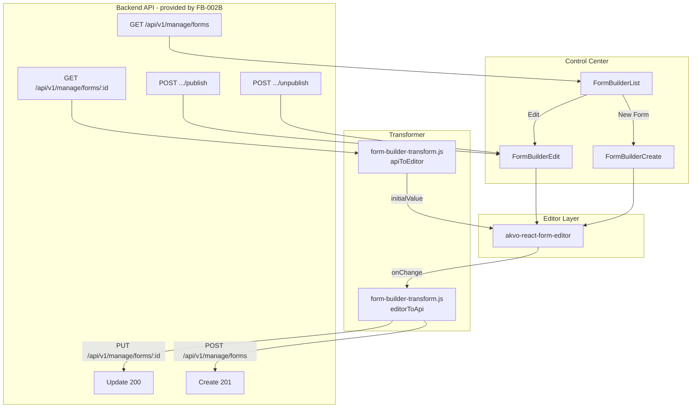
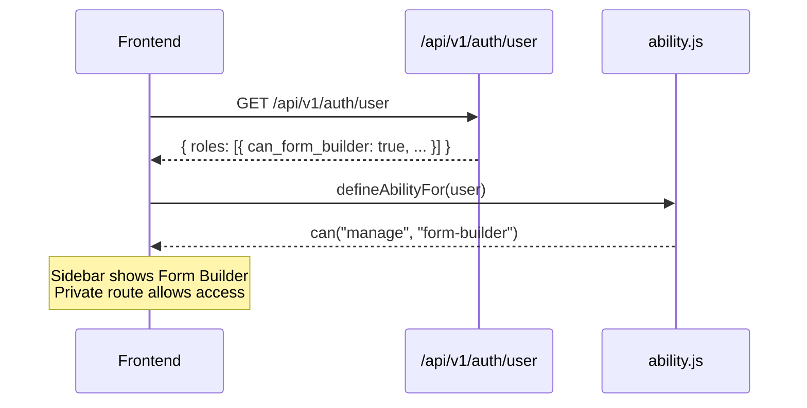

# Feature Design Document: Form Builder Frontend Integration

**Task ID**: FB-003
**Author**: Iwan
**Date**: 2026-06-08
**Status**: Draft

---

## 1. Context & Problem Statement

```
Currently:
- Forms are defined only through backend seeders and raw JSON files
- No in-product UI for creating or editing forms
- Every form change requires developer access to the backend
- This blocks non-developer admins from iterating on survey design

Goal:
- Integrate akvo-react-form-editor into the Control Center
- Give users with form-builder permission a visual editor to create and edit forms
- Consume the real CRUD API delivered in FB-002/FB-002B
- No mock backend — this branch calls real endpoints after FB-002B is merged

Scope (frontend only):
- ability.js: add can("manage", "form-builder") rule using can_form_builder flag
- Pages: implement FormBuilderList, FormBuilderCreate, FormBuilderEdit
- Lib: create form-builder-transform.js with editorToApi() and apiToEditor()
```

Already done in FB-002B (no changes needed in this branch):
- Routes `/control-center/form-builder`, `.../create`, `.../:formId/edit` — `App.js`
- Sidebar nav item with CASL check — `sidebar/index.jsx`
- `menuFormBuilder` UI text key — `ui-text.js`
- `akvo-react-form-editor@^2.0.3` installed — `frontend/package.json`
- Backend `FeatureTypes.form_builder = 2` and five granular `FeatureAccessTypes`
- `can_form_builder` field in `UserRoleSerializer`

---

## 2. Requirements

### User Acceptance Criteria

| # | Criterion |
|---|---|
| U-1 | Form Builder is accessible from the Control Center sidebar |
| U-2 | Only users with form-builder permission (and superusers) can access it |
| U-3 | Users can create a new form using the visual editor |
| U-4 | Users can edit existing forms using the visual editor |
| U-5 | Save operations show a loading state while the request is in flight |
| U-6 | Successful save shows a success notification |
| U-7 | Failed save shows an error notification with a message |
| U-8 | Users can preview the form while editing (built into the editor component) |
| U-9 | In-progress edits are auto-saved locally so work is not lost on accidental navigation |
| U-10 | Form Builder list shows all forms with name, type, and status (Draft / Published) |
| U-11 | When editing a published form, users see an info banner about version snapshots |
| U-12 | Users can unpublish and re-publish a form |

### Functional Requirements

- **FR-1** Permission gate: `ability.js` grants `can("manage", "form-builder")` when any role has `can_form_builder: true`
- **FR-2** `FormBuilderList`: paginated table from `GET /api/v1/manage/forms`, status badge, Edit action, New Form button
- **FR-3** `FormBuilderCreate`: editor with `POST /api/v1/manage/forms`; navigate to edit page on success; auto-save to localStorage `form-builder-draft-new`
- **FR-4** `FormBuilderEdit`: fetch/transform on mount; PUT save; publish/unpublish buttons; info banner for published forms; stale draft detection via `formVersion`
- **FR-5** `form-builder-transform.js`: pure JS `editorToApi()` and `apiToEditor()` functions
- **FR-6** Publish: `POST .../publish` for draft→published and re-publish; activates pending snapshot when already published
- **FR-7** Unpublish: `POST .../unpublish`; same Publish button doubles as re-publish
- **FR-8** Version History Drawer: lazy-loaded, `GET .../versions`, Set Active with Popconfirm, Refresh button, client-side pagination (pageSize=10)
- **FR-9** Version Preview: `GET .../versions/{version_id}`, null-first editor remount, dismissible preview banner, "Back to saved" button

### Non-Functional Requirements

| # | Requirement |
|---|---|
| NF-1 | Auto-save must not block UI; localStorage writes after 2 s debounce |
| NF-2 | Transformer is pure JS — no React or Ant Design imports |
| NF-3 | All code passes `yarn lint` and `yarn prettier` in the frontend container |
| NF-4 | No `// eslint-disable-next-line` comments — fix code to satisfy rules |
| NF-5 | Single complete payload per save. No chunking or partial saves. |
| NF-6 | All user-visible strings in `ui-text.js` under `formBuilder*` keys |

### Technical Acceptance Criteria

- [ ] `ability.js` grants form builder access from `can_form_builder` role field
- [ ] `editorToApi()`: camelCase→snake_case, entity→cascade, order recalculation, `pre:{}`→null
- [ ] `apiToEditor()`: snake_case→camelCase, cascade+entity→entity, passthrough metadata fields
- [ ] `FormBuilderList` renders status badge, pagination, empty state, loading skeleton
- [ ] `FormBuilderCreate` saves draft, navigates to edit on success, restores draft on mount
- [ ] `FormBuilderEdit` loads form, shows info banner when published, PUT+publish+unpublish work
- [ ] Stale draft detection (formVersion mismatch → silently discard)
- [ ] Version History Drawer opens on demand, Set Active calls activate endpoint
- [ ] Version Preview remounts editor with snapshot content; Back to saved restores real state
- [ ] Reusable `FormStatusTag`, `FormEditorBanners`, `VersionHistoryDrawer` components

---

## 3. Data Model Changes

No new models. This is a frontend-only spec. All backend models are provided by [[FB-002]] and [[FB-002B]].

### Draft Storage Format

localStorage key: `form-builder-draft-new` (create) / `form-builder-draft-{formId}` (edit)

```json
{ "value": { ...editorOutput }, "savedAt": "2026-06-01T10:00:00.000Z", "formVersion": 2 }
```

`formVersion` is the form's active version at draft-save time. Used for stale draft detection.

---

## 4. API Contract

All endpoints provided by FB-002B. This section documents what the frontend calls and expects.

### Endpoints Consumed

| Method | URL | When called |
|---|---|---|
| `GET` | `/api/v1/manage/forms` | `FormBuilderList` on mount |
| `POST` | `/api/v1/manage/forms` | `FormBuilderCreate` save |
| `GET` | `/api/v1/manage/forms/{id}` | `FormBuilderEdit` on mount |
| `PUT` | `/api/v1/manage/forms/{id}` | `FormBuilderEdit` save |
| `POST` | `/api/v1/manage/forms/{id}/publish` | Publish button |
| `POST` | `/api/v1/manage/forms/{id}/unpublish` | Unpublish button |
| `GET` | `/api/v1/manage/forms/{id}/versions` | Drawer on open |
| `GET` | `/api/v1/manage/forms/{id}/versions/{version_id}` | Version Preview |
| `POST` | `/api/v1/manage/forms/{id}/activate/{version_id}` | Set Active button |

### Architecture Overview



### Save UX Flow (Published Form)

```mermaid
sequenceDiagram
    participant User
    participant FE as FormBuilderEdit
    participant API as Backend

    User->>FE: Opens form (status=published, version=1)
    FE->>FE: Shows info banner
    User->>FE: Makes changes, clicks Save
    FE->>API: PUT /api/v1/manage/forms/42
    API-->>FE: 200 { version: 1, latest_version: 2, status: "published" }
    note over API,FE: Snapshot v2 stored; active_version still v1
    FE->>FE: message.success("Form saved"), update latest_version

    User->>FE: Clicks Publish
    FE->>API: POST /api/v1/manage/forms/42/publish
    API-->>FE: 200 { version: 2, latest_version: 2, status: "published" }
    FE->>FE: message.success("Form published"), update version state
```

### Data Mapping: `editorToApi()`

| Editor emits | Backend expects | Transform |
|---|---|---|
| `displayOnly` | `display_only` | `camelToSnake` |
| `shortLabel` | `short_label` | `camelToSnake` |
| `dependencyRule` | `dependency_rule` | `camelToSnake` |
| `questionGroupId` | _(delete)_ | removed |
| `pre: {}` | `pre: null` | normalize to null |
| `entity` type | `cascade` type | `EDITOR_TYPE_ALIASES` |
| `order` | `order` | recalculated from array index |

`"image"` passes through unchanged — both sides use the same string.

### Data Mapping: `apiToEditor()`

```
API field                     → Editor / page field
──────────────────────────────────────────────────────
id, name, type                → passed through
version                       → page: "active version" badge
latest_version                → page: "pending version" badge
status                        → page: info banner + publish button state
published_at                  → page: draft stale check; editor ignores
active_version_id             → page: version history drawer
display_only                  → displayOnly (snakeToCamel)
cascade + extra.type=entity   → "entity"
```

### Frontend Component Structure

```
frontend/src/
├── pages/form-builder/
│   ├── FormBuilderList.jsx            — table, status badge, New Form button
│   ├── FormBuilderCreate.jsx          — editor + POST save + auto-save + draft restore
│   ├── FormBuilderEdit.jsx            — editor + PUT save + Publish + Unpublish + Versions
│   ├── style.scss                     — .version-row-active highlight
│   └── components/
│       ├── index.js                   — barrel export
│       ├── FormStatusTag.jsx          — Published/Draft Tag
│       ├── FormEditorBanners.jsx      — draft-restored / preview / info Alert group
│       └── VersionHistoryDrawer.jsx   — Drawer + Table + Activate/Preview actions
├── lib/
│   ├── form-builder-transform.js      — editorToApi(), apiToEditor() (pure JS)
│   └── ui-text.js                     — 40+ formBuilder* keys
└── components/can/
    └── ability.js                     — add can("manage", "form-builder") rule
```

---

## 5. Decision Log

### D-1: Navigate to `response.data.id` on Create Success

After `POST /api/v1/manage/forms`, navigate to `/control-center/form-builder/${response.data.id}/edit`. PUT always returns 200 with the same `id` — no navigation after save.

---

### D-2: No Mock Backend

FB-002B is the prerequisite. This branch calls real endpoints. No `msw`, `json-server`, or mock server. Cannot be tested end-to-end until FB-002B is merged.

---

### D-3: `image` is the Canonical Type — No Alias Needed

Both `akvo-react-form-editor` and the backend use `"image"`. `editorToApi()` passes it through unchanged.

---

### D-4: Auto-Save to localStorage

Draft JSON shape:
```json
{ "value": <editorOutput>, "savedAt": "<ISO timestamp>", "formVersion": <number> }
```

Draft restore logic (Edit page):
1. Parse draft from localStorage.
2. If `typeof draft.formVersion !== "undefined" && draft.formVersion !== apiData.version` → stale draft, silently remove.
3. If `draft.savedAt > (apiData.published_at || "")` → use draft; show dismissible Alert with "Load from server" action button.
4. On "Load from server": clear localStorage, reload from API, skip draft check, remount editor.
5. On version activation: clear the draft before reloading the editor.

**Why `typeof` check**: The `no-undefined` ESLint rule forbids referencing the `undefined` identifier. Use `typeof draft.formVersion !== "undefined"` not `draft.formVersion !== undefined`.

---

### D-5: `akvo-react-form-editor/dist/index.css` Imported in `App.js`

Imported once globally to avoid FOUC.

---

### D-6: Snapshot vs In-Place for Published Forms

`PUT` on a published form does NOT touch live `QuestionGroup`/`Questions` rows. Response carries:
- `version` (active, unchanged) — "live version"
- `latest_version` (incremented) — "pending version"

Info banner text should reflect this: "Changes saved as snapshot v{latest_version}. Click Publish to activate."

---

### D-7: Draft PUT vs Published PUT Behaviour

| Form status | What PUT does | Live rows change? | Snapshot created? |
|---|---|---|---|
| `draft` | Updates live rows in-place | ✅ Yes | ❌ No |
| `published` | Stores snapshot only | ❌ No | ✅ Yes |

Frontend does not need different code paths — same PUT call, same 200 response shape.

---

### D-8: Version History Drawer (originally FB-003B, moved into FB-003)

- **Versions button** shown when `formStatus === "published"` or versions already fetched.
- Clicking opens a `Drawer` and calls `GET .../versions` on demand (lazy).
- **Set Active** button (non-active rows) behind Popconfirm: calls `POST .../activate/{version_id}` → success clears draft, sets `initialValue=null`, re-fetches form, remounts editor.
- `loadForm` wrapped in `useCallback([formId])` to satisfy `react-hooks/exhaustive-deps`.
- **Pagination**: `{ pageSize: 10, hideOnSinglePage: true }` — client-side.
- **Active row**: `rowClassName` applies `.version-row-active` (green-1 background); no Preview button on active row.

---

### D-9: Version Preview — Editor Reload via Null-First Pattern

`WebformEditor` ignores `initialValue` prop changes after mount. Passing `null` unmounts the editor (renders `<Spin>`); the next non-null value triggers a fresh mount.

**`onPreview` flow**:
1. Set `previewLoadingId = record.id` (spinner on button).
2. Save `prevValue = initialValue` for error recovery.
3. `setInitialValue(null)` — unmount editor immediately.
4. Fetch `GET .../versions/{record.id}`.
5. On success: `setInitialValue(apiToEditor({...schema, id, status, latest_version}))` → remount.
6. On error: `setInitialValue(prevValue)` — restore previous editor state.
7. Set `previewingVersion = { id, version }` → preview banner shown.
8. Drawer closes.

**"Back to saved"** calls `loadForm(true)` (skip draft check) and clears `previewingVersion`.

Preview is purely local — `activate` endpoint is NOT called.

---

### D-10: Publish / Unpublish Buttons

- `Publish` button shown when `formStatus === "draft"` OR `hasPendingSnapshot` (`latestVersion > version`).
- `Unpublish` button shown when `formStatus === "published"` (behind Popconfirm).
- When unpublished (`status=draft`, `published_at` is set), the same Publish button acts as re-publish — no separate button.

---

### D-11: i18n — All Form Builder Strings in `ui-text.js`

All user-visible text under `formBuilder*` keys. Dynamic strings use function keys:
```js
formBuilderPreviewingBanner:   (v) => `Previewing snapshot v${v} — not the saved state.`,
formBuilderSnapshotPending:    (v) => `Changes saved as snapshot v${v}. Click Publish to activate.`,
formBuilderVersionActivated:   (n) => `Version ${n} is now active. Reloading editor…`,
formBuilderActivateVersionTitle: (v) => `Activate version ${v}?`,
```

`text` object passed as prop to `FormEditorBanners` and `VersionHistoryDrawer` — no direct store subscriptions in sub-components.

---

## 6. Permission Flow



`ability.js` change:
```javascript
const can_form_builder = roles.filter((r) => r?.can_form_builder).length > 0;
if (can_form_builder) {
  can("manage", "form-builder");
}
```

Superusers already have `can("manage", "all")` — no change needed.

---

## 7. Compatibility & Migration

### Backward Compatibility

- All existing pages and routes unaffected
- Routes added as stubs in FB-002B; this branch fills them in
- No changes to existing `ability.js` rules

### ESLint Rules to Observe (from `frontend/.eslintrc.json`)

- `curly: error` — every `if/else/for/while` body must use braces
- `no-undefined: warn` — use `typeof x !== "undefined"` not `x !== undefined`
- `prefer-arrow-callback: error` — callbacks must be arrow functions
- `prefer-const: warn` — use `const` for non-reassigned variables
- `no-console: warn` — no `console.log`/`console.warn` in committed code

Run before every commit:
```bash
./dc.sh exec -T frontend yarn lint
./dc.sh exec -T frontend yarn prettier
```

---

## 8. Security Considerations

- [x] CASL `can("manage", "form-builder")` gate on all form builder pages and routes
- [x] `akvo-react-form-editor` emits user-typed form definitions — no executable code accepted by backend
- [x] Draft localStorage data: user's own unsaved work; no secrets stored
- [x] All manage endpoints require backend authentication (`IsAuthenticated`) regardless of frontend gate

---

## 9. Testing Strategy

| Test | What it verifies |
|---|---|
| `ability.test.js` | `can_form_builder: true` → `can("manage", "form-builder")` |
| `form-builder-transform.test.js` | `editorToApi`: camelCase→snake, `pre:{}`→null, type aliases, order calc |
| `form-builder-transform.test.js` | `apiToEditor`: snake→camel, entity/cascade, `latest_version` passthrough |
| `FormBuilderList.test.jsx` | Renders form rows with status badge; "New Form" navigates |
| `FormBuilderCreate.test.jsx` | Save success: message shown, navigates to `response.data.id` |
| `FormBuilderCreate.test.jsx` | Save error: error message shown |
| `FormBuilderEdit.test.jsx` | Loads form; shows info banner when `status="published"` |
| `FormBuilderEdit.test.jsx` | PUT 200: stays on page, updates `latest_version`, clears localStorage |
| `FormBuilderEdit.test.jsx` | Publish success: updates status and version |
| `FormBuilderEdit.test.jsx` | Unpublish success: status changes to draft |

```bash
cd frontend && CI=true npm test -- --testPathPattern="form-builder"
```

Backend test for `version_detail` endpoint is in `tests_manage_form_versions.py` (10 tests).

---

## 10. Open Questions

- [ ] `FormBuilderCreate` draft restore: should it also include `formVersion` field (create page has no version)? Currently only `savedAt` stored for the create draft.
- [ ] Confirm `WebformEditor` component name from installed `akvo-react-form-editor` package before writing page files
- [ ] `allow_delete=true` permission restriction to superuser in the UI — deferred to FB-009

---

## 11. References

- Depends on: [[FB-002]] and [[FB-002B]] (must be merged first)
- Branch: `feature/228-integrate-akvo-react-form-editor-in-frontend`
- GitHub Issue: #228
- Prerequisite branch: `feature/229-fb-002-implement-backend-form-crud-api`
- Library: `akvo-react-form-editor` v2.0.3+ (installed in `frontend/package.json`)

---

## Approval

| Role | Name | Date | Status |
|------|------|------|--------|
| Developer | Iwan | 2026-06-08 | Draft |
| Tech Lead | | | |
