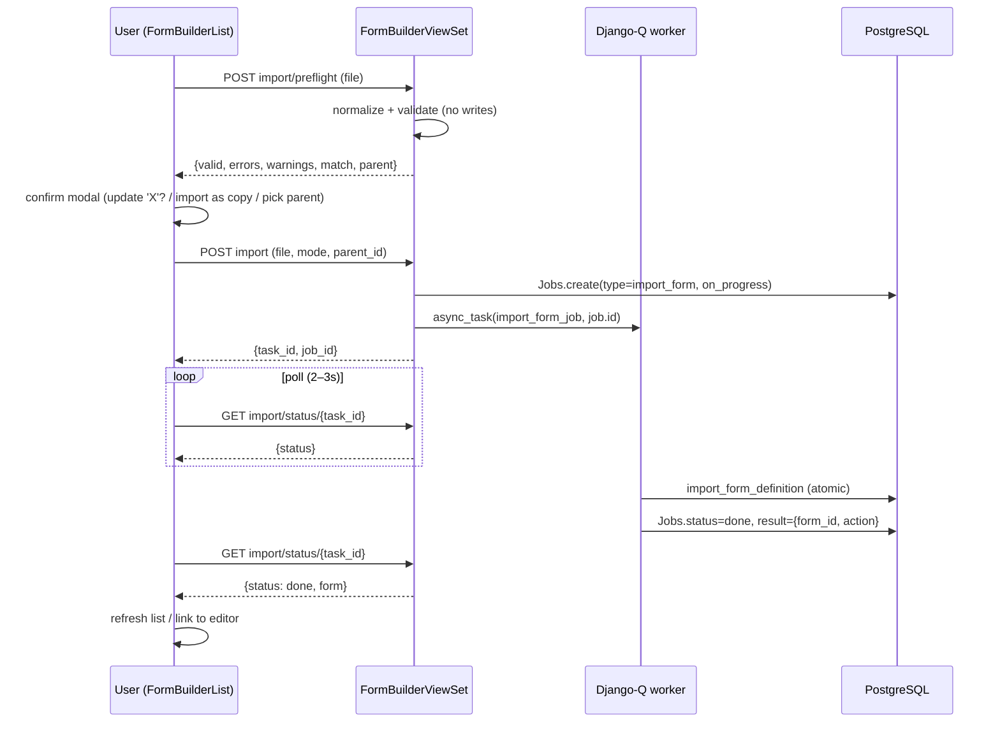
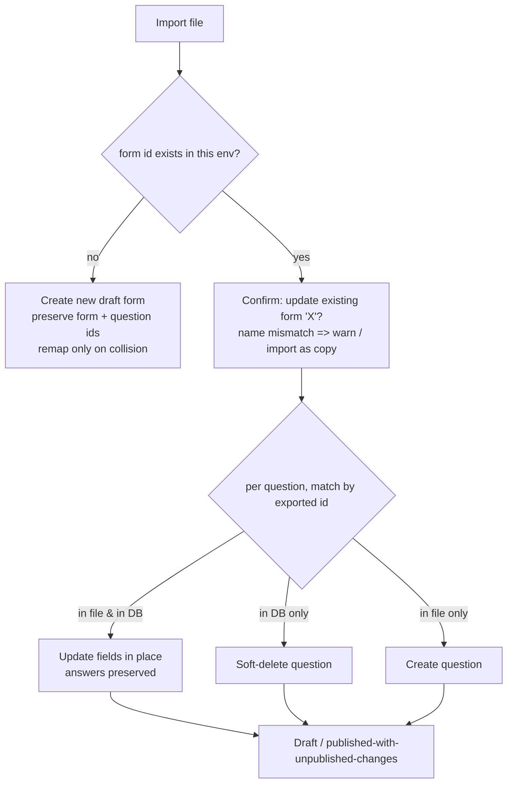

# Feature Design: Form Import/Export

**Task ID**: FB-007
**Author**: Iwan (with Claude)
**Date**: 2026-06-11
**Status**: Draft

---

## 1. Context & Problem Statement

```
Currently:
- Form definitions live only in the database; the only "export" is an Excel
  data-collection template (utils/export_form.py).
- Moving a form between environments requires hand-editing seeder JSON files
  and running the form_seeder CLI (publishes directly, no draft, no UI).
- There is no backup/share/migration path for form managers.

Goal:
- Export any form as a self-describing JSON file from the UI.
- Import a JSON file: create a new draft form, or update an existing form
  matched by form id (environment sync), via an async validated job.
- One shared parser serves the API importer and the form_seeder CLI.
```

Use cases: **backup** (snapshot a form definition outside the database),
**sharing** (hand a form definition to another organisation/instance), and
**environment migration & sync** (move forms between staging/production,
including re-importing an updated definition onto the *same* form, matched by
form `id`).

### Current state (verified in codebase)

- Form builder CRUD, publish/unpublish, duplicate, archive and version snapshots
  exist (`backend/api/v1/v1_forms/views.py` `FormBuilderViewSet`; FB-001…FB-004
  design docs).
- `FormPublishedVersion.schema` already snapshots a full form as JSON
  (`_build_schema_snapshot()` in `backend/api/v1/v1_forms/functions.py`).
- A JSON form format already exists: the **legacy seeder format** in
  `backend/source/forms/*.json`, consumed by the `form_seeder` management
  command. It has no metadata envelope and predates newer question fields
  (FB-002A: `variable_name`, `hidden_string`, `disabled`, `addon_before/after`,
  `columns`, `limit`, etc.).
- Existing export is **Excel data-template only** (`backend/utils/export_form.py`,
  `GET /api/v1/export/form/{id}`). There is no JSON definition export endpoint.
- Frontend precedents exist for blob download (`DownloadAdministrationData.jsx`)
  and multipart upload via Ant `Upload.Dragger` (`UploadData.jsx`); async work
  runs through `v1_jobs` (Django-Q) with structured error objects.
- Form list UI (FB-004) is implemented at
  `frontend/src/pages/form-builder/FormBuilderList.jsx` with per-row actions;
  editor at `FormBuilderEdit.jsx`.

---

## 2. Requirements

### User Stories & Acceptance Criteria

- **US-1 (Backup/Share)**: As a form manager, I can click "Export" on any form
  and get a JSON file that fully describes the form.
  - AC: works for draft & published, registration & monitoring forms; file
    includes metadata (format version, export date) and the form `id`.
- **US-2 (Restore/Adopt)**: As a form manager, I can import a JSON file and get
  a new draft form identical in structure to the exported one.
  - AC: IDs handled safely; dependencies still point at the right questions;
    autofield formulas still work; form appears in the list as draft.
- **US-3 (Environment sync)**: As a form manager, I can re-import a newer
  export of a form that already exists here (same form `id`) and have that form
  updated instead of duplicated.
  - AC: explicit confirmation required; existing submissions unaffected for
    retained questions; result is unpublished changes, never auto-published.
- **US-4 (Monitoring forms)**: As a form manager, importing a monitoring form
  lets me link it to an existing registration form; I cannot end up with an
  orphaned monitoring form.
- **US-5 (Safety)**: As a platform operator, malformed, oversized, or malicious
  JSON uploads are rejected with clear errors and never corrupt data.

### Functional Requirements — Export

- **FR-1**: Users with form-view access can export **any form** (draft or
  published, registration or monitoring) as a JSON file from the form list and
  from the form editor.
- **FR-2**: The export contains the form's **current editable structure** (live
  QuestionGroup/Questions/Options rows, excluding soft-deleted), not a
  historical published snapshot.
- **FR-3**: The export body uses the **akvo-react-form webform format** (D-1)
  extended with the form `id` (cross-environment identity, D-3), form `type`
  and `description`, export **metadata** (format version, timestamp, source),
  and a **parent hint** (`id` + `name`) for monitoring forms. Every form/
  question field the model supports is included — **"preserves all
  configuration" is an AC; no silent field loss.** Full format spec in §5.
- **FR-4**: Export is a synchronous authenticated download (small payload);
  filename conveys form name/id and date.

### Functional Requirements — Import

- **FR-5**: Users can upload a JSON file; the system validates it and processes
  the import as a background job. The user gets clear success/failure feedback
  including structured, actionable validation errors (field/question-level, not
  just "invalid file").
- **FR-6**: **Validation (security-critical)** before any DB write:
  - file size cap and `.json`/content-type enforcement,
  - structural schema validation (required keys, types, enum values for
    question types, `dependency_rule`, form `type`),
  - referential integrity *within the file* — full intra-file reference
    inventory (observed in real editor payloads):
    - `dependency[].id` → question id,
    - `questionGroupId` → containing group id,
    - group `leading_question` → question id,
    - `extra.parentId` (entity cascade) → question id,
    - `fn.fnString` → question **names** (`#name#`),
    - `pre` → question names + option **values**,
  - uniqueness constraints: question/group `name` unique within the form, AND
    question/group `id` unique within the file (real editor payloads have been
    observed with duplicate question ids across groups — R-3),
  - reject unknown question types and malformed nested JSON rather than
    best-effort import.
- **FR-7**: **ID handling (create path)**: the file's group/question IDs are
  **preserved when free** (required for later ID-based sync — R-2); on
  collision with existing rows, IDs are reassigned and **all intra-file ID
  references remapped consistently**: `dependency[].id`, `questionGroupId`,
  group `leading_question`, `extra.parentId`. (`fn.fnString` and `pre`
  reference questions by `name`/option `value`, which are preserved, so they
  survive without remapping. Option ids are never relied upon — R-3.) PK
  sequence-sync guard applies (cf. `restore_from_snapshot`).
- **FR-8**: **Create path** — the file's form `id` does not exist in this
  environment: create a **new draft form preserving the file's form id** (and
  group/question IDs per FR-7), so later re-imports of newer exports of the
  same form match and update it.
- **FR-9**: **Update path** — the file's form `id` matches an existing form:
  update that form's live structure to match the file (create/update/
  soft-delete groups & questions matched by exported ID, analogous to
  `restore_from_snapshot` — D-5), preserving submission linkage to retained
  questions. Works on draft and published forms alike: on a published form the
  result is **unpublished changes** (D-6) — `active_version` keeps serving data
  collection until an explicit re-publish. Import never auto-publishes. The
  user must explicitly confirm the update path; the confirmation shows the
  matched form's name and details, warns on name mismatch, and offers "import
  as new copy" instead (R-1).
- **FR-10**: **Parent resolution** — importing a monitoring form (`type=2`)
  requires an existing registration form as parent: auto-match by parent `id`
  hint when possible, otherwise the user selects one; if no parent can be
  resolved the import fails with a clear error (monitoring forms cannot exist
  unlinked).
- **FR-11**: Imported new forms are always created with **status = draft**;
  import never publishes.

### Functional Requirements — UI & Permissions

- **FR-12**: **Export** action on each form row in the form builder list and in
  the form editor header/menu.
- **FR-13**: **Import** action (button) in the form builder list header,
  opening an upload flow (drag-and-drop, `.json` only) consistent with existing
  upload UX.
- **FR-14**: Import flow communicates: validation errors (pre-job and
  job-failure), form-id match → explicit "update existing form X?" confirmation
  showing the matched form's name (with name-mismatch warning and "import as
  new copy" option — R-1), parent-selection step for monitoring forms, and
  links to the resulting form (editor) on success.
- **FR-15**: Import job progress/outcome is **polled inline in the form builder
  list** (D-7): a pending import is visible in/above the list and resolves in
  place to success (row appears/updates, link to editor) or failure (structured
  errors shown), without redirecting to the Downloads page.
- **FR-16**: Reuse the `FeatureTypes.form_builder` access model
  (`utils/custom_permissions.py`): export → `form_view`, import-create →
  `form_create`, import-update (form-id match) → `form_edit`. Frontend gates
  buttons via existing CASL `manage form-builder` ability; backend remains
  authoritative.

### Non-Functional Requirements

- **NFR-1 Security**: authenticated endpoints only; thorough server-side
  validation (FR-6); never evaluate/execute `fnString` or any file content
  server-side; uploaded files are parsed, never stored/served back raw.
- **NFR-2 Size limits**: file size cap **configurable** via Django settings/env
  var (`FORM_IMPORT_MAX_FILE_SIZE`, default 5 MB) with a clear 413-style error;
  reverse-proxy/nginx body-size limit must accommodate the configured value
  (D-10).
- **NFR-3 Atomicity**: an import job either fully succeeds or leaves the
  database unchanged (transactional), including the update-in-place path.
- **NFR-4 Round-trip fidelity**: export → import into a clean environment
  reproduces an equivalent form (all configuration preserved); covered by
  automated tests.
- **NFR-5 Format versioning**: metadata carries a format version so future
  format changes can be detected; importer rejects unsupported versions with a
  clear message.
- **NFR-6 Backward compatibility & parser reuse** (D-8): seeder and importer
  share one parser/creation code path; `form_seeder` continues to work with all
  existing legacy files in `backend/source/forms/` (covered by existing seeder
  tests) and additionally accepts FB-007 export files.
- **NFR-7 Mobile**: no mobile app changes — imports land as drafts; forms reach
  mobile only via the existing publish pipeline (published-only bundling
  already enforced).
- **NFR-8 Auditability**: import jobs record user, timestamp, outcome (`Jobs`
  row); created/updated forms carry `created_by`/`updated_by`.

### Out of Scope (v1)

- Family/bundle export (registration + all children in one file).
- Export of historical `FormPublishedVersion` snapshots (current structure only).
- Export/import of submission data, approval assignments, or user/role bindings.
- Cross-version format migration tooling (format is versioned; only the current
  version is supported in v1).
- Mobile app changes.

---

## 3. Discovery Decisions & Risks

Product-level decisions made during requirements discovery (fixed inputs to
this design; the design-level decisions DD-1…DD-7 are in §10):

| # | Decision | Choice |
|---|----------|--------|
| D-1 | Export file format | **akvo-react-form webform format** as the canonical field reference, per the library's complete example (<https://github.com/akvo/akvo-react-form/blob/main/example/src/example.json>): top-level `name`, `languages`, `defaultLanguage`, `translations`, `question_group[]`; question keys incl. `dependency`, `dependency_rule`, `fn`, `extra`, `tooltip`, `rule`, `option[]` (with `color`, `translations`), `addonBefore/After`, `hiddenString`, `displayOnly`, `requiredDoubleEntry`, `columns`, `limit`, etc. Extended with form `type`, parent hint, and export metadata; the form `id` (already native to the format/editor payload) serves as cross-environment identity (D-3). |
| D-2 | Monitoring (child) forms | **Single-form export with parent relink on import.** Export records the parent's `id`/`name` as a hint; import must resolve the parent to an existing registration form or fail clearly. No family bundles in v1. |
| D-3 | Identity on import | **Update-in-place by `Forms.id`.** The editor-generated form `id` (JS-timestamp PK, e.g. `1781169747316`) is the form's identity — it is already native to the editor payload and round-trips through export. If the file's form `id` matches an existing form, import updates that form's structure (restore-from-snapshot-like semantics) after explicit confirmation. Unknown `id` → create new draft **preserving the file's IDs**. *(`Forms.uuid` is not part of the editor/export format.)* |
| D-4 | Import processing | **Async via `v1_jobs`** (new `JobTypes` entry). Upload returns a job reference; result/errors surfaced when the job completes. |
| D-5 | Question identity on update-in-place | Match by **exported question/group ID** (same semantics as `restore_from_snapshot`). See R-1/R-2. |
| D-6 | Update-in-place on a published form | Allowed directly; imported changes become **unpublished changes** — identical to editing a published form in the builder today (live rows updated, `active_version` snapshot keeps serving data collection until an explicit re-publish). Import never touches `status` or `active_version`. |
| D-7 | Job feedback surface | **Poll job status inline in the form builder list** (no redirect to the Downloads page). |
| D-8 | Parser reuse | **Seeder and importer share one parser/creation code path.** `form_seeder` is refactored onto the shared parser and must keep working with the existing legacy files in `backend/source/forms/` (legacy `question_groups`/`questions` keys) as well as FB-007 export files. |
| D-9 | Endpoint paths | `GET /api/v1/manage/forms/{id}/export` and `POST /api/v1/manage/forms/import` (manage namespace, superseding the ticket's original paths). |
| D-10 | File size cap | **Configurable** via Django settings/env var (`FORM_IMPORT_MAX_FILE_SIZE`), default 5 MB; reverse-proxy body-size limit must be ≥ the configured value. |

### Risk notes

- **R-1 False identity match (consequence of D-3)**: `Forms.id` is only unique
  *per environment*. A file's form `id` may match an **unrelated** form in the
  target environment (likely for small seeded IDs like 1, 2; unlikely but
  possible for timestamp IDs). The update confirmation MUST display the matched
  form's name/details, warn on name mismatch, and offer **"import as new
  copy"** (fresh IDs + full intra-file reference remap) as the alternative.
- **R-2 ID preservation enables sync (consequence of D-5 + D-3)**: ID-based
  update-matching only works across environments if the create path
  **preserves** the file's group/question IDs. Collision handling is decided in
  DD-3 (preserve-when-free, remap only on collision — accepting that remapped
  rows lose ID-based sync). File IDs absent on the matched form are treated as
  new questions. PK sequence-sync guard applies.
- **R-3 Real editor-payload quirks (observed in an actual
  akvo-react-form-editor payload)**:
  - question IDs may be small integers, and **duplicate question IDs across
    groups in one payload** have been observed (e.g. id 29 twice) — the
    importer must validate ID uniqueness within the file (resolution: DD-5);
  - **option IDs are reused across questions** (not globally meaningful) —
    options are identified by `value` within their question, never matched by
    exported option id;
  - `api.endpoint` values are **absolute URLs of the source environment**
    (e.g. `https://rtmis.akvotest.org/api/v1/administration`) — cross-
    environment imports carry foreign URLs (resolution: DD-4).

---

## 4. Data Model Changes

### New Models

None. Import/export operates entirely on existing `Forms`, `QuestionGroup`,
`Questions`, `QuestionOptions`, and `Jobs` rows.

### Modified Models

| Model | Change | Reason |
|-------|--------|--------|
| — | none | — |

### New Constants / Settings

| Location | Addition | Value |
|----------|----------|-------|
| `api/v1/v1_jobs/constants.py` `JobTypes` | `import_form` + `FieldStr` entry | `8` / `"import_form"` |
| `mis/settings.py` | `FORM_IMPORT_MAX_FILE_SIZE` | `int(os.environ.get("FORM_IMPORT_MAX_FILE_SIZE", 5 * 1024 * 1024))` (D-10) |

### Migration Strategy

`Jobs.type` is defined as `models.IntegerField(choices=JobTypes.FieldStr.items())`
([v1_jobs/models.py:12](../../backend/api/v1/v1_jobs/models.py#L12)), so adding
`import_form` to `JobTypes`/`FieldStr` changes the field's `choices` and Django
detects a model change. After editing the constants, run:

```bash
./dc.sh exec backend python manage.py makemigrations v1_jobs
./dc.sh exec backend python manage.py migrate
```

This generates an `AlterField` migration on `Jobs.type` — a no-op at the
database level (choices are enforced in Python, not in PostgreSQL), but
required to keep migration state consistent (otherwise `makemigrations
--check`/test runs flag missing migrations). No data migration; rollback is
the reverse migration.

Deployment note: if a reverse proxy limits request body size below the
configured cap, raise `client_max_body_size` in
`frontend/nginx/conf.d/default.conf` accordingly (NFR-2).

---

## 5. Export File Format (format_version 1)

The body is the **akvo-react-form / editor payload format** (D-1) wrapped in a
metadata envelope. Key naming follows the editor payload convention exactly
(mixed camel/snake as produced by akvo-react-form-editor — DD-1).

```json
{
  "metadata": {
    "format_version": 1,
    "exported_at": "2026-06-11T09:30:00Z",
    "source": "https://staging.mis.akvo.org",
    "app_version": "<git describe / package version>"
  },
  "id": 1781169836775,
  "name": "Community Culinary Survey 2021",
  "description": "…",
  "type": 1,
  "version": 3,
  "parent": null,
  "languages": ["en", "id"],
  "defaultLanguage": "en",
  "translations": [{ "name": "Komunitas Kuliner Survey 2021", "language": "id" }],
  "approval_instructions": null,
  "question_group": [
    {
      "id": 1781169836774,
      "name": "registration",
      "label": "Registration",
      "description": null,
      "order": 1,
      "repeatable": false,
      "repeatText": null,
      "translations": [{ "name": "Registrasi", "language": "id" }],
      "question": [
        {
          "id": 6,
          "order": 6,
          "questionGroupId": 1781169836774,
          "name": "gender",
          "label": "Gender",
          "short_label": null,
          "type": "option",
          "required": true,
          "meta": true,
          "rule": null,
          "dependency": null,
          "dependency_rule": "AND",
          "api": null,
          "extra": null,
          "tooltip": null,
          "fn": null,
          "pre": null,
          "displayOnly": false,
          "variableName": null,
          "hiddenString": null,
          "requiredDoubleEntry": false,
          "disabled": false,
          "addonBefore": null,
          "addonAfter": null,
          "dataApiUrl": null,
          "center": null,
          "limit": null,
          "columns": null,
          "translations": [{ "name": "Jenis Kelamin", "language": "id" }],
          "option": [
            { "order": 1, "label": "Male", "value": "male", "other": false,
              "color": null, "translations": [{ "name": "Laki-Laki", "language": "id" }] }
          ]
        }
      ]
    }
  ]
}
```

Monitoring forms (`type: 2`) carry the parent hint:

```json
"parent": { "id": 1699353915355, "name": "Household Registration" }
```

### Field Mapping (model ↔ export key)

Internal canonical representation is the snake_case dict produced/consumed by
`_build_schema_snapshot()` / `restore_from_snapshot()`
([functions.py:598](../../backend/api/v1/v1_forms/functions.py#L598),
[functions.py:400](../../backend/api/v1/v1_forms/functions.py#L400)). The
camel↔snake bridge reuses `_CAMEL_FIELDS`
([constants.py:75](../../backend/api/v1/v1_forms/constants.py#L75)).

**Forms**

| Model field | Export key | Notes |
|---|---|---|
| `id` | `id` | identity (D-3) |
| `name` | `name` | |
| `description` | `description` | |
| `type` | `type` | int `1`/`2` (FormTypes) |
| `version` | `version` | informational only; not applied on import |
| `parent` | `parent.{id,name}` | hint for relink (D-2) |
| `languages` | `languages` | |
| `default_language` | `defaultLanguage` | |
| `translations` | `translations` | |
| `approval_instructions` | `approval_instructions` | |
| `uuid`, `status`, `published_at`, `active_version`, audit fields | — | never exported; target-environment concerns |

**QuestionGroup**: `id`, `name`, `label`, `description`, `order`, `repeatable`,
`repeat_text` ↔ `repeatText`, `translations`.

**Questions** (export key differs from model field only where noted):
`id`, `order`, `name`, `label`, `short_label`, `type` (int ↔ lowercase string,
see §7), `meta`, `required`, `rule`, `dependency`, `dependency_rule`, `api`,
`extra`, `tooltip`, `fn`, `pre`, `translations`, `center`, `disabled`,
`limit`, `columns`, `tree_option` ↔ `tree_option`,
`display_only` ↔ `displayOnly`, `variable_name` ↔ `variableName`,
`hidden_string` ↔ `hiddenString`,
`required_double_entry` ↔ `requiredDoubleEntry`,
`addon_before` ↔ `addonBefore`, `addon_after` ↔ `addonAfter`,
`data_api_url` ↔ `dataApiUrl`. Export additionally emits `questionGroupId`
(redundant with nesting; importer validates consistency, FR-6).

**QuestionOptions**: `order`, `label`, `value`, `other`, `color`,
`translations`. Option `id` is **not** exported (options carry no identity —
R-3; recreated wholesale on import like `restore_from_snapshot` does).

---

## 6. API Contract

All endpoints live on `FormBuilderViewSet` (manage namespace, D-9).

| Method | URL | Purpose | Permission (`FormBuilderAccess`) |
|--------|-----|---------|------|
| GET | `/api/v1/manage/forms/{id}/export` | Download form definition JSON | `form_view` |
| POST | `/api/v1/manage/forms/import/preflight` | Sync validate + conflict report (no DB write) | `form_create` |
| POST | `/api/v1/manage/forms/import` | Enqueue import job | `form_create`; update mode additionally enforces `form_edit` |
| GET | `/api/v1/manage/forms/import/status/{task_id}` | Poll job status/result | `form_create` |

### 6.1 Export

`GET /api/v1/manage/forms/{id}/export` → `200`, `Content-Type: application/json`,
`Content-Disposition: attachment; filename="form-{id}-{slug(name)}-{YYYYMMDD}.json"`.
Body: §5. Synchronous (FR-4); built from live rows via the shared
`export_form_definition()` (§8).

### 6.2 Import preflight (DD-2)

`POST /api/v1/manage/forms/import/preflight` — multipart, field `file`.
Parses + normalizes + validates (FR-6) and reports what the real import would
do. **Never writes.** Response `200`:

```json
{
  "valid": true,
  "errors": [],
  "warnings": [
    { "code": "foreign_api_endpoint",
      "message": "question 'location' api.endpoint points to https://rtmis.akvotest.org" },
    { "code": "unknown_entity_type",
      "message": "question 'facility' entity 'Health Facility' not found in this environment" }
  ],
  "form": { "id": 1781169836775, "name": "Community Culinary Survey 2021", "type": 1 },
  "match": {
    "exists": true,
    "form": { "id": 1781169836775, "name": "Community Culinary Survey 2021",
              "status": "published", "submission_count": 1240,
              "updated": "2026-05-02T10:00:00Z" },
    "name_mismatch": false
  },
  "parent": { "required": false, "hint": null, "resolved": null }
}
```

Validation failure → `200` with `valid: false` and structured `errors[]`
(`{code, path, message}`, e.g. `{"code": "duplicate_question_id", "path":
"question_group[3].question[3].id", "message": "id 29 already used in
question_group[1]"}`). Oversized file → `413`. Monitoring form: `parent.required
= true`, `parent.hint = {id, name}`, `parent.resolved = {id, name} | null`.

### 6.3 Import

`POST /api/v1/manage/forms/import` — multipart:

| Field | Type | Meaning |
|---|---|---|
| `file` | file | the JSON export |
| `mode` | `create_or_update` \| `create_copy` | `create_copy` forces a brand-new form with fresh IDs + full reference remap (R-1 escape hatch) |
| `parent_id` | int, optional | overrides/satisfies parent resolution for monitoring forms |

Server re-runs full validation (never trusts preflight), stores the file under
the upload storage (same `FileSystemStorage` → `storage.upload` pattern as
[v1_jobs/views.py:352](../../backend/api/v1/v1_jobs/views.py#L352)), creates a
`Jobs` row (`type=import_form`, `status=on_progress`, `info={filename, mode,
parent_id, form_id}`), dispatches
`async_task("api.v1.v1_forms.tasks.import_form_job", job.id,
hook="api.v1.v1_forms.tasks.import_form_job_result")`, and returns `200
{"task_id": "...", "job_id": ...}`. Update mode without `form_edit` access → `403`.

### 6.4 Status

`GET /api/v1/manage/forms/import/status/{task_id}` (mirrors the
`download/status` precedent) → `200`:

```json
{ "status": "done", "form": { "id": 1781169836775, "name": "…", "action": "updated" } }
```

`status ∈ pending|on_progress|failed|done` (JobStatus). On `failed`, `errors[]`
carries the structured validation/DB errors from `Jobs.result`.

---

## 7. Type/Constant Mappings

| Export `type` string | Backend constant | DB value |
|---|---|---|
| `geo` | `QuestionTypes.geo` | 1 |
| `text` | `QuestionTypes.text` | 3 |
| `number` | `QuestionTypes.number` | 4 |
| `option` | `QuestionTypes.option` | 5 |
| `multiple_option` | `QuestionTypes.multiple_option` | 6 |
| `cascade` | `QuestionTypes.cascade` | 7 |
| `image` | `QuestionTypes.image` | 8 |
| `date` | `QuestionTypes.date` | 9 |
| `autofield` | `QuestionTypes.autofield` | 10 |
| `attachment` | `QuestionTypes.attachment` | 11 |
| `signature` | `QuestionTypes.signature` | 12 |
| `input` | `QuestionTypes.input` | 13 |
| `geoshape` | `QuestionTypes.geoshape` | 14 |
| `geotrace` | `QuestionTypes.geotrace` | 15 |
| `tree` | `QuestionTypes.tree` | 16 |
| `table` | `QuestionTypes.table` | 17 |

Form `type`: `1` registration / `2` monitoring (`FormTypes`). Job status:
`JobStatus.{pending,on_progress,failed,done}` = 1/2/3/4.

---

## 8. Backend Architecture — Shared Parser (D-8)

New module `backend/api/v1/v1_forms/form_definition.py` (single code path for
API importer and `form_seeder`):

```python
def normalize_form_definition(raw: dict) -> dict
    # Accepts: (a) FB-007 export (metadata envelope + editor keys),
    #          (b) bare editor/akvo-react-form payload,
    #          (c) legacy seeder format (form/question_groups/questions keys).
    # Returns the canonical snake_case structure used by
    # _build_schema_snapshot/restore_from_snapshot, plus
    # {form_id, type, parent_hint, metadata}.
    # Key bridge: _CAMEL_FIELDS + {question_group|question_groups,
    # question|questions, form|name, repeatText|repeat_text, …}.

def validate_form_definition(norm: dict) -> list[dict]
    # FR-6. Extends validate_form_payload() with:
    # - format_version supported (NFR-5)
    # - group/question id uniqueness within file (DD-5: duplicates REJECTED)
    # - intra-file refs: dependency[].id, questionGroupId, leading_question,
    #   extra.parentId resolve to ids in the file; fn.fnString '#name#' and
    #   pre keys resolve to question names/option values
    # - name uniqueness per form; option value uniqueness per question
    # - warnings (non-blocking): foreign api.endpoint URLs (DD-4)
    # - warnings (non-blocking): entity cascade questions whose extra.name
    #   does not match any Entity row in the target environment (unknown_entity_type)
    # Returns [{code, path, message, level}] — level "error"|"warning",
    # same shape end-to-end (preflight, import job result, seeder stderr).

def export_form_definition(form) -> dict
    # _build_schema_snapshot(form) + id/type/parent/metadata envelope,
    # snake→editor key translation (inverse of _CAMEL_FIELDS), type
    # FieldStr.lower(). 3 queries, same as snapshot builder.

@transaction.atomic
def import_form_definition(norm, user, *, mode, parent_id=None) -> (Forms, str)
    # Decision tree (R-1/R-2, DD-3):
    #   mode=create_copy            -> fresh form id + group/question ids,
    #                                  remap dependency[].id / questionGroupId
    #                                  / leading_question / extra.parentId
    #   form id exists              -> update path: restore_from_snapshot-style
    #                                  two-pass (soft-delete absent, upsert
    #                                  present by id), form fields synced,
    #                                  status/active_version untouched (D-6)
    #   form id free                -> create path: preserve form id; preserve
    #                                  group/question ids when free, remap
    #                                  only colliding ids (+ all references)
    # Always: PK sequence sync (reuse the setval guard), status=draft for new
    # forms (FR-11), created_by/updated_by=user (NFR-8).
    # Returns (form, action) with action in {"created", "updated", "copied"}.
```

Job task `backend/api/v1/v1_forms/tasks.py`:
`import_form_job(job_id)` downloads the stored file, normalizes, validates
(fail → `Jobs.status=failed`, `result=json(errors)`), calls
`import_form_definition`, sets `status=done`, `result=json({form_id, action})`;
`import_form_job_result(task)` hook marks unexpected exceptions as `failed`.
The transaction boundary is inside `import_form_definition` → NFR-3 atomicity.

`form_seeder` refactor: file loading, parent-first ordering, QA/attribute
handling, and publish behaviour stay in the command; per-form parsing/writing
goes through `normalize → validate → import_form_definition` (NFR-6; existing
seeder tests guard the legacy files).

### Import sequence



---

## 9. Frontend Design

**FormBuilderList.jsx** ([frontend/src/pages/form-builder/](../../frontend/src/pages/form-builder/)):
- Per-row **Export** action (Active tab; gated `form_view` via existing CASL
  `manage form-builder`): `api.get(/manage/forms/{id}/export, {responseType:
  "blob"})` → filename from `Content-Disposition` → anchor download (the
  `DownloadAdministrationData.jsx` pattern).
- Header **Import** button → `ImportFormModal` (new component, same folder):
  1. Ant `Upload.Dragger`, `accept=".json"`, client-side size check against cap;
  2. on file pick → POST preflight → render structured errors/warnings, or the
     decision step: match found → "Update existing form *name* (vN, X
     submissions)?" with name-mismatch warning + radio `Update existing` /
     `Import as new copy` (R-1); monitoring form → parent select
     (registration forms list) prefilled from `parent.resolved`;
  3. confirm → POST import → keep modal in progress state, poll
     `import/status/{task_id}` every 2–3 s (FR-15, D-7);
  4. done → success result with **Open in editor** link + list refresh;
     failed → structured error list, allow retry.

**FormBuilderEdit.jsx**: **Export** entry in the header actions, same blob
download.

ESLint constraints per CLAUDE.md apply (braces, no `undefined`, arrow
callbacks, interval cleanup returning a no-op of the same shape in `useEffect`).

---

## 10. Decision Log (design-level)

### DD-1: Export key convention = editor payload convention
**Options**: (a) internal snapshot snake_case; (b) editor/akvo-react-form keys.
**Decision**: (b) — the file format is the editor payload format (mixed
camel/snake exactly as akvo-react-form emits). **Rationale**: D-1 names the
library format canonical; the editor round-trip is the primary producer/consumer;
`_CAMEL_FIELDS` already bridges to internal snake_case. **Impact**: exporter
applies inverse `_CAMEL_FIELDS`; importer normalization accepts both spellings,
which it needs anyway for D-8.

### DD-2: Synchronous preflight endpoint before the async job
**Options**: (1) single POST that may return "confirmation required"; (2)
separate sync preflight + job-enqueuing import.
**Decision**: (2). **Rationale**: FR-14's confirmation/parent-selection needs a
read-only inspection step; files are small so sync parsing is cheap; the write
path stays async (D-4) and re-validates server-side (preflight is advisory,
never trusted). **Impact**: two endpoints; no job is created for invalid files
— cleaner job history.

### DD-3: Create-path ID strategy = preserve-when-free, remap on collision (resolves R-2)
**Options**: always remap; preserve-when-free; reject on collision.
**Decision**: preserve-when-free. **Rationale**: ID preservation is what makes
later id-based update-matching work across environments (R-2);
`restore_from_snapshot` already proves arbitrary-ID inserts + the `setval`
sequence guard ([functions.py:449](../../backend/api/v1/v1_forms/functions.py#L449)).
**Impact**: a remapped question silently loses id-based sync on future
re-imports — accepted (documented in R-2); `create_copy` mode always remaps.

### DD-4: Foreign `api.endpoint` URLs imported verbatim, warned in preflight (resolves R-3c)
**Decision**: no rewriting; preflight emits a `foreign_api_endpoint` warning
listing affected questions. **Rationale**: URL rewriting is guesswork
(endpoints may legitimately be external); the form editor is the right place to
fix them. **Impact**: warning surface in preflight response + modal.

### DD-5: Duplicate group/question ids within a file → reject (resolves R-3a)
**Decision**: validation error, not silent reassignment. **Rationale**: FB-007
exports can never contain duplicates (DB PKs); duplicates indicate a hand-made
or corrupted file, and reassignment would silently change dependency semantics.
**Impact**: hand-made akvo-react-form example files with reused ids must be
fixed before import; error message names both paths (FR-5).

### DD-6: Import file persisted to upload storage, job reads by filename
**Decision**: follow the `upload_bulk_administrators` pattern
(`FileSystemStorage` tmp → `storage.upload(folder="upload")`; `Jobs.info.file`).
**Rationale**: worker runs in a separate container — request memory is not
shared; storage abstraction already handles GCS/local. **Impact**: import files
are retained in upload storage (audit trail, NFR-8); never served back raw
(NFR-1).

### DD-7: Status polling endpoint on the manage namespace
**Decision**: `GET /manage/forms/import/status/{task_id}` mirroring
`download/status/{task_id}` rather than reusing it. **Rationale**: download
status is coupled to download semantics/permissions; form-builder permission
gating differs (FR-16). **Impact**: one small additional view reading the
`Jobs` row by `task_id` scoped to `user`.

---

## 11. Compatibility & Migration

### Backward Compatibility
- [x] Existing API consumers unaffected (new endpoints only).
- [x] Existing data preserved (no schema changes).
- [x] `form_seeder` keeps consuming all legacy `backend/source/forms/*.json`
      via the shared parser (existing seeder tests must stay green — NFR-6).

### Mobile App Impact
- [x] Sync endpoints affected: none. Imports land as drafts; only published
      forms are bundled into mobile config/SQLite (existing behaviour).
- [x] SQLite schema changes: no.
- [x] Version detection: unchanged (publish flow).

### Cascade Data & Mobile SQLite

**Mobile SQLite files are out of scope for import.** `generate_sqlite` builds
SQLite databases for `Administration`, `Organisation`, `Entity`, and
`EntityData` — mobile reference/master data. It runs at initial seeding and
after bulk master-data uploads (`v1_jobs`). Form import never triggers
`generate_sqlite` — importing a form definition changes none of those models.
Imported forms reach mobile only after an explicit publish, which triggers
`refresh_form_config` (form-list config regeneration) as today.

**Cascade question data dependencies after import.** The export carries the
form *definition* only — cascade data sources are environment-local:

| Question type | Data source | After import |
|---|---|---|
| Administration cascade / tree | Target environment's Administration hierarchy | Always available; hierarchy may differ between environments |
| Entity cascade (`extra.type = "entity"`) | `Entity`/`EntityData` in target environment | Silently broken if the named `Entity` does not exist; preflight emits `unknown_entity_type` warning |
| API-driven cascade (`api.endpoint`) | External URL | Preflight emits `foreign_api_endpoint` warning (DD-4) |

The user should verify that all referenced entity types and administration
hierarchy are seeded before publishing a form that uses cascade questions.
Entity data can be seeded via the existing bulk entity upload pipeline;
`generate_sqlite` regenerates the mobile SQLite after that upload automatically.

### Seeder/CLI Compatibility
- [x] Existing seeder invocations work unchanged.
- [x] New seeder capability: FB-007 export files accepted as source files
      (same normalize step). No new commands required.

---

## 12. Security Considerations

- [x] Permission model: `FormBuilderAccess(form_view|form_create|form_edit)`
      per endpoint (FR-16); backend authoritative, CASL only gates buttons.
- [x] Input validation: full FR-6 suite server-side on both preflight and job;
      JSON parsed with stdlib `json` (no eval); `fnString`/`pre` content stored
      verbatim, never executed server-side (NFR-1).
- [x] Size cap enforced in-view before parsing (`FORM_IMPORT_MAX_FILE_SIZE`,
      413 on breach) + content-type/extension check; nginx body limit aligned.
- [x] Uploaded files stored via existing storage layer, never echoed back raw;
      export responses contain only form-definition data (no user/credential
      fields — `uuid`, audit fields, approver bindings excluded).
- [x] No new attack vectors: no dynamic imports, no URL fetching of
      `api.endpoint` values during import (DD-4).

---

## 13. Testing Strategy

| Test Type | Coverage |
|-----------|----------|
| Unit (`api/v1/v1_forms/tests/tests_form_definition.py`) | normalize: all 3 input shapes → canonical; validate: every FR-6 rule (duplicate ids, dangling dependency/questionGroupId/leading_question/extra.parentId, bad fnString ref, unknown type, bad format_version); export mapping completeness (every model field present — NFR-4 guard). |
| Integration (`tests_form_import_export.py`) | export endpoint (headers, body, permissions); preflight (valid/invalid/match/parent cases, 413); import job create path (id preserved, collision remap incl. all references), update path (update/soft-delete/create by id, submissions retained, published form → unpublished changes, status untouched), create_copy; permission matrix (403 on update without form_edit); atomicity (forced mid-import failure leaves DB unchanged). |
| Round-trip (NFR-4) | export → wipe → import → export: deep-equal canonical structures, for a fixture exercising every question type incl. dependency chains, fn, pre, tree, table columns, translations, option colors. |
| Seeder regression | full `form_seeder` run over `backend/source/forms/` via shared parser — existing tests + one new test seeding an FB-007 export file. |
| Frontend (RTL) | ImportFormModal: preflight error render, update-confirmation flow incl. name-mismatch warning + copy mode, parent select, polling to done/failed; export button blob download trigger. |

Commands: `./dc.sh exec backend python manage.py test api.v1.v1_forms`,
`./dc.sh exec -T frontend npx eslint <changed files>`, `cd frontend && npm run test:ci`.

---

## 14. Implementation Plan (file touch list)

**Backend**
1. [x] `api/v1/v1_jobs/constants.py` — `JobTypes.import_form = 8` + `FieldStr`
   entry, then `makemigrations v1_jobs` (AlterField on `Jobs.type` choices —
   see §4 Migration Strategy)
2. [x] `mis/settings.py` — `FORM_IMPORT_MAX_FILE_SIZE`
3. [x] normalize / validate / export / import (§8) — merged into
   `api/v1/v1_forms/functions.py` (constants in `constants.py`) instead of a
   separate `form_definition.py` module
4. [x] `api/v1/v1_forms/tasks.py` — `import_form_job`, `import_form_job_result`
5. [x] `api/v1/v1_forms/views.py` — 4 new `@action`s on `FormBuilderViewSet` +
   permission map entries
6. [x] `api/v1/v1_forms/serializers.py` — `ImportPreflightSerializer` /
   `ImportFormSerializer` (multipart, `CustomFileField`) for drf-spectacular
7. [ ] `api/v1/v1_forms/management/commands/form_seeder.py` — refactor onto
   shared parser
8. [x] Tests per §13 — `tests_manage_form_import.py` (39 tests),
   `tests_manage_form_export.py` (12 tests)

**Frontend**
1. [x] `src/pages/form-builder/FormBuilderList.jsx` — export action, import
   button
2. [x] `src/pages/form-builder/components/ImportFormModal.jsx` — **new**
   (upload → preflight → confirm → poll)
3. [x] `src/pages/form-builder/FormBuilderEdit.jsx` — export action
4. [ ] Tests per §13 (frontend RTL)

Suggested order: backend 1–3 (+unit tests) → 4–5 (+integration tests) → 7
(+seeder regression) → 6 → frontend → round-trip test.

---

## 15. Open Questions

None — all discovery questions were resolved as D-1…D-10 (§3); design
decisions DD-1…DD-7 are recorded in §10 for review.

---

## 16. References

- Ticket: FB-007 (branch `feature/236-fb-007-implement-form-importexport`)
- Format reference: akvo-react-form complete example —
  <https://github.com/akvo/akvo-react-form/blob/main/example/src/example.json>
- `backend/api/v1/v1_forms/functions.py` — `_build_schema_snapshot` (L598),
  `restore_from_snapshot` (L400, incl. `setval` sequence guard L449),
  `validate_form_payload` (L571)
- `backend/api/v1/v1_forms/constants.py` — `QuestionTypes`, `FormTypes`,
  `_CAMEL_FIELDS`
- `backend/api/v1/v1_jobs/views.py` — upload/job dispatch precedent (L313–L382);
  `backend/api/v1/v1_jobs/urls.py` — `download/status/{task_id}` polling precedent
- `backend/utils/custom_permissions.py` — `FormBuilderAccess`
- FB-001/FB-002/FB-002A/FB-002B/FB-004 design docs

---

## Appendix A — Worked Example: Update-in-Place by Form ID (D-3/D-5/D-6)

Taken from an **actual akvo-react-form-editor payload** ("Community Culinary
Survey 2021", form id `1781169836775`): question **6 "Gender"** (`option`) and
question **7 "Marital Status"**, which depends on it via
`dependency: [{"id": 6, "options": ["female", "male"]}]`.

### Export file (from staging) — abbreviated

```json
{
  "metadata": {
    "format_version": 1,
    "exported_at": "2026-06-11T09:30:00Z",
    "source": "staging.mis.akvo.org"
  },
  "id": 1781169836775,
  "name": "Community Culinary Survey 2021",
  "type": 1,
  "defaultLanguage": "en",
  "languages": ["en", "id"],
  "question_group": [
    {
      "id": 1781169836774,
      "name": "registration",
      "label": "Registration",
      "order": 1,
      "question": [
        {
          "id": 6,
          "name": "gender",
          "label": "Gender",
          "type": "option",
          "order": 6,
          "questionGroupId": 1781169836774,
          "option": [
            { "label": "Male",   "value": "male",   "order": 1 },
            { "label": "Female", "value": "female", "order": 2 },
            { "label": "Other",  "value": "other",  "order": 3 }
          ]
        },
        {
          "id": 7,
          "name": "marital_status",
          "label": "Marital Status",
          "type": "option",
          "order": 7,
          "questionGroupId": 1781169836774,
          "dependency": [ { "id": 6, "options": ["female", "male"] } ]
        }
      ]
    }
  ]
}
```

Note the intra-file references that must stay consistent: `dependency[].id` →
question 6, `questionGroupId` → group `1781169836774`, and (elsewhere in the
real payload) group `leading_question` and `extra.parentId`. Option ids are
reused across questions and carry no identity — options are identified by
`value` (R-3).

### Path A — create (form id unknown in target environment)

First import into production: no form has id `1781169836775` → create a **new
draft form preserving the file's form id and group/question IDs** (FR-8, R-2).
Only on genuine collision (e.g. production already has an unrelated question
with id 6) are IDs reassigned, with **all references remapped consistently**
(FR-7):

| Exported | Created in production (collision case) |
|---|---|
| Gender, id 6 | id 1087 |
| Marital Status, id 7, `dependency: [{"id": 6}]` | id 1088, `dependency: [{"id": 1087}]` |

(`fn.fnString` like `#amount_spent_for_meals_a_day# / #times_eat_a_day#` and
`pre` need no remap — they reference question `name`s / option `value`s.)

### Path B — update-in-place (form id match)

The form is edited in staging (rename Gender, add option "Prefer not to say",
delete Marital Status, add new question Age id 37), re-exported, re-imported
into production. Form id `1781169836775` matches → the UI shows **"Update
existing form 'Community Culinary Survey 2021'?"** (name mismatch ⇒ warning +
"import as new copy" option, R-1). After confirmation, rows are matched by
**exported ID** (D-5), `restore_from_snapshot` semantics:

| In the file | In production DB | Action |
|---|---|---|
| Gender, id 6 (new label, 4th option) | exists on this form | update in place; existing answers untouched |
| (Marital Status absent) | question 7 exists | soft-delete (`deleted_at`); historical answers kept |
| Age, id 37 | not present | create |

No ID remapping on this path. Per D-6, on a published form these land as
unpublished changes; `active_version` keeps serving data collection until
explicit re-publish.



### Link to risks R-1/R-2

Path B matched Gender by id 6 — this only works if Path A **preserved** that ID
(R-2). If Path A had remapped 6 → 1087, a later re-import's "id 6" would match
nothing and Gender would degrade to delete + create. Conversely, because plain
integers like `1781169836775` are only unique per environment, Path B can
**false-match an unrelated form** (R-1) — which is why the confirmation dialog
must always show *which* form is about to be updated.

---

## Appendix B — Import Process: Concrete Template Example

This traces a single import of "Community Culinary Survey 2021" from staging
into production, exercising the create path (form id unknown) with one entity
cascade question and one dependency.

### B.1 File received (abbreviated)

```json
{
  "metadata": { "format_version": 1, "exported_at": "2026-06-12T08:00:00Z",
                "source": "staging.mis.akvo.org" },
  "id": 1781169836775,
  "name": "Community Culinary Survey 2021",
  "type": 1,
  "question_group": [
    {
      "id": 1781169836774,
      "name": "registration",
      "order": 1,
      "question": [
        { "id": 6,  "name": "gender",   "type": "option",  "order": 6,
          "questionGroupId": 1781169836774,
          "option": [{"label": "Male", "value": "male", "order": 1},
                     {"label": "Female", "value": "female", "order": 2}] },
        { "id": 7,  "name": "marital_status", "type": "option", "order": 7,
          "questionGroupId": 1781169836774,
          "dependency": [{"id": 6, "options": ["female", "male"]}] },
        { "id": 12, "name": "facility",  "type": "cascade", "order": 12,
          "questionGroupId": 1781169836774,
          "extra": {"type": "entity", "name": "Health Facility"},
          "api": {"endpoint": "https://staging.mis.akvo.org/api/v1/cascade/"} }
      ]
    }
  ]
}
```

### B.2 `normalize_form_definition(raw)` output (snake_case canonical)

```python
{
  "_meta": {
    "format_version": 1,
    "exported_at": "2026-06-12T08:00:00Z",
    "source": "staging.mis.akvo.org",
  },
  "form_id": 1781169836775,
  "name": "Community Culinary Survey 2021",
  "type": 1,          # FormTypes.registration
  "parent_hint": None,
  "question_group": [
    {
      "id": 1781169836774,
      "name": "registration",
      "order": 1,
      "question": [
        {"id": 6,  "name": "gender",   "type": "option",  "order": 6,
         "dependency": None, "dependency_rule": "AND",
         "option": [{"label": "Male", "value": "male", "order": 1},
                    {"label": "Female", "value": "female", "order": 2}]},
        {"id": 7,  "name": "marital_status", "type": "option", "order": 7,
         "dependency": [{"id": 6, "options": ["female", "male"]}],
         "dependency_rule": "AND", "option": []},
        {"id": 12, "name": "facility",  "type": "cascade", "order": 12,
         "extra": {"type": "entity", "name": "Health Facility"},
         "api": {"endpoint": "https://staging.mis.akvo.org/api/v1/cascade/"}}
      ]
    }
  ]
}
```

### B.3 `validate_form_definition(norm)` result

```python
# errors (blocking)
[]

# warnings (non-blocking)
[
  {
    "code": "unknown_entity_type",
    "path": "question_group[0].question[2].extra.name",
    "message": "entity 'Health Facility' not found in this environment",
    "level": "warning"
  },
  {
    "code": "foreign_api_endpoint",
    "path": "question_group[0].question[2].api.endpoint",
    "message": "api.endpoint 'https://staging.mis.akvo.org/api/v1/cascade/' "
               "points to a different environment",
    "level": "warning"
  }
]
```

### B.4 Preflight response (to frontend)

```json
{
  "valid": true,
  "errors": [],
  "warnings": [
    { "code": "unknown_entity_type",
      "path": "question_group[0].question[2].extra.name",
      "message": "entity 'Health Facility' not found in this environment" },
    { "code": "foreign_api_endpoint",
      "path": "question_group[0].question[2].api.endpoint",
      "message": "api.endpoint points to staging.mis.akvo.org" }
  ],
  "form": { "id": 1781169836775, "name": "Community Culinary Survey 2021", "type": 1 },
  "match": { "exists": false, "form": null, "name_mismatch": false },
  "parent": { "required": false, "hint": null, "resolved": null }
}
```

### B.5 `import_form_definition(norm, user, mode="create_or_update")` — create path

```
form id 1781169836775 does not exist in production
→ CREATE path (FR-8)

Step 1 — check for id collisions (production DB already has q.id = 6 from seeded data)
  group 1781169836774 → free (no collision)
  question 6           → COLLISION (existing production question, different form)
  question 7           → free
  question 12          → free

Step 2 — build id remap for colliding ids only
  id_remap = {6: <new_id_from_sequence>}   e.g. {6: 1090}
  Apply remap throughout the normalized form:
    question[0].id          6       → 1090
    question[1].dependency  [{"id": 6, ...}] → [{"id": 1090, ...}]
  (questionGroupId, leading_question, extra.parentId also remapped if present)

Step 3 — setval PK sequence guard
  SELECT setval(pg_get_serial_sequence('form', 'id'),
                COALESCE((SELECT MAX(id) FROM form), 1))
  SELECT setval(pg_get_serial_sequence('question_group', 'id'),
                COALESCE((SELECT MAX(id) FROM question_group), 1))
  SELECT setval(pg_get_serial_sequence('question', 'id'),
                COALESCE((SELECT MAX(id) FROM question), 1))

Step 4 — DB writes (inside @transaction.atomic)
  Forms.objects.create(id=1781169836775, name="Community Culinary Survey 2021",
                       type=1, status=draft, created_by=user)
  QuestionGroup.objects.create(id=1781169836774, form=new_form, name="registration", order=1)
  Questions.objects.create(id=1090, form=new_form, group=grp, name="gender", type=option, ...)
  Questions.objects.create(id=7,    form=new_form, group=grp, name="marital_status",
                           dependency=[{"id": 1090, "options": ["female", "male"]}], ...)
  Questions.objects.create(id=12,   form=new_form, group=grp, name="facility", type=cascade, ...)
  QuestionOptions.objects.bulk_create([Male(q=1090), Female(q=1090)])

Step 5 — return (new_form, "created")
```

### B.6 Job task flow (complete)

```
POST /api/v1/manage/forms/import (file, mode="create_or_update")
  → re-run validate server-side
  → Jobs.create(type=8, status=on_progress, user=user,
                info={"file": "import-form-<uuid>.json", "mode": "create_or_update"})
  → async_task("api.v1.v1_forms.tasks.import_form_job", job.id,
               hook="api.v1.v1_forms.tasks.import_form_job_result")
  → return {"task_id": "<django-q-task-id>", "job_id": <id>}

Worker (import_form_job):
  1. load file from storage, parse JSON
  2. normalize_form_definition(raw) → norm
  3. validate_form_definition(norm) → if errors → Jobs.status=failed, result=errors; return
  4. import_form_definition(norm, user, mode="create_or_update") → (form, "created")
  5. Jobs.status=done, result={"form_id": 1781169836775, "action": "created"}

GET /api/v1/manage/forms/import/status/<task_id>
  → {"status": "done",
     "form": {"id": 1781169836775, "name": "Community Culinary Survey 2021",
              "action": "created"}}
```

Note: The two warnings (`unknown_entity_type`, `foreign_api_endpoint`) are
non-blocking — the import succeeds. The user sees them in the confirmation
modal and must fix the entity cascade question via the form editor before
publishing. Entity data can be imported via the bulk entity upload pipeline;
`generate_sqlite` will regenerate the mobile SQLite automatically after that.

---

## Approval

| Role | Name | Date | Status |
|------|------|------|--------|
| Developer | Iwan | | |
| Tech Lead | | | |
| Product | | | |
