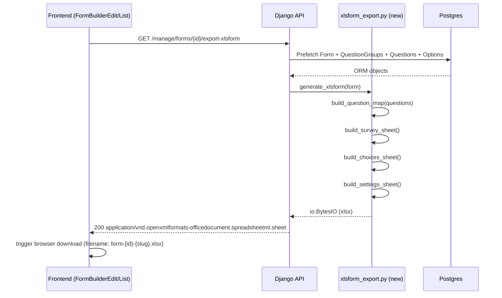

# Feature Design Document

> **Purpose**: Use this template when planning new features that require data model changes, API design, or architectural decisions. Complete this document BEFORE implementation begins.

---

## Feature: FB-014 — XLSForm Export

**Task ID**: FB-014
**Issue**: #283
**Author**: Galih Pratama (with Antigravity)
**Date**: 2026-08-03
**Status**: Draft
**Branch**: `feature/283-fb-014-xlsx-forms`

---

## 1. Context & Problem Statement

```text
Currently:
- Forms can be exported as JSON (FB-007) and submission data as Excel.
- No XLSForm export exists; there is no offline collection path via ODK Collect / KoboToolbox.

Goal:
- Add GET /api/v1/manage/forms/{id}/export-xlsform → returns .xlsx
- (Optional) GET /api/v1/manage/forms/{id}/administration-csv → cascade lookup CSV (per-form, capped at max_level)
- Add "Export XLSForm" button alongside the existing "Export" (JSON) button.
- XLSForm must be loadable by ODK Collect / KoboToolbox validators.
```

---

## 2. Architecture Overview

The exporter is a pure-function service layer (no new models, no migrations) sitting below the existing `FormBuilderViewSet`.



---

## 3. Requirements

### User Acceptance Criteria

- [ ] Clicking "Export XLSForm" in the Form Builder downloads a `.xlsx` file.
- [ ] The file is accepted by `https://getodk.org/xlsform/` without validation errors.
- [ ] Repeat groups render as `begin_repeat`/`end_repeat`; plain groups as `begin_group`/`end_group`.
- [ ] Dependency questions produce correct `relevant` XPath (options, min, max, equal, notEqual, AND/OR rules).
- [ ] Skip-logic involving `select_one` / `select_multiple` uses the correct XPath (`selected()`).
- [ ] Multilingual labels appear as `label::English (en)` etc., driven by `Forms.languages`.
- [ ] Types `tree`, `table`, and `autofield` are silently skipped (not exported); skipped names are returned in a warning header.
- [ ] Cascade questions export as `select_one_from_file administration.csv` with `choice_filter`.

### Technical Acceptance Criteria

- [ ] New service module: `backend/api/v1/v1_forms/services/xlsform_export.py`.
- [ ] New endpoint: `GET /api/v1/manage/forms/{id}/export-xlsform` (same auth as JSON export).
- [ ] `openpyxl` (already in `requirements.txt`) is the only new library dependency.
- [ ] All logic tested in `tests_form_xlsform_export.py` seeding `example-3.json` and `example-4.json`.
- [ ] No DB migration required (pure export — read-only).

---

## 4. Backend Implementation

### Data Model Changes

**None.** This feature is read-only; no new fields or migrations.

### Service: `backend/api/v1/v1_forms/services/xlsform_export.py`

**Public API:**

```python
def generate_xlsform(form: Forms) -> tuple[io.BytesIO, list[str]]:
    """Return (xlsx_bytes, skipped_question_names)."""
```

**Internal helpers:**

```python
def _build_question_map(form) -> dict[int, dict]:
    """Pre-pass: {question_id: {"name": str, "type": int}} for dependency resolution."""

def _build_relevant_expression(question, question_map) -> str:
    """Convert question.dependency + question.dependency_rule -> XPath string."""

def _build_constraint(rule: dict) -> tuple[str, str]:
    """Convert rule.min/max -> (constraint_expr, constraint_message)."""

def _map_type(question) -> tuple[str, str | None]:
    """(xlsform_type, appearance | None). Returns (None, None) for skipped types."""

def _build_survey_rows(form, question_map) -> list[dict]:
    """Walk question groups in order, emit begin/end_group/repeat rows + question rows."""

def _build_choices_rows(form) -> list[dict]:
    """Emit {list_name, name, label::*} rows for all select_one/multiple options."""

def _build_settings_row(form) -> dict:
    """Return form_title, form_id, version, default_language."""
```

**Key implementation details:**

1. **Multilingual columns**: `Forms.languages` is a list of `{"code": "en", "name": "English"}`. Columns become `label::English (en)`, `constraint_message::English (en)`, etc. The default language label is always populated from `Questions.label`; translated values come from `Questions.translations[lang_code].label`.

2. **Repeat groups**:
   - `QuestionGroup.repeatable == True` → emit `begin_repeat` / `end_repeat` rows.
   - Otherwise → `begin_group` / `end_group` rows.
   - `repeat_count` column is left blank (unlimited). If a `leading_question` is referenced in the group definition (future), emit `count-selected(${leading_name})`.

3. **Dependency → `relevant`** (§5.2 of issue):

| Entry | XPath fragment |
| --- | --- |
| `{"id": N, "options": ["a"]}` | `selected(${name}, 'a')` |
| `{"id": N, "options": ["a","b"]}` | `(selected(${name}, 'a') or selected(${name}, 'b'))` |
| `{"id": N, "min": 4}` | `${name} >= 4` |
| `{"id": N, "max": 6}` | `${name} <= 6` |
| `{"id": N, "equal": v}` | `${name} = 'v'` |
| `{"id": N, "notEqual": v}` | `${name} != 'v' and string-length(${name}) > 0` |

Fragments joined by ` and ` (AND) or ` or ` (OR) per `dependency_rule`. Unresolvable IDs → logged warning, skipped.

4. **Constraint**: `rule.min` and `rule.max` → `. >= min and . <= max`. Message: `"Value must be between {min} and {max}"`.

5. **Type mapping**:

| Akvo MIS type | XLSForm type | appearance |
| --- | --- | --- |
| `text` (3), `input` (13) | `text` | — |
| `number` (4), `allowDecimal=true` | `decimal` | — |
| `number` (4), `allowDecimal` absent/false | `integer` | — |
| `date` (9) | `date` | — |
| `option` (5) | `select_one option_{q.name}` [+ ` or_other` if any option has `other=True`] | — |
| `multiple_option` (6) | `select_multiple option_{q.name}` [+ ` or_other`] | — |
| `geo` (1) | `geopoint` | — |
| `geoshape` (14) | `geoshape` | — |
| `geotrace` (15) | `geotrace` | — |
| `image` (8) | `image` | — |
| `attachment` (11) | `file` | — |
| `signature` (12) | `image` | `signature` |
| `cascade` (7) | `select_one_from_file administration.csv` | — |
| `autofield` (10), `tree` (16), `table` (17) | *skip* | — |

6. **Cascade questions**: Multi-level cascade questions expand into sequential `select_one_from_file administration.csv` questions across the configured selectable level range (starting at Level 1 by default, since Level 0 is the fixed National root):
   - **Level 1 (Top Selectable)**: Named `${q_name}_level_1`, labeled `${label} - ${level_name}`, with `choice_filter = "level = 1"`.
   - **Level N (Children)**: Named `${q_name}_level_${lvl}`, labeled `${label} - ${level_name}`, with `choice_filter = "parent_key = ${${prev_level_q_name}}"`, and dynamic relevance `relevant = "${prev_level_q_name} != ''"` (so child levels only appear once the parent level is selected).
   - **Single-level**: If only one level is configured, outputs single question `${q_name}` with `choice_filter = "level = ${min_level}"`.

7. **`tooltip`** → mapped to XLSForm `hint` column. `addon_before/after` dropped silently.

### API Contract

| Method | URL | Purpose | Auth |
|---|---|---|---|
| `GET` | `/api/v1/manage/forms/{id}/export-xlsform` | Download `.xlsx` XLSForm | `IsAuthenticated` + `FormBuilderAccess(form_view)` |
| `GET` | `/api/v1/manage/forms/{id}/administration-csv` | Download cascade lookup CSV (per-form, capped at cascade `api.max_level`) | `IsAuthenticated` + `FormBuilderAccess(form_view)` |

**Response — export-xlsform (200)**:

```text
Content-Type: application/vnd.openxmlformats-officedocument.spreadsheetml.sheet
Content-Disposition: attachment; filename="form-{id}-{slug}.xlsx"
X-XLSForm-Skipped: autofield_q1,tree_q2   (omitted if empty)
```

**Response — administration-csv (200)**:

```text
Content-Type: text/csv
Content-Disposition: attachment; filename="administration.csv"

list_name,name,label,parent_key,level
administration,prov_1,Province A,,0
administration,dist_1,District A1,prov_1,1
...
```

### New Files

- `backend/api/v1/v1_forms/services/__init__.py` (empty)
- `backend/api/v1/v1_forms/services/xlsform_export.py`

### Modified Files

- `backend/api/v1/v1_forms/views.py` — add two `@action` methods to `FormBuilderViewSet`:
  - `export_xlsform` (detail=True, GET, `url_path="export-xlsform"`)
  - `export_administration_csv` (detail=True, GET, `url_path="administration-csv"`)
- `backend/api/v1/v1_forms/urls.py` — add two `re_path` entries.
- `backend/api/v1/v1_forms/views.py` — add `"export_xlsform"` and `"export_administration_csv"` to `get_permissions()`.

---

## 5. Frontend Implementation

### State Management & Hooks

No new state. Reuse the existing `onExport` download pattern: `api.get(..., { responseType: "blob" })` → create object URL → anchor click → revoke.

### Components & UI

**`FormBuilderEdit.jsx`** — add `onExportXlsform` handler and new `<Button>` inside the existing `<Space>` toolbar:

```text
+-------------------------------------------------------------------+
|  [↓ Export JSON]  [↓ Export XLSForm]  [🕐 History]  [✓ Publish] |
+-------------------------------------------------------------------+
```

**`FormBuilderList.jsx`** — the existing "Export" dropdown menu (`menuItems`) gains a second item:
```js
const menuItems = [
  { key: "export",        label: text.formBuilderExportButton },
  { key: "exportXlsform", label: text.formBuilderExportXlsformButton },
];
```

### i18n additions (`frontend/src/lib/ui-text.js`)

```js
formBuilderExportXlsformButton: "Export XLSForm",
formBuilderExportXlsformError: "Failed to export XLSForm",
```

---

## 6. Type/Constant Mappings

| Akvo MIS `QuestionTypes` constant | DB int | XLSForm type |
| --- | --- | --- |
| `geo` | 1 | `geopoint` |
| `text` | 3 | `text` |
| `number` | 4 | `integer` or `decimal` |
| `option` | 5 | `select_one option_{name}` |
| `multiple_option` | 6 | `select_multiple option_{name}` |
| `cascade` | 7 | `select_one_from_file administration.csv` |
| `image` | 8 | `image` |
| `date` | 9 | `date` |
| `autofield` | 10 | *(skipped)* |
| `attachment` | 11 | `file` |
| `signature` | 12 | `image` + `appearance: signature` |
| `input` | 13 | `text` |
| `geoshape` | 14 | `geoshape` |
| `geotrace` | 15 | `geotrace` |
| `tree` | 16 | *(skipped)* |
| `table` | 17 | *(skipped)* |

---

## 7. Compatibility & Migration

### Backward Compatibility

- [x] Existing JSON export endpoint (`/export`) unchanged.
- [x] No model changes — zero migration risk.
- [x] All existing API consumers unaffected.

### Mobile App Impact

- [x] No mobile sync endpoint changes.
- [x] No SQLite schema changes.

### Cascade / Administration CSV

The cascade endpoint queries the `administration` tree. The CSV format must match ODK's `select_one_from_file` expectations:

```text
list_name,name,label,parent_key,level
administration,<code>,<label>,<parent_code or blank>,<level>
```

---

## 8. Security Considerations

- [x] Same permission guard as JSON export: `IsAuthenticated` + `FormBuilderAccess(FeatureAccessTypes.form_view)`.
- [x] Form object is fetched via `get_object()` which already enforces tenant isolation.
- [x] File name is sanitized via `re.sub(r"[^a-z0-9]+", "-", form.name.lower())` (same pattern as JSON export).
- [x] No PII in generated file beyond what the form definition itself contains.

---

## 9. Testing & Verification

### Automated Tests

**New file**: `backend/api/v1/v1_forms/tests/tests_form_xlsform_export.py`

Test cases (seeding `example-3.json` and `example-4.json`):

| # | Scenario | Expected |
| --- | --- | --- |
| 1 | Endpoint returns 200 with xlsx content type | ✓ |
| 2 | `Content-Disposition` contains `.xlsx` | ✓ |
| 3 | Workbook has sheets: `survey`, `choices`, `settings` | ✓ |
| 4 | Repeatable group (example-4 `testimonials`) → `begin_repeat` / `end_repeat` | ✓ |
| 5 | Plain group (example-3 `profile`) → `begin_group` / `end_group` | ✓ |
| 6 | `option` dep single → `selected(${regular_cleaning_schedule}, 'yes')` | ✓ |
| 7 | `max` dep → `${how_often_cleaned} <= 6` | ✓ |
| 8 | AND rule across two deps | ✓ |
| 9 | OR rule across two deps | ✓ |
| 10 | `equal` dep → `${name} = 'value'` | ✓ |
| 11 | `notEqual` dep → `${name} != 'value' and string-length(${name}) > 0` | ✓ |
| 12 | Number with `allowDecimal=true` → `decimal`; else → `integer` | ✓ |
| 13 | `signature` → type `image`, appearance `signature` | ✓ |
| 14 | `attachment` → `file` | ✓ |
| 15 | Option with `other=True` → ` or_other` suffix | ✓ |
| 16 | `tree`, `table`, `autofield` questions → skipped; names in `X-XLSForm-Skipped` | ✓ |
| 17 | Choices sheet has rows for select_one / select_multiple options | ✓ |
| 18 | Settings sheet has `form_title` | ✓ |
| 19 | Unauthenticated → 401 | ✓ |
| 20 | Non-existent form → 404 | ✓ |
| 21 | Multilingual: `label::English (en)` column populated when languages present | ✓ |
| 22 | `tooltip.text` → `hint` column | ✓ |
| 23 | Cascade question → `select_one_from_file administration.csv` | ✓ |
| 24 | `generate_xlsform()` unit test on pure function | ✓ |

**Run command (inside Docker):**

```bash
./dc.sh exec backend python manage.py test \
    api.v1.v1_forms.tests.tests_form_xlsform_export --verbosity=2
```

### Manual Verification

1. Export example-3 or example-4 via `GET /api/v1/manage/forms/{id}/export-xlsform`.
2. Open the `.xlsx` and verify:
   - `survey` sheet has correct type/name/label/relevant/constraint columns.
   - `choices` sheet lists all option rows.
   - `settings` sheet has the form title.
3. Upload to `https://getodk.org/xlsform/` — must pass without errors.
4. (Optional) Load in ODK Collect: verify skip logic fires on `classrooms_cleaned = yes AND cleaning_staff <= 6`, and `testimonials` group shows "Add another".

---

## 10. Epic & Ballpark Estimation

- **Confidence Level**: High
- **Dependencies**: None (openpyxl already in requirements.txt)

| Task ID | Component & Description | Est. Hours (Min–Max) | Priority |
|---------|-------------------------|----------------------|----------|
| T-001 | Backend: `services/xlsform_export.py` — type mapping, `begin/end_group/repeat`, choices sheet, settings sheet | 4h – 6h | Must Have |
| T-002 | Backend: `_build_relevant_expression()` — all 6 dependency entry types + AND/OR joining | 3h – 5h | Must Have |
| T-003 | Backend: Multilingual label columns + `tooltip → hint` + constraint expression | 2h – 3h | Must Have |
| T-004 | Backend: `export-xlsform` endpoint + URL wiring + permission guard | 1h – 2h | Must Have |
| T-005 | Backend: `administration-csv` endpoint (cascade lookup CSV) | 2h – 4h | Must Have |
| T-006 | Backend: Automated tests (`tests_form_xlsform_export.py`, 24 test cases) | 4h – 6h | Must Have |
| T-007 | Frontend: `onExportXlsform` handler + "Export XLSForm" button in `FormBuilderEdit.jsx` | 1h – 2h | Must Have |
| T-008 | Frontend: Dropdown menu item in `FormBuilderList.jsx` + i18n strings | 1h – 2h | Must Have |

**Total estimate: 18h – 30h** (across 2–3 developer days)

---

## 11. Decision Log

### D-1: Service file location
**Options Considered**:
1. Add function to existing `functions.py` (already 1761 lines)
2. New `services/xlsform_export.py` module
**Decision**: Option 2 — new service module.
**Rationale**: `functions.py` is already very large. XLSForm logic is self-contained and benefits from its own module for testability and separation of concerns.

### D-2: Cascade question handling
**Options Considered**:
1. Skip cascade questions entirely (simplest)
2. Export as `select_one_from_file administration.csv` + companion CSV endpoint
**Decision**: Option 2 — export + companion endpoint.
**Rationale**: The issue spec explicitly calls for this. The administration tree is already in the DB; a CSV endpoint is straightforward.

### D-3: Skipped types (tree, table, autofield)
**Options Considered**:
1. Raise a 400 error if the form contains unsupported types
2. Skip silently, report skipped names in response header
**Decision**: Option 2 — skip with `X-XLSForm-Skipped` header.
**Rationale**: Graceful degradation. The form is still useful even if a few question types can't be exported. The header lets the frontend optionally show a warning toast.

### D-4: Administration CSV scope (Q2 answer)
**Options Considered**:
1. Full hierarchy (all levels) in one shared CSV
2. Per-form CSV truncated at the deepest `api.max_level` across that form's cascade questions
**Decision**: Option 2 — per-form, capped at `api.max_level`.
**Rationale**: Users download the CSV alongside the specific form they intend to deploy to ODK/Kobo. Scoping to `max_level` avoids exposing deeper administrative data than the form requires, and keeps file size manageable.

---

## 12. Open Questions & References

- [x] **Q1 ✅ RESOLVED**: Export XLSForm button available on **all forms** (draft and published), same behaviour as JSON export.
- [x] **Q2 ✅ RESOLVED**: Administration CSV is **scoped per-form**, truncated at the deepest `api.max_level` found across all cascade questions in that form. Users download the CSV for the specific form they need — no monolithic all-levels dump.
- [x] **Q3 ✅ RESOLVED**: **No `pyxform` dependency**. Validation is manual (ODK XLSForm validator / KoboToolbox) — not automated in CI.

**Related**:
- FB-007 spec: [FB-007-form-import-export.md](../design/FB-007-form-import-export.md)
- Example forms: [example-3.json](../../backend/source/forms/example-3.json), [example-4.json](../../backend/source/forms/example-4.json)
- XLSForm spec: https://xlsform.org/
