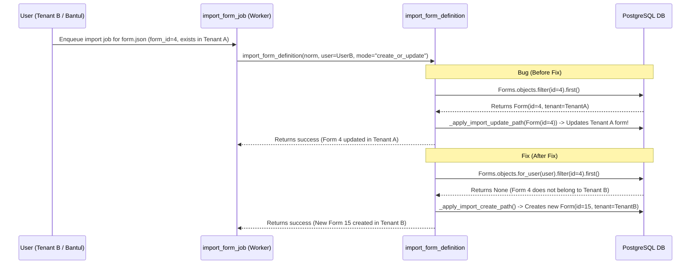

# Feature Specification: FB-015 Form Import Tenant Isolation Bug

## Overview
When importing a form definition JSON file into a multi-tenant environment (e.g. `bantul.mis.akvotest.org`), `import_form_definition` in `backend/api/v1/v1_forms/functions.py` looks up existing forms by `file_form_id` using `Forms.objects.filter(id=file_form_id).first()` **without tenant scoping**.

Because `file_form_id` is an ID from another tenant (or standard seed export), `import_form_definition` matches the form in the **exporting/seed tenant**, enters the update path (`_apply_import_update_path`), and updates the form in the **exporting tenant**. As a result, no form is created under the target tenant (`bantul.mis.akvotest.org`), leaving the form builder list empty even though the background import job reports success.

## Problem Statement — 5W1H
*   **Who**: Users and admins importing forms into tenant workspaces (e.g., `bantul.mis.akvotest.org`).
*   **What**: Form import updates a foreign tenant's form instead of creating a new form in the current user's tenant when `file_form_id` exists in another tenant.
*   **Where**: `backend/api/v1/v1_forms/functions.py` (`import_form_definition` and `_resolve_import_parent`).
*   **When**: During form definition import (`POST /api/v1/manage/forms/import`) when `file_form_id` matches an existing form ID in another tenant.
*   **Why**: `Forms.objects.filter(id=file_form_id)` is not scoped to `user.tenant`, breaking multi-tenant write isolation.
*   **How**: Scope form lookup in `import_form_definition` and parent lookup in `_resolve_import_parent` using `Forms.objects.for_user(user)` so form IDs belonging to other tenants are treated as nonexistent for the importing user, triggering a clean creation path under the target tenant.

## Architecture Overview



## Backend
### DB Model Changes
None. No schema changes or database migrations required.

### Logic Changes
*   **`backend/api/v1/v1_forms/functions.py`**:
    *   In `import_form_definition(norm, user, mode, ...)`:
        Change line 1289:
        ```python
        existing_form = None
        if mode != "create_copy" and file_form_id is not None:
            qs = Forms.objects.for_user(user) if user else Forms.objects
            existing_form = qs.filter(id=file_form_id).first()
        ```
    *   In `_resolve_import_parent(norm, override_parent_id, form_type, required=True, user=None)`:
        Pass `user` and use `Forms.objects.for_user(user)` when looking up `override_parent_id` and `hint["id"]`.

## Verification
### Automated Tests
*   `python manage.py test api.v1.v1_forms.tests.tests_form_import_tenant`
    *   New test: `test_import_form_with_existing_foreign_id_creates_new_form_in_current_tenant`
    *   Imports a JSON payload containing `form_id = tenant_b_form.id` logged in as `tenant_a_user`.
    *   Asserts a new form is created with `tenant = tenant_a` and `tenant_b_form` remains intact and unchanged.

### Manual Steps
1.  Log in to tenant `bantul.mis.akvotest.org`.
2.  Import a form JSON exported from another tenant or seed (which has a `form_id`).
3.  Verify the background import job succeeds.
4.  Open the Form Builder list on `bantul.mis.akvotest.org` — the imported form appears properly in the list.
5.  Click to open/edit the form — all groups, questions, options, and rules render correctly.

## Estimation
| Task | Details | Hours (Min-Max) | Confidence |
|------|---------|-----------------|------------|
| T-001 | Backend: Scope `existing_form` and `_resolve_import_parent` lookup to `user.tenant` | 0.5 - 1.0 | High |
| T-002 | Backend: Add multi-tenant form import unit test | 0.5 - 1.0 | High |
| T-003 | Manual verification and QA | 0.5 - 1.0 | High |
| **Total** | | **1.5 - 3.0** | |
