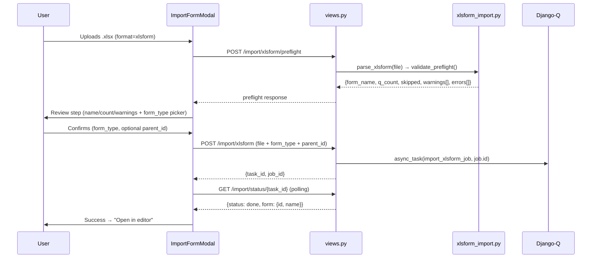

# Feature Design: XLSForm Import (FB-016)

**Feature ID**: FB-016
**Branch**: `feature/283-fb-014-xlsx-forms`
**Status**: Approved — Ready for Implementation
**Author**: Galih Pratama
**Date**: 2026-08-25
**Estimation**: 11.5h (Vibe coding)

---

## 1. Context & Problem Statement

The platform exports any published form as an XLSForm (FB-014). There is no
reverse path. Form designers working in KoboToolbox, ODK Build, or who receive
a partner-authored XLSForm cannot upload it into Akvo MIS.

**Use cases**:
- Import XLSForms authored externally (KoboToolbox, ODK Build)
- Round-trip: export from Akvo MIS → edit in Excel → re-import as a new draft
- Bulk provisioning of standard forms across tenants

---

## 2. Design Decisions

| # | Topic | Decision |
|---|---|---|
| 1 | Form type | UI **always** asks user to pick Registration vs Monitoring |
| 2 | Cascade post-import | Post-import warning banner in form editor; no wizard step |
| 3 | Form matching | **Option A** — always create a fresh draft (no update-existing logic) |
| 4 | Translations | **All** `label::*` columns imported into translations model |

---

## 3. Architecture

### Logic Flow

```
Upload .xlsx
    → POST /api/v1/manage/forms/import/xlsform/preflight
        → parse_xlsform() + validate_preflight()
        → 200 {form_name, q_count, skipped, warnings, errors}
    → User reviews & confirms (form_type + optional parent_id)
    → POST /api/v1/manage/forms/import/xlsform
        → server re-validates, stores file to upload/ storage
        → Jobs.objects.create(type=import_form)  ← reuses JobTypes.import_form
        → async_task("...tasks.import_xlsform_job", job.id)
        → 200 {task_id, job_id}
    → Poll GET /api/v1/manage/forms/import/status/{task_id}  ← EXISTING endpoint
        → 200 {status: done, form: {id, name, action}}
    → Frontend: redirect to /control-center/form-builder/{id}/edit
```

### Sequence Diagram



---

## 4. Backend

### 4.1 New Service — `backend/api/v1/v1_forms/services/xlsform_import.py`

#### `parse_xlsform(file_obj) → dict`

Reads with `openpyxl.load_workbook(data_only=True)`. Raises `ValueError` on
missing `survey` sheet.

**Settings sheet parsing** (`form_title`, `version`, `default_language`):
- `form_title` → form name
- `default_language` → strip `(en)` suffix to extract ISO code
- `version` → passed through

**Survey sheet parsing** (two-pass):

*Pass 1*: Build `name_to_tmp_id` map assigning a sequential `tmp_id` per
question row (used for dependency resolution before DB IDs exist).

*Pass 2*: For each row:

| XLSForm `type` value | `appearance` | → Akvo MIS type | Note |
|---|---|---|---|
| `text`, `string`, `input` | — | `text` |  |
| `integer`, `int` | — | `number` | `allowDecimal=false` |
| `decimal` | — | `number` | `allowDecimal=true` |
| `date` | — | `date` |  |
| `select_one {list}`, `select one {list}`, `select_1 {list}` | — | `option` | list_name → choices sheet (supports `or_other`) |
| `select_multiple {list}`, `select multiple {list}` | — | `multiple_option` | choices sheet (supports `or_other`) |
| `geopoint` | — | `geo` |  |
| `image`, `photo` | — | `image` |  |
| `image`, `photo` | `signature` | `signature` |  |
| `file` | — | `attachment` | reads `body::accept` → `allowedFileTypes` |
| `select_one_from_file administration.csv` | — | `cascade` |  |
| `begin_group` / `end_group` | — | question group boundary |  |
| `begin_repeat` / `end_repeat` | — | repeat group boundary | `repeat_count` links `leading_question` |
| anything else (e.g. `calculate`, `note`, `audio`, `barcode`) | — | **skipped** + warning `{"path": "row:N", ...}` |  |

**`relevant` column → dependency**:

`parse_relevant_expression(expr, name_to_tmp_id)` reverses `_build_relevant_expression()`:

| XPath pattern | → dependency field |
|---|---|
| `selected(${q}, 'v')` / `selected(${q}, "v")` | `options: ['v']` |
| `selected(${q}, 'a') or selected(${q}, 'b')` | `options: ['a','b']` |
| `${q} >= N` / `${q} > N` | `min: N` |
| `${q} <= N` / `${q} < N` | `max: N` |
| `${q} = 'v'` / `${q} = "v"` | `equal: 'v'` |
| `${q} != 'v' and string-length(${q}) > 0` | `notEqual: 'v'` |

- Clauses joined by ` and ` → `dependency_rule: "AND"` (default)
- Clauses joined by ` or ` → `dependency_rule: "OR"`
- Unrecognized XPath → skip + append warning; question still imported

**`constraint` column** → `rule.min` / `rule.max`:

- Standard `. >= N`, `. <= N`, `. >= N and . <= N`
- Chained comparisons: `0 <= . <= 100`, `100 >= . >= 0`, `0 <= ${q} <= 100`
- Self-variable references `${q_name} <= N`, `(${q_name} <= N)`
- Parenthesized compound expressions `((. >= 0) and (. <= 100))`
- Reversed bounds `0 <= . and . <= 100` (translated to `min: 0, max: 100`)
- Unparsed constraint logic (e.g. `regex(...)`) extracts valid bounds and appends warning

**`repeat_count` column** → Repeat Groups:

- Extracts referenced question tmp_id for expressions like `count-selected(${fish_species})` or `${target_count}`
- Automatically assigns `leading_question` tmp_id on the repeat group for Akvo MIS data model compatibility

**`required` column** → `rule.required: true` if cell is `"yes"`, `"true"`, `"1"`, etc.

**Choices sheet** → `option[]` list per `list_name`. Each row: `name` (value), `label::*`

**Translations**: For each `label::*` column, extract the ISO code from the
display suffix `(en)`, `(fr)`, etc. using `_extract_iso()` from `xlsform_export.py`.
- First `label::*` (or bare `label`) → primary label
- Secondary `label::*` → `translations: { "en": "...", "fr": "..." }`

#### `validate_preflight(parsed) → (errors[], warnings[])`

- **Error**: no questions found after skipping
- **Error**: duplicate `variable_name` / `name` values within a group
- **Error**: missing `name` column in survey sheet
- **Warning**: N rows skipped (unsupported type e.g. `calculate`)
- **Warning**: unresolvable `relevant` expression on question or group
- **Warning**: dynamic `repeat_count` on repeat groups (explaining manual repeat behavior)
- **Warning**: unsupported constraint clauses or calculations

#### `build_form_payload(parsed, form_type, parent_id) → dict`

Outputs a dict matching the `normalize_form_definition()` contract:

```python
{
    "_meta": None,
    "form_id": None,          # always None → always creates new (Option A)
    "name": parsed["form_name"],
    "type": FormTypes.registration | FormTypes.monitoring,
    "version": parsed.get("version") or 1,
    "languages": list(parsed["languages"]),
    "default_language": parsed["default_language"],
    "translations": None,
    "parent_hint": {"id": parent_id} if parent_id else None,
    "question_group": [ ... ],   # groups with question[]
}
```

Each question dict follows `_normalize_import_question()` schema:
`type`, `name`, `label`, `required`, `translations`, `dependency`,
`dependency_rule`, `rule`, `option`, `allowDecimal`.

### 4.2 New Async Task — `backend/api/v1/v1_forms/tasks.py`

```python
def import_xlsform_job(job_id):
    """Background task for XLSForm import (FB-016).

    Pattern identical to import_form_job():
      1. Download file from upload/ storage
      2. parse_xlsform() → build_form_payload()
      3. normalize_form_definition() → validate_form_definition()
      4. import_form_definition(norm, user, mode="create_copy", parent_id=...)
      5. Update Jobs row to done/failed
    """
```

Key differences from `import_form_job`:
- Reads `.xlsx` binary with `openpyxl` instead of `json.load()`
- Always passes `mode="create_copy"` (Option A: no update-existing)
- Reads `form_type` and `parent_id` from `job.info`
- Stores parse warnings back into job result

### 4.3 New URL Routes — `backend/api/v1/v1_forms/urls.py`

Insert **after** `export-xlsform` route (~line 79), before existing import routes:

```python
# FB-016: XLSForm import
re_path(
    r"^(?P<version>(v1))/manage/forms/import/xlsform/preflight$",
    FormBuilderViewSet.as_view({"post": "import_xlsform_preflight"}),
    name="import-xlsform-preflight",
),
re_path(
    r"^(?P<version>(v1))/manage/forms/import/xlsform$",
    FormBuilderViewSet.as_view({"post": "import_xlsform"}),
    name="import-xlsform",
),
```

Status polling reuses **existing** `GET /import/status/{task_id}` — no new route.

### 4.4 New View Actions — `backend/api/v1/v1_forms/views.py`

**Permission map additions** (alongside existing `import_preflight` entry):

```python
"import_xlsform_preflight": [
    IsAuthenticated,
    FormBuilderAccess(FeatureAccessTypes.form_create),
],
"import_xlsform": [
    IsAuthenticated,
    FormBuilderAccess(FeatureAccessTypes.form_create),
],
```

**`import_xlsform_preflight`** (~line 1045 area, after `import_preflight`):
- Validate: file present, `.xlsx` extension, size ≤ 5 MB
- Call `parse_xlsform(file_obj)` + `validate_preflight(parsed)`
- Return 200 with `{form, question_count, group_count, skipped_count, warnings, errors}`
- Return 400 on parse errors

**`import_xlsform`** (~line 1155 area, after `import_definition`):
- Validate: file, `form_type` in `("registration", "monitoring")`, optional `parent_id`
- Server-side re-parse (preflight advisory only, never trusted)
- Store file to `upload/` via `FileSystemStorage` + `storage.upload()`
- `Jobs.objects.create(type=JobTypes.import_form, info={file, form_type, parent_id})`
- `async_task("...tasks.import_xlsform_job", job.id, hook="...import_form_job_result")`
- Return 200 `{task_id, job_id}` (reuses existing `import_form_job_result` hook)

### 4.5 New Serializers — `backend/api/v1/v1_forms/serializers.py`

```python
class XLSFormImportPreflightSerializer(serializers.Serializer):
    file = serializers.FileField()

class XLSFormImportSerializer(serializers.Serializer):
    file = serializers.FileField()
    form_type = serializers.ChoiceField(
        choices=["registration", "monitoring"]
    )
    parent_id = serializers.IntegerField(required=False, allow_null=True)
```

### 4.6 `JobTypes` constant — `backend/api/v1/v1_jobs/constants.py`

`import_form` (type=8) is **reused** — no new constant needed.

---

## 5. Frontend

### 5.1 `frontend/src/pages/form-builder/components/ImportFormModal.jsx`

**New state variable**: `importFormat = "json" | "xlsform"` (Radio.Group at top of upload step).

**Changes by step**:

| Step | JSON mode | XLSForm mode |
|---|---|---|
| `upload` | `accept=".json"`, existing dragger hint | `accept=".xlsx,.xls"`, new hint text |
| `beforeUpload` | `.json` extension check | `.xlsx`/`.xls` extension check |
| Preflight URL | `/manage/forms/import/preflight` | `/manage/forms/import/xlsform/preflight` |
| `review` | existing (update/copy mode, parent picker) | new: form type picker + parent picker |
| Submit URL | `/manage/forms/import` | `/manage/forms/import/xlsform` |
| Submit body | `{file, mode}` | `{file, form_type, parent_id}` |

**New state variables for XLSForm review**:
- `formType = "registration" | "monitoring"` (Radio.Group)
- Parent picker reuses existing `parentId` / `parentOptions` / `searchParentForms`

**Upload step wireframe**:
```
Format:  ● JSON definition   ○ XLSForm (.xlsx)
┌──────────────────────────────────────────────┐
│  📥  Click or drag a form export file here   │
│  Supports JSON or XLSForm. Max 5 MB.         │
└──────────────────────────────────────────────┘
```

**XLSForm review step wireframe**:
```
Form: "Household Survey"  (24 questions, 3 groups)
⚠ 1 row skipped: row:12 — unsupported type 'calculate'

Form Type:  ● Registration   ○ Monitoring

[  Confirm Import  ]   [  Back  ]
```
(Parent picker appears below Form Type when Monitoring is selected.)

### 5.2 `frontend/src/lib/ui-text.js`

New keys to add after `formBuilderImportCloseButton` (line 280):

```js
formBuilderImportFormatLabel: "File Format",
formBuilderImportFormatJson: "JSON Definition",
formBuilderImportFormatXlsform: "XLSForm (.xlsx)",
formBuilderImportXlsformDraggerHint: (mb) =>
  `Supports XLSForm standard (survey / choices / settings). Max ${mb} MB.`,
formBuilderImportXlsformInvalidFile:
  "Only .xlsx or .xls files are supported",
formBuilderImportXlsformFormTypeLabel: "Form Type",
formBuilderImportXlsformFormTypeRegistration: "Registration",
formBuilderImportXlsformFormTypeMonitoring: "Monitoring",
formBuilderImportXlsformFormTypeRequired: "Please select a form type",
formBuilderImportXlsformSkippedSummary: (n) =>
  `${n} row(s) skipped (unsupported type)`,
```

---

## 6. Test Plan

### 6.1 New Test File — `backend/api/v1/v1_forms/tests/tests_form_xlsform_import_service.py`

| Test | Covers |
|---|---|
| `test_parse_basic_types` | text, integer, decimal, date, geopoint → correct Akvo MIS types |
| `test_parse_signature` | `image` + `appearance: signature` → `signature` |
| `test_parse_select_one` | `select_one list` + choices sheet → `option` + options list |
| `test_parse_select_multiple` | `select_multiple list` → `multiple_option` |
| `test_parse_or_other` | `select_one list or_other` → option with `other=True` |
| `test_parse_cascade` | `select_one_from_file administration.csv` → `cascade` |
| `test_parse_attachment` | `file` → `attachment`; `body::accept` → `allowedFileTypes` |
| `test_parse_groups` | `begin_group`/`end_group` → correct group boundaries |
| `test_parse_constraint` | `. >= 1 and . <= 10` → `rule: {min:1, max:10}` |
| `test_parse_required` | `required=yes` → `rule: {required: true}` |
| `test_parse_translations` | `label::English (en)`, `label::French (fr)` → primary + translations dict |
| `test_parse_relevant_selected` | `selected(${q}, 'val')` → `options: ['val']` |
| `test_parse_relevant_selected_multi` | `selected(${q}, 'a') or selected(${q}, 'b')` → `options: ['a','b']` |
| `test_parse_relevant_min_max` | `${q} >= 3 and ${q} <= 10` → `{min:3, max:10}`, rule AND |
| `test_parse_relevant_equal` | `${q} = 'yes'` → `{equal: 'yes'}` |
| `test_parse_relevant_not_equal` | `${q} != 'no' and string-length(...)` → `{notEqual:'no'}` |
| `test_parse_relevant_or_rule` | two clauses joined ` or ` → `dependency_rule: OR` |
| `test_parse_relevant_unrecognized` | raw XPath → no dependency + warning |
| `test_parse_skip_unsupported` | `calculate` rows → skipped + warning |
| `test_preflight_error_no_survey_sheet` | workbook with no `survey` sheet → error |
| `test_preflight_error_no_questions` | empty survey → error |
| `test_round_trip` | generate XLSForm via `generate_xlsform()` → parse back → assert key fields match |

### 6.2 Endpoint Tests — `backend/api/v1/v1_forms/tests/tests_form_xlsform_import_service.py`

| Test | Covers |
|---|---|
| `test_import_xlsform_preflight_200` | Valid `.xlsx` → 200 with `question_count`, `group_count` |
| `test_import_xlsform_preflight_400_wrong_format` | `.json` to xlsform preflight → 400 |
| `test_import_xlsform_preflight_413_too_large` | File > 5 MB → 413 |
| `test_import_xlsform_enqueues_task` | POST `/import/xlsform` → 200 `{task_id}` |

---

## 7. Work Breakdown

| Task | Files | Estimate | Priority |
|:---|:---|:---:|:---|
| **T-001** `xlsform_import.py` service | `services/xlsform_import.py` | **4h** | Must Have |
| **T-002** Async task `import_xlsform_job` | `tasks.py` | **0.5h** | Must Have |
| **T-003** URL routes | `urls.py` | **0.25h** | Must Have |
| **T-004** View actions + permission map | `views.py` | **1.25h** | Must Have |
| **T-005** Serializers | `serializers.py` | **0.5h** | Must Have |
| **T-006** Unit & endpoint tests (22 + 4) | `tests/tests_form_xlsform_import_service.py` | **2.5h** | Must Have |
| **T-007** `ImportFormModal.jsx` + `ui-text.js` | `ImportFormModal.jsx`, `ui-text.js` | **2h** | Must Have |
| **T-008** Integration & round-trip verification | — | **0.5h** | Must Have |

**Total**: **11.5h**
