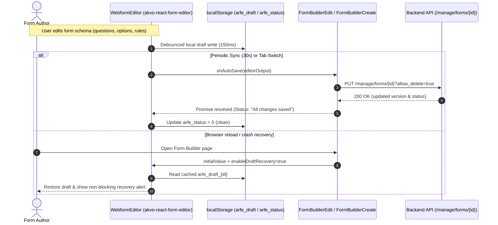

# [#512] Form Editor Auto-Save & Draft Recovery - Implementation Plan

**Task ID**: FB-017 (Issue #512)
**Date**: 2026-10-05
**Author**: Akvo Engineering Team

## Overview
Enable real-time local draft caching, automatic periodic background saving (30s interval), tab-switch synchronization, and local storage draft recovery in the Akvo MIS Form Builder using `akvo-react-form-editor@2.0.8`.

## Architecture Overview


---

## 1. Backend Integration
The backend already provides the requisite update endpoint:
- **`PUT /manage/forms/{formId}?allow_delete=true`**
- Accepts normalized `editorOutput` schema.
- Responds with `200 OK` containing updated `{ id, version, latest_version, status, ... }`.
- No backend schema or endpoint modifications are required.

---

## 2. Frontend Implementation

### 2.1 Dependency Update (Completed)
- Bump `akvo-react-form-editor` to `^2.0.8` in `frontend/package.json` and `frontend/yarn.lock`.

### 2.2 FormBuilderEdit (`/frontend/src/pages/form-builder/FormBuilderEdit.jsx`)
- Pass `enableAutoSave={true}`
- Pass `autoSaveInterval={30000}` (30 seconds)
- Pass `enableDraftRecovery={true}`
- Implement `onAutoSave` callback:
  ```javascript
  const onAutoSave = useCallback(
    async (editorOutput) => {
      const res = await api.put(
        `/manage/forms/${formId}?allow_delete=true`,
        editorOutput
      );
      setFormLatestVersion(res.data.latest_version);
      setFormVersion(res.data.version);
      setFormStatus(res.data.status);
    },
    [formId]
  );
  ```
- Pass `onAutoSave={saving ? null : onAutoSave}` to `WebformEditor`.

### 2.3 FormBuilderCreate (`/frontend/src/pages/form-builder/FormBuilderCreate.jsx`)
- Pass `enableAutoSave={true}` (enables local storage keystroke caching for new forms).
- Pass `enableDraftRecovery={true}` (recovers uncommitted drafts on accidental page refresh).
- `onAutoSave={null}` (auto-save to backend is deferred until initial form creation, preserving draft locally).

---

## 3. Verification & Testing

### 3.1 Automated Tests
- **Frontend Linter**:
  ```bash
  ./dc.sh exec -T frontend npx eslint src/pages/form-builder
  ```
- **Frontend Unit / Component Tests**:
  ```bash
  ./dc.sh exec -T frontend npm test -- src/pages/form-builder --watchAll=false
  ```

### 3.2 Manual Verification Steps
1. **Form Creation Draft Recovery**:
   - Navigate to `/control-center/form-builder/create`.
   - Add sections and multiple question types without clicking "Save".
   - Refresh the page and confirm the unsaved questions are restored with the non-blocking recovery notice.
2. **Form Editing Auto-Save**:
   - Navigate to an existing form `/control-center/form-builder/:id/edit`.
   - Make edits to a question title.
   - Observe the live status indicator changing from "Unsaved changes" -> "Saving changes..." -> "All changes saved".
   - Check network tab to confirm `PUT /manage/forms/{id}?allow_delete=true` succeeded in the background.
3. **Tab Switch Sync**:
   - In form editor, edit a question and switch tab to "Translations" or "Preview".
   - Confirm auto-save triggers immediately on tab change.

---

## 4. Epic & Vibe Coding Estimation ⏱️

- **Confidence Level**: High
- **Dependencies**: None (Package already upgraded to v2.0.8)

| Task ID | Component & Description | Vibe Coding (Dev) | Automated Testing | QA & Review | Total Est. Time | Priority |
| :--- | :--- | :---: | :---: | :---: | :---: | :--- |
| **TASK-01** | Package update verification & yarn lock alignment | 5m | 5m | 5m | **15m (0.25h)** | P1 |
| **TASK-02** | Wire auto-save & draft recovery in `FormBuilderEdit.jsx` | 15m | 10m | 10m | **35m (0.6h)** | P1 |
| **TASK-03** | Wire draft recovery in `FormBuilderCreate.jsx` | 10m | 10m | 5m | **25m (0.4h)** | P1 |
| **TASK-04** | Unit testing & lint verification | 10m | 15m | 10m | **35m (0.6h)** | P1 |
| **TOTAL** | **Full Feature Delivery** | **40m** | **40m** | **30m** | **110m (~1.8h)** | - |
