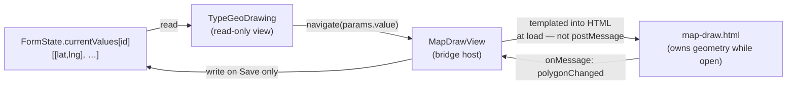
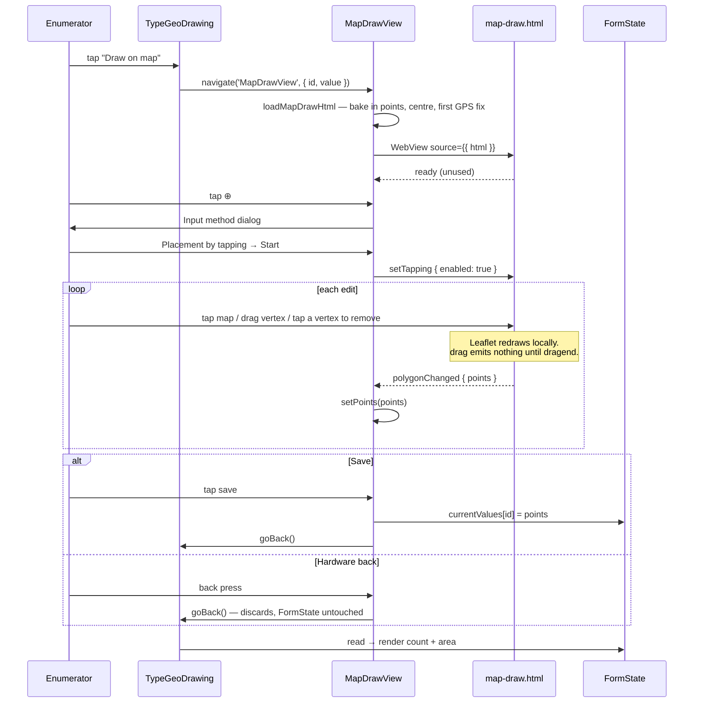

# Feature Design Document

## Feature: Polygon Capture — Draw on the Map

**Task ID**: GEO-001 (breakdown ref: T1)
**Author**: Iwan Firmawan
**Date**: 2026-09-09
**Status**: Implemented and device-verified — 2026-09-15
**Phase**: 1 — Capture & validity
**Estimate**: 12.5h ≈ 1.5 days (Mobile)

---

## 1. Context & Problem Statement

```
Currently:
- The mobile app has NO polygon field. `TypeGeo.js` captures a single lat/lng point via GPS only.
- A WebView+Leaflet map with a working two-way `postMessage` bridge already exists
  (`app/src/pages/MapView.js`, `app/assets/map.html`) — but it is **orphaned**: registered in the
  navigator, never navigated to. Proven pattern, zero users (D-6).
- `geoshape` questions ALREADY reach the app (same WebFormDetailSerializer as web) and fall
  through the `default:` branch of QuestionField.js:157 — rendering a plain TEXT INPUT.
- There is no *bundled* map library: `map.html` pulls Leaflet 1.7.1 from unpkg over the network.
  No geometry library in app/package.json.
- Web already captures polygons fine via akvo-react-form 2.7.9 (TypeGeoDrawing).

Goal:
- A geoshape question renders a map on mobile where the enumerator taps to place vertices.
- The stored value is byte-compatible with what web produces, so both clients are
  indistinguishable to the backend.
```

**This is the prerequisite for every other GEO task.** Nothing else on mobile can be
integrated or demoed without it.

---

## 2. Requirements

### User Acceptance Criteria
- [x] A `geoshape` question renders a map with drawing controls, not a text box
- [x] Tap the map to append a vertex — **once a capture mode has been started** (D-9)
- [x] Drag an existing vertex to correct it
- [x] Undo the last vertex, remove any single vertex (tap it), clear all (confirm above 3 points)
- [x] See live point count and, once ≥3 points, the enclosed area
- [x] "Centre on me" recentres the map without appending a point
- [x] Leaving and returning to the question group preserves captured points
- [x] The capture screen follows ODK/Kobo's geoshape layout, and its Input method dialog lists all
      three ODK modes with the two GPS recording modes disabled until GEO-004 (**D-9**)
- [x] A saved polygon previews as a read-only map in the datapoint detail view (§6.8)

### Technical Acceptance Criteria
- [x] Value format is `[[lat, lng], [lat, lng], …]` — identical to ARF's
- [x] Round-trips through `datapoints.json` and form save/resume without precision loss
- [ ] Compatible with `xlsform_export.py:102` geoshape export — **not exercised end to end yet**
- [x] No new native module — uses the installed `react-native-webview`
- [x] Leaflet is served from a bundled asset, not unpkg — WebView renders with the network off
- [x] With no tiles the map degrades to a usable drawing surface; capture is never blocked
- [x] Files stay within the 200–400 line guideline (Airbnb ESLint enforced) — `MapDrawView.js`
      is 355 lines, the largest

### Out of scope
- GPS boundary walking → **GEO-004**
- Overlap detection → **GEO-007**
- Offline satellite imagery → see `doc/claude/offline-satellite-imagery-plan.md`

---

## 3. Data Model Changes

**None.** No backend model change, no SQLite schema change.

The polygon is stored as an ordinary answer in the existing `datapoints.json` blob
(`{questionId: answer}`), exactly like any other question type.

---

## 4. API Contract

**No API change.** `geoshape` (type 14) already exists in `QuestionTypes` and is already
serialized to mobile by `WebFormDetailSerializer`.

---

## 5. Decision Log

### D-1: Map rendering approach

**Options Considered**:
1. `react-native-maps` — real native map component
2. WebView + Leaflet — reuse the installed `react-native-webview`
3. Plain SVG, no basemap

**Decision**: WebView + Leaflet.

**Rationale**: `react-native-webview` 13.13.5 is already a dependency, so no new native module
and no EAS dev-client rebuild is forced by this task. ARF's `TypeGeoDrawing` already renders
geometry with Leaflet, so `GeoGeometry`, `RecordedMarkers`, `FitBounds` and `MapClickHandler`
port into the WebView page nearly verbatim — one map implementation serving two hosts.

**Impact**: The RN↔WebView `postMessage` bridge has **no ARF precedent** (ARF's Leaflet runs in
the same JS context) — but it has an **in-repo precedent**: `MapView.js` + `map.html` already run
this exact pattern in production for `TypeGeo`. Reuse that pair rather than inventing a second one.

### ✅ D-1b: RESOLVED (2026-09-15) — keep ARF's `[[lat, lng]]` array

**Decision: Option 1 — keep ARF's format.** Web and mobile stay byte-identical, no upstream
change, no conversion layer. "GeoJSON" in the design review meant "JSON", loosely. If GIS-tool
consumption or auditor export ever needs true RFC 7946, the conversion belongs at the backend
boundary in **GEO-005/GEO-010**, not in the capture client.

**Still required:** the axis-order regression test described below. The format being "the same as
web" is exactly what makes a silent swap invisible.

The two formats, for the record:

| | ARF #192 (what this doc specifies) | GeoJSON (RFC 7946) |
|---|---|---|
| Structure | `[[lat, lng], [lat, lng], …]` | `{"type":"Polygon","coordinates":[[[lng,lat], …]]}` |
| **Axis order** | **latitude first** | **longitude first** |
| Ring closure | implicit | first point **repeated** at the end |
| Wrapper | none — a bare array | typed object |

**The axis order is the dangerous part.** `[9.03, 38.74]` read as GeoJSON is longitude 9.03,
latitude 38.74 — a different continent. A silent swap does not crash; it produces plausible
coordinates in the wrong place, and every downstream area and overlap calculation is quietly
wrong.

**Axis-order regression test (mandatory).** A fixture with clearly asymmetric coordinates (a plot
near the equator but far from the prime meridian) fails loudly on a swap; a symmetric test fixture
will not catch it. Note `MapView.js:42` already stores `[lat, lng]` for `TypeGeo` — the polygon
field must match that order, one nesting level deeper.

### D-2: Port target

**Decision**: Port `TypeGeoDrawing` from **akvo-react-form #192** (commit `e7d786d`), not from
the Kotlin reference validator.

**Rationale**: ARF is a working implementation of exactly this capture UX, in the same language,
producing the value format we must match. The Kotlin validator has no capture UI at all.

### ✅ D-3: RESOLVED (2026-09-15) — phase 1 ships connected-only, no offline imagery

**Decision**: **No offline imagery in phase 1.** Drawing is **connected-only** in the field; true
offline capture arrives with GPS walking (**GEO-004**). Basemap is **OpenStreetMap raster tiles**,
not satellite. Tile pre-caching for the assigned collection area is **confirmed as part of the
sync process** and lands with the tile-source resolver in **GEO-008 D-1** — out of scope here.

**Rationale**: GPS walking (GEO-004) works offline because the shape comes from the enumerator's
feet. **Drawing does not — you cannot trace a boundary you cannot see.** With no tiles, an
enumerator offline sees an empty canvas with nothing to tap against.

**Impact**: Accepted by product. Two consequences that must be built, not assumed:

1. **The map must degrade, not block.** With no tiles the enumerator sees a grey canvas — the
   tap/drag/undo controls, the point counter and the area readout must all still work. A polygon
   drawn on a blank canvas is still a valid polygon.
2. **Leaflet itself must be bundled locally** (see D-4). Today `map.html` loads it from unpkg, so
   with no network the WebView renders a *blank page* — not a degraded map. That is a bug in the
   existing `TypeGeo` flow too, and fixing it here fixes both.

### ✅ D-4: RESOLVED (2026-09-15) — Leaflet via `expo-asset`, bundled offline

**Decision**: `expo-asset`, following the existing `MapView.js:55` pattern —
`Asset.loadAsync(require(...))` → `FileSystem.readAsStringAsync` → placeholder substitution →
`<WebView source={{ html }} />`. Not an inline HTML string.

**Rationale**: the precedent already exists in this repo and both deps are installed
(`expo-asset ~11.1.7`, `expo-file-system ~18.1.11`). It keeps the Leaflet page as a real `.html`
file that is editable and lintable, instead of a template literal buried in a `.js` module.

**Scope note**: "bundle Leaflet" means inlining `leaflet.css` and `leaflet.js` **into
`map-draw.html` itself**, replacing the two unpkg `<script>`/`<link>` tags. Without that step
`expo-asset` only makes the *wrapper* offline-capable while the library still needs network.

**Implementation correction (2026-09-15).** Leaflet cannot be a *separate* asset. Metro's
`assetExts` (`app/metro.config.js`) covers `html` and `db` but not `js` or `css`, so
`require('../../assets/leaflet/leaflet.js')` is bundled as a **source module** and never reaches
`Asset.loadAsync`. Adding both extensions to `assetExts` would work but widens Metro's asset
handling for every `.css`/`.js` in the app to buy one file. One self-contained `.html` asset is
smaller in every sense. Leaflet 1.7.1 is copied from `frontend/node_modules/leaflet/dist` - it is
already a monorepo dependency, so nothing new is downloaded or added to `app/package.json`.

### D-5: Where the map lives — inline in the form, or its own screen

**Options Considered**:
1. **Inline `WebView`** inside `TypeGeoDrawing`, rendered in the form's `ScrollView`
2. **Field + dedicated screen** — the field shows a summary and a button; drawing happens on a
   pushed navigation screen

**Decision**: **Option 2 — field + dedicated screen.**

**Rationale**: a pan-and-zoom map inside a vertical `ScrollView` is a touch-gesture conflict on
Android. Every drag is ambiguous — is the enumerator panning the map or scrolling the form? The
usual workarounds (`nestedScrollEnabled`, `onStartShouldSetResponder`, fixed-height wrappers with
gesture traps) are exactly the kind of fiddly, device-specific code that the 3h device-debugging
line is there to absorb, and they would consume it before a single vertex is placed.

A dedicated screen sidesteps the whole class of problem: the map owns the full viewport and every
gesture is unambiguously the map's. It also matches the pattern already in the repo — `MapView` is
registered as a stack screen at `navigation/index.js:85` and returns its value by writing to
`FormState.currentValues` before navigating back (`MapView.js:63-72`).

**Impact**: the field component stays tiny (summary + two buttons) and the map screen carries the
complexity. Both land comfortably inside the 200–400 line guideline.

### D-6: `MapView` is orphaned — reuse the pattern, not the file

**Finding**: `app/src/pages/MapView.js` is registered in the navigator but **nothing navigates to
it**. `grep -rn "'MapView'" app/src` returns only the `Stack.Screen` registration and its own test
file. It has been dead since the initial commit; `TypeGeo` never gained a "pick on map" button.

**Decision**: build a new `MapDrawView` screen, copying `MapView`'s asset-loader and bridge
pattern. Do **not** extend `MapView` with a polygon mode.

**Rationale**: adding a second mode to a screen whose first mode has zero users couples a new
feature to untested dead code, and the "which mode am I in" branch would be exercised in only one
direction. Copying ~15 lines of proven loader is cheaper than owning that branch.

**Follow-up, not this task**: `MapView` is either a missing `TypeGeo` feature (tap the map to set
a point) or deletable dead code. Raise it as its own ticket — it should not be decided inside
GEO-001. Its offline bug (D-3, D-4) is fixed either way once Leaflet is vendored.

### D-7: `geoshape` only — `geotrace` deferred

**Decision**: implement `geoshape` (type 14) in GEO-001. Add `geotrace` (type 15) to
`QUESTION_TYPES` but do **not** wire a renderer for it.

**Rationale**: a geotrace is an open polyline — no ring closure, no enclosed area, and "clear all
above 3 points" is the wrong confirmation threshold. Sharing one component across both means a
`closed`/`open` flag threading through the page, the area readout and the validation before any
form in the field actually asks for a trace. Ship the shape; add the trace when a form needs one.

**Impact**: touchpoint #2 gets one `case`, not two. If `geotrace` reaches a device before its
renderer exists it keeps falling through to `TypeInput` — the same behaviour as today, no
regression.

---

### D-8: `geoshape` validation is nullable - found during implementation (2026-09-15)

**Decision**: `geoshape` gets its own validation branch mirroring `multiple_option`, **not** a
shared `case` with `geo`:

```js
case 'geoshape':
  yupType = Yup.array().nullable();
  if (required) {
    yupType = Yup.array().min(1, requiredError);
  }
  break;
```

**Why the design's original "add `case 'geoshape'` alongside `case 'geo'`" was not enough.**
Touchpoint 7 makes an unanswered polygon default to `null` instead of `''`. A bare `Yup.array()`
rejects **both**: `''` fails as a type error and `null` fails as "this cannot be null". So the two
touchpoints as originally specified would have moved the field from one invalid value to another
and the bug would have survived - an *optional* polygon the enumerator never opened would be
marked invalid. Verified by probe before and after:

| value | `Yup.array()` | `Yup.array().nullable()` |
|---|---|---|
| `null`, optional | `this cannot be null` | **valid** |
| `''`, optional | type error | type error |
| `null`, required | required error | required error |
| `[]`, required | required error | required error |

**Navigation was never the symptom.** `FormNavigation` stopped blocking on validation errors in
issue #136 - it shows a toast and records `FormState.feedback`, then advances anyway. So a test
asserting "the group advances" passes whether the bug is present or not. The regression test
asserts on `FormState.feedback[id]` instead, and was checked to fail when *either* half of the fix
(the `.nullable()` or the touchpoint-7 list entry) is reverted.

**`geo` has the same latent bug** - an optional, unanswered `geo` question is handed `null` and
validated against a non-nullable `Yup.array()`. Not changed here: it is a different question type
with its own field behaviour, and widening its schema inside a polygon feature is how quiet
regressions get shipped. Worth its own ticket.

---

### D-9: ODK/Kobo capture UI, with GEO-004's modes present but disabled

**Decision**: `MapDrawView` mirrors ODK Collect's geoshape screen — accuracy strip along the top,
floating control column on the right, `Points entered: N` status bar along the bottom, and an
**Input method** dialog on entry offering ODK's three modes in ODK's order:

| Mode | State in GEO-001 | Lands with |
|---|---|---|
| Placement by tapping | **enabled**, the default | GEO-001 |
| Manual location recording | listed, disabled, "Coming soon" | **GEO-004** |
| Automatic location recording | listed, disabled, "Coming soon" | **GEO-004** |

**Rationale**: enumerators in this sector are trained on ODK/Kobo. Matching the layout and the
option order means the two apps stay learnable together rather than each needing its own training.

**Why disabled rather than hidden.** Both greyed rows are GPS boundary walking, which is
GEO-004's whole subject. Showing them tells the enumerator what the screen will eventually do and
gives GEO-004 a defined place to land — the mode list, the dialog and the `inputMethod` state all
exist already, so that task adds recording, not chrome. Hiding them would mean a second UI
negotiation later, with trained users to re-teach.

**The dialog is opened by the ⊕ control, not on entry.** It is a mode chooser for the next
capture action, exactly as in ODK — the screen opens straight onto the map, and Cancel dismisses
the dialog without leaving the screen.

**Nothing is captured until a mode is started.** Before Start, the map only pans and zooms: a
touch while positioning over a corner cannot drop a stray vertex. Start arms the page via
`setTapping`, and from then on ⊕ stops reopening the chooser and drops a vertex at the map
centre (`addAtCenter`) — steadier than landing a fingertip on a corner, and the same gesture
GEO-004 needs for "record this point".

| State | Map tap | ⊕ |
|---|---|---|
| Mode not started | pans only | opens the chooser |
| Tapping started | appends a vertex | drops a vertex at the centre |

When GEO-004 enables the two recording modes, Start is where they branch — the
`handleStartInputMethod` switch is the whole integration point.

**The live position is a blue dot with an accuracy circle** (`L.circleMarker` + `L.circle`,
radius = accuracy in metres), both `interactive: false` so neither swallows a tap meant to place
a vertex. The first position is baked into the page like the polygon is; subsequent fixes arrive
over the bridge as `setMyLocation`.

> ⚠️ **The page must not be keyed on the location.** `Home.js` pushes a new
> `UserState.currentLocation` on every GPS fix. `loadHtml` therefore reads it once from
> `getRawState()` with empty deps — an earlier version subscribed to it, which would have
> rebuilt the 160 KB page and discarded the captured polygon every few seconds.

**Hardware back pops to `FormPage` and discards.** `FormPage.js:293` keeps a
`hardwareBackPress` listener registered with no focus guard, so while this screen is on top the
form underneath would otherwise handle the press — opening its save dialog or popping past it.
`MapDrawView` registers its own listener on mount (so it runs first), calls `goBack()` and
returns `true`. Back never commits: only the save control writes to `FormState`.
**It must be `goBack()`, never `navigate('FormPage')` — see D-10.**
> The real fix is a focus guard on `FormPage`'s listener. Left alone deliberately — it is a
> heavily used screen and widening its back behaviour inside a polygon feature is how quiet
> regressions ship. Worth its own ticket.

**Accuracy is free.** `Home.js:281` already runs a `watchPositionAsync` into
`UserState.currentLocation`, so the top strip reads live accuracy without this screen opening a
watch of its own — which matters, because "no path leaves a GPS watch running" is a GEO-004
acceptance criterion and the cheapest way to meet it is to not start one.

---

### D-10: leave a screen with `goBack()`, never `navigate()` by name — found on device (2026-09-15)

**This one destroyed a submission in testing.** An enumerator filled in a form, opened the map,
pressed hardware back, finished the form and submitted. The toast said *"Data point submitted"*.
The datapoint was not in the list. It had never been written.

**Decision**: `MapDrawView` leaves via `navigation.goBack()`. Never `navigation.navigate('FormPage')`.

**Mechanism**, verified in the installed `@react-navigation/routers` v6
(`StackRouter.js:271-292`):

```js
} else {                                    // no `merge` flag — the default
  params = routeParamList[route.name] !== undefined
    ? { ...routeParamList[route.name], ...action.payload.params }
    : action.payload.params;                // ← undefined
}
```

**React Navigation 6 REPLACES a route's params on `navigate`** unless `merge: true` is passed.
`FormPage` declares no `initialParams`, so navigating to it by name with no params set its params
to `undefined`. The chain from there:

| Step | Result |
|---|---|
| `FormPage:42` `route?.params?.id` | `undefined` → `form: undefined` on the row |
| `FormPage:45` `route?.params?.newSubmission` | `undefined` → **`persistSubmission(…, false)`** |
| `writeRow` | takes the update branch → `crudDataPoints.updateDataPoint` |
| `sql.updateRow` | `UPDATE datapoints SET … WHERE id = ?` bound with `undefined` |
| SQLite | `WHERE id = NULL` matches nothing, changes nothing, **raises nothing** |
| `persistSubmission` | returns `'saved'` → success toast → form closed |

`updateRow` never checks rows-affected, so a no-op update is indistinguishable from a successful
one. The blank form title in the bug report was the same wipe showing its only visible face.

**Why `goBack()` and not `merge: true`.** Both fix this call site. `goBack()` is strictly simpler:
it pops without touching the route below, where `navigate` searches the stack by name and then
rewrites the matched route's params. There is nothing for `merge` to get wrong because there is
no param write at all.

**What is deliberately NOT fixed here**, both raised as their own tickets:
1. **Submission identity lives in route params.** `newSubmission`, `dataPointId` and the form id
   would be safer in `FormState`, where no navigation action can reach them. Not moved inside a
   polygon feature — it touches the app's most important screen, and the blank title is currently
   the only human-visible signal that a wipe happened. Move the title and the data fields
   together or not at all.
2. **`persistSubmission` reports success over a write that changed nothing.** An update with no
   id should insert rather than no-op, so the answers land somewhere regardless of cause. That
   guard protects against every route to this failure, not just the one diagnosed.

**Rule for every future screen in this feature**: a screen that sits on top of `FormPage` leaves
by popping. If you ever need `navigate` by name to a screen that carries params, pass
`merge: true`.

---

## 6. Component Design

### 6.1 File layout

| File | Status | Lines (est.) | Responsibility |
|---|---|---|---|
| File | Status | Lines | Responsibility |
|---|---|---|---|
| `app/src/pages/MapDrawView.js` | new | 355 | Screen: ODK-style chrome, WebView host, bridge, input-method dialog |
| `app/src/form/fields/TypeGeoDrawing.js` | new | 72 | Field: count + area readout and a single "Draw on map" button |
| `app/assets/map-draw.html` | new | 891 | Leaflet page — **≈180 authored, the rest is inlined Leaflet 1.7.1** (D-4) |
| `app/src/form/lib/geometry.js` | new | 31 | `polygonArea` / `polygonAreaHectares` — shoelace on a local planar projection |
| `app/src/lib/map-draw-html.js` | new | 28 | Loads the asset and bakes in points/centre/read-only — shared by both WebView hosts |
| `app/src/components/FormDataDetails/GeoshapeView.js` | new | 111 | Read-only preview of a saved polygon in the datapoint detail list (§6.8) |
| `app/__mocks__/react-native-webview.js` | new | 18 | Package-level Jest mock; `RNCWebViewModule` has no native binary under Jest |
| `app/setup-test-env.js` | modified | +5 | Global `react-native-safe-area-context` mock (§6.9) |
| `app/src/lib/i18n/ui-text.js` | modified | +36 | 18 new keys × en/fr — capture controls and the input-method dialog |
| `app/.prettierignore` | modified | +1 | `map-draw.html` — the inlined Leaflet blob must not be reformatted |

Leaflet 1.7.1 is **inlined into `map-draw.html`**, not shipped as separate asset files — see the
implementation correction in D-4.

`polygonArea` lives in RN, not in the page, so the unit test runs in Jest without a WebView.
The page asks for nothing it cannot draw.

### 6.2 State ownership

One rule, and every race in §10 follows from it:

> **While the map screen is open, `map-draw.html` owns the geometry. `MapDrawView` mirrors it.**
> `FormState` is written **only** by the save control — never on unmount, never on back.



The initial polygon is **substituted into the HTML string before the WebView loads**, never posted
across the bridge. That is what makes the load race (§10 risk 1) structurally impossible rather
than merely unlikely — there is no message to arrive early.

### 6.3 `TypeGeoDrawing` interface

Props match the sibling fields exactly (`TypeGeo.js:11-20`) so `QuestionField`'s `case` is a
copy of its neighbours:

```
TypeGeoDrawing({ keyform, id, label, value = [], tooltip, required,
                 requiredSign = '*', disabled = false })
```

Renders:
- `<FieldLabel>` — same as every other field
- point count; enclosed area (ha, 2 dp) once `value.length >= 3`; a "no shape captured yet"
  line when empty
- **Draw on map** → `navigation.navigate('MapDrawView', { id, value, name: label })`

**One button, not two.** The draft specified a Clear here as well; clearing ended up on the map
screen instead, next to undo, where the enumerator can see what they are destroying. A Clear on
the field would discard a shape whose only representation on that screen is the number `7`.

It does **not** render a map. It has no WebView, no Leaflet, no bridge. `FieldLabel` is imported
from `../support/FieldLabel` rather than the `../support` barrel, which re-exports
`FormNavigation` and drags `expo-background-task` into every test that renders a field.

### 6.4 Bridge protocol

Two message types outbound, five inbound. The initial polygon, centre, read-only flag and
first GPS fix are templated at load, not posted.

**WebView → React Native** (`window.ReactNativeWebView.postMessage`):

| `type` | Payload | Fired on |
|---|---|---|
| `polygonChanged` | `{ points: [[lat, lng], …] }` | tap-append, `addAtCenter`, `dragend`, vertex removal, `setPoints` |
| `ready` | `{}` | page script finished |

`ready` is sent but **nothing listens to it**. It was specified to gate the Save button; that
proved unnecessary once the polygon was templated in rather than posted, because there is no
window in which the page is loaded and the geometry is not. Kept as the hook GEO-004 will want
for "wait for the map before arming a GPS watch"; delete it if that turns out otherwise.

`polygonChanged` always carries the **full point array**, never a delta. This is the whole
mitigation for §10 risk 3: a message that arrives out of order is a stale *snapshot*, and the next
one corrects it — where an out-of-order `{insert at index 4}` delta would corrupt the shape
permanently. Full arrays cost ~30 bytes per vertex; a 50-vertex plot is a 1.5 KB message on a
gesture-rate channel. Not a budget worth optimising against correctness.

**React Native → WebView** (`webViewRef.current.postMessage`):

| `type` | Payload | Purpose |
|---|---|---|
| `setPoints` | `{ points: [[lat, lng], …] }` | undo and clear — RN sends the array it wants |
| `setTapping` | `{ enabled }` | arms map taps when a capture mode starts (D-9) |
| `addAtCenter` | `{}` | the ⊕ control — drops a vertex at the map centre |
| `setMyLocation` | `{ lat, lng, accuracy }` | moves the blue dot and its accuracy circle |
| `centreOnMe` | `{ lat, lng }` | recentre only — must **not** append a vertex (AC) |

`setPoints` rather than separate `undo`/`clear` commands: both are "make the geometry be exactly
this", so one full-snapshot command covers them and stays consistent with the outbound rule above.
The page owns geometry for *gestures*; an explicit command overwrites it wholesale.

Every inbound command is safe to send late. Four of the five are user-initiated, so the page is
long since loaded; `setMyLocation` is a heartbeat whose next tick corrects a lost one. If any
lands early the effect is cosmetic — the dot does not move, the map does not recentre — and the
enumerator repeats the action. **No inbound message carries geometry the app cannot reconstruct.**

**Listener registration** (§10 risk 2) — the page registers both forms:

```
document.addEventListener('message', handler);  // legacy Android
window.addEventListener('message', handler);    // iOS + modern Android
```

### 6.5 Capture sequence



### 6.6 Degraded (no tiles) behaviour — D-3 consequence

The tile layer's failure is silent by design: Leaflet renders empty tiles and the map stays
interactive.

**Built:**
- `L.tileLayer(..., { errorTileUrl: <1×1 transparent GIF data URI> })` — suppresses the
  broken-tile icons that would otherwise tile the whole viewport
- the point counter, area readout and every control stay enabled with no tiles

**Specified but NOT built — the offline banner.** The draft called for a persistent
*"Map imagery unavailable offline"* notice when no tile has loaded. There is no such banner. The
honest reason is that "no tile has loaded" is awkward to detect reliably — Leaflet's `tileerror`
fires per tile, and distinguishing "offline" from "this corner of the world has no tiles at this
zoom" needs a heuristic nobody has specified. The enumerator currently infers it from a blank
grey canvas, which is not nothing but is not an explanation either. **Carry this to GEO-008**,
where the tile-source resolver already has to know whether tiles are available.

**Explicitly not built, by design**: any check that blocks capture on missing tiles. A polygon
drawn on a blank canvas is a valid polygon (D-3).

### 6.7 Type/Constant Mappings

| Frontend/Editor | Backend Constant | DB Value | Mobile |
|-----------------|------------------|----------|--------|
| `"geoshape"` | `QuestionTypes.geoshape` | `14` | `QUESTION_TYPES.geoshape` *(to add — renderer wired)* |
| `"geotrace"` | `QuestionTypes.geotrace` | `15` | `QUESTION_TYPES.geotrace` *(constant only — D-7)* |

### 6.8 Read-only preview in the datapoint detail view

A saved `geoshape` reaching `SubtitleContent` falls through to `default:` and renders as a run of
concatenated digits, since `<Text>` flattens an array of coordinate pairs into its numbers. The
`geoshape` case renders `GeoshapeView` instead: the same `map-draw.html`, loaded with
`data-readonly="true"`.

Read-only is not cosmetic. The preview sits inside the detail `SectionList`, which is exactly the
gesture conflict D-5 avoided by giving capture its own screen. So the page disables `dragging`,
`touchZoom`, `doubleClickZoom`, `scrollWheelZoom`, `boxZoom`, `keyboard` and `tap`, drops the zoom
control, makes vertices non-draggable and skips the map click handler — the map becomes a picture
of the shape and the list keeps its scroll.

Both hosts share `loadMapDrawHtml({ points, center, readonly })` rather than each doing their own
`Asset.loadAsync` → `readAsStringAsync` → substitute. The attribute-escaping of the baked-in JSON
lives there too, in one place, and is unit-tested directly.

### 6.9 Safe-area inset on the capture screen

`MapDrawView` renders without a header and edge to edge, so the Save button sits under Android's
gesture bar. `paddingBottom: insets.bottom + 8` via `useSafeAreaInsets`, matching `FAButton.js:41`.

Under Jest `useSafeAreaInsets` throws without a `SafeAreaProvider` in the tree, so
`setup-test-env.js` now registers the library's own mock globally — several existing screens and
fields read insets, so this belongs in shared setup rather than in one test file.

---

## 7. Compatibility & Migration

### The integration touchpoints

Adding the type to `QUESTION_TYPES` alone produces a field that **renders but validates
wrongly**. All of these must land together. Line numbers and current contents verified against
`7f68df2a` — the earlier draft's references to `constants.js:26`, `lib/index.js:364/406/462` and
`FormNavigation.js:56/102` were approximate; the anchors below are the exact expressions to grep
for, which survive the file shifting under them.

| # | File | Anchor — current code | Change | Symptom if skipped |
|---|---|---|---|---|
| 1 | `app/src/lib/constants.js` | `QUESTION_TYPES = { … signature: 'signature' }` (≈L31–142) | Add `geoshape`, `geotrace` | Type never matches |
| 2 | `app/src/form/components/QuestionField.js` | `case QUESTION_TYPES.signature:` … `default:` | Add `case QUESTION_TYPES.geoshape:` → `<TypeGeoDrawing>` | Renders a plain text input |
| 3 | `app/src/form/fields/TypeGeoDrawing.js` + `fields/index.js` | `export { default as TypeSignature } …` | New component + export line | Nothing to render |
| 4 | `app/src/form/lib/index.js` | `case 'geo':` → `yupType = Yup.array();` | Add a **separate** `case 'geoshape':` → `Yup.array().nullable()`, `min(1)` when required (**D-8** — not a shared branch with `geo`) | Falls to `default: Yup.string()` — **an array fails a string schema**; a non-nullable array flags every untouched optional polygon |
| 5 | `app/src/form/lib/index.js` | `.filter((d) => d.type !== QUESTION_TYPES.geo && …)` | Widen to `![geo, geoshape].includes(d.type)` | Raw coordinates leak into the datapoint name |
| 6 | `app/src/form/lib/index.js` | `if (question?.type === QUESTION_TYPES.geo) { return answer === '' ? [] : value; }` | Widen the condition to include `geoshape` | Empty polygon becomes `''`; breaks resume |
| 7 | `app/src/form/support/FormNavigation.js` | `['cascade', 'multiple_option', 'option', 'geo']` — **two occurrences** | Add `'geoshape'` to both | Unanswered polygon defaults to `''` not `null` — **wrong required-check** |
| 8 | `app/src/navigation/index.js` | `<Stack.Screen name="MapView" …/>` | Register `MapDrawView` alongside (D-5) | "Draw on map" navigates nowhere |

**Items 4 and 7 are the quiet failures** — the field looks correct on screen and validates wrongly.

**Touchpoints 4 and 7 use bare string literals**, not `QUESTION_TYPES.*`, while 5 and 6 use the
constant. Match the surrounding style in each file rather than normalising — a normalisation pass
belongs in its own commit, not inside a feature whose failure modes are already this quiet.

**Touchpoint 7 is two edits in one file**, not one. Both `?.map((q) => { const defaultVal = … })`
blocks carry the same array literal; patching only the first leaves per-group validation correct
and whole-form-on-submit validation wrong.

### Backward Compatibility
- [x] Forms without polygon questions behave identically
- [x] Datapoints collected before this feature remain readable and syncable
- [x] Web capture unaffected

### Mobile App Impact
- [ ] Sync endpoints affected: **none**
- [ ] SQLite schema changes: **no**
- [ ] Version detection: not required — additive question-type support

---

## 8. Security Considerations

- [x] No new permissions requested (foreground location already used by `TypeGeo`)
- [x] WebView loads **local content only** — no remote code execution surface beyond the
      basemap tile requests
- [x] `originWhitelist={['about:blank']}` on both WebView hosts — the restrictive value, not the
      `['*']` that `MapView.js:89` uses. Verified rendering on device with it in place
- [x] Injection surface is the bridge payload only: every inbound command is parsed inside a
      `try/catch` and dispatched on an explicit `type`; no command evaluates its payload
- [x] Vendoring Leaflet (D-4) removes a third-party CDN from the runtime path — one fewer remote
      origin the WebView must be allowed to reach

---

## 9. Testing Strategy

| Test Type | Coverage |
|-----------|----------|
| Unit | `transformValue` for `geoshape`; validation schema returns `Yup.array()`; datapoint-name generation excludes polygons; `polygonArea` against a known-area fixture; **axis-order fixture (D-1b)** |
| Component | `TypeGeoDrawing` renders count + area from `value`; `Clear` confirms above 3 points; navigates with the right params |
| Integration | Capture → save draft → reopen → points intact; value shape matches ARF |
| Manual (device) | Tap/drag/undo/clear on a real Android device; **airplane-mode load** (D-4 — the page must render, not blank); rotation; **leave via hardware back, then submit (D-10)** |

**Delivered: 7 suites, 79 assertions**, all green in the mobile container.

| Suite | Tests | Covers |
|---|---|---|
| `form/lib/__tests__/geometry.test.js` | 6 | area, winding, latitude convergence, **axis order (D-1b)** |
| `form/lib/__tests__/geoshape-touchpoints.test.js` | 11 | touchpoints 4/5/6 — schema, datapoint name, resume |
| `form/support/__test__/FormNavigation.test.js` | +2 | touchpoint 7, asserted on `FormState.feedback` |
| `form/fields/__test__/TypeGeoDrawing.test.js` | 6 | count/area rendering, navigation params |
| `pages/__tests__/MapDrawView.test.js` | 25 | bridge, input-method dialog, controls, hardware back |
| `lib/__test__/map-draw-html.test.js` | 8 | placeholder substitution, attribute escaping, read-only |
| `components/FormDataDetails/__tests__/GeoshapeView.test.js` | 8 | read-only preview (§6.8) |

**The bridge is testable in Jest.** `MapDrawView`'s `onMessage` handler is a pure
`(event) => setPoints(...)`; fire a synthetic `{ nativeEvent: { data: JSON.stringify(...) } }` at
it. Outbound commands are asserted through the package-level WebView mock, whose `postMessage` is
a spy. Only the Leaflet page itself needs a device.

**Two regression tests were checked to fail when their fix is reverted** — the touchpoint-7
feedback test and the D-10 pop-don't-navigate test. An earlier version of the first passed with
the bug present, because it asserted that navigation advanced, which #136 made unconditional.

**Pre-existing, unrelated:** 51 of 77 suites in `app/` were already failing before this work,
every one on `Cannot find native module 'ExpoTaskManager'` — anything importing the `src/lib`
barrel. Two (`form/lib/dependency-rule`, `form/support/FormNavigation`) were incidentally
un-broken here by importing `i18n` directly instead of through that barrel.

**Mandatory airplane-mode check.** It is the one test that fails today on `map.html` and is the
entire point of D-4. Run it before the tile-degradation work, not after — if Leaflet is still
coming off unpkg, every "offline" observation below it is measuring the wrong thing.

**Hours breakdown**

| Sub-task | Unit | h |
|---|---|---|
| T1a | Vendor `leaflet.js`/`leaflet.css` into `app/assets/`, load via `expo-asset` (D-4) | 1 |
| | `map-draw.html` — render polygon + vertex markers, tap, drag | 1 |
| | `MapDrawView` screen + bridge, both directions *(pattern reused from `MapView.js`)* | 0.5 |
| | **On-device debugging — airplane-mode load, message timing, Android quirks** | 3 |
| T1b | Tap-to-add | 0.5 |
| | Drag a vertex | 0.5 |
| | Undo / remove / clear + confirm | 0.5 |
| | `TypeGeoDrawing` field — summary, count, area readout | 0.5 |
| | `polygonArea` (shoelace + local projection) | 0.5 |
| | Degraded-tile banner + `errorTileUrl` (§6.6) | 0.5 |
| T1c | The 8 touchpoints | 1 |
| | Unit + component tests | 1 |
| | **Device pass** | 2 |
| | **Total** | **12.5** |

Roughly half of this task is device debugging and testing. That is the part AI assistance does not
compress, and the part most likely to be wrong in either direction.

The estimate moved 12 → 12.5h across brainstorm and design. The bridge got cheaper (proven
in-repo pattern, D-1/D-5) and `geotrace` came out of scope (D-7); against that, vendoring Leaflet
(D-4), the degraded-tile path (§6.6) and `polygonArea` were previously unaccounted. Net: half a
day, and the residual risk moved from "unknown bridge" to "known device work".

---

## 10. Open Questions

All six resolved 2026-09-15. Nothing blocks implementation.

| # | Question | Resolution |
|---|---|---|
| 1 | GeoJSON or ARF's `[[lat, lng]]`? | **ARF's array.** Keep web/mobile identical; any GeoJSON conversion goes to the backend in GEO-005/GEO-010 → **D-1b** |
| 2 | Offline imagery in phase 1? | **No.** Phase 1 is connected-only; offline capture arrives with GEO-004 → **D-3** |
| 3 | Basemap? | **OpenStreetMap raster**, not satellite. Must degrade to a blank drawing surface, never block capture → **D-3** |
| 4 | Tile caching as part of sync? | **Yes**, confirmed — but implemented in GEO-008 D-1, not here |
| 5 | Does the bridge drop points on a fast drag? | **Low risk, no prototype needed** — the bridge already ships in `MapView.js`/`map.html`. Mitigate by dragging in the WebView and posting once on `dragend` → see note below |
| 6 | Leaflet inline string or `expo-asset`? | **`expo-asset`**, reusing the `MapView.js:55` loader. Also vendor `leaflet.js`/`leaflet.css` into `app/assets/` → **D-4** |

### Note on Q5 — why the drag bridge is not the risk it looked like

The original worry assumed a **per-frame** bridge: every `mousemove` during a drag serialised to
JSON and posted across to React Native. That would be ~60 messages/second on an async, unbatched
channel, and dropped or reordered messages would show up as a stuttering vertex.

That design is avoidable. Leaflet's `L.marker({draggable: true})` already animates the marker
**inside the WebView**, where there is no bridge at all. The bridge only needs the *result*:

- `dragstart` / `drag` → no message. Leaflet redraws the marker and the polygon locally.
- `dragend` → **one** message. *As built this is `polygonChanged` carrying the full array, not
  the `vertexMoved` delta sketched here* — the full-snapshot rule in §6.4 won, so one message
  shape covers every kind of edit.

One message per completed gesture, not sixty per second. The existing `map.html:56` already works
this way for taps (one message per click) and has not shown drops in production.

**Residual risks worth a device check, in order:**

1. **The load race.** `WebView.postMessage` sent before the page's JS has run is lost silently.
   `MapView.js` gets away with it because it substitutes initial coordinates into the HTML
   *before* loading. Do the same for the initial polygon: template it into the page, and only use
   the bridge for changes afterwards.
2. **`document` vs `window` listener.** `map.html:67` uses `document.addEventListener('message')`
   — the legacy Android-only form. Register both `document` and `window` in the new page.
3. **Rapid tap-tap-tap append.** Several messages in flight at once. Make the RN side append by
   value rather than trusting arrival order, and keep the WebView as the source of truth for
   geometry with RN mirroring it into `FormState`.

---

### Catatan Q5 dalam Bahasa Indonesia — kenapa *bridge* drag bukan risiko besar

**Apa itu "bridge" di sini.** Peta digambar di dalam `WebView` — sebuah browser mini di dalam
aplikasi. Kode React Native dan kode JavaScript di dalam peta itu **tidak bisa saling memanggil
fungsi secara langsung**. Keduanya hanya bisa saling berkirim pesan teks lewat `postMessage`.
Jalur kirim-pesan inilah yang disebut *bridge*. Sifatnya **asinkron**: pesan dikirim, lalu
diproses belakangan — bukan langsung saat itu juga.

**Kekhawatiran awalnya.** Kalau enumerator menggeser (drag) sebuah titik sudut poligon, dan setiap
gerakan jari dikirim sebagai satu pesan, maka dalam satu detik bisa terkirim ~60 pesan. Karena
bridge asinkron, sebagian pesan bisa **hilang** atau **datang tidak berurutan** — hasilnya titik
sudut terlihat patah-patah, atau berhenti di posisi yang salah setelah jari diangkat.

**Kenapa itu tidak akan terjadi.** Masalah tadi hanya muncul kalau kita memaksa setiap gerakan
melewati bridge. Padahal tidak perlu: Leaflet (`L.marker({draggable: true})`) sudah menggambar
animasi geser itu **di dalam WebView sendiri**, dan di sana tidak ada bridge sama sekali. Yang
perlu dikirim ke React Native hanya **hasil akhirnya**:

- saat jari masih bergerak (`drag`) → **tidak mengirim apa pun**, Leaflet menggambar sendiri;
- saat jari diangkat (`dragend`) → kirim **satu** pesan. *Pada implementasi akhirnya pesan ini
  adalah `polygonChanged` berisi seluruh titik, bukan `vertexMoved`* — aturan "kirim seluruh
  array" di §6.4 yang dipakai, jadi satu bentuk pesan cukup untuk semua jenis perubahan.

Jadi satu pesan per gerakan selesai, bukan enam puluh pesan per detik. Pola ini **sudah berjalan
di produksi**: `app/assets/map.html` baris 56 sudah mengirim satu pesan per satu ketukan untuk
fitur `TypeGeo`, dan sejauh ini tidak ada laporan pesan hilang. Karena itu Q5 **tidak butuh
prototipe terpisah** — cukup diuji di perangkat bersama sisa fitur.

**Tiga risiko sisa yang tetap harus dicek di HP asli, urut dari yang paling mungkin kena:**

1. **Balapan saat halaman dimuat (*load race*).** Kalau React Native mengirim pesan sebelum
   JavaScript di dalam peta selesai dijalankan, pesan itu **hilang tanpa error** — layar terlihat
   normal, tapi poligon lama tidak muncul saat form dibuka kembali. `MapView.js` aman dari ini
   karena koordinat awal **disisipkan langsung ke dalam HTML** sebelum halaman dimuat, bukan
   dikirim lewat bridge. Lakukan hal yang sama untuk poligon awal; bridge hanya dipakai untuk
   perubahan setelah peta siap.
2. **`document` vs `window`.** `map.html` baris 67 memakai `document.addEventListener('message')`
   — bentuk lama yang hanya jalan di Android. Di halaman baru, daftarkan **keduanya**
   (`document` dan `window`) supaya aman lintas platform.
3. **Ketukan cepat berturut-turut.** Beberapa pesan bisa "terbang" bersamaan. Solusinya: React
   Native menambah titik **berdasarkan isi pesan**, bukan mengandalkan urutan kedatangan. WebView
   tetap jadi **sumber kebenaran** bentuk geometri, React Native hanya menyalinnya ke `FormState`.

---

## 11. References

- Task breakdown: `doc/claude/polygon-validation-task-breakdown.md` (T1)
- Requirements: `doc/claude/offline-polygon-validation-requirements.md` (FR-1)
- Port source: `akvo/akvo-react-form` #192, commit `e7d786d`, `src/fields/TypeGeoDrawing.jsx`
- Imagery decision: `doc/claude/offline-satellite-imagery-plan.md`

---

## Approval

| Role | Name | Date | Status |
|------|------|------|--------|
| Developer | | | |
| Tech Lead | | | |
| Product | | | |
