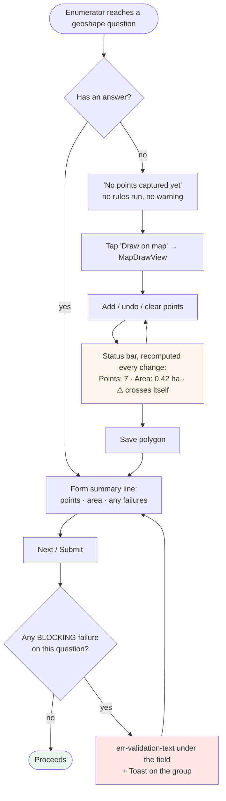
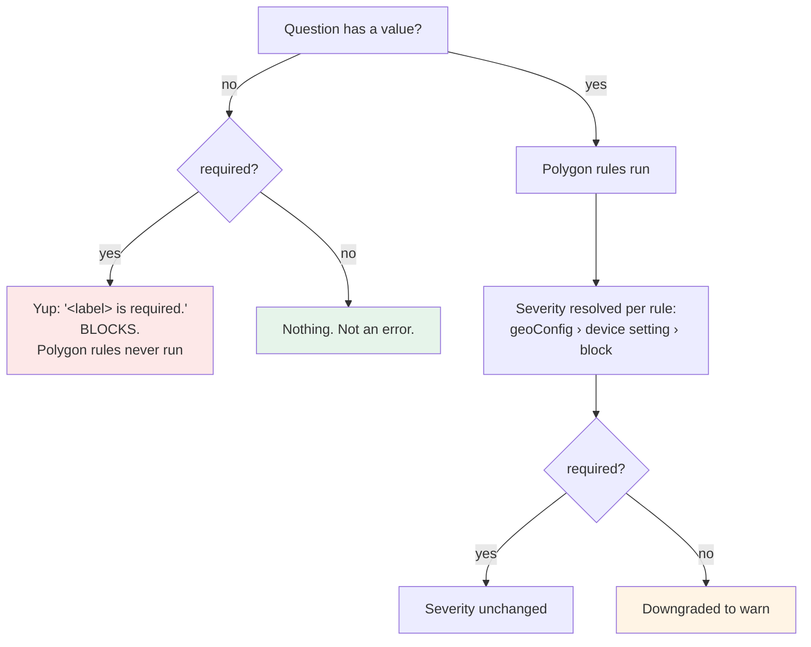
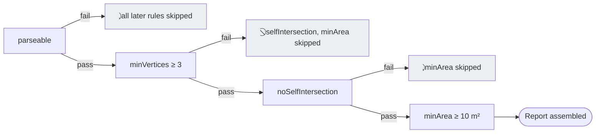

# Feature Design Document

## Feature: Polygon Shape Validation

**Task ID**: GEO-002 (breakdown ref: T6)
**Author**: Iwan Firmawan
**Date**: 2026-09-09
**Status**: Delivered 2026-09-17 — verified on a device; two mobile UI suites blocked, see §9
**Phase**: 1 — Capture & validity
**Estimate**: 6.75h ≈ 1 day (Mobile + Frontend) — was 2.5h (Mobile); see §9 for the delta
**Depends on**: GEO-001

---

## 1. Context & Problem Statement

```
Currently:
- Nothing validates polygon geometry on ANY platform.
- akvo-react-form implements a minimum-point rule and nothing else — no self-intersection
  check, no area check.
- The Kotlin reference validator has the logic, but in Kotlin/JTS against a different
  data format.

Goal:
- A captured polygon is guaranteed to BE a polygon: parseable, ≥3 vertices, no self-crossing.
```

**Why this matters beyond tidiness**: overlap detection (GEO-007) computes intersection areas.
A self-crossing "bowtie" has mathematically ambiguous area, so garbage geometry makes the
overlap maths meaningless. This task is the precondition that makes GEO-007 trustworthy.

---

## 2. Requirements

### User Acceptance Criteria
- [x] Fewer than 3 vertices → clear error, submission blocked
- [x] A self-crossing boundary → clear error, submission blocked
- [x] Unparseable value → clear error, submission blocked
- [x] Each message identifies which question failed — the label is part of the string, because
      `FormNavigation`'s Toast carries no other context
- [x] Messages appear in the enumerator's language, resolved at render (en + fr)

### User Acceptance Criteria — shared validation behaviour *(added from design review)*

- [ ] This check is one entry in a **validation report**, not a standalone message — pressing
      Validate shows a green tick on success, or a list of **every** failed rule
- [ ] **Warn vs block follows the question's `required` flag**: a required question blocks
      submission on failure or when never validated; an optional one warns and lets the
      enumerator proceed
- [ ] ~~The Validate button is hidden entirely when the question has no validation rules
      configured~~ — **unreachable, struck 2026-09-17.** Every `geoshape` question carries the
      four FR-5.B floors whether or not anything is authored (GEO-009 §2), and D-4 keeps that
      true at every severity. There is no state in which a geoshape question has no rules, so
      this criterion can never fire. GEO-007 owns what actually gates the button.

> These behaviours are shared across all polygon validations and are specified once in
> **GEO-007 D-7 and D-8**. The shape check must plug into that report structure rather than
> surfacing its own separate error.

### Technical Acceptance Criteria
- [x] The rule **always runs**; only its *severity* is configurable (see D-4) — no configuration
      path skips the check
- [x] Severity resolves form-config → device setting → default `block` (D-4), with the full
      truth table under test including malformed config
- [x] `geoshape` only — `geotrace` is exempt
- [x] Runs fully offline — `@turf/kinks` is pure JS, no network, no native module
- [x] Geometry maths unit-tested independently of React Native rendering — 91 mobile tests run
      without touching the renderer, which is why they pass while the component suites cannot
- [x] Implemented as an entry in the **rule registry** required by GEO-007 D-8, not as an inline
      `if` in the submit handler. **The registry's contract — rule interface, severity resolver,
      module layout, integration seams — is specified in GEO-013**, not here

---

## 2.1 UX Workflow

Covers both phase-1 rules — this one and GEO-003's area check — because an enumerator meets them
together. The architecture behind it is GEO-013; this section is what the person holding the
phone experiences.

### 2.1.1 The journey



**The load-bearing property**: every failure is visible *before* the enumerator leaves the map,
where a vertex is still draggable. Nothing waits for a button (GEO-013 D-7). The submit gate is a
backstop, not the first the enumerator hears of it.

### 2.1.2 How `required` participates

`required` is consulted **twice, for two different things**, and conflating them is the easiest
mistake to make here.



| `required` is used for | Mechanism | Owner |
|---|---|---|
| Is an **absent** polygon an error? | Yup `.required()` | Existing app behaviour |
| Does a **failed rule** block or warn? | The clamp | GEO-007 D-7 |

Two consequences worth stating plainly, because both look like bugs otherwise:

1. **An empty required question produces one message, not two.** Rules do not run on a value that
   is not there, so the enumerator sees *"Plot boundary is required."* — never that plus
   *"fewer than 3 vertices"*.
2. **The clamp only ever downgrades.** `required` never *upgrades* a `warn` to a `block`. If the
   device switch is off, a required question with a broken polygon **warns and submits**. That is
   the switch working as designed (D-4) — it is the enumerator's escape hatch — but it means
   `required` alone does not guarantee a valid polygon. Only the default configuration does.

### 2.1.3 Rule cascade — why some rules report "not checked"

Rules are ordered, and the structural ones **gate** the ones after them. A gated rule is reported
as *skipped*, never as passed.



**Why skipping rather than failing**: the area of a two-point line is 0, and the area of a
self-crossing bowtie is *mathematically ambiguous* — the very argument §1 makes for why this task
must precede GEO-007. Reporting *"0 m², below the 10 m² minimum"* next to *"this is not a
polygon"* states a number that means nothing and buries the real problem under a derived one.

**Accepted cost**: a polygon that is both self-crossing and tiny takes two fix-and-recheck rounds.
Correct-and-sequential beats simultaneous-and-meaningless.

### 2.1.4 Edge cases

| # | Situation | Expected behaviour |
|---|---|---|
| E-1 | Optional, never opened (`null`) | No rules, no hint, no message. Submits |
| E-2 | Required, never opened | Yup required error **only** (§2.1.2) |
| E-3 | Drawn, then cleared (`[]`) | Identical to E-1 — `[]` and `null` are both "no answer" |
| E-4 | 1–2 points | `minVertices` fails; self-intersection and area **skipped** |
| E-5 | Self-crossing, otherwise plausible | `noSelfIntersection` fails; area **skipped** |
| E-6 | Valid shape, 4 m² | `minArea` fails at its resolved severity |
| E-7 | Mixed severity on one question (shape `block`, area `warn`) | Any blocking failure blocks. Warnings appear in the same message but gate nothing |
| E-8 | Optional question, any rule fails | Clamped to `warn`. Hint shown, submit allowed |
| E-9 | `geoConfig.validateShape` is `"true"`, `["true"]` or `1` | Malformed → ignored → device setting → `block`. **Never** `warn` |
| E-10 | Language switched mid-form | Messages re-render in the new language — rules return params, not strings (GEO-013 D-1) |
| E-11 | Geometry edited after passing | Phase 1 recomputes on every render; no stale state. Phase 3's overlap result **does** go stale → "not validated" (GEO-007) |
| E-12 | Repeatable group, several polygons | Each instance is its own question id — `123`, `123-1`, `123-2` (`app/src/form/lib/index.js:197`) — so hints and feedback never collide |
| E-13 | `geotrace` question | Exempt. No rule runs, no hint, no area line |
| E-14 | Question hidden by a dependency | Not validated — `FormNavigation` filters by `onFilterDependency` first. A previously drawn value stays in `currentValues`; **inherited behaviour, not decided here** |
| E-15 | Device switch OFF, question required, polygon invalid | Warns, submits. See §2.1.2 consequence 2 — this is the switch's purpose, not a hole |
| E-16 | All rules pass | No success UI. The existing point-count and area lines are the confirmation; phase 1 adds no green tick (GEO-007's report owns that) |

### 2.1.5 Message surfaces, assembly and placement

#### At most **one** failure is visible in phase 1

A consequence of the gating cascade (§2.1.3) that is worth stating because it is counter-intuitive
and it sizes the UI work:

| Outcome | Failures shown |
|---|---|
| `parseable` fails | 1 (+3 skipped) |
| `minVertices` fails | 1 (+2 skipped) |
| `noSelfIntersection` fails | 1 (+1 skipped) |
| All gating rules pass, `minArea` fails | 1 |
| Everything passes | 0 |

Two failures at once first become possible in **phase 3**, when GEO-007's overlap rule joins
`minArea` as a second non-gating rule — a plot can legitimately be both too small and overlapping.

**The assembly code is still a list** (GEO-007 D-8), and phase 1 simply renders a list of length
≤ 1. Do not special-case the single message; the list is what makes phase 3 additive.

#### Three surfaces, two positions

`inputGeoContainer` is a **column** (`app/src/form/styles.js:183`), so the stats block sits above
the Draw button. `err-validation-text` is rendered by `QuestionField` *after* the whole field
(`app/src/form/components/QuestionField.js:191`), so it lands below it.

| Surface | Position | Shows | When |
|---|---|---|---|
| `MapDrawView` status bar | Bottom bar, beside points and area | Any failure, advisory | Live, during capture |
| `TypeGeoDrawing` stats | **Above** the Draw button, under the numbers it qualifies | Any failure, advisory | Live, on the form |
| `err-validation-text` | **Below** the Draw button — existing machinery, no new component | **Blocking** failures only | On Next / Submit |

```
┌─ A. Live hint, warn severity ───────────┐   ┌─ B. After Submit, blocking ─────────────┐
│ 3. Plot boundary *                   ⓘ │   │ 3. Plot boundary *                   ⓘ │
│                                         │   │                                         │
│    Points: 4                            │   │    Points: 6                            │
│    Area: 0.0004 ha                      │   │    Area: 0.31 ha                        │
│    ⚠ Area is 4 m², below the 10 m²      │   │                                         │
│      minimum                            │   │    ┌───────────────────────────────┐    │
│                                         │   │    │        Draw on map            │    │
│    ┌───────────────────────────────┐    │   │    └───────────────────────────────┘    │
│    │        Draw on map            │    │   │ Plot boundary: the boundary crosses     │
│    └───────────────────────────────┘    │   │ itself.                                 │
└─────────────────────────────────────────┘   └─────────────────────────────────────────┘

┌─ C. Required, never opened (E-2) ───────┐   ┌─ D. MapDrawView status bar ─────────────┐
│ 3. Plot boundary *                   ⓘ │   │  [map]                                  │
│                                         │   │                                         │
│    No points captured yet               │   │  Points: 4 · Area: 0.00 ha · ⚠ 1 invalid│
│                                         │   └─────────────────────────────────────────┘
│    ┌───────────────────────────────┐    │       tap the count ↓
│    │        Draw on map            │    │   ┌─ D2. Warnings dialog ───────────────────┐
│    └───────────────────────────────┘    │   │  Shape problems                         │
│ Plot boundary is required.              │   │                                         │
└─────────────────────────────────────────┘   │  ⚠ The boundary crosses itself.         │
   Yup only — no polygon rule ran              │                                  [ OK ] │
                                               └─────────────────────────────────────────┘
```

The area carries a `~` and turns amber whenever the ring crosses itself — the figure is
algebraic there and can read anything from 0 to the true extent, so it is marked rather than
stated (GEO-003 D-6).

**D-9: the map's status bar shows a count, not the sentence.** Found on a real device during
implementation: `styles.statusBar` is a single `flexDirection: 'row'` sharing its width with the
point count and the area, so *"⚠ The boundary crosses itself"* ran off the right edge with no way
to reach the rest of it. A count always fits at any message length and in any language; the
sentences move into a dialog one tap away. Back-press dismisses that dialog rather than
discarding the polygon — the same trap the input-method dialog already guards against.

> **The count is 1 for the whole of phase 1.** The gating cascade (§2.1.3) permits at most one
> failure, so "2 invalid" first becomes reachable when GEO-007's overlap rule joins `minArea` as
> a second non-gating rule. The plural form is built now because the alternative is rewriting
> this surface then.

The form field keeps the full sentence inline (mockup A): `inputGeoContainer` is a **column**, so
the text wraps instead of overflowing, and a question the enumerator is reading anyway has room
for a sentence the map does not.

#### D-8: The live hint hides while a blocking message is on screen

**Problem**: after Submit, both surfaces would render the same sentence a few pixels apart — the
amber hint above the button and the red error below it.

**Decision**: the hint renders only when `feedback[id]` is absent or `true`.

**Rationale**: the hint is the *"you have not been told yet"* state. Once the gate has spoken, the
authoritative red line owns the message, and repeating it above the button adds nothing but
noise. One condition, no new component.

This also settles warn severity cleanly: a `warn` never produces an `err-validation-text`, so the
hint stays visible and remains its **only** channel in phase 1.

#### Message composition

- **Messages carry the question label** — *"Plot boundary: the boundary crosses itself."*
  `FormNavigation`'s Toast (`getFirstErrorMessage`) surfaces a bare string with no other context,
  so the label must be in the message. This matches the existing `"<label> is required."`
  convention and satisfies §2's *"each message identifies which question failed"*
- **Skips are not rendered inline.** *"Area not checked"* beside *"the boundary crosses itself"*
  is noise on a phone. Skips stay in the result object for GEO-007's report, where omitting them
  would imply a green tick. §2.1.3's skip semantics are about the **data**, not this surface
- Proposed i18n keys, values interpolated from each rule's `params` (GEO-013 D-1):

| Key | English |
|---|---|
| `geoRuleParseable` | `{label}: this answer is not a valid polygon.` |
| `geoRuleMinVertices` | `{label}: a polygon needs at least {threshold} points — this one has {actual}.` |
| `geoRuleSelfIntersection` | `{label}: the boundary crosses itself.` |
| `geoRuleMinArea` | `{label}: area is {actual} m², below the {threshold} m² minimum.` |

---

## 3. Data Model Changes

**None.**

---

## 4. API Contract

**No API change.**

---

## 5. Decision Log

### D-1: These checks are NOT configurable — ⚠️ SUPERSEDED 2026-09-17 by D-4

**Options Considered**:
1. `validateShape` checkbox + `minPoints` integer in the form builder (as originally requested)
2. Always applied at fixed floors, no configuration

**Decision**: Option 2 — always on, fixed.

**Rationale**: Shape validity is not a policy choice. A 2-point "polygon" or a self-intersecting
bowtie is not a stricter standard — it is **not a polygon**. An enable-checkbox for "should this
be a valid polygon?" has no meaningful *off* state, and a stored `validateShape: false` key
could be hand-edited to silently disable validation.

**Impact**: ⚠️ **This narrows the original request**, which asked for a checkbox plus a
configurable integer. The check still ships; it is simply always on. Flag this to the requester
rather than letting it pass as delivered-as-asked.

**Outcome of that flag**: raised and answered on 2026-09-17. The requester asked for a switch.
D-4 grants one, on the axis that has a meaningful *off* state — severity, not existence. The
`minPoints` integer from the original ask stays unconfigurable; D-2 explains why 3 is a floor
rather than a preference.

### D-4: Configurable **severity**, never configurable **existence** *(2026-09-17, supersedes D-1)*

**Options Considered**:
1. Keep D-1 — no switch anywhere
2. A device switch in app Settings that skips the rule
3. A device switch that downgrades the rule from *block* to *warn*, overridable per question by
   `extra.geoConfig`

**Decision**: Option 3.

**Rationale**: D-1's argument survives intact — *"should this be a valid polygon?"* has no
meaningful off state, and a stored `false` that silences a check is a data-quality hole. But the
argument only ever applied to **whether the rule runs**. Whether a failure *blocks submission* is
a genuine policy question: an enumerator standing in a field at the edge of GPS coverage needs a
way past a rule that is misfiring, and a programme needs to know it happened. Downgrading to
*warn* gives both — the failure still appears in the GEO-007 validation report on the device,
and stays visible to a web reviewer by the route D-7 describes.

A device-level control is the weakest of the three layers available, because it is invisible to
the programme and travels with the enumerator across every form. It is therefore the **fallback**,
not the authority.

**Resolution order** — first match wins:

| # | Source | Value | Resulting severity |
|---|---|---|---|
| 1 | `question.extra.geoConfig.validateShape` | `true` | `block` |
| 1 | `question.extra.geoConfig.validateShape` | `false` | `warn` |
| 2 | Device setting `validatePolygonShape` | `1` | `block` |
| 2 | Device setting `validatePolygonShape` | `0` | `warn` |
| 3 | *(neither present)* | — | `block` |
| 4 | **Clamp**: question is not `required` | — | `warn`, per GEO-007 D-7 |

`false` never means *skip*. There is no value of any key, at any layer, that prevents the rule
from running or removes its entry from the validation report.

**Consequences to build to**:
- The Settings switch must be labelled for what it does — *"Block submission on invalid polygon
  shape"*, default ON — not *"Validate polygon shape"*, which would be a lie in the off position
- `extra.geoConfig.validateShape` is **read from day one but authored by nobody**: no upstream
  `akvo-react-form-editor` panel is built for it in phase 1 (see D-5). A form can still carry it
  via import or a later editor release
- The app must tolerate the key being absent, non-boolean, or the whole `geoConfig` being
  malformed, and fall back to `block` — never to `warn` (GEO-009 §7 already requires this posture)

**Impact**: adds a config-resolution helper shared with GEO-003, plus the device-setting plumbing
costed below. It does **not** reopen `minPoints`.

**Approved 2026-09-17, including its sharpest consequence.** The clamp only ever downgrades, so
with the device switch OFF a **required** question with an invalid polygon warns and submits —
`required` alone does not guarantee a valid polygon, only the default configuration does
(§2.1.2). This was raised explicitly and accepted: it is what the escape hatch is for.

**Agreed fallback if the switch proves wrong in the field**: hide the two Settings entries. With
no entry to toggle, the stored value stays at its `1` default and every rule resolves to `block`
— so hiding is a safe, reversible retreat that needs no migration and no data change. Removing
the columns is neither necessary nor advisable; leave them.

### D-5: No `akvo-react-form-editor` release for `validateShape` in phase 1

**Decision**: read the key; build no authoring UI yet.

**Rationale**: `extra.geoConfig` already round-trips end to end (builder → `Questions.extra`
JSONField → mobile payload), so *reading* a new key costs nothing. *Authoring* it costs an
upstream PR plus an npm release — GEO-009 measured that process at 2h, more than the code it
ships. No programme has asked for per-question severity yet. When one does, the checkbox joins
whatever upstream release is next, and the app already honours it.

**Impact**: GEO-009's "exactly three fields" contract is unchanged. Its claim that *"there are
deliberately no `validateShape` … keys"* is now **half true**: no such key is authorable, but one
is now read if present. GEO-009 §2 needs that correction.

### D-6: `@turf/kinks` on both platforms; keep the merged area helper

**Problem found 2026-09-17**: `@turf/turf` is a dependency of `frontend/package.json` **only**.
`app/package.json` declares no turf at all, so D-3 below and GEO-003 D-1 both rest on a premise
that is false for the platform this task ships on. Separately, GEO-001 already shipped
`polygonArea()` in **both** `app/src/form/lib/geometry.js` and `frontend/src/lib/geometry.js` —
a hand-rolled equirectangular projection, which is the maths GEO-003 D-1 forbids.

**Options Considered**:
1. Hand-roll segment-intersection in both repos, alongside the existing `polygonArea`
2. Add `@turf/kinks` to both, keep the merged `polygonArea`
3. Add `@turf/kinks` **and** `@turf/area` to both, delete both `polygonArea` copies

**Decision**: Option 2.

**Rationale**: the question is not "library or not", it is different for each of the two checks.

| | Self-intersection | Area |
|---|---|---|
| Already written? | Nowhere | Yes — merged **and tested** in both repos |
| Decision | Take the library | Keep the merged helper |

`@turf/*` submodules are pure JS with no DOM and no native modules — `@turf/kinks@7.4.0` pulls
only `tslib`, `@turf/helpers` and `@types/geojson` — so one import serves React and React Native
alike. Hand-rolling a sweep in two repos to avoid a three-dependency package is the more
expensive option and the easier one to get subtly wrong.

Area is the mirror image: the code exists, passes tests, and its error is three orders of
magnitude away from deciding anything at a 10 m² floor (GEO-003 D-3). Replacing working tested
code to satisfy a word in NFR-7 is churn.

**Net effect on duplication**: the hand-written copies stay at the two `polygonArea` helpers that
already exist. The feared third copy never happens, because `kinks` replaces it.

**Cost this carries**:
- An **axis adapter in each repo**, ~10 lines: turf wants a closed ring in `[lng, lat]`, our
  format is unclosed `[lat, lng]` (GEO-001 D-1b). Unavoidable with any GeoJSON library
- ~~**Version skew is accepted**: `frontend/` stays on the `@turf/turf@6.5.0` bundle~~ —
  **reversed during implementation, 2026-09-17.** `@turf/turf` turned out to be declared in
  `frontend/package.json` and imported **nowhere** in `frontend/src`, so "it already has it" was
  true of the manifest and false of the build. Importing `kinks` from the v6 bundle would have
  pulled the whole of turf into a web bundle to use one function, *and* left the two platforms
  on different `kinks` versions — a drift vector, in the same task that adds a section about
  drift. Both repos now take **`@turf/kinks@7.4.0`** scoped, so identical geometry gets an
  identical answer on both sides
- GEO-007's spike — *"does `@turf` behave on a real device?"* — **moves into phase 1**. Expo 53 /
  RN 0.79 / React 19 with a Metro-bundled ESM v7 package should be fine; "should be" is the
  reason the spike exists. Budget it here, remove it from GEO-007

**What would flip this to Option 3**: a rule that needs area as an *authoritative* figure — area
on a certificate, or a payment computed from it — rather than as a sanity check. At that point
<1 % stops being free and `@turf/area` earns the swap in both repos at once.

### D-7: A warned-past failure is **re-derived on read**, never transmitted *(2026-09-17)*

**Question raised**: if a `warn` severity lets an invalid polygon through, must the device send
the warning to the backend so the web app can show it to an approver?

**Options Considered**:
1. Device sends a warnings array → new field on `FormData` → column in manage-data
2. Web re-derives the same checks from the stored answer at render time
3. Nothing — the warning dies on the device

**Decision**: Option 2.

**Rationale**: the geometry is already stored, and the web already draws it. `GeometryView.jsx`
renders every `geoshape` answer on a Leaflet map and already calls `polygonAreaHectares(points)`
from `frontend/src/lib/geometry.js` to caption it, so vertex count and area are **in scope at the
exact point a badge would render**. Option 2 costs a badge; Option 1 costs a payload field on a
closed serializer, a `FormData` migration, and a manage-data column.

The decisive argument is not cost, it is meaning. A client-sent flag is **unfalsifiable**: a
device on an older APK sends nothing, a web-form submission sends nothing, an XLSForm import
sends nothing. An absent flag would mean "clean", "old app" or "not from a phone", with no way to
tell them apart — a field whose empty state carries no information, which reviewers correctly
learn to ignore. A derived check is uniform across every submission path, retroactive over data
already collected, and cannot drift from the rule the device applied as long as both read the
same thresholds.

**What this does NOT cover, and the one thing worth transmitting later**: that a warning was
*shown and overridden*. That is a fact about the capture session, not about the shape, so nothing
can recompute it — the same category as `duration` and `submitter`, which the payload already
carries. If a programme ever wants to know who routinely overrides warnings, that field has to
come off the device. **No requester yet; not phase 1.**

**Impact**:
- **Backend: no change.** No payload field, no `FormData` column, no migration, no API change
- **Frontend: a badge in `GeometryView`,** where a reviewer already looks at the shape
- Filtering or sorting manage-data by "has geometry warnings" is the one thing derivation cannot
  do efficiently, since it needs a stored annotation. Deferred until someone asks to filter
- Self-intersection on the web needs the same helper as D-6. That makes **three** copies of
  polygon maths — `app/src/form/lib/geometry.js`, `frontend/src/lib/geometry.js`, and whatever
  the badge uses. The first two already duplicate `polygonArea` today (GEO-001 shipped both).
  There is no shared package between `app/` and `frontend/`, so this is noted, not solved

### D-8: The live hint hides while a blocking message is on screen

**Specified in §2.1.5**, next to the mockups it depends on, rather than restated here. In short:
the hint renders only when `feedback[id]` is absent or `true`, so the same sentence never appears
twice on one screen; a `warn` produces no blocking message, so the hint remains its only channel.

### D-2: Minimum vertices is 3, not the reference validator's 4

**Decision**: `>= 3`.

**Rationale**: The reference validator uses `MIN_VERTICES = 4` — "3 distinct points + 1 closing
point" — because ODK geoshape strings repeat the first point at the end. **Our format (from ARF)
does not duplicate the closing point.** Copying 4 verbatim would fail every valid triangle.

### D-3: Self-intersection via `@turf/kinks` — ⚠️ premise wrong, see D-6

**Decision**: Use `@turf/kinks`; do not port the reference validator's JTS `polygon.isValid`.

**Rationale**: `@turf/turf` is already a declared dependency in `frontend/package.json` and is
pure JS, so it runs in React Native. Import the **scoped submodule** (`@turf/kinks`), never the
full bundle — mobile bundle size.

> **`frontend/` is not `app/`.** The mobile app declares no turf dependency, so "already a
> declared dependency" does not hold for the platform this task ships on — the package is
> perfectly usable there, it simply has to be added. D-6 confirms this decision and extends it
> to the web badge (D-7); the scoped-submodule instruction stands.

---

## 6. Type/Constant Mappings

| Rule | Value | Where it lives |
|---|---|---|
| Minimum vertices | `3` | Constant in mobile validation module |
| Self-intersection | — | Local segment-intersection helper (D-6) |
| Parse check | — | Array shape guard |

**The thresholds stay constants.** Only severity is configurable (D-4):

| Layer | Key | Type | Default | Authorable in the form builder? |
|---|---|---|---|---|
| Question | `extra.geoConfig.validateShape` | boolean | *(absent)* | No — read only, D-5 |
| Device | `BuildParamsState.validatePolygonShape` | TINYINT `0`/`1` | `1` | n/a — app Settings › Geolocation |

Device-setting touch points — **eight, not six**; the original count missed the two that make a
migration actually run, and the omission shipped (see §9):

| # | File | Why |
|---|---|---|
| 1 | `app/src/pages/Settings/config.js` | The switch itself |
| 2 | `app/src/store/buildParams.js` | Default `1` |
| 3 | `app/src/pages/Settings/SettingsForm.js` | Destructure + `configFields` allowlist |
| 4 | `app/src/database/tables.js` | Column for **fresh installs** |
| 5 | `app/src/database/migrations/11_add_polygon_validation_to_config.js` | Column for **upgrades** |
| 6 | `app/src/lib/i18n/ui-text.js` | en + fr |
| 7 | **`app/App.js`** | Import `m11`, add the `user_version === 10` ladder step, **and restore the value into the store in `handleInitConfig`** |
| 8 | **`app/src/lib/constants.js`** | `DATABASE_VERSION` — `migrateDbIfNeeded` returns early when `user_version >= DATABASE_VERSION`, so a migration without a bump here never runs |

`ALTER TABLE … ADD COLUMN … TINYINT DEFAULT 1` backfills existing rows, so devices that upgrade
mid-programme land on `block`, not `warn`.

⚠️ **The trap, for whoever adds the next setting.** Steps 4 and 5 are separate code paths, and a
fresh install only exercises 4. A device-testing session on a freshly installed app therefore
proves nothing about upgrades — the column exists either way. Steps 7 and 8 are invisible until
an *upgrading* device runs the code, and their failure is silent: `crudConfig.addConfig` swallows
its error, and `SettingsForm`'s switch handler reports to Sentry while the UI still animates. The
toggle looks like it worked and does not persist. Restoring the value (step 7) must use `??` and
not `||`, since `0` is the meaningful value.

---

## 7. Compatibility & Migration

### Backward Compatibility
- [x] Forms without polygon questions unaffected
- [x] Existing datapoints unaffected — validation runs at capture, not retroactively

> **Checked against GEO-014, 2026-09-18: nothing here changes.** From phase 2 a vertex may carry
> an optional third element (`[lat, lng, accuracy]`). The self-intersection rule reaches geometry
> only through `toGeoJsonRing`, which destructures `([lat, lng])` and drops the rest before turf
> sees it, so both the shipped behaviour and the existing fixtures remain correct. Recorded so
> that this does not get re-audited.

### Mobile App Impact
- [x] Sync endpoints affected: **none**
- [x] SQLite schema changes: **yes, additive** — two `config` columns via migration 11, both
      `TINYINT DEFAULT 1` so existing rows backfill to the strict setting

---

## 8. Security Considerations

- [x] No new attack surface — pure local computation
- [x] Input is already-parsed JSON from the app's own state

---

## 9. Testing Strategy

| Test Type | Coverage |
|-----------|----------|
| Unit | Valid triangle passes; 2-point fails; bowtie fails; unparseable fails |
| Unit | **Regression guard for D-2**: a 3-vertex triangle must PASS (catches the `MIN_VERTICES = 4` trap) |
| Integration | Error surfaces in `err-validation-text` and blocks submit |

**Hours breakdown**

| Unit | h |
|---|---|
| Parse check, min-points, `@turf/kinks` self-intersection + axis adapter (D-6) | 0.75 |
| **Spike (D-6)** — `@turf/kinks` on a real device, moved here from GEO-007 | 1 |
| i18n messages | 0.5 |
| Wire into the validator | 0.5 |
| Inline verdict line on both capture surfaces (GEO-013 D-7) — built once here, reused by GEO-003 | 0.25 |
| Tests with known fixtures | 1 |
| **Subtotal** | **3** |
| **Added by D-4** — severity resolver shared with GEO-003, + its tests | 0.75 |
| **Added by D-4** — device setting: config entry, store, DB column + migration, i18n | 1 |
| **Added by D-7** — **frontend**: warning badge in `GeometryView`, axis adapter, tests | 1 |
| **Total** | **6.75** |

**This task is Mobile + Frontend**, not Mobile — confirmed 2026-09-17 as one person's work, so
the badge is not split out. Header updated accordingly.

1h of the total is the `@turf/kinks` device spike **relocated from GEO-007**, not new scope;
deduct it there.

The severity resolver, the migration and the inline verdict line are shared with GEO-003, so the
pair costs about **8.75h** together — not 6.75 + 2 run twice.

---

## 10. Open Questions

- [x] Confirm with the requester that the always-on decision (D-1) is acceptable given the
      original ask was for a configurable checkbox — **answered 2026-09-17: not accepted as-is.**
      A switch is required, defaulting to ON. Resolved by D-4: the switch governs severity
      (block → warn), never existence, and question-level `geoConfig` outranks the device.
- [x] **D-6** — `@turf` is absent from `app/package.json`, so both D-3 here and GEO-003 D-1 rest
      on a false premise. **Resolved 2026-09-17**: `@turf/kinks` is pure JS and runs in React and
      React Native alike, so it is added to both projects for self-intersection; the merged
      `polygonArea` stays for area. The device spike moves into this task.
- [x] GEO-009 §2 says *"there are deliberately no `validateShape` … keys"*. Now half true —
      not authorable, but read if present. **Correction applied 2026-09-17**: GEO-009 §2 now
      carries a dated note saying the thresholds stay unconfigurable while the two severity keys
      are read but not authored, so its three-field contract is unchanged.
- [x] Tenant-authored rules (autofield-style `fnString`) are **out of scope here**, deferred to
      their own design — see GEO-012. **Researched 2026-09-17**: the demand is real and
      documented across ODK, Survey123, SurveyCTO and CommCare, but it is demand for *named
      predicates*, not for an expression language. GEO-012 D-1 therefore proposes a parameterised
      catalogue, which this task's registry (GEO-013) already accommodates. Nothing changes here.

---

### Implementation notes, 2026-09-17

**Migration wiring was missed on first commit** (`6abf1cdc`), caught in review. `DATABASE_VERSION`
stayed at `10` and `App.js` had no ladder step for `m11`, so the migration never ran on an
upgrading device; the switches also were not restored into the store on launch. Both fixed in a
follow-up. The device testing that validated this task ran against a database that already had
the columns from `tables.js`, which is exactly why it did not catch either one — see the trap in
§6.

**Blocking the component-level acceptance criteria**: `app/package.json` declares `react@19.0.0`
alongside `react-test-renderer@^18.2.0`, which resolves to 18.3.1 and cannot render React 19. **69
of 83 mobile suites fail at import** with `Cannot read properties of undefined (reading
'ReactCurrentOwner')`, including `TypeGeoDrawing.test.js` and `MapDrawView.test.js` — the two that
would cover this task's UI surfaces.

This is a pre-existing repository condition, not a consequence of this work: the mismatch is in
the committed manifest, the `yarn.lock` diff for this task adds only `@turf/kinks`,
`@turf/helpers` and `@types/geojson`, and the failing suites import nothing this task touches.

**Consequence for this task**: the rule logic is fully covered (30 new tests in
`src/form/lib/__tests__/polygon-rules.test.js`, all green, plus 33 on the frontend side), but the
**two mobile UI surfaces are verified by inspection only**. Either bump `react-test-renderer` and
`@testing-library/react-native` to React 19-compatible versions — a repo-wide change affecting all
69 suites and CI, deliberately not bundled into this task — or verify the hint manually in Expo Go
before calling GEO-002 done.

---

## 11. References

- Task breakdown: `doc/claude/polygon-validation-task-breakdown.md` (T6)
- Requirements: `doc/claude/offline-polygon-validation-requirements.md` (FR-2, FR-5.B)
- Reference validator: `akvo/african-bamboo-odk-external-validations` → `validation/PolygonValidator.kt`

---

## Approval

| Role | Name | Date | Status |
|------|------|------|--------|
| Developer | | | |
| Tech Lead | | | |
| Product | | | |
