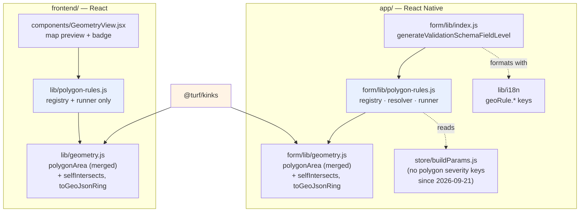
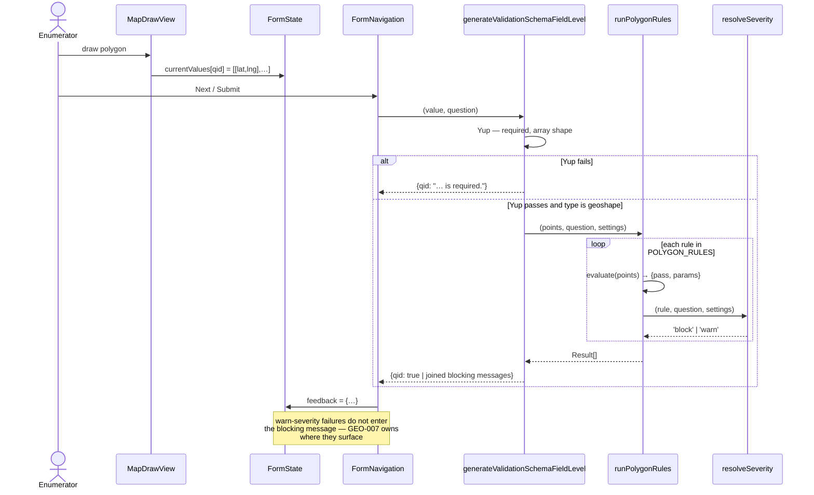
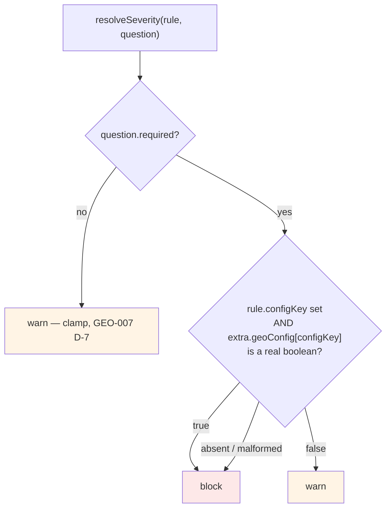
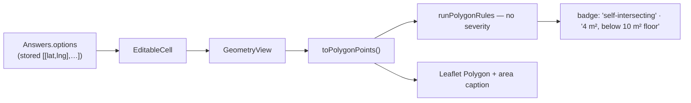

# Feature Design Document

## Feature: Polygon Validation — Rule Architecture

**Task ID**: GEO-013 (cross-cutting; no standalone estimate)
**Author**: Iwan Firmawan
**Date**: 2026-09-17
**Status**: Implemented 2026-09-17 by GEO-002/GEO-003; the contract below is what shipped
**Phase**: 1 — Capture & validity (consumed by phase 3)
**Serves**: GEO-002, GEO-003, GEO-007, GEO-012

---

## 1. Context & Problem Statement

```
Currently:
- GEO-002 and GEO-003 each specify a rule, a severity switch and a message, and each says
  "implement as an entry in the rule registry required by GEO-007 D-8".
- No document says what that registry IS — its interface, where it lives, or how a rule
  reaches the screen.
- Three tasks would otherwise invent three shapes for the same thing.

Goal:
- One contract, specified once, that GEO-002 and GEO-003 implement, GEO-007 extends with a
  rule that needs I/O, and GEO-012 can add to without touching any of them.
```

This document adds **no behaviour**. Every rule, threshold and severity decision stays in its
own task. This is the shape they share.

**For the enumerator-facing view** of the same machinery — the journey, how `required`
participates, and sixteen edge cases — see **GEO-002 §2.1**. This document is its structural
counterpart; the two must not disagree.

---

## 2. Requirements

### Technical Acceptance Criteria
- [x] A rule is a **pure function** — no store reads, no i18n, no `await`, no React
- [x] Adding a rule touches **one array** and one i18n key; no other file changes — demonstrated
      by `maxArea` (GEO-003 D-5), added after the registry shipped and costing exactly that
- [x] The geometry maths is unit-testable without React Native (GEO-002 §2)
- [x] Rule evaluation and severity resolution are **separable** — the web runs the first
      without the second (D-3)
- [x] One rule needing async I/O (GEO-007's overlap query) does not force every rule to be async
      — still sync in phase 1, widened by one `await` in the runner when GEO-007 needs it

---

## 3. Data Model Changes

**None.** One SQLite `config` column per device switch, already costed in GEO-002 §6.

---

## 4. API Contract

**No API change.** See GEO-002 D-7 — nothing about validation is transmitted.

---

## 5. Decision Log

### D-1: A rule returns a **verdict plus parameters**, never a formatted message

**Options Considered**:
1. `evaluate()` returns a translated string on failure
2. `evaluate()` returns `{ pass, params }` and the caller formats

**Decision**: Option 2.

**Rationale**: three consequences, one of them a real bug.

- **Language is chosen at render, not at evaluation.** `FormState.lang` can change while a form
  is open. A rule that formatted its own message would freeze the language at the moment the
  polygon was validated, so switching to French would leave the old failure in English.
- Messages need the numbers — *"minimum 10 m², this polygon is 4 m²"* — so `params` carries
  `{ actual, threshold }` and the i18n layer does the interpolation.
- A pure function returning a plain object is testable with no mocking. The moment `evaluate`
  reaches for `i18n.text(lang)`, the GEO-002 criterion *"geometry maths unit-tested independently
  of React Native rendering"* stops being free.

**Contract**:

```
Rule {
  key         'shape.selfIntersects'   stable id: i18n key suffix AND test fixture name
  appliesTo   ['geoshape']             question types; geotrace is excluded here, once
  configKey   'validateShape'          extra.geoConfig.<configKey>, or null if not switchable
  evaluate    (points, ctx) => { pass: boolean, params?: object }
}

Result {
  key, pass, params, severity: 'block' | 'warn'
}
```

`points` is always `[[lat, lng], …]` — ARF axis order (GEO-001 D-1b), unclosed. Converting to
whatever a library wants is the **rule's** job, not the caller's (D-4).

### D-2: The registry is an array, and rule order is display order

**Decision**: `POLYGON_RULES = [parseable, minVertices, noSelfIntersection, minArea]`, evaluated
in order, all of them, every time.

**Rationale**: the validation report shows *every* failure, not the first (GEO-002 §2), so there
is no early exit to optimise. Order is therefore free to be the order a human wants to read:
structural failures before measurements, because "this is not a polygon" makes "it is too small"
redundant rather than additional.

**One exception, and it is a guard not an optimisation**: a rule whose input the previous rules
have shown to be meaningless must be **skipped, and reported as skipped** — not silently passed.
A rule list where a later entry can be invalidated by an earlier one is the one piece of
sequencing this design admits.

**Refined 2026-09-17** — this is broader than `parseable`. Three of the four phase-1 rules gate
what follows them, because each establishes a precondition the next one's maths depends on:

| Rule | Gates the rest? | Because |
|---|---|---|
| `parseable` | ✅ | Later rules would receive garbage |
| `minVertices` | ✅ | Area and self-intersection are undefined below 3 points |
| `noSelfIntersection` | ✅ | A bowtie's area is mathematically ambiguous — the argument GEO-002 §1 makes for why this task precedes GEO-007 |
| `minArea` | ❌ | Nothing follows it in phase 1 |

> **Note, 2026-09-21 — the registry now has a second consumer.** Editor 2.0.6 renders this list
> in the form builder, grouped by `configKey`, so an author sees which rules run and can set one
> severity per group. Two properties of this design turned out to carry that weight unchanged:
> `configKey` already expressed that **three** rules share `validateShape`, and the array order
> is already the order a human should read.
>
> The editor mirrors the registry rather than importing it — separate repositories, no shared
> package — carrying only the authoring metadata (`key`, `labelKey`, `configKey`), never
> `evaluate`. Rule keys match by name so the two can be diffed by eye. **Adding a rule is now two
> edits, not one**: the registry here, and the mirror there plus a release.
>
> One rule in the builder's table is **not** in this registry: overlap. It is evaluated
> device-side (GEO-005/006/007), not by `runPolygonRules`, but it has a severity key
> (`validateOverlap`, GEO-007 D-9) and an enable key, so the builder shows it alongside these
> five. Worth knowing the builder's table is *the rules a geoshape question carries*, which is a
> slightly wider set than *the rules this registry evaluates*.

**Kept as one boolean, not a dependency graph**: each rule carries `gating: true|false`, and a
failed gating rule skips every *later* entry. That preserves the array — D-5's ponytail ceiling
warned that rules depending on named other rules would turn this into a graph and invalidate the
design. Position plus one flag is enough for every rule in GEO-012's evidenced catalogue.

**Impact**: `runPolygonRules` returns a result per rule including skips, so the report can say
*"could not check area: the boundary crosses itself"* rather than showing a green tick next to it.
The enumerator-facing consequence — sequential fix-and-recheck rounds — is accepted and explained
in **GEO-002 §2.1.3**.

### D-3: The web evaluates rules but does **not** resolve severity

**Decision**: severity resolution is capture-time only. `GeometryView`'s badge (GEO-002 D-7) runs
`evaluate` and renders every failure as informational.

**Rationale**: severity answers *"may this be submitted?"*, a question that is already settled by
the time the web sees the record. Worse, an input is unavailable: `required` belongs to the form
version in force at capture. A web badge that guessed severity would be asserting something it
cannot know.

> **Revised 2026-09-21.** This decision's other argument was that *"the device setting lives in
> the enumerator's SQLite and never syncs"*. That layer no longer exists (GEO-002 D-4), which
> removes the argument and leaves the decision standing on `required` alone — still enough, and
> the conclusion is unchanged.

**Impact**:
- `evaluate` functions are shared in **spirit** between the two repos but duplicated in **code** —
  there is no shared package between `app/` and `frontend/` (GEO-002 D-7)

**Drift is the cost of that duplication, and the worst case is a false clean signal.** Loud drift
(mobile blocks, web says fine) generates a support ticket within a day. Silent drift does not: if
a rule is added to mobile in phase 3 and the web badge never gets it, the web shows nothing next
to a record that failed, and a reviewer reads absence as approval. An axis-order fix applied to
one repo only is the same class — it yields *plausible* wrong answers, not obviously wrong ones.

**Mitigation, chosen over a shared package**:
1. Thresholds and rule keys live in one file per repo with the **same filename and same export
   names**, each carrying a header comment naming its twin's path — so the second copy is
   greppable from the first
2. **Each repo has a test asserting the literal values** (`expect(MIN_AREA_SQM).toBe(10)`). It
   looks tautological and is not: changing one side turns that repo's own test red, and the
   failing diff is what makes the author remember the twin. This converts silent drift into a
   loud failure inside the repo being edited, which is the only place anyone is looking
3. GEO-011's manual cross-repo comparison remains the backstop, not the primary defence
- The web needs no `geoConfig` lookup and no settings plumbing. The badge is a pure function of
  the stored answer

### D-4: The axis adapter belongs to the rule, not the caller

**Decision**: `toGeoJsonRing(points)` lives beside the geometry helpers and is called *inside*
`noSelfIntersection.evaluate`.

**Rationale**: only rules backed by a GeoJSON library need it. `minVertices` counts an array;
`minArea` uses the merged `polygonArea`, which already takes `[lat, lng]`. Converting at the
caller would impose a GeoJSON round-trip on every rule to serve one, and would make the
`[lat, lng]` convention — the single most repeated footgun in this epic — a caller's problem
rather than a library boundary.

**Impact**: `toGeoJsonRing` closes the ring and swaps to `[lng, lat]`. It has its own test with a
triangle whose lat and lng are unmistakably different numbers, so a transposition fails loudly
rather than producing a plausible wrong answer.

### D-5: `evaluate` is synchronous in phase 1; GEO-007 widens it

**Decision**: phase 1 rules are sync. When GEO-007 adds the overlap rule — which queries the
SQLite geometry index — the runner becomes `async` and awaits every `evaluate`.

**Rationale**: `Promise.resolve(syncValue)` is free and `generateValidationSchemaFieldLevel` is
already `async`, so widening later costs one `await` in the runner and nothing at the call sites.
Making every rule async now, for one rule that does not exist yet, buys nothing.

**ponytail ceiling**: this holds while rules are independent. If a rule ever needs another rule's
result, the array becomes a graph and this decision is wrong — but nothing in GEO-012's evidenced
catalogue needs that.

### D-6: The runner is standalone, not embedded in the Yup schema

**Decision**: `runPolygonRules` is its own module, called *from* the geoshape branch of
`generateValidationSchemaFieldLevel` — not implemented inside it.

**Rationale**: phase 1 already has **two** entry points, and phase 3 adds a third:

| Caller | When | Wants |
|---|---|---|
| `generateValidationSchemaFieldLevel` (`app/src/form/lib/index.js:379`) | Group navigation and submit | A message for `FormState.feedback` |
| `QuestionGroup.handleOnChange` (`:65`) | Clearing a stale error on edit | The same, for one field |
| GEO-007 "Validate now" | Explicit button press | The full result list, for the report |

Only the third wants the structured list; the first two want a string. A runner that returns
results, with a thin formatter beside it, serves all three. Logic inside the Yup branch would
serve only the first.

### D-7: Three surfaces, no Validate button in phase 1

**Question raised**: should `TypeGeoDrawing` get a Validate button for the GEO-002/GEO-003 rules?

**Options Considered**:
1. A Validate button on the field, pressed to run the phase-1 rules
2. Continuous inline verdict on the surfaces that already exist; the button arrives with
   GEO-007 and owns only the expensive rule

**Decision**: Option 2.

**Rationale**: a button earns its place when the work behind it is expensive or needs explicit
commitment. Phase-1 rules are neither — parse, vertex count, `@turf/kinks` and a shoelace sum
over ≤200 points are pure, synchronous and effectively instant. Requiring a tap to surface a
result already in hand is asking the enumerator to request information the app is holding.

The stronger argument is **where the failure is fixable**. A self-intersection is repaired by
moving one vertex, which is possible only while the map is open. Reported on the form summary it
costs a walk back into the map; reported at submit it costs reopening the question. So the
primary surface is the status bar in `MapDrawView`, which **already renders point count and live
area** (`app/src/pages/MapDrawView.js:238-245`) and needs one more line.

**The three surfaces, and which one resolves severity**:

| Surface | When | Resolves severity? |
|---|---|---|
| `MapDrawView` status bar | Live, during capture | No — advisory |
| `TypeGeoDrawing` summary | Live, on the form | No — advisory |
| `generateValidationSchemaFieldLevel` | Group navigation and submit | **Yes** |

Identical split to D-3's web badge, for the same reason: severity answers *"may this be
submitted?"*, which belongs to the gate, not to a field rendering a hint.

**Impact**:
- Adds a **fourth caller** of the runner to D-6's table — two field renders, both `evaluate`-only.
  Pure, sync and memoised on `value`, so a render path is a safe place for it
- **When GEO-007's button lands in `TypeGeoDrawing`, the cheap rules must not move behind it.**
  The button owns the overlap query alone — a SQLite range scan over up to 10k polygons with a
  <500 ms target and a staleness state machine, which is what justifies three states and a
  progress indicator. A rule computable during the tap that drew the point should never wait for
  a later one
- GEO-002's struck acceptance criterion is consistent with this: there is no phase-1 button to
  hide, and GEO-007 owns what gates the one it adds

---

## 6. Component Design

### 6.1 Module layout



The two blue modules are the same contract, deliberately duplicated (D-3). The web copy omits
the resolver and the store dependency, which is why it is not simply the mobile file moved.

### 6.2 Capture-time sequence



### 6.3 Severity resolution



> **Revised 2026-09-21 — the device layer is removed.** `settingKey` and the `settings` argument
> are gone from D-1's contract, from every rule, and from `runPolygonRules`. Editor 2.0.6 made
> `validateShape` and `validateArea` authorable, so severity is the form author's call; GEO-002
> D-4 owns the reasoning and the exact scope of the retreat.
>
> The clamp is drawn **first** because that is where the code checks it. Equivalent either way —
> the clamp only ever downgrades — but drawing it last, as this diagram used to, hides a
> consequence worth seeing: on an **optional** question the `geoConfig` branch is never reached.
> An author who writes `validateShape: true` there still gets `warn`.

**"a real boolean"** carries the same strictness the backend already applies at
`api/v1/v1_mobile/geometry.py:enabled_geoshape_question_ids` — `"true"`, `["true"]` and `1` are
malformed, not truthy. Malformed now falls through to `block`, the only remaining layer, never to
`warn` (GEO-002 D-4, GEO-009 §7). Since 2026-09-21 the write boundary refuses those values
outright (GEO-010 §6), so this branch guards form versions captured before that check existed.

### 6.4 Web badge data flow



No backend call, no stored flag, no migration — GEO-002 D-7.

---

## 7. Compatibility & Migration

### Backward Compatibility
- [x] Adding rules to the array cannot change existing answers — validation is capture-time on
      mobile and display-only on the web
- [x] A device that has not synced a form carrying `geoConfig` falls through to its own setting,
      then to `block`. Never to `warn`

### Mobile App Impact
- [x] Sync endpoints affected: **none**
- [x] SQLite: two `config` columns, one migration (11), shared with GEO-002/GEO-003

---

## 8. Security Considerations

- [x] Rules are compiled code in phase 1 — no author-supplied expressions execute anywhere.
      That property is what GEO-012 would change, and why it is deferred
- [x] `geoConfig` arrives from the server and is untrusted: the resolver treats any non-boolean
      as absent rather than coercing it
- [x] **Both halves of that posture are now enforced.** From 2026-09-21 the write boundary also
      refuses a non-boolean severity key (GEO-010 §6), so a `"false"` string can no longer be
      stored at all. The resolver's tolerance stays as the second line — a device may hold a form
      version captured before the check existed

---

## 9. Testing Strategy

| Test Type | Coverage | Owner |
|-----------|----------|-------|
| Unit | Each `evaluate` against fixtures, no React, no store | GEO-002 / GEO-003 |
| Unit | `toGeoJsonRing` — ring closed, axes swapped, **lat ≠ lng in the fixture** so a transposition fails loudly | GEO-002 |
| Unit | Resolver truth table: every row of §6.3, including `"true"` and `["true"]` as malformed | GEO-002 |
| Unit | `parseable` failing marks later rules **skipped, not passed** (D-2) | GEO-002 |
| Unit | Language switch after evaluation re-renders the message in the new language (D-1) | GEO-002 |
| Integration | Blocking failure reaches `err-validation-text`; warn does not block | GEO-002 |
| Cross-repo | Mobile and web thresholds agree | GEO-011 |

---

## 10. Open Questions

- [ ] **`FormState.feedback` holds `true | string` — one message per question.** A report needs a
      list and a severity. Two ways out: widen the value to an object, or keep `feedback` for the
      blocking string and add a parallel structured map. **GEO-007 owns this**, since it builds
      the report; phase 1 only needs the joined blocking string, so nothing here is blocked
- [x] Where a `warn` surfaces during phase 1, before GEO-007's report exists. **Answered by
      GEO-002 §2.1.5 and its D-8**: the live amber hint above the Draw button is the channel, and
      for a `warn` it is the *only* channel, since a warn produces no `err-validation-text`. The
      Toast idea floated here is superseded — a Toast fires once and vanishes, which is wrong for
      a condition that persists until the geometry changes.
- [ ] Whether GEO-011 can assert cross-repo threshold agreement automatically, or whether it is a
      checklist item a human runs

---

### Delivered shape, 2026-09-17

| Piece | Mobile | Web |
|---|---|---|
| Registry, resolver, runner | `app/src/form/lib/polygon-rules.js` | `frontend/src/lib/polygon-rules.js` (no resolver, D-3) |
| Geometry + adapter | `app/src/form/lib/geometry.js` | `frontend/src/lib/geometry.js` |
| Submit gate | `generateValidationSchemaFieldLevel` (`form/lib/index.js`) | n/a |
| Surfaces | `MapDrawView` status bar · `TypeGeoDrawing` summary | `GeometryView` badge |
| Settings | 2 switches, migration 11 | n/a — device state never syncs |

**Two deviations from what this document specified**, both deliberate:

1. **`evaluate` receives `ctx`** carrying `geoConfig`, as D-1's contract allowed but phase 1 was
   not expected to need. `maxAreaHa` (GEO-003 D-5) reads its *threshold* per question, which is
   not the same as reading severity — and it is why `GeometryView` now takes a `geoConfig` prop
   despite D-3. The web still resolves no severity.
2. **Gating is broader than `parseable`** — see D-2's 2026-09-17 refinement.

> **Note, 2026-09-18 (GEO-014).** `points` may now carry an optional third element per vertex,
> `[lat, lng, accuracy]`. **No shipped rule needs changing**: `shape.selfIntersects` and the area
> rules reach geometry through `toGeoJsonRing` and `polygonArea`, both of which destructure
> `([lat, lng])` and drop the rest.
>
> The contract itself is already sufficient for what phase 3 needs. GEO-007's overlap rule
> derives its threshold from the accuracy of *both* polygons (GEO-014 D-5), and it reads that
> from `points` and from the candidate it fetches — not from `ctx`. `configKey` keeps resolving
> severity exactly as specified (`settingKey` was removed on 2026-09-21, GEO-002 D-4). This is the second time D-1's contract has absorbed a
> requirement phase 1 did not anticipate without widening.

---

## 11. References

- GEO-002 D-4 (severity), D-6 (`@turf/kinks`), D-7 (derive on read)
- GEO-003 D-3 (area helper), D-4 (severity)
- GEO-007 D-7 (required→severity clamp), D-8 (rules must be a list)
- GEO-012 (what this registry is deliberately leaving room for)
- Seam: `app/src/form/lib/index.js:335` · `app/src/form/components/QuestionGroup.js:65` ·
  `app/src/form/support/FormNavigation.js:127`

---

## Approval

| Role | Name | Date | Status |
|------|------|------|--------|
| Developer | | | |
| Tech Lead | | | |
| Product | | | |
