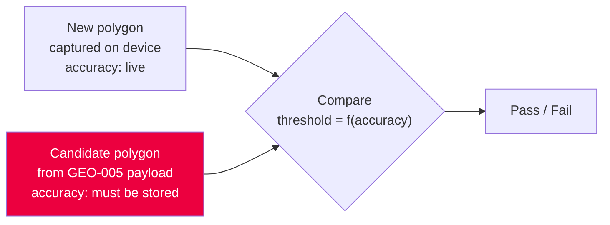

# Feature Design Document

## Feature: Per-Vertex GPS Accuracy

**Task ID**: GEO-014
**Author**: Iwan Firmawan
**Date**: 2026-09-18
**Status**: **Backend task (T13) implemented 2026-09-18**; the decisions below are the record.
Consumed by GEO-004 (done, phase 2) and by GEO-005/006/007 (phase 3, not started)
**Phase**: 2 — must ship before GEO-004 (D-7); consumed in phase 3
**Estimate**: **1.5h (Backend)** for §4's two validator changes. The rest of this document
redistributes hours across GEO-004, GEO-005, GEO-006 and GEO-007
**Blocks**: GEO-004
**Supersedes**: GEO-004 D-1, GEO-004 §3, GEO-004 §4, GEO-004 §7, GEO-007 D-3

> **Why a decision record carries an estimate.** §4's two validator changes are the only work in
> this epic that belongs to no other task: phase 2 is otherwise entirely Mobile, and the two
> backend tasks (GEO-005, GEO-010) are both phase 3. Left unowned, it would be discovered by
> whoever builds GEO-004, at the point where every geoshape submission starts 400-ing on a
> handset. It is small enough not to deserve its own document, so it lives here, where what to
> change is already written down.

---

## 1. Context & Problem Statement

```
Currently:
- A geoshape/geotrace answer is `[[lat, lng], ...]`. GPS accuracy is measured at capture
  time, shown live on screen (MapDrawView.js:240, TypeGeo.js:44) and then discarded.
- `geoConfig.accuracyThreshold` gates capture on the device and is never transmitted.
- GEO-004 §7 states that values captured by drawing and by walking are deliberately
  indistinguishable.

Goal:
- Persist the accuracy of each captured vertex, so that overlap detection can size its
  tolerance to the measurement rather than to a fixed percentage, so that a submission
  built from unusable fixes can be refused, and so that a shape drawn from imagery can be
  told apart from one walked on foot.
```

**Why this could not stay a device-only concern.** Overlap detection runs on the device
(GEO-006/GEO-007), but only one of the two polygons being compared is local. The candidate
set arrives from the backend through GEO-005's `/device/datapoint-list`. A tolerance derived
from *both* polygons' accuracy therefore needs the neighbour's accuracy to have been stored
server-side — which means the mobile app has to send it.



An earlier analysis concluded accuracy was unnecessary because no consumer existed. That
conclusion missed the server-supplied half of the comparison and is void.

---

## 2. Requirements

### Technical Acceptance Criteria

- [ ] A geoshape/geotrace vertex is `[lat, lng]` **or** `[lat, lng, accuracy]` — the third
      element is **optional, permanently**
- [ ] A missing third element means *accuracy not measured*. It is not an error, not a
      deprecation, and never needs migrating
- [ ] `accuracy`, when present, is metres as a positive number (`null` also accepted on read)
- [ ] `/device/datapoint-list` geometry carries the third element unchanged
- [ ] Points worse than `accuracyThreshold` are recorded and marked, never silently dropped
- [ ] Submission is refused while any point exceeds `accuracyThreshold` — phase 3, and only when
      `detectOverlaps` is on (D-6, D-9). Everywhere else the threshold marks without blocking
- [ ] On **mobile**, tapping is unavailable when `geoConfig.allowTapping` is `false` (D-4)
- [ ] The overlap threshold is derived from accuracy and can never exceed the authored
      `overlapThreshold`

### Out of scope

- The `geo` (single point) question type. It stays `[lat, lng]`; nothing consumes its accuracy.
- Altitude. ODK carries it; we have no use for it, and adding it now costs a fourth element
  for no consumer.
- Any change to `akvo-react-form`. See D-2.

---

## 3. Data Model Changes

**No schema change on either side.**

| Store | Why unchanged |
|---|---|
| `Answers.options` (`JSONField`) | Already holds an arbitrary coordinate list |
| Mobile SQLite `datapoints.json` | Geoshape answers live inside the JSON blob |

The change is to the *shape* of a value both stores already accept, not to a column.

### Wire format

```jsonc
// Walked with GPS — accuracy in metres
[[9.0301, 38.7401, 4.2], [9.0402, 38.7404, 6.8], [9.0405, 38.7502, 5.1]]

// Tapped, on mobile or in the webform — not measured, third element simply absent
[[9.0301, 38.7401], [9.0402, 38.7404], [9.0405, 38.7502]]

// Mixed capture in one polygon — legal, each vertex stands alone
[[9.0301, 38.7401, 4.2], [9.0402, 38.7404], [9.0405, 38.7502, 5.1]]
```

A row captured before this change is indistinguishable from a tapped row, and that is correct:
neither has a measurement.

---

## 4. API Contract

**No new endpoints. Two existing validators change.**

| Location | Change | Failure if missed |
|---|---|---|
| `is_coordinate_ring()` — `v1_data/serializers.py:75` | `len(point) == 2` → `len(point) in (2, 3)`, third element a positive number or `null` | **400 on every geoshape submission.** Per `background-task.js:379` a 4xx converts the submission back into a draft, so this surfaces as enumerators' completed work reverting on their handsets |
| `bounding_box()` — `v1_mobile/geometry.py:58` | `zip(*coordinates)` unpacks two names from three values | `ValueError` — the whole `datapoint-list` response for that form dies |

`is_coordinate_ring` is called on **both** the draft path (`serializers.py:127`) and the submit
path (`serializers.py:212`). Both need the relaxed check.

**Relaxing it does not weaken its documented guard.** The comment above that function explains
it exists to reject a flat `geo` point such as `[9.03, 38.74]` arriving where a ring belongs.
That case is caught by `isinstance(point, (list, tuple))`, not by the length check, so admitting
3-element points leaves the guard intact.

---

## 5. Decision Log

### D-1: Per-vertex, not one scalar per submission

**Options Considered**:
1. One value per submission, alongside `FormData.duration`
2. A third element on every vertex

**Decision**: Option 2.

**Rationale**: A polygon can mix capture modes — GPS-walked points and tapped corners in one
ordered list (GEO-004 §2). A single per-polygon figure cannot say *which* vertices were
measured, which is precisely what D-4 needs. Option 1 is cheaper and answers none of the three
requirements.

### D-2: The third element is optional, and stays optional

**Decision**: A vertex is valid at length 2 or length 3. Absence of the third element means
*not measured*. Writers omit it rather than padding with `null`; readers accept both.

**Rationale**: Three independent reasons point the same way.

- **`akvo-react-form` has no GPS.** The webform runs on a desk. It cannot produce an accuracy
  reading, so requiring three elements would force ARF to pad every vertex with a meaningless
  `null` — an upstream PR and an npm release for zero information.
- **Existing rows are already length 2.** Treating that as valid rather than legacy means no
  migration, no backfill, and no "null means not yet computed" fallback to reason about.
- **One spelling per fact.** With absence as the marker, a tapped point from the mobile app and
  a tapped point from ARF are byte-identical. A mandatory `null` would create two ways to write
  the same thing.

**Impact**: ARF is never touched by this work, now or later. The only remaining divergence from
its `TypeGeoDrawing` behaviour is D-3's record-and-mark, not the value format.

**On ODK's `0`**: ODK writes `0` for a manually placed point, meaning "no GPS measurement". We
do not adopt it. The adaptive threshold in D-5 reads accuracy as a number, and a literal `0`
would read as *perfect precision* — making a traced polygon the most trusted geometry in the
system, which is backwards. Anyone mapping data between the two formats maps `0 ↔ absent`.

### D-3: Bad fixes are recorded and marked, not discarded

**Decision**: Every fix is appended. Points above `accuracyThreshold` are drawn in red.
Submission is blocked while any such point remains (phase 3 — D-6).

**Supersedes**: GEO-004 D-1, and GEO-004 §2's acceptance criterion that fixes worse than the
threshold are *skipped*.

**Rationale**: GEO-004 D-1's reasoning stands — *"a boundary polluted with 40 m-error vertices
is worse than a shorter one — it produces a shape that looks plausible and is wrong"*. What
changes is the mechanism. Marking plus a submit gate addresses that concern more directly than
discarding: the enumerator sees exactly which vertices are the problem while still standing on
the plot, instead of watching a point count refuse to advance.

**Impact**: GEO-004 D-1's own warning — *"the point count will sometimes not advance while
walking … the enumerator will think the app has frozen"* — no longer applies. The count always
advances. That removes a UX risk and part of the work costed for it.

**Consequence for thresholds**: because bad points are visible at capture time rather than
discovered at submit time, a single `accuracyThreshold` suffices. An earlier two-number scheme
(a soft discard limit plus a hard submit limit) is unnecessary.

### D-4: Tapping is disabled by `allowTapping`, not by `detectOverlaps`

**Decision (revised 2026-09-21)**: `geoConfig.allowTapping` is a boolean of its own, defaulting
to **`true`**. Setting it to `false` removes the tap-to-draw input method on the **mobile app**,
leaving GPS capture as the only way in. The **webform is unchanged** and keeps tapping.

`detectOverlaps` no longer affects capture at all. It switches overlap detection on; nothing else.

> **Previously**: *"a geoshape question with `geoConfig.detectOverlaps = true` offers GPS capture
> only."* The rationale below is unchanged — what changed is that one flag no longer silently
> does two jobs.

**Rationale for the separation**: the two rules answer different questions. *Should this answer
be checked against its neighbours?* and *may this boundary be traced rather than walked?* are
decisions a programme can reasonably take independently, and coupling them made the checkbox do
something its label did not mention (GEO-009 recorded that as known debt). An author who wants
overlap detection on a dataset that was legitimately digitised from imagery now has a way to say
so; previously they had to choose between the two.

**Rationale for the rule itself, unchanged**: no real GPS fix has 0 m error, so an unmeasured
vertex is evidence the shape was traced from imagery — possibly without the enumerator ever
visiting the plot. Where a land dispute is at stake, a traced boundary is not evidence.

**Why mobile only**: field staff use the mobile app, not a browser. Browser geolocation falls
back to Wi-Fi and IP triangulation when signal is weak, so its accuracy figure is not comparable
to a native reading — enforcing the same rule there would produce false refusals against a number
we do not trust in the first place.

**Why the default is `true`**: it is the behaviour every existing form already has, so no
published form changes meaning, and `allowTapping: false` is the only value an author ever needs
to write.

**⚠️ What the separation costs**: the bypass the old coupling closed is now the author's
responsibility. With `detectOverlaps: true` and `allowTapping` left unset, an enumerator blocked
by poor GPS can delete the polygon, redraw it by tapping, and pass — an absent accuracy can never
exceed a threshold. The two keys have to be set together to get the protection that one key used
to give automatically.

That is a real weakening, stated here rather than left to be discovered. It is defensible
because the alternative — a flag with an unannounced second effect — is the failure mode this
epic keeps finding. It should be answered where it belongs, in the authoring UI: reveal
`allowTapping` beside `detectOverlaps`, defaulted off, so the pairing is obvious at the moment
of authoring rather than implied by a rule nobody can see.

> **Delivered 2026-09-21 in editor 2.0.6, with one deliberate departure.** `allowTapping` is
> authorable, as *"Require GPS capture (disable tap-to-draw)"* — inverted, so ticking writes
> `false` and unticking **removes** the key. The panel never stores `true`, because this
> decision establishes that absent already means it and *"`allowTapping: false` is the only value
> an author ever needs to write."*
>
> **The departure**: it is **not** revealed by `detectOverlaps`. Doing so would re-couple in the
> UI exactly what this decision decoupled in the model — and it would make unauthorable the case
> this decision names, a programme wanting overlap detection on data legitimately digitised from
> imagery. The control sits with the other capture settings and is always visible.
>
> The pairing is surfaced as a **warning instead**: with detection on and tapping still allowed,
> the panel states the bypass and its mechanism — an enumerator can delete the shape, redraw it
> by tapping, and pass, because an absent accuracy can never exceed a threshold. The warning
> disappears once `allowTapping: false`. That meets the requirement that the pairing be *"obvious
> at the moment of authoring"* without asserting a dependency that does not exist.
>
> The checkbox states it affects the **mobile app only**, per this decision's *"why mobile
> only"*.

**Impact on the plan**: GEO-004's background-recording increment (+7h) is **no longer an
unconditional prerequisite of phase 3.** It becomes one only for a programme that sets
`allowTapping: false`, because a boundary walk is then the only way to enter data and GEO-004
D-2's assessment binds: *"without background recording the enumerator must keep the screen awake
and the app foregrounded for an entire boundary walk, which they will not do."* Phase 3's budget
moves the 7 h back out of the baseline and into a conditional line.

**Known gap, accepted**: a polygon entered through the webform carries no accuracy and is not
subject to this rule. It is also never checked for overlap at all — GEO-005/006/007 are entirely
device-side, and no overlap rule exists in `frontend/src/lib/polygon-rules.js`. The web was never
an overlap-checked path; this decision does not narrow it, but documents that it is not one. Do
not describe overlap detection as covering every route into the system.

### D-5: The overlap threshold is derived from accuracy, bounded by the authored value

**Decision**:

```
combined     = accA + accB                      // metres, conservative sum
computed     = combined / sqrt(min(areaA, areaB))
threshold    = clamp(computed, overlapThresholdFloor, overlapThreshold)
```

`overlapThreshold` — the value GEO-009 already ships — becomes the **ceiling**.
`overlapThresholdFloor` is the floor, default `5`, read but not yet authorable (D-8) —
*authorable since editor 2.0.6, see the note on D-8*.

**Supersedes**: GEO-007 D-3's fixed 20 %.

**Rationale**: A fixed percentage is wrong in both directions, not merely untuned. Spurious
overlap from GPS error is a band of width ≈ accuracy along a shared edge, so the noise ratio is
≈ `accuracy / √area` — it *shrinks* as plots grow:

| Plot area | Noise ratio at 30 m combined | Fixed 20 % means |
|---|---|---|
| 0,01 ha | 300 % | every small plot false-positives |
| 0,1 ha | 95 % | still far too strict |
| 1 ha | 30 % | roughly right — the one size it fits |
| 10 ha | 9,5 % | **2 ha of real encroachment passes** |
| 50 ha | 4,2 % | **10 ha of real encroachment passes** |

Using the authored value as a ceiling rather than as the threshold has a property worth stating
plainly: **the adaptive rule can never be more permissive than today.** It tightens where
accuracy permits and falls back to the authored number everywhere else. There is no regression
path, and no programme's existing configuration changes meaning.

**Why `accA + accB` and not `√(accA² + accB²)`**: the RMS form is the statistically correct
combination for independent errors, and it is smaller. A validation feature should fail toward
"ask a human", so the conservative sum is preferred until field data says otherwise.

**Why the clamp is mandatory**: without a ceiling, a 0,01 ha plot computes 300 % and *no overlap
can ever fail*. Fail-open is the exact failure mode GEO-005 §2 exists to prevent.

**Impact**: no upstream change. `overlapThreshold` keeps its name, its type, its `20` default and
its GEO-009 panel; only its documented meaning moves from "overlap tolerated" to "most overlap
ever tolerated". GEO-010's validation range (`0 < x ≤ 100`) is unaffected.

**Unmeasured polygons**: if either polygon has no measured vertices, `computed` is undefined and
the threshold falls back to `overlapThreshold` — today's behaviour exactly. D-4 makes this
unreachable for mobile-captured answers on overlap-enabled questions; the branch exists for
legacy rows and for anything entered through the webform.

### D-6: The submit gate lands in phase 3, not phase 2

**Decision**: Phase 2 (GEO-004) records accuracy and marks bad vertices red. The gate that
*blocks* submission ships in phase 3, alongside configurable `geoConfig`.

**Rationale**: GEO-004 D-3 keeps `accuracyThreshold` hardcoded at 15 m through phase 2, because
making it editable early costs an upstream release. That was harmless while the number only
decided which fixes to keep. A blocking gate on a hardcoded 15 m is not harmless: GEO-004 §9
budgets four hours of physically walking a boundary as the primary test, and under canopy or on
a slope 20–40 m is ordinary. Field testing would deadlock with no way to loosen the limit.

Deferring the gate keeps GEO-004 D-3 intact and needs no new decision anywhere.

**Impact**: phase 2 ships visible warnings without enforcement. This is the honest sequence —
the enforcement arrives with the knob that makes it survivable.

### D-7: Deploy the backend before the app

**Decision**: The `is_coordinate_ring` relaxation ships and is deployed before any client build
that emits 3-element vertices.

**Rationale**: old app → new backend sends 2-element vertices, which stay valid. New app → old
backend is refused with 400, and `background-task.js` turns each refusal into a draft on the
handset. The asymmetry makes the ordering a one-way door.

### D-8: `FLOOR` is a config key with a default, not a constant

**Decision**: the clamp's lower bound is `geoConfig.overlapThresholdFloor`, defaulting to **5**
(%). The app reads it from phase 3. **The ARF-editor panel is not changed** — the key is
readable but not yet authorable.

> **Superseded 2026-09-21 by editor 2.0.6.** The key is authorable, revealed beside
> `overlapThreshold` once overlap detection is on. This decision's own impact line — *"a
> programme that needs a different floor edits form JSON or waits for the panel"* — resolves to
> the second option.
>
> The panel additionally enforces what neither this decision nor GEO-010 validated at the time:
> **the floor cannot be authored above the ceiling.** Each input is bounded by the other, falling
> back to the documented defaults (5 and 20) rather than to 1/100, so a floor cannot slip above a
> ceiling that is merely unset.
>
> **Closed on the API side the same day.** Both values pass their own `0 < x ≤ 100` range check
> independently, so the panel was briefly the only thing catching an inverted pair —
> `_overlap_clamp_issues()` now catches it at the write boundary too, comparing effective values
> so the defaults participate exactly as the panel's do. GEO-010 D-1 is why the panel could not
> be left as the only guard: *"the builder UI is one client."*

**Rationale**: this follows the pattern GEO-009's own correction note already established for
`validateShape`, `validateArea` and `maxAreaHa` — *"the key costs nothing to read and an upstream
release to author"*. Reading it now costs one default; hardcoding it would mean a mobile release
to change a number that field data is expected to move.

**Why 5**: GEO-007 D-3 records that the source implementations disagreed — *"20 % in one, 5 % in
two others"* — and resolved it by picking 20 and discarding 5. With a clamp, both numbers get a
home: **20 is the ceiling, 5 is the floor.** The two references turn out to have been answering
different questions, which is a better outcome than either being wrong.

**Impact**: a programme that needs a different floor edits form JSON or waits for the panel. No
programme needs to do either to get today's behaviour, because 5 only ever *loosens* relative to
an unclamped derivation — it cannot make detection stricter than the authored ceiling.

### D-9: `accuracyThreshold` marks everywhere, blocks only where overlap detection is on

**Decision**: red marking applies to every geoshape/geotrace question that sets
`accuracyThreshold`. The **submit block** (D-6) applies only when `detectOverlaps = true`.

**Rationale**: the same switch already marks a question as high-stakes enough to disable tapping
(D-4). Tying enforcement to it keeps one signal rather than two, and avoids blocking submissions
on forms where nobody asked for that rigour. Marking still happens everywhere, so the enumerator
is never uninformed — only unblocked.

**Known gap, accepted**: a programme that wants GPS quality enforced *without* overlap detection
— mapping water points, or a building footprint — is not served. Nothing is built for it now. If
it is asked for, the home is already there: GEO-013's severity contract resolves
`configKey → 'block' | 'warn'`, so this becomes one more key, not a new mechanism.

> **Addendum, 2026-09-18 (GEO-004 D-7).** The capture screen now lets the enumerator choose the
> accuracy value, matching ODK's dialog. `accuracyThreshold` therefore becomes a **ceiling**
> rather than the value itself: looser options are not offered, and "None" disappears once a
> form sets one. The enumerator may tighten what the form asked for and may not loosen it.
>
> This matters here rather than in phase 2. While the threshold only colours vertices, a loose
> choice costs nothing; once it **blocks submission**, an unrestricted dropdown would let the
> gate be switched off from inside the screen it is supposed to gate.

### D-10: GEO-005 carries a per-polygon accuracy summary, not per-vertex accuracy

**Decision**: `/device/datapoint-list` sends `coordinates` as 2-element vertices plus a separate
`accuracy` summary object per polygon. Per-vertex accuracy is still stored, and still travels on
`/sync`; it is only the **list payload** that summarises.

```jsonc
"geometry": {
  "coordinates": [[9.03, 38.74], [9.04, 38.74]],
  "bbox": { … },
  "accuracy": { "max": 6.8, "measured": true }
}
```

**Rationale**: D-5 consumes `accA + accB`, where `accA` is **one number per polygon**. For a
*candidate* polygon the device never needs 180 readings — it needs one. Sending per-vertex
accuracy here would be paying for data no consumer on that path reads.

| Approach | Added bytes per ~180-vertex polygon |
|---|---|
| Per-vertex accuracy | ~720 |
| Per-polygon summary | ~30 |

`measured: false` answers provenance in the same field: that polygon was never GPS-measured, so
D-5's fallback branch applies.

**Impact**: this removes most of the payload concern rather than trading it against correctness,
and leaves GEO-005 §10's lazy-coordinate-fetch option available and no longer in tension with
anything.

**Correction it carries**: an earlier draft of this document put the growth at ~50 %. A vertex is
about 20 characters and accuracy adds 4–6, so per-vertex growth is **~20–30 %**. The summary
makes even that moot on this endpoint.

---

## 6. Type/Constant Mappings

| Key | Type | Meaning | Source |
|---|---|---|---|
| `vertex[2]` | number > 0, optional | accuracy in metres; absent = not measured | this document |
| `accuracyThreshold` | number, > 0 | red-mark limit (phase 2), submit block (phase 3) | `extra.geoConfig`, GEO-009 |
| `overlapThreshold` | number, 0 < x ≤ 100 | **ceiling** of the adaptive threshold | `extra.geoConfig`, GEO-009 |
| `overlapThresholdFloor` *(authorable since editor 2.0.6)* | number, 0 < x ≤ 100, default `5` | **floor** of the adaptive threshold | `extra.geoConfig` — read, **not authored** (D-8) |
| `detectOverlaps` | boolean | enables overlap detection, and turns the accuracy block on (D-9). **No longer affects capture** (D-4) | `extra.geoConfig`, GEO-009 |
| `allowTapping` *(authorable since editor 2.0.6)* | boolean, default `true` | `false` removes tap-to-draw on mobile (D-4) | `extra.geoConfig` — read, **not authored** yet |

---

## 7. Compatibility & Migration

### Backward Compatibility

- [x] **No migration.** Existing 2-element rows stay valid permanently and are never rewritten
- [x] `akvo-react-form` needs no change, now or later (D-2)
- [x] Readers already tolerate a third element — mobile and frontend `geometry.js` both
      destructure `([lat, lng])`, `toPolygonPoints` filters on `p.length >= 2`,
      `polygon-rules.js` checks `point[0]`/`point[1]` by index, and every turf call routes
      through `toGeoJsonRing`
- [x] Leaflet reads a third element as altitude and ignores it for rendering
- [ ] ⚠️ Two backend readers do **not** tolerate it — see §4

### Mobile App Impact

- [x] Sync endpoints affected: `/sync` (submission payload), `/device/datapoint-list` (GEO-005)
- [x] SQLite schema changes: **none**
- [x] Deployment order is load-bearing — D-7

### Sites that must *write* the third element

| Site | Note |
|---|---|
| GPS capture path (GEO-004) | not yet built, so no rework |
| `app/assets/map-draw.html:844` | tap handler — keeps writing 2 elements, unchanged |
| ARF `TypeGeoDrawing` | unchanged (D-2) |

---

## 8. Security Considerations

- [x] No permission change — accuracy travels with an answer the caller could already read
- [x] Input validation is widened deliberately and stays explicit about the accepted shape
- [ ] Accuracy is a weak proxy for "was the enumerator present". It raises the cost of
      fabrication; it does not prove attendance, and must not be presented to approvers as proof
- [ ] The webform remains an unchecked route for geoshape answers (D-4). Worth stating wherever
      overlap detection is described to programme staff

---

## 9. Testing Strategy

| Test Type | Coverage |
|---|---|
| Unit (backend) | `is_coordinate_ring` accepts 2- and 3-element vertices and a mixed ring; still rejects a flat `[9.03, 38.74]`, a `0`, a negative and a non-numeric third element — ✅ `tests_geoshape_answers.py` |
| Unit (backend) | `bounding_box` over 3-element and mixed vertices — ✅ `tests_mobile_datapoint_geometry.py` |
| Unit (backend) | `_geo_config_issues` validates `overlapThresholdFloor` on the same rules as `overlapThreshold` (GEO-010 §6) |
| Unit (mobile/web) | `toGeoJsonRing`, `polygonArea`, `selfIntersects` unchanged on 3-element input |
| Unit | Adaptive threshold: clamps at the ceiling for small plots, tightens for large ones, falls back to `overlapThreshold` when accuracy is absent |
| Integration | Round-trip: capture → `/sync` → `datapoint-list` → device, third element intact |
| Integration | Legacy 2-element row still syncs and still validates |
| Manual (device) | Red vertex marking during a real walk — no substitute exists |

---

## 10. Open Questions

**All four resolved 2026-09-18.** Kept with their answers rather than deleted — the reasoning is
what makes the decisions re-checkable.

- [x] `FLOOR` value for the adaptive threshold → **D-8**. Default `5`, read from
      `geoConfig.overlapThresholdFloor`, not hardcoded and — since editor 2.0.6 — authored in
      the editor too
- [x] Does `accuracyThreshold` do anything on a question with `detectOverlaps = false`?
      → **D-9**. Yes — it marks vertices red. It does not block submission there
- [x] GEO-005 payload growth → **D-10**. Send a per-polygon accuracy summary on the list
      instead of per-vertex accuracy. Also corrects a figure: the growth is ~20–30 %, not the
      ~50 % an earlier draft of this document claimed
- [x] Should GEO-009's help text mention the tap side effect? → **Deferred, ARF-editor work.**
      The panel is not touched. `detectOverlaps` carries an effect its label does not announce;
      the app enforces it regardless, and the string can ride along with any future upstream
      release. Recorded here so it is a known debt rather than an oversight

### Still genuinely open

- [ ] `overlapThresholdFloor`'s default of `5` has documented provenance (D-8) but has not been
      measured against our terrain, exactly as `overlapThreshold`'s `20` has not
- [ ] Which summary statistic the GEO-005 payload should carry — `max` is the conservative
      choice, but a single bad vertex on an otherwise good boundary would dominate it (D-10)

---

## 11. References

- Decisions superseded: GEO-004 D-1, GEO-007 D-3
- Consumers: GEO-005 (payload), GEO-006 (index), GEO-007 (threshold), GEO-008 (review)
- Config surface: GEO-009 (shipped as `akvo-react-form-editor` 2.0.5, extended in 2.0.6), GEO-010 (validation)
- Task breakdown: `doc/claude/polygon-validation-task-breakdown.md` (T12)
- Requirements: `doc/claude/offline-polygon-validation-requirements.md` (FR-1.5, FR-5)

---

## Approval

| Role | Name | Date | Status |
|------|------|------|--------|
| Developer | | | |
| Tech Lead | | | |
| Product | | | |
