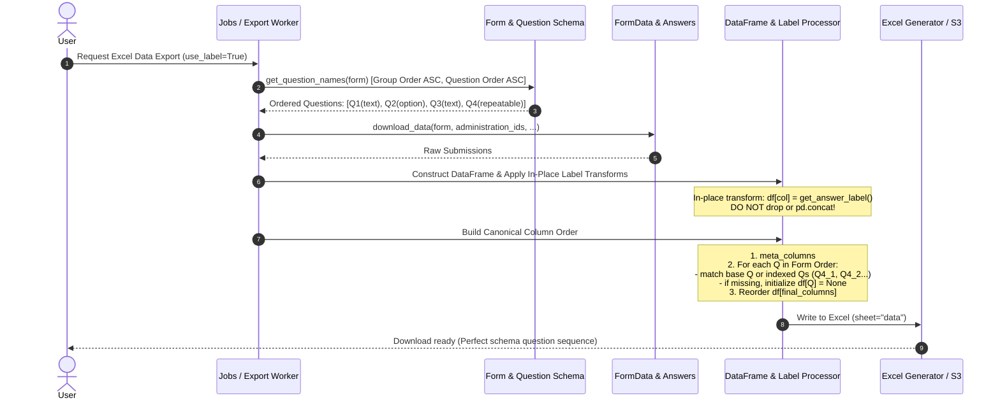

# Feature Design — Data Export Question Order Preservation

---

## Feature: Data export strictly respects form question order

**Task ID**: JOB-502 (GitHub [#502](https://github.com/akvo/akvo-mis/issues/502))
**Author**: Akvo Dev Team
**Status**: Implemented

---

## 1. Context & Problem Statement

### 5W1H Analysis
- **Who**: Data analysts, administrators, and field managers downloading questionnaire data via the Web UI or background export jobs.
- **What**: Data exported to Excel (`generate_data_sheet`, `generate_monitoring_data_sheet`, `generate_excel_data`) fails to respect question order; questions defined in the middle of a form (notably option-type questions and unanswered questions) get moved to the very end of the sheet.
- **Where**: `backend/api/v1/v1_jobs/job.py`, `backend/api/v1/v1_data/models.py`, `backend/api/v1/v1_mobile/serializers.py`.
- **When**: Triggered whenever users request an Excel/Zip download of form data or when the daily export cron job executes.
- **Why**: Option questions and unpopulated questions get separated from their logical sections, causing cognitive overhead, mismatched analysis templates, and broken data integration pipelines.
- **How**: Replace destructive Pandas column dropping/concatenation with in-place series transformation, enforce deterministic schema-derived column ordering (`question_group__order`, `order`), and preserve repeatable indexed question sequences (`_1`, `_2`, etc.).

---

## 2. Architecture & Logic Flow

### Sequence / Logic Flow Diagram

---

## 3. Detailed Technical Design

### In-Scope Touchpoints
1. `backend/api/v1/v1_jobs/job.py`:
   - `generate_data_sheet`: Update label transformation to in-place; replace column reconstruction with deterministic iteration over `questions` (including repeatable numerical sorting `_1`, `_2`).
   - `generate_monitoring_data_sheet`: Apply identical in-place transformation and deterministic column reconstruction.
2. `backend/api/v1/v1_data/models.py`:
   - `FormData.to_data_frame`: Order answers by `question__question_group__order`, `question__order`, `index`.
   - `FormData.save_to_file`: Order answers by `question__question_group__order`, `question__order`.
3. `backend/api/v1/v1_mobile/serializers.py`:
   - `get_json`: Order answers by `question__question_group__order`, `question__order`.
4. `backend/api/v1/v1_jobs/tests/`:
   - `tests_bulk_data_download.py` / `tests_generate_excel_data_endpoint.py`: Add explicit regression assertions for question order preservation with option questions, empty questions, and repeatable groups.

### Out of Scope
- Modifying XLSForm import/export parsers.
- Modifying definition sheet formatting (`questions` / `options` tabs).
- Modifying PDF/Docx report generators.

---

## 4. Verification Plan

### Automated Regression Tests
- `./dc.sh exec backend python manage.py test api.v1.v1_jobs`
- Specific test cases:
  1. `test_generate_data_sheet_respects_interleaved_option_question_order`: Form with `[text_1, option_1, text_2, option_2, text_3]` with `use_label=True` ensuring column sequence `[meta..., text_1, option_1, text_2, option_2, text_3]`.
  2. `test_generate_data_sheet_preserves_unanswered_question_order`: Unanswered questions stay at their exact schema position rather than shifting to the end.
  3. `test_generate_data_sheet_repeatable_questions_ordering`: Repeatable question groups output indexed columns in group order.
  4. `test_generate_monitoring_data_sheet_question_order`: Monitoring export sheet respects child form question sequence.

---

## 5. Vibe Coding Estimation

| Task ID | Story / Task Description | Vibe Coding (Dev) | Automated Testing | QA & Review | Total Est. | Actual Time |
| :--- | :--- | :---: | :---: | :---: | :---: | :---: |
| **JOB-502.1** | Fix in-place label transform & deterministic column ordering in `generate_data_sheet` & `generate_monitoring_data_sheet` | 20m | 15m | 10m | **45m (0.75h)** | **20m** |
| **JOB-502.2** | Fix question group ordering in `FormData.to_data_frame`, `save_to_file`, and mobile serializer | 15m | 10m | 10m | **35m (0.58h)** | **15m** |
| **JOB-502.3** | Add comprehensive regression test suite in `v1_jobs/tests` covering interleaved option, missing, and repeatable questions | 15m | 20m | 10m | **45m (0.75h)** | **25m** |
| **Total** | **End-to-End Bugfix Delivery** | **50m** | **45m** | **30m** | **125m (~2.0h)** | **60m (1.0h)** |
