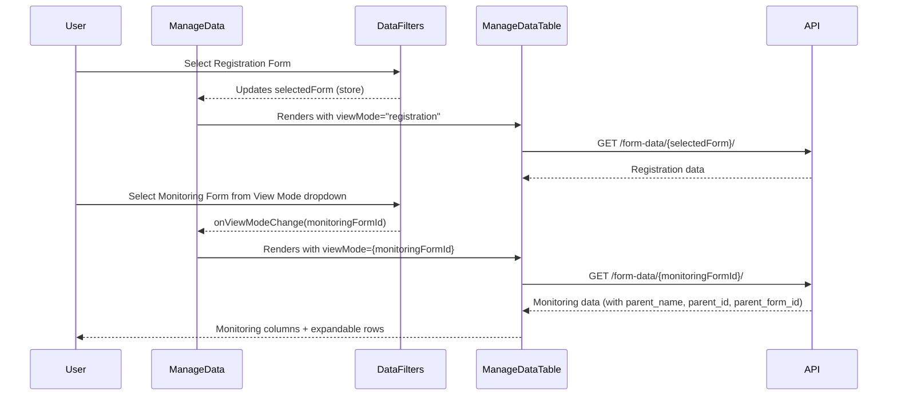

# Feature Design Document

> **Purpose**: Use this template when planning new features that require data model changes, API design, or architectural decisions. Complete this document BEFORE implementation begins.

---

## Feature: MP-001 — Monitoring Data View

**Task ID**: 267
**Issue**: #267
**Author**: Galih Pratama
**Date**: 2026-08-13
**Status**: Review
**Branch**: `feature/267-add-monitoring-form-view-mode-to-manage-data-page`

---

## 1. Context & Problem Statement

```
Currently:
- The manage data view is only registration-based.
- When monitoring data collection is happening for a certain form, it is difficult to track progress.
- Users are forced to click every Registration Datapoint to see monitoring submissions.

Goal:
- Add a "View Mode" dropdown next to the existing Form dropdown.
- Allow users to switch between Registration view (current behavior) and Monitoring form views (one option per monitoring form).
- See all monitoring submissions directly in the Manage Data table, with inline expansion for details.
```

## 2. Architecture Overview

- **Backend**: Update `ListFormDataSerializer` to include `parent_name`, `parent_id`, and `parent_form_id` so monitoring form data can link back to its parent registration datapoint.
- **Frontend**: Add `viewMode` state to `ManageData.jsx`. Pass it to `DataFilters` (new dropdown) and `ManageDataTable` (conditional columns + expandable rows).
- **UX**: Hybrid approach — clicking a monitoring row expands inline (reusing `DataDetail`), with a "View Full Context" button to navigate to `MonitoringDetail`.



---

## 3. Requirements

### User Acceptance Criteria
- [ ] View mode dropdown appears when a registration form with monitoring forms is selected
- [ ] Dropdown is hidden when selected form has no monitoring forms
- [ ] Selecting a monitoring form shows monitoring submissions in the table
- [ ] Table columns adapt based on view mode (registration vs monitoring)
- [ ] Registration view: Click row navigates to MonitoringDetail page (current behavior)
- [ ] Monitoring view: Click row expands inline to show data details
- [ ] Monitoring view: "View Full Context" button navigates to parent's MonitoringDetail
- [ ] Existing filters (search, date range, administration) work with monitoring view
- [ ] View mode resets to "Registration" when changing the form dropdown

### Technical Acceptance Criteria
- [ ] Backend returns `parent_name`, `parent_id`, `parent_form_id` for monitoring data via `ListFormDataSerializer`
- [ ] Registration data returns `null` for these fields
- [ ] Backend tests pass for new serializer fields
- [ ] Frontend linting passes
- [ ] All existing tests continue to pass

---

## 4. Backend Implementation

### Data Model Changes

No model changes. Serializer-only additions.

### Modified Serializer

**File**: [`serializers.py`](/backend/api/v1/v1_data/serializers.py#L388-L475)

| Serializer | Change | Reason |
|------------|--------|--------|
| `ListFormDataSerializer` | Add `parent_name`, `parent_id`, `parent_form_id` SerializerMethodFields | Link monitoring data to parent registration datapoint |

```python
# New fields to add after total_children (line ~397)
parent_name = serializers.SerializerMethodField()
parent_id = serializers.SerializerMethodField()
parent_form_id = serializers.SerializerMethodField()

def get_parent_name(self, instance: FormData):
    return instance.parent.name if instance.parent else None

def get_parent_id(self, instance: FormData):
    return instance.parent.id if instance.parent else None

def get_parent_form_id(self, instance: FormData):
    return instance.parent.form_id if instance.parent else None
```

Add to `Meta.fields`: `"parent_name"`, `"parent_id"`, `"parent_form_id"`

### API Response (monitoring form data)

```json
{
  "id": 42,
  "name": "Monitoring Record 1",
  "form": 5,
  "administration": "Province - District",
  "created_by": "Jane Doe",
  "created": "20 Jun 2024",
  "submitter": "device-123",
  "parent_name": "School Alpha",
  "parent_id": 10,
  "parent_form_id": 3
}
```

For registration data: `parent_name`, `parent_id`, `parent_form_id` will all be `null`.

### N+1 Query Note

`FormData.parent` is a FK. Django will auto-query each parent unless `select_related("parent")` is applied in the queryset. Check the view's queryset — if it already uses `select_related`, no change needed; otherwise add `select_related("parent")` to avoid N+1 queries.

---

## 5. Frontend Implementation

### State Management

**File**: [`ManageData.jsx`](/frontend/src/pages/manage-data/ManageData.jsx)

- Add `viewMode` state (default: `"registration"`).
- Add `handleViewModeChange` handler that sets `viewMode` and clears `selectedRowKeys`.
- Pass `viewMode` + `onViewModeChange` to `DataFilters`.
- Pass `viewMode` to `ManageDataTable`.

### DataFilters — View Mode Dropdown

**File**: [`DataFilters.js`](/frontend/src/components/filters/DataFilters.js)

Key insight: **`childForms` is already computed** at line 70-72 via `allForms.filter(f => f?.content?.parent === selectedForm)`. This is exactly the monitoring forms list.

Changes:
- Accept new props: `viewMode`, `onViewModeChange`.
- Build `viewModeOptions` from `childForms`: `[{value: "registration", label: "Registration"}, ...childForms mapped]`.
- Render a `<Select>` next to `<FormDropdown>` when `childForms.length > 0`.
- Add `useEffect` to reset `viewMode` to `"registration"` when `selectedForm` changes.

### ManageDataTable — Conditional Rendering

**File**: [`ManageDataTable.jsx`](/frontend/src/pages/manage-data/components/ManageDataTable.jsx)

Changes:
- Accept `viewMode` prop.
- Derive `isMonitoringView = viewMode !== "registration"`.
- **Fetch logic**: Use `viewMode` as the `formId` when `isMonitoringView`, otherwise use existing `selectedForm`.
- **Registration columns** (current behavior, extracted into `registrationColumns`).
- **Monitoring columns**: Submission Date, Datapoint (`parent_name`), Channel (`submitter`), User, Region, Expand column — pattern copied from [`MonitoringDetail.jsx` columns](/frontend/src/pages/manage-data/MonitoringDetail.jsx#L135-L163).
- **Expandable config**: Reuse exact pattern from [`MonitoringDetail.jsx` expandable](/frontend/src/pages/manage-data/MonitoringDetail.jsx#L382-L413) — `DataDetail` in expanded row, circle expand icons, `expandRowByClick`.
- **Sort default**: `"created"` for monitoring view, `"latest_activity"` for registration.
- Add `useEffect` to reset page/sort when `viewMode` changes.

### DataDetail — "View Full Context" Button

**File**: [`DataDetail.jsx`](/frontend/src/pages/manage-data/DataDetail.jsx)

- Accept optional `goToParentContext` prop.
- Render a "View Full Context" `<Button type="link">` in the action buttons area when the prop is provided.
- Navigation target: `/control-center/data/{parent_form_id}/monitoring/{parent_id}?form_id={viewMode}`

### UI Mockup

```text
┌──────────────────────────────────────────────────────────────────────────┐
│ Form: [Household Survey ▼]   View: [Registration ▼]    [+ Add New]     │
│                                    ├─ Registration                     │
│                                    ├─ Monthly Check                    │
│                                    └─ Quarterly Visit                  │
├──────────────────────────────────────────────────────────────────────────┤
│ When "Monthly Check" selected:                                         │
│ Submission Date │ Datapoint      │ Channel │ User │ Region             │
├──────────────────────────────────────────────────────────────────────────┤
│ ▶ 2024-06-20    │ School Alpha   │ Mobile  │ John │ District A         │
│ ▼ 2024-06-18    │ School Beta    │ Web     │ Jane │ District B         │
│   ┌──────────────────────────────────────────────────────────────┐     │
│   │ [View Full Context]  [Edit]  [Delete]                       │     │
│   │ Question 1: Answer 1                                        │     │
│   │ Question 2: Answer 2                                        │     │
│   └──────────────────────────────────────────────────────────────┘     │
│ ▶ 2024-06-15    │ School Gamma   │ Mobile  │ John │ District A         │
└──────────────────────────────────────────────────────────────────────────┘
```

---

## 6. UI Text / Translations

**File**: [`ui-text.js`](/frontend/src/lib/ui-text.js)

**Already existing keys** (no changes needed):
- `channelCol`, `mobileAppText`, `webformText`, `lastUpdatedCol`, `nameCol`, `userCol`, `regionCol`

**New keys to add**:

| Key | English Value |
|-----|---------------|
| `registrationView` | `"Registration"` |
| `selectViewMode` | `"Select View"` |
| `submissionDateCol` | `"Submission Date"` |
| `datapointCol` | `"Datapoint"` |
| `viewFullContext` | `"View Full Context"` |

---

## 7. Compatibility & Migration

### Backward Compatibility
- [x] Existing API consumers unaffected (fields added, none removed)
- [x] Existing data preserved
- [x] No database migration needed

### Mobile App Impact
- [x] Sync endpoints unaffected
- [x] No SQLite schema changes

---

## 8. Security Considerations

- [x] No new attack vectors introduced
- [x] Permissions remain identical — users can only access forms they have roles for
- [x] The monitoring form data endpoint already enforces the same auth as registration

---

## 9. Testing & Verification

### Automated Tests

**Backend**: New test file `tests_parent_fields.py` in `backend/api/v1/v1_data/tests/`:
- Test monitoring form data includes `parent_name`, `parent_id`, `parent_form_id`
- Test registration form data returns `null` for parent fields

Run: `./dc.sh exec backend python manage.py test api.v1.v1_data.tests`

**Frontend**: `cd frontend && CI=true npx react-scripts test --watchAll=false`

### Manual Verification
1. Open Manage Data page
2. Select a Registration Form that has monitoring forms
3. Verify "View" dropdown appears with Registration + monitoring form options
4. Switch to a monitoring form — verify columns change
5. Expand a row — verify DataDetail renders inline
6. Click "View Full Context" — verify navigation to MonitoringDetail
7. Switch form dropdown — verify view mode resets to Registration
8. Apply search/date/administration filters in monitoring view

---

## 10. Epic & Ballpark Estimation

- Confidence Level: High
- Dependencies: None

| Task ID | Component & Description | Est. Hours (Min - Max) | Priority |
|---------|-------------------------|------------------------|----------|
| T-001 | Backend: Add parent fields to `ListFormDataSerializer` + `select_related` | 0.5h - 1h | Must Have |
| T-002 | Backend: Add tests for parent serializer fields | 0.5h - 1h | Must Have |
| T-003 | Frontend: `ManageData.jsx` — add `viewMode` state + pass props | 0.25h - 0.5h | Must Have |
| T-004 | Frontend: `DataFilters.js` — add View Mode dropdown | 0.5h - 1h | Must Have |
| T-005 | Frontend: `ManageDataTable.jsx` — conditional columns, fetch, expandable rows | 1h - 2h | Must Have |
| T-006 | Frontend: `DataDetail.jsx` — add "View Full Context" button | 0.25h - 0.5h | Must Have |
| T-007 | Frontend: `ui-text.js` — add 5 new translation keys | 0.15h - 0.25h | Must Have |
| T-008 | Testing & verification (manual + lint) | 0.5h - 1h | Must Have |
| **Total** | | **3.5h - 7h** | |

---

## 11. Decision Log

### D-1: Row Click Behavior for Monitoring View
**Options Considered**:
1. Navigate directly to `MonitoringDetail` (like registration view)
2. Expand inline with `DataDetail` + "View Full Context" button
**Decision**: Option 2
**Rationale**: Matches existing pattern in `MonitoringDetail.jsx` (line 382-413), enables quick scanning without page navigation, provides escape hatch via button.

### D-2: Reuse Existing `childForms` Computation
**Decision**: Leverage `DataFilters.js` line 70-72's existing `childForms` memo instead of duplicating form filtering logic.
**Rationale**: DRY — the monitoring forms list is already correctly computed from `allForms.filter(f => f?.content?.parent === selectedForm)`.

---

## 12. Open Questions & References
- [ ] Verify `select_related("parent")` is needed in the view queryset to prevent N+1 queries
- [ ] Verify `DataDetail` edit/delete callbacks function properly in the inline expansion context
- Related issue: #267
