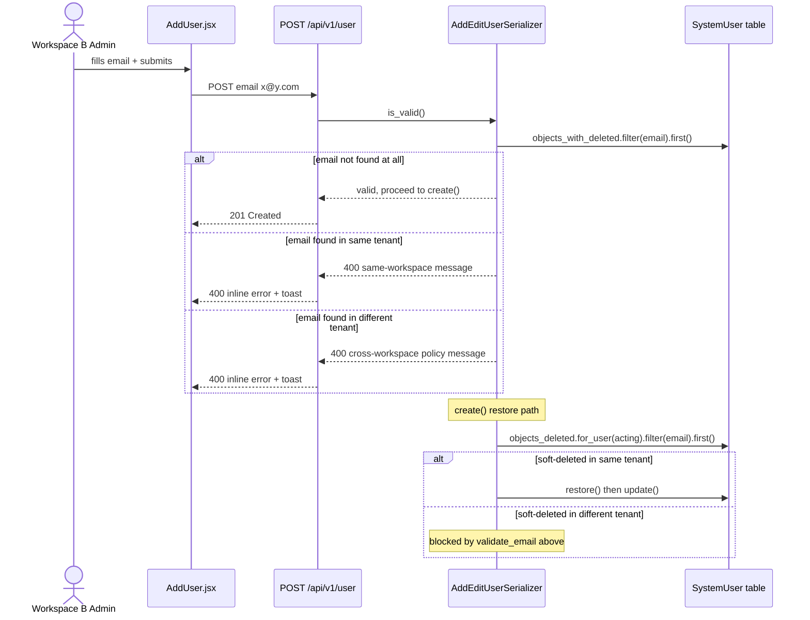

# Feature Design Document

> **Purpose**: Implementation plan for #295. Complete before implementation begins.

---

## Feature: Cross-Workspace Invite Policy & Cross-Tenant Restore Leak Fix

**Task ID**: MT-011
**Issue**: #295
**Author**: Galih Pratama
**Date**: 2026-08-12
**Status**: Approved
**Branch**: `feature/295-post-mt-002-inviting-a-user-who-already-belongs-to-another-workspace-fails-with-a-raw-error`

---

## 1. Context & Problem Statement

```
Currently:
- POST /api/v1/user returns 400 {"email":["system user with this email already
  exists."]} when inviting an address that already belongs to another workspace.
- The message is a raw DRF UniqueValidator error — it reads as a bug, not a rule.
- AddEditUserSerializer.create() looks up soft-deleted users via
  SystemUser.objects_deleted.get(email=...) without scoping to the acting user's
  tenant. A soft-deleted user in workspace A can be silently un-deleted and its
  UserRole/UserForms rows mutated by a workspace B admin.
- No product documentation says "one account, one workspace".

Goal:
- Replace the implicit UniqueValidator with an explicit, tenant-aware email check.
- Return a clear, differentiated message for each case.
- Scope the soft-deleted restore lookup to the acting user's tenant.
- Surface field-level errors both inline on the Add User form AND as a toast.
- Document the one-account-one-workspace policy in start.rst.
```

---

## 2. Architecture Overview

The validation currently happens in two layers:

1. **DRF field validation** — `UniqueValidator` fires during `is_valid()`, before
   any serializer method runs.
2. **`AddEditUserSerializer.create()`** — soft-delete restore logic runs only
   after the field passes.

The fix suppresses the auto-generated `UniqueValidator` on `email` by overriding
`extra_kwargs` and replaces it with an explicit `validate_email()` method that
is fully tenant-aware.



---

## 3. Requirements

### User Acceptance Criteria

- [ ] Inviting an address that exists in **another** workspace returns `400` with the
  policy message, and creates nothing.
- [ ] Inviting an address that exists in **the current** workspace returns a clear
  "already in this workspace" message and creates nothing.
- [ ] Both hold when the existing account is soft-deleted or an unactivated pending
  invitation (`is_active=False`).
- [ ] A soft-deleted user in **another** tenant is **never** restored by an invite
  from a different tenant.
- [ ] Soft-deleted users in the **same** tenant are still restored by re-inviting
  them (today's behaviour must not regress).
- [ ] The Add User form displays the error message **inline** on the email field
  **and** as an error toast.
- [ ] The rule "one account per workspace" appears in `docs/source/start.rst`.

### Technical Acceptance Criteria

- [ ] `AddEditUserSerializer.validate_email()` performs the explicit check using
  `SystemUser.objects_with_deleted`.
- [ ] `extra_kwargs = {'email': {'validators': []}}` suppresses DRF's auto-derived
  `UniqueValidator`.
- [ ] `AddEditUserSerializer.create()` scopes the soft-delete restore lookup with
  `.for_user(acting_user(self.context))`.
- [ ] Five regression tests added to
  `backend/api/v1/v1_users/tests/tests_tenant_isolation.py`.
- [ ] `./dc.sh exec backend flake8` passes.
- [ ] Full backend test suite passes.

---

## 4. Backend Implementation

### Data Model Changes

**None.** `email = models.EmailField(unique=True)` on `SystemUser` is **kept
as-is**. The DB-level constraint is the actual policy enforcer; the serializer
only improves the error message.

### Modified File: `backend/api/v1/v1_users/serializers.py`

#### Change 1 — Suppress auto-generated UniqueValidator + explicit validation

Add `extra_kwargs` to the existing `Meta` inner class (line ~576) and add a new
`validate_email()` method immediately before or after `validate_roles()`:

```python
class Meta:
    model = SystemUser
    fields = [
        'first_name', 'last_name', 'email',
        'organisation', 'trained', 'roles', 'phone_number',
        'forms', 'inform_user', 'is_superuser'
    ]
    extra_kwargs = {
        # Suppress the auto-derived UniqueValidator so we can perform our
        # own tenant-aware check in validate_email() below.
        'email': {'validators': []},
    }

def validate_email(self, value):
    """
    Tenant-aware email uniqueness guard.

    Uses objects_with_deleted so that soft-deleted accounts and unactivated
    pending invitations (is_active=False) are both included — they still
    occupy the address at the DB level.
    """
    acting = acting_user(self.context)
    existing = SystemUser.objects_with_deleted.filter(email=value).first()

    if existing is None:
        return value

    # Update path: the instance being edited is exempt from the check.
    if self.instance and self.instance.pk == existing.pk:
        return value

    if existing.tenant_id == getattr(acting, 'tenant_id', None):
        raise serializers.ValidationError(
            "This email is already in your workspace. "
            "To make changes, edit the existing user."
        )

    raise serializers.ValidationError(
        "This email address is already registered to another workspace. "
        "An account can only belong to one workspace — ask them to use "
        "a different address, or contact support."
    )
```

#### Change 2 — Scope soft-delete restore lookup in `create()` (line ~399)

```python
# BEFORE
def create(self, validated_data):
    try:
        user_deleted = SystemUser.objects_deleted.get(
            email=validated_data['email']
        )
        if user_deleted:
            user_deleted.restore()
            self.update(instance=user_deleted, validated_data=validated_data)
            return user_deleted
    except SystemUser.DoesNotExist:
        ...

# AFTER
def create(self, validated_data):
    acting = acting_user(self.context)
    user_deleted = (
        SystemUser.objects_deleted
        .for_user(acting)
        .filter(email=validated_data['email'])
        .first()
    )
    if user_deleted:
        user_deleted.restore()
        self.update(
            instance=user_deleted,
            validated_data=validated_data,
        )
        return user_deleted

    # Normal creation path (unchanged)
    validated_data.pop('inform_user', None)
    roles_data = validated_data.pop('roles', [])
    forms = validated_data.pop('forms', [])
    user = super(AddEditUserSerializer, self).create(validated_data)
    ...
```

> **Why this is safe**: `validate_email()` runs before `create()`. By the time
> `create()` runs, any cross-tenant address has already been rejected with 400.
> The `.for_user()` scoping is a defence-in-depth measure.

#### Import check

`acting_user` is imported at the top of `serializers.py` via:

```python
from utils.tenant_scoped_model import acting_user
```

Confirm this import exists; if not, add it.

### API Contract

No new endpoints. Error response shape is unchanged (`message` + `details`):

```json
// POST /api/v1/user  →  400 (cross-workspace)
{
  "message": "This email address is already registered to another workspace. An account can only belong to one workspace — ask them to use a different address, or contact support.",
  "details": {
    "email": [
      "This email address is already registered to another workspace. An account can only belong to one workspace — ask them to use a different address, or contact support."
    ]
  }
}
```

```json
// POST /api/v1/user  →  400 (same-workspace)
{
  "message": "This email is already in your workspace. To make changes, edit the existing user.",
  "details": {
    "email": [
      "This email is already in your workspace. To make changes, edit the existing user."
    ]
  }
}
```

---

## 5. Frontend Implementation

### File: `frontend/src/pages/add-user/AddUser.jsx`

#### Current catch block (lines 102–114)

```jsx
.catch((err) => {
  if (err?.response?.status === 403) {
    setIsModalVisible(true);
    setModalContent(err?.response?.data?.message);
  } else {
    notify({
      type: "error",
      message:
        err?.response?.data?.message ||
        `User could not be ${id ? "updated" : "added"}`,
    });
  }
  setSubmitting(false);
});
```

#### Updated catch block

Show both an inline field error on the email `<Form.Item>` **and** an error toast
when `details.email` is present. Other field errors fall back to the existing
toast-only behaviour.

```jsx
.catch((err) => {
  if (err?.response?.status === 403) {
    setIsModalVisible(true);
    setModalContent(err?.response?.data?.message);
  } else {
    const details = err?.response?.data?.details || {};
    if (details.email) {
      // Surface inline under the email field
      form.setFields([
        {
          name: "email",
          errors: Array.isArray(details.email)
            ? details.email
            : [details.email],
        },
      ]);
      // Also show a toast so the error is noticeable even if the field
      // is scrolled out of view
      notify({
        type: "error",
        message:
          err?.response?.data?.message ||
          `User could not be ${id ? "updated" : "added"}`,
      });
    } else {
      notify({
        type: "error",
        message:
          err?.response?.data?.message ||
          `User could not be ${id ? "updated" : "added"}`,
      });
    }
  }
  setSubmitting(false);
});
```

#### Wireframe — inline email error state

```text
+---------------------------------------------------------+
| Add User                                                |
+---------------------------------------------------------+
| First Name  [ John                                    ] |
| Last Name   [ Doe                                     ] |
| Email       [ john@other-workspace.com                ] |
|             ⚠ This email address is already registered  |
|               to another workspace. An account can only |
|               belong to one workspace — ask them to use |
|               a different address, or contact support.  |
| Phone       [                                         ] |
|                                                         |
| [Toast]  ✖ This email address is already registered...  |
+---------------------------------------------------------+
```

---

## 6. Documentation

### File: `docs/source/start.rst`

Extend the **Invite Users** bullet under the `User access` section (around
line 76):

```rst
- **Invite Users**: Administrators can invite new users to join the system by
  sending them an invitation email. The invited user will need to set up their
  account by creating a password.

  .. note::

     **One account per workspace.**  An email address can belong to only one
     workspace. If the address is already registered elsewhere — as an owner,
     a member, or a pending invitation — it cannot be invited into a second
     workspace. Ask the person to use a different email address, or contact
     support if you need help.
```

---

## 7. Compatibility & Migration

### Backward Compatibility

- [x] No schema migration required
- [x] Error response shape (`message` + `details`) unchanged
- [x] `unique=True` DB constraint retained
- [x] Existing valid add-user flows unaffected

### Mobile App Impact

- Sync endpoints affected: None — admin invite path only
- SQLite schema changes: No
- Version detection: N/A

### Seeder / CLI Compatibility

- [x] Existing seeders work — no model changes

---

## 8. Security Considerations

- [x] **Information-disclosure decision accepted**: The error response confirms
  that *some* account holds the email address. This is unavoidable — any response
  to an invite attempt reveals at minimum "this address is taken". Wording uses
  policy language rather than ORM internals (deliberate, not a regression).
- [x] **Cross-tenant restore blocked**: `.for_user()` scoping in `create()`
  prevents a workspace B admin from un-deleting a workspace A soft-deleted
  account.
- [x] **Tenant stamp unchanged**: Restored accounts keep their original
  `tenant_id`; `validate_email()` ensures cross-tenant addresses never reach
  the restore branch.
- [x] No new attack vectors introduced.

---

## 9. Testing & Verification

### New Tests

**File**: `backend/api/v1/v1_users/tests/tests_tenant_isolation.py`
**Class**: `UsersTenantIsolationTestCase` (extend existing class)

| # | Test name | Asserts |
|---|-----------|---------|
| T-1 | `test_invite_active_user_from_other_workspace_returns_policy_error` | `400`; response contains cross-workspace message |
| T-2 | `test_invite_soft_deleted_user_from_other_workspace_not_restored` | `400`; `self.b["user"].tenant_id` unchanged (DB re-query); no new `UserRole`/`UserForms` rows for that user |
| T-3 | `test_invite_pending_user_from_other_workspace_returns_policy_error` | `400`; `is_active=False` account in workspace A triggers policy message |
| T-4 | `test_invite_duplicate_in_same_workspace_returns_same_workspace_error` | `400`; response contains same-workspace message |
| T-5 | `test_reinvite_soft_deleted_user_in_same_workspace_restores` | `201`; `deleted_at` is `None` after call (regression guard) |

### Automated Test Commands

```bash
# Full suite
./dc.sh exec backend python manage.py test

# Targeted (faster feedback)
./dc.sh exec backend python manage.py test \
    api.v1.v1_users.tests.tests_tenant_isolation \
    api.v1.v1_users.tests.tests_add_user

# Lint
./dc.sh exec backend flake8
```

### Manual Verification Scenarios

#### Scenario 1: Cross-Workspace Invite (New Policy Error)

1. Identify an email address registered in **Workspace A** (e.g., `user_a@acme.org`).
2. Log in as an Administrator in **Workspace B**.
3. Navigate to **Control Center → Users → Add User** (`/control-center/users/add`).
4. Fill in the form:
   - **First Name**: Test
   - **Last Name**: CrossTenant
   - **Email**: `user_a@acme.org` (email belonging to Workspace A)
5. Click **Add User**.
6. **Expected Outcome**:
   - **Inline Error**: Red text appears below the Email field:
     > *"This email address is already registered to another workspace. An account can only belong to one workspace — ask them to use a different address, or contact support."*
   - **Toast Notification**: Error toast appears with the same policy message.
   - **Data Integrity**: No user is created in Workspace B's list.

#### Scenario 2: Same-Workspace Duplicate Invite

1. While logged in as **Workspace B** Admin, attempt to invite an email address that **already exists in Workspace B** (e.g., `user_b@beta.org`).
2. Click **Add User**.
3. **Expected Outcome**:
   - **Inline Error**: Red text appears below the Email field:
     > *"This email is already in your workspace. To make changes, edit the existing user."*
   - **Toast Notification**: Error toast with the same message.

#### Scenario 3: Same-Workspace Soft-Deleted User (Restore Flow)

1. Soft-delete a user in **Workspace B** (from *Control Center → Users → Delete*).
2. Re-invite that **exact same email address** in Workspace B (*Add User* form).
3. Click **Add User**.
4. **Expected Outcome**:
   - Success toast: *"User added"*
   - The soft-deleted user in Workspace B is successfully restored and updated.

#### Scenario 4: Cross-Workspace Soft-Deleted User (Prevent Leak)

1. Soft-delete a user in **Workspace A**.
2. Log in as **Workspace B** Admin.
3. Try to invite the email address of Workspace A's soft-deleted user.
4. Click **Add User**.
5. **Expected Outcome**:
   - **Rejection**: 400 Bad Request with policy message (*"This email address is already registered to another workspace..."*).
   - **Security**: Workspace A's soft-deleted user is **NOT** restored or transferred into Workspace B.

---

## 10. Epic & Ballpark Estimation

- **Confidence Level**: High — narrow, well-understood scope
- **Dependencies**: None

| Task ID | Component & Description | Est. Hours (Min – Max) | Priority |
|---------|-------------------------|------------------------|----------|
| T-001 | **Backend** — `validate_email()` + `extra_kwargs` in `AddEditUserSerializer` | 1h – 2h | Must Have |
| T-002 | **Backend** — Scope restore lookup in `create()` with `.for_user()` | 0.5h – 1h | Must Have |
| T-003 | **Backend** — 5 regression tests in `tests_tenant_isolation.py` | 2h – 3h | Must Have |
| T-004 | **Frontend** — Inline field error + toast in `onFinish` catch block | 0.5h – 1h | Must Have |
| T-005 | **Docs** — "One account per workspace" note in `start.rst` | 0.5h – 1h | Must Have |
| **Total** | | **4.5h – 8h** | |

---

## 11. Decision Log

### D-1: Suppress UniqueValidator via `extra_kwargs` vs. custom field class

**Options Considered**:
1. `extra_kwargs = {'email': {'validators': []}}` + `validate_email()`
2. Replace the email field declaration with a hand-written `EmailField(validators=[])`

**Decision**: Option 1.
**Rationale**: `extra_kwargs` is the idiomatic DRF mechanism for overriding
auto-derived validators. Minimal diff, no new field class needed.

### D-2: Field-level (`validate_email`) vs. object-level (`validate`) check

**Options Considered**:
1. `validate_email(value)` — DRF maps the error to `{"email": [...]}` automatically.
2. `validate(attrs)` — must build the `{"email": [...]}` dict manually.

**Decision**: Option 1.
**Rationale**: Field-level placement gives the correct `details.email` error
shape for free, which is exactly what `form.setFields()` on the frontend needs.

### D-3: Deep-link to existing user's edit page on same-workspace error

**Decision**: No deep-link.
**Rationale**: Out of scope for this issue. The message directs the admin to
edit the existing user; finding that user via the existing users list is
sufficient.

### D-4: Inline only vs. toast + inline for email collision errors

**Decision**: Both inline field error **and** an error toast.
**Rationale**: Inline error anchors the problem to the field. The additional
toast ensures the message is visible even if the email field is scrolled off
screen, and aids assistive-technology users who may not be notified of DOM-only
validation state changes.

### D-5: Information disclosure

**Decision**: Accept that the error reveals "someone holds this email".
**Rationale**: Any response to an invite attempt reveals at least "this address
is taken". The alternative (silently ignoring the request) is even more
confusing. Policy language is a deliberate improvement over leaked ORM internals.

---

## 12. References

- Related specs:
  - [MT-002](./MT-002-tenant-scoping-database.md) — tenant scoping database
  - [MT-003](./MT-003-tenant-isolation-read-filtering.md) — tenant isolation read filtering
  - [MT-004](./MT-004-tenant-write-path-enforcement.md) — tenant write-path enforcement
- Key source files:
  - `backend/api/v1/v1_users/serializers.py` — `AddEditUserSerializer` (lines 370–582)
  - `backend/api/v1/v1_users/models.py` — `SystemUser` model (lines 64–96)
  - `backend/utils/soft_deletes_model.py` — `SoftDeletesManager` / `for_user()`
  - `backend/utils/tenant_scoped_model.py` — `acting_user()` helper
  - `frontend/src/pages/add-user/AddUser.jsx` — `onFinish` catch block
  - `docs/source/start.rst` — "Invite Users" bullet
- Future direction: splitting `SystemUser` into identity + per-workspace
  `Membership` (issue #295 "Out of scope").
