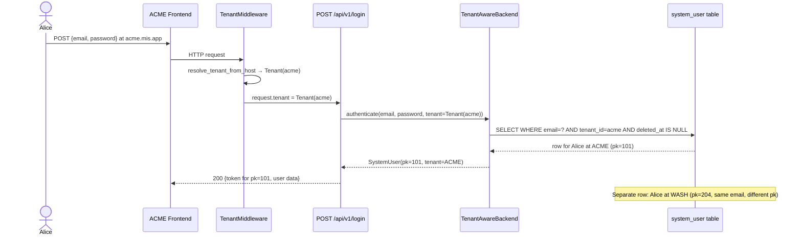
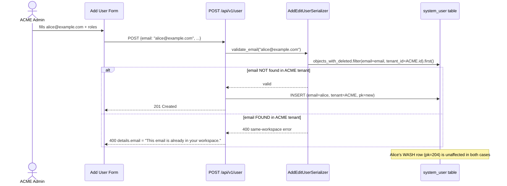

# Feature Design Document

> **Purpose**: Implementation plan for #338. Complete before implementation begins.

---

## Feature: Cross-Tenant Email Sharing — Same Email in Multiple Tenants

**Task ID**: MT-013
**Issue**: #338
**Author**: Galih Pratama
**Date**: 2026-08-28
**Status**: Approved
**Branch**: `feature/338-mt-013-same-email-cannot-be-used-in-multiple-tenants`

---

## 1. Context & Problem Statement

```
Currently:
- SystemUser.email has unique=True (globally unique across all tenants)
- An admin who tries to invite a cross-tenant email gets a policy error (MT-011)
- A person who works across multiple Akvo MIS workspaces must use a different
  email address per workspace — unworkable for dedicated vertical deployments

Goal:
- Allow the same email address to exist as separate SystemUser rows in multiple tenants
- Each row has its own tenant FK, RBAC assignments, password hash, and session
- Logging in at acme.mis.app authenticates the ACME row only; wash.mis.app the WASH row
- Inviting an email that already exists in the same tenant is still blocked (400)
- Inviting an email that exists in another tenant succeeds (201, new row created)
```

### Architecture Decision: Per-Tenant Rows vs. Identity + Membership Split

**Option A — Per-tenant SystemUser rows** *(Selected)*
Remove `unique=True` from `SystemUser.email`; add a `(email, tenant)` compound unique
constraint. Each workspace gets its own `system_user` row.

**Option B — Identity + Membership split**
New `Identity` table + `Membership` join table; significant ORM refactoring across the
entire codebase (UserRole, MobileAssignment, Jobs, DataBatch all FK to `system_user.id`).

Option A chosen: minimal schema surgery, all FK references unchanged, auth flow already
tenant-scoped via the login view guard and middleware. Option B is a future architectural
direction if unified cross-tenant profiles become a requirement.

---

## 2. Architecture Overview

### Login Flow — Before and After

```
Request arrives at:  acme.{BASE_DOMAIN}
TenantMiddleware:    request.tenant = Tenant(subdomain="acme")

POST /api/v1/login  {email: "alice@example.com", password: "..."}
  |
  v
authenticate(email, password, tenant=request.tenant)   ← NEW: tenant kwarg
  TenantAwareBackend: SELECT WHERE email=? AND tenant_id=? AND deleted_at IS NULL
  |
  v
signing_in_elsewhere() guard                           ← unchanged (defence-in-depth)
  |
  v
JWT issued for this user pk                            ← unchanged
```

### Sequence Diagram — Login with Shared Email



### Sequence Diagram — Cross-Tenant Invite (now allowed)



---

## 3. Requirements

### User Acceptance Criteria

- [ ] A user with `alice@example.com` can be invited and activated in Tenant A and
  independently in Tenant B with a separate password and roles.
- [ ] Logging in at `acme.mis.app` authenticates the ACME row; `wash.mis.app`
  authenticates the WASH row. The two sessions are fully independent.
- [ ] Inviting an email that **already exists in the same tenant** returns 400 with
  "This email is already in your workspace."
- [ ] Inviting an email that **exists only in another tenant** returns 201.
- [ ] `forgot_password` sends the reset link scoped to the tenant the request arrives on.
- [ ] `resend_activation` scopes the lookup to the request tenant.
- [ ] Existing single-tenant deployments (`BASE_DOMAIN` unset) are unaffected.

### Technical Acceptance Criteria

- [ ] `SystemUser.email`: `unique=True` removed; `UniqueConstraint(["email", "tenant"])` added.
- [ ] New migration: `AlterField` (drop global unique index) + `AddConstraint` (compound).
- [ ] New `utils/tenant_auth_backend.py` — `TenantAwareBackend(ModelBackend)`.
- [ ] `AUTHENTICATION_BACKENDS` in `settings.py` updated.
- [ ] `login` view passes `tenant=getattr(request, "tenant", None)` to `authenticate()`.
- [ ] `login` view scopes `unverified` filter to `tenant=getattr(request, "tenant", None)`.
- [ ] `AddEditUserSerializer.validate_email()` scopes to acting tenant only (cross-tenant
  block removed).
- [ ] `ForgotPasswordSerializer.validate_email()` receives tenant via serializer context.
- [ ] `resend_activation` view adds `.filter(tenant=getattr(request, "tenant", None))`.
- [ ] **Bug fixes (3 latent bombs)**: `email=request.user` call sites replaced with direct
  `request.user` reference in `delete` handler (L953), `get_profile` (L520),
  `UserActivity` middleware (L17).
- [ ] MT-011 tests T-1, T-2, T-3 updated from `400 → 201`.
- [ ] 9 new targeted tests in `tests_cross_tenant_email.py`.
- [ ] `./dc.sh exec backend flake8` passes.
- [ ] Full backend test suite passes.

---

## 4. Backend Implementation

### Data Model Changes

#### Modified Models

| Model | Change | Reason |
|-------|--------|--------|
| `SystemUser` | Remove `email = models.EmailField(unique=True)` | Global unique blocks same email in multiple tenants |
| `SystemUser.Meta` | Add `UniqueConstraint(["email", "tenant"])` | Enforce per-tenant uniqueness |

```python
# backend/api/v1/v1_users/models.py

# BEFORE
email = models.EmailField(max_length=254, unique=True)

# AFTER
email = models.EmailField(max_length=254)

class Meta:
    db_table = "system_user"
    constraints = [
        models.UniqueConstraint(
            fields=["email", "tenant"],
            name="unique_email_per_tenant",
        )
    ]
```

> **Null-tenant edge case**: `tenant` is `null=True`. Under PostgreSQL, `(email, NULL)`
> rows are never in conflict (`NULL != NULL`). Dev seeds and test fixtures that create
> users without a tenant are unaffected. Document in migration comment.

#### Migration Strategy

```python
# backend/api/v1/v1_users/migrations/NNNN_unique_email_per_tenant.py

class Migration(migrations.Migration):
    operations = [
        # 1. Drop global unique index (created by unique=True)
        migrations.AlterField(
            model_name="systemuser",
            name="email",
            field=models.EmailField(max_length=254),
        ),
        # 2. Add per-tenant compound unique constraint.
        #    Rows with tenant=NULL are not constrained (PostgreSQL NULL != NULL).
        migrations.AddConstraint(
            model_name="systemuser",
            constraint=models.UniqueConstraint(
                fields=["email", "tenant"],
                name="unique_email_per_tenant",
            ),
        ),
    ]
```

**Rollback plan**: If rollback is needed, reverse the constraint addition and restore
`unique=True`. This is safe as long as no duplicate `(email, tenant)` pairs were created
during the window — which cannot happen in a single tenant, and the window between the
migration and any cross-tenant invites is negligible.

### New File — Authentication Backend

**File**: `backend/utils/tenant_auth_backend.py`

```python
"""Tenant-aware authentication backend.

Scopes authenticate() to the tenant supplied via the ``tenant`` keyword
argument. Returns None when no tenant is supplied so ModelBackend (the
fallback) handles management commands and shell usage where no tenant
is available.
"""

from django.contrib.auth.backends import ModelBackend
from api.v1.v1_users.models import SystemUser


class TenantAwareBackend(ModelBackend):
    """Authenticate against a (email, password, tenant) triple."""

    def authenticate(
        self, request, email=None, password=None, tenant=None, **kwargs
    ):
        if tenant is None:
            # Not a tenant-scoped call — fall through to ModelBackend.
            return None
        try:
            user = SystemUser.objects.get(
                email=email,
                tenant=tenant,
                deleted_at=None,
            )
        except SystemUser.DoesNotExist:
            # Run the default hasher to mitigate timing attacks.
            SystemUser().set_password(password)
            return None
        if user.check_password(password) and self.user_can_authenticate(user):
            return user
        return None
```

**Settings update** — `backend/mis/settings.py`:

```python
AUTHENTICATION_BACKENDS = [
    "utils.tenant_auth_backend.TenantAwareBackend",
    "django.contrib.auth.backends.ModelBackend",  # fallback: shell, mgmt commands
]
```

### Modified Files

#### `backend/api/v1/v1_users/views.py` — login view

```python
# Pass tenant kwarg to authenticate()
user = authenticate(
    request=request,
    email=serializer.validated_data["email"],
    password=serializer.validated_data["password"],
    tenant=getattr(request, "tenant", None),   # NEW
)

# Scope unverified lookup to request tenant
unverified = SystemUser.objects.filter(
    email=serializer.validated_data["email"],
    tenant=getattr(request, "tenant", None),   # NEW
    is_active=False,
    deleted_at=None,
).first()
```

#### `backend/api/v1/v1_users/views.py` — resend_activation view

```python
# Add tenant filter
email=request.data.get("email"),
tenant=getattr(request, "tenant", None),   # NEW
is_active=False,
deleted_at=None,
```

#### `backend/api/v1/v1_users/views.py` — forgot_password view

```python
# Pass tenant via serializer context
serializer = ForgotPasswordSerializer(
    data=request.data,
    context={"tenant": getattr(request, "tenant", None)},   # NEW
)
```

#### `backend/api/v1/v1_users/serializers.py` — ForgotPasswordSerializer

```python
def validate_email(self, email):
    tenant = self.context.get("tenant")
    qs = SystemUser.objects.filter(email=email, deleted_at=None)
    if tenant is not None:
        qs = qs.filter(tenant=tenant)
    try:
        user = qs.get()
    except SystemUser.DoesNotExist:
        raise ValidationError("Invalid email, user not found")
    except SystemUser.MultipleObjectsReturned:
        # Belt-and-suspenders: should not occur once (email, tenant) is unique,
        # but handles null-tenant rows on unusual single-host multi-tenant setups.
        raise ValidationError("Invalid email, user not found")
    return user
```

#### `backend/api/v1/v1_users/serializers.py` — AddEditUserSerializer.validate_email()

Remove the cross-tenant block. Scope to acting tenant only:

```python
def validate_email(self, value):
    """
    Tenant-scoped email uniqueness guard.

    Email addresses are unique per-tenant, not globally. An address
    that exists in another tenant is fully allowed.
    """
    acting = acting_user(self.context)
    acting_tenant_id = getattr(acting, "tenant_id", None)

    existing = SystemUser.objects_with_deleted.filter(
        email=value,
        tenant_id=acting_tenant_id,
    ).first()

    if existing is None:
        return value

    if self.instance and self.instance.pk == existing.pk:
        return value

    if existing.deleted_at is not None:
        # Soft-deleted in same tenant — create() restore path handles it.
        return value

    raise serializers.ValidationError(
        "This email is already in your workspace. "
        "To make changes, edit the existing user."
    )
```

#### `backend/api/v1/v1_users/views.py` — register view

In `register`, `IntegrityError` handling previously checked `SystemUser.objects.filter(email=validated["email"]).exists()`. Since email is no longer globally unique, `Tenant.objects.filter(subdomain=...)` must be checked first to avoid false-positive error attribution:

```python
# In register view:
except IntegrityError:
    taken = (
        "Subdomain"
        if Tenant.objects.filter(subdomain=validated["subdomain"]).exists()
        else "Email"
    )
    return Response(
        {"message": f"{taken} is already registered"},
        status=status.HTTP_400_BAD_REQUEST,
    )
```

#### Bug Fixes — `email=request.user` Latent Bombs

Three call sites use `SystemUser.objects.get/filter(email=request.user)`. Today they
work because `SystemUser.__str__` returns `self.email` (via `USERNAME_FIELD`) and there
is exactly one row per email. Post-MT-013, the same email in two tenants causes
`MultipleObjectsReturned`. Fix: use `request.user` directly (already a `SystemUser`
instance set by `JWTAuthentication`).

| File | Line | Before | After |
|------|------|--------|-------|
| `v1_users/views.py` — `delete` handler | 953 | `SystemUser.objects.get(email=request.user)` | Remove — use `request.user` directly for self-deletion check |
| `v1_users/views.py` — `get_profile` | 520 | `SystemUser.objects.filter(email=request.user, deleted_at=None).first()` | `SystemUser.objects.filter(pk=request.user.pk, deleted_at=None).first()` |
| `middleware/user_activity.py` | 17 | `SystemUser.objects.get(email=request.user)` | `SystemUser.objects.filter(pk=request.user.pk).first()` with `.DoesNotExist` guard |

### API Contract

No new endpoints. Existing endpoints are unaffected in their request/response shape.
The change is in the *semantics* of the invite endpoint:

| Method | URL | Change |
|--------|-----|--------|
| `POST` | `/api/v1/user` | Cross-tenant email now returns **201** instead of **400** |
| `POST` | `/api/v1/login` | Now authenticates against `(email, tenant)` pair |
| `POST` | `/api/v1/forgot-password` | Reset link is scoped to the request tenant |

---

## 5. Frontend Implementation

### Components & UI

**File**: `frontend/src/pages/add-user/AddUser.jsx`

Remove the cross-workspace error toast/inline copy from the `catch` block added by
MT-011. The same-tenant duplicate error flow ("This email is already in your workspace")
is retained unchanged.

No new frontend logic is needed. The 201 response from a cross-tenant invite is handled
by the existing success path.

#### Wireframes & Mockups

No UI layout changes. The Add User form is unchanged. The only difference is that
submitting a cross-tenant email no longer produces a red inline error — it succeeds.

---

## 6. Type/Constant Mappings

N/A — no new types or constants introduced.

---

## 7. Compatibility & Migration

### Backward Compatibility

- [x] Single-tenant deployments: `(email, tenant)` unique is equivalent to `unique=True`
  when there is one tenant — no behaviour change.
- [x] JWT tokens: encode `pk` only. Each `(email, tenant)` pair has a distinct `pk`.
  `TenantMiddleware` `tenant_id` guard prevents cross-tenant token replay.
- [x] Existing test fixtures with `tenant=None`: safe — PostgreSQL `NULL != NULL`.
- [x] `AUTHENTICATION_BACKENDS` fallback to `ModelBackend` keeps `./manage.py shell`
  and `createsuperuser` working without a tenant kwarg.

### Mobile App Impact

- [x] Mobile auth uses `MobileAssignmentToken` keyed on `assignment_id` — completely
  separate from the web login path. Zero email-based lookups in `v1_mobile/`. **No
  changes needed.**
- [x] SQLite schema changes: None — mobile sync data is per-assignment, not per-user-email.

### Seeder/CLI Compatibility

- [x] `UserManager.create_superuser` accepts `tenant` via `**extra_fields` — no signature
  change. Existing callers that pass `tenant=` continue to work. Callers that do not pass
  `tenant=` create null-tenant rows (safe under constraint).

### MT-011 Test Updates Required

| Test | Old Assertion | New Assertion |
|---|---|---|
| `test_invite_active_user_from_other_workspace_returns_policy_error` | `400` + "another workspace" | `201` Created |
| `test_invite_soft_deleted_user_from_other_workspace_not_restored` | `400` + "another workspace" | `201` Created; Tenant B's row remains deleted and unchanged |
| `test_invite_pending_user_from_other_workspace_returns_policy_error` | `400` + "another workspace" | `201` Created |
| `test_invite_duplicate_in_same_workspace_returns_same_workspace_error` | `400` + "already in your workspace" | Unchanged — still `400` |
| `test_reinvite_soft_deleted_user_in_same_workspace_restores` | `201` | Unchanged — still `201` |

---

## 8. Security & Anti-Regression Invariants

A complete leak-prevention and anti-regression analysis across all system boundaries:

### 8.1 Cross-Tenant Data Isolation (Zero Data Leak Invariant)

- **Foreign Key Scoping**: Every relational entity in the system (`UserRole`, `UserForms`, `DataBatch`, `MobileAssignment`) links directly to `SystemUser.pk` (primary key integer), **not** `email`. Because each workspace holds a distinct `SystemUser` record with its own unique `pk`, assignments in Workspace A can never leak or grant permissions in Workspace B, even though the email string is identical.
- **ORM Level `for_user` Filtering**: Querysets using `SystemUser.objects.for_user(request.user)` automatically append `WHERE tenant_id = request.user.tenant_id`. Cross-tenant record visibility is structurally impossible.

### 8.2 Session & Token Boundary (Replay Immunity)

- **JWT Payload**: JWT tokens encode `user_id` (the integer primary key).
- **Edge Middleware Enforcement**: `TenantMiddleware` decodes the token at the request boundary and compares `user.tenant_id == request.tenant.id`. If a user authenticated in Workspace A sends their Bearer token to Workspace B (`beta.mis.app`), the request is immediately rejected with `403 Forbidden` before executing any view logic.

### 8.3 Cross-Tenant Enumeration & Information Disclosure Prevention

- **User Invitation (`POST /api/v1/user`)**: When inviting `alice@example.com` in Workspace B, the system returns `201 Created` without querying or disclosing whether Alice has an account in Workspace A. This eliminates the email enumeration vulnerability that existed under MT-011.
- **Password Reset (`POST /api/v1/forgot-password`)**: Lookups are strictly scoped: `SystemUser.objects.filter(email=email, tenant=request.tenant, deleted_at=None)`. If the email does not exist in the requesting workspace, a standard error is returned without revealing if it exists in another workspace.
- **Resend Activation (`POST /api/v1/resend-activation`)**: Scoped to `tenant=request.tenant`. It will only resend for an unverified account within the requesting workspace.

### 8.4 Defusal of Latent 500 Bugs (Zero Runtime Regressions)

- **Eliminated `MultipleObjectsReturned` Risks**: The 3 legacy call sites executing `SystemUser.objects.get(email=request.user)` are refactored to use `request.user` directly (or `pk=request.user.pk`). When multiple accounts with the same email exist across different tenants, these endpoints will continue to function without crashing.

### 8.5 Authentication Hardening

- **Timing Attack Mitigation**: In `TenantAwareBackend`, if `SystemUser` is not found for `(email, tenant)`, `SystemUser().set_password(password)` is executed to equalize response time with failed password checks.
- **Fallback for Management Commands**: When `tenant` is not supplied (e.g. `./manage.py createsuperuser` or dev shell), `TenantAwareBackend` returns `None`, allowing Django's `ModelBackend` to handle the operation.

---

## 9. Testing & Verification

### Automated Tests

```bash
# Full suite
./dc.sh exec backend python manage.py test

# Targeted — new + updated tests
./dc.sh exec backend python manage.py test \
    api.v1.v1_users.tests.tests_cross_tenant_email \
    api.v1.v1_users.tests.tests_tenant_isolation \
    api.v1.v1_users.tests.tests_login_host \
    api.v1.v1_users.tests.tests_add_user

# Lint
./dc.sh exec backend flake8
```

### New Test File — `tests_cross_tenant_email.py`

| # | Test Name | Asserts |
|---|-----------|---------|
| T-1 | `test_same_email_in_two_tenants_creates_separate_rows` | Two `SystemUser` rows exist with same email, different `tenant_id` and different `pk` |
| T-2 | `test_login_at_tenant_a_returns_tenant_a_user` | `authenticate(email, password, tenant=A)` returns the Tenant A row |
| T-3 | `test_login_at_tenant_b_returns_tenant_b_user` | Same email + `tenant=B` → Tenant B row |
| T-4 | `test_invite_cross_tenant_email_succeeds` | `POST /api/v1/user` with cross-tenant email → `201` |
| T-5 | `test_invite_same_tenant_duplicate_still_blocked` | Same-tenant email → `400` + "already in your workspace" |
| T-6 | `test_forgot_password_scoped_to_tenant` | Reset link uses Tenant A's `user.pk`; Tenant B's user is unaffected |
| T-7 | `test_resend_activation_scoped_to_tenant` | Resend at Tenant A finds only the Tenant A inactive row |
| T-8 | `test_compound_unique_constraint_enforced` | Inserting duplicate `(email, tenant)` → `IntegrityError` |
| T-9 | `test_null_tenant_rows_not_constrained` | Two rows with `tenant=None` + same email → no `IntegrityError` |

### Manual Verification Scenarios

#### Scenario 1 — Same Email, Two Tenants (Happy Path)

1. Log in as superadmin of **Workspace A** (ACME).
2. Add User → `alice@example.com` with a role. Alice receives invite email.
3. Alice follows invite link and sets password A.
4. Log in as admin of **Workspace B** (WASH).
5. Add User → same `alice@example.com`. **Expected**: 201 Created, no error.
6. Alice follows invite link and sets password B (different from A).
7. Alice logs in at `acme.mis.app` with password A. **Expected**: success, ACME roles only.
8. Alice logs in at `wash.mis.app` with password B. **Expected**: success, WASH roles only.

#### Scenario 2 — Same-Tenant Duplicate Still Blocked

1. In Workspace A, add `alice@example.com` again.
2. **Expected**: 400 — `details.email[0]` = "This email is already in your workspace."

#### Scenario 3 — Forgot Password Scoped

1. `alice@example.com` exists in both ACME (pk=101) and WASH (pk=204).
2. Alice submits forgot-password at `acme.mis.app`.
3. **Expected**: Reset link contains `signing.dumps(101)` — the ACME pk. WASH row (204)
   is unaffected.

#### Scenario 4 — Latent Bug Fix Verification

1. Create `alice@example.com` in both ACME and WASH.
2. Log in as Alice at ACME.
3. Navigate to any authenticated page (triggers `UserActivity` middleware on each request).
4. **Expected**: No 500 error. Previously would raise `MultipleObjectsReturned` here.
5. Delete another user while logged in as Alice at ACME.
6. **Expected**: No 500 error in delete handler.

---

## 10. Epic & Estimation (Vibe Coding Schema)

- **Confidence Level**: High — all questions resolved via code audit.
- **Dependencies**: MT-011 must be merged first, or this branch rebases on it.

> Tasks rated by feel (🟢 Easy / 🟡 Medium / 🔴 Hard) and flow friction
> (⚡ low / 🌊 medium / 🔥 high). Hours = focused solo dev time, well-set-up env.

| Task | Component & Description | Vibe | Flow | Est. | Priority |
|------|-------------------------|------|------|------|----------|
| T-001 | **DB Model** — Remove `unique=True`, add `UniqueConstraint(["email","tenant"])` | 🟢 Easy | ⚡ | 15min | Must Have |
| T-002 | **Migration** — `AlterField` + `AddConstraint`; comment null-tenant behaviour | 🟢 Easy | ⚡ | 30min | Must Have |
| T-003 | **Auth Backend** — New `TenantAwareBackend`, `AUTHENTICATION_BACKENDS`, timing-attack mitigation | 🟡 Medium | 🌊 | 1h | Must Have |
| T-004 | **Login view** — Pass `tenant=` to `authenticate()`, scope `unverified` filter | 🟢 Easy | ⚡ | 20min | Must Have |
| T-005 | **`validate_email`** — Remove cross-tenant block, scope to `acting_tenant_id` | 🟢 Easy | ⚡ | 20min | Must Have |
| T-006 | **ForgotPasswordSerializer** — Context injection, `MultipleObjectsReturned` guard | 🟡 Medium | 🌊 | 45min | Must Have |
| T-007 | **`resend_activation`** — One-line tenant filter | 🟢 Easy | ⚡ | 10min | Must Have |
| T-008 | **Latent bug fix** — Replace 3 `email=request.user` call sites with `request.user` directly | 🟡 Medium | 🌊 | 45min | Must Have |
| T-009 | **MT-011 test updates** — Flip T-1, T-2, T-3 from `400 → 201` | 🟡 Medium | 🌊 | 1h | Must Have |
| T-010 | **New tests** — 9 tests in `tests_cross_tenant_email.py` | 🔴 Hard | 🔥 | 2h 30min | Must Have |
| T-011 | **Frontend** — Remove cross-workspace error copy from `AddUser.jsx` | 🟢 Easy | ⚡ | 15min | Must Have |
| T-012 | **Docs** — Update `start.rst` note to "per-workspace" language | 🟢 Easy | ⚡ | 15min | Should Have |
| **Total** | | | | **~8h** | |

```
🟢 Easy tasks  (T-001, T-002, T-004, T-005, T-007, T-011, T-012)  → ~1h 45min
🟡 Medium tasks (T-003, T-006, T-008, T-009)                       → ~3h 30min
🔴 Hard tasks   (T-010)                                            → ~2h 30min

Total: ~8h focused work  |  Buffer (10%): +45min  |  Realistic: 1 working day
```

---

## 11. Decision Log

### D-1: Per-tenant rows vs. Identity + Membership split

**Options Considered**:
1. Remove `unique=True`; add `(email, tenant)` compound unique ← selected
2. New `Identity` table + `Membership` join (MT-011 D-1 "out of scope")

**Decision**: Option 1 — per-tenant rows.
**Rationale**: Minimum viable change. All FK references (UserRole, MobileAssignment,
Jobs, DataBatch) continue to point to `system_user.id` without modification. No ORM
refactoring. Option 2 remains a future direction if unified cross-tenant profiles
(e.g. shared display name) become a requirement.

### D-2: Fallback to ModelBackend for non-tenant authenticate() calls

**Decision**: `TenantAwareBackend` returns `None` when `tenant` is absent.
**Rationale**: Management commands and `./manage.py shell` do not carry a tenant.
Acceptable for controlled dev/admin environments.

### D-3: ForgotPassword tenant-scoping method

**Decision**: Pass `context={"tenant": request.tenant}` from the view into the serializer.
**Rationale**: Consistent with `AddEditUserSerializer`'s `acting_user(self.context)` pattern.
Avoids reaching into global state from inside the serializer.

### D-4: Null-tenant rows and the constraint

**Decision**: Leave `tenant` nullable; PostgreSQL `NULL != NULL` keeps null-tenant rows
unconstrained.
**Rationale**: Changing `tenant` to non-nullable requires a backfill migration and breaks
dev seeds and the `SingleHostLoginTestCase` test pattern. Out of scope.

### D-5: email=request.user call sites

**Decision**: Replace all three call sites with direct `request.user` reference.
**Rationale**: `request.user` is already a `SystemUser` instance from JWTAuthentication.
The `email=request.user` pattern is a latent bug that only works because `SystemUser.__str__`
returns the email and there is currently one row per email. MT-013 makes these fatal.

---

## 12. Open Questions & References

All questions resolved via code audit (2026-08-28):

- ✅ Q-1: `email=request.user` — 3 latent bombs found; fixed in T-008.
- ✅ Q-2: `create_superuser` — safe; accepts `tenant` via `**extra_fields`.
- ✅ Q-3: Mobile auth — completely separate `MobileAssignmentToken` system; not affected.
- ✅ Q-4: `ForgotPasswordSerializer` on single-host — proposed fix is correct for both
  deployment modes. `WEBDOMAIN` single-URL issue is pre-existing, out of MT-013 scope.

### Related Specs

- [MT-002](./MT-002-tenant-scoping-database.md) — §D4 "One tenant per user" superseded by this spec
- [MT-011](./MT-011-cross-workspace-invite-policy.md) — partially superseded; T-1, T-2, T-3 test assertions change
- [MT-003](./MT-003-tenant-isolation-read-filtering.md)
- [MT-004](./MT-004-tenant-write-path-enforcement.md)

### Key Source Files

| File | Role in this ticket |
|------|---------------------|
| `backend/api/v1/v1_users/models.py` | Model change (email field + Meta constraint) |
| `backend/api/v1/v1_users/serializers.py` | `AddEditUserSerializer.validate_email`, `ForgotPasswordSerializer.validate_email` |
| `backend/api/v1/v1_users/views.py` | `login`, `resend_activation`, `forgot_password`, `get_profile`, `delete` handler |
| `backend/middleware/user_activity.py` | Latent bug fix |
| `backend/utils/tenant_auth_backend.py` | **New file** |
| `backend/mis/settings.py` | `AUTHENTICATION_BACKENDS` |
| `frontend/src/pages/add-user/AddUser.jsx` | Remove cross-tenant error copy |
| `docs/source/start.rst` | Update one-workspace note |
