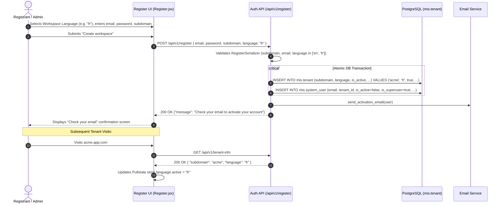

# [MT-025] Onboarding Language Selector Design Specification

**Issue**: [#500](https://github.com/akvo/akvo-mis/issues/500)
**Status**: Draft / Proposed
**Author**: Antigravity
**Date**: 2026-10-01

---

## 1. Overview & 5W1H Analysis

| Vector | Specification |
| :--- | :--- |
| **Who** | Prospective workspace administrators creating a new tenant workspace during self-service onboarding. |
| **What** | Workspace Language Selector during initial tenant registration, persisting the selected primary language code (`en` or `fr`) directly on the `Tenant` record. |
| **Where** | Frontend: `Register.jsx` registration form & `store.language` bootstrap.<br>Backend: `Tenant` model in `api.v1.v1_users.models`, `RegisterSerializer`, `register()` view, `tenant_info` view, and admin serializers. |
| **When** | Phase 1 of multi-tenant onboarding (workspace creation), executed before activation email verification. |
| **Why** | Enables new organizations in multilingual regions (e.g. francophone West Africa or anglophone regions) to have their entire workspace experience immediately default to their preferred language upon tenant creation and subsequent visits. |
| **How** | Add `language` field (`CharField`, default=`'en'`) to `Tenant`, accept and validate in `POST /api/v1/register`, expose in `GET /api/v1/tenant-info`, and provide a clean language dropdown in the registration form. |

### Scope Boundaries
- **In-Scope**:
  - Add `language` column (`CharField(max_length=10, default="en")`) to `Tenant` model with migration.
  - Update `RegisterSerializer` and `register` view to accept and save `language`.
  - Expose `language` in `tenant_info` response (`GET /api/v1/tenant-info`).
  - Expose `language` in platform console `TenantListSerializer` & `TenantSummarySerializer`.
  - Add Language selector input (`<Select>`) in `Register.jsx` (options: English `en`, French `fr`).
  - Unit and integration tests in backend and frontend with >=80% test coverage.
- **Explicitly Out-of-Scope**:
  - Adding new language dictionaries beyond existing supported `en` and `fr`.
  - Refactoring or fixing legacy translation string catalogs.

---

## 2. Architecture & Sequence Flow



---

## 3. Detailed Technical Design

### 3.1 Backend Schema & Models

#### Model: `Tenant` (`backend/api/v1/v1_users/models.py`)
Add `language` field:
```python
class Tenant(models.Model):
    subdomain = models.CharField(max_length=63, unique=True)
    language = models.CharField(max_length=10, default="en")
    is_active = models.BooleanField(default=True)
    deleted_at = models.DateTimeField(default=None, null=True, blank=True)
    features = models.JSONField(default=dict, blank=True)
    created_at = models.DateTimeField(auto_now_add=True)
```

#### Migration
Create migration `0011_tenant_language.py` adding `language` column with default `'en'`.

### 3.2 Backend API Changes

#### Serializer: `RegisterSerializer` (`backend/api/v1/v1_users/serializers.py`)
```python
class RegisterSerializer(serializers.Serializer):
    email = serializers.EmailField()
    password = serializers.CharField(write_only=True)
    subdomain = serializers.RegexField(...)
    language = serializers.ChoiceField(
        choices=["en", "fr"],
        default="en",
        required=False,
    )
```

#### View: `register` (`backend/api/v1/v1_users/views.py`)
```python
tenant = Tenant.objects.create(
    subdomain=validated["subdomain"],
    language=validated.get("language", "en"),
)
```

#### View: `tenant_info` (`backend/api/v1/v1_users/views.py`)
```python
body = {
    "subdomain": tenant.subdomain,
    "language": getattr(tenant, "language", "en") or "en",
}
```

#### Admin Serializers: `TenantListSerializer` & `TenantSummarySerializer` (`backend/api/v1/v1_users/admin_serializers.py`)
Include `"language"` in `Meta.fields` for platform operator visibility.

---

### 3.3 Frontend Design & UI Components

#### Registration Form (`frontend/src/pages/register/Register.jsx`)
Add language selection item into Ant Design form:
```jsx
const LANGUAGE_OPTIONS = [
  { value: "en", label: "English" },
  { value: "fr", label: "Français (French)" },
];

<Form.Item
  name="language"
  label="Workspace language"
  initialValue="en"
  rules={[{ required: true, message: "Select workspace language" }]}
>
  <Select options={LANGUAGE_OPTIONS} placeholder="Select language" />
</Form.Item>
```

#### Client Tenant Bootstrap (`frontend/src/App.js` or `useTenantInfo`)
Ensure `store.update((s) => { s.language.active = res.data.language || "en"; })` when tenant info arrives.

---

## 4. Verification & Testing Strategy

### Backend Automated Tests
1. `tests_register.py`:
   - `test_register_with_default_language`: Verify registration without explicit language defaults `Tenant.language` to `"en"`.
   - `test_register_with_custom_language`: Verify registration with `language="fr"` persists `Tenant.language == "fr"`.
   - `test_register_with_invalid_language`: Verify 400 Bad Request if language is not allowed.
2. `tests_tenant.py`:
   - Verify `Tenant` model string representation and default `language="en"`.
3. `tests_login_host.py` / `tests_tenant_info`:
   - Verify `GET /api/v1/tenant-info` returns `"language": "fr"` for French-configured tenant.
4. `tests_admin_tenants.py`:
   - Verify `language` field is exposed in admin tenant summaries.

### Frontend Automated Tests
1. `Register.test.js`:
   - Renders language selector with English as default.
   - Allows selecting French and sends `language: "fr"` in POST payload.
2. Tenant Info integration tests:
   - Sets Pullstate active language to tenant language on load.

---

## 5. Vibe Coding Breakdown & Estimation

| Task ID | Story / Task Description | Vibe Coding (Dev) | Automated Testing | QA & Review | Total Est. | Actual Time |
| :--- | :--- | :---: | :---: | :---: | :---: | :---: |
| **MT-025.1** | Backend Model & Migration: Add `language` field to `Tenant` model + migration | 15m | 15m | 10m | **40m** | - |
| **MT-025.2** | Registration & Tenant Info APIs: Update `RegisterSerializer`, `register()`, and `tenant_info` | 20m | 25m | 15m | **60m (1.0h)** | - |
| **MT-025.3** | Frontend Registration UI: Add Language Selector to `Register.jsx` and payload dispatch | 20m | 20m | 10m | **50m** | - |
| **MT-025.4** | Frontend Tenant Context Sync: Bootstrap `store.language` from `tenant-info` payload | 15m | 15m | 10m | **40m** | - |
| **MT-025.5** | End-to-End Test Suite & Lint Pass: Run full backend + frontend test suites and linters | 10m | 20m | 15m | **45m** | - |
| **Total** | **End-to-End Implementation** | **80m** | **95m** | **60m** | **235m (~3.9h)** | - |
