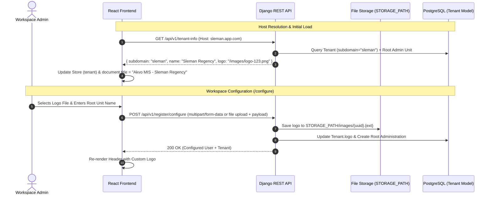

# MT-026: Tenant Logo Customization and Site Title - Feature Specification

> **GitHub Issue**: [#516](https://github.com/akvo/akvo-mis/issues/516)
> **Branch**: `feature/516-tenant-logo-and-site-title`

## Overview

This feature enables multi-tenant branding across Akvo MIS by allowing workspaces to customize their brand identity:

1. **Tenant Logo Upload & Management**: Workspaces can upload a custom logo during initial onboarding (`/configure`) and update or remove it later via Workspace Settings or the Platform Admin Console.
2. **Site Title**: The browser document title is set to `Akvo MIS - {tenant_name}` (where `{tenant_name}` is the title-cased tenant subdomain).
3. **Graceful Fallbacks**: If no custom logo is uploaded, or when browsing on the base platform domain without a tenant in scope, the application gracefully defaults to the standard Akvo MIS logo (`/logo.svg`) and base title (`Akvo MIS`).

---

## Architecture Overview



---

## 1. Backend Implementation

### 1.1 Database Model Updates

**File**: `backend/api/v1/v1_users/models.py`

- Add `logo` field to `Tenant` model:

  ```python
  class Tenant(models.Model):
      subdomain = models.CharField(max_length=63, unique=True)
      is_active = models.BooleanField(default=True)
      deleted_at = models.DateTimeField(default=None, null=True, blank=True)
      features = models.JSONField(default=dict, blank=True)
      language = models.CharField(max_length=10, default="en")
      logo = models.CharField(max_length=255, null=True, blank=True, default=None)
      created_at = models.DateTimeField(auto_now_add=True)
  ```

### 1.2 Database Migration

**File**: `backend/api/v1/v1_users/migrations/00XX_tenant_logo.py`

- Add column `logo` to `tenant` table (`VARCHAR(255)`, `NULL`, default `None`).

### 1.3 Endpoints & Serializers

#### 1. `GET /api/v1/tenant-info`

**File**: `backend/api/v1/v1_users/views.py`

- Update response payload to include tenant name (from root administration) and logo URL:

  ```json
  {
    "subdomain": "sleman",
    "name": "Sleman Regency",
    "language": "en",
    "logo": "/images/sleman-logo-uuid.png",
    "embed_enabled": true
  }
  ```

#### 2. `POST /api/v1/register/configure`

**File**: `backend/api/v1/v1_users/views.py` & `backend/api/v1/v1_users/serializers.py`

- Accept optional `logo` (either as an uploaded file or pre-uploaded image filename/URL).
- Validate file type (PNG, JPG, JPEG) and maximum size (2MB).
- Store file in `STORAGE_PATH/images/` and persist `logo` path in `tenant.logo`.

#### 3. GET / PUT `/api/v1/admin/tenants/{id}` and `TenantSummarySerializer`

**File**: `backend/api/v1/v1_users/admin_views.py` & `backend/api/v1/v1_users/admin_serializers.py`

- Include `logo` in `TenantListSerializer` / `TenantSummarySerializer`.
- Allow updating or removing `logo` via platform admin console.

#### 4. PUT /api/v1/tenant/branding (or /api/v1/tenant/settings)

**File**: `backend/api/v1/v1_users/views.py`

- Dedicated endpoint for workspace superadmins to update or delete their workspace logo.

---

## 2. Frontend Implementation

### 2.1 State Management & Utilities

**Files**:

- `frontend/src/lib/store.js`: Store holds `tenant: { subdomain, name, language, logo, embed_enabled }`.
- `frontend/src/util/tenant.js`: `fetchTenant()` stores `name` and `logo` in Pullstate store and updates `document.title`:
  - When tenant is loaded: `document.title = tenant?.name ? ` + `"Akvo MIS - " + tenant.name : "Akvo MIS"`
  - When on base domain: `document.title = "Akvo MIS"`

### 2.2 Components & UI Touchpoints

> [!NOTE]
> The tenant logo seamlessly replaces the default Akvo MIS logo in the **exact places where the logo currently appears in the application** — no new display locations or UI elements are introduced.

#### 1. Main Navigation Header (`frontend/src/components/layout/Header.jsx`)

- Replaces the existing `config.siteLogo` with `tenant?.logo || config.siteLogo`.
- Maintains the existing header layout, classes (`.small-logo`), and responsiveness.

#### 2. Login & Pre-Auth Screens (`frontend/src/pages/login/Login.jsx`)

- Replaces the default logo (`/logo.svg`) on the workspace login form with `tenant?.logo || "/logo.svg"`.

#### 3. Initial Setup Form (`frontend/src/pages/configure/Configure.jsx`)

- Adds the optional Logo Upload field in the setup form alongside the root unit name so users can provide their logo during initial onboarding.

#### 4. Workspace Settings (`frontend/src/pages/settings/Settings.jsx`)

- Allows workspace administrators to update or remove their uploaded logo.

#### 5. Platform Admin Console (`frontend/src/pages/admin/TenantDetail.jsx`)

- Displays and allows editing of the tenant's logo alongside tenant metadata.

---

## 3. Verification & Testing

### 3.1 Automated Tests

- **Backend**:
  - `tests_tenant_info.py`: Verify `tenant-info` returns `name` and `logo` when present, and handles unset logo gracefully.
  - `tests_register_configure.py`: Verify logo upload, file size/type validation, and persistence during `/configure`.
  - `tests_admin_tenants.py`: Verify admin tenant detail and update endpoints handle logo fields.
- **Frontend**:
  - `Header.test.js`: Verify custom logo rendered when `store.tenant.logo` is populated, falling back to default when null.
  - `Configure.test.js`: Verify logo upload input and payload submission.
  - `Login.test.js`: Verify logo display in workspace context.
  - `tenant.test.js`: Verify `fetchTenant()` sets `document.title` to `Akvo MIS - {tenant_name}`.

### 3.2 Manual Verification Steps

1. Navigate to `/register`, complete step 1.
2. Follow email activation link to `/configure`.
3. Upload a custom logo (PNG/JPG) and submit.
4. Verify the top header displays the custom logo in the existing logo container.
5. Verify the browser tab title reads `Akvo MIS - <RootUnitName>`.
6. Navigate to `/forms` or other pages, verify browser tab title remains `Akvo MIS - <RootUnitName>`.
7. Log out, verify workspace login screen displays custom tenant logo in place of the default logo.
8. Log in as platform admin on `admin.app.com`, verify Tenant Detail displays the logo.

---

## 4. Epic & Vibe Coding Estimation ⏱️

- **Confidence Level**: High
- **Dependencies**: None

| Task ID | Component & Description | Vibe Coding (Dev) | Automated Testing | QA & Review | Total Est. Time | Priority |
| :--- | :--- | :---: | :---: | :---: | :---: | :--- |
| **MT-026.1** | **Backend**: Tenant model migration (`logo` field) & serializer updates (`TenantListSerializer`, `TenantSummarySerializer`) | 20m | 15m | 10m | **45m** | P0 |
| **MT-026.2** | **Backend**: Update `GET /api/v1/tenant-info` & `POST /api/v1/register/configure` to handle logo upload & return `name` + `logo` | 30m | 25m | 15m | **70m** | P0 |
| **MT-026.3** | **Backend**: Workspace branding endpoint (`PUT /api/v1/tenant/branding`) & admin tenant logo management | 25m | 20m | 15m | **60m** | P1 |
| **MT-026.4** | **Frontend**: Site title synchronization (`document.title = "Akvo MIS - {tenant_name}"`) via `fetchTenant` | 15m | 15m | 10m | **40m** | P0 |
| **MT-026.5** | **Frontend**: Logo upload UI on `/configure` onboarding step with preview and validation | 30m | 25m | 15m | **70m** | P0 |
| **MT-026.6** | **Frontend**: Dynamic logo rendering in `Header.jsx`, `Login.jsx`, and Admin `TenantDetail.jsx` | 25m | 20m | 10m | **55m** | P0 |
| **MT-026.7** | **Frontend**: Workspace Settings branding management card (upload/replace/remove logo) | 30m | 20m | 15m | **65m** | P1 |
| **TOTAL** | **Full Feature Delivery** | **2h 55m** | **2h 20m** | **1h 20m** | **6h 35m** | - |
