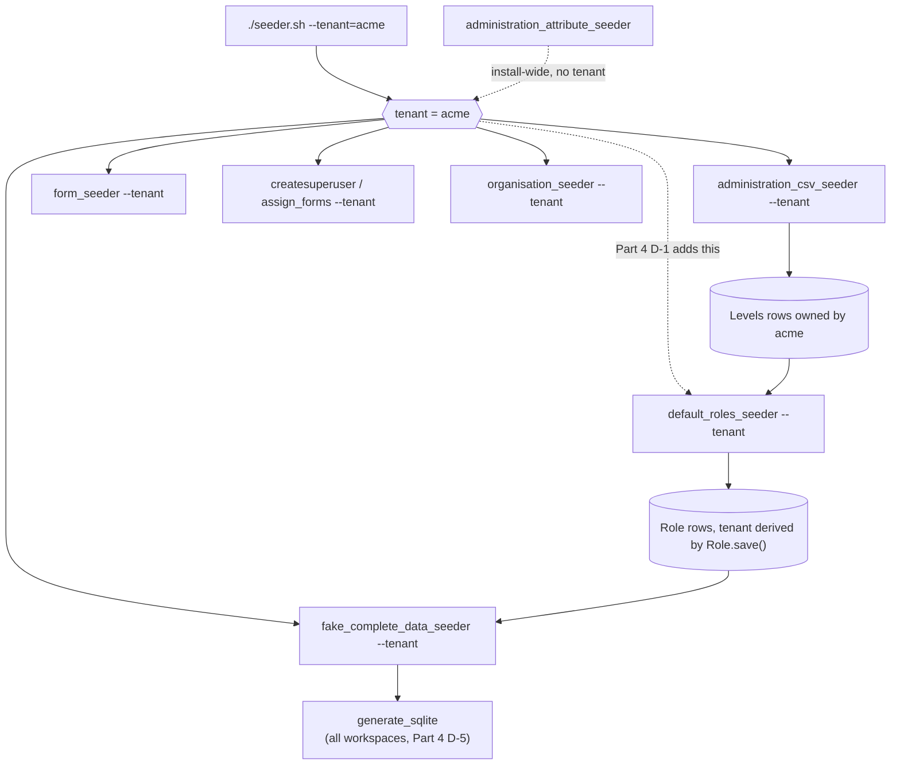

# Feature Design Document

## Feature: Tenant-aware seeders — marked fake data, CSV hierarchies, and pins that match

**Task IDs**: SEED-001, SEED-002, SEED-003 (one PR, one plan); SEED-004 (follow-up)
**Author**: Iwan Firmawan
**Date**: 2026-08-31 → 2026-09-02; Part 4 added 2026-09-16
**Branch**: `feature/89-tenant-aware-seeders` → `main`; Part 4 on `feature/89-fix-seeder-complete-seeder`
**Status**: Parts 1–3 implemented, pending review. Part 4 implemented, pending review.

---

## 0. How to read this

Three pieces of work that shipped together, because each is unusable without the
one before it, plus a fourth that finishes the job. They are kept as separate
parts rather than flattened, so the decision IDs already cited in the code
comments still resolve.

| Part | Task | What it does | Command |
|---|---|---|---|
| **1** | SEED-001 | Marks generated data `DUMMY-` and gives it a teardown | `fake_complete_data_seeder --clean` |
| **2** | SEED-002 | Imports a real hierarchy — levels *and* units — from a CSV | `administration_csv_seeder` |
| **3** | SEED-003 | Makes a generated pin land inside the unit it belongs to | (no new command) |
| **4** | SEED-004 | Stops roles leaking across workspaces, ships a form to seed, and gets the run to its last line | `default_roles_seeder --tenant` |

**Part 4 is a follow-up, not a fourth simultaneous piece.** Parts 1–3 made the
seeder tenant-aware command by command; Part 4 is what a full
`./seeder.sh --tenant=<sub>` run on a multi-workspace database showed was still
missing once the other three were in place. Its four defects are independent of
each other and share only that they are all on the same run.

**Decision IDs are per-part.** Part 1's `D-6` and Part 2's `D-6` are different
decisions; cross-part references are always written out ("Part 3 D-9").

Three decisions were **reversed while building**, because Part 3 undid choices
Parts 1 and 2 made before the boundary pipeline existed. They are not deleted —
they explain why the middle commits of this branch look the way they do — but
they are moved to [the appendix](#appendix-decisions-reversed-during-this-work)
so the decision log reads as the shipped design.

---

## 1. Context & Problem Statement

```
Three things were true before this work and are not now.

1. Seeded data was indistinguishable from real submissions, and could not
   be removed.
   - fake_complete_data_seeder wrote FormData that is byte-identical in
     shape to a real submission. Nothing on the row, in the UI or in the
     API said "this was generated".
   - The only teardown was dropping the database, which also destroyed the
     hierarchy, forms, roles and users that a full ./seeder.sh run built.
   - So the seeder was usable only on a throwaway local DB -- not on the
     shared dev/staging workspace where dashboard debugging happens.

2. No seeder could target a workspace, and getting a hierarchy into one
   took six manual steps.
   - administration_seeder read ./source/{COUNTRY_NAME}.topojson with
     COUNTRY_NAME hardcoded to "fiji", and wrote tenant=None.
   - The Excel bulk upload is tenant-aware and correct, but CANNOT create
     Levels: map_column_model resolves each header to an EXISTING level by
     primary key, so the levels must exist before the file can be parsed.
   - Which left: register, configure, create each level through a
     browser-only UI, download the template, fill it in, upload, wait.

3. A generated datapoint's pin had no relationship to the unit it named.
   - The seeder picked an administration and a coordinate one line apart:

         adm = targets[index]
         geo_value = random_point_in(bbox)

   - A datapoint reading "Aceh - Acehbarat - Meureubo" (Sumatra, ~4N 96E)
     carried geo [-8.76, 118.94] -- Sumbawa, about 2,000 km away.
   - Most pins were not even on land. India's country box against its real
     polygons: 34% land, 66% sea.
```

**Goal**: `./seeder.sh --tenant acme` builds a workspace a developer can open a
dashboard against, and undo.

This unblocks item 1 of the visualization debugging gap analysis
([MT-002](MT-002-tenant-scoping-database.md)): a `--tenant` flag is only usable
if there is also a way to undo a run that landed in the wrong workspace.

### Part 4 — what a real run still did wrong

Parts 1–3 were verified against a database with one or two workspaces. Run the
same script against a database with five — the state any developer reaches after
testing free-tier registration ([MT-001](MT-001-free-tier-registration.md)) a few
times — and four independent defects surface on a single pass.

```
Four things are true of ./seeder.sh --tenant=<sub> before this part.
Line numbers are where the code sits after the fix, so the citations
still resolve.

1. The roles step ignores the workspace entirely.
   - default_roles_seeder called Levels.objects.all(). `Levels.objects` is
     a plain TenantManager -- models.Manager.from_queryset(TenantQuerySet),
     utils/tenant_scoped_model.py:36 -- and TenantQuerySet adds `for_user`,
     not an implicit filter. On the CLI there is no request and no user, so
     .all() means every workspace.
   - seeder.sh compounded it by not forwarding --tenant at all (the call is
     now at seeder.sh:135), so the flag would not have helped even if the
     command had accepted one.
   - Observed on a five-workspace database: one run created roles for
     National/Division/Province/Tikina (Fiji), Country/County/Ward/Subcounty
     (Kenya), Region/District/Province (India), Atoll/Locality (Maldives)
     and National/Province/District/Village -- four workspaces' worth of
     roles from a run that named one.
   - The rows are not corrupt: Role.save() stamps `tenant` from
     `administration_level.tenant`, so each role lands in the right
     workspace. They are simply roles nobody asked to create, in workspaces
     the operator did not name, and the operator cannot tell from the
     output which is which -- the log printed "Roles created for National
     level." four times.

2. An empty example.prod.json breaks form seeding in all three modes.
   - backend/source/forms/example.prod.json was 0 bytes and untracked.
   - form_seeder globs every *.json in the folder (form_seeder.py:186) and
     json.load()s each one (form_seeder.py:198) with no guard ->
     JSONDecodeError with no filename in the message.
   - Neither filter excluded it: `--test` keeps files whose name contains
     "example", and the PROD gate kept files whose name contains "prod".
     It matched both.

3. A PROD install seeds no forms at all.
   - Under PROD, form_seeder narrowed to files matching "prod".
     example.prod.json was the only candidate in the folder and it was
     empty, so a production deployment that answered "y" to "Seed Form?"
     got either a crash or nothing. (D-7 later removed the PROD gate
     entirely -- the narrowing is now unconditional.)
   - The four real forms were in source/forms/unused/, moved there by
     [#55] and not seeded. D-4 deletes that folder.

4. generate_sqlite dies on the last line of the run.
   - custom_generator.py guarded with `int(x) if x == x else 0` -- an idiom
     that catches NaN and nothing else. The two branches are now at
     custom_generator.py:73 and :77.
   - A workspace whose only Administration is its root has an all-None
     parent column. pandas types that as `object` and leaves None in place
     (verified, pandas 2.1.1: [{'parent': None}] -> object [None], whereas
     a mixed column -> float64 [nan, 1.0]). None == None is True, so the
     guard passed the None through to int() and the command raised
     TypeError: int() argument must be a string, a bytes-like object or a
     number, not 'NoneType'.
   - generate_sqlite iterates Tenant.objects.all(), so one such workspace
     aborted the step for every workspace after it -- and it is seeder.sh's
     penultimate line, so the run ended on a traceback whatever else
     succeeded. D-8 scopes that walk to the named workspace.
```

**Goal**: `./seeder.sh --tenant=acme` touches `acme` and nothing else, seeds a
form on a fresh production install, and exits 0.

---

## 2. Requirements

### User Acceptance Criteria

**Part 1 — marking and teardown**

- [x] Every seeded datapoint name starts with `DUMMY-` in Manage Data, the
      dashboard viewer, map popups and Excel/DOCX exports.
- [x] Every seeded account is recognisable by email (`dummy-…@test.com`), and
      every seeded mobile assignment name starts with `DUMMY-`.
- [x] `fake_complete_data_seeder --clean` removes all generated data, reports
      what it deleted, and is a no-op the second time.
- [x] `--clean` wipes and **exits**. It never reseeds, and needs only
      `--tenant`.
- [x] `--help` states plainly that the default run produces approved data only
      — no drafts, no pending rows, no approver accounts (Part 1 D-8).
- [x] `--approved true --draft true` fails with a clear message instead of
      silently seeding drafts (Part 1 D-8).

**Part 2 — hierarchy import**

- [x] `--source <file.csv> --tenant <subdomain>` creates every level and every
      unit in one command.
- [x] The CSV is authored in a spreadsheet — no template download, no level ids
      to look up.
- [x] Re-running the same file against the same workspace changes nothing.
- [x] Rows are validated before any write; a bad file names the offending row
      and column, and writes nothing.
- [x] Works for any country. No `COUNTRY_NAME`, no bundled data file.

**Part 3 — pins**

- [x] Generated pins cluster over the units their datapoints name.
- [x] The operator passes no coordinates on the command line.
- [x] The bounding box is visible in the administration UI as an ordinary
      attribute, editable and deletable like any other.
- [x] A workspace whose hierarchy carries no boxes gets an error naming the
      command to run, rather than submissions with no coordinates.

**Part 4 — correctness of a full run**

- [x] `./seeder.sh --tenant=acme` creates roles for `acme`'s levels only. No
      other workspace's `Role` count changes.
- [x] Each role line names the workspace, so four workspaces' "National" levels
      can be told apart in the output.
- [x] A fresh install seeds one working registration form that needs no
      entity types. `PROD` no longer changes which files are seeded at all
      (D-7), so "including a PROD one" is now the same run.
- [ ] `./seeder.sh --tenant=acme` reaches its last line on a database holding
      several workspaces, at least one of which has only a root administration.
      **Not verified end to end** — every step is covered by tests, but the
      live run that reproduces the original screenshots has not been done.
- [x] An unparseable file in `source/forms/` names itself in the error, rather
      than raising a bare `JSONDecodeError`.
- [x] `source/forms/unused/` is gone. Its four forms were read for Part 4 D-4
      and are not kept as dead weight afterwards.
- [x] `./seeder.sh --tenant=acme` rebuilds `acme`'s master-data SQLite files
      and no other workspace's (D-8).
- [x] A monitoring form seeds beside the registration form, and every dashboard
      widget except KPI `repeat_agg` has a question to bind to (D-9).
- [x] `./seeder.sh --tenant=acme` seeds administration attributes into `acme`
      and `--clean` removes only `acme`'s, leaving other workspaces' imported
      `Bounding Box` rows intact (D-10).

### Technical Acceptance Criteria

- [x] **No schema migration anywhere in this PR.** No new column on `form_data`
      or any other hot table (Part 1 D-1); no new model or field for the boxes
      (Part 3 D-2).
- [x] `--clean` performs a **hard** delete — no `deleted_at`-stamped residue
      (Part 1 D-4).
- [x] `--clean` never deletes a `FormData` row the seeder did not create,
      **even when it reused a pre-existing real user as the submitter**
      (Part 1 D-2 — the sharp edge of this work).
- [x] The `DUMMY-` prefix survives `add_fake_answers`, which overwrites
      `data.name` (Part 1 D-3), and reaches the storage blob (R-2).
- [x] Answers, AnswerHistory and monitoring children go by database cascade,
      not a second queryset. Soft-deleted and draft rows from earlier runs are
      collected too.
- [x] `--clean` runs in any environment. It is scoped to `DUMMY-` rows in one
      workspace, so there is no `DEBUG` gate (R-4).
- [x] `--tenant` is required outside `--test`, and every lookup is scoped by it
      — forms, levels, administrations, roles, organisations, created users.
- [x] Unit lookup is disambiguated by parent, not by name alone (Part 2 D-1).
- [x] `Administration.path` is populated on every created row — it is what
      every visualization administration filter reads.
- [x] `seed_administrations()` is called **unchanged** — no new parameters, no
      fork (Part 2 R-1).
- [x] CSVs are read from `STORAGE_PATH`; no country data file enters the repo
      (Part 2 R-3).
- [x] **Every generated datapoint has a `geo`.** The seeder refuses to run
      rather than writing a row without one (Part 3 D-9).
- [x] `FormData.geo` stays `null=True` in the schema — real submissions may
      legitimately lack a coordinate. The guarantee is a property of the
      seeder, not of the column.
- [x] The notebook writes each unit's box from its largest-area ring, so no
      stored box spans the antimeridian (Part 3 D-7).
- [x] Nothing new reaches the mobile SQLite (Part 3 D-2).
- [x] `--test` is untouched: 35 existing callers keep working.
- [x] `flake8` clean.

**Part 4**

- [x] `default_roles_seeder` takes `--tenant`, resolved through the shared
      `utils.tenant_command.resolve_tenant` — not a fourth private copy of the
      lookup (Part 4 D-1).
- [x] Omitting `--tenant` means the tenant-less space, `tenant=None`, which is
      what `resolve_tenant(required=False)` already documents. It does **not**
      mean "every workspace" (Part 4 D-2).
- [x] The `call_command("default_roles_seeder", "--test", 1)` sites that seed
      levels through `administration_seeder --test` keep passing **unmodified**.
      That command writes `tenant=None`, so the new filter selects exactly what
      the old `.all()` did in a test database. **One** call site is the
      exception — it builds tenant-owned levels and needed `--tenant` (I-11).
- [x] The roles step stays idempotent: re-running creates no duplicate
      `RoleAccess` or `RoleFeatureAccess` rows.
- [x] The seeded registration form uses **no `entity` cascade**. `seeder.sh` has
      no entities step, so an entity question would reference an entity type
      that does not exist on a fresh database (Part 4 D-4).
- [x] The form file is named `<form_id>.prod.json`, because `job.sh:8-10` and
      `form_seeder -f` both parse the id out of the filename (Part 4 D-3).
- [x] Form, group and question ids all sit above the autoincrement sequences,
      which count up from 1 and are never reset (Part 4 D-3).
- [x] No schema migration, in Part 4 either.
- [x] `flake8` clean.

---

## 3. Data Model Changes

### New Models

None, in any of the four parts.

### Modified Models

| Model | Change | Reason |
|---|---|---|
| — | — | No model changes. Fake data is marked in existing `name`/`email` text columns; bounding boxes reuse `AdministrationAttribute`. |
| — | — | Part 4 changes no model either. `Role.tenant` already exists and `Role.save()` already derives it from the level — the defect is which levels are iterated, not how a role is stored. |

### Migration Strategy

```python
# No migration in this PR. Two alternatives were considered and rejected:
#
# 1. FormData.is_fake = BooleanField(default=False)
#    `form_data` is the largest table in the schema and is on the mobile sync
#    path. A column with a default rewrites the table on Postgres < 11 and
#    adds a field to every sync payload -- a permanent production cost for a
#    development-only concern. See Part 1 D-1.
#
# 2. Administration.geo = JSONField(null=True)
#    Needs a migration AND an explicit exclusion from mobile sync, because
#    generate_sqlite exports every model field automatically. An
#    AdministrationAttribute needs neither. See Part 3 D-2.
```

### New constants

```python
# backend/api/v1/v1_data/constants.py

# Marker for seeder-generated rows. Anything carrying this prefix is fair
# game for `fake_complete_data_seeder --clean`, so never apply it to a row a
# human might have authored.
DUMMY_PREFIX = "DUMMY-"

# Seeded accounts are additionally namespaced by email so the clean can find
# them without depending on first/last name, which Faker randomises.
DUMMY_EMAIL_PREFIX = "dummy-"
DUMMY_EMAIL_DOMAIN = "@test.com"
```

```python
# backend/api/v1/v1_profile/constants.py

# The administration attribute carrying a unit's bounding box, as
# "minLng,minLat,maxLng,maxLat". User-visible: it appears in the attribute
# manager alongside real attributes like "Population".
BBOX_ATTRIBUTE_NAME = "Bounding Box"

# CSV column prefix naming an administration attribute. The Excel path keys
# columns as "<id>|<Name>" and looks them up by primary key, which a notebook
# cannot do -- it has no database ids -- so the CSV path is name-keyed.
ATTRIBUTE_COLUMN_PREFIX = "attr_"
```

### New module

`backend/api/v1/v1_profile/bbox.py` — one parser and one set of error messages,
shared by the CSV importer (which validates and writes boxes) and the data
seeder (which reads them). `parse_bbox`, `random_point_in`, `format_bbox`,
`get_bbox_attribute`, `resolve_bbox`, and a `BboxError(ValueError)` so the
module stays importable outside a management command.

---

## 4. CLI Contract

This work adds no HTTP endpoints. The equivalent contract is the management
commands' argument surface.

### `administration_csv_seeder` (Part 2)

| Flag | Type | Default | Purpose |
|---|---|---|---|
| `-s, --source` | str | **required** | CSV path, resolved against `STORAGE_PATH` first (R-3) |
| `-t, --tenant` | str | **required** | Target workspace subdomain. `default` exists on any migrated database (R-4) |
| `--rename-root` | flag | `False` | Allow the level-0 column to rename the workspace's existing root (Part 2 D-4) |
| `--dry-run` | flag | `False` | Validate and report; write nothing |

#### CSV format

One pair of columns per tier, plus optional attribute columns:

```
{level}_{LevelName}    the unit's name at that tier; {LevelName} also names
                       the Levels row
{level}_Code           optional code for that tier
attr_{Attribute Name}  optional; an administration attribute on the row's
                       deepest unit
```

```csv
0_National,0_Code,1_Province,1_Code,2_District,2_Code,attr_Bounding Box
Indonesia,ID,Central Java,CJ,Semarang,CJ-SMG,"110.2,-7.1,110.5,-6.9"
Indonesia,ID,Central Java,CJ,Solo,CJ-SLO,"110.7,-7.7,110.9,-7.5"
Indonesia,ID,Yogyakarta,YK,Sleman,YK-SLM,"110.3,-7.8,110.5,-7.6"
```

Produces:

```
Levels:  (0, "National")  (1, "Province")  (2, "District")

Administration:
  Indonesia [ID]                          level 0, parent None
  ├── Central Java [CJ]                   level 1
  │   ├── Semarang [CJ-SMG]               level 2   + Bounding Box
  │   └── Solo [CJ-SLO]                   level 2   + Bounding Box
  └── Yogyakarta [YK]                     level 1
      └── Sleman [YK-SLM]                 level 2   + Bounding Box
```

Rules:

- Rows are **denormalised** — every row is a complete root-to-leaf path, so
  parent tiers repeat. Repeats are get-or-created, not duplicated.
- Levels must be contiguous from 0. A file with `0_`, `1_`, `3_` is rejected.
- `{level}_Code` is optional; omit the column or leave cells blank.
- A blank name cell truncates that row's path at that tier — the row still
  creates its ancestors. This matches the bulk upload's `break`.
- Column order does not matter; the level number in the header decides the tier.
- `attr_` columns are optional. A CSV without them imports byte-identically to
  before this change.

#### Invocations

```bash
# Validate the whole file and roll back
./dc.sh exec backend python manage.py administration_csv_seeder \
    --source=administrations/indonesia.csv --tenant=acme --dry-run

# Import
./dc.sh exec backend python manage.py administration_csv_seeder \
    --source=administrations/indonesia.csv --tenant=acme
```

```
-- Validating ./storage/administrations/indonesia.csv
   Levels detected: 0 National, 1 Province, 2 District
   Attributes detected: Bounding Box
   Rows: 514
-- Levels:          3 created, 0 reused
-- Administrations: 548 created
-- Attribute values: 514 written
-- Done
```

Validation failure writes nothing:

```
CommandError: Row 12, column '2_District': blank name with a non-blank
              descendant '3_Village'. A path cannot skip a tier.
```

### `fake_complete_data_seeder` (Parts 1 and 3)

| Flag | Type | Default | Purpose |
|---|---|---|---|
| `-t, --tenant` | str | **required** (unless `--test`) | Workspace subdomain to seed into |
| `-r, --repeat` | int | `5` | Registrations per form |
| `-m, --monitoring` | int | `2` | Monitoring submissions per registration |
| `--approved` | bool | `True` | `true`: every row approved — no pending rows, no approver accounts. `false`: half of each form's rows left pending, approver tree built |
| `--draft` | bool | `False` | Also create drafts. Contradicts `--approved=true` |
| `--clean` | bool | `False` | Hard-delete every `DUMMY-` row this workspace owns, then **exit** |
| `--test` | bool | `False` | Bundled `TEST_GEO_DATA` fixture; exempt from `--tenant` |

`--clean` follows the boolean-parsing convention already used by `--approved`
and `--draft` on this command, **not** the `nargs="?" const=1 type=int` style
used by `administration_seeder --clean` (Part 1 D-7).

**There is no `--bbox`.** Coordinates come from the hierarchy — see Part 3.

```bash
# Seed 20 registrations with 3 monitoring rounds each
./dc.sh exec backend python manage.py fake_complete_data_seeder \
    --tenant=acme --repeat=20 --monitoring=3 --approved=true

# Wipe. Terminal on purpose (Part 1 D-9b).
./dc.sh exec backend python manage.py fake_complete_data_seeder \
    --tenant=acme --clean

# Reset = the two above, chained.
./dc.sh exec backend python manage.py fake_complete_data_seeder \
    --tenant=acme --clean && \
./dc.sh exec backend python manage.py fake_complete_data_seeder \
    --tenant=acme --repeat=20
```

```
-- Cleaning fake data
   FormData             340
   MobileAssignment      12
   SystemUser            12
   Administration         0
   Levels                 0
-- Fake data cleared
```

### `default_roles_seeder` (Part 4)

| Flag | Type | Default | Purpose |
|---|---|---|---|
| `--tenant` | str | `None` → the tenant-less space | Workspace whose levels get roles |
| `-t, --test` | bool | `False` | Re-create access rows on roles that already exist; used by ~140 test call sites |

No short flag for `--tenant`: `-t` is already `--test` on this command, exactly
as on `form_seeder`. Two flags one keystroke apart is how a subdomain ends up in
`--test`.

```bash
# Roles for one workspace's levels
./dc.sh exec backend python manage.py default_roles_seeder --tenant=acme

# The tenant-less space -- single-host installs and the test suite
./dc.sh exec backend python manage.py default_roles_seeder
```

Output names the workspace, because level names are not unique across
workspaces and four unqualified `National` lines are what made the original
defect invisible:

```
Roles created for National level (acme).
Roles created for Province level (acme).
Roles created for District level (acme).
```

An unknown subdomain fails before any write, with the message
`resolve_tenant` already produces for the other seeders:

```
CommandError: No workspace with subdomain 'acmee'. Known: acme, default, …
```

A workspace with no geography fails before any write:

```
CommandError: None of this workspace's administrations carry a 'Bounding Box'
              attribute, so generated datapoints would have no map coordinates.
              Re-import the hierarchy from a CSV carrying an 'attr_Bounding Box'
              column -- the notebook in scripts/administration_csv_generator/
              writes one by default:
                python manage.py administration_csv_seeder
                  --source=administrations/<file>.csv --tenant=<subdomain>
```

---

## 5. Decision Log

### Part 1 — Marked fake data (SEED-001)

#### D-1: How is a row marked as fake?

**Options**: (1) name prefix in existing text columns; (2) a `FormData.is_fake`
boolean; (3) a dedicated `Tenant(subdomain="dummy")`.

**Decision**: option 1, name prefix.

**Rationale**: the user-facing half of the requirement — "tell real from fake at
a glance" — is only satisfied by option 1. A boolean is invisible in Manage
Data, in a dashboard widget, in a map popup and in an Excel export unless every
one of those surfaces is taught to render it, which is a far larger change than
the seeder. Option 2 also costs a migration on the largest table in the schema,
on the mobile sync path, permanently, for a development-only concern.

Option 3 is the right long-term answer once tenancy is everywhere, because
`Tenant` is a real referential boundary rather than a string convention. It was
rejected because at the time no seeder was tenant-aware, so a "dummy tenant"
would have had no hierarchy, no forms and no roles to hang off. D-6 addresses
the underlying gap.

**Impact**: no migration. The delete key becomes a string prefix, which carries
the false-positive risk D-2 addresses.

#### D-2: The delete key is the name prefix, never the creating user

*The most important decision here, and the one most worth reviewing.*

**Options**: (1) delete by `FormData.name__startswith="DUMMY-"`; (2) delete the
seeded users and let `created_by` cascade.

Option 2 looks strictly better at first — `FormData.created_by` is
`on_delete=CASCADE`, so deleting the users removes every row they authored
including monitoring children and drafts, with no dependence on what
`add_fake_answers` did to the name.

**Decision**: option 1.

**Rationale**: **the seeder does not always create its submitter.** It reuses
any existing user who matches:

```python
user = SystemUser.objects.filter(
    **filter_submitter,
    user_user_role__administration=parent_adm,
    tenant=tenant,
).exclude(password__exact="").order_by("?").first()
if not user:
    # ... only here is a new user created
```

On any workspace that already has real submitters, `filter_submitter` matches
them, `.order_by("?").first()` picks one, and the fake datapoints are attributed
to **a real person's account**. Option 2 would then hard-delete that account and
cascade away every genuine submission they ever made — unrecoverable data loss,
triggered by a flag whose name promises cleanup.

Option 1 cannot do this. Its worst case is that a real datapoint whose name
genuinely begins with `DUMMY-` is removed, which requires a human to have typed
that prefix into a meta field.

**Impact**: `created_by` cannot be the delete key, so the prefix *must* be
applied to every `FormData` row including drafts. User cleanup becomes a
separate, guarded step (D-5).

#### D-3: The prefix is stamped after `add_fake_answers`, before `save_to_file`

**Decision**: not at `FormData.objects.create()`.

**Rationale**: a prefix set at `create()` is silently discarded.
`add_fake_answers` rebuilds `data.name` from the form's `meta` questions and
overwrites whatever the caller set:

```python
# v1_data/functions.py
if len(meta_name) > 0:
    name = " - ".join(meta_name)
    if len(name.strip()):
        data.name = name          # clobbers the prefix set at create()
data.save()
```

Any form with at least one `meta: true` question — which is every registration
form in `source/forms/` — loses the prefix. The datapoint then looks real *and*
is invisible to `--clean`: the worst of both, failing silently.

There is a second constraint on the other side. `save_to_file` is a
`@property`, so the bare attribute access **does execute**, and it serialises
`self.name` into a JSON blob uploaded to storage that mobile debugging reads
(R-2). So the stamp lands strictly between the two.

```python
def mark_as_dummy(form_data):
    """Stamp the fake-data prefix, idempotently.

    MUST be called after add_fake_answers(), which rebuilds `name` from the
    form's meta questions and would otherwise discard the prefix, and before
    `save_to_file`, which serialises the name into the storage blob that
    mobile debugging reads.
    """
    if form_data.name.startswith(DUMMY_PREFIX):
        return form_data
    form_data.name = f"{DUMMY_PREFIX}{form_data.name}"
    form_data.save(update_fields=["name"])
    return form_data
```

#### D-4: Hard delete, not soft

**Decision**: `.hard_delete()`.

**Rationale**: `FormData` extends `SoftDeletes`, whose queryset `delete()` is an
`UPDATE`, not a `DELETE`. A bare `.delete()` would leave every row in
`form_data`, still reachable through `objects_with_deleted`, still counted by
anything using a raw manager, and still occupying the `submission_key` unique
index. `--clean` would appear to work while the table grew monotonically.

Hard delete goes through Django's collector, which issues plain `DELETE`s and
does **not** call each child model's overridden `delete()` — which is what we
want: monitoring children (`FormData.parent`), `Answers` and `AnswerHistory`
are removed for real, one statement each.

#### D-5: What `--clean` deletes, in order

Five tiers. Tiers 4 and 5 exist because of the throwaway hierarchy, which Part 3
retired — see the appendix — but the ordering logic remains, since a workspace
seeded by an earlier commit on this branch may still hold `DUMMY-` units.

```python
# Tier 1 -- datapoints. objects_with_deleted, not objects: the default manager
# hides soft-deleted rows, so fake rows soft-deleted by an earlier run would
# survive every subsequent --clean. Drafts are in the same queryset.
# Monitoring children cascade via FormData.parent; Answers and AnswerHistory
# via their `data` FK.
fake_data = FormData.objects_with_deleted.filter(
    name__startswith=DUMMY_PREFIX, form__tenant=tenant
)
fake_data.hard_delete()

# Tier 2 -- mobile assignments. Deleting them before their users keeps the
# reported counts honest and covers assignments attached to a REUSED real
# user, which tier 3 must not touch.
MobileAssignment.objects.filter(
    name__startswith=DUMMY_PREFIX, user__tenant=tenant
).delete()

# Tier 3 -- seeded accounts, guarded. Only accounts the seeder minted, and
# only those with no surviving FormData. This guard is what makes D-2's
# "reused a real user" scenario safe.
SystemUser.objects_with_deleted.filter(
    email__startswith=DUMMY_EMAIL_PREFIX,
    email__endswith=DUMMY_EMAIL_DOMAIN,
    tenant=tenant,
).exclude(form_data_created__isnull=False).hard_delete()

refresh_materialized_data()   # see I-3

# Tiers 4-5 -- generated administrations deepest-first, then their levels.
```

**Explicitly not deleted**:

| Not deleted | Reason |
|---|---|
| `Administration` / `Levels` without `DUMMY-` | Real hierarchy, whether CSV-imported or bulk-uploaded |
| **`Bounding Box` attributes and values** | They belong to the hierarchy, not to the generated data, and carry no prefix (Part 3) |
| `Forms`, `Questions`, `QuestionOptions` | Owned by `form_seeder`; deleting them would break real data |
| `Organisation` | The seeder only reads it, never creates one |
| `Role`, `UserRole`, `UserForms` | Cascade from `SystemUser` in tier 3 |
| `Entity` / `EntityData` | Created by `set_answer_data` via `get_or_create` and shared with real submissions — accepted, R-3 |
| Storage blobs (`datapoints/{uuid}.json`) | Deliberately kept: `DUMMY-` data is also used for mobile debugging, which reads these — R-2 |

#### D-6: `--tenant` is required, and `--clean` is tenant-scoped

**Decision**: required outside `--test`, and every lookup the command makes is
scoped by it.

**Rationale**: `FormData`'s tenant is derived, not stored
(`TENANT_PATH = "form__tenant"`). An unscoped clean on a multi-workspace install
would delete another workspace's fake data — a smaller version of the same class
of accident D-2 guards against.

A fresh database always has a usable value: migration
`v1_users/0004_backfill_default_tenant.py` runs
`Tenant.objects.get_or_create(subdomain="default")`.

**Impact**: every previously unscoped lookup in the command becomes
tenant-scoped, which also closes finding F-1 from the visualization gap
analysis — `Forms.objects.filter(parent__isnull=True)`,
`Organisation.objects.order_by("?")`, `Role.objects.filter(...)` and both
`create_user` calls, which minted users with `tenant=None`.

`resolve_tenant` was extracted to `backend/utils/tenant_command.py` so the
other commands share one lookup and one error message.

#### D-7: `--clean` is a bool, not `nargs="?" type=int`

**Decision**: match this command's own `--approved` / `--draft` parser, not
`administration_seeder --clean`.

**Rationale**: local consistency beats global consistency here. Every other flag
on *this* command already uses the boolean-string parser, and mixing the two
styles inside one `add_arguments` is how `--clean 0` ends up meaning "yes,
clean" to a tired reader.

#### D-8: No new "approved only" flag — it is already the default

**Requested**: a flag that seeds only approved data.

**Finding**: that behaviour already existed and was the default. With
`--approved true --draft false`, `data_is_draft` and `data_is_pending` are both
unconditionally `False`, the approver tree is built only `if not is_approved`,
and both flags land as literal `False` on the row. Nothing reintroduces approval
state: the command creates no `PendingDataApproval` / `DataApproval` rows, and
`v1_data` registers no `pre_save`/`post_save` signal on `FormData`.

**Decision**: add no flag. Make two corrections instead.

1. **Fix the misleading help text.** `--approved` does not mean "create approved
   data"; it means "skip the approval workflow entirely". The old string invited
   the reader to look for a flag that `--approved` already *is*.
2. **Guard the contradictory combination.** `--approved true --draft true`
   silently produced drafts despite the first flag reading like a promise:

   ```python
   if is_approved and is_draft:
       raise CommandError(
           "--draft true contradicts --approved true: approved data has no "
           "drafts. Pass --approved false to seed a mixed workflow."
       )
   ```

**Rationale**: a second flag whose effect is identical to the existing default
is a flag that will drift out of sync with it. The reported problem is
discoverability, and discoverability is fixed by `--help`.

**Impact**: no behaviour change for anyone relying on the defaults.
`--approved true --draft true` changes from "silently seeds drafts" to a hard
error, which is the only backward-incompatible bit and is a bug fix. Five call
sites relied on the old behaviour and were updated to pass `--approved=false`,
which is what they meant (I-4).

#### D-9b: `--clean` is terminal

**Superseded**: the original contract had `--clean` wipe *then seed*, with
`--clean-only` for wipe-and-stop.

**Found in use**: an operator ran `--tenant qa1 --clean=true --bbox "..."`, saw
five datapoints in Manage Data afterwards, and reported "clean is not working".
The clean had worked perfectly — it deleted five rows and the same command then
created five more. The output gave no hint a second phase had started:

```
-- Fake data cleared
Created 5 data entries for form EPS Water Quality Testing
```

**Decision**: one flag. `--clean` hard-deletes and returns.

**Rationale**: `--clean` reads as an imperative. A command that quietly
repopulates afterwards is indistinguishable, from the outside, from a clean that
silently failed — and the person who has to tell them apart is the one who least
expects to. Two flags one word apart, where the *shorter* one does *more*, is
the trap that produced the report.

**Impact**: `--clean` requires only `--tenant`. It accepts both `--clean` and
`--clean=true`. The `refresh_materialized_data()` that ran only on the
`--clean-only` path now runs on every clean, which it always should have: the
view must not serve deleted datapoints.

---

### Part 2 — CSV hierarchy import (SEED-002)

#### D-1: A new command, not `administration_seeder --source`

**Decision**: a new `administration_csv_seeder`.

**Rationale**: `--source` would route through `seed_administration()`, which
carries three defects this feature must not inherit:

```python
# administration_seeder.py -- the upsert key is `name` ALONE.
Administration.objects.update_or_create(
    name=name,                 # no parent, no level, no tenant
    defaults={"level": level, "code": code, "parent": parent},
)
```

- Two units with the same name under different parents collapse into one row,
  and the last row processed wins the `parent`. Any real country file repeats
  names across regions.
- No `tenant` anywhere, so with `unique_root_administration_per_tenant` the
  command can only ever build one hierarchy per install.
- `path` goes stale: `set_administration_path` returns early on
  `if instance.path: return`, so a row reparented by the first defect keeps its
  old ancestry — and `path` is what every visualization administration filter
  reads. The failure is a silently wrong aggregate, not an error.

Fixing all three means rewriting the function, after which the only thing left
in `administration_seeder` is the topojson reader and the `--test` fixture. The
two commands also mean genuinely different things — "seed the bundled country
data" versus "import this file into this workspace" — with different tenancy and
different idempotency.

#### D-2: Header grammar — level-prefix, not level-suffix or id-pipe

Three conventions already existed. This picks a fourth, deliberately.

| Where | Format | Example |
|---|---|---|
| `administration_seeder` + topojson | `{Alias}_{level}`, `code_{level}` | `Province_1`, `code_1` |
| Bulk-upload template | `{level.id}\|{level.name}` | `2\|Province` |
| **This command** | `{level}_{Alias}`, `{level}_Code` | `1_Province`, `1_Code` |

**Against the suffix form.** It is parsed by taking the last underscore-delimited
fragment and asking whether it is a digit, so any alias containing an underscore
or ending in a digit is silently misparsed or dropped — `Region_2` at level 1
becomes level 2. The prefix form splits once on the first `_`, unambiguous
regardless of what the alias contains.

**Against the id-pipe form.** It encodes `Levels.id`, so it presupposes the
levels exist — the exact thing this command must not require (D-5). It also
cannot be authored by hand.

The prefix form carries both the **depth** and the **name** of each tier, which
is precisely what is needed to create the `Levels` rows.

**Known collision**: a level literally named `Code` produces a `1_Code` name
column indistinguishable from the level-1 code column. Rejected with a named
error — though by a different branch than predicted, see I-2.

#### D-3: Reuse the bulk-upload engine; do not write a third one

**Decision**: unit creation goes through
`api/v1/v1_jobs/administrations_bulk_upload.seed_administrations()`, unchanged.

**Rationale**: it is already correct — parent-disambiguated, tenant-scoped, and
case-insensitive on the name. Its signature is exactly the tuple list this
command builds, so the new command is a header parser plus a loop, not a new
engine. It gives idempotency for free, and because it passes `parent=last_obj`
to `create()`, the `set_administration_path` receiver fires with a parent
present and `path` is populated correctly.

**Consequence the reviewer must know about**: `seed_administrations` applies
`name.title()` on create, so CSV values are title-cased on the way in —
`DKI Jakarta` is stored as `Dki Jakarta`. This is pre-existing behaviour of the
shared helper, identical to what the Excel path produces for the same input, and
it is accepted rather than worked around. One code path, one behaviour, both
callers agreeing.

#### D-4: Level 0 must reconcile with the workspace's existing root

**Problem**: a tenant has exactly one root, enforced by
`unique_root_administration_per_tenant`. `configure_project` already created it,
named by the operator. If the CSV's `0_National` column says `Indonesia` but the
workspace root is `Acme Water`, blindly creating the CSV's value raises
`IntegrityError` at the end of a long import.

**Decision**: error by default, naming both values; rename behind
`--rename-root`.

**Rationale**: a mismatch is far more likely to be the wrong file than a
deliberate rename, and the root's name appears throughout the UI and in every
`full_name` / `administration_column` string. Silently renaming it, or silently
discarding what the file says, both hide a wrong-file mistake until someone
notices the labels changed.

If no root exists at all, the level-0 value creates it.

#### D-5: Levels are created from the headers

The capability that justifies a new command rather than reusing the Excel path.

```python
level, created = Levels.objects.get_or_create(
    tenant=tenant, level=depth, defaults={"name": alias},
)
```

Keyed on `(tenant, level)`, which is the unique constraint. **The name is not
part of the key**: a workspace that already defined level 1 as "Province" keeps
that name even if the file's header spells it "Provinsi", because roles and the
generated upload template already reference it. Deliberately not
`update_or_create`. The divergence is reported:

```
-- Levels: 2 created, 1 reused
   level 1 exists as 'Province'; file says 'Provinsi' (kept 'Province')
```

#### D-7: `administration_seeder` is left alone

**Decision**: no change to it in this work, beyond removing the dead
`seed_administration_prod()` path (§5 of the PR summary).

**Rationale**: 30+ test files call it with `--test`. Touching it couples a risky
refactor to a new feature. The three defects in D-1 are real, but this command
**retires** them rather than needing them fixed: they live entirely inside
`seed_administration()`, whose only callers are `seeder.sh` (replaced by
`administration_csv_seeder`) and the `--test` fixture. The correct follow-up is
deletion, not repair.

Note also that `administration_seeder` writes `tenant=None`, and the
`default`-tenant backfill runs **once, at migration time**. Rows it creates
afterwards are never adopted, so its output is already invisible to any properly
registered workspace.

---

### Part 3 — Pins that match their administration (SEED-003)

#### The measurement this part rests on

Two files, chosen because they fail differently: a large contiguous landmass and
a fragmented archipelago across the antimeridian. Points are drawn uniformly
from each box and ray-cast against the real polygons.

**India** — GADM level-2, 676 districts, 5,408 points:

| Points drawn from | Inside the **right** unit | On land **anywhere** |
|---|---|---|
| One country-wide box (before) | <1% | 34% |
| All of the unit's rings | 51% | 95% |
| The unit's **largest-area ring** | **51%** | **96%** |

**Fiji** — GADM level-2, 15 provinces, 3,000 points:

| Points drawn from | Inside the **right** unit | On land **anywhere** |
|---|---|---|
| One country-wide box (before) | ~1.4% | 21% |
| All of the unit's rings | 23% | 42% |
| The unit's **largest-area ring** | **44%** | **70%** |

Three things follow, and they set the shape of this part:

1. **A per-unit box is enough.** On a contiguous landmass 96% of pins land on
   land, and the ~49% that miss their own district land in an adjoining one —
   tens of kilometres out, not two thousand.
2. **An archipelago is worse, and still transformed.** Fiji's 70%/44% is well
   below India's, because a box around an island is mostly ocean. It is still 3×
   the land rate and **31× the right-unit rate** of what an operator typed
   before.
3. **Ring selection is not cosmetic — on Fiji it is the difference between
   working and not.** Two provinces straddle 180°, so a box over all their rings
   spans the whole globe and scores **0%**. Picking one ring fixes them.

#### D-1: Store a bounding box per unit, not a point

**Decision**: each unit carries `minLng,minLat,maxLng,maxLat`; the seeder draws
a fresh random point inside it per datapoint.

**Rationale**: a stored point makes every datapoint in a unit share one
coordinate, collapsing a seeded workspace to one pin per unit — the opposite of
what a map widget is being debugged with. The box preserves scatter and,
measured, still puts 96% of pins on land. Scatter is the feature; exact
containment is not.

**Alternatives**: storing the polygon itself (correct, and megabytes per
workspace in a JSON column, for disposable data); a point plus a jitter radius
(a radius has no relationship to the shape and walks straight out of a narrow
unit).

#### D-2: Reuse `AdministrationAttribute`; add no column

**Decision**: no `Administration.geo` field. The box is an administration
attribute.

**Rationale**: three things fall out at once, and the third was going to bite.

1. No migration, no model change, no new table.
2. The import path already exists — `seed_attributes` does the upsert, in the
   right value envelope, today.
3. **Attributes are not on the mobile sync path.** `generate_sqlite` builds its
   administration columns from `[f.name for f in model._meta.fields]`
   (`utils/custom_generator.py:36`), so a new *model field* ships to every device
   automatically, with no code change and no review — roughly 160 KB on a
   7,230-row hierarchy, for a column the app never reads. Attributes live in a
   separate table that export never touches, so the problem does not arise
   instead of being defended against.

This reverses Part 2 D-6 — see the appendix.

#### D-3: One attribute (`Bounding Box`), not four

**Decision**: a single CSV column `attr_Bounding Box` holding the four numbers
comma-separated.

**Rationale**: the four-column form (`attr_north`, `attr_south`, …) is the more
obvious shape, and costs measurably more for nothing gained:

| | one column | four columns |
|---|---|---|
| `AdministrationAttribute` rows | 1 | 4 |
| `AdministrationAttributeValue` rows (7,230-unit hierarchy) | 7,230 | 28,920 |
| Entries in the operator's attribute UI | 1 | 4 |
| Parser in the seeder | `parse_bbox`, unchanged | new, plus 4 lookups |
| Partially-edited state possible | no | yes (3 of 4 edited) |

The four numbers are one value — meaningless individually, invalid unless
consistent — so they belong in one cell. Splitting them makes the invalid state
representable.

The stored string is byte-for-byte what `parse_bbox` already accepts, so the
seeder reuses that function and its validation rather than growing a second
parser.

#### D-4: CSV convention `attr_<Attribute Name>`

**Decision**: any column matching `^attr_(.*)$` names an administration
attribute, created on demand as `Type.VALUE`.

**Rationale**: `parse_headers` already ignored every column that is not `^\d+_`
and said so in a comment — "*Columns that do not match `^\d+_` are ignored
rather than rejected, so a file carrying attribute columns still imports its
hierarchy (R-2)*". The hook was anticipated; this fills it. Every CSV written
before this change imports byte-identically.

This deliberately diverges from the Excel path, which keys attribute columns as
`<id>|<Name>` and looks them up by primary key. A notebook cannot know a database
id, so name-keyed is the only workable form here.

`.*` rather than `.+` in the pattern: a bare `attr_` column is a typo and is
reported, not silently ignored the way an unrecognised column is.

#### D-5: Remove `--bbox`; resolve the box from the data

**Decision**: delete the `--bbox` argument and its required-check. `parse_bbox`
and `random_point_in` survive, moved into `api/v1/v1_profile/bbox.py` so the
importer and the seeder share one parser, repointed at the attribute value.

**Rationale**: with a per-unit box in the data, a command-line box is a worse
answer to a question already answered better. Leaving both means an operator can
pass one that contradicts the hierarchy, and the seeder would have to pick.

```
target unit's own box
  -> nearest ancestor's box (Administration.ancestors is root-first,
     so walk it reversed)
  -> refuse to run (D-9)
```

There is no `None` rung. The ancestor rung is not decoration:
`seed_administrations` attaches boxes to the row's deepest unit (D-6), so a
workspace that later gains a tier — a 3-tier CSV import followed by an Excel
upload adding a 4th — has target units one level below the boxes. The walk
covers that without a second import.

#### D-6: Attach boxes to the row's deepest unit only

**Decision**: one `attr_Bounding Box` column; the seeder attaches it to the unit
`seed_administrations` returns — the leaf — exactly as the Excel path does.

**Rationale**: a datapoint only ever attaches to a leaf, and parents are covered
by the ancestor walk in D-5, so per-tier columns (`0_attr_…`, `1_attr_…`) would
widen the CSV to buy something already covered. GADM features *are* leaves, so
leaf boxes are the ones the file actually contains.

#### D-7: One ring per unit, chosen by area — this is what fixes the antimeridian

**Decision**: the notebook computes each feature's box from its **largest-area
ring** (shoelace area), not from all its rings.

**Rationale**: measured on Fiji, and the numbers are not marginal. Every Fijian
province is a multipolygon — Lau has 96 rings, Cakaudrove 46 — and two straddle
180°:

```
unit           rings   all-rings lng span   largest-ring lng span
Lau               96              359.86°                   0.13°
Cakaudrove        46              360.00°                   1.04°
Naitasiri          1                0.56°                   0.56°
```

A min/max over coordinates cannot tell "spans the globe" from "has points near
both ±180", so those two provinces get a worldwide box and score **0%**
containment. Choosing one ring collapses them to real boxes, because **a ring
never crosses the antimeridian** — it is a closed loop on one side. Overall:
23% → 44% own-unit, 42% → 70% on land.

**Area, not vertex count.** `max(rings, key=len)` scores 43%/69% against
`max(rings, key=area)`'s 44%/70% — a point of difference, so the choice is made
on correctness instead: vertex count measures how finely a coastline was
digitised, not how big the island is, so a heavily surveyed islet can outvote
the mainland. The shoelace is four lines and removes that failure mode. It made
no measurable difference on India (51%/96% either way), which is the point — it
costs nothing where it is not needed.

**No antimeridian guard is needed anywhere else.** Per-unit boxes, each from a
single ring, cannot span the antimeridian by construction, and D-9 removed the
workspace-union fallback that would otherwise have needed one.

**Alternatives**: all-rings boxes (0% on two Fijian provinces); one box per ring
(breaks the single-value design in D-3 for a case the largest ring covers);
splitting a crossing box in two at 180° (correct, and the seeder would then have
to pick between them per datapoint).

#### D-8: The accuracy ceiling is stated, not hidden

**Decision**: accept ~50% exact containment; have the notebook **report the
measured rate for the file being imported** rather than quoting India's number
at every operator.

**Rationale**: a box is not a polygon and never will be. The notebook already
owns the ray-casting machinery, so Step 8 prints the rate for the file in hand
and lists the units that miss most often. An operator seeing a low number for a
coastal or fjorded country then knows why the map looks the way it does, instead
of filing it as a bug.

**Alternatives**: rejection-sampling in the seeder (needs the polygon, the thing
deliberately not stored); saying nothing (this number will otherwise be
rediscovered as a bug report).

#### D-9: Every generated datapoint has a coordinate, or the seeder refuses

**Decision**: `geo` is never `None` on a row this seeder writes. A preflight
check resolves a box for the target administrations before the transaction
opens; if none resolves, the command exits with an error naming the fix.

**Rationale**: the mechanism was already half in place.
`pick_target_administrations` returns **only** the deepest level present in the
workspace, so a datapoint never attaches to a country or a province — it is
always a leaf. D-6 puts boxes on exactly those leaves. So in the documented flow
a resolvable box is not a likely outcome, it is a guaranteed one, and a `None`
rung would only cover paths that never reach it.

| Path | Targets | Box |
|---|---|---|
| Notebook CSV import (the documented flow) | leaves | always |
| `--test` | `TEST_GEO_DATA` | fixture coordinates, unaffected |
| Bundled sample fixture (`administration_seeder`) | none | writes `tenant=None` rows, so it never fed the tenant-scoped seeder in the first place |
| Hierarchy imported with no boxes | leaves | **error, naming the fix** |

The third row looks like a regression and is not. `seeder.sh` already describes
the bundled sample as "not workspace-scoped — enough to click around, not enough
to demo", and `pick_target_administrations` filters on `tenant=`, so a
`--tenant` run never saw those units. What changes is only the message.

**What this deletes**: the workspace-union fallback, its `> 180°` antimeridian
guard, the "warn once and continue" branch, and `ensure_hierarchy` with its
`--depth` and `--fanout` arguments. The stricter design is the smaller one.

**Alternatives**: warn and write `geo=None` (the failure is silent, and the
resulting map is exactly the bug this part exists to fix); a
`--allow-missing-geo` escape flag (a flag to permit broken output is worth less
than an error message saying what to run instead).

---

### Part 4 — Seeder correctness and the initial form (SEED-004)

Where `--tenant` reaches, after Part 4. The roles step is the one arrow that
does not exist today:



#### D-1: The workspace is an argument on the command, not a filter in the script

**Options**: (1) `--tenant` on `default_roles_seeder`, resolved by the shared
helper; (2) leave the command alone and have `seeder.sh` pre-compute the level
ids and pass them in; (3) give the command its own `Tenant.objects.filter(...)`
lookup.

**Decision**: option 1.

**Rationale**: option 3 is what the codebase already rejected —
`utils/tenant_command.py` exists precisely because "three seeders had grown
their own copy, which is how the same typo produced three different error
messages". Option 2 leaves the command wrong for anyone invoking it directly,
which is the larger population: `seeder.sh` is one caller and there are 130
test call sites plus whatever an operator types. The fix belongs where every
caller routes through it.

**Impact**: two lines in the command (`resolve_tenant`, then `filter` instead of
`all`), one argument definition, and `--tenant="${tenant}"` on
[seeder.sh:135](../../backend/seeder.sh). `resolve_tenant` brings the unknown-
subdomain rejection for free, which the command has never had.

#### D-2: Omitting `--tenant` means the tenant-less space, not every workspace

**Options**: (1) omitted → `tenant=None`, matching `resolve_tenant`'s documented
contract; (2) omitted → today's behaviour, every level in every workspace, with
`--tenant` as an opt-in narrowing; (3) `--tenant` required.

**Decision**: option 1.

**Rationale**: option 3 is correct in the abstract and costs 130 test file
edits for no behaviour change in any of them — the tests seed `tenant=None`
levels and would all pass `--tenant=""`. Option 2 keeps a default that has now
demonstrably surprised its operator, and keeps it in the one place a seeder's
default matters: a shared database. Option 1 is the only one where the flag's
absence means the same thing here as it does on `form_seeder`,
`organisation_seeder` and `fake_user_seeder`, all of which already treat
omission as the tenant-less space.

The reason it is safe is worth stating explicitly, because it is the whole
argument for not touching the tests: every test that seeds levels does so
through `administration_seeder --test`, and that command "wrote tenant=None"
(Part 2 D-7). So in a test database `Levels.objects.filter(tenant=None)` and
`Levels.objects.all()` select the same rows. The change is a no-op there and a
fix in production.

**Impact**: **this reverses the §7 table row**, which read *"`default_roles_seeder`
| unchanged; takes no `--tenant` (it derives each role's workspace from its
level)"*. That sentence was true about the *rows* and wrong about the *loop*:
deriving each role's tenant from its level makes every role valid, but says
nothing about which levels should have been visited. The row is corrected in §7.

#### D-3: The form file is named by its id, not by a description

**Options**: (1) `source/forms/<form_id>.prod.json`; (2) keep
`example.prod.json` and teach the tooling to read the id from the JSON body;
(3) keep `example.prod.json` and accept the tooling breaking on it.

**Decision**: option 1 — `source/forms/1789516800000.prod.json`.

**Rationale**: two separate consumers already parse the id out of the filename,
and neither is a seeder:

```bash
# backend/job.sh:8-10 -- the Excel export cron
for file in "$dir"/*.prod.json; do
    filename=$(basename "$file")
    form_id="${filename%.prod.json}"
    ./manage.py generate_excel_data "$form_id" …
```

`example.prod.json` yields `form_id=example`, which is not a form id. The same
convention is what `form_seeder -f <id>` reads (`form_seeder.py:179`). Option 2
changes two tools to accommodate one file; option 1 changes the file.

**Why an epoch-millisecond id** rather than `1` or `101`. The reason is the
autoincrement sequence, not aesthetics:

- **The form builder mints its own id, and it is a timestamp.**
  `akvo-react-form-editor/src/lib/store.js:16` is
  `const generateId = () => new Date().getTime()`, `defaultForm()` uses it,
  `FormBuilderCreate.jsx` posts `editorOutput` verbatim and `save_form` honours
  `data.get("id")`. So a seeded id shares an id space with wall-clock
  milliseconds and must not land on one.
- **1789516800000 is a fixed instant in the past** — 2026-09-16 00:00:00.000
  UTC. `getTime()` only moves forward, so no form created from now on can be
  given that id; the collision window closed at that millisecond. A
  *pre-existing* form holding it would need to have been created in that exact
  millisecond, and `form_seeder` refuses with `form id ... already belongs to`
  rather than overwriting.
- `Forms.id` is a `BigAutoField`, so `form_id_seq` also matters for a form
  created without an explicit id: the sequence counts up from 1.
- `resetsequence` exists in `v1_profile/management/commands/` and has **zero
  callers**. Nothing realigns the sequence after a seed.
- So a seeded form holding a low id is an id the sequence *will* reach. The
  collision is not hypothetical: `example-1.json` through `example-5.json`
  already occupy 1–5 in a dev database, and the first few forms created
  through the builder land on top of them.
- At 1.79 × 10¹² the sequence will not arrive within the life of the install,
  and the value is comfortably inside both `BigAutoField` (9.22 × 10¹⁸) and
  JavaScript's safe integer range (9.01 × 10¹⁵), which matters because the id
  crosses into the mobile SQLite and the web client.

Large timestamp ids are the **designed-for** case rather than an edge case.
`functions.py` carries `_sync_import_pk_sequences()`, whose docstring is
explicit: *"Without this, auto-created rows with auto-increment IDs collide
with existing large editor-generated timestamp IDs already in the DB."* Those
"editor-generated timestamp IDs" are exactly what `generateId()` above
produces — the mechanism is named in the code.

Group and question ids follow from the same argument and are derived from the
form id (`…001`–`…003` for groups, `…011`–`…033` for questions).
`question_group_id_seq` and `question_id_seq` count up from 1 too, and
`example-1.json` already parks questions at 101–115.

**Impact**: `backend/source/forms/example.prod.json` is deleted (it was
untracked and empty, so nothing is lost) and
`backend/source/forms/1789516800000.prod.json` is added. `job.sh` and
`form_seeder -f 1789516800000` work unchanged.

#### D-4: The seeded form is sector-neutral and carries no `entity` question

**Options**: (1) promote one of the four `source/forms/unused/*.prod.json` files;
(2) consolidate the four into one water-sector registration form; (3) write a
sector-neutral form from the questions the four have in common.

**Decision**: option 3.

**Rationale**: options 1 and 2 are both blocked by the same dependency. All four
archived forms open with an entity cascade:

```json
{ "type": "cascade", "name": "rws_name", "meta": true,
  "extra": { "type": "entity" } }
```

An `entity` question resolves its options against an `Entity` type that must
exist before the form is usable — and Part 1 **dropped the entities step from
`seeder.sh`** (§7). So a fresh install seeding any of those files gets a form
whose first required question has no options. Reviving the entities step to ship
a default form would be a much larger change than writing a form that does not
need it.

They are also all water-sector (Water Treatment Plant, Rural Water Supply, EPS
Inspection, EPS Water Quality Testing). This file is what every new deployment
sees first, whatever it monitors.

**What the four files contribute** is their common spine, which is the same in
all of them: an administration cascade as the first meta question, a name, a
date, a geolocation, contact details, a photo, a status option, free-text
remarks. That is the form:

| Group | Question | Type | Flags |
|---|---|---|---|
| Primary Information | `administration` | `cascade`, `extra.type: administration` | meta, required |
| | `name` | `input` | meta, required |
| | `registration_date` | `date` | required |
| | `geolocation` | `geo` | meta |
| Contact Details | `contact_name` | `input` | — |
| | `phone` | `number` | — |
| Condition | `status` | `option` (Functional / Partially functional / Non-functional) | required |
| | `photo` | `photo` | — |
| | `remarks` | `text` | — |

```jsonc
{
  "id": 1789516800000,
  "form": "Registration",
  "version": 1,
  "type": 1,                    // FormTypes.registration
  "description": "Generic registration form …",
  "defaultLanguage": "en",
  "languages": ["en"],
  "question_groups": [ /* as tabled above */ ]
}
```

No `parent`, so `normalize_form_definition` sorts it as a parent form and no
monitoring form is implied. The legacy `form` / `question_groups` / `questions`
key style is accepted (`v1_forms/functions.py:853`), but the FB-007 canonical
style is preferred for a file being written new.

**Impact**: `backend/source/forms/unused/` is **deleted**. An earlier revision
of this decision kept the four files as reference material; they are reference
material for writing this form once, and afterwards they are four water-sector
forms in a folder named `unused` that no code path reads — `grep` finds
references only in documentation. They remain in git history at
`[#55] Move all old forms to unused folder` if a deployment ever wants one back.

Their ids (`1`, `100`, `1000`, `1710731783596`) are freed by the deletion, which
does not change D-3: low ids are unsafe because of the sequence, not because
those files held them.

#### D-5: `x == x` is a NaN check; the column can hold `None`

**Options**: (1) fix the lambda in `generate_sqlite`; (2) coerce the column with
`fillna(0)` before the `apply`; (3) guard at the call site in the
`generate_sqlite` management command.

**Decision**: option 1, and in **both** branches that share the idiom.

**Rationale**: option 3 patches the path the traceback named and leaves
`update_sqlite` and every other caller of `generate_sqlite` broken. Option 2
does not work: `fillna` on an `object` column holding `None` is exactly the case
pandas handles inconsistently, and it adds a line rather than fixing one. The
guard is wrong, not missing:

```python
# utils/custom_generator.py -- before the fix (now lines 71-78)
if "parent" in field_names:
    data["parent"] = data["parent"].apply(lambda x: int(x) if x == x else 0)
elif "administration" in field_names:
    data["parent"] = data["administration"].apply(lambda x: int(x) if x == x else 0)
```

`x == x` is false for `NaN` and true for everything else including `None`.

Only the **`parent`** branch can actually reach the bug: `Administration.parent`
is `null=True`, and a root-only workspace makes that column all-`None`. The
`administration` branch is fixed for symmetry, not because it is reachable --
`EntityData.administration` is a non-nullable FK, so its column never holds a
`None`. Correcting an earlier draft of this decision, which claimed both columns
were nullable: they are not, and the second branch has no regression test for
that reason.

**Why the column goes `object`**: `pd.DataFrame(list_of_dicts)` infers per
column. A column of `[None, 1]` becomes `float64` with `NaN` — which the old
guard handles. A column of `[None]` alone stays `object` with a real `None` —
which it does not. Verified on the pinned pandas 2.1.1. So the bug only appears
for a workspace whose *every* administration has a null parent, i.e. one that
registered but never imported a hierarchy. That is the normal state of a
workspace created by free-tier registration, which is why it took a
five-workspace database to surface.

**Impact**: one expression, twice. No change to the emitted SQLite: the `parent`
column is still an integer with `0` for roots, so no device sees anything new.

#### D-6: A bad file in `source/forms/` names itself

**Options**: (1) delete the empty file and stop there; (2) guard the
`json.load` so any unparseable file reports its own path; (3) validate the whole
folder up front with a dedicated check command.

**Decision**: option 2 (option 1 happens anyway, via D-3).

**Rationale**: deleting `example.prod.json` fixes today's crash and leaves the
trap armed. `source/forms/` is explicitly an operator drop-box — the seeder's own
comment says "a real deployment drops its own form definitions here and should
not have to encode 'not an example' in the filename" — so the next 0-byte or
half-saved file produces the same bare `JSONDecodeError`, from a `json` frame,
with no indication of which of eleven files it came from. One `try`/`except` at
the single `json.load` covers every file and every caller. Option 3 is a command
nobody will run.

**Impact**: `form_seeder.py` around line 175. Raise `CommandError` naming the
file and the parse error; do not skip silently, because a form the operator put
there and expected to be seeded must not vanish quietly.

#### D-7: The filename decides what gets seeded, not the environment

**Options**: (1) a non-`--test` run selects `*.prod.json`, always; (2) keep
"every `*.json`" and have `seeder.sh` pass `--file <id>`; (3) keep the
`settings.PROD` gate and document that local runs seed the fixtures too.

**Decision**: option 1. `settings.PROD` no longer participates in file
selection, and the import is removed.

**Rationale**: this **reverses a decision made during Parts 1–3**, which read:

> `--test` narrows to the bundled example fixtures. Without it every JSON in
> the folder is seeded: a real deployment drops its own form definitions here
> and should not have to encode "not an example" in the filename. The old
> `else` branch did exactly that, and since the folder holds nothing but
> `example-*` files it made a plain run seed nothing at all and exit 0.

The premise in the last clause is what changed. D-3 ships a real
`<id>.prod.json`, so the prod-only filter now has something to select and no
longer degenerates to "seed nothing". Meanwhile the behaviour it was replaced
with turned out to be worse in the case that actually happens — a local
`./seeder.sh --tenant=<sub>` run answering `y` to "Seed Form?" dies with:

```
CommandError: ./source/forms/example-2.json: form id 2 already belongs to
              default. Form ids are global, so a definition can only be seeded
              once per install -- give this file its own id.
```

The dev fixtures hold ids 1–5 and an earlier `--test` run has already claimed
them, so a plain run collides on its second file. Worse, `PROD` made the seeded
set depend on the environment: the same command on the same folder seeded
eleven forms locally and one in production, which is the opposite of what a
seeder should do.

`*.prod.json` was already the convention everywhere else — `job.sh` globs it to
decide which forms get an Excel export, and `--file <id>` builds exactly that
name. This makes the command agree with its neighbours:

| Run | Selects |
|---|---|
| `--test` | `*example*` |
| anything else | `*.prod.json` |
| `--file <id>` | `<id>.prod.json` |

A deployment dropping its own definitions does now have to name them
`.prod.json`. That is a real cost, and it is the right one: the alternative is
an unnamed convention where a scratch file, an editor backup or a half-saved
export is seeded because it happens to end in `.json`.

**Impact**: `mis.settings.PROD` is no longer imported by `form_seeder`. Four
test fixtures were renamed to `.prod.json`, and two assertions that pinned the
old rule were rewritten — `test_plain_run_loads_every_json` (now
`test_plain_run_loads_only_prod_definitions`) and `tests_form_seeder.py`'s
`test_call_command`, whose hardcoded `10` is replaced by a count derived from
the folder, since that assertion has now been rewritten twice for the same
reason.

#### D-8: `generate_sqlite` rebuilds one workspace when told which

**Options**: (1) `--tenant` on the command, rebuilding that workspace only;
(2) leave it walking every workspace and accept the noise; (3) always rebuild
everything but quieten the log.

**Decision**: option 1, with omission still meaning "rebuild everything".

**Rationale**: the command walked `Tenant.objects.all()` unconditionally, so
`./seeder.sh --tenant=acme` rewrote every workspace's master data:

```
./source/administrator.sqlite Generated Successfully        <- tenant-less
./source/default/administrator.sqlite Generated Successfully
./source/demo/administrator.sqlite Generated Successfully
./source/iwan/administrator.sqlite Generated Successfully
./source/qa1/administrator.sqlite Generated Successfully
./source/acme/administrator.sqlite Generated Successfully   <- the only one
./source/mbg/administrator.sqlite Generated Successfully       that changed
./source/indonesia/administrator.sqlite Generated Successfully
     ... x4 models
```

Thirty-two files to express a change to four. The output is not merely noisy:
it is how Part 4 D-5's crash stayed hidden, because the failing workspace was
one of eight and the traceback arrived after a wall of successes.

Unlike the roles seeder, rewriting another workspace's file is **not** a
correctness bug — the content is derived from that workspace's own rows, so
the rewrite is byte-identical. The cost is time, log noise, and 32 chances for
an unrelated workspace's data to abort a run that never meant to touch it.

**Why omission still means "everything"**, which is *not* what it means on
`default_roles_seeder` (D-2): `run-prod.sh:7` calls this command bare at
container boot, and it wants every workspace's files to exist. The asymmetry is
in what the two commands do — `default_roles_seeder` **creates rows**, and "in
every workspace" is never the right default for that; `generate_sqlite`
**rewrites derived files** idempotently, so "all of them" is a legitimate
maintenance operation and the only sensible boot behaviour.

| Invocation | Rebuilds |
|---|---|
| `--tenant=acme` | `MASTER_DATA/acme/` only |
| omitted | the tenant-less root files **and** every workspace |
| `--tenant=typo` | nothing; `CommandError` before any write |

**Impact**: `generate_sqlite.py` gains `--tenant` and collapses its two loops
into one over `[None] + Tenant.objects.all()` or `[tenant]`. `seeder.sh`'s
final line passes `--tenant`. `run-prod.sh` is unchanged and keeps the
rebuild-everything behaviour. `generate_config` beside it takes no workspace at
all — it writes one install-wide `config.min.js`.

#### D-9: A monitoring form ships beside the registration form

**Options**: (1) registration form only; (2) registration + a monitoring child
chosen to make a dashboard buildable from seeded data; (3) registration +
monitoring + a seeded example dashboard.

**Decision**: option 2 — `source/forms/1789516900000.monitoring.prod.json`,
`parent_id` 1789516800000.

**Rationale**: a registration form alone cannot demonstrate the dashboard
builder. Almost every widget needs a *monitoring* question — the line chart
needs a date to put on its axis, KPI and scatter need numbers, bar/pie/stacking
and the map's category mode need option sets — and a registration form is a
site inventory, not a time series. Seeding one form therefore produces an
install where the Dashboards section can be opened but not populated.

Option 3 was rejected as scope: a dashboard is a workspace's own editorial
choice, and seeding one would mean choosing widget colours and a layout on
behalf of every deployment.

**The question types are chosen from the inspector's allowlist, not invented.**
`v1_visualization.constants.SUPPORTED_QUESTION_TYPES` is
`{number, option, multiple_option, date}` — the sources serializer filters on it
(`dashboard_builder_serializers.serialize_source_form`), so a `geo`, `input`,
`text` or `signature` question never appears in a widget's question picker. A
form of mostly free text builds an empty dashboard.

| Widget | What it binds to |
|---|---|
| KPI (number / percentage) | `people_served` |
| Bar, grouped by options | `functional_status` |
| Bar, stacked | `functional_status` × `service_level`; × `issues_reported` for the `multiple_option` path |
| Line, grouped by month / date | `visit_date` — `date_question_id` is required and this is the only `date` |
| Pie / doughnut | `service_level` |
| Scatter | `people_served` × `days_operational` — the serializer rejects a non-`number` on either axis |
| Map, `category` mode | `functional_status`; the geometry comes from the parent's `geolocation` |
| Map, `quantity` mode | `people_served` |
| Table + criteria | `option_equals` on either option set, `threshold_gt` / `threshold_lt` on the numbers, `overdue` on `visit_date` |
| Section title | no question |

`functional_status` reuses the **registration form's exact option values**
(`functional` / `partially_functional` / `non_functional`) so a cross-form
stacked bar (VIZ-015.a) lines the two forms up instead of producing two
disjoint series. A test pins the two option lists together.

**One widget option is not demonstrable: KPI `repeat_agg`.** average / sum /
max / min / last aggregate a question's *indexed* answers, which only a
repeatable question group produces. An earlier revision of this form carried a
repeatable "Meter Readings" group with a number in it for exactly that reason;
it was removed in review, in favour of a `signature` / `signed_by` sign-off
pair, on the grounds that a repeatable group is a poor thing to hand a
deployment as its starting point. The gap is deliberate and
`test_repeat_aggregations_need_a_repeatable_group_to_demonstrate` asserts it,
so re-adding a repeatable group flips that test and prompts whoever does it to
widen this table.

**Filename**: the id-in-the-filename rule of D-3 applies, and this file bends
it — `1789516900000.monitoring.prod.json` carries an infix, so
`job.sh`'s `form_id="${filename%.prod.json}"` yields
`1789516900000.monitoring` and `form_seeder --file 1789516900000` raises
`FileNotFoundError`. A plain seeding run is unaffected, because the selector is
`endswith(".prod.json")`. Renaming it to `1789516900000.prod.json` would remove
both limitations.

**Impact**: two forms seed where one did, parent first — the seeder sorts on
`parent_hint`, so ordering within the folder does not matter. The monitoring
form needs no entity types either, so D-4's constraint holds across the pair.

#### D-10: `administration_attribute_seeder` is workspace-scoped too

**Decision**: `--tenant` added, optional, omission meaning the tenant-less
space — the same contract as D-2. Every read and both deletes are scoped.

**This reverses two claims made earlier in this document.** The §7 table said
*"`administration_attribute_seeder` | unchanged"*, and `seeder.sh`'s usage text
said *"Administration attributes ignore this value — they are install-wide."*
Both are wrong: `AdministrationAttribute` declares
`TENANT_PATH = "tenant"` and a `tenant_fk("administration_attributes")`, so an
attribute is a workspace's own definition. `administration_csv_seeder` already
treated it that way — `_ensure_attributes` passes `tenant=` to its
`get_or_create` — so the two seeders disagreed about the same table.

**Three consequences, in ascending severity:**

1. **Invisible attributes.** `AdministrationAttribute.objects.create(...)`
   passed no tenant, so every seeded attribute landed with `tenant=None`. Reads
   go through `for_user`, which filters on the tenant, so no workspace could
   see what the seeder had just written.
2. **Value rows that straddle two workspaces.** `seed_data` read
   `AdministrationAttribute.objects.all()` and
   `MobileAssignment.objects.all()`, so it attached one workspace's attributes
   to another's administrations. The resulting `AdministrationAttributeValue`
   has an `administration` owned by A and an `attribute` owned by B —
   `TENANT_PATH = "administration__tenant"` resolves it to A, so B's attribute
   is silently readable through A. No later filter untangles that.
3. **A cross-workspace delete.** `--clean` ran
   `AdministrationAttributeValue.objects.all().delete()` followed by
   `AdministrationAttribute.objects.all().delete()` — every workspace's
   definitions, including the `Bounding Box` rows
   `administration_csv_seeder` imports and `fake_complete_data_seeder`
   refuses to run without (Part 3 D-9). Cleaning workspace A's example
   attributes took workspace B's map coordinates with it.

**Two defects found in the same function while scoping it:**

- `Levels.objects.order_by("-id").first()` was picking the deepest level by
  **id**, not by `level`. Ids ascend by creation order across the whole
  install, so on a multi-workspace database the highest id belonged to
  whichever workspace was configured last — not to the deepest tier of the one
  being seeded. Now `filter(tenant=tenant).order_by("-level")`, and a workspace
  with no levels returns early instead of raising.
- `create()` rather than `get_or_create()` meant a second run produced a second
  `Population` attribute for the same workspace, both listed in the attribute
  manager. Now keyed on `(name, tenant)` — the key `administration_csv_seeder`
  already uses.

**Impact**: `seeder.sh` passes `--tenant`, and its usage text is corrected. The
one pre-existing test call site (`test_administration_attributes.py`) passes no
`--tenant` and keeps working, because omission means the tenant-less space.

#### D-11: A shipped form seeds into every workspace, as a copy

**The defect**: `./seeder.sh --tenant=qa1` died at the form step on any install
where another workspace had already been seeded:

```
CommandError: ./source/forms/1789516800000.prod.json: form id 1789516800000
              already belongs to indonesia. Form ids are global, so a
              definition can only be seeded once per install -- give this
              file its own id.
```

That error is FB-015's guard, and it was doing its job: `Forms.id` **is** the
primary key, so the row for id 1789516800000 belongs to exactly one workspace,
and the guard stopped the seeder rewriting another workspace's form. But it
also meant the forms D-3 and D-9 ship were seedable into **one** workspace per
install, which is not a seeder.

**Options**: (1) copy with fresh ids per workspace; (2) derive a deterministic
per-tenant id (`file_id + tenant.id * stride`); (3) give `Forms` a surrogate
primary key plus a `form_id` business column under
`unique_together = ("form_id", "tenant")`.

**Decision**: option 1.

**Rationale**: option 3 is the correct long-term model — a shipped definition
would keep one identity in every workspace, and re-seeding would update copies
through the ordinary id-keyed path. It is also a schema change to the
most-referenced table in the system. Measured: 9 FK/M2M relations across six
apps (those are fine — they point at the primary key), but **12+ URL routes**
take `(?P<form_id>[0-9]+)` and would each have to declare which id they mean;
the mobile SQLite stores `formId INTEGER NOT NULL` in two tables and joins on
it in `crud-datapoints.js`, including `parentFormId`, with deployed devices
already holding the primary key under that name; and `job.sh`, `config.js`,
the builder's URLs, `--file <id>` and ~150 tests carry literal ids. It needs a
backfill (`form_id = id`) and an API-wide decision, and it is not this PR.

Option 2 invents an id scheme, and the offset pushes ids forward in time:
`tenant.id` of 50 at a stride of 10⁶ is +13.9 hours, straight into the band
where a builder-minted `Date.now()` lives (D-3). A collision would be silent.

Option 1 reuses machinery that already exists — `import_form_definition` has a
`create_copy` mode whose `force_new_id` allocates fresh ids for the form, its
groups, its questions and their options — and it **preserves the property the
error existed to protect**: the other workspace's row is never read or written.

**Option 1 is forward-compatible with option 3.** If `form_id` is added later,
each copy backfills with the file's business id and the `unique_together` then
holds.

**Three mechanics worth knowing:**

1. **A per-run `seeded_ids` map**, file id → the id this workspace actually
   got. The monitoring form's `parent_hint` names the *file's* registration id,
   which in a second workspace belongs to nobody — without the map a copied
   child would attach to the first workspace's parent, or to none.
2. **`create_copy` writes a draft and stamps tenant from its `user`**, and the
   seeder has no user. Both are corrected immediately afterwards
   (`tenant`, `status=published`), exactly as the non-copy path does when it
   pre-creates its row.
3. **Ids come from the sequences**, which `_sync_import_pk_sequences()` has just
   set to each table's `MAX(id)` — so a copy lands just above the highest form
   id on the install. A future shipped file that declared an id a copy had
   already taken would be treated as an update of that copy; keep new seeded
   ids clear of the band copies grow into.

**A re-run does not rewrite a copy** (see the log line `Form Present`). The
copy's questions carry ids the file has never seen, so the id-keyed update path
cannot match them, and name-matching would be a second identity model inside
the import writer. A workspace that already has the form is left exactly as it
is — which is also the right answer for one whose operator has edited it, since
editing the seeded form is the expected workflow. **The cost, stated plainly:
copies do not pick up later changes to the shipped definition.** The workspace
that owns the file ids does.

**Unchanged without `--tenant`.** The whole branch is inside
`if created and tenant is not None`, so a tenant-less run — which is what the
~150 `form_seeder` test call sites do — behaves exactly as before.

### Appendix: decisions reversed during this work

Three decisions were made before the boundary pipeline existed and undone once
it did. They are recorded because they explain the middle commits of this
branch, not because they describe the shipped code.

#### ~~Part 1 D-9: coordinates come from a required `--bbox`~~ → superseded by Part 3 D-5

The original problem was real: the seeder read
`./source/{COUNTRY_NAME}_random_points.csv` with `COUNTRY_NAME` hardcoded to
`"fiji"`, and matched the CSV's `name` column against administration *names*.
That file is not an administration list — it is a **coordinate table keyed by
Fiji province name**, and it only resolved because `administration_seeder`
happened to seed Fiji's topojson under the same names. On any other workspace
`find_administration` returned `None` and the next line raised
`AttributeError: 'NoneType' object has no attribute 'ancestors'`, caught by a
bare `except Exception` and reported as a message that told the operator nothing.

`--bbox` fixed that — one required flag, no default, works for any country. It
was the right answer while the hierarchy carried no geography. Once the notebook
could emit a box per unit, one country-sized rectangle became the *worse*
answer: it puts a pin in the correct unit under 1% of the time.

**Still true from this decision**: the CSV and `find_administration`'s
name-matching are gone from the normal path (retained for `--test` only, see
I-1), and `random_point_in` returns `[lat, lng]` — latitude first, because the
map widgets read `geo[0]` that way. That order is load-bearing and now lives in
one place.

#### ~~Part 1 D-10: an empty hierarchy is auto-generated, prefixed, and cleaned~~ → retired by Part 3 D-9

`configure_project` gives a new workspace one `Levels(level=0)` and one root
`Administration` and nothing else, so seeding datapoints onto it put every
datapoint on one unit: every administration filter returned everything and the
map was a single pin. `ensure_hierarchy` generated a throwaway `DUMMY-` tree
under the root to give the seeder something to attach to.

It is retired because that is precisely the state in which no bounding box
exists anywhere, so it could only ever produce datapoints without coordinates.
The preflight error replaced it, pointing at `administration_csv_seeder`.
Nothing is lost: importing a hierarchy is step 1 of the documented flow, and
`default_roles_seeder` (step 2) already requires it, so the generated hierarchy
was unreachable in the documented flow.

**Still true from this decision**: `Administration` is PROTECTed from five
directions, including from itself, so `--clean` must delete administrations
**after** all datapoints and **deepest level first**. A `.all().delete()` — the
shape `administration_seeder --clean` uses — cannot work, because the
self-referential PROTECT fires on the parents. Tiers 4 and 5 of D-5 keep that
ordering for workspaces seeded by an earlier commit on this branch.

| Referencing field | `on_delete` |
|---|---|
| `FormData.administration` | **PROTECT** |
| `DataBatch.administration` | **PROTECT** |
| `DataApproval.administration` | **PROTECT** |
| `EntityData.administration` | **PROTECT** |
| `Administration.parent` (self-referential) | **PROTECT** |
| `ViewDataOptions.administration` (matview) | **PROTECT** — see I-3 |
| `UserRole.administration` | CASCADE |
| `MobileAssignment.administrations` | M2M join |

#### ~~Part 2 D-6: no geo on administrations~~ → reversed by Part 3 D-2

The reasoning was correct at the time: the dashboard map's endpoint is
`/maps/geolocation/<form_id>` and its serializer is bound to `FormData`, and
`useWidgetData.js` always requests the **registration** form's geolocation
because `geo` is captured once when a site is registered. An `Administration.geo`
column would have been written by the importer and read by nothing.

What changed is that `fake_complete_data_seeder` became a reader. Option 2 of
that decision — *store the point as an `AdministrationAttributeValue`* — is what
shipped, so the conclusion "no migration" survived the reversal intact.

---

## 6. Type/Constant Mappings

### Fake data markers

| Surface | Constant | Literal value |
|---|---|---|
| Datapoint name | `DUMMY_PREFIX` | `"DUMMY-Kramat Jati - …"` |
| Monitoring child name | `DUMMY_PREFIX` | `"DUMMY-2026-03-10 - Mon Mar 10 …"` |
| Draft name | `DUMMY_PREFIX` | `"DUMMY-… - Draft"` |
| Submitter account | `DUMMY_EMAIL_PREFIX` + `DUMMY_EMAIL_DOMAIN` | `"dummy-user.<ns>@test.com"` |
| Approver account | same | `"dummy-approver.<adm><d>@test.com"` |
| Mobile assignment | `DUMMY_PREFIX` | `"DUMMY-<adm>.<username>"` |

### CSV headers

| CSV header | Parsed as | Model field |
|---|---|---|
| `0_National` | depth `0`, alias `National` | `Levels.level=0`, `Levels.name="National"`, `Administration.name` |
| `0_Code` | code column for depth 0 | `Administration.code` |
| `1_Province` | depth `1`, alias `Province` | `Levels.level=1`, `Levels.name="Province"`, `Administration.name` |
| `attr_Bounding Box` | attribute `Bounding Box` | `AdministrationAttributeValue.value` on the row's leaf |
| `attr_Population` | attribute `Population` | same |
| *(anything else)* | ignored | — |

### Bounding boxes

| Constant | Value | Where |
|---|---|---|
| Attribute name | `"Bounding Box"` | `v1_profile/constants.py` |
| Attribute type | `AdministrationAttribute.Type.VALUE` | existing |
| CSV header pattern | `^attr_(.*)$` | `administration_csv_seeder.py` |
| Ring selection | largest shoelace area | notebook, Step 4 |
| Value envelope | `{"value": "<minLng>,<minLat>,<maxLng>,<maxLat>"}` | existing convention |
| Coordinate order in the string | **lng, lat** | matches `parse_bbox` |
| Coordinate order in `FormData.geo` | **lat, lng** | `random_point_in` swaps |

The order flip is load-bearing and handled in exactly one place —
`random_point_in` returns `[lat, lng]` because the map widgets read `geo[0]` as
latitude. Nothing new should reorder either.

### The seeded form (Part 4)

| File / field | Backend constant | Value |
|---|---|---|
| `source/forms/1789516800000.prod.json` | — | filename **is** the form id (`job.sh`, `form_seeder -f`) |
| `"type": 1` | `FormTypes.registration` | `1` |
| *(no `parent` key)* | — | sorts as a parent form in `normalize_form_definition` |
| seeded status | `FormStatus.published` | `2` — the seeder publishes on create |
| `"extra": {"type": "administration"}` | — | the one cascade kind that needs no seeded data |
| ~~`"extra": {"type": "entity"}`~~ | — | **not used** — see Part 4 D-4 |

### `--tenant` semantics across the seeders (Part 4)

| Value passed | Resolves to | Levels the roles seeder visits |
|---|---|---|
| `--tenant=acme` | `Tenant(subdomain="acme")` | `Levels.objects.filter(tenant=acme)` |
| `--tenant=""` or omitted | `None` | `Levels.objects.filter(tenant=None)` — the tenant-less space |
| `--tenant=typo` | `CommandError` | none; fails before any write |
| *(today, any value)* | ignored | `Levels.objects.all()` — every workspace |

---

## 7. Compatibility & Migration

### Backward Compatibility

- [x] Existing API consumers unaffected — no schema or serializer change.
- [x] `seed_administrations()` is called as-is, so its four existing call sites
      and the Excel upload path are untouched.
- [x] CSVs generated before Part 3 import identically — `attr_` columns are
      optional and their absence is the existing code path.
- [x] No repository content added. Country CSVs live in the self-ignoring
      `backend/storage/` directory.
- [ ] Existing data preserved, with one caveat: rows from *previous* seeder runs
      are unprefixed and therefore invisible to `--clean`. They must be removed
      by hand or by dropping the database once (R-1).
- [ ] **`--tenant` is a breaking change** for any non-`--test` invocation.
      Exactly one caller exists in the repo, `seeder.sh`, updated in the same
      work. All 35 test callers pass `--test=true` and are exempt.
- [ ] **`--bbox` is removed**, which is breaking — but the flag is new on this
      same unreleased branch, so no deployed script uses it.

### Mobile App Impact

- [x] SQLite schema unchanged. Administrations reach the device through the
      existing `generate_sqlite` path, and **attribute values are not on it** —
      `generate_sqlite` exports administration *model fields*
      (`utils/custom_generator.py:36`), and attributes live in another table it
      does not read. A regression test pins the exported column list anyway,
      because that line means any future field addition ships silently.
- [ ] Sync content affected, deliberately: a device assigned to a `DUMMY-`
      mobile assignment syncs `DUMMY-`-named datapoints and displays them. That
      is the same "tell fake from real" benefit, on the device.
- [ ] `--clean` hard-deletes rows a device may hold locally; it will not learn
      they are gone until its next full resync. Acceptable for a development
      tool — do not run `--clean` against a workspace with live field devices.
- [ ] Devices already synced hold the old hierarchy until their next
      `generate_sqlite` + resync. `seeder.sh` already runs `generate_sqlite` at
      the end of a seed.

### Seeder/CLI Compatibility

| Command | Change |
|---|---|
| `fake_complete_data_seeder` | `--tenant` required; `--clean` terminal; `--bbox`, `--depth`, `--fanout` removed |
| `administration_csv_seeder` | **new**; accepts `attr_*` columns |
| `administration_seeder` | `seed_administration_prod()` and the topojson path removed; `--test` fixture unchanged |
| `form_seeder` | `--tenant` added, optional — omitting it keeps the pre-workspace behaviour. **Part 4**: an unparseable source file now raises `CommandError` naming the file (D-6); a non-`--test` run selects `*.prod.json` only, and `settings.PROD` no longer affects file selection (D-7) |
| `default_roles_seeder` | ~~unchanged; takes no `--tenant` (it derives each role's workspace from its level)~~ → **reversed by Part 4 D-2.** `--tenant` added, optional; omitting it means the tenant-less space. Deriving a role's tenant from its level was never the question — which levels the loop visits was |
| `generate_sqlite` | **Part 4**: `--tenant` added, optional — omitting it keeps the rebuild-everything behaviour `run-prod.sh` depends on (D-8); the all-`None` parent column no longer raises (D-5) |
| `administration_attribute_seeder` | ~~unchanged~~ → **reversed by Part 4 D-10.** `--tenant` added, optional; all reads and both `--clean` deletes scoped. Attributes were never install-wide — the model carries a tenant FK |
| `createsuperuser` | **overridden** in `v1_users`; `--tenant` added, optional. Requires `api.v1.v1_users` to precede `django.contrib.auth` in `INSTALLED_APPS` |
| `assign_forms` | `--tenant` added to disambiguate the account; the form list is scoped to that account's own workspace |
| `organisation_seeder` | `--tenant` added, optional; keyed on `(name, workspace)` when one is named, because the fixture's primary keys can only belong to one workspace |
| `fake_organisation_seeder` | `--tenant` added, optional; tenant participates in the `update_or_create` lookup |
| `fake_user_seeder` | `--tenant` added, optional; stamps the user and scopes its Levels/Administration/Role/Forms/Organisation lookups |
| `seeder.sh` | `--tenant` is now a required argument, not a prompt; `seeder.prod.sh` merged in and deleted; entities step dropped; bounding-box prompt removed; the `DEBUG` gate on the fake-data step removed with the `--clean` gate it mirrored (R-4) |

**Addendum (follow-up to the original delivery).** The five rows above were
not in the first pass, and the gap was not cosmetic: `createsuperuser` has no
`--tenant` of its own, so `seeder.sh --tenant=<sub>` produced a `tenant=NULL`
superadmin. `TenantAwareBackend.authenticate` filters on `tenant=`, so that
account could not sign in at its workspace host, and login on the base domain
is refused outright — with `BASE_DOMAIN` set it could sign in nowhere. Two
sibling defects surfaced with it: `assign_forms` resolved the account by email
alone (not unique across workspaces) and handed out every workspace's forms,
and `fake_user_seeder`'s organisation lookup compared a related row's primary
key rather than its `type`, so seeded users came out org-less once the
attribute sequence had moved past `OrganisationTypes.member`.

**Part 4 compatibility.**

- [ ] `seeder.sh`'s argument surface is unchanged — `--tenant` is already
      required and is simply forwarded to one more command.
- [ ] `default_roles_seeder` with no arguments keeps working and keeps meaning
      something sensible; 129 of the 130 test call sites are not edited
      (Part 4 D-2; the exception is I-11).
- [ ] **Roles already created in the wrong workspaces are not cleaned up.** The
      fix is forward-only; see the open item in §10.
- [x] The new form file is additive. A deployment that has replaced
      `source/forms/` with its own definitions is unaffected — except that it
      now gets this form too, unless it removes the file.
- [x] `job.sh` gains a real form id to export, where `example.prod.json` would
      have made it call `generate_excel_data example`.
- [x] **`source/forms/unused/` is deleted.** No code reads it — `grep` over
      `backend/`, `ci/` and `frontend/` finds references only in documentation
      ([FB-002A](FB-002A-align-question-model-with-editor-payload.md) lists the
      four files in a table). Recoverable from git history.
- [ ] **A plain `form_seeder` run no longer seeds the `example-*` fixtures**
      (D-7). This is breaking for anyone who relied on a bare run to populate a
      dev database with them — use `--test` instead, which is what the 150
      existing call sites already do.
- [ ] A deployment dropping its own definitions into `source/forms/` must name
      them `*.prod.json` for a plain run to pick them up (D-7).
- [x] `--test` is unaffected: it keeps only filenames containing "example",
      which the initial form's does not.

**Part 4 — Mobile App Impact**

- [ ] SQLite schema unchanged (Part 4 D-5 changes which values reach the file,
      not which columns). A root-only workspace previously got **no**
      `administrator.sqlite` at all, because the command aborted; it now gets one
      with a single row whose `parent` is `0`, which is what every other root
      row already looks like.
- [ ] Workspaces ordered after the failing one in `Tenant.objects.all()` were
      silently missing their SQLite files entirely. They now get them. Devices
      in those workspaces pick the files up on their next sync — no app change,
      no version bump.
- [ ] The seeded registration form reaches devices through the normal form
      assignment path. It is a plain registration form with no question type the
      app does not already render.


---

## 8. Security Considerations

- [x] Permission model: management commands, shell access only. No new HTTP
      surface, so no new authz decision.
- [x] No new attack vectors.
- [x] **Tenant scoping.** `AdministrationAttribute` is `TENANT_PATH = "tenant"`;
      the get-or-create passes `tenant=` or one workspace's box definition
      becomes another's. `AdministrationAttributeValue` derives its tenant
      through `administration__tenant`, so it follows automatically.
- [x] **Input validation.** The CSV is untrusted text. `parse_bbox` rejects
      non-numeric values, inverted axes and out-of-range coordinates, and the
      import routes through it rather than storing the cell verbatim, so a
      malformed box fails at import with a row number instead of at seed time
      with a stack trace. The whole import runs in one `transaction.atomic()`,
      so a bad row on line 400 leaves nothing behind.
- [x] **The delete filter is a compile-time constant, never a CLI argument.**
      A `--prefix <str>` option must not be added: it would turn `--clean` into
      an arbitrary `DELETE FROM form_data WHERE name LIKE $1`.
- [ ] **Destructive-operation review required.** `--clean` hard-deletes. Three
      guards, all of which a reviewer should confirm are present:
      (a) the delete key is the prefix, never `created_by` (Part 1 D-2);
      (b) the prefix is a compile-time constant, not user input;
      (c) user deletion is additionally guarded on having no surviving
      `FormData`.

**Part 4.**

- [ ] **The roles defect is a permissions defect, which is why it is in this
      section and not only in §1.** `default_roles_seeder` writes `RoleAccess`
      and `RoleFeatureAccess` rows — read, submit, edit, delete, `invite_user`
      and the five form-builder grants. Creating an unrequested `Admin` role in
      someone else's workspace creates a grantable full-access role there. No
      user is assigned to it, so nothing is exposed today; a workspace
      administrator picking from a role list they did not build is the risk, and
      it is the reason this is worth fixing rather than tolerating.
- [ ] Part 4 adds no HTTP surface and no new destructive operation. Nothing in
      it deletes.
- [ ] `--tenant` is a subdomain looked up through `resolve_tenant`, which does
      an exact `filter(subdomain=...)` — not a `LIKE`, not a raw id, and an
      unknown value is rejected rather than defaulting to "all".
- [ ] The seeded form is committed, reviewed content, not operator input. The
      `CommandError` of D-6 exists for the files an operator adds beside it.

There is deliberately **no `DEBUG` gate** — see R-4. The three guards above are
what make the operation safe, and they hold in every environment; an
environment check would add nothing they do not already provide, while blocking
the staging workspace where dashboard debugging actually happens.

---

## 9. Testing Strategy

**99 tests ship with this work**: 52 for `administration_csv_seeder`, 47 for the
prefix, `--clean` and the bounding boxes.

### Part 1 — marking and teardown

| Type | Coverage |
|---|---|
| Unit | `mark_as_dummy` is idempotent — twice yields one prefix, not `DUMMY-DUMMY-` |
| Unit | **Prefix survives `add_fake_answers`** — seed a form with a `meta: true` question and assert the prefix after the full create path. The D-3 regression, and the single most valuable test here |
| Integration | `--clean` removes root, monitoring-child and draft `FormData` and cascades `Answers` to zero |
| Integration | **`--clean` preserves real data.** Create an unprefixed `FormData` whose `created_by` is a user the seeder also reused; run `--clean`; assert row and user both survive. The D-2 regression |
| Integration | `--clean` collects rows soft-deleted by an earlier run |
| Integration | `--clean` is idempotent — second run deletes 0 and exits 0 |
| Integration | Default run is approved-only: no pending rows, no drafts, no approver accounts |
| Unit | `--approved true --draft true` raises `CommandError` |
| Unit | Omitting `--tenant` without `--test` raises before any write; `--test=true` alone succeeds |
| Integration | Two workspaces seeded separately: cleaning one leaves the other's `DUMMY-` data untouched |
| Unit | `--clean` runs under `override_settings(DEBUG=False)` and still removes every `DUMMY-` row — asserts the absence of the gate (R-4) |
| Integration | The uploaded blob's `datapoint_name` carries `DUMMY-` — asserts the stamp landed before `save_to_file` |

### Part 2 — CSV import

| Type | Coverage |
|---|---|
| Unit | `parse_headers` returns the right depth/alias/code map, and rejects non-contiguous levels, no level columns, and the `Code`-named-level collision |
| Unit | Columns not matching `^\d+_` are ignored, not errors |
| Integration | A 3-tier, 4-row file creates the expected counts, with repeated parent tiers reused |
| Integration | **Same name under different parents stays distinct** — `Central/Nasau` and `Western/Nasau` produce two rows with different `path`s. The D-1 defect this command exists to avoid |
| Integration | Every created administration has a correct `path`; `full_name` renders the whole ancestry |
| Integration | Idempotency — the same file twice creates nothing the second time |
| Integration | Two tenants importing the same file get two independent hierarchies, neither visible to the other via `for_user` |
| Integration | Root mismatch raises and writes nothing; `--rename-root` renames instead |
| Integration | An existing level keeps its name when the file's alias differs |
| Integration | `--dry-run` reports counts and writes nothing |
| Unit | Missing or unknown `--tenant` fails before the CSV is opened; the error lists known subdomains |
| Unit | `resolve_source` prefers storage over an identically-named local file, falls back to a literal path, and names both locations when neither resolves |
| Integration | Names are title-cased, matching the Excel path — asserts the accepted behaviour so a later change to `seed_administrations` is caught here rather than in production |

### Part 3 — bounding boxes

| Type | Coverage |
|---|---|
| Unit | `parse_attribute_headers` recognises `attr_Bounding Box`; rejects a bare `attr_` and two columns naming one attribute |
| Integration | Attribute created once per workspace and reused on re-import; value upserted, not duplicated |
| Integration | A malformed box fails with the offending row number and rolls back; an inverted box is rejected |
| Integration | Two workspaces importing the same file get two separate `AdministrationAttribute` rows |
| Integration | A file without `attr_` columns still imports its hierarchy, writing no attribute values |
| Integration | A non-bbox attribute (`attr_Population`) is stored too, as `Type.VALUE` |
| Integration | **A datapoint's `geo` falls inside its own administration's stored box.** Each unit gets a *different* box in the fixture, deliberately: a shared box would pass even if the seeder ignored the administration entirely, which is the bug this part exists to fix |
| Integration | Monitoring children inherit the parent's pin |
| Integration | Pins are not all identical — a box scatters, which is why D-1 stores a box |
| Integration | Ancestor fallback fires when the leaf has no box |
| Integration | A box edited into nonsense falls through to the ancestor instead of failing the run |
| Integration | No box anywhere → `CommandError` naming `administration_csv_seeder`, nothing written |
| Integration | A workspace with only a root is refused — where `ensure_hierarchy` used to invent a tree |
| Integration | Every row written has a non-null `geo` |
| Unit | `--bbox` is rejected as an unknown argument |
| Unit | `--test` still produces `TEST_GEO_DATA` coordinates |
| Integration | **`--clean` keeps the boxes** — they belong to the hierarchy, carry no `DUMMY-` prefix, and the prefix-keyed deletion already leaves them alone. The test exists to keep it that way |

### Part 4 — tenant-scoped roles, the seeded form, and the sqlite guard

**52 tests ship with Part 4**, in four new files:
`v1_profile/tests/test_default_roles_seeder.py` (11),
`v1_profile/tests/test_administration_attribute_seeder.py` (11),
`v1_forms/tests/tests_initial_form_seed.py` (23),
`v1_mobile/tests/tests_generate_sqlite_null_parent.py` (7).
Two existing form-seeder test files were also updated for D-7
(`tests_form_seeder.py`, `tests_form_seeder_upsert.py`), and one roles call
site for D-2 (I-11).

| Type | Coverage |
|---|---|
| Integration | **Two workspaces, one run.** Seed levels for `acme` and `other`; run `default_roles_seeder --tenant=acme`; assert `Role.objects.filter(tenant=other).count() == 0`. The defect this part exists to fix — and it fails against the former `.all()` implementation |
| Integration | Roles created for `acme` cover every one of its levels, with the `Admin` / `Submitter` / `Approver` access rows each role is supposed to carry |
| Unit | No `--tenant` seeds `tenant=None` levels only, and leaves a workspace's levels alone — the assertion that every unmodified test call site rests on (all but the one in I-11) |
| Unit | `--tenant=<unknown>` raises `CommandError` listing known subdomains, before any `Role` is written |
| Integration | Idempotency — a second run creates no second `RoleAccess`/`RoleFeatureAccess` row for the same role |
| Unit | Two levels with the same name in *different* workspaces both get roles; the `unique_role_name_per_tenant` constraint is not tripped |
| Integration | `Role.tenant` on every created row equals `administration_level.tenant` — pins the `Role.save()` derivation the fix relies on |
| Unit | The seeded form file parses through `normalize_form_definition` and `validate_form_definition` without error — catches a hand-edit that breaks the JSON before an operator finds it |
| Unit | **The seeded form contains no `extra.type == "entity"` question.** The D-4 constraint, asserted rather than trusted to a code review |
| Integration | `form_seeder --tenant=acme` on an empty database creates the form, published, as `FormTypes.registration`, with the expected group and question counts |
| Integration | Seeding the form creates **no** `Entity` rows and needs none — the end the entity-free constraint is a means to. Asserted inside the seeding test rather than as a separate submission test, which would exercise the submission machinery rather than this form |
| Unit | An unparseable file in the source folder raises `CommandError` **naming the file**; a valid folder is unaffected. Use `--source` with a temp folder, as the existing tests do, rather than writing into the shared fixtures |
| Unit | A plain run selects `*.prod.json` and skips both `example-*.json` and an unrelated `.json` in the same folder (D-7) |
| Unit | A stray non-prod `.json` beside the definitions is not even parsed — the empty `example.prod.json` would have been skipped outright had it not carried the suffix |
| Unit | The plain-run form count is derived from the folder's `*.prod.json` listing, not hardcoded, and no `example-*` id (1–5) is among the seeded forms |
| Unit | The monitoring form validates, is `FormTypes.monitoring`, and its `parent_hint` is the registration form's id (D-9) |
| Unit | Its id block does not overlap the registration form's — both derive from their own form id |
| Unit | It supplies at least one `date`, two `number` and two `option` questions plus a `multiple_option`, so every widget has something to bind to |
| Unit | `functional_status`'s option values equal the registration form's `status` values, so a cross-form stacked bar lines up |
| Unit | No repeatable group — asserted, so adding one flips the test and prompts a coverage-table update (D-9) |
| Integration | A plain run seeds **both** forms, parent first, and `parent_id` resolves; `Entity.objects.count()` stays 0 |
| Integration | The registration form reports exactly the monitoring form as its child |
| Unit | `generate_sqlite` on a queryset whose `parent` column is all-`None` writes `parent = 0` and does not raise. The regression for D-5 — and it must build the frame from a single root row, because a second row with a real parent makes pandas produce `NaN` and the old code passes |
| Integration | `generate_sqlite` across several workspaces where an early one is root-only: every workspace still gets its file |
| Integration | The command with `--tenant=acme` writes into `acme/` and no other workspace's directory, and skips the tenant-less root files (D-8) |
| Integration | The command with no `--tenant` still rebuilds every workspace plus the root files — the `run-prod.sh` boot path |
| Unit | `--tenant=<unknown>` raises `CommandError` before any file is written |
| Integration | Attributes seed into the named workspace only; none reach another workspace or the tenant-less space (D-10) |
| Integration | **No `AdministrationAttributeValue` joins two workspaces** — every row's `administration.tenant` equals its `attribute.tenant`. The sharpest edge of D-10 |
| Integration | Values land on the named workspace's own units |
| Unit | The deepest level is chosen by `level`, not by `id` — a second workspace configured later must not win |
| Unit | A workspace with no levels is a no-op rather than an error |
| Unit | Re-running creates no duplicate `Population` attribute |
| Integration | `--clean --tenant=acme` removes only `acme`'s attributes and values |
| Integration | **`--clean` leaves another workspace's imported `Bounding Box` attribute alone** — the row the data seeder refuses to run without |

### Verification performed

- **Full backend suite: 1,975 tests pass** (1 skipped). `flake8` clean on every
  file this work touches.
- **Three regressions were confirmed to fail against the previous
  implementation** before the fix was restored: the hyphen shredding, `--clean`
  preserving real data authored by a reused submitter, and — by mutating the
  seeder to use a fixed unit's box — the pin-inside-its-own-unit assertion.
- `seeder.sh` argument handling, both `--tenant` forms and both administration
  branches were exercised by dry-running the script with `python manage.py`
  substituted for `echo`.
- End to end: 6,695 GADM features → CSV → 7,230 administrations; then seed, then
  `--clean`, leaving 0 rows and the imported hierarchy intact.
- End to end with a real Fiji file: 15 provinces imported with boxes → 140
  datapoints, **0 without a coordinate, 0 outside their own box**, widest
  imported box 1.19° rather than 360°.
- The notebook runs end to end against India (676 districts) and Fiji.
- **No frontend code changed**, so no frontend test run is claimed.

**Not done**: a manual click-through of Manage Data and a dashboard after
seeding. The API-level behaviour is covered above; the visual check is the
remaining manual verification.

**Part 4 — verification performed**

- **Both regressions were confirmed to fail against the unfixed code** before
  the fix was restored, which is the only evidence that a passing test means
  anything here:
  - reverting `Levels.objects.filter(tenant=tenant)` to `.all()` fails 3 of the
    11 roles tests, including the two-workspace assertion;
  - reverting `pd.notna(x)` to `x == x` fails 2 of the sqlite tests with the
    exact `TypeError: int() argument must be a string, a bytes-like object or a
    number, not 'NoneType'` from the original traceback (the file held 3 tests
    at the time; D-8 later brought it to 7);
  - reverting D-8's `targets = [tenant]` to the all-workspaces walk fails 2 of
    the 7 sqlite tests, including the one asserting a `--tenant` run writes no
    other workspace's directory;
  - reverting D-10's scoping fails **7 of the 11** attribute-seeder tests,
    including both `--clean` isolation assertions and the one forbidding an
    `AdministrationAttributeValue` that joins two workspaces.
- The pandas dtype claim behind D-5 checked against the pinned version (2.1.1):
  `[{'parent': None}]` → `object [None]`, `[{'parent': None}, {'parent': 1}]` →
  `float64 [nan, 1.0]`. This is why the regression fixture must be a *single*
  root-only row.
- `flake8` clean across the backend.
- **Exactly one pre-existing call site needed `--tenant` added**, which is the
  honest version of D-2's claim. `tests_seeder_tenant_scoping.py`'s
  `test_stamps_and_scopes_to_the_named_workspace` builds *acme-owned* levels and
  then called the roles seeder bare, relying on `.all()` to reach them. It was
  found by the full suite, not predicted — see I-11. Every other roles call site
  passes only `--test` and seeds `tenant=None` levels, so all of those are
  unmodified.
- Two existing form-seeder test files were updated for D-7, which is a
  deliberate behaviour change rather than a surprise: four fixtures renamed to
  `.prod.json`, and two assertions that pinned the old selection rule rewritten.

**Module-level runs, all green**: 60/60 across the five modules D-7 touches
(`tests_form_seeder`, `tests_form_seeder_upsert`, `tests_initial_form_seed`,
`tests_seeder_tenant_scoping`, `test_default_roles_seeder`), and 7/7 on the
sqlite module after D-8.

**Not done, and it matters:**

- **No complete run of the backend suite has succeeded since Part 4 landed.**
  One full run early in the work completed (2,304 tests, the 2 failures that
  became I-11) — that was before D-7 and D-8. Every attempt since has died for
  an environmental reason rather than a test one: two were OOM-killed
  (`exit=137`; the container has no memory limit and the host had ~9 GB free),
  and one aborted at database setup because a killed run had left `test_mis`
  behind and `docker compose exec -T` gives Django no stdin to answer its
  "delete it?" prompt. Use `--noinput`, and do not run other test modules
  alongside it. **This is the one outstanding verification gap in Part 4.**
- A live `./seeder.sh --tenant=<sub>` run against the developer's
  five-workspace database. The tests cover the API-level behaviour of every
  step; this is the run that reproduces the original screenshots.

---

## 10. Resolved Questions & Open Items

### Resolved

**R-1 · Pre-existing unprefixed fake data — accepted, no backfill.**
Rows from earlier seeder runs carry no marker, so `--clean` cannot see them.
This is a new MIS with no accumulated seeder history worth rescuing. A backfill
would also reintroduce the D-2 hazard: keyed on
`created_by.email LIKE '%@test.com'` it would mark rows authored by *reused*
accounts, which is exactly the mis-attribution Part 1 D-2 exists to prevent.

**R-2 · Storage blobs are kept, and `save_to_file` stays.**
`--clean` removes the database rows but leaves `datapoints/{uuid}.json`.
Accepted: the blobs are wanted, because `DUMMY-` data is also used for mobile
debugging and that path reads the generated JSON. This is what makes the D-3
ordering constraint load-bearing rather than incidental — the blob embeds
`datapoint_name`, so the prefix must be stamped before `save_to_file` runs or
the mobile payload says `Kramat Jati` while the database says
`DUMMY-Kramat Jati`. Blobs accumulate across `--clean` cycles; they are keyed by
`uuid` so they never collide, and nothing reads a blob whose row is gone.

**R-3 · `Entity` / `EntityData` are not deleted — acceptable.**
`set_answer_data` creates entity rows via `get_or_create` for entity-cascade
questions. They are shared with real submissions and are not prefixed, so an
entity-cascade dropdown keeps showing seeder-invented options after a `--clean`.
Deleting them would risk removing entities a real submission references, and
`EntityData.administration` is `PROTECT` besides.

**R-4 · No `DEBUG` gate on `--clean`.**
An earlier revision refused to clean when `settings.DEBUG` was `False`, on the
grounds that a hard delete is a development tool. That is removed.

The delete is keyed on the `DUMMY-` prefix and scoped to one workspace, so its
blast radius is generated data and nothing else — the three guards in §8 are
what make it safe, and they do not vary by environment. The gate meanwhile
blocked the case the feature exists for: a shared dev or staging deployment,
which is where dashboard debugging happens and where `DEBUG` is normally
`False`. It traded a real capability for no additional protection.

**R-5 · CSVs live in storage, not in the repository.**
`--source` resolves against `STORAGE_PATH` with a literal-path fallback. The
decisive property is that `backend/storage/.gitignore` is `*` / `!.gitignore` —
a self-ignoring directory — so a country file dropped there cannot be committed
by accident. `source/` has no such guard, and committing a national
administrative gazetteer is not something a single `.gitignore` line should be
the only thing preventing.

**R-6 · `seed_administrations()` is used unchanged.**
No `normalize_name` parameter, no fork, no reimplementation. This supersedes an
earlier "store verbatim" position: using the helper as-is means `name.title()`
applies, so `DKI Jakarta` is stored as `Dki Jakarta` — exactly what the Excel
path already produces. One code path, one behaviour, both callers agreeing.

**R-7 · Bounding box questions — all four settled.**

1. *One column or four?* → **One.** 7,230 value rows instead of 28,920, one
   entry in the attribute manager, `parse_bbox` reused unchanged, and no way to
   represent a half-edited box.
2. *`"Bounding Box"` visible in the attribute manager?* → **Accepted.** It sits
   alongside "Population" and is editable like any other attribute. No `hidden`
   flag on `AdministrationAttribute`, which would be a larger change than the
   whole of Part 3. A box edited into nonsense fails `parse_bbox` at seed time
   and falls through to the ancestor, so the damage is bounded.
3. *Boxes by default, or behind a config flag?* → **By default.** ~40 characters
   per row (~290 KB on a 7,230-row file); the alternative is discovering the
   column is missing only when the map comes up empty, and re-importing an
   entire hierarchy to add it.
4. *Fiji / the antimeridian?* → **Answered by measurement**, see Part 3 D-7.

**R-8 · Part 4's four defects are fixed together, not split.** They are
unrelated in cause — a missing filter, an empty file, a NaN idiom — and share
only that they are all on one `./seeder.sh` run. Splitting them into four
changes would mean four rounds of "run the seeder end to end on a
multi-workspace database", which is the only way any of them is really
verified. The acceptance criterion is a run that exits 0, and that criterion
cannot be met a quarter at a time.

**R-9 · The roles seeder keeps `--test`, and keeps its current meaning.**
`--test` re-creates access rows on roles that already exist, which is not what
the flag name suggests. It is load-bearing for 130 call sites that seed roles
into a database where `get_or_create` may find an existing row, and renaming it
is a 140-file change for a cosmetic gain. Left alone deliberately; noted here so
the next reader does not mistake it for an oversight.

### Still open

- [ ] **Clean up roles already created in the wrong workspaces.** Part 4 is
      forward-only: it stops new runs leaking, and does nothing about roles a
      previous run already created in workspaces it was not asked to touch.
      Deliberately not a `--prune` flag — a command that deletes roles is a
      command that can delete a role a real user is assigned to
      (`UserRole.role` is not nullable and `Role.administration_level` cascades,
      per Part 1 I-4). If the affected workspaces are local test data, dropping
      the database is the cheaper answer; if they are not, a reviewed one-off
      `Role.objects.filter(...).delete()` in a shell, after checking
      `user_user_role` is empty for those roles, is the right size of fix.
- [ ] **Retire `administration_seeder`.** Its three defects (Part 2 D-1) are not
      worth fixing, because `administration_csv_seeder` replaces every non-test
      caller. The only dependency to unpick is the `--test` fixture used by 30+
      tests — a fixture problem, not a correctness problem. Deletion, not repair.
      Porting the fixture would need a **committed** file, which R-5 rules out
      of `storage/`; it would have to keep `DEFAULT_ADMINISTRATION_DATA` as a
      Python constant and feed it through the same parser, or place one small
      fixture under `api/v1/v1_profile/tests/fixtures/`.
- [ ] **`name.title()` in `seed_administrations`** turns `AcehBarat` into
      `Acehbarat` and `DKI Jakarta` into `Dki Jakarta`. Pre-existing, shared with
      the Excel upload path, and accepted here so both paths agree. If it ever
      needs fixing, fix it in the shared helper for both callers and decide what
      to do about rows already stored title-cased. Not a blocker.

---

## 10b. Implementation Notes (deviations found while building)

None of these changes a decision, but a reviewer should know why the code
differs from the snippets above.

### I-1: `--test` keeps `find_administration` and `TEST_GEO_DATA`

Part 1 D-9 said the CSV name-matching and `find_administration()` are deleted.
They are deleted from the **normal** path, and retained for `--test`.

35 test files call this command as `--test=true`, and `TEST_GEO_DATA` is a
closed fixture whose names line up with `DEFAULT_ADMINISTRATION_DATA` at several
different depths. Routing `--test` through `pick_target_administrations` instead
would attach every fixture datapoint to the two deepest villages, changing the
administration distribution those files were written against. The exemption
keeps them byte-identical. `find_administration` is now tenant-scoped, so it no
longer reads across workspaces.

### I-2: the `Code`-named-level collision degrades, it does not raise

Part 2 D-2 predicted `parse_headers` would reject a level literally named `Code`
with a "collides" message. It cannot: `1_Code` is claimed as level 1's **code**
column before any name column is considered, so level 1 simply has no name
column and the tier goes missing. The contiguity check reports it instead:

```
Levels must be contiguous from 0. Found [0, 2], expected [0, 1]
```

Still rejected, still with a usable message, by a different branch. The
duplicate-name branch that *is* reachable covers two name columns for one tier
(`1_Province` alongside `1_Region`), and its message was reworded to say that.
Both paths have a test.

### I-3: `--clean` must refresh the materialized view before tier 4

`ViewDataOptions.administration` is `on_delete=PROTECT`. The model is
`managed = False` — it maps a matview with no real FK constraint — but Django's
collector does not know that and evaluates the PROTECT anyway. After tier 1
removes the datapoints, `view_data_options` still holds their rows until it is
refreshed, so tier 4 raised:

```
ProtectedError: Cannot delete some instances of model 'Administration' because
they are referenced through protected foreign keys:
'ViewDataOptions.administration'
```

The fix is a `refresh_materialized_data()` between tiers 1 and 4, which is
correct independently of the delete: the view must not serve datapoints that no
longer exist.

### I-4: `pick_role()` — generated levels have no roles

`UserRole.role` is **not** nullable, and the original code passed whatever
`Role.objects.filter(administration_level=...).first()` returned straight into
`user_user_role.create(role=role)`. A generated hierarchy created levels
`default_roles_seeder` never saw, so the level-exact lookup legitimately missed
and the seeder died on an `IntegrityError` several frames later. `pick_role`
falls back to any role with the same access, then raises a sentence instead of a
traceback. Fake data needs *a* role, not the anatomically correct one.

### I-5: D-8's breaking change, realised

`--approved true --draft true` now raises. Five call sites relied on the old
silent behaviour and were updated to pass `--approved=false`, which is what they
meant — drafts only exist in a mixed workflow.

### I-6: `settings.STORAGE_PATH`, not `storage.check()`

Part 2 D-3's `resolve_source` snippet calls `storage.check(source)`. The shipped
code reads `settings.STORAGE_PATH` directly, because `utils/storage.py` binds
the value at import time, so `override_settings(STORAGE_PATH=…)` never reaches
it and the check would look in the real storage directory while the join pointed
at the temporary one. One source of truth, and the resolver is testable.

### I-7: `csv`, not `pandas`

The Excel path uses pandas and is consequently littered with `pd.isnull()`
checks, because pandas turns an empty cell into `NaN`. `csv.DictReader` gives
back empty strings, so "blank means truncate here" is a plain falsy check.
`utf-8-sig` is used so a spreadsheet-exported BOM does not become part of the
first header's name.

### I-9: the seeder resyncs the PK sequences, and where timestamp ids come from

Part 4 D-3 argues the seeded form's id must sit above `form_id_seq`. While
building, the mechanism turned out to be stronger than the decision claimed.

`form_seeder` pre-creates the `Forms` row (`form_seeder.py:293`) and then lets
`import_form_definition` take the **update** path, and
`_apply_import_update_path` calls `_sync_import_pk_sequences()` twice
(`functions.py:1670`, `:1786`). That runs
`setval(seq, COALESCE(MAX(id), 1))` over `form`, `question_group` and
`question`. So after seeding, `form_id_seq` is 1789516800000 and the next form
created through the builder gets 1789516800001 — no collision, and the
sequence is realigned rather than merely avoided.

The same call also repairs the pre-existing dev-only hazard that made D-3 worth
arguing at all: `example-1.json` through `example-5.json` occupy ids 1–5 while
the sequence sits at 1, so the first form created through the builder would
otherwise land on an occupied id. Seeding any form now pushes the sequence past
all of them.

**Corrected after checking a live database.** An earlier draft of D-3 said the
form builder does not mint ids and that the database assigns them. That is
wrong, and it was wrong in the direction that matters: the builder *does* mint
`new Date().getTime()`
(`akvo-react-form-editor/src/lib/store.js:16`), so the seeded form shares an id
space with wall-clock milliseconds. The grep that produced the error searched
`frontend/src`, where there is nothing to find — the minting is inside the npm
package.

Verified against a five-workspace dev database carrying 31 forms, 20 of them
builder-minted between 2024-03 and today:

| Check | Result |
|---|---|
| Form id collision with `1789516800000` | none; nearest other id is 24,119,304 ms (6.7 h) away |
| Group / question / option id collisions | none |
| `question_id_seq` position | ~1.85 × 10¹³ — an order of magnitude *above* the timestamp band, so auto-assigned question ids do not approach the seeded ones either |

The decision stands; only its rationale needed fixing.

### I-10: `--test` does not pick up the new form, deliberately

`form_seeder --test` narrows to filenames containing `example`
(`form_seeder.py:174`). `1789516800000.prod.json` does not match, so the
existing tests never see it and their form fixtures are unchanged. The Part 4
tests seed it explicitly with `--file 1789516800000`, or point `--source` at a
temp folder holding a copy — never at the shared `source/forms/`, which races
under `--parallel`.

### I-11: one pre-existing roles call site did depend on the leak

Part 4 D-2 predicted that every `default_roles_seeder` test call site would
keep working untouched, because they all seed `tenant=None` levels. The full
suite found one that does not.

`v1_users/tests/tests_seeder_tenant_scoping.py::test_stamps_and_scopes_to_the_named_workspace`
builds *acme-owned* levels through `TenantHierarchyMixin`, then called the
roles seeder bare and relied on `Levels.objects.all()` to reach them. Under the
fix it creates nothing, `fake_user_seeder` finds no role to assign, and the
test fails on `UserRole.objects.count() == 0`.

The fix is `tenant="acme"` on that call — the caller wanting a workspace's roles
now has to say which workspace. Worth noting that this is the Parts 1–3 test
suite catching the Part 4 change in exactly the place it should: a test written
to prove the fake-user seeder is workspace-scoped was itself depending on a
seeder that was not.

### I-8: the notebook was not valid nbformat

Every cell's `source` was a list of lines with no trailing newlines, back to the
committed version. Jupyter joins that list with `""`, so each cell collapsed
onto one line. Normalised while adding Step 4, along with the missing cell `id`
fields.

---

## 11. References

- Related tasks:
  - [MT-002 Tenant scoping (database)](MT-002-tenant-scoping-database.md) — the
    tenancy this work depends on
  - [MT-005 Level management CRUD](MT-005-level-management-crud.md) — the UI
    path Part 2 shortcuts
  - [MT-007 Administration bulk upload hardening](MT-007-administration-bulk-upload-hardening.md)
    — the Excel path
  - [VIZ-009 Legacy dashboard removal](VIZ-009-legacy-dashboard-removal.md) —
    the surface this data feeds
  - [MT-001 Free-tier registration](MT-001-free-tier-registration.md) — how a
    workspace comes to exist with only a root administration, which is the
    precondition for Part 4 D-5
  - [FB-002 Form builder backend CRUD API](FB-002-form-builder-backend-crud-api.md)
    — where the epoch-millisecond form ids of Part 4 D-3 come from
  - [FB-015 Form import tenant isolation](FB-015-form-import-tenant-isolation.md)
    — why form ids are global and a seeded file can only belong to one workspace
- Prior art:
  - `api/v1/v1_profile/management/commands/default_roles_seeder.py` — the
    `Levels.objects.all()` of Part 4 D-1
  - `utils/tenant_command.py` — `resolve_tenant`, reused rather than copied a
    fourth time (Part 4 D-1)
  - `utils/custom_generator.py` — the `x == x` guard of Part 4 D-5
  - `backend/source/forms/unused/*.prod.json` — the four archived forms Part 4
    D-4 read for their common spine, then deleted. In git history at
    `[#55] Move all old forms to unused folder`
  - `backend/job.sh` — the filename-is-the-id convention behind Part 4 D-3
  - `api/v1/v1_jobs/administrations_bulk_upload.py` — `seed_administrations()`
    reused wholesale (Part 2 D-3), and the attribute upsert reused by Part 3
  - `api/v1/v1_profile/management/commands/administration_seeder.py` — the
    legacy path and its three defects (Part 2 D-1)
  - `utils/upload_administration.py` — the id-pipe header convention rejected in
    Part 2 D-2
  - `utils/soft_deletes_model.py` — the soft/hard delete semantics behind
    Part 1 D-4
  - `utils/draft_model.py` — why `FormData.objects` includes drafts but excludes
    deleted rows
- Tooling:
  - `scripts/administration_csv_generator/README.md` — the notebook that turns
    boundary data into the CSV
  - [GADM](https://gadm.org/download_country.html) — boundary source, and where
    the India and Fiji files behind the numbers in Part 3 came from

---

## Approval

| Role | Name | Date | Status | Scope |
|------|------|------|--------|-------|
| Developer | Iwan Firmawan | 2026-09-02 | Implemented, pending review | Parts 1–3 |
| Developer | Iwan Firmawan | 2026-09-16 | Implemented, pending review | Part 4 |
| Tech Lead | | | | |
| Product | | | | |
