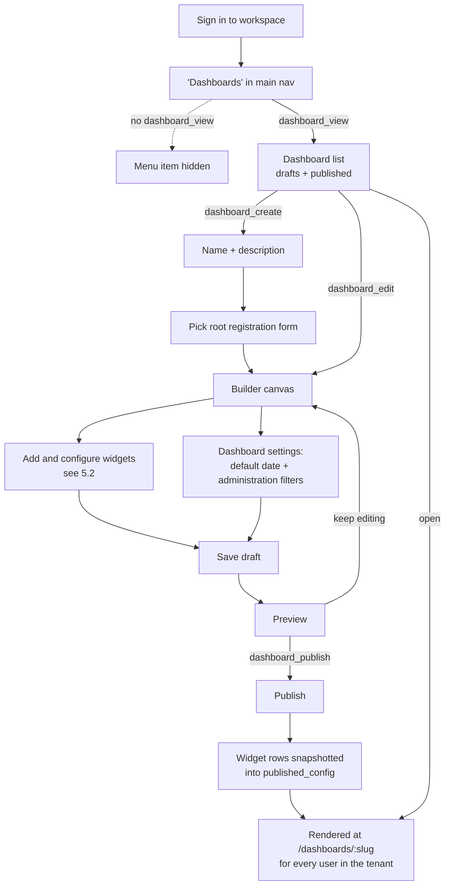
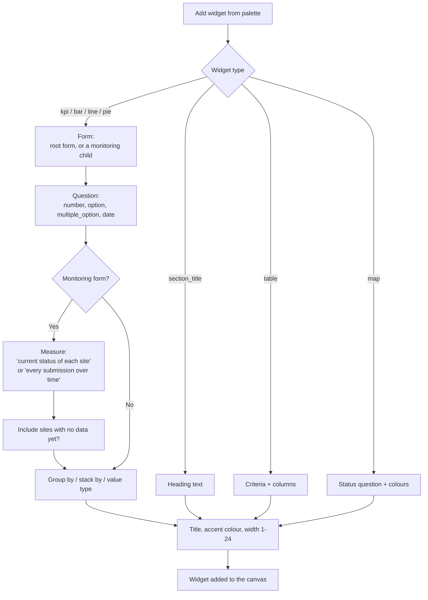
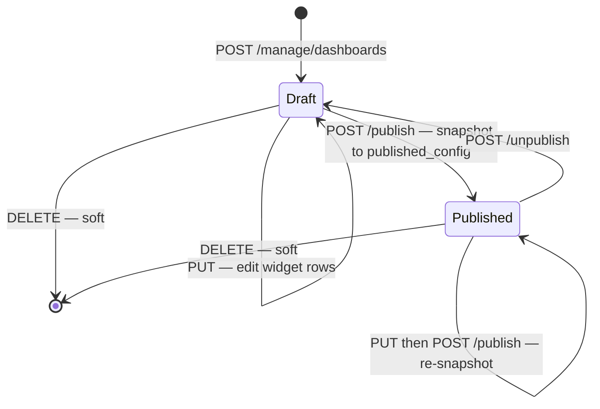

# Feature Design Document: Dashboard Builder Data Architecture

**Task ID**: VIZ-001
**Author**: Deden
**Date**: 2026-08-14
**Status**: Approved

---

## 1. Context & Problem Statement

```
Currently:
- Dashboards are defined as JSON files in `frontend/src/config/visualizations/`
- Each file is hand-registered in `index.js` and shipped in the frontend bundle
- Adding a dashboard requires a developer, a code review, and a deploy
- The route `/dashboard/:slug` is anonymous-readable, and several
  `/visualization/*` endpoints have no permission class (default AllowAny)
  while taking a sequential `form_id` straight from the URL
- The two live configs (EPS, RWS) and roughly 45 frontend files encode
  Fiji-specific domain logic: water-quality compliance thresholds,
  accessibility buckets, construction progress, per-record overview screens

Goal:
- Tenants author their own dashboards through a UI, with no deploy
- Dashboards are persisted, tenant-scoped, draft → published, permission-gated
- The generic aggregation engine is kept and hardened; the Fiji-specific
  compute layer is removed
- The "latest monitoring submission per registered site" semantics survive
  intact, because that is what makes an MIS dashboard mean anything
```

Akvo MIS began as a single Fiji project, so the dashboard layer was built
project-first: configs authored by developers, for one deployment, with
domain logic hard-coded in React components. The MT-\* and FB-\* iterations
moved the platform to a multi-tenant SaaS footing. The dashboard layer is
the last major surface still shaped like the old model.

**This is FB-001 applied one level up.** Forms made exactly this move —
from `backend/source/forms/*.json` plus a CLI seeder, to UI-authored,
DB-persisted, versioned, permission-gated records. Dashboards sit where
forms sat:

| | Forms (FB-001, done) | Dashboards (VIZ-001) |
|---|---|---|
| Was | `source/forms/*.json` + `form_seeder` | `config/visualizations/*.json` + `index.js` |
| Becomes | `Forms` + `FormPublishedVersion` | `Dashboard` + `DashboardWidget` |
| Namespaces | `/forms` read, `/manage/forms` CRUD | `/dashboards` read, `/manage/dashboards` CRUD |
| Lifecycle | draft → publish → activate | draft → publish |
| Tenant | direct FK on `Forms` (MT-002 root) | direct FK on `Dashboard` |
| Permissions | `form_view/create/edit/publish/delete` | `dashboard_view/create/edit/publish/delete` |

### Relationship to CLEANUP-001

`doc/design/CLEANUP-001-remove-public-dashboard.md` proposes deleting the
dashboard system outright rather than hardening it, on the grounds that it
is both the surface carrying the anonymous-access vulnerability and the one
adding most of the complexity.

VIZ-001 agrees with the diagnosis and splits the target in two:

- **Removed** — everything Fiji-shaped: the compliance / water-quality layer
  (thresholds, dot-strip), `accessibility_bucket`, `cross_tab`, `kpi_stack`,
  `custom_component` and the EPS individual-overview components, the
  file-config registry, and the anonymous `/dashboard/:slug` route. This is
  the bulk of CLEANUP-001's "45 frontend files".
- **Kept and hardened** — `/visualization/values` and
  `/visualization/escalation`. That query grammar is not Fiji-specific; it is
  the correct general aggregation vocabulary over `Answers`, and it already
  implements the latest-monitoring semantics that are expensive and risky to
  reimplement. Both get `IsAuthenticated` plus tenant scoping, which is
  CLEANUP-001's own prescription for the endpoints it keeps.

VIZ-001 therefore **supersedes** CLEANUP-001. The vulnerability is closed by
the same change that removes the Fiji code.

---

## 2. Requirements

### User Acceptance Criteria

- [ ] A tenant admin can create a dashboard, name it, and pick a registration
      form family as its data source
- [ ] They can add KPI, bar, line, pie/doughnut, table, map, and section-title
      widgets, and set each widget's width
- [ ] For any widget on a monitoring form, they choose in plain language
      between "current status of each site" and "every submission over time",
      defaulting to the former
- [ ] They can set dashboard-level default filters (monitoring period,
      administration) that apply to every widget
- [ ] Every widget on a dashboard draws from the same form family — the
      chosen registration form and its monitoring children, and nothing else
- [ ] They can preview a draft, publish it, and unpublish it
- [ ] Other users in the same tenant see published dashboards only
- [ ] No dashboard from another tenant is ever visible or reachable

### Technical Acceptance Criteria

- [ ] `Dashboard` and `DashboardWidget` models with a tenant derivation path
      (MT-002) and soft delete on `Dashboard`
- [ ] `/manage/dashboards` CRUD mirroring `/manage/forms`, gated by five new
      `FeatureAccessTypes`
- [ ] Every `/visualization/*` endpoint kept in v1 requires authentication and
      is scoped to the caller's tenant
- [ ] Widget config validates against form/question membership and the four
      aggregatable question types before save
- [ ] A widget naming a form outside the dashboard's family is rejected, and
      `root_form` cannot be changed after create (D-3)
- [ ] Every chart is an `akvo-charts` component; no direct `echarts` import
      remains under `components/dashboard/` (D-10)
- [ ] A widget whose question was soft-deleted degrades to a visible broken
      state; it never fails the whole dashboard
- [ ] The form builder warns before soft-deleting a question referenced by a
      dashboard
- [ ] The `monitoring=latest` + `sum_by=parent_id` behaviour is unchanged

---

## 3. Data Model Changes

### New Models

```python
class Dashboard(SoftDeletes):
    """A tenant-authored dashboard bound to one registration form family."""

    TENANT_PATH = "tenant"

    tenant = tenant_fk("dashboards")          # definition root, like Forms
    root_form = models.ForeignKey(
        to=Forms,
        on_delete=models.PROTECT,
        related_name="dashboards",
    )                                          # must be a registration form
    name = models.CharField(max_length=255)
    slug = models.SlugField(max_length=255)    # unique per tenant
    description = models.TextField(null=True, default=None)
    status = models.IntegerField(
        choices=DashboardStatus.FieldStr.items(),
        default=DashboardStatus.draft,
    )
    # Serialized snapshot of the widget rows, written by publish.
    # Viewers read this; the builder edits the rows. Null while draft.
    published_config = models.JSONField(null=True, default=None)
    published_at = models.DateTimeField(null=True, default=None)
    # {"date": {...}, "administration": {...}} — see §4.3
    default_filters = models.JSONField(default=dict)
    created = models.DateTimeField(auto_now_add=True)
    updated = models.DateTimeField(null=True, default=None)
    created_by = models.ForeignKey(
        SystemUser, on_delete=models.SET_NULL, null=True,
        related_name="dashboards_created",
    )

    class Meta:
        constraints = [
            models.UniqueConstraint(
                fields=["tenant", "slug"],
                condition=models.Q(deleted_at__isnull=True),
                name="unique_active_tenant_dashboard_slug",
            )
        ]
        db_table = "dashboard"


class DashboardWidget(models.Model):
    """One visualisation on a dashboard.

    The five promoted columns are the ones that need referential integrity
    or need to be queried (`form`, `question`, `order`, `type`, `col_span`).
    Everything type-specific stays in `config`, which is heterogeneous by
    design — see §4.
    """

    TENANT_PATH = "dashboard__tenant"
    objects = TenantManager()

    dashboard = models.ForeignKey(
        to=Dashboard, on_delete=models.CASCADE, related_name="widgets",
    )
    order = models.IntegerField()              # position in the array
    type = models.IntegerField(
        choices=WidgetTypes.FieldStr.items(),
    )
    col_span = models.IntegerField(default=24)  # 1–24, Ant Design grid
    title = models.CharField(max_length=255, null=True, default=None)
    color = models.CharField(max_length=32, null=True, default=None)
    # root_form, or a monitoring form whose parent is root_form
    form = models.ForeignKey(
        to=Forms, on_delete=models.PROTECT,
        related_name="dashboard_widgets", null=True, default=None,
    )
    # Null for section_title and for count-only widgets
    question = models.ForeignKey(
        to=Questions, on_delete=models.PROTECT,
        related_name="dashboard_widgets", null=True, default=None,
    )
    config = models.JSONField(default=dict)

    class Meta:
        ordering = ["dashboard", "order"]
        db_table = "dashboard_widget"
```

`Questions` uses soft delete (FB-001 D-6), so `on_delete=PROTECT` on
`DashboardWidget.question` never actually fires for the normal delete path —
a soft delete only sets `deleted_at`. The FK's real job is to make
"which dashboards reference this question?" a plain join. See §8.

### New Constants

```python
class DashboardStatus:
    draft = 1
    published = 2

    FieldStr = {draft: "draft", published: "published"}


class WidgetTypes:
    kpi = 1
    bar = 2
    line = 3
    pie = 4
    table = 5
    map = 6
    section_title = 7

    FieldStr = {
        kpi: "kpi", bar: "bar", line: "line", pie: "pie",
        table: "table", map: "map", section_title: "section_title",
    }
```

### Modified Models / Constants

| Model | Change | Reason |
|---|---|---|
| `FeatureAccessTypes` | Add `dashboard_view = 8` … `dashboard_delete = 12` | Permission gating (§9) |
| `FeatureTypes` | Add `dashboard_builder = 3` with its access group | Role editor grouping |

`2` is already a gap in `FeatureAccessTypes` (`invite_user = 1`,
`form_view = 3`); the new values continue from `7` rather than filling it.

### Migration Strategy

```python
# Two new tables, no backfill. Nothing in the codebase references them yet.
# `tenant` is nullable per MT-002's tenant_fk convention, but every row
# created through the API sets it from request.user.tenant.
#
# The two legacy JSON configs (EPS, RWS) are NOT migrated. They encode
# compute modes this schema deliberately drops (§7 D-5). If Fiji still
# needs them, they are rebuilt in the builder as a separate exercise.
#
# Rollback: drop both tables. No other table gains a column.
```

---

## 4. Widget Configuration Schema

A dashboard, as the API returns it, is the shape originally sketched: a
JSON array of heterogeneous visualisation configs.

```jsonc
{
  "id": 12,
  "name": "Water Points Overview",
  "slug": "water-points-overview",
  "root_form": 1749623934933,
  "status": "published",
  "default_filters": { /* §4.3 */ },
  "widgets": [ /* §4.1 */ ]
}
```

### 4.1 Common widget fields

| Field | Type | Notes |
|---|---|---|
| `id` | int | Row id |
| `order` | int | Ascending position |
| `type` | string | `kpi` \| `bar` \| `line` \| `pie` \| `table` \| `map` \| `section_title` |
| `col_span` | int | 1–24. Default `24` (full width) |
| `title` | string | Widget heading |
| `color` | string | Accent colour, hex |
| `form` | int | `root_form`, or a monitoring form whose parent is `root_form` |
| `question` | int\|null | Must belong to `form` |
| `config` | object | Type-specific — below |

### 4.2 `measure` — the latest-monitoring wrapper

The single most important translation in this design. Every widget whose
`form` is a monitoring form carries a `measure`, and it is surfaced in the UI
as plain language, never as raw query params:

| UI label | `config.measure` | Expands to |
|---|---|---|
| **Current status of each site** *(default)* | `current_state` | `monitoring=latest`, `sum_by=parent_id` |
| Every submission over time | `all_submissions` | `monitoring=all` |

`current_state` is what `get_base_monitoring_qs` implements: the queryset
universe becomes the **registration** datapoints (`parent__isnull=True`, not
pending, not draft), each annotated with `latest_id` — a subquery selecting
its most recent monitoring submission by `FormData.created`, optionally
bounded by the active date filter — and filtered to those that have one.
Aggregation then runs over exactly one submission per site, and
`sum_by=parent_id` counts distinct *sites*.

The difference this makes is the difference between "42 water points are
currently operational" and "42 monitoring visits reported operational". A
self-serve builder that leaves this implicit will produce confidently wrong
numbers, which is why it is a required, explicit, plain-language field rather
than an advanced toggle.

`config.include_unmonitored` (→ `include_unanswered`) is part of the same
concept: sites never monitored drop out of `current_state` by default. Fiji
hit this and had to bolt on a "No information available" bucket after the
fact. Here it is a first-class checkbox — *"include sites with no data yet"*.

### 4.3 Per-type `config`

Every chart is rendered by an `akvo-charts` component (D-10). The mapping is
fixed, and no widget type may reach for anything else:

| Widget | `akvo-charts` component | Notes |
|---|---|---|
| `kpi` | *(none)* | A styled number; no chart involved |
| `bar` | `Bar`, or `StackBar` when `stack_by` is set | `config.horizontal` for `orientation` |
| `line` | `Line`, or `StackLine` when `stack_by` is set | |
| `pie` | `Pie`, or `Doughnut` when `variant: doughnut` | |
| `map` | `MapCluster` | Leaflet-based, in the same package |
| `table` | *(none)* | Ant Design `Table` — `akvo-charts` has no table |
| `section_title` | *(none)* | |

**`kpi`** → `GET /visualization/values`

```jsonc
{
  "measure": "current_state",
  "include_unmonitored": false,
  "option_value": "operational",     // optional: count only this option
  "value_type": "number",            // "number" | "percentage"
  "repeat_agg": "average"            // repeatable groups: average|sum|max|min|last
}
```

**`bar`, `line`** → `GET /visualization/values`

```jsonc
{
  "measure": "current_state",
  "include_unmonitored": false,
  "group_by": "option",              // "option" | "month" | "date" | "parent_id"
  "stack_by": null,                  // "option" | "parent_id" | null
  "value_type": "number",
  "repeat_agg": "average",
  "orientation": "vertical"          // presentation only, not sent to backend
}
```

**`pie`** → `GET /visualization/values`

```jsonc
{
  "measure": "current_state",
  "group_by": "option",              // pie is always grouped by option
  "value_type": "percentage",
  "variant": "doughnut"              // "pie" | "doughnut", presentation only
}
```

**`table`** → `GET /visualization/escalation`

```jsonc
{
  "criteria": [                      // rows match if ANY criterion holds
    {"type": "option_equals", "question": 1749631041156, "value": "yes"},
    {"type": "threshold_gt", "question": 1749633220746, "value": 5}
  ],
  "columns": [
    {"key": "site", "source": "parent_name"},
    {"key": "location", "source": "administration"},
    {"key": "status", "source": "answer", "question": 1749631041155},
    {"key": "checked", "source": "latest_date", "question": 1749631041160}
  ],
  "page_size": 20
}
```

**`map`** → `GET /maps/geolocation/{form_id}`

```jsonc
{
  "status_question": 1749631041155,  // colours the pins
  "status_colors": {"operational": "#64A73B", "issue": "#e41a1c"}
}
```

**`section_title`** — no request

```jsonc
{ "text": "Monitoring overview" }
```

### 4.4 `Dashboard.default_filters`

```jsonc
{
  "date": {
    "enabled": true,
    "date_question": null,           // null = filter on FormData.created
    "default_range": "last_12_months"
  },
  "administration": { "enabled": true }
}
```

Filters are dashboard-level and apply to every widget, which is only
coherent because a dashboard is bound to one form family (D-3). The active
filter values are merged into each widget's request at fetch time as
`from_date` / `to_date` / `date_question_id` / `administration_id`.

### 4.5 Validation rules

Enforced on save, so an invalid dashboard cannot be persisted:

| Rule | Error |
|---|---|
| `root_form.type == registration` and `root_form.parent is None` | 400 |
| `root_form` is immutable after create (D-3) | 400 |
| `widget.form` is `root_form` or has `parent == root_form` — no form outside the family, ever (D-3) | 400 |
| `widget.question.form == widget.form` | 400 |
| `widget.question.type ∈ {number, option, multiple_option, date}` | 400 |
| `measure == current_state` only when `widget.form` is a monitoring form | 400 |
| `stack_by` requires `group_by` and `question` | 400 |
| `1 <= col_span <= 24` | 400 |
| `table.columns[].source ∈ VALID_COLUMN_SOURCES` | 400 |
| `slug` matches `^[a-z0-9]+(-[a-z0-9]+)*$`, unique per tenant | 409 |

The question-type restriction comes straight from the data model: `Answers`
stores numerics in `value`, choices in `options`, and everything else in
`name`, so only those four types are aggregatable
(`SUPPORTED_QUESTION_TYPES` in `v1_visualization/constants.py`).

---

## 5. User Workflow

### 5.1 Getting there and publishing

How a tenant admin reaches the builder and ships a dashboard. Permission
gates are shown on the edges.



**`Root` happens once, before the canvas.** Picking the registration form
family up front is what lets every later question picker be a short, correct
list, and what makes the dashboard-level filters coherent (D-3).

### 5.2 Configuring one widget

The decision tree the inspector walks, which produces the `config` objects in
§4.3.



**`Measure` is on the path, not in an advanced panel.** Every monitoring-form
widget passes through it, so there is no route to a KPI that silently counts
submissions when the author meant sites (D-4).

### 5.3 Dashboard lifecycle



Editing a published dashboard changes the live `DashboardWidget` rows but
**not** what viewers see — they read `published_config`, which only changes on
re-publish (D-2). So a half-finished edit never leaks onto a colleague's
screen, and no separate "draft copy of a published dashboard" record is
needed.

---

## 6. API Contract

### URL Namespaces

| Namespace | Purpose | Auth |
|---|---|---|
| `/api/v1/dashboards` | Read published dashboards for rendering | **Yes** |
| `/api/v1/manage/dashboards` | CRUD for the builder UI | Yes |

Unlike `/api/v1/forms`, the read namespace is **authenticated**. There is no
anonymous dashboard surface — that is the CLEANUP-001 fix.

### Endpoints

| Method | URL | Purpose | Permission |
|---|---|---|---|
| GET | `/api/v1/dashboards` | Published dashboards in the caller's tenant | authenticated |
| GET | `/api/v1/dashboards/{slug}` | `published_config` for rendering | authenticated |
| GET | `/api/v1/manage/dashboards` | Paginated list incl. drafts | `dashboard_view` |
| POST | `/api/v1/manage/dashboards` | Create as draft | `dashboard_create` |
| GET | `/api/v1/manage/dashboards/{id}` | Detail with live widget rows | `dashboard_view` |
| PUT | `/api/v1/manage/dashboards/{id}` | Replace metadata + widget array | `dashboard_edit` |
| DELETE | `/api/v1/manage/dashboards/{id}` | Soft delete | `dashboard_delete` |
| POST | `/api/v1/manage/dashboards/{id}/publish` | Snapshot rows → `published_config` | `dashboard_publish` |
| POST | `/api/v1/manage/dashboards/{id}/unpublish` | `status` → draft | `dashboard_publish` |
| POST | `/api/v1/manage/dashboards/{id}/duplicate` | Clone as a new draft | `dashboard_create` |
| GET | `/api/v1/manage/dashboards/{id}/sources` | Pickable forms + questions | `dashboard_view` |

`/sources` exists so the builder's inspector never has to guess: it returns
the root form and its monitoring children, each with its questions already
filtered to the four aggregatable types and annotated with their option
lists. Without it the frontend would re-derive the validation rules in §4.5.

```jsonc
// GET /api/v1/manage/dashboards/12/sources
{
  "forms": [
    {
      "id": 1749623934933, "name": "Water Points", "type": "registration",
      "questions": [
        {"id": 1749623934940, "label": "Water source type",
         "type": "option",
         "options": [{"value": "borehole", "label": "Borehole"}]}
      ]
    },
    {
      "id": 1749631041125, "name": "WP Monitoring", "type": "monitoring",
      "parent": 1749623934933,
      "questions": [
        {"id": 1749631041155, "label": "Operational status",
         "type": "option",
         "options": [{"value": "operational", "label": "Operational"}]}
      ]
    }
  ]
}
```

### PUT payload

The widget array is replaced wholesale, matching how the builder's canvas
works (reorder, add, remove are all local until save). Widgets with an `id`
are updated in place; those without are created; omitted ones are deleted.

```jsonc
{
  "name": "Water Points Overview",
  "description": "Operational status across all registered sites",
  "default_filters": { "date": {"enabled": true, "default_range": "last_12_months"},
                       "administration": {"enabled": true} },
  "widgets": [
    {"id": 44, "order": 1, "type": "section_title", "col_span": 24,
     "config": {"text": "Current status"}},
    {"id": null, "order": 2, "type": "kpi", "col_span": 6,
     "title": "Operational", "color": "#64A73B",
     "form": 1749631041125, "question": 1749631041155,
     "config": {"measure": "current_state", "option_value": "operational",
                "value_type": "number", "include_unmonitored": false}}
  ]
}
```

### Frontend routes

| Route | Screen |
|---|---|
| `/dashboards` | List (mockup: "My dashboards") |
| `/dashboards/:slug` | View / preview |
| `/dashboards/:slug/edit` | Builder — palette, canvas, inspector |

The legacy `/dashboard/:slug` route is removed.

---

## 7. Decision Log

### D-1: Normalized widget rows with per-widget JSON config

**Options**: (1) `Dashboard.config` as one JSON array. (2) `Dashboard` +
`DashboardWidget` rows, type-specific fields in a per-row `config` JSONField.

**Decision**: Option 2.

**Rationale**: Widget configs genuinely are heterogeneous — a KPI has
`option_value`, a bar has `group_by`/`stack_by`, a table has
`criteria[]` + `columns[]` — so the per-type JSON is kept. But a widget pins
`question_id`, and `Questions` is soft-deletable. With one blob, deleting a
question silently breaks every dashboard referencing it, with no way to ask
"which dashboards use question 4471?" before doing it. Under file-based
configs a human caught that in review; with tenant-authored ones nobody
will. Promoting `form`, `question`, `order`, `type`, `col_span` out of the
blob is exactly the set that needs integrity or querying. This is FB-001 D-5
("normalized in DB, snapshot on publish") applied one level up, and it gives
the MT-002 tenant derivation path (`dashboard__tenant`) for free.

**Impact**: Widget schema changes that add type-specific fields need no
migration; ones that add a *common* field do.

---

### D-2: Publish snapshot is a JSONField, not a version table

**Options**: (1) `DashboardPublishedVersion` table mirroring
`FormPublishedVersion`. (2) A single `published_config` JSONField.

**Decision**: Option 2.

**Rationale**: `FormPublishedVersion` exists because historical *submissions*
must render against the exact schema used at collection time. A dashboard is
a view — no stored artifact is bound to a past version of it, so version
history buys nothing today. One field gives the draft/publish split; a table
would be speculative.

**Impact**: Viewers read `published_config` in one row fetch, so an
in-progress edit never leaks into the published dashboard. Rolling back to a
previous published state is not supported. If it is ever wanted, promoting
the field to a table is additive.

---

### D-3: One form family per dashboard — cross-form is not allowed

**Options**: (1) Bound to one root registration form and its monitoring
children. (2) Any form per widget.

**Decision**: Option 1. **A dashboard's data universe is exactly one form
family: one registration form plus the monitoring forms whose `parent` is
that form. A widget may not reference a form outside its dashboard's family,
and this is a permanent restriction, not a deferral.**

**Rationale**: Dashboard-level date and administration filters are only
coherent when every widget shares a data universe. `sum_by=parent_id` and
`monitoring=latest` mean nothing except relative to a known registration
form — `parent_id` *is* the registration datapoint. A widget pointing at an
unrelated form would silently break both, and the numbers it produced would
look fine. The family boundary is what makes every other guarantee in this
design hold.

**Impact**: A tenant wanting a cross-programme overview builds one dashboard
per family. `widget.form` still lives on the widget row because a family has
more than one form in it — not as a hook for lifting the restriction later.
`Dashboard.root_form` is the family key and is immutable after creation:
changing it would orphan every widget. Re-pointing a dashboard at a
different family means building a new one.

---

### D-4: `measure` as a plain-language wrapper, not raw params

**Decision**: Widgets store `measure: current_state | all_submissions`; the
backend params are derived.

**Rationale**: The gap between "how many sites are broken right now" and
"how many breakage reports were filed" is precisely where a self-serve
builder produces confidently wrong output. Exposing `monitoring` and
`sum_by` as separate raw controls invites the wrong combination. One named
choice, defaulted to `current_state` on monitoring forms, makes the correct
thing the easy thing.

**Impact**: The builder cannot express `monitoring=latest` *without*
`sum_by=parent_id`. That combination has no sensible dashboard meaning, so
the loss is intentional.

---

### D-5: Keep `/values` and `/escalation`; delete the Fiji compute layer

**Decision**: Harden the two generic endpoints; remove the frontend compute
modes and the file-config registry.

**Rationale**: `values_functions.py` (~1,240 lines) implements the
latest-monitoring subquery and its `is_latest` branching across count,
number, option, and stacked modes. That is generic MIS logic and the
riskiest part of the milestone to reimplement. The frontend compute layer
(`compliance`, `cross_tab`, `accessibility_bucket`, `kpi_stack`,
`custom_component`) is Fiji domain logic wearing a config schema.

**Impact**: See §8 for the full keep/delete/defer split.

---

### D-6: Defer `/visualization/progress` out of v1

**Decision**: The endpoint is retained and given the same authentication and
tenant scoping as the others, but no widget type exposes it. It has no
caller after the Fiji dashboard is removed.

**Rationale**: Its formulas (`any_yes`, `completed_binary`, `ratio`,
`multi_select_proportion`) are generic in principle but were shaped around
EPS construction tracking, and the `components=` string grammar is not
something a builder UI can reasonably author. Revisit once a second tenant
asks for staged-progress tracking.

---

### D-7: No anonymous dashboard access

**Decision**: Both namespaces require authentication; `/dashboard/:slug`
is removed.

**Rationale**: The anonymous route is the vulnerability CLEANUP-001 found.
Nothing in the SaaS direction requires public dashboards; the builder
mockup is entirely inside the authenticated app. Public sharing, if wanted
later, is a deliberate feature with its own token model — not a default.

---

### D-8: "Latest" means latest by submission date

**Decision**: Keep `order_by("-created")` on `FormData`. A
`date_question_id` filters the window but never reorders.

**Rationale**: Matches current behaviour; no tenant has asked otherwise. The
known limitation is recorded in §13 — a visit conducted in January but
entered in March counts as the latest.

---

### D-9: Broken widgets degrade, they do not fail the dashboard

**Decision**: A widget whose question is soft-deleted or whose form was
removed renders a visible "This widget's question no longer exists"
placeholder. The rest of the dashboard loads normally.

**Rationale**: Same principle as the existing renderer's "No data"
placeholder. One stale reference must not blank a page — and under
tenant-authored dashboards, stale references become routine rather than
exceptional.

---

### D-10: akvo-charts is the only charting library

**Decision**: Every chart a dashboard renders comes from `akvo-charts`
(`npm install --save akvo-charts`, already a dependency at `^1.3.4`). No
direct `echarts` / `echarts-for-react` import, and no new chart component
written in this repo.

**Rationale**: `akvo-charts` is Akvo's own ECharts wrapper, maintained
alongside the platform, and it already covers every widget type in §4.3 that
is a chart. Demo and full component reference:
<https://akvo.github.io/akvo-charts>. The legacy dashboard drifted the other
way — `DotStripChart` and `DotsChart` are bespoke ECharts components, and
`ChartRenderer` reaches past the wrapper to `setOption` for tooltips, pie
label hiding and half-doughnut angles. Tenant-authored dashboards multiply
that surface by the number of tenants, so it is capped now: anything a widget
needs that the wrapper cannot express is a `rawConfig` prop or an upstream
`akvo-charts` change, not a local escape hatch.

**Impact**: `pie` uses `Pie`; `pie` with `variant: doughnut` uses `Doughnut`;
`bar` uses `Bar`, or `StackBar` when `stack_by` is set; `line` uses `Line`,
or `StackLine` when `stack_by` is set; `map` uses `MapCluster`. `akvo-charts`
has **no table primitive**, so the `table` widget stays on Ant Design's
`Table` — that is the one chart-shaped widget the library does not own, and
it is not a chart.

---

## 8. Scope: keep, delete, defer

| Area | Disposition |
|---|---|
| `/visualization/values` + `values_functions.py` | **Keep**, add `IsAuthenticated` + tenant scoping |
| `/visualization/escalation` + `escalation_functions.py` | **Keep**, same |
| `/maps/geolocation`, `/maps/datapoint` | **Keep**, same |
| `/visualization/monitoring-stats`, `/formdata-stats` | **Keep** — manage-data screens, unrelated |
| `/visualization/progress` + `progress_functions.py` | **Defer** (D-6) |
| `frontend/src/config/visualizations/` | **Delete** — replaced by DB rows |
| `DashboardRenderer`, `ChartRenderer`, widget components | **Keep**, re-pointed at the new schema |
| `DotStripChart`, `DotsChart`, compliance / water-quality thresholds | **Delete** — Fiji domain logic, and bespoke ECharts components (D-10) |
| Direct `echarts` / `echarts-for-react` imports under `components/dashboard/` | **Delete** — every chart comes from `akvo-charts` (D-10) |
| `formula.py` | **Keep** — a generic, Django-free bucket evaluator that classifies a datapoint by conditions; it is what the `map` widget's status colouring should be built on |
| `compute:` modes (`cross_tab`, `kpi_stack`, `accessibility_bucket`) | **Delete** |
| `custom_component` + `individual-overview/` | **Delete** |
| `/dashboard/:slug` route | **Delete** |

### Widget health

Because `DashboardWidget.question` is a real FK, two things become simple:

1. **On read** — the serializer annotates each widget with
   `is_broken: true` plus a reason when `question.deleted_at` is set, so the
   renderer can show the D-9 placeholder without a second query.
2. **On question delete** — the form builder's delete path checks
   `DashboardWidget.objects.filter(question=q)` and warns
   *"This question is used by 3 dashboards"* before soft-deleting.

Neither is expressible against a JSON blob without a JSONB scan.

---

## 9. Security Considerations

- [ ] Both namespaces require authentication; no `AllowAny` anywhere in
      `v1_visualization`
- [ ] `Dashboard.objects.for_user(request.user)` on every read; `tenant` set
      from `request.user.tenant` on every write, never from the payload
- [ ] `root_form` and every `widget.form` validated to belong to the caller's
      tenant — a sequential `form_id` in a payload must not cross tenants
- [ ] `/visualization/*` endpoints validate `form_id` against the caller's
      tenant, closing the `/progress/1`, `/2`, `/3` enumeration
- [ ] Five granular `FeatureAccessTypes`, mirroring FB-001 D-8:

| Action | Permission |
|---|---|
| list, retrieve, sources | `dashboard_view` |
| create, duplicate | `dashboard_create` |
| update | `dashboard_edit` |
| publish, unpublish | `dashboard_publish` |
| destroy | `dashboard_delete` |

---

## 10. Testing Strategy

| Test type | Coverage |
|---|---|
| Unit | Dashboard CRUD, publish/unpublish snapshot, duplicate |
| Unit | §4.5 validation — every rule rejected with a 400 |
| Unit | `measure` → query param expansion, both values |
| Unit | Permission checks per action |
| Unit | Broken-widget annotation when a question is soft-deleted |
| Integration | Create → add widgets → publish → render via `/dashboards/{slug}` |
| Integration | Two tenants: neither sees nor can fetch the other's dashboards |
| Integration | Cross-tenant `form_id` in a widget payload is rejected |
| Regression | `/visualization/values` output unchanged for the existing param set |

The last row matters most: the latest-monitoring semantics are being
preserved, not rewritten, so the existing `v1_visualization` tests should
pass untouched apart from the added auth.

---

## 11. Implementation Slices

Four phases. Within a phase the backend and frontend tasks run **in
parallel** against the contract frozen in §6; phases are the only
synchronisation points. Full task breakdown, acceptance criteria and the
mockup mapping: one design doc per task, `doc/design/VIZ-002-*.md` …
`doc/design/VIZ-009-*.md`.

| Phase | Backend | Frontend |
|---|---|---|
| 1. Foundation | `VIZ-002-dashboard-data-model`<br/>`VIZ-003-visualization-endpoint-hardening` | `VIZ-004-dashboard-list-and-create` |
| 2. Authoring | `VIZ-005-dashboard-crud-api` | `VIZ-006-dashboard-builder-ui` |
| 3. Publish & render | `VIZ-007-dashboard-publish-and-read-api` | `VIZ-008-dashboard-viewer` |
| 4. Cleanup | `VIZ-009-legacy-dashboard-removal` (full-stack) | |

**VIZ-003 is gated on nothing** and closes the CLEANUP-001 vulnerability, so it
merges first. **VIZ-009 comes last** so the legacy dashboard keeps working
until its replacement has shipped.

**The epic ends at VIZ-009**, with a working tenant-authored dashboard
builder. AI-assisted dashboard generation is a separate, unscheduled epic —
`doc/design/VIZ-AI-001-ai-dashboard-suggestion.md` — designed against this
document's §4 schema but depended on by nothing in VIZ-002 … VIZ-009.

### After the epic

Work continued past VIZ-009 as follow-ups rather than as new phases. Each
has its own design doc; the table records what is actually on `main`.

| Task | Doc | Status |
|---|---|---|
| VIZ-010 Workflow completion | `VIZ-010-dashboard-workflow-completion.md` | Shipped (PR #335 / #337) |
| VIZ-011 Test plan | `VIZ-011-dashboard-test-plan.md` | Not started |
| VIZ-012 Widget config usability | `VIZ-012-widget-configuration-usability.md` | Shipped (PR #351) |
| VIZ-013 Colour schemes | `VIZ-013-widget-colour-schemes.md` | Shipped (PR #354) |
| VIZ-014 KPI improvements | `VIZ-014-kpi-widget-improvements.md` | Partly delivered |
| VIZ-015 Stack by question | `VIZ-015-bar-chart-stacking-by-question.md` | Not started |
| VIZ-016 Scatter plot | `VIZ-016-scatter-plot-widget.md` | Shipped (PR #365) |
| VIZ-017 Default filters | `VIZ-017-dashboard-default-filters.md` | Shipped (PR #348) |
| VIZ-018 Public visibility | `VIZ-018-public-dashboard-visibility.md` | Shipped (PR #360) |
| VIZ-019 Embedded dashboards | `VIZ-019-embedded-external-dashboards.md` | PR #366 in review |
| VIZ-020 Visualization quick wins | `VIZ-020-visualization-quick-wins.md` | Planning only |

Two decisions in this document were superseded by that work:

- **D-7 (no anonymous dashboard access) is reversed.** VIZ-018 reopened a
  public surface, bounded by a per-dashboard id allowlist derived from the
  published snapshot rather than by authentication.
- **VIZ-003's `IsAuthenticated`-everywhere plan was not what shipped.** The
  visualization endpoints resolve scope through
  `public_scope.resolve_view_scope` instead: authenticated callers keep the
  tenant they always had, anonymous callers must name a published public
  dashboard and may query only the ids it names.

---

## 12. Open Questions

1. **Templates across tenants.** The mockup's "start from a template" flow
   cannot copy JSON between tenants, because `question_id`s are tenant-local.
   A template would need to describe widgets by question *role* and bind them
   at instantiation. Out of scope, and so is the cold-start problem it was
   reaching for: this epic ships a blank canvas. Noted so the schema is not
   assumed portable. `VIZ-AI-001` is the better answer when it is built — a
   suggestion generated from the tenant's own form definition binds to their
   real question IDs by construction, so the portability problem never
   arises.
2. **Latest by answer date.** D-8 keeps submission date. A tenant doing
   retrospective data entry will eventually want "latest by the visit-date
   question". That is a change to `latest_monitoring_subquery`, not to this
   schema.
3. **Fiji migration.** The EPS and RWS dashboards are not migrated. Whether
   they are rebuilt in the builder, kept alive on a pinned deploy, or dropped
   is a product decision, not a technical one.
4. **Export / embed.** Not in v1. Any future public-sharing feature must
   carry its own token model rather than reopening anonymous access (D-7).

---

## 13. References

- `doc/design/FB-001-form-builder-data-architecture.md` — the precedent this
  design follows
- `doc/design/MT-002-tenant-scoping-database.md` — tenant derivation rules
- `doc/design/CLEANUP-001-remove-public-dashboard.md` — superseded by §1
- `frontend/src/config/visualizations/README.md` — the legacy schema this
  replaces
- `backend/api/v1/v1_visualization/functions.py:342` —
  `get_base_monitoring_qs`, the latest-monitoring logic being preserved
- `backend/api/v1/v1_visualization/constants.py` — `SUPPORTED_QUESTION_TYPES`
  and the valid `group_by` / `stack_by` / `repeat_agg` sets
- `doc/design/VIZ-AI-001-ai-dashboard-suggestion.md` — AI-assisted dashboard
  generation, a separate epic built on this document's §4 schema
- <https://akvo.github.io/akvo-charts> — component demo, and
  `frontend/node_modules/akvo-charts/README.md` for the full prop reference
- `doc/design/VIZ-Example/index.html` — the interactive builder mockup
