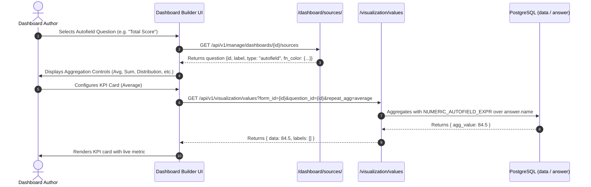

# [VIZ-026] Design: Bringing Autofield to Dashboard Visualization

**Issue:** [#421]  
**Status:** In Planning / Approved Design  
**Author:** Akvo MIS Engineering Team  
**Scope:** `backend/api/v1/v1_visualization/`, `frontend/src/pages/dashboards/`, `frontend/src/components/dashboard/`

---

## 1. Problem & Objectives

In Akvo MIS, `autofield` (question type `10`) computes values dynamically on the client via JavaScript formulas (e.g. Unit Cost `= #10 * #11`, BMI `= #20 / (#21 * #21)`, Compliance `= #1 > 50 ? 'Pass' : 'Fail'`).

### The Problem
1. **Excluded from Sources:** `/manage/dashboards/<pk>/sources` filters questions using `SUPPORTED_QUESTION_TYPES`, which currently excludes `QuestionTypes.autofield`. Autofield questions never appear in the Dashboard Builder.
2. **Unsupported in Values API:** If an `autofield` question is requested on `/visualization/values`, the backend router falls back to `handle_count_mode`, counting submissions rather than aggregating the computed values.
3. **Data Stored as Text:** Autofield values are stored as strings in `Answers.name`. `Answers.value` is `NULL`. Numeric aggregations (`Avg`, `Sum`, `Min`, `Max`) fail unless `Answers.name` is safely cast in SQL.

### The Objective
Enable dashboard authors to visualize **both numeric and categorical autofields** across all dashboard widget types (KPI, Bar, Pie, Line, Scatter, Table, and Map) with zero database migrations or materialized view changes.

---

## 2. Data Flow Architecture

```
                               ┌────────────────────────────────────────┐
                               │   Questions (type=10, fn={fnString})   │
                               └───────────────────┬────────────────────┘
                                                   │
                                     Form Submission (Web / Mobile)
                                                   │
                                                   ▼
                               ┌────────────────────────────────────────┐
                               │      Answers.name (String in DB)       │
                               │        Answers.value is NULL           │
                               └───────────────────┬────────────────────┘
                                                   │
                         ┌─────────────────────────┴─────────────────────────┐
                         ▼                                                   ▼
            ┌───────────────────────────┐                       ┌───────────────────────────┐
            │     Numeric Autofield     │                       │   Categorical Autofield   │
            │   e.g. "42.5", "100", "0" │                       │   e.g. "Pass", "High"     │
            └─────────────┬─────────────┘                       └─────────────┬─────────────┘
                          │                                                   │
                          ▼                                                   ▼
          PostgreSQL Safe Float Casting                        Distinct String Grouping &
             (NUMERIC_AUTOFIELD_EXPR)                          Palette from question.fnColor
                          │                                                   │
                          ▼                                                   ▼
            • KPI Cards (Avg, Sum, Max, Min)                    • Bar Charts (Category shares)
            • Line / Bar Charts (Time series)                   • Pie / Donut Charts
            • Scatter Plots (X/Y correlations)                  • Map Layers (Category markers)
            • Map Layers (Quantity sizing)                      • Table (Criteria & Badges)
```

---

## 3. Technical Design

### 3.1. Safe PostgreSQL Numeric Casting
Because `Answers.name` is a text column, converting it to numbers must guard against non-numeric text to avoid PostgreSQL runtime cast errors.

We define a reusable ORM expression:
```python
from django.db.models import Case, When, Value, FloatField
from django.db.models.functions import Cast

NUMERIC_AUTOFIELD_EXPR = Case(
    When(name__regex=r'^-?[0-9]+(\.[0-9]+)?$', then=Cast('name', output_field=FloatField())),
    default=Value(None),
    output_field=FloatField(),
)
```

### 3.2. Backend Integration Points (`backend/api/v1/v1_visualization/`)

1. **`constants.py`**:
   - Add `QuestionTypes.autofield` to `SUPPORTED_QUESTION_TYPES` (returned by `/dashboard/sources/`).
   - Add `QuestionTypes.autofield` to `STACK_QUESTION_TYPES` (allows categorical stacking).
   - Export `NUMERIC_AUTOFIELD_EXPR`.

2. **`dashboard_builder_serializers.py` (`serialize_question`)**:
   - Return `"type": "autofield"`.
   - If `question.fn.fnColor` exists, extract the keys as predefined `options` and embed `fn_color` for frontend palette initialization.

3. **`dashboard_views.py` & `values_functions.py` (`visualization_values`)**:
   - **Numeric Path** (`repeat_agg` or numeric value type): Apply `NUMERIC_AUTOFIELD_EXPR` to `Answers.name` and aggregate (`Avg`, `Sum`, `Min`, `Max`, `Last`).
   - **Categorical Path** (`group_by="option"` on Bar/Pie): Group by `Answers.name` directly to produce distinct category buckets and counts.

4. **`escalation_functions.py` & `functions.py` (Table Criteria & Escalation)**:
   - `option_equals`: Match against `Q(options__contains=[value]) | Q(name=value)`.
   - `threshold_gt` / `threshold_lt`: Compare `Q(value__gt=threshold) | Q(num_val__gt=threshold)` where `num_val = NUMERIC_AUTOFIELD_EXPR`.

5. **`scatter_functions.py`**:
   - Allow `QuestionTypes.autofield` on X/Y axes by applying `NUMERIC_AUTOFIELD_EXPR`.

### 3.3. Frontend Integration Points (`frontend/src/pages/dashboards/`)

1. **`builderConstants.js`**:
   - Add `"autofield"` to `SUPPORTED_GROUP_QUESTION_TYPES`, `MAP_QUESTION_TYPES`, and `STACK_QUESTION_TYPES`.
   - Update `groupByOptions` and `stackByOptions` to recognize `"autofield"`.

2. **`BuilderInspector.jsx`**:
   - Allow picking autofield questions across all 7 widget types.
   - If the autofield has `fn_color` defined, auto-initialize the chart's color scheme.

---

## 4. Scope Boundary: `view_data_options`

> [!NOTE]
> **No Database View Changes Needed:**
> - `ViewDataOptions` (`view_data_options` materialized view) is used exclusively by the legacy `/visualization/formdata-stats/<form_id>` endpoint (for the "Manage Data" admin map).
> - The modern Dashboard Builder & Viewer (`/visualization/values`, `/dashboard/sources/`, `/visualization/escalation`, `/visualization/scatter`) **does not use `view_data_options`**.
> - All dashboard widgets query the primary `data` (`FormData`) and `answer` (`Answers`) tables directly via Django ORM.
> - **Zero materialized view migrations or SQL rebuilds are required.**

---

## 5. Sequence Diagram



---

## 6. Vibe Coding Task Breakdown (3 Tasks)

| Task ID | Task Description | Vibe Coding (Dev) | Automated Testing | QA & Review | Total Est. Time |
|:---|:---|:---:|:---:|:---:|:---:|
| **TASK-01** | **Backend Autofield Engine & Sources API**<br>• Add `autofield` to `SUPPORTED_QUESTION_TYPES` & `/dashboard/sources/`<br>• Implement safe PostgreSQL numeric casting and categorical grouping in `values_functions.py` & `dashboard_views.py`<br>• Support table criteria & escalation for autofields | 60m | 45m | 30m | **135m (2.25h)** |
| **TASK-02** | **Frontend Dashboard Builder UI Integration**<br>• Update `builderConstants.js` (`SUPPORTED_GROUP_QUESTION_TYPES`, `MAP_QUESTION_TYPES`, `STACK_QUESTION_TYPES`)<br>• Adapt `BuilderInspector.jsx` for autofield question selection and `fnColor` palette extraction<br>• Render autofields across KPI, Bar, Pie, Line, Table, Map, Scatter widgets | 45m | 35m | 25m | **105m (1.75h)** |
| **TASK-03** | **End-to-End Verification & Edge-Case Testing**<br>• Unit & integration tests for mixed numeric/text values, nulls, and malformed strings in `Answers.name`<br>• Verify viewer & builder parity across all 7 widget types<br>• Align documentation and feature specs | 30m | 30m | 20m | **80m (1.33h)** |

---

## 7. Verification Plan

### Automated Tests
- **Backend Tests**:
  ```bash
  ./dc.sh exec backend python manage.py test api.v1.v1_visualization.tests.tests_autofield_visualization
  ./dc.sh exec backend coverage run --rcfile=./.coveragerc manage.py test --shuffle --parallel 4
  ```
- **Frontend Tests**:
  ```bash
  ./dc.sh exec frontend npm test -- --watchAll=false
  ```
- **Linters**:
  ```bash
  ./dc.sh exec backend flake8
  ./dc.sh exec frontend npm run lint
  ```

### Manual Verification
1. Create a form with both a numeric autofield (`#1 * #2`) and a categorical autofield (`#1 > 50 ? 'Pass' : 'Fail'`).
2. Submit test data with diverse outcomes (numbers, `"Pass"`, `"Fail"`, empty).
3. In Dashboard Builder:
   - Add a KPI widget showing Average of the numeric autofield.
   - Add a Pie/Bar widget showing the distribution of the categorical autofield.
   - Add a Table widget with an escalation threshold on the autofield.
   - Add a Map widget colored by the categorical autofield.
4. Publish and verify identical rendering in Dashboard Viewer.
