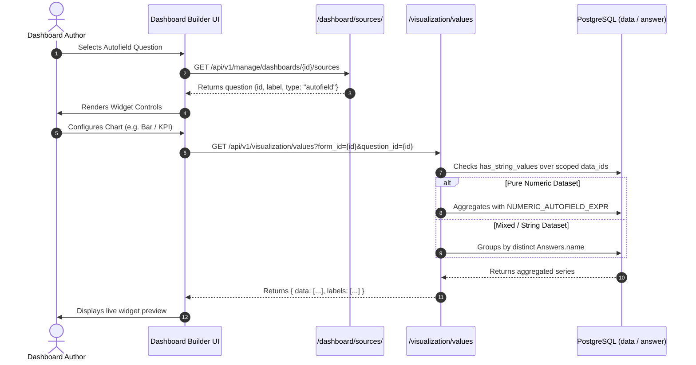

# [VIZ-026] Design: Bringing Autofield to Dashboard Visualization

**Issue:** [#421]  
**Status:** In Planning / Approved Design (Revised per Feedback)  
**Author:** Akvo MIS Engineering Team  
**Scope:** `backend/api/v1/v1_visualization/`, `frontend/src/pages/dashboards/`, `frontend/src/components/dashboard/`

---

## 1. Problem & Objectives

In Akvo MIS, `autofield` (question type `10`) calculates computed values on the client runtime via JavaScript formulas (e.g. Unit Cost `= #10 * #11`, Score `= #1 + #2`, Compliance `= #1 > 50 ? 'Pass' : 'Fail'`).

### The Problem
1. **Excluded from Sources:** `/manage/dashboards/<pk>/sources` filters questions using `SUPPORTED_QUESTION_TYPES`, which currently excludes `QuestionTypes.autofield`. Autofield questions never appear in the Dashboard Builder.
2. **Unsupported in Values API:** When an `autofield` question is requested on `/visualization/values`, the backend router falls back to `handle_count_mode`, counting submissions rather than evaluating the computed field.
3. **Data Stored as Text:** Autofield values are stored as strings in `Answers.name`. `Answers.value` is `NULL`. Numeric aggregations (`Avg`, `Sum`, `Min`, `Max`) fail unless `Answers.name` is safely cast in SQL.
4. **Mixed Data Profiles (Numbers + Strings):** Because formulas can evolve over form versions (e.g. integer in v1, string in v2), a single question may contain both numeric and non-numeric string values across historical records.

### The Objectives
- Enable dashboard authors to visualize `autofield` questions across all dashboard widget types (KPI, Bar, Pie, Line, Scatter, Table, and Map).
- Implement the **Mixed-Value Rule**: if *any* non-numeric string exists in the queried dataset for an autofield, the question safely evaluates as **categorical string options**.
- Handle **Form Version Updates** gracefully without data corruption, SQL cast exceptions, or dropped submissions.
- Keep `fnColor` **out of scope** (color schemes follow standard dashboard widget palettes).
- Maintain zero database migrations and zero changes to the legacy `view_data_options` materialized view.

---

## 2. Data Flow Architecture & The Mixed-Value Rule

```
                               ┌────────────────────────────────────────┐
                               │   Questions (type=10, fn={fnString})   │
                               └───────────────────┬────────────────────┘
                                                   │
                                     Form Submission (Web / Mobile)
                                                   │
                                                   ▼
                               ┌────────────────────────────────────────┐
                               │      Answers.name (String in DB)       │
                               │        Answers.value is NULL           │
                               └───────────────────┬────────────────────┘
                                                   │
                                     Dataset Inspection Query
                                (Check for any non-numeric strings)
                                                   │
                         ┌─────────────────────────┴─────────────────────────┐
                         ▼                                                   ▼
            ┌───────────────────────────┐                       ┌───────────────────────────┐
            │    100% Numeric Dataset   │                       │   Any String / Mixed /    │
            │   (All values are float)  │                       │   Version-Updated Dataset │
            │   e.g. ["10.5", "42", "0"]│                       │   e.g. ["15", "Pass"]     │
            └─────────────┬─────────────┘                       └─────────────┬─────────────┘
                          │                                                   │
                          ▼                                                   ▼
                 Numeric Aggregation                                 Categorical Grouping
             (NUMERIC_AUTOFIELD_EXPR)                             (Group by distinct string)
                          │                                                   │
                          ▼                                                   ▼
            • KPI Cards (Avg, Sum, Max, Min)                    • Bar Charts (Category shares)
            • Line / Bar Charts (Time series)                   • Pie / Donut Charts
            • Scatter Plots (X/Y correlations)                  • Map Layers (Category markers)
            • Map Layers (Quantity sizing)                      • Table (Criteria & Badges)
```

---

## 3. Technical Design

### 3.1. Dataset Type Detection & Null/NaN/None Handling
When querying an autofield on `/visualization/values`, the backend inspects the candidate submission set (`data_ids`).

JavaScript formulas, mobile sync, and client runtimes can produce missing, uncalculated, or falsy runtime tokens: `None` (SQL `NULL`), `""` (empty string), `"null"`, `"undefined"`, `"NaN"`, `"None"`.

> [!IMPORTANT]
> **Runtime Artifacts vs Value Tokens:**
> - **Runtime Artifacts (`NON_VALUE_TOKENS`):** `None`, `"null"`, `"undefined"`, `"NaN"`, `"None"`, and `""` represent uncomputed/missing observations, **not** semantic text categories. They are excluded from `has_string_values` so they do not force a numeric dataset into categorical mode, and they evaluate safely as SQL `NULL`.
> - **Business Value Tokens (`"N/A"`, `"NA"`, `"-"`, `"Pass"`, etc.):** Strings deliberately returned by formulas (e.g. `return #1 > 0 ? #1 : "N/A"`) are **valid string value tokens**. Their presence indicates the formula produces text, correctly triggering categorical mode.

```python
# Canonical runtime computation artifacts (missing / uncomputed data)
NON_VALUE_TOKENS = [
    "", "null", "NULL", "undefined", "UNDEFINED",
    "NaN", "nan", "NAN", "None", "NONE"
]

has_string_values = Answers.objects.filter(
    data_id__in=data_ids,
    question_id=question.id,
    name__isnull=False,
).exclude(
    name__in=NON_VALUE_TOKENS
).exclude(
    name__regex=r'^\s*-?[0-9]+(\.[0-9]+)?([eE][+-]?[0-9]+)?\s*$'
).exists()
```

- **If `has_string_values is False` (Pure Numeric):**
  - All non-empty, non-null answers are valid numeric values.
  - Rows with `Null`, `NaN`, `None`, or `""` evaluate to SQL `NULL` and are cleanly skipped by mathematical aggregates (`Avg`, `Sum`, `Min`, `Max`, `Last`).
  - If 100% of candidate rows are null/NaN, `result["agg_value"]` evaluates to `None` and defaults cleanly to `0` (or `None`) without throwing exceptions.
- **If `has_string_values is True` (String / Mixed / Version-Updated / contains `"N/A"`):**
  - The dataset contains semantic strings (e.g. `"Pass"`, `"Fail"`, `"N/A"`, `"High Risk"`).
  - The question evaluates in **categorical mode** (distinct string grouping).
  - Runtime missing tokens (`None`, `"null"`, `"NaN"`, `""`) are excluded from category slices unless `include_empty=True` is explicitly set in dashboard query parameters, while explicit value strings (`"N/A"`, `"Pass"`) appear as distinct category options.

### 3.2. Safe PostgreSQL Float Expression
For numeric queries, parsing `Answers.name` is guarded:
```python
from django.db.models import Case, When, Value, FloatField
from django.db.models.functions import Cast, Trim

NUMERIC_AUTOFIELD_EXPR = Case(
    When(
        name__regex=r'^\s*-?[0-9]+(\.[0-9]+)?([eE][+-]?[0-9]+)?\s*$',
        then=Cast(Trim('name'), output_field=FloatField())
    ),
    default=Value(None),
    output_field=FloatField(),
)
```

### 3.3. Edge-Case Matrix & Form Version Updates

| Scenario | Challenge | Architectural Solution |
|---|---|---|
| **Null, NaN, None, undefined, `""`** | Unentered inputs or missing formula operands returning `"NaN"`, `"null"`, `"undefined"`, `None`, or `""`. | Excluded from `has_string_values` so they do not distort numeric fields into categorical. Fails `NUMERIC_AUTOFIELD_EXPR` regex $\rightarrow$ evaluates to SQL `NULL` and skipped in arithmetic. |
| **All-Null / Empty Dataset** | An autofield question where zero submissions have valid values. | `NUMERIC_AUTOFIELD_EXPR` returns all `NULL`. Aggregation yields `None` and safely defaults to `0` without SQL `DataError` or server 500. |
| **Form Version Upgrade** (Integer $\rightarrow$ String) | Form v1 calculated scores (`"15"`, `"30"`). Form v2 was published with status strings (`"Pass"`, `"Fail"`). | `has_string_values` evaluates to `True` for the full dataset. All records are treated as discrete categories (`"15"`, `"30"`, `"Pass"`, `"Fail"`). Zero lost data. |
| **Filtered Historical Slices** | Author applies a date filter matching only Form v1 dates. | The scoped `data_ids` contain only numeric rows $\rightarrow$ `has_string_values` is `False` $\rightarrow$ evaluates as pure numbers. |
| **Scatter Plot Nulls / NaN** | One coordinate is a string, null, or NaN. | Scatter query filters `Q(x__isnull=False) & Q(y__isnull=False)` on annotated float values. |
| **Table Criteria Filtering** | Multi-select / Option-in criteria on autofields. | Filter uses `Q(options__contains=[v]) \| Q(name=v)` for equals, and `Q(name__in=values)` for `option_in`. Thresholds (`threshold_gt`/`lt`) check `NUMERIC_AUTOFIELD_EXPR`. |
| **Out of Scope: `fnColor`** | Question metadata contains `fnColor`. | **Ignored.** `fnColor` does not determine whether an autofield is numeric or categorical. Standard widget palettes (`chart_colors`) apply. |

### 3.4. Backend Integration Points (`backend/api/v1/v1_visualization/`)

1. **`constants.py`**:
   - Add `QuestionTypes.autofield` to `SUPPORTED_QUESTION_TYPES` (returned by `/dashboard/sources/`).
   - Add `QuestionTypes.autofield` to `STACK_QUESTION_TYPES`.
   - Export `NUMERIC_AUTOFIELD_EXPR`.

2. **`dashboard_builder_serializers.py` (`serialize_question`)**:
   - Serialize `"type": "autofield"`. (No `fnColor` extraction).

3. **`dashboard_views.py` & `values_functions.py` (`visualization_values`)**:
   - Route `QuestionTypes.autofield` through `has_string_values` detection:
     - Pure numeric $\rightarrow$ `handle_number_question` using `NUMERIC_AUTOFIELD_EXPR`.
     - Mixed / String $\rightarrow$ `handle_option_question` grouping on `Answers.name`.

4. **`escalation_functions.py` & `functions.py` (Table Criteria)**:
   - `option_equals`: `Q(options__contains=[value]) | Q(name=value)`.
   - `threshold_gt` / `threshold_lt`: `Q(value__gt=threshold) | Q(num_val__gt=threshold)` where `num_val = NUMERIC_AUTOFIELD_EXPR`.

5. **`scatter_functions.py`**:
   - Allow `QuestionTypes.autofield` on X/Y axes using `NUMERIC_AUTOFIELD_EXPR`.

### 3.5. Frontend Integration Points (`frontend/src/pages/dashboards/`)

1. **`builderConstants.js`**:
   - Add `"autofield"` to `SUPPORTED_GROUP_QUESTION_TYPES`, `MAP_QUESTION_TYPES`, and `STACK_QUESTION_TYPES`.
   - Update `groupByOptions` and `stackByOptions` to recognize `"autofield"`.

2. **`BuilderInspector.jsx`**:
   - Enable selecting autofield questions across all 7 widget types.

---

## 4. Scope Boundaries

1. **`fnColor` is OUT OF SCOPE:**
   - Color mapping in `question.fn.fnColor` does not dictate field type or category boundaries. Standard chart color schemes (`DEFAULT_CHART_COLORS`) are used.
2. **`view_data_options` is OUT OF SCOPE:**
   - The materialized view is exclusively for legacy `/visualization/formdata-stats/<id>`. Modern dashboard widgets query `FormData` and `Answers` directly. Zero materialized view migrations are needed.

---

## 5. Sequence Diagram



---

## 6. Vibe Coding Task Breakdown (3 Tasks - Clean Rounded Time)

| Task ID | Task Description | Vibe Coding (Dev) | Automated Testing | QA & Review | Total Est. Time |
|:---|:---|:---:|:---:|:---:|:---:|
| **TASK-01** | **Backend Autofield Engine & Mixed-Value Detection** | 60m | 30m | 30m | **120m (2.0h)** |
| **TASK-02** | **Frontend Dashboard Builder UI Integration** | 60m | 30m | 30m | **120m (2.0h)** |
| **TASK-03** | **End-to-End Verification, Edge Cases & Docs Alignment** | 30m | 20m | 10m | **60m (1.0h)** |
| **TOTAL** | | **150m (2.5h)** | **80m (1.33h)** | **70m (1.17h)** | **300m (5.0h)** |

---

### TASK-01: Backend Autofield Engine & Mixed-Value Detection
- **Est. Effort**: 60m Dev + 30m Testing + 30m QA = **120m (2.0h)**
- **Touchpoint Files**:
  - `backend/api/v1/v1_visualization/constants.py`
  - `backend/api/v1/v1_visualization/dashboard_builder_serializers.py`
  - `backend/api/v1/v1_visualization/dashboard_views.py`
  - `backend/api/v1/v1_visualization/values_functions.py`
  - `backend/api/v1/v1_visualization/escalation_functions.py`
  - `backend/api/v1/v1_visualization/functions.py`
  - `backend/api/v1/v1_visualization/scatter_functions.py`

#### User Acceptance Criteria (UAC):
- [ ] Dashboard sources API (`/manage/dashboards/<pk>/sources`) includes `autofield` questions in the form family sources list.
- [ ] When an autofield question contains 100% numeric answers, arithmetic aggregations (`Average`, `Sum`, `Min`, `Max`, `Last`) compute the true mathematical value.
- [ ] When an autofield question contains non-numeric strings (e.g. `"Pass"`, `"Fail"`, `"N/A"`), the endpoint automatically falls back to categorical string options without failing.
- [ ] Table widget escalation and criteria filters (`option_equals`, `threshold_gt`, `threshold_lt`) evaluate autofield values in `Answers.name`.
- [ ] Scatter plot mode (`mode=scatter`) accepts autofield questions on X and Y axes.

#### Technical Acceptance Criteria (TAC):
- [ ] `SUPPORTED_QUESTION_TYPES` and `STACK_QUESTION_TYPES` in `constants.py` include `QuestionTypes.autofield`.
- [ ] `serialize_question` in `dashboard_builder_serializers.py` serializes `"type": "autofield"`.
- [ ] `has_string_values` check in `values_functions.py` excludes `NON_VALUE_TOKENS` (`""`, `"null"`, `"undefined"`, `"NaN"`, `"None"`) and identifies string presence using regex `^\s*-?[0-9]+(\.[0-9]+)?([eE][+-]?[0-9]+)?\s*$`.
- [ ] `NUMERIC_AUTOFIELD_EXPR` uses `Case(When(..., then=Cast(Trim('name'), output_field=FloatField())))` to safely parse numbers and return `Value(None)` for non-numbers.
- [ ] `handle_option_question` groups on `Answers.name` when `question.type == QuestionTypes.autofield`.
- [ ] `_criterion_matching_ids` and `build_escalation_criteria_filter` match `Q(options__contains=[v]) | Q(name=v)` for `option_equals` and use `NUMERIC_AUTOFIELD_EXPR` for `threshold_gt`/`threshold_lt`.
- [ ] All queries preserve multi-tenant scoping via `get_base_monitoring_qs`.

---

### TASK-02: Frontend Dashboard Builder UI Integration
- **Est. Effort**: 60m Dev + 30m Testing + 30m QA = **120m (2.0h)**
- **Touchpoint Files**:
  - `frontend/src/pages/dashboards/builderConstants.js`
  - `frontend/src/pages/dashboards/BuilderInspector.jsx`
  - `frontend/src/pages/dashboards/BuilderCanvas.jsx`
  - `frontend/src/components/dashboard/widgets/` (`VizKPI.jsx`, `VizBar.jsx`, `VizPie.jsx`, `VizLine.jsx`, `VizScatter.jsx`, `VizTable.jsx`, `VizMap.jsx`)

#### User Acceptance Criteria (UAC):
- [ ] Autofield questions appear in question selection dropdowns for all widget types: KPI, Bar, Pie, Line, Scatter, Table, and Map.
- [ ] Authors can group and stack charts by autofield questions.
- [ ] Map widget allows selecting autofield questions for both "Category" (point color) and "Quantity" (point size) modes.
- [ ] Table widget column picker and criteria filter builder offer autofield questions.
- [ ] Standard chart color palettes apply consistently to autofield visualizations.

#### Technical Acceptance Criteria (TAC):
- [ ] `SUPPORTED_GROUP_QUESTION_TYPES`, `MAP_QUESTION_TYPES`, and `STACK_QUESTION_TYPES` in `builderConstants.js` include `"autofield"`.
- [ ] `groupByOptions` and `stackByOptions` in `builderConstants.js` handle question objects with `type: "autofield"`.
- [ ] `BuilderInspector.jsx` renders appropriate controls (Aggregations, Group by, Stack by, Criteria) when an autofield question is selected.
- [ ] Widget renderers (`VizKPI`, `VizBar`, `VizPie`, `VizLine`, `VizScatter`, `VizTable`, `VizMap`) render autofield metrics without frontend runtime errors.
- [ ] Formatted values in tooltips and legends match existing number/string formatting conventions (`formatNumber`, `formatDate`).

---

### TASK-03: End-to-End Verification, Edge Cases & Documentation Alignment
- **Est. Effort**: 30m Dev + 20m Testing + 10m QA = **60m (1.0h)**
- **Touchpoint Files**:
  - `backend/api/v1/v1_visualization/tests/tests_autofield_visualization.py`
  - `frontend/src/pages/dashboards/__test__/BuilderInspector.test.js`
  - `doc/design/VIZ-026-autofield-in-dashboard-visualization.md`

#### User Acceptance Criteria (UAC):
- [ ] All 7 widget types render with full visual and data parity between Dashboard Builder and published Dashboard Viewer (`/dashboards/<slug>`).
- [ ] Form version upgrade scenario (historical integer scores + new text status strings) renders all values as discrete categories without data loss.
- [ ] Null, NaN, undefined, and empty string submissions are gracefully skipped in numeric metrics without crashing or skewing denominators.
- [ ] Dashboard global filters (administration hierarchy, date ranges) correctly filter autofield widget data.

#### Technical Acceptance Criteria (TAC):
- [ ] New automated test file `backend/api/v1/v1_visualization/tests/tests_autofield_visualization.py` covers:
  - Pure numeric autofield aggregation (`average`, `sum`, `min`, `max`, `last`).
  - Categorical autofield grouping and stacking.
  - Mixed numeric + string dataset fallback.
  - Form version upgrade scenario.
  - Null / NaN / empty string handling and 100% null dataset default.
  - Scatter plot with autofield X/Y axes and null coordinate skipping.
  - Table criteria filtering (`option_equals`, `threshold_gt`, `threshold_lt`).
  - Multi-tenant query isolation.
- [ ] Frontend unit tests in `BuilderInspector.test.js` and widget suites pass.
- [ ] Backend test suite achieves $\ge 80\%$ test coverage; `flake8` and `eslint` pass cleanly with zero lint warnings.

---

## 7. Verification Plan

### 7.1. Automated Tests
- **Backend Tests**:
  ```bash
  ./dc.sh exec backend python manage.py test api.v1.v1_visualization.tests.tests_autofield_visualization
  ./dc.sh exec backend coverage run --rcfile=./.coveragerc manage.py test --shuffle --parallel 4
  ```
- **Frontend Tests**:
  ```bash
  ./dc.sh exec frontend npm test -- --watchAll=false
  ```
- **Linters**:
  ```bash
  ./dc.sh exec backend flake8
  ./dc.sh exec frontend npm run lint
  ```

---

### 7.2. Complete Step-by-Step Manual Verification Protocol

#### Step 1: Form & Submission Setup (Single Form: Test Form 5)

**Test Form 5 Questions:**
1. Question 1 (`number`): `Unit Price`
2. Question 2 (`number`): `Quantity`
3. Question 3 (`autofield`): `Total Cost` (`function() { return #1 * #2; }`) $\rightarrow$ *Pure Numeric Autofield (multiplies Unit Price and Quantity)*.
4. Question 4 (`autofield`): `Operational Status` (`function() { return #3 >= 50 ? "Optimal" : "Degraded"; }`) $\rightarrow$ *Pure Categorical Autofield (returns status string based on Total Cost)*.
5. Question 5 (`autofield`): `Quality Score` (`function() { return (#1 + #2) >= 30 ? "Pass" : ((#1 + #2) <= 0 ? "Fail" : (#1 + #2)); }`) $\rightarrow$ *Dynamic Mixed-Type Autofield (evaluates to string `"Pass"` when sum $\ge 30$, string `"Fail"` when sum $\le 0$, and numeric sum otherwise — producing mixed numeric and string values in the exact same question without requiring form versioning)*.

---

**Submissions Setup for Test Form 5 (Single Published Form):**

Submit 7 entries under the single published form:
- **Entry 1**: Unit Price: `10`, Quantity: `2` $\rightarrow$ Total Cost (Q3): `20`, Operational Status (Q4): `"Degraded"`, Quality Score (Q5): `"12"`
- **Entry 2**: Unit Price: `5`, Quantity: `4` $\rightarrow$ Total Cost (Q3): `20`, Operational Status (Q4): `"Degraded"`, Quality Score (Q5): `"9"`
- **Entry 3**: Unit Price: `15`, Quantity: `4` $\rightarrow$ Total Cost (Q3): `60`, Operational Status (Q4): `"Optimal"`, Quality Score (Q5): `"19"`
- **Entry 4**: Unit Price: *(leave blank)*, Quantity: *(leave blank)* $\rightarrow$ Total Cost (Q3): `None`, Operational Status (Q4): `None`, Quality Score (Q5): `"Fail"` (blank inputs default to 0 $\le 0$)
- **Entry 5**: Unit Price: `0`, Quantity: `0` $\rightarrow$ Total Cost (Q3): `0`, Operational Status (Q4): `"Degraded"`, Quality Score (Q5): `"Fail"` ($0 \le 0$)
- **Entry 6**: Unit Price: `20`, Quantity: `15` $\rightarrow$ Total Cost (Q3): `300`, Operational Status (Q4): `"Optimal"`, Quality Score (Q5): `"Pass"` ($20 + 15 = 35 \ge 30$)
- **Entry 7**: Unit Price: `10`, Quantity: `2` $\rightarrow$ Total Cost (Q3): `20`, Operational Status (Q4): `"Degraded"`, Quality Score (Q5): `"12"` ($10 + 2 = 12 < 30$)

##### Resulting Database State for Question 5:
- Database Answers: `["12", "9", "19", "Fail", "Fail", "Pass", "12"]`
- Total Question 5 distinct values in database: `["12", "19", "9", "Fail", "Pass"]` (mixed dataset with counts: `"12"`: 2, `"Fail"`: 2, `"9"`: 1, `"19"`: 1, `"Pass"`: 1).

---

#### Step 2: Dashboard Builder Widget Verification (All on Test Form 5)

| Widget Type | Form Used | Config Tested | Expected Behavior (After All 7 Submissions) |
|---|---|---|---|
| **KPI Card (Numeric Aggregation)** | Test Form 5 | Question: `Total Cost`, `repeat_agg="average"` | Displays average **`70.0`** (computed as $\frac{20 + 20 + 60 + 0 + 300 + 20}{6} = \frac{420}{6}$, safely skipping `None` Entry 4). |
| **KPI Card (Categorical Fallback)** | Test Form 5 | Question: `Operational Status`, `repeat_agg="average"` | Detects string values (`"Degraded"`, `"Optimal"`) $\rightarrow$ Falls back to categorical grouping and displays count of the first alphabetical category **`4`** (`"Degraded"`). |
| **KPI Card (Mixed Dynamic Fallback)** | Test Form 5 | Question: `Quality Score`, `repeat_agg="average"` | Detects mixed dataset (`["12", "9", "19", "Fail", "Pass"]`) $\rightarrow$ Falls back to categorical grouping and displays count of the first sorted category **`2`** (`"12"` or `"Fail"`) without SQL cast exception. |
| **Bar Chart** | Test Form 5 | Question: `Operational Status`, `group_by="option"` | Displays 2 category bars: **`"Degraded"` (count: 4)** and **`"Optimal"` (count: 2)**. |
| **Bar Chart (Stacked)** | Test Form 5 | Question: `Operational Status`, `group_by="option"`, stacked by another option/question | Renders stacked bars keyed by status categories (`"Degraded"`: 4, `"Optimal"`: 2). |
| **Pie Chart (Categorical)** | Test Form 5 | Question: `Operational Status`, `group_by="option"` | Displays 2 pie slices: **`"Degraded"` (66.7%, count: 4)** and **`"Optimal"` (33.3%, count: 2)**. |
| **Pie Chart (Mixed Autofield)** | Test Form 5 | Question: `Quality Score`, `group_by="option"` | Displays 5 discrete category slices: `"12"` (2), `"Fail"` (2), `"9"` (1), `"19"` (1), `"Pass"` (1). |
| **Line Chart** | Test Form 5 | Y axis: `Total Cost`, Category: `Operational Status`, `group_by="month"` | Renders numeric time-series trend line of monthly average cost (`Total Cost`), split into 2 lines by `Operational Status` (`Optimal` vs `Degraded`). |
| **Scatter Plot** | Test Form 5 | X axis: `Quantity`, Y axis: `Total Cost` | Plots 6 coordinates: `(2, 20)`, `(4, 20)`, `(4, 60)`, `(0, 0)`, `(15, 300)`, `(2, 20)`, cleanly dropping uncomputable null/NaN rows. |
| **Table Widget** | Test Form 5 | Criteria `option_equals: Optimal` (2 rows: Entry 3, Entry 6) or `threshold_gt: 50` on `Total Cost` (2 rows: Entry 3: 60, Entry 6: 300) | Correctly filters rows according to string options or numeric thresholds. |
| **Map Widget (Category Mode)** | Test Form 5 | Map question: `Operational Status`, Map mode `"category"` | Markers colored according to categorical status `"Degraded"` (4) vs `"Optimal"` (2). |
| **Map Widget (Quantity Mode)** | Test Form 5 | Map question: `Total Cost`, Map mode `"range"` | Markers sized proportional to numeric `Total Cost` ranges (nulls rendered with neutral default size). |

#### Step 3: Publish & Viewer Parity
1. Save the dashboard and click **Publish**.
2. Navigate to the public/read URL: `/dashboards/<slug>`.
3. Verify that all 7 widgets in the **Dashboard Viewer** render with identical layout, data, and styles as the builder preview.
4. Toggle global dashboard filters (administration area, date range) and verify responsive re-querying.
