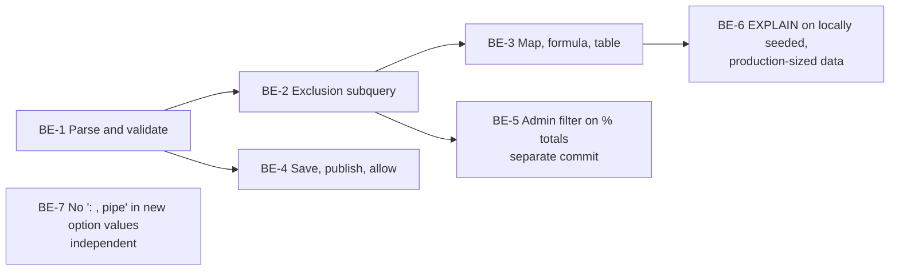

# VIZ-027 Backend: Global dashboard question filter

**Task ID**: VIZ-027 (GitHub [#478](https://github.com/akvo/akvo-mis/issues/478)), backend part
**Parent design**: [VIZ-027-global-question-filter.md](VIZ-027-global-question-filter.md)
**Sibling**: [VIZ-027-frontend-global-question-filter.md](VIZ-027-frontend-global-question-filter.md)
**Branch**: `epic/478-viz-global-question-filter`
**Date**: 2026-10-06
**Status**: Draft

---

## 1. Scope

This document covers **how** the backend implements VIZ-027. The parent
holds the **why**: context, requirements, the API contract, and decisions
D-1 to D-15. Decision IDs (D-x) and findings (A-x) refer to the parent.

The backend owns:

- the `global_criteria` query parameter on four endpoints;
- the exclusion subquery, applied wherever a widget builds its query;
- saving, publishing and allowing `default_filters.questions`;
- the `name` key on builder sources.

Not in this phase: "show only" (`option_in` in `global_criteria`). It
is a later phase, built only if users ask for it (D-13). Phase 1 keeps
it open: the subquery and the parser need no change to add it later.

Line numbers are as of 2026-10-06 on the epic branch. They will drift;
the function names will not.

## 2. What changes, at a glance

| File | Change | Task |
|---|---|---|
| `constants.py` | `GLOBAL_CRITERIA_TYPES` | BE-1 |
| `functions.py` | `option_not_in` in `parse_criteria_string`; family check; exclusion subquery; apply in `get_base_monitoring_qs` | BE-1, BE-2 |
| `dashboard_serializers.py` | `global_criteria` on `ValuesFilterSerializer`, `EscalationFilterSerializer` | BE-1 |
| `serializers.py` | `global_criteria` on `GeoLocationFilterSerializer`, `FormulaValuesSerializer` | BE-1 |
| `dashboard_views.py` | Pass `global_criteria` into `params`; `check_ids` | BE-1, BE-4 |
| `values_functions.py` | `_total_parents_in_scope`, both `handle_count_mode` totals | BE-2 |
| `views.py` | Map and formula: validate early, apply exclusion, `check_ids` | BE-1, BE-3, BE-4 |
| `escalation_functions.py` | `handle_escalation` `parents` query | BE-3 |
| `dashboard_functions.py` | Validate `default_filters.questions` | BE-4 |
| `dashboard_snapshot.py` | Copy label and options into the snapshot | BE-4 |
| `public_scope.py` | `allowlist_from` | BE-4 |
| `dashboard_builder_serializers.py` | `serialize_question` gains `name` | BE-4 |
| `api/v1/v1_forms/functions.py`, `services/xlsform_import.py` | Generated option values drop `:` `,` `\|`; new options carrying them are refused by the builder, JSON-import and XLSForm-import validators | BE-7 |

No migration, no new endpoint, no new model. BE-7 touches the form
builder's save path, not the dashboard code; it can ship on its own.

## 3. Delivery order



BE-1 fixes the contract. The frontend can build against it once BE-1 is
merged (see the sibling document, §3).

---

## 4. Tasks

### BE-1: Parse and validate `global_criteria`

**Goal**: every endpoint accepts `global_criteria`, rejects a bad value
with 400, and hands handlers a parsed list in `params["global_criteria"]`.

**User acceptance criteria**
- [ ] A dashboard that filters on a question from its own form family
      (for example "Is the infrastructure operational?") loads every
      widget normally.
- [ ] An option whose value contains `:` or `,` (for example
      `type_a:_hand_pump` from an older form) can be filtered out like
      any other.
- [ ] A filter on a question from another family ("Does the school have
      a toilet?") or on a question without options ("How many
      households…?") makes the widget show an error. It never shows
      unfiltered numbers as if the filter had applied.
- [ ] A map widget with a bad filter shows an error, not an empty map.
- [ ] Criteria an author set on a single widget in the builder behave
      exactly as before.

**Technical acceptance criteria**
- [ ] The four endpoints accept `global_criteria`. Without it, every
      response is identical to today's.
- [ ] `global_criteria` is a **repeated** parameter, one value per
      occurrence (D-15). Values containing `:`, `,` or `|` are filtered
      correctly.
- [ ] 400 for: a non-integer qid; a missing value segment; an empty
      value (message contains `option_not_in requires a value`); any
      type other than `option_not_in` (including `option_in`, a later
      phase per D-13); a question outside the family; a question that is
      not option or multiple option; more than 50 occurrences. The
      message starts with `global_criteria:`.
- [ ] `option_not_in` inside a widget's `criteria` is a 400.
      `VALID_VALUES_CRITERIA_TYPES` is unchanged.
- [ ] The family check and name grouping take two `Questions` queries
      per request, whatever the number of occurrences.
- [ ] `parse_criteria_string` and widget `criteria` are unchanged.
- [ ] The map returns 400 for a bad `global_criteria`, before its
      serializer. Other invalid map parameters still return `200 []`.
- [ ] Handlers receive `params["global_criteria"]` as a list of
      `{"type", "parts": [qid, values], "form_id", "group"}`, or `None`.
      `group` lists `(qid, form_id)` of the name group (D-14).
- [ ] `GlobalFilterValuesValidationTestCase` and
      `OtherWidgetsValidationTestCase` green.

1. **`constants.py:82`**: add next to `VALID_VALUES_CRITERIA_TYPES`:

   ```python
   # D-10: global only. Never add this to VALID_VALUES_CRITERIA_TYPES:
   # _criterion_matching_ids returns [] for it and the widget would
   # silently show no data.
   GLOBAL_CRITERIA_TYPES = {"option_not_in"}
   ```

2. **Do not use `parse_criteria_string` for `global_criteria`.** It
   splits on `,` and `|`, which option values may contain (D-15). A2 no
   longer applies to the global path. `parse_criteria_string` stays
   unchanged for widget `criteria`.

3. **`functions.py`, new `parse_global_criteria(items, form)`**: one
   function, shared by the four serializers (D-6). `items` is the list
   of occurrences (`QueryDict.getlist`).

   ```python
   MAX_GLOBAL_CRITERIA = 50  # D-15: bounds what a public caller can send


   def parse_global_criteria(items, form):
       """Parse, family-check and group `global_criteria` (D-6, D-10,
       D-14, D-15).

       One occurrence per value: `option_not_in:<qid>:<value>`, split at
       most twice so the value may contain `:`, `,` or `|`. Occurrences
       for the same qid become one criterion whose values are ORed.
       Raises ValueError with a user-facing message.
       """
       if len(items) > MAX_GLOBAL_CRITERIA:
           raise ValueError(
               f"at most {MAX_GLOBAL_CRITERIA} values are allowed"
           )
       values_by_qid = defaultdict(list)
       for item in items:
           parts = item.split(":", 2)
           if len(parts) < 3 or parts[0] not in GLOBAL_CRITERIA_TYPES:
               raise ValueError(f"Invalid global_criteria: '{item}'")
           if not parts[1].isdigit():
               raise ValueError(f"Invalid question id: '{item}'")
           if not parts[2]:
               raise ValueError(f"option_not_in requires a value: '{item}'")
           values_by_qid[int(parts[1])].append(parts[2])

       root_id = form.parent_id or form.id
       family = Q(form_id=root_id) | Q(form__parent_id=root_id)
       picked = {
           q.pk: q for q in Questions.objects.filter(
               family,
               pk__in=values_by_qid,
               type__in=[QuestionTypes.option, QuestionTypes.multiple_option],
           )
       }
       missing = sorted(set(values_by_qid) - set(picked))
       if missing:
           raise ValueError(
               f"question {missing[0]} is not in this form family"
           )
       monitoring_names = {
           q.name for q in picked.values() if q.form_id != root_id
       }
       siblings = defaultdict(list)
       for pk, name, form_id in Questions.objects.filter(
           form__parent_id=root_id, name__in=monitoring_names,
       ).values_list("pk", "name", "form_id"):
           siblings[name].append((pk, form_id))
       return [
           {
               "type": "option_not_in",
               "parts": [qid, values],
               "form_id": picked[qid].form_id,
               "group": (
                   [(qid, picked[qid].form_id)]
                   if picked[qid].form_id == root_id
                   else siblings[picked[qid].name]
               ),
           }
           for qid, values in values_by_qid.items()
       ]
   ```

   A number question or another family's question both land in
   `missing`. `Questions.objects` already hides soft-deleted versions,
   so the group holds live questions only (D-14). Two queries per
   request, whatever the number of occurrences.

   **Public allowlist helper**, in `public_scope.py` next to
   `question_ids_in_criteria`:

   ```python
   def question_ids_in_global_criteria(items):
       """`option_not_in:{qid}:{value}` occurrences -> ids (D-15)."""
       ids = []
       for item in items or []:
           ids.extend(_ints(item.strip().split(":", 2)[1:2]))
       return ids
   ```

4. **The four serializers**: add
   `global_criteria = serializers.ListField(child=serializers.CharField(), required=False)`.
   DRF reads a repeated query key through `getlist`. Validate it in
   `validate()`, where the form is known:

   | Serializer | Line | Form passed to `parse_global_criteria` |
   |---|---|---|
   | `ValuesFilterSerializer` | `dashboard_serializers.py:19` | `form_id` |
   | `EscalationFilterSerializer` | `dashboard_serializers.py:348` | The path form (registration). The view (`dashboard_views.py:404`) passes no context today; add `context={"form_id": form_id}` |
   | `GeoLocationFilterSerializer` | `serializers.py:93` | The path form, via the existing `context={"form_id": ...}` |
   | `FormulaValuesSerializer` | `serializers.py:133` | `form_id` |

   Raise `serializers.ValidationError({"global_criteria": str(e)})`.
   `validate_serializers_message` then produces
   `"global_criteria: question … is not in this form family"`.

5. **Map (D-11), `views.py:263`**: the view answers an invalid
   serializer with `200 []` (line 345). Parse
   `request.query_params.getlist("global_criteria")` with
   `parse_global_criteria` **before** that branch and return 400 on
   `ValueError`. Every other invalid parameter keeps the `200 []`.

6. **Plumbing**: add `"global_criteria": validated.get("global_criteria")`
   to the `params` dict in `visualization_values`
   (`dashboard_views.py:248`) and to the escalation view's params
   (`dashboard_views.py:400`).

**Turns green**: `GlobalFilterValuesValidationTestCase` and
`OtherWidgetsValidationTestCase`.

---

### BE-2: The exclusion subquery

**Goal**: the core of D-1 to D-5, D-8 and D-9, applied to every widget
that goes through `get_base_monitoring_qs`, plus the two denominators
that do not.

**User acceptance criteria**
- [ ] The viewer filters out "Non-operational". Water points 4, 5 and 6
      disappear from every chart on the registration, visit and check
      forms. The water point count goes from 10 to 7.
- [ ] A water point that was broken in January and repaired in March
      stays. A water point that was never checked stays.
- [ ] "No info" bars and percentages count only the water points still
      shown: "% visited" reads 85.71 %, not 60 %.
- [ ] Changing the date range judges each water point on its latest
      check inside that range.
- [ ] A question asked on both the visit and the check form is judged on
      whichever form answered it most recently (D-14). The author can
      pick either form's copy; the result is the same.
- [ ] Filtering out "Rainwater" (a registration question) removes water
      points 8 and 9 whatever the date range. A corrected water source
      takes effect on the next load.
- [ ] Two filters together remove a water point if either one applies.

**Technical acceptance criteria**
- [ ] The exclusion is a subquery inside the widget's own SQL. No id
      list is loaded into Python (`test_filter_runs_inside_the_chart_query`).
- [ ] The subquery selects only registration `FormData.id` or
      `Answers.data_id`, never a nullable column (D-5).
- [ ] The column follows D-3 in all three `get_base_monitoring_qs`
      paths. The exclusion is applied after the administration filter
      and the existing criteria.
- [ ] `_total_parents_in_scope` and both `handle_count_mode` totals
      apply the same exclusion.
- [ ] Registration question: no date filter; answers of pending or
      draft registrations are ignored.
- [ ] Name group (D-14): a monitoring question is judged on the latest
      submission, across every monitoring form with a live question of
      the same `name`, that **answered** it. A newer submission that
      skipped the question does not hide an older answer.
- [ ] The registration form is never part of a name group.
- [ ] Answers to soft-deleted question versions are ignored.
- [ ] The dashboard date question is matched by `name` on each form of
      the group. A form without one uses `created` (D-14, replaces A5).
- [ ] Entries combine with AND: a datapoint is kept only if it passes
      every entry. Options are ORed only **within** one entry. (The WAI
      portal ORs across questions, so two filters widen the result;
      parent §15.)
- [ ] Without `global_criteria`, no subquery is added. The existing
      `tests_values_*` suites stay green unchanged.
- [ ] `FilterOutNonOperationalTestCase` (except the widgets in BE-3)
      and `FilterOutRainwaterTestCase` green.

The code below grew from the prototype that produced the parent's §14
numbers on local data. D-14 changed two things: "latest" spans every
monitoring form in the question's name group and only counts
submissions that answered, and the date question is matched by name.

```python
def _any_option(values):
    """OR of options__contains=[v]. Answers.options is a JSONField, so
    ArrayField lookups such as __overlap do not exist."""
    q = Q()
    for v in values:
        q |= Q(options__contains=[v])
    return q


def _in_date_range(date_filters, form_ids):
    """Q over FormData: inside the dashboard's date range (D-14).

    The date question is matched by NAME on each form of the group. A
    form without a same-named date question uses `created`.
    """
    if not date_filters:
        return Q()
    by_created = Q()
    if date_filters.get("from_date"):
        by_created &= Q(created__date__gte=date_filters["from_date"])
    if date_filters.get("to_date"):
        by_created &= Q(created__date__lte=date_filters["to_date"])
    date_qid = date_filters.get("date_question_id")
    if not date_qid:
        return by_created
    name = Questions.objects.values_list("name", flat=True).get(pk=date_qid)
    date_qids = dict(
        Questions.objects.filter(name=name, form_id__in=form_ids)
        .values_list("form_id", "pk")
    )
    answers = Answers.objects.filter(question_id__in=date_qids.values())
    if date_filters.get("from_date"):
        answers = answers.filter(name__gte=date_filters["from_date"])
    if date_filters.get("to_date"):
        answers = answers.filter(
            name__lte=_to_date_upper_bound(date_filters["to_date"]),
        )
    return (
        Q(form_id__in=date_qids.keys(), pk__in=answers.values("data_id"))
        | (~Q(form_id__in=date_qids.keys()) & by_created)
    )


def excluded_registrations_subquery(criterion, root_form_id, date_filters):
    """Lazy queryset of registration FormData ids to exclude.

    Never NULL: it selects FormData.id / Answers.data_id, both NOT NULL.
    Never selects a child's parent_id (D-5: one NULL empties every chart).
    Ignores Answers.index, so any matching repeat excludes (D-9).
    """
    values = criterion["parts"][1]
    group = criterion["group"]  # [(qid, form_id), ...], live, same name
    qids = [qid for qid, _ in group]
    form_ids = {form_id for _, form_id in group}
    matching = Answers.objects.filter(
        _any_option(values), question_id__in=qids,
    )
    if form_ids == {root_form_id}:
        # D-8: the registration answer itself; no "latest", no dates.
        return matching.filter(
            data__is_pending=False, data__is_draft=False,
        ).values("data_id")
    # D-14: the latest submission, across the group's forms, that
    # answered one of the group's questions, inside the date range.
    answered = Answers.objects.filter(question_id__in=qids)
    latest_answered = (
        FormData.objects.filter(
            _in_date_range(date_filters, form_ids),
            parent=OuterRef("pk"),
            form_id__in=form_ids,
            is_pending=False,
            is_draft=False,
            pk__in=answered.values("data_id"),
        )
        .order_by("-created", "-id")
        .values("id")[:1]
    )
    return FormData.objects.filter(
        form_id=root_form_id, parent__isnull=True,
    ).annotate(
        latest_id=Subquery(latest_answered),
    ).filter(
        latest_id__in=matching.values("data_id"),
    ).values("id")


def apply_global_exclusions(qs, column, root_form_id, params):
    """qs minus every registration a global criterion excludes (D-3)."""
    date_filters = build_date_filters(params)
    for criterion in params.get("global_criteria") or []:
        qs = qs.exclude(**{
            f"{column}__in": excluded_registrations_subquery(
                criterion, root_form_id, date_filters,
            ),
        })
    return qs
```

`latest_monitoring_subquery` is not reused here: it takes one form and
picks the latest submission whether or not it answered. `-id` breaks
ties between submissions created in the same instant.

**Wire it in** (column per D-3):

| Location | Line | Rows | Column |
|---|---|---|---|
| `get_base_monitoring_qs`, latest branch | `functions.py:372`, before `return` | Registrations annotated with `latest_id` | `id` |
| `get_base_monitoring_qs`, other branch, monitoring form | same function | Monitoring submissions | `parent_id` |
| `get_base_monitoring_qs`, other branch, registration form | same function | Registrations | `id` |
| `_total_parents_in_scope` | `values_functions.py:140` | Registrations ("No info" total) | `id` |
| `handle_count_mode`, first percentage total | `values_functions.py:191` | Registrations | `id` |
| `handle_count_mode`, second percentage total | `values_functions.py:214` | Registrations | `id` |

In `get_base_monitoring_qs`, `root_form_id` is `parent_form.id`, which the
function already computes. Apply the exclusion **after** the
administration filter and the existing criteria, so it only ever removes
rows (parent §9).

**Do not** load ids into Python. `narrow_data_ids_by_criteria` and
`apply_parent_criteria_to_qs` do, and must not be copied (D-1). The
query-shape test fails if the status match shows up outside a
`NOT (… IN (SELECT …))`.

**Turns green**: `FilterOutNonOperationalTestCase` (except map, table,
formula and scatter, which are BE-3) and `FilterOutRainwaterTestCase`.

---

### BE-3: Endpoints that build their own query

**Goal**: the map, formula (map status colours) and table drop the same
registrations. Scatter needs nothing: it calls `get_base_monitoring_qs`.

**User acceptance criteria**
- [ ] Map: the pins of water points 4, 5 and 6 disappear; site 10, never
      checked, keeps its pin.
- [ ] Map colours: filtered-out water points get no colour. Every other
      pin keeps the colour of its own latest visit.
- [ ] A map of visit points drops the visits of filtered-out water
      points.
- [ ] Table: rows 4, 5 and 6 are gone, and the total and the page
      count reflect it.
- [ ] Scatter: the points of 4, 5 and 6 are gone.

**Technical acceptance criteria**
- [ ] The map excludes on `id`, or on `parent_id` when the path form is
      a monitoring form (D-12).
- [ ] Formula applies the exclusion before the latest-per-parent pick in
      Python.
- [ ] Table: `count` reflects the exclusion, and the `next` / `previous`
      links keep `global_criteria`.
- [ ] All three call `apply_global_exclusions`. None of them has its
      own copy of the subquery.
- [ ] `FilterOutNonOperationalOnOtherWidgetsTestCase` green.
      `tests_geolocation_*`, `tests_formula_values` and
      `tests_visualization_escalation` stay green.

| Endpoint | Where | Rows | Column | Note |
|---|---|---|---|---|
| Map | `views.py:263` `GeolocationListView.get`, on `queryset` right after `form.form_form_data.filter(...)` | The path form's datapoints | `id`; `parent_id` if the path form is a monitoring form (D-12) | Root is `form.parent_id or form.id` |
| Formula | `views.py:487` `visualization_values_formula`, on `qs` after the criteria and dates | Registrations, or monitoring submissions | `id` / `parent_id` (D-12) | **Before** the latest-per-parent pick in Python, or a filtered-out site's older submission could become its "latest" |
| Table | `escalation_functions.py:230` `handle_escalation`, on `parents` after the administration filter | Registrations with `latest_id` | `id` | |

Each of these builds its own `params`-like dict or reads
`validated_data`. Pass the parsed `global_criteria` and the date fields
to `apply_global_exclusions` in the same shape `build_date_filters`
reads.

**Turns green**: `FilterOutNonOperationalOnOtherWidgetsTestCase`.

---

### BE-4: Save, publish, allow

**Goal**: the author's choice of filter questions is checked on save,
reaches viewers on publish, and is the only thing a public viewer may
filter on.

**User acceptance criteria**
- [ ] An author can save a dashboard that offers "Is the infrastructure
      operational?" and "What is the water source?" as filters.
- [ ] Saving a filter on a school question, on a number question, or
      under the wrong form is refused with a message. Nothing is saved.
- [ ] Dashboards without filter questions save and display exactly as
      before.
- [ ] After Publish, the filter bar shows the question and option labels
      as they were at publish time. Later form edits appear only after
      the next Publish.
- [ ] A weather question asked on two forms shows each value once; a
      value labelled "Fine" on one form and "Clear sky" on the other
      shows as "Fine / Clear sky".
- [ ] A public viewer can use every filter the dashboard offers. Any
      other question is refused.
- [ ] The builder can tell that "What is the water source?" is asked on
      both the registration and the visit form.
- [ ] If a filter question is deleted after Publish, it disappears from
      the filter bar and every widget keeps loading.

**Technical acceptance criteria**
- [ ] `validate_dashboard_payload` returns the error `field`s in the
      table below. It validates `default_filters.questions` only, and a
      refused save leaves the stored dashboard unchanged.
- [ ] The family is resolved with `Forms.objects.for_user(user)`, the
      same rule as `serialize_sources`.
- [ ] `build_snapshot` writes `{question, form, label, options}`. For a
      name group, `options` is the union by `value` with labels joined by
      " / " (D-14). All filter questions and their group siblings are
      fetched in one query with a prefetch: no N+1.
- [ ] `allowlist_from` includes every filter question id and keeps the
      `- {None}` guard.
- [ ] All four `check_ids` calls include the `global_criteria` qids, and
      run before any data query.
- [ ] `serialize_question` returns `name`.
- [ ] `retrieve` drops filter questions that are no longer live, in one
      query; the stored snapshot is not modified.
- [ ] Embed dashboards are unaffected: their `default_filters` stays
      `{}`.
- [ ] `FilterQuestionsConfigTestCase` and `PublicViewerFilterTestCase`
      green. `tests_dashboard_validation`, `tests_dashboard_snapshot`,
      `tests_public_scope` and `tests_dashboard_sources` stay green.

1. **Save, `dashboard_functions.py:229` `validate_dashboard_payload`**.
   Today `default_filters` is stored unchecked
   (`dashboard_builder_views.py:284-287` on create, `:321-324` on
   update). Validate `default_filters.questions` only:

   | Input | Error `field` |
   |---|---|
   | Not a list | `default_filters.questions` |
   | Entry not `{question, form}` with integer ids | `default_filters.questions[i]` |
   | Unknown question | `default_filters.questions[i].question` |
   | Not option or multiple option | `default_filters.questions[i].question` |
   | Not on `root_form` or one of its child forms | `default_filters.questions[i].question` |
   | `form` is not the question's form | `default_filters.questions[i].form` |

   On create, `root_form` comes from the payload; on update, from the
   dashboard. Use `Forms.objects.for_user(user)` for the children, as
   the existing family rule and `serialize_sources` do ("two barriers,
   one rule"). The tests only require the prefix
   `default_filters.questions`.

2. **Publish, `dashboard_snapshot.py:19` `build_snapshot`**: replace
   `default_filters` with a copy whose `questions` entries are enriched:

   ```python
   {"question": 700301, "form": 7003,
    "label": "Is the infrastructure operational?",
    "options": [{"value": "operational", "label": "Operational"},
                {"value": "non_operational", "label": "Non-operational"}]}
   ```

   Build `label` and `options` with `serialize_question`
   (`dashboard_builder_serializers.py:134`) so the snapshot and
   `/sources` share one shape. For a monitoring question, `options` is
   the union over its name group (D-14): one entry per `value`; labels
   that differ are joined with " / ", the picked question's first;
   order is the picked question's, then values found only on other
   forms. `label` (the question text) stays the picked question's. Fetch all filter questions in one query
   with the same `Prefetch` ordering `serialize_source_form` uses. A
   question deleted before Publish is left out of the snapshot; one
   deleted after Publish is handled at read time (step 6).

3. **Allow, `public_scope.py:55` `allowlist_from`**: add every
   `published_config.default_filters.questions[].question` to
   `questions`, the way `date.date_question` and the widgets' own
   questions are added. Use `_as_id` and keep the `- {None}` guard.

4. **`check_ids`**: add
   `*question_ids_in_global_criteria(request.query_params.getlist("global_criteria"))`
   to `question_ids` at all four calls: `dashboard_views.py:229`
   (values), `dashboard_views.py:422` (escalation), `views.py:330` (map),
   `views.py:522` (formula). The helper is defined in BE-1 step 3; it
   splits at most twice, like the parser (D-15).

5. **Sources, `serialize_question`**: add `"name": question.name` (A4).

6. **Read, `dashboard_read_views.py:207` `retrieve`** (decided
   2026-10-06): a filter question can be deleted at any time after
   Publish. Drop entries whose question is no longer live from
   `row["default_filters"]["questions"]` as the dashboard is served, as
   `annotate_broken` does for widgets ("annotated as it is served,
   never baked in at publish time"). One query, scoped by tenant like
   `annotate_broken`. The bar then shows one filter fewer and the
   dashboard keeps working.

**Turns green**: `FilterQuestionsConfigTestCase` and
`PublicViewerFilterTestCase`.

---

### BE-5: Administration filter on percentage totals (separate commit)

**Goal**: percentage KPIs respect the administration filter.

**User acceptance criteria**
- [ ] A viewer who picks an administration sees "% of water points
      visited" out of that administration's water points, not out of all
      water points.

**Technical acceptance criteria**
- [ ] Both `handle_count_mode` totals apply `apply_administration_filter`.
- [ ] A new test in `tests_values_count.py` fails before the fix and
      passes after.
- [ ] Its own commit, after BE-2. The VIZ-027 tests stay green.

Both `handle_count_mode` totals (`values_functions.py:191`, `:214`)
ignore `administration_id`, a bug that predates VIZ-027. BE-2 adds the
global exclusion there. Fix the administration filter in its own commit
so the history separates the two. Add a test in
`tests_values_count.py`, not in the VIZ-027 files.

### BE-6: Measure before caching

**Goal**: know what the filter costs before adding a cache or an index.

**User acceptance criteria**
- [ ] A filtered dashboard loads about as fast as an unfiltered one.
      Threshold: on production-sized data, a widget request with one
      filter takes no more than 20 % longer than without.

**Technical acceptance criteria**
- [ ] `EXPLAIN (ANALYZE, BUFFERS)` captured on locally seeded,
      production-sized data for the five requests in step 3 below.
- [ ] Each plan runs the exclusion as a semi-join or a hashed subplan,
      with no sequential scan of `answer` per outer row.
- [ ] Results recorded in the parent's §11.
- [ ] The threshold lives in this document only: no setting in
      `settings.py` or `.env` (decided 2026-10-06).
- [ ] A cache (D-1) or a GIN index on `Answers.options` is added only if
      the threshold is exceeded, and as a separate task. A further known
      shape is the WAI portal's `answer_search`: one `"<qid>||<value>"`
      array per datapoint, GIN-indexed (parent §15).

**Why local, seeded data** (decided 2026-10-06). The deployment runs the
same containers as local development, so the infrastructure is not what
differs. Data volume is, and it decides the query plan. Local has 213
registrations (at most 121 in one form), 412 monitoring submissions and
25,620 answers, where everything fits in memory; the 0.45 ms measured
for A6 says little. The subquery runs once per registration, and D-14
made it heavier: a join to `answer` for "answered", and dates by name.

**Steps**:
1. Create a dedicated workspace whose only form family is the one to
   measure. `fake_complete_data_seeder` seeds every root form of a
   tenant (`--repeat` registrations per form, `--monitoring` submissions
   per child form), so a dedicated tenant keeps the volume where it
   counts.
2. Seed a production-like scenario. Until real figures arrive: 10,000
   registrations × 5 submissions on each of two monitoring forms.
3. Run `EXPLAIN (ANALYZE, BUFFERS)` on: `/values` latest with a
   monitoring-question filter; `/values` all submissions; a
   registration-question filter; a name-group filter with a date
   question; the map.
4. Compare each with the same request without `global_criteria`.
5. `fake_complete_data_seeder --clean --tenant <name>`, then remove the
   tenant.

No production access is needed. BE-6 runs after BE-3, against the real
code, not a prototype.

### BE-7: New option values never contain `:`, `,` or `|` (D-15)

**Goal**: an option value created from now on cannot contain a criteria
delimiter: `:`, `,` or `|`. Enforced in the backend alone, at every
entry point, so the form editor library does not need to change
(decided 2026-10-06; FE-6 deferred).

**User acceptance criteria**
- [ ] An author who imports a form with options labelled "Type A: hand
      pump" and "Yes, partly" and no explicit values gets
      `type_a_hand_pump` and `yes_partly`.
- [ ] An author who saves a form in the builder with an option code such
      as `type_a:_hand_pump` (the editor generates it from the label
      "Type A: hand pump") sees an error naming the question, the option
      and the code, for example: *Option "Type A: hand pump" in "Pump
      type": code `type_a:_hand_pump` may not contain ":", "," or "|".*
      After editing the code to `type_a_hand_pump`, the save succeeds.
- [ ] The same error appears when importing a JSON or XLSForm file that
      carries such a code.
- [ ] Every existing form, answer and dependency rule keeps working
      exactly as before. A form that already has such a code can still
      be edited and saved.

**Technical acceptance criteria**
- [ ] One helper, `option_value_from_label(label)`, replaces the four
      inline fallbacks `re.sub(r"\s+", "_", str(label).lower())` in
      `backend/api/v1/v1_forms/functions.py` (lines 204, 587, 1678,
      1910):

      ```python
      def option_value_from_label(label):
          """D-15: lower-case, remove `:` `,` `|`, whitespace runs -> `_`."""
          cleaned = re.sub(r"[:,|]", "", str(label).lower())
          return re.sub(r"\s+", "_", cleaned.strip())
      ```
- [ ] One check, `option_value_issue(value)`, returns a message when a
      value contains `:`, `,` or `|`, and is called by all three
      validators. Nothing is rewritten: dependency rules store option
      values (D-15).

      | Entry point | Validator | Error shape |
      |---|---|---|
      | Builder create and update, draft and published (`views.py:711`, `:768`) | `validate_form_payload` (`functions.py:732`), extended from `question_group[gi].question[qi]` down to `option[oi].value` | `{"message": "<first error>"}`, shown as a toast by `FormBuilderEdit.jsx:109` |
      | JSON import (`import_preflight`, `views.py:1093`) | `validate_form_definition` (`functions.py:1069`) | `{code, path, message, level: "error"}` |
      | XLSForm import (`views.py:1236`, `:1438`) | `validate_preflight` (`services/xlsform_import.py:1094`) | its existing error list |
- [ ] **Only new options are refused.** On update, a `(question id,
      value)` pair that already exists in the database is accepted
      whatever it contains; the validator receives those pairs in one
      query. On create and import, nothing exists yet.
- [ ] Options that already exist keep their value. Nothing rewrites
      stored values; no data migration.
- [ ] The message names the question label, the option label and the
      code.
- [ ] Tests in `api/v1/v1_forms/tests/`: the helper ("Type A: hand
      pump", "Yes, partly", "a | b"); a form imported with such labels
      and no values; builder create with `a:b`, `a,b`, `a|b` → 400 with
      the message; builder update of a form whose existing option is
      `a:b` → 200; JSON and XLSForm imports with `a:b` → error.

---

## 5. Tests

The tests are already written and fail until the code lands.

| File | Class | Task | Now |
|---|---|---|---|
| `tests/global_filter_mixin.py` | `GlobalFilterTestMixin`: the fixture | — | — |
| `tests/tests_global_filter_values.py` | `GlobalFilterFixtureTestCase` | — | Green (fixture sanity) |
| | `FilterOutNonOperationalTestCase` | BE-2 | Red |
| | `FilterOutRainwaterTestCase` | BE-2 | Red |
| | `GlobalFilterValuesValidationTestCase` | BE-1 | Red |
| | `FilterOutRainyAcrossFormsTestCase` (name group, D-14) | BE-1, BE-2 | Red |
| `tests/tests_global_filter_endpoints.py` | `FilterOutNonOperationalOnOtherWidgetsTestCase` | BE-3 | Red |
| | `OtherWidgetsValidationTestCase` | BE-1, D-11 | Red (one guard green) |
| `tests/tests_global_filter_dashboard.py` | `FilterQuestionsConfigTestCase` | BE-4 | Red (two guards green) |
| | `PublicViewerFilterTestCase` | BE-1, BE-4 | Red |
| | `DeletedFilterQuestionTestCase` | BE-4 step 6 | Red |
| | `FilterQuestionsConfigTestCase.test_snapshot_merges_a_name_group` | BE-4 (D-14 options) | Red |

Today (2026-10-06): 69 tests. 9 pass (5 fixture checks, 4 guards that
must stay green); the 60 feature tests are marked `@pending("<task>")`
and reported as skipped, so CI stays green: `OK (skipped=60)`, and the
whole backend suite is `OK` under `--shuffle --parallel 4`.

**`@pending` (in `global_filter_mixin.py`).** Each feature test, or its
whole class, is marked with the task that makes it pass, for example
`@pending("BE-2")`. A failing assertion becomes a skip; a test that
passes while still marked **fails the run** with "BE-2 landed: remove
@pending". Remove the markers for a task in the commit that implements
it. Plain `unittest.expectedFailure` is not enough here: Django 4.0's
runner does not count an unexpected success, so a stale marker would
pass CI unnoticed.

### Test changes for D-15 (made 2026-10-06)

The test files use the repeated-parameter grammar:

| Where | Change |
|---|---|
| `global_filter_mixin.py` `filter_out(qid, *values)` | Return a **list**, one `option_not_in:<qid>:<value>` per value. Callers combining two filters concatenate lists instead of joining with `,` |
| `tests_global_filter_values.py`, validation class | Empty value message becomes `option_not_in requires a value`. Add: 51 occurrences → 400 |
| New test | An option value containing `:` and `,` (for example `pump:_broken,_leaking`) is filtered out correctly; a value containing `|` too |
| `tests_global_filter_endpoints.py` | Map, table and formula requests send the list; the Django test client repeats the key |
| `tests_global_filter_dashboard.py`, public class | Same list form; the allowlist test covers `question_ids_in_global_criteria` |
| New `api/v1/v1_forms/tests/` test (BE-7), **still to write** with BE-7 | Generated values drop `:` `,` `\|`; builder create with `a:b`, `a,b`, `a\|b` → 400; builder update keeps an existing `a:b`; JSON and XLSForm import refuse `a:b` |

### The fixture

Ten water points in one family. Read the table in
`global_filter_mixin.py`'s docstring before changing a number.

| Form | Question | Options |
|---|---|---|
| Water point registration | "What is the water source?" | Ground water, Surface water, Rainwater |
| Water quality visit | "Were you able to take a water sample?" | Yes, No |
| | "How many households use this water point?" / "Date of visit" | number / date |
| | "What is the water source?", same `name` (D-8) | Ground water, Surface water, Rainwater |
| Quick status check | **"Is the infrastructure operational?"** (the filter) | Operational, Non-operational |
| | "What is the weather during the check?" | Fine, Rainy |
| School registration (another family) | "Does the school have a toilet?" | Yes, No |

| Site | Water source | Visits: sample taken? | Checks: infrastructure |
|---|---|---|---|
| 1, 2 | Ground water | Yes 02-15 | Operational 03-10 |
| 3 | Ground water | Yes 02-15 | **Non-operational 01-10**, Operational 03-10 (repaired) |
| 4 | Ground water | Yes 02-15, **No 02-20** | **Operational 01-10**, Non-operational 03-10 (broke) |
| 5 | Ground water | Yes 02-15 | Non-operational 01-20 (only check) |
| 6 | Ground water | Yes 02-15 | Non-operational 03-10 (only check) |
| 7 | Surface water | Yes 02-15 | Operational 03-10 |
| 8, 9 | Rainwater | Yes 02-15 | Operational 03-10 |
| 10 | — | never visited | never checked |

All dates 2025; site 8 was registered 2024-12-01, the rest 2025-01-01.

### Expected results

**Filter out "Non-operational"**: water points **4, 5, 6** leave every
chart.

| If… | Then… |
|---|---|
| No date range | 4, 5, 6 filtered out |
| Number of water points (KPI) | 10 → 7 |
| Water source chart | Ground water 6 → 3; Surface water 1; Rainwater 2 |
| Water source "No info" | 1 (site 10). 4, 5, 6 do **not** move into "No info" |
| % of water points visited (both totals) | 90.0 → 85.71 (6 of 7, not 6 of 10) |
| Sample taken, latest / all visits | Yes 8, No 1 → Yes 6, No 0 / Yes 9, No 1 → Yes 6, No 0 |
| Weather, all checks (D-2) | Fine 11 → 7: site 4's January Operational check goes too |
| Infrastructure, all checks (D-2 consequence) | Non-operational 4 → **1** (site 3's January check); Operational 7 → 6 |
| Site 3 (repaired) / site 10 (never checked) | Both stay (D-4 / D-5) |
| Range ends 02-28 | 3, 5 out |
| Range starts 02-01 | 4, 6 out; site 5 stays (its breakdown is outside the range) |
| Date question "Date of visit", all of 2025 (A5) | 4, 5, 6 out |
| Site 11: latest check has Operational and Non-operational repeats | Out (D-9) |
| Also filter out Surface water | 4, 5, 6, 7 out |
| Map, table, status colours, scatter | Each drops 4, 5, 6 |

**Filter out "Rainwater"** (registration question): **8, 9** leave
every chart, whatever the date range. Correcting site 9 to Ground water
brings it back. A Rainwater answer on the visit's same-named question
does not exclude site 1.

### Running

```bash
./dc.sh exec backend python manage.py test \
  api.v1.v1_visualization.tests.tests_global_filter_values \
  api.v1.v1_visualization.tests.tests_global_filter_endpoints \
  api.v1.v1_visualization.tests.tests_global_filter_dashboard
./dc.sh exec backend flake8
```

Do not use `self.subTest` in these tests. Under `--parallel`, Django
4.0 pickles a **failing** subTest together with the test case, whose
API client holds unpicklable middleware, and the whole run crashes with
`PicklingError` instead of reporting the failure. Assert on a dict
instead, as `OtherWidgetsValidationTestCase.assert_all_status` does.

Before trusting a run, check that the container sees the file you just
edited. On 2026-10-05 the backend container kept serving an old copy
after an edit:

```bash
md5sum backend/<path>; docker exec akvo-mis-backend-1 md5sum /app/<path>
```

If they differ, delete the file and write it again.

---

## 6. Definition of done

- [ ] Every task's user and technical acceptance criteria (§4) are
      ticked.
- [ ] All VIZ-027 backend tests green, including the 9 that are green
      today, and no `@pending` marker left in the VIZ-027 test files.
- [ ] Full suite green: `coverage run … manage.py test --shuffle --parallel 4`.
      In particular `tests_values_criteria.py`, `tests_public_scope.py`
      and `tests_dashboard_validation.py` are unchanged and green: widget
      `criteria` behave as before.
- [ ] `flake8` clean.
- [ ] No new `list(...values_list(...))` on the exclusion path.
- [ ] BE-5 is its own commit.
- [ ] BE-7 tests green, and the `v1_forms` suite stays green.
- [ ] BE-6 result recorded in the parent's §11.

## 7. Open points for this part

- **Deleted filter question**: decided, BE-4 step 6. A stale
  `global_criteria` still naming the deleted question gets a 400 from
  the family check; that only affects a viewer whose page loaded before
  the deletion.
- **Option values containing `:`, `,` or `|`** break the grammar (parent
  §11). Run this once against production before release:

  ```sql
  -- QuestionTypes.option = 5, multiple_option = 6. Tables are in the
  -- public schema.
  SELECT q.form_id, q.id, q.name, o.value FROM option o
  JOIN question q ON q.id = o.question_id
  WHERE o.value ~ '[:,|]' AND q.type IN (5, 6);
  ```

  Run locally on 2026-10-06: 0 rows out of 1,211 option values.
