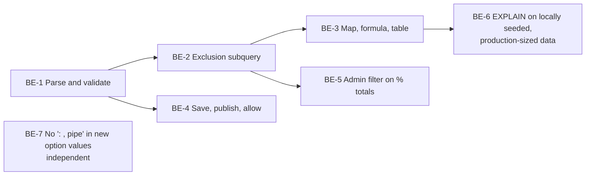

# VIZ-027 Backend: Global dashboard question filter

**Task ID**: VIZ-027 (GitHub [#478](https://github.com/akvo/akvo-mis/issues/478)), backend part
**Parent design**: [VIZ-027-global-question-filter.md](VIZ-027-global-question-filter.md)
**Sibling**: [VIZ-027-frontend-global-question-filter.md](VIZ-027-frontend-global-question-filter.md)
**Branch**: `epic/478-viz-global-question-filter`
**Date**: 2026-10-06
**Status**: Implemented 2026-10-06: BE-1 to BE-5 and BE-7. BE-8
(dashboard date question, D-18) implemented 2026-10-07. BE-9
(filters by form and name, D-20) implemented 2026-10-07. BE-10 (show
only, `global_match`, D-21) implemented 2026-10-07; measured over the
20 % threshold (follow-up task, see BE-10). BE-6 measured: cases 1 to 4 within the threshold, the map over it (follow-up task).

---

## 1. Scope

This document covers **how** the backend implements VIZ-027. The parent
holds the **why**: context, requirements, the API contract, and decisions
D-1 to D-15. Decision IDs (D-x) and findings (A-x) refer to the parent.

The backend owns:

- the `global_criteria` query parameter on four endpoints;
- the exclusion subquery, applied wherever a widget builds its query;
- saving, publishing and allowing `default_filters.questions`;
- the `name` key on builder sources.

"Show only" (`option_in`) and `global_match`, first deferred (D-13),
were added on 2026-10-07 as BE-10 (D-21): the filter bar sends
`option_in`, as the WAI portal does.

Line numbers are as of 2026-10-06 on the epic branch. They will drift;
the function names will not.

## 2. What changes, at a glance

| File | Change | Task |
|---|---|---|
| `constants.py` | `GLOBAL_CRITERIA_TYPES` | BE-1 |
| `functions.py` | `parse_global_criteria` and `parse_request_global_criteria` (family check, name groups); exclusion subquery; apply in `get_base_monitoring_qs` | BE-1, BE-2 |
| `dashboard_views.py` | Parse `global_criteria` after `check_ids`, pass it into `params` | BE-1, BE-4 |
| `values_functions.py` | `_total_parents_in_scope`, both `handle_count_mode` totals | BE-2 |
| `views.py` | Map and formula: validate early, apply exclusion, `check_ids` | BE-1, BE-3, BE-4 |
| `escalation_functions.py` | `handle_escalation` `parents` query | BE-3 |
| `dashboard_functions.py` | Validate `default_filters.questions` | BE-4 |
| `dashboard_snapshot.py` | Copy label and merged options into the snapshot; `live_filter_questions` on read | BE-4 |
| `dashboard_read_views.py` | `retrieve` drops filter questions that are no longer filterable | BE-4 |
| `public_scope.py` | `Allowlist.filter_questions`, `allowlist_from`, `check_ids(filter_question_ids=...)`, `question_ids_in_global_criteria` | BE-1, BE-4 |
| `dashboard_builder_serializers.py` | `serialize_question` gains `name` | BE-4 |
| `api/v1/v1_forms/functions.py`, `services/xlsform_import.py` | Generated option values drop `:` `,` `\|`; new options carrying them are refused by the builder, JSON-import and XLSForm-import validators | BE-7 |

No migration, no new endpoint, no new model. BE-7 touches the form
builder's save path, not the dashboard code; it can ship on its own.

## 3. Delivery order



BE-1 fixes the contract. The frontend can build against it once BE-1 is
merged (see the sibling document, §3).

---

## 4. Tasks

### BE-1: Parse and validate `global_criteria`

**Goal**: every endpoint accepts `global_criteria`, rejects a bad value
with 400, and hands handlers a parsed list in `params["global_criteria"]`.

**User acceptance criteria**
- [x] A dashboard that filters on a question from its own form family
      (for example "Is the infrastructure operational?") loads every
      widget normally.
- [x] An option whose value contains `:` or `,` (for example
      `type_a:_hand_pump` from an older form) can be filtered out like
      any other.
- [x] A filter on a question from another family ("Does the school have
      a toilet?") or on a question without options ("How many
      households…?") makes the widget show an error. It never shows
      unfiltered numbers as if the filter had applied.
- [x] A map widget with a bad filter shows an error, not an empty map.
- [x] Criteria an author set on a single widget in the builder behave
      exactly as before.

**Technical acceptance criteria**
- [x] The four endpoints accept `global_criteria`. Without it, every
      response is identical to today's.
- [x] `global_criteria` is a **repeated** parameter, one value per
      occurrence (D-15). Values containing `:`, `,` or `|` are filtered
      correctly.
- [x] 400 for: a non-integer qid; a missing value segment; an empty
      value (message contains `option_not_in requires a value`); any
      type other than `option_not_in` (`option_in` too, until BE-10
      allowed it, D-21); a question outside the family; a question that is
      not option or multiple option; more than 50 occurrences. The
      message starts with `global_criteria:`.
- [x] `option_not_in` inside a widget's `criteria` is a 400.
      `VALID_VALUES_CRITERIA_TYPES` is unchanged.
- [x] The family check and name grouping take two `Questions` queries
      per request, whatever the number of occurrences.
- [x] `parse_criteria_string` and widget `criteria` are unchanged.
- [x] The map returns 400 for a bad `global_criteria`, before its
      serializer. Other invalid map parameters still return `200 []`.
- [x] Handlers receive `params["global_criteria"]` as a list of
      `{"type", "parts": [qid, values], "form_id", "group"}`, or `None`.
      `group` lists `(qid, form_id)` of the name group (D-14).
- [x] `GlobalFilterValuesValidationTestCase` and
      `OtherWidgetsValidationTestCase` green.

1. **`constants.py:82`**: add next to `VALID_VALUES_CRITERIA_TYPES`:

   ```python
   # D-10: global only. Never add this to VALID_VALUES_CRITERIA_TYPES:
   # _criterion_matching_ids returns [] for it and the widget would
   # silently show no data.
   GLOBAL_CRITERIA_TYPES = {"option_not_in"}
   ```

2. **Do not use `parse_criteria_string` for `global_criteria`.** It
   splits on `,` and `|`, which option values may contain (D-15). A2 no
   longer applies to the global path. `parse_criteria_string` stays
   unchanged for widget `criteria`.

3. **`functions.py`, `parse_global_criteria(items, form)`** and its
   request wrapper `parse_request_global_criteria(request, form)`, shared
   by the four views (D-6). `items` is the list of occurrences
   (`QueryDict.getlist`). `MAX_GLOBAL_CRITERIA = 50` and
   `GLOBAL_CRITERIA_TYPES` live in `constants.py`; `OPTION_TYPES` is
   `[option, multiple_option]`. As built:

   ```python
   def parse_global_criteria(items, form):
       """Parse, family-check and group `global_criteria` (D-6, D-10, D-14,
       D-15).

       `items` holds one `option_not_in:<qid>:<value>` per value, split at
       most twice so the value may contain `:`, `,` or `|`. Occurrences for
       the same qid become one criterion whose values are ORed. Each
       criterion carries its name group: the picked question, plus, for a
       monitoring question, every live option question of the same `name` on
       the family's monitoring forms. Raises ValueError with a user-facing
       message.
       """
       if len(items) > MAX_GLOBAL_CRITERIA:
           raise ValueError(
               f"at most {MAX_GLOBAL_CRITERIA} values are allowed"
           )
       values_by_qid = defaultdict(list)
       for item in items:
           parts = item.split(":", 2)
           if len(parts) < 3 or parts[0] not in GLOBAL_CRITERIA_TYPES:
               raise ValueError(f"invalid entry: '{item}'")
           if not parts[1].isdigit():
               raise ValueError(f"invalid question id: '{item}'")
           if not parts[2]:
               raise ValueError(f"option_not_in requires a value: '{item}'")
           values_by_qid[int(parts[1])].append(parts[2])

       root_id = form.parent_id or form.id
       family = Q(form_id=root_id) | Q(
           form__parent_id=root_id, form__deleted_at__isnull=True,
       )
       picked = {
           q.pk: q for q in Questions.objects.filter(
               family, pk__in=list(values_by_qid), type__in=OPTION_TYPES,
           )
       }
       missing = sorted(set(values_by_qid) - set(picked))
       if missing:
           raise ValueError(
               f"question {missing[0]} is not in this form family"
           )
       monitoring_names = {
           q.name for q in picked.values() if q.form_id != root_id
       }
       siblings = defaultdict(list)
       if monitoring_names:
           for pk, name, form_id in Questions.objects.filter(
               form__parent_id=root_id,
               form__deleted_at__isnull=True,
               name__in=monitoring_names,
               type__in=OPTION_TYPES,
           ).values_list("pk", "name", "form_id"):
               siblings[name].append((pk, form_id))
       return [
           {
               "type": "option_not_in",
               "parts": [qid, values],
               "form_id": picked[qid].form_id,
               "group": (
                   [(qid, picked[qid].form_id)]
                   if picked[qid].form_id == root_id
                   else siblings[picked[qid].name]
               ),
           }
           for qid, values in values_by_qid.items()
       ]


   def parse_request_global_criteria(request, form):
       """VIZ-027: the request's `global_criteria`, parsed against `form`.

       Call it AFTER check_ids and the tenant-scoped form lookup, never from
       a serializer. It reads `getlist("global_criteria")`, the same list
       check_ids saw. A DRF ListField would also accept
       `global_criteria[0]=...`, which check_ids never sees: that would let an
       anonymous caller filter on a question the dashboard does not offer.

       Returns (criteria, None), (None, None) when absent, or
       (None, "global_criteria: <reason>") for a 400.
       """
       items = request.query_params.getlist("global_criteria")
       if not items:
           return None, None
       try:
           return parse_global_criteria(items, form), None
       except ValueError as error:
           return None, f"global_criteria: {error}"
   ```

   A number question or another family's question both land in
   `missing`. `Questions.objects` already hides soft-deleted versions,
   so the group holds live questions only (D-14). Two queries per
   request, whatever the number of occurrences.

   **Public allowlist helper**, in `public_scope.py` next to
   `question_ids_in_criteria`:

   ```python
   def question_ids_in_global_criteria(items):
       """`option_not_in:{qid}:{value}` occurrences -> ids (VIZ-027 D-15).

       One occurrence per value, split at most twice and without stripping,
       exactly as `functions.py:parse_global_criteria` reads it, so the two
       cannot disagree about which question an occurrence names.
       """
       ids = []
       for item in items or []:
           ids.extend(_ints(item.split(":", 2)[1:2]))
       return ids
   ```

4. **Parse in the view, never in a serializer** (as built, after code
   review). Each of the four views calls
   `parse_request_global_criteria(request, form)` (`functions.py`)
   **after** `check_ids` and the tenant-scoped form lookup, and answers
   `{"message": "global_criteria: <reason>"}` with 400 on failure. No
   serializer declares a `global_criteria` field.

   Two review findings drove this:
   - **Allowlist bypass (high).** DRF's `ListField` also reads
     `global_criteria[0]=...`, which `check_ids` (reading
     `getlist("global_criteria")`) never saw. An anonymous caller could
     filter on a question the dashboard does not offer. Now the parser
     and `check_ids` read the same `getlist`, and nothing reads the
     bracketed key: `test_a_bracketed_key_is_ignored_not_trusted`.
   - **Cross-tenant hint (medium).** Parsing in a serializer ran before
     scoping, so any form id answered "not in this form family". Now an
     unknown or foreign form is a 404 first:
     `test_a_form_outside_the_dashboard_is_a_404_not_a_family_hint`.

5. **Map (D-11), `views.py` `GeolocationListView.get`**: parses right
   after `check_ids`, before its serializer, so a bad filter is a 400
   rather than the empty 200 an invalid serializer gets. It reuses that
   tenant-scoped form lookup instead of a second `get_object_or_404`.

6. **Plumbing**: the parsed list goes into `params["global_criteria"]`
   in `visualization_values` and `visualization_escalation`, and straight
   into `apply_global_exclusions` in the map and formula views.

**Turns green**: `GlobalFilterValuesValidationTestCase` and
`OtherWidgetsValidationTestCase`.

---

### BE-2: The exclusion subquery

**Goal**: the core of D-1 to D-5, D-8 and D-9, applied to every widget
that goes through `get_base_monitoring_qs`, plus the two denominators
that do not.

**User acceptance criteria**
- [x] The viewer filters out "Non-operational". Water points 4, 5 and 6
      disappear from every chart on the registration, visit and check
      forms. The water point count goes from 10 to 7.
- [x] A water point that was broken in January and repaired in March
      stays. A water point that was never checked stays.
- [x] "No info" bars and percentages count only the water points still
      shown: "% visited" reads 85.71 %, not 60 %.
- [x] Changing the date range judges each water point on its latest
      check inside that range.
- [x] A question asked on both the visit and the check form is judged on
      whichever form answered it most recently (D-14). The author can
      pick either form's copy; the result is the same.
- [x] Filtering out "Rainwater" (a registration question) removes water
      points 8 and 9 whatever the date range. A corrected water source
      takes effect on the next load.
- [x] Two filters together remove a water point if either one applies.

**Technical acceptance criteria**
- [x] The exclusion is a subquery inside the widget's own SQL. No id
      list is loaded into Python (`test_filter_runs_inside_the_chart_query`).
- [x] The subquery selects only registration `FormData.id` or
      `Answers.data_id`, never a nullable column (D-5).
- [x] The column follows D-3 in all three `get_base_monitoring_qs`
      paths. The exclusion is applied after the administration filter
      and the existing criteria.
- [x] `_total_parents_in_scope` and both `handle_count_mode` totals
      apply the same exclusion.
- [x] Registration question: no date filter; answers of pending or
      draft registrations are ignored.
- [x] Name group (D-14): a monitoring question is judged on the latest
      submission, across every monitoring form with a live question of
      the same `name`, that **answered** it. A newer submission that
      skipped the question does not hide an older answer.
- [x] The registration form is never part of a name group.
- [x] Answers to soft-deleted question versions are ignored.
- [x] The dashboard date question is matched by `name` on each form of
      the group. A form without one uses `created` (D-14, replaces A5).
- [x] Entries combine with AND: a datapoint is kept only if it passes
      every entry. Options are ORed only **within** one entry. (The WAI
      portal ORs across questions, so two filters widen the result;
      parent §15.)
- [x] Without `global_criteria`, no subquery is added. The existing
      `tests_values_*` suites stay green unchanged.
- [x] `FilterOutNonOperationalTestCase` (except the widgets in BE-3)
      and `FilterOutRainwaterTestCase` green.

The code below is the implementation (`functions.py`), extracted from
the source. It grew from the prototype behind the parent's §14 numbers.
D-14 changed two things: "latest" spans every monitoring form in the
question's name group and only counts submissions that answered, and the
date question is matched by name. BE-6 changed a third: "latest
answered" is one `DISTINCT ON (parent_id)` pass rather than a
correlated subquery per registration.

```python
def _any_option(values):
    """OR of options__contains=[v]. Answers.options is a JSONField, so
    ArrayField lookups such as __overlap do not exist."""
    q = Q()
    for value in values:
        q |= Q(options__contains=[value])
    return q


def _in_date_range(date_filters, form_ids, date_name):
    """Q over FormData: inside the dashboard's date range (D-14).

    The date question is matched by NAME (`date_name`) on each form of the
    group. A form without a same-named question uses `created`. Lazy: no
    query runs until the widget's own query does.
    """
    if not date_filters:
        return Q()
    by_created = Q()
    if date_filters.get("from_date"):
        by_created &= Q(created__date__gte=date_filters["from_date"])
    if date_filters.get("to_date"):
        by_created &= Q(created__date__lte=date_filters["to_date"])
    if not date_name:
        return by_created
    date_questions = Questions.objects.filter(
        name=date_name, form_id__in=form_ids,
    )
    answers = Answers.objects.filter(question__in=date_questions)
    if date_filters.get("from_date"):
        answers = answers.filter(name__gte=date_filters["from_date"])
    if date_filters.get("to_date"):
        answers = answers.filter(
            name__lte=_to_date_upper_bound(date_filters["to_date"]),
        )
    forms_with_date = date_questions.values("form_id")
    return (
        Q(form_id__in=forms_with_date, pk__in=answers.values("data_id"))
        | (~Q(form_id__in=forms_with_date) & by_created)
    )


def excluded_registrations_subquery(
    criterion, root_form_id, date_filters, date_name=None,
):
    """Lazy queryset of registration FormData ids to exclude.

    Never NULL (D-5: one NULL would empty every chart): it selects
    Answers.data_id, or the parent_id of submissions filtered with
    parent__isnull=False. Ignores Answers.index, so any matching repeat
    excludes (D-9).
    """
    values = criterion["parts"][1]
    group = criterion["group"]
    qids = [qid for qid, _ in group]
    form_ids = {form_id for _, form_id in group}
    matching = Answers.objects.filter(
        _any_option(values), question_id__in=qids,
    )
    if form_ids == {root_form_id}:
        # D-8: the registration answer itself; no "latest", no dates.
        return matching.filter(
            data__is_pending=False, data__is_draft=False,
        ).values("data_id")
    # D-14: per registration, the latest submission across the group's
    # forms that answered one of the group's questions, inside the range.
    # One DISTINCT ON pass over those submissions, not a correlated
    # subquery per registration: BE-6 measured the correlated form at
    # one loop per registration (+145% on a 10,000-site family).
    latest_answered = (
        FormData.objects.filter(
            _in_date_range(date_filters, form_ids, date_name),
            form_id__in=form_ids,
            parent__isnull=False,
            is_pending=False,
            is_draft=False,
            pk__in=Answers.objects.filter(
                question_id__in=qids,
            ).values("data_id"),
        )
        .order_by("parent_id", "-created", "-id")
        .distinct("parent_id")
        .values("id")
    )
    return FormData.objects.filter(
        pk__in=latest_answered,
        parent__isnull=False,
        id__in=matching.values("data_id"),
    ).values("parent_id")


def apply_global_exclusions(qs, column, root_form_id, params):
    """qs minus every registration a global criterion excludes (D-3).

    `column` holds the row's registration id: "id" for registration rows,
    "parent_id" for monitoring submissions. A no-op without criteria.
    """
    criteria = params.get("global_criteria") or []
    if not criteria:
        return qs
    date_filters = build_date_filters(params)
    # Resolved once: every criterion matches the date question by name.
    date_qid = date_filters.get("date_question_id")
    date_name = (
        Questions.objects.filter(pk=date_qid)
        .values_list("name", flat=True).first()
        if date_qid else None
    )
    for criterion in criteria:
        qs = qs.exclude(**{
            f"{column}__in": excluded_registrations_subquery(
                criterion, root_form_id, date_filters, date_name,
            ),
        })
    return qs
```

`latest_monitoring_subquery` is not reused: it takes one form and picks
the latest submission whether or not it answered. `-id` breaks ties
between submissions created in the same instant. The date question's
name is resolved once per request in `apply_global_exclusions`, and
`_in_date_range` stays lazy, so a filter adds no queries of its own.

**Wire it in** (column per D-3):

| Location | Line | Rows | Column |
|---|---|---|---|
| `get_base_monitoring_qs`, latest branch | `functions.py:372`, before `return` | Registrations annotated with `latest_id` | `id` |
| `get_base_monitoring_qs`, other branch, monitoring form | same function | Monitoring submissions | `parent_id` |
| `get_base_monitoring_qs`, other branch, registration form | same function | Registrations | `id` |
| `_total_parents_in_scope` | `values_functions.py:140` | Registrations ("No info" total) | `id` |
| `handle_count_mode`, first percentage total | `values_functions.py:191` | Registrations | `id` |
| `handle_count_mode`, second percentage total | `values_functions.py:214` | Registrations | `id` |

In `get_base_monitoring_qs`, `root_form_id` is `parent_form.id`, which the
function already computes. Apply the exclusion **after** the
administration filter and the existing criteria, so it only ever removes
rows (parent §9).

**Do not** load ids into Python. `narrow_data_ids_by_criteria` and
`apply_parent_criteria_to_qs` do, and must not be copied (D-1). The
query-shape test fails if the status match shows up outside a
`NOT (… IN (SELECT …))`.

**Turns green**: `FilterOutNonOperationalTestCase` (except map, table,
formula and scatter, which are BE-3) and `FilterOutRainwaterTestCase`.

---

### BE-3: Endpoints that build their own query

**Goal**: the map, formula (map status colours) and table drop the same
registrations. Scatter needs nothing: it calls `get_base_monitoring_qs`.

**User acceptance criteria**
- [x] Map: the pins of water points 4, 5 and 6 disappear; site 10, never
      checked, keeps its pin.
- [x] Map colours: filtered-out water points get no colour. Every other
      pin keeps the colour of its own latest visit.
- [x] A map of visit points drops the visits of filtered-out water
      points.
- [x] Table: rows 4, 5 and 6 are gone, and the total and the page
      count reflect it.
- [x] Scatter: the points of 4, 5 and 6 are gone.

**Technical acceptance criteria**
- [x] The map excludes on `id`, or on `parent_id` when the path form is
      a monitoring form (D-12).
- [x] Formula applies the exclusion before the latest-per-parent pick in
      Python.
- [x] Table: `count` reflects the exclusion, and the `next` / `previous`
      links keep `global_criteria`.
- [x] All three call `apply_global_exclusions`. None of them has its
      own copy of the subquery.
- [x] `FilterOutNonOperationalOnOtherWidgetsTestCase` green.
      `tests_geolocation_*`, `tests_formula_values` and
      `tests_visualization_escalation` stay green.

| Endpoint | Where | Rows | Column | Note |
|---|---|---|---|---|
| Map | `views.py:263` `GeolocationListView.get`, on `queryset` right after `form.form_form_data.filter(...)` | The path form's datapoints | `id`; `parent_id` if the path form is a monitoring form (D-12) | Root is `form.parent_id or form.id` |
| Formula | `views.py:487` `visualization_values_formula`, on `qs` after the criteria and dates | Registrations, or monitoring submissions | `id` / `parent_id` (D-12) | **Before** the latest-per-parent pick in Python, or a filtered-out site's older submission could become its "latest" |
| Table | `escalation_functions.py:230` `handle_escalation`, on `parents` after the administration filter | Registrations with `latest_id` | `id` | |

Each of these builds its own `params`-like dict or reads
`validated_data`. Pass the parsed `global_criteria` and the date fields
to `apply_global_exclusions` in the same shape `build_date_filters`
reads.

**Turns green**: `FilterOutNonOperationalOnOtherWidgetsTestCase`.

---

### BE-4: Save, publish, allow

**Goal**: the author's choice of filter questions is checked on save,
reaches viewers on publish, and is the only thing a public viewer may
filter on.

**User acceptance criteria**
- [x] An author can save a dashboard that offers "Is the infrastructure
      operational?" and "What is the water source?" as filters.
- [x] Saving a filter on a school question, on a number question, or
      under the wrong form is refused with a message. Nothing is saved.
- [x] Dashboards without filter questions save and display exactly as
      before.
- [x] After Publish, the filter bar shows the question and option labels
      as they were at publish time. Later form edits appear only after
      the next Publish.
- [x] A weather question asked on two forms shows each value once; a
      value labelled "Fine" on one form and "Clear sky" on the other
      shows as "Fine / Clear sky".
- [x] A public viewer can use every filter the dashboard offers. Any
      other question is refused.
- [x] The builder can tell that "What is the water source?" is asked on
      both the registration and the visit form.
- [x] If a filter question is deleted after Publish, it disappears from
      the filter bar and every widget keeps loading.

**Technical acceptance criteria**
- [x] `validate_dashboard_payload` returns the error `field`s in the
      table below. It validates `default_filters.questions` only, and a
      refused save leaves the stored dashboard unchanged.
- [x] The family is resolved with `Forms.objects.for_user(user)`, the
      same rule as `serialize_sources`.
- [x] `build_snapshot` writes `{question, form, label, options}`. For a
      name group, `options` is the union by `value` with labels joined by
      " / " (D-14). All filter questions and their group siblings are
      fetched in one query with a prefetch: no N+1.
- [x] `allowlist_from` includes every filter question id and keeps the
      `- {None}` guard.
- [x] All four `check_ids` calls include the `global_criteria` qids, and
      run before any data query.
- [x] `serialize_question` returns `name`.
- [x] `retrieve` drops filter questions that are no longer live, in one
      query; the stored snapshot is not modified.
- [x] Embed dashboards are unaffected: their `default_filters` stays
      `{}`.
- [x] `FilterQuestionsConfigTestCase` and `PublicViewerFilterTestCase`
      green. `tests_dashboard_validation`, `tests_dashboard_snapshot`,
      `tests_public_scope` and `tests_dashboard_sources` stay green.

1. **Save, `dashboard_functions.py:229` `validate_dashboard_payload`**.
   Today `default_filters` is stored unchecked
   (`dashboard_builder_views.py:284-287` on create, `:321-324` on
   update). Validate `default_filters.questions` only:

   | Input | Error `field` |
   |---|---|
   | Not a list | `default_filters.questions` |
   | Entry not `{question, form}` with integer ids (a string such as `"12"` is refused: stored as is, it would match nothing at Publish) | `default_filters.questions[i]` |
   | Unknown question | `default_filters.questions[i].question` |
   | Not option or multiple option | `default_filters.questions[i].question` |
   | Not on `root_form` or one of its child forms | `default_filters.questions[i].question` |
   | `form` is not the question's form | `default_filters.questions[i].form` |

   On create, `root_form` comes from the payload; on update, from the
   dashboard. Use `Forms.objects.for_user(user)` for the children, as
   the existing family rule and `serialize_sources` do ("two barriers,
   one rule"). The tests only require the prefix
   `default_filters.questions`.

2. **Publish, `dashboard_snapshot.py:19` `build_snapshot`**: replace
   `default_filters` with a copy whose `questions` entries are enriched:

   ```python
   {"question": 700301, "form": 7003,
    "label": "Is the infrastructure operational?",
    "options": [{"value": "operational", "label": "Operational"},
                {"value": "non_operational", "label": "Non-operational"}]}
   ```

   Build `label` and `options` with `serialize_question`
   (`dashboard_builder_serializers.py:134`) so the snapshot and
   `/sources` share one shape. For a monitoring question, `options` is
   the union over its name group (D-14): one entry per `value`; labels
   that differ are joined with " / ", the picked question's first;
   order is the picked question's, then values found only on other
   forms. `label` (the question text) stays the picked question's. Fetch all filter questions in one query
   with the same `Prefetch` ordering `serialize_source_form` uses. A
   question deleted before Publish is left out of the snapshot; one
   deleted after Publish is handled at read time (step 6).

3. **Allow, `public_scope.py:55` `allowlist_from`** (as built): the
   filter bar's questions go into a **separate** set,
   `Allowlist.filter_questions`, not into `questions`. A public caller
   may filter only on those (spec §9), so a widget's question cannot be
   turned into a filter (`test_a_widget_question_cannot_be_used_as_a_filter`).
   `filter_questions` has no default: `ALLOW_ANY` passes `None`
   (authenticated, no restriction), embed dashboards pass `set()`.

4. **`check_ids`** gains `filter_question_ids`, checked against
   `filter_questions`. All four views pass
   `question_ids_in_global_criteria(request.query_params.getlist("global_criteria"))`
   there. The helper splits at most twice and does not strip, exactly
   like the parser (D-15).

5. **Sources, `serialize_question`**: add `"name": question.name` (A4).

6. **Read, `dashboard_read_views.py:207` `retrieve`** (decided
   2026-10-06): a filter question can be deleted at any time after
   Publish. Drop entries whose question is no longer live from
   `row["default_filters"]["questions"]` as the dashboard is served, as
   `annotate_broken` does for widgets ("annotated as it is served,
   never baked in at publish time"). One query, scoped by tenant like
   `annotate_broken`. The bar then shows one filter fewer and the
   dashboard keeps working. As built, "still filterable" matches what the
   parser accepts: a live option or multiple-option question on a live
   form, so a question whose form was deleted or whose type changed also
   leaves the bar.

**Turns green**: `FilterQuestionsConfigTestCase` and
`PublicViewerFilterTestCase`.

---

### BE-5: Administration filter on percentage totals

**Goal**: percentage KPIs respect the administration filter.

**User acceptance criteria**
- [x] A viewer who picks an administration sees "% of water points
      visited" out of that administration's water points, not out of all
      water points.

**Technical acceptance criteria**
- [x] Both `handle_count_mode` totals apply `apply_administration_filter`.
- [x] A new test in `tests_values_count.py` fails before the fix and
      passes after.
- [x] Implemented after BE-2, in the same `[#520]` commit (planned as
      a separate commit). The VIZ-027 tests stay green.

Both `handle_count_mode` totals (`values_functions.py:191`, `:214`)
ignore `administration_id`, a bug that predates VIZ-027. BE-2 adds the
global exclusion there. Fix the administration filter in its own commit
so the history separates the two. Add a test in
`tests_values_count.py`, not in the VIZ-027 files.

**As built**: both totals now call `_total_parents_in_scope(form,
params)`, the "No info" denominator, instead of their own copy of the
query. It already applies the administration filter, `parent_criteria`
and the global exclusion, so numerator and denominator share one scope.
Side effect, intended: a percentage KPI with parent criteria now divides
by the registrations those criteria keep, as its numerator already did.
Tests: `test_percentage_total_respects_administration_*` in
`tests_values_count.py` (1 of 3 = 33.33 before, 100.0 after).

### BE-6: Measure before caching

**Goal**: know what the filter costs before adding a cache or an index.

**User acceptance criteria**
- [ ] A filtered dashboard loads about as fast as an unfiltered one.
      Threshold: on production-sized data, a widget request with one
      filter takes no more than 20 % longer than without. Met for chart
      widgets (cases 1 to 4); the map is +84 %, a separate task.

**Technical acceptance criteria**
- [x] `EXPLAIN (ANALYZE, BUFFERS)` captured on locally seeded,
      production-sized data for the five requests in step 3 below.
- [x] Each plan runs the exclusion as a semi-join or a hashed subplan,
      with no sequential scan of `answer` per outer row.
- [x] Results recorded in the parent's §11.
- [x] The threshold lives in this document only: no setting in
      `settings.py` or `.env` (decided 2026-10-06).
- [x] A cache (D-1) or a GIN index on `Answers.options` is added only if
      the threshold is exceeded, and as a separate task. A further known
      shape is the WAI portal's `answer_search`: one `"<qid>||<value>"`
      array per datapoint, GIN-indexed (parent §15).

**Why local, seeded data** (decided 2026-10-06). The deployment runs the
same containers as local development, so the infrastructure is not what
differs. Data volume is, and it decides the query plan. Local has 213
registrations (at most 121 in one form), 412 monitoring submissions and
25,620 answers, where everything fits in memory; the 0.45 ms measured
for A6 says little. The subquery runs once per registration, and D-14
made it heavier: a join to `answer` for "answered", and dates by name.

**Steps**:
1. Create a dedicated workspace whose only form family is the one to
   measure. `fake_complete_data_seeder` seeds every root form of a
   tenant (`--repeat` registrations per form, `--monitoring` submissions
   per child form), so a dedicated tenant keeps the volume where it
   counts.
2. Seed a production-like scenario. Until real figures arrive: 10,000
   registrations × 5 submissions on each of two monitoring forms.
3. Run `EXPLAIN (ANALYZE, BUFFERS)` on: `/values` latest with a
   monitoring-question filter; `/values` all submissions; a
   registration-question filter; a name-group filter with a date
   question; the map.
4. Compare each with the same request without `global_criteria`.
5. `fake_complete_data_seeder --clean --tenant <name>`, then remove the
   tenant.

No production access is needed. BE-6 runs after BE-3, against the real
code, not a prototype.

**Result (run 2026-10-06).** A dedicated workspace with one family:
10,000 registrations, 5 submissions on each of two monitoring forms
(110,000 rows in `data`), 299,939 answers, about 10 % of submissions
skipping the shared `weather` question. It was seeded by a throwaway
`bulk_create` script, not `fake_complete_data_seeder`, which seeds
every root form of a tenant row by row. Then `ANALYZE`, 7 timed runs
per request after one warm-up, through the real endpoints, and a full
cleanup afterwards.

| Request | Without | With (first version) | With (as built) |
|---|---|---|---|
| 1 `/values` latest, monitoring-question filter | 265 ms | +145 % | **+16 %** (308 ms) |
| 2 `/values` all submissions | 820 ms | −25 % | −6 % (770 ms) |
| 3 registration-question filter | 279 ms | −4 % | −9 % (254 ms) |
| 4 name group + date question | 329 ms | +81 % | **+14 %** (374 ms) |
| 5 map | 153 ms | +87 % | **+84 %** (282 ms) |

- **First version:** "latest answered" was a correlated subquery, run
  once per registration (11,969 and 13,079 loops in cases 1 and 4).
  **As built,** it is one `DISTINCT ON (parent_id)` pass over the
  answered submissions (BE-2). Cases 1 to 4 now pass the threshold.
- **Plans:** every plan runs the exclusion as a hashed SubPlan. The
  `options @>` match uses `answer_question_id`. Case 4 has one parallel
  sequential scan of `answer` for the two-question `IN`, run **once**
  (22 ms), not per outer row.
- **The map misses the threshold.** It adds a fixed ~130 ms: the
  `DISTINCT ON` pass sorts 50,000 answered submissions. The map's own
  query is light, so the relative overhead is high. Two probes did not
  help: `work_mem` 32 MB removed the sort's disk spill but not the time
  (137 vs 141 ms); a temporary index on `data(parent_id, created DESC,
  id DESC)` went unused (146 ms) and was dropped. Per the criteria
  above, any fix is a **separate task**. Candidates: the D-1 server
  cache keyed by (dashboard, `global_criteria`, dates, administration),
  shared by every widget of one dashboard load; or a per-question
  "latest answer per registration" table.
- **Local environment note:** `BASE_DOMAIN` is set locally, so requests
  must use the host `<subdomain>.<BASE_DOMAIN>`.

### BE-7: New option values never contain `:`, `,` or `|` (D-15)

**Goal**: an option value created from now on cannot contain a criteria
delimiter: `:`, `,` or `|`. Enforced in the backend alone, at every
entry point, so the form editor library does not need to change
(decided 2026-10-06; FE-6 deferred).

**User acceptance criteria**
- [x] An author who imports a form with options labelled "Type A: hand
      pump" and "Yes, partly" and no explicit values gets
      `type_a_hand_pump` and `yes_partly`.
- [x] An author who saves a form in the builder with an option code such
      as `type_a:_hand_pump` (the editor generates it from the label
      "Type A: hand pump") sees an error naming the question, the option
      and the code, for example: *Option "Type A: hand pump" in "Pump
      type": code `type_a:_hand_pump` may not contain ":", "," or "|".*
      After editing the code to `type_a_hand_pump`, the save succeeds.
- [x] The same error appears when importing a JSON or XLSForm file that
      carries such a code.
- [x] Every existing form, answer and dependency rule keeps working
      exactly as before. A form that already has such a code can still
      be edited and saved.

**Technical acceptance criteria**
- [x] One helper, `option_value_from_label(label)`, replaces the four
      inline fallbacks `re.sub(r"\s+", "_", str(label).lower())` in
      `backend/api/v1/v1_forms/functions.py` (lines 204, 587, 1678,
      1910):

      ```python
      def option_value_from_label(label):
          """D-15: lower-case, remove `:` `,` `|`, whitespace runs -> `_`."""
          cleaned = re.sub(r"[:,|]", "", str(label).lower())
          return re.sub(r"\s+", "_", cleaned.strip())
      ```
- [x] One check, `option_value_issues(groups, existing)`, returns
      `(path, message)` for each new value containing `:`, `,` or `|`,
      and is called by all three validators. `stored_option_pairs(groups)`
      supplies `existing` in one query for the builder and the JSON
      import; XLSForm ids are temporary, so it passes none. Nothing is
      rewritten: dependency rules store option values (D-15).

      | Entry point | Validator | Error shape |
      |---|---|---|
      | Builder create and update, draft and published (`views.py:711`, `:768`) | `validate_form_payload` (`functions.py:732`), extended from `question_group[gi].question[qi]` down to `option[oi].value` | `{"message": "<first error>"}`, shown as a toast by `FormBuilderEdit.jsx:109` |
      | JSON import (`import_preflight`, `views.py:1093`) | `validate_form_definition` (`functions.py:1069`) | `{code, path, message, level: "error"}` |
      | XLSForm import (`views.py:1236`, `:1438`) | `validate_preflight` (`services/xlsform_import.py:1094`) | its existing error list |
- [x] **Only new options are refused.** On update, a `(question id,
      value)` pair that already exists in the database is accepted
      whatever it contains; the validator receives those pairs in one
      query. On create and import, nothing exists yet.
- [x] Options that already exist keep their value. Nothing rewrites
      stored values; no data migration.
- [x] The message names the question label, the option label and the
      code. The builder message is exactly that sentence, without the
      `question_group[...]` path the other builder errors carry; the JSON
      import issue keeps the path in its `path` field.
- [x] Tests in `api/v1/v1_forms/tests/`: the helper ("Type A: hand
      pump", "Yes, partly", "a | b"); a form imported with such labels
      and no values; builder create with `a:b`, `a,b`, `a|b` → 400 with
      the message; builder update of a form whose existing option is
      `a:b` → 200; JSON and XLSForm imports with `a:b` → error.

---

### BE-8: The dashboard date question works on every widget (D-18)

**Goal**: one date question chosen for the dashboard bounds every
widget, on whichever form of the family the widget sits.

**User acceptance criteria**
- [x] With "Visit date" chosen and a range set, widgets on the visit
      form and on the check form (which asks "Visit date" too) both
      count submissions by that answer.
- [x] A widget on a form that does not ask "Visit date" (the
      registration form) is bounded by its submission date, not emptied.
- [x] The global filter keeps judging "latest" by the visit date on
      every monitoring form, whichever widget asks.
- [x] Map pins, colours and sizes follow the same date as the charts
      (decided 2026-10-07): with a range set, a pin is shown by its
      visit date, not by its submission date.
- [x] Saving a dashboard whose date question is not a date question, or
      belongs to another form family, is refused with a message.

**Technical acceptance criteria**
- [x] New `resolve_date_question(date_qid, form_id)` in `functions.py`:
      returns `(id, name)`: the id of the live `date` question on
      `form_id` with the same `name` as `date_qid` (or `None`), and that
      name. Two small queries; `(None, None)` without `date_qid`.
- [x] `/values` and `/escalation/:id` call it after `check_ids` and the
      tenant-scoped form lookup, next to `parse_request_global_criteria`,
      against the form whose submissions are dated (`/values`: the
      widget form; escalation: `monitoring_form_id`). They pass the id
      as `params["date_question_id"]` and the name as
      `params["date_question_name"]`. No handler in `values_functions.py`
      changes. Escalation's paging links keep the requested id (they are
      built from the raw query string).
- [x] `apply_global_exclusions` reads `params["date_question_name"]`
      when the key is present, instead of resolving the id itself, so a
      widget whose form lacks the question does not switch the global
      filter to `created`.
- [x] `/maps/geolocation/:id` and `/values/formula` accept
      `date_question_id` (serializer field, included in `check_ids`).
      Their `created__date` bounds are replaced by
      `_in_date_range(date_filters, form_ids, date_name)`, the helper the
      global filter already uses: by name per form, `created` where a
      form lacks the question. The map's `include_monitoring` branch
      becomes `id__in=<dated children>.values("parent_id")` instead of
      the `children__created` join. Both pass `date_question_id` on to
      `apply_global_exclusions`.
- [x] A widget-level `config.date_question_id` (line charts) resolves to
      itself: same form, same id.
- [x] `validate_dashboard_payload` checks
      `default_filters.date.date_question`: absent or `null` is fine;
      otherwise an integer id of a live `date` question in the root form
      or one of its monitoring forms. Errors name the field
      `default_filters.date.date_question`.
- [x] `build_snapshot` keeps `date.date_question` as is; the allowlist
      already includes it (`public_scope.py:149-154`).
- [x] Without `date_question_id`, nothing changes.

**As built (2026-10-07).** `resolve_date_question` and
`resolve_request_date_question` in `functions.py`; `_in_date_range` is
now the public `in_date_range`, shared with the map and formula views,
and returns no bound when only a date question is sent without a range
(it used to drop the submissions that skipped the date question).
`_validate_date_question` in `dashboard_functions.py`.

Code review fixes (2026-10-07):
- **A replaced date question keeps working.** A form edit soft-deletes
  "Date of visit" and adds a live row of the same name, while the
  published dashboard keeps the old id. `date_question_name` reads the
  name with `objects_with_deleted`, so matching by name reaches the live
  successor instead of falling back to `created`. The save check accepts
  the stale id when such a successor exists in the family.
- **Name matching requires type `date`** in `in_date_range`, as
  `resolve_date_question` does, so a same-named text question never
  dates a widget.
- `in_date_range(None, …)` is safe; map and formula look up the name
  only; `_family_ids` is shared by both save checks; the OpenAPI schema
  of the map and formula lists `date_question_id`.

17 tests in `tests_dashboard_date_question.py`, including the review's
gaps: the map without `monitoring_form_id`, the table and its paging
link, the public map, a date question without a range, and a replaced
date question.

**Tests** (new `tests_dashboard_date_question.py`, on the VIZ-027
fixture, with a same-named date question added to the check form):

| Test | Checks |
|---|---|
| Visit-form widget, visit date range | Counts by 700203's answer, as today |
| Check-form widget, same range | Counts by the check form's "Visit date", not empty |
| Registration widget, same range | Falls back to `created` |
| Global filter on a registration widget | "Latest" still judged by visit date on monitoring forms |
| Save validation | Number question → 400; another family's date question → 400; `null` → 200 |
| Public dashboard | The stored date question is accepted; another date question is a 404 (allowlist) |
| Map, monitoring path form, range by visit date | Pins follow the check form's "Visit date"; site 4's breakdown dated 02-25 is inside a range ending 02-28 |
| Formula (map colours), same range | Statuses follow the same date |
| Map and formula without `date_question_id` | Unchanged: `created` |

---

### BE-9: Filters by form and name (D-20)

**Goal**: a filter names a question by form and name; the registration
form means the whole family, a monitoring form means that form only.
Replaces the question id in `global_criteria` and in
`default_filters.questions`.

**User acceptance criteria**
- [x] Filtering out "rainy" on `weather_condition` **of the registration
      form** judges each water point by its latest weather answer from
      any form of the family.
- [x] The same filter **of the Quick Monitoring form** judges only Quick
      Monitoring submissions; a newer Monitoring answer does not count.
- [x] A question asked on the registration form and re-asked on a
      monitoring form (`water_source`), filtered at the family scope:
      a newer monitoring answer overrides the registration answer; a
      water point never monitored is judged by its registration answer.
- [x] A dashboard saved with a filter keeps working after the form is
      edited and the question gets a new id under the same name.
- [x] Saving a filter whose name contains `:`, or a name with no option
      question in the chosen scope, is refused with a message.

**Technical acceptance criteria**
- [x] Grammar `option_not_in:<form_id>:<name>:<value>`, split at most
      three times. `parse_global_criteria` returns one criterion per
      `(form_id, name)`: its values, the live option questions in scope
      (`qids`), and whether the scope includes the registration form.
      Errors: invalid entry, non-integer form id, form outside the
      family, no live option question named `<name>` in the scope,
      empty value, more than 50 occurrences. Two `Questions` queries per
      request, as before.
- [x] `excluded_registrations_subquery`:
      - monitoring part: the latest submission per registration, among
        the scope's monitoring forms, that answered one of `qids` inside
        the date range (`DISTINCT ON (parent_id)`, as BE-6 built it);
        excluded when its answer matches.
      - registration part (family scope only): registrations whose own
        answer matches **and** that have no such answered monitoring
        submission. No date range on the registration answer (D-8).
      - The union is returned as one subquery of registration ids; still
        no Python id list (D-1).
- [x] `public_scope`: `filter_keys_in_global_criteria(items)` returns
      `(form_id, name)` pairs exactly as the parser reads them;
      `Allowlist.filter_questions` holds `(form_id, name)` pairs;
      `check_ids(..., filter_keys=...)` raises 404 for any pair not
      published. Replaces `question_ids_in_global_criteria`.
- [x] `default_filters.questions[]` is `{form, name}`: `form` a strict
      integer in the family, `name` a non-empty string without `:` with
      a live option question in the scope. Error fields
      `default_filters.questions[i].form` / `.name`.
- [x] Snapshot entries are `{form, name, label, options}`: `label` from
      the scope's question on the chosen form if it has one, else from
      the first monitoring form by id; `options` merged across the scope
      by value (D-14's `_merge_options`). `live_filter_questions` keeps
      an entry while one live option question with that name exists in
      its scope.
- [x] The OpenAPI description of `global_criteria` shows the new
      grammar.

**As built (2026-10-07).** `parse_global_criteria` and
`global_filter_scope` in `functions.py`; the exclusion is a union of a
monitoring part (`DISTINCT ON (parent_id)`, unchanged from BE-6) and,
at the family scope, a registration part restricted to registrations
with no answered monitoring submission in range. `public_scope` keys the
allowlist on `(form_id, name)` (`filter_keys_in_global_criteria`,
`Allowlist.permits_filter`, `check_ids(filter_keys=…)`).
`_validate_filter_questions`, `_snapshot_default_filters` and
`live_filter_questions` take `{form, name}`. The previous id version is
kept on the branch `feature/520-viz-027-filter-dashboard-backend-question_id`.

Code review fixes (2026-10-07): the monitoring part and the
registration part are excluded one after the other
(`excluded_registrations_subqueries` returns both), never as one OR of
subqueries, which Postgres cannot turn into joins and would answer with
a scan of the whole `data` table per filter. A monitoring-only filter
builds the same SQL as the id version. A form id must be ASCII digits;
`live_filter_questions` only reads the entries' forms and their child
forms. Tests added for the date-range fallback (a visit outside the
range leaves the registration answer to decide), a family filter asked
only on a monitoring form, and malformed allowlist entries.

**Tests**: the mixin's `filter_out(question_id, *values)` maps a
question to its own `(form, name)`, and `filter_out_on(form_id, name,
*values)` names a scope directly, so most VIZ-027 tests change in one
place. Expected
results that change with the scope rule:

| Test | Before (id) | After (form, name) |
|---|---|---|
| D-14 "most recent answer wins across forms" | Picked by the check form's id | Picked at the registration form (family scope); the check form alone ignores the visit's answer |
| "Either copy gives the same result" | Same result for both ids | Replaced: family scope vs each monitoring form give different results |
| "Registration question is not part of a group" | Visit's `water_source` never counted | Family scope counts the newer visit answer; registration-only scope no longer exists |
| D-8 registration question, no date range | Unchanged | Unchanged when no monitoring form asks the name |

New tests: family scope falls back to the registration answer; a
monitoring scope ignores the other monitoring forms; a renamed-id
question (soft-deleted, recreated under the same name) still filters;
save refuses a `:` in the name and a name missing from the scope; the
public allowlist accepts the published `(form, name)` only, and a
different form for the same name is a 404.

---

### BE-10: Show only, and `global_match` (D-21)

**Goal**: the filter bar's ticked values keep only the matching
registration datapoints on every widget, and filters combine with AND
or OR.

**User acceptance criteria**
- [x] Showing only "Operational" keeps the water points whose latest
      check is Operational, on every widget; a water point never checked
      is hidden.
- [x] Showing only "Rainwater" (registration, family scope) keeps the
      rainwater points only.
- [x] Two filters with `global_match=all` keep the points matching both;
      with `any`, the points matching either.
- [x] With a date range, a water point is judged by its latest answer in
      the range, and hidden without one.

**Technical acceptance criteria**
- [x] `GLOBAL_CRITERIA_TYPES = {"option_not_in", "option_in"}`. Criteria
      are grouped by `(form_id, name)`; both types on one pair is a 400.
- [x] `matching_registrations_subqueries` (renamed from
      `excluded_registrations_subqueries`, same parts) returns the
      registrations whose latest answer in scope matches.
- [x] `apply_global_filters` (renamed from `apply_global_exclusions`)
      builds one keep-condition per criterion: `option_in` → the row's
      registration is in one of the parts; `option_not_in` → in none.
      `all` applies them one after another; `any` ORs them in one
      `filter()`. Still no Python id list (D-1), never NULL (D-5).
- [x] `parse_request_global_criteria` also reads `global_match` (`all`
      when absent, else `all`|`any`, else 400) and returns
      `{"match", "criteria"}`; the four views pass it on unchanged.
- [x] OpenAPI: `global_match` (enum) on the four endpoints; the
      `global_criteria` description and examples use `option_in`.
- [x] The public allowlist is unchanged: `(form, name)` whatever the type.

**Safeguards** (decided 2026-10-07, keeping both types):
1. Measured on the BE-6 seed again before release (below).
2. Swagger's `global_criteria` description and examples lead with
   `option_in`; `option_not_in` is shown as the alternative.

**As built (2026-10-07).** `GLOBAL_CRITERIA_TYPES` holds both types and
`GLOBAL_MATCH_VALUES` `{all, any}`. `parse_request_global_criteria`
returns `{"match", "criteria"}`; `matching_registrations_subqueries`
(renamed) and `apply_global_filters` (renamed) as specified. With
`all`, `option_not_in` still excludes part by part, so its SQL is the
BE-9 one. `GLOBAL_MATCH_PARAMETER` is declared on the four endpoints.
12 tests in `tests_global_filter_show_only.py`; the old "show only is
refused" test now checks that a widget type (`option_equals`) is.

**Measurement (2026-10-07, safeguard 1).** BE-6's seed (10,000
registrations, 5 visits and 5 checks each, about 325,000 answers) plus
`water_source` re-asked on half the visits, so a family filter has a
registration part and a monitoring part. Median of 7 runs after a
warm-up; the seed was removed afterwards.

| Request (visit-form chart unless noted) | Without | With | Overhead |
|---|---|---|---|
| A `option_not_in`, check form (the BE-9 shape) | 272 ms | 346 ms | +27 % |
| B `option_in`, check form | 270 ms | 411 ms | **+53 %** |
| C `option_in`, family scope, 2 parts | 263 ms | 185 ms | −30 % |
| D `global_match=any`, B or C | 266 ms | 479 ms | **+80 %** |
| E `global_match=all`, B and C | 264 ms | 332 ms | +26 % |
| F map, `option_in` | 137 ms | 297 ms | **+117 %** |

- The fixed cost is the same in every case: the `DISTINCT ON` pass that
  finds each registration's latest answered submission sorts 50,000
  submissions (about 80 ms, spilling to disk). A filter that shrinks the
  rows (C) can even make the widget faster.
- B costs more than A because Postgres estimates `options @> '["…"]'` at
  50 rows where 39,878 match, and picks nested loops.
- D runs the parts as hashed SubPlans, each with its own sort.
- Per the safeguard, the optimisation is a **separate task**, together
  with the map's (BE-6): the D-1 server cache keyed by (dashboard,
  `global_criteria`, `global_match`, dates, administration) shared by
  every widget of one load, or a "latest answer per registration" table;
  also cheaper: restricting the `DISTINCT ON` pass to the widget's
  administration.

**Tests** (new `tests_global_filter_show_only.py`, on the fixture):

| Test | Expected |
|---|---|
| Show only Operational (check form) | visit chart sites {1, 2, 3, 7, 8, 9}; registration KPI 6 (site 10 never checked: hidden) |
| Show only Rainwater (registration, family) | {8, 9} |
| Operational AND Rainwater (`all`) | {8, 9} |
| Operational OR Rainwater (`any`) | {1, 2, 3, 7, 8, 9} |
| Show only Operational, range ends 02-28 | {4} (the D-13 table) |
| A check with two pumps, Operational + Non-operational | shown for either value (D-9) |
| Map, table, status colours, show only Operational | {1, 2, 3, 7, 8, 9} each |
| Both types on one `(form, name)`; `global_match=both` | 400 |
| Public dashboard: `option_in` on the published filter | 200; another pair 404 |

---

## 5. Tests

The tests were written before the code (TDD) and are now green.

| File | Class | Task | Now |
|---|---|---|---|
| `tests/global_filter_mixin.py` | `GlobalFilterTestMixin`: the fixture | — | — |
| `tests/tests_global_filter_values.py` | `GlobalFilterFixtureTestCase` | — | Green (fixture sanity) |
| | `FilterOutNonOperationalTestCase` | BE-2 | Green |
| | `FilterOutRainwaterTestCase` | BE-2 | Green |
| | `GlobalFilterValuesValidationTestCase` | BE-1 | Green |
| | `FilterOutRainyAcrossFormsTestCase` (name group, D-14) | BE-1, BE-2 | Green |
| `tests/tests_global_filter_endpoints.py` | `FilterOutNonOperationalOnOtherWidgetsTestCase` | BE-3 | Green |
| | `OtherWidgetsValidationTestCase` | BE-1, D-11 | Green |
| `tests/tests_global_filter_dashboard.py` | `FilterQuestionsConfigTestCase` | BE-4 | Green |
| | `PublicViewerFilterTestCase` | BE-1, BE-4 | Green |
| | `DeletedFilterQuestionTestCase` | BE-4 step 6 | Green |
| | `FilterQuestionsConfigTestCase.test_snapshot_merges_a_name_group` | BE-4 (D-14 options) | Green |

As built (2026-10-06): all 69 VIZ-027 tests pass, with no `@pending`
marker left; the marker and its helper were removed with the
implementation. With BE-5's 2 tests and BE-7's 8
(`api/v1/v1_forms/tests/tests_option_value_delimiters.py`), the whole
backend suite is `OK` under `--shuffle --parallel 4`: 2,786 tests,
1 skip that predates VIZ-027. That includes 5 regression tests for the
code-review findings (bracketed-key bypass, widget question as filter,
foreign form 404, deleted form leaves the bar, string ids refused).

Until the implementation landed, the 60 feature tests carried
`@pending("<task>")`: a failing assertion was reported as a skip so CI
stayed green, and a test that passed while still marked failed the run.
Plain `unittest.expectedFailure` was not enough: Django 4.0's runner
does not count an unexpected success.

### Test changes for D-15 (made 2026-10-06)

The test files use the repeated-parameter grammar:

| Where | Change |
|---|---|
| `global_filter_mixin.py` `filter_out(qid, *values)` | Return a **list**, one `option_not_in:<qid>:<value>` per value. Callers combining two filters concatenate lists instead of joining with `,` |
| `tests_global_filter_values.py`, validation class | Empty value message becomes `option_not_in requires a value`. Add: 51 occurrences → 400 |
| New test | An option value containing `:` and `,` (for example `pump:_broken,_leaking`) is filtered out correctly; a value containing `|` too |
| `tests_global_filter_endpoints.py` | Map, table and formula requests send the list; the Django test client repeats the key |
| `tests_global_filter_dashboard.py`, public class | Same list form; the allowlist test covers `question_ids_in_global_criteria` |
| `api/v1/v1_forms/tests/tests_option_value_delimiters.py` (BE-7), written with BE-7 | Generated values drop `:` `,` `\|`; builder create with `a:b`, `a,b`, `a\|b` → 400; builder update keeps an existing `a:b`; JSON and XLSForm import refuse `a:b` |

### The fixture

Ten water points in one family. Read the table in
`global_filter_mixin.py`'s docstring before changing a number.

| Form | Question | Options |
|---|---|---|
| Water point registration | "What is the water source?" | Ground water, Surface water, Rainwater |
| Water quality visit | "Were you able to take a water sample?" | Yes, No |
| | "How many households use this water point?" / "Date of visit" | number / date |
| | "What is the water source?", same `name` (D-8) | Ground water, Surface water, Rainwater |
| Quick status check | **"Is the infrastructure operational?"** (the filter) | Operational, Non-operational |
| | "What is the weather during the check?" | Fine, Rainy |
| School registration (another family) | "Does the school have a toilet?" | Yes, No |

| Site | Water source | Visits: sample taken? | Checks: infrastructure |
|---|---|---|---|
| 1, 2 | Ground water | Yes 02-15 | Operational 03-10 |
| 3 | Ground water | Yes 02-15 | **Non-operational 01-10**, Operational 03-10 (repaired) |
| 4 | Ground water | Yes 02-15, **No 02-20** | **Operational 01-10**, Non-operational 03-10 (broke) |
| 5 | Ground water | Yes 02-15 | Non-operational 01-20 (only check) |
| 6 | Ground water | Yes 02-15 | Non-operational 03-10 (only check) |
| 7 | Surface water | Yes 02-15 | Operational 03-10 |
| 8, 9 | Rainwater | Yes 02-15 | Operational 03-10 |
| 10 | — | never visited | never checked |

All dates 2025; site 8 was registered 2024-12-01, the rest 2025-01-01.

### Expected results

**Filter out "Non-operational"**: water points **4, 5, 6** leave every
chart.

| If… | Then… |
|---|---|
| No date range | 4, 5, 6 filtered out |
| Number of water points (KPI) | 10 → 7 |
| Water source chart | Ground water 6 → 3; Surface water 1; Rainwater 2 |
| Water source "No info" | 1 (site 10). 4, 5, 6 do **not** move into "No info" |
| % of water points visited (both totals) | 90.0 → 85.71 (6 of 7, not 6 of 10) |
| Sample taken, latest / all visits | Yes 8, No 1 → Yes 6, No 0 / Yes 9, No 1 → Yes 6, No 0 |
| Weather, all checks (D-2) | Fine 11 → 7: site 4's January Operational check goes too |
| Infrastructure, all checks (D-2 consequence) | Non-operational 4 → **1** (site 3's January check); Operational 7 → 6 |
| Site 3 (repaired) / site 10 (never checked) | Both stay (D-4 / D-5) |
| Range ends 02-28 | 3, 5 out |
| Range starts 02-01 | 4, 6 out; site 5 stays (its breakdown is outside the range) |
| Date question "Date of visit", all of 2025 (A5) | 4, 5, 6 out |
| Site 11: latest check has Operational and Non-operational repeats | Out (D-9) |
| Also filter out Surface water | 4, 5, 6, 7 out |
| Map, table, status colours, scatter | Each drops 4, 5, 6 |

**Filter out "Rainwater"** (registration question): **8, 9** leave
every chart, whatever the date range. Correcting site 9 to Ground water
brings it back. A Rainwater answer on the visit's same-named question
does not exclude site 1.

### Running

```bash
./dc.sh exec backend python manage.py test \
  api.v1.v1_visualization.tests.tests_global_filter_values \
  api.v1.v1_visualization.tests.tests_global_filter_endpoints \
  api.v1.v1_visualization.tests.tests_global_filter_dashboard
./dc.sh exec backend flake8
```

Do not use `self.subTest` in these tests. Under `--parallel`, Django
4.0 pickles a **failing** subTest together with the test case, whose
API client holds unpicklable middleware, and the whole run crashes with
`PicklingError` instead of reporting the failure. Assert on a dict
instead, as `OtherWidgetsValidationTestCase.assert_all_status` does.

Before trusting a run, check that the container sees the file you just
edited. On 2026-10-05 the backend container kept serving an old copy
after an edit:

```bash
md5sum backend/<path>; docker exec akvo-mis-backend-1 md5sum /app/<path>
```

If they differ, delete the file and write it again.

---

## 6. Definition of done

- [x] Every task's user and technical acceptance criteria (§4) are
      ticked, except BE-6's map threshold (follow-up task).
- [x] All VIZ-027 backend tests green, including the 9 that were green
      before the implementation, and no `@pending` marker left in the VIZ-027 test files.
- [x] Full suite green: `coverage run … manage.py test --shuffle --parallel 4`.
      In particular `tests_values_criteria.py`, `tests_public_scope.py`
      and `tests_dashboard_validation.py` are unchanged and green: widget
      `criteria` behave as before.
- [x] `flake8` clean.
- [x] No new `list(...values_list(...))` on the exclusion path.
- [x] BE-5 has its own tests (`tests_values_count.py`). It ships in
      the same `[#520]` commit as the rest of the backend.
- [x] BE-7 tests green, and the `v1_forms` suite stays green.
- [x] BE-6 result recorded in the parent's §11.

## 7. Open points for this part

- **Deleted filter question**: decided, BE-4 step 6. A stale
  `global_criteria` still naming the deleted question gets a 400 from
  the family check; that only affects a viewer whose page loaded before
  the deletion.
- **Option values containing `:`, `,` or `|`** break the grammar (parent
  §11). Run this once against production before release:

  ```sql
  -- QuestionTypes.option = 5, multiple_option = 6. Tables are in the
  -- public schema.
  SELECT q.form_id, q.id, q.name, o.value FROM option o
  JOIN question q ON q.id = o.question_id
  WHERE o.value ~ '[:,|]' AND q.type IN (5, 6);
  ```

  Run locally on 2026-10-06: 0 rows out of 1,211 option values.
