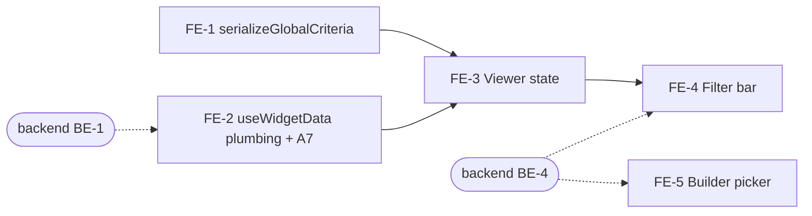

# VIZ-027 Frontend: Global dashboard question filter

**Task ID**: VIZ-027 (GitHub [#478](https://github.com/akvo/akvo-mis/issues/478)), frontend part
**Parent design**: [VIZ-027-global-question-filter.md](VIZ-027-global-question-filter.md)
**Sibling**: [VIZ-027-backend-global-question-filter.md](VIZ-027-backend-global-question-filter.md)
**Branch**: `epic/478-viz-global-question-filter`
**Date**: 2026-10-06
**Status**: Draft

---

## 1. Scope

This document covers **how** the frontend implements VIZ-027. The parent
holds the **why**: context, requirements, the API contract, and decisions
D-1 to D-15. Decision IDs (D-x) and findings (A-x) refer to the parent.

The frontend owns:

- **Viewer**: one multi-select per filter question in the filter bar,
  and the selection serialized into one sorted `global_criteria` list
  that every widget request carries (D-15).
- **Builder**: picking which questions the filter bar offers, with the
  same-named question warning (D-8).
- **A7**: the cross-form series request's wrong parameter name.

Not in this phase: "show only". The filter bar only filters options
out. "Show only" is a later phase, built only if users ask for it
(D-13). It would add a mode per question in the builder; an entry
without `mode` stays "filter out", so nothing built here changes.

Not in this phase either: FE-6, option codes without `:`, `,` or `|` in
`akvo-react-form-editor`. The backend enforces the rule (backend BE-7).

Line numbers are as of 2026-10-06 on the epic branch.

## 2. What the backend provides

| Contract | Shape | From backend task |
|---|---|---|
| `global_criteria` query parameter on `/visualization/values`, `/values/formula`, `/escalation/:id`, `/maps/geolocation/:id` | **Repeated**, one `option_not_in:<qid>:<value>` per value (D-15) | BE-1 |
| Published snapshot `default_filters.questions[]` | `{question, form, label, options: [{value, label}]}` | BE-4 |
| Saved `default_filters.questions[]` | `{question, form}`. A 400 names `field: "default_filters.questions…"` | BE-4 |
| `/manage/dashboards/<pk>/sources` question rows | gain `name` | BE-4 |

The viewer never reads form definitions. Everything the filter bar shows
comes from the snapshot, so it works on public dashboards (D-7).

## 3. Delivery order



FE-1, FE-2 and FE-5's UI can start at once; their tests mock the
network. Checking against a running backend needs BE-1 for FE-2/FE-3
and BE-4 for FE-4/FE-5.

---

## 4. Tasks

### FE-1: `serializeGlobalCriteria` (new `util/dashboardGlobalFilter.js`)

**Goal**: one canonical list for a selection, so equal selections share
cache keys.

**User acceptance criteria**
- [ ] Picking the same options in a different order shows the same
      results at once, from cache, without reloading the charts.
- [ ] Clearing every option returns the dashboard to exactly its
      unfiltered view.
- [ ] An option whose value contains `:` or `,` filters like any other.

**Technical acceptance criteria**
- [ ] Returns an **array** of `option_not_in:<qid>:<value>`, one entry
      per value (D-15): qids sorted as numbers, values sorted within a
      qid.
- [ ] Questions with an empty list are dropped. Returns `null` for `{}`,
      `null`, `undefined` or all-empty input.
- [ ] Values are not escaped or split: `pump:_broken,_leaking` is passed
      through as is.
- [ ] Does not mutate its input. A pure function with no imports.
- [ ] `util/__test__/dashboardGlobalFilter.test.js` green.

```js
// VIZ-027 (D-15): {qid: [values]} -> one "option_not_in:<qid>:<value>"
// per value, or null. Sorted, so equal selections give equal lists and
// widgets keep sharing cache keys. null lets compact() drop the
// parameter, so an unfiltered dashboard sends exactly what it sends today.
export const serializeGlobalCriteria = (exclusions) => {
  const entries = Object.entries(exclusions || {})
    .filter(([, values]) => values?.length)
    .sort(([a], [b]) => Number(a) - Number(b))
    .flatMap(([qid, values]) =>
      [...values].sort().map((v) => `option_not_in:${qid}:${v}`)
    );
  return entries.length ? entries : null;
};
```

`[...values]` copies before sorting: the viewer's selection must not be
reordered in place. That is a test case.

**Turns green**: `util/__test__/dashboardGlobalFilter.test.js`.

---

### FE-2: Every request carries `global_criteria` (`util/hooks/useWidgetData.js`)

**Goal**: no widget type can miss the filter.

**User acceptance criteria**
- [ ] Every widget type reflects the filter: KPI, bar, pie, line,
      scatter, table, map pins, map colours, map sizes, and the
      cross-form stacked bar.
- [ ] Cross-form stacked bars load on public dashboards (A7). They fail
      there today.
- [ ] A dashboard without filter questions behaves exactly as before,
      with the same requests and the same cache hits.
- [ ] A table on page 3 goes back to page 1 when a filter changes, as
      the WAI portal does (parent §15).

**Technical acceptance criteria**
- [ ] All eight builders send `global_criteria: filters?.global_criteria`.
      `compact()` drops it when `null`.
- [ ] `buildSeriesRequest` sends `dashboard_slug`, not `dashboard`.
- [ ] The number of requests per widget is unchanged.
- [ ] The request URL repeats `global_criteria=` once per value, with no
      `[]`. Other parameters are encoded exactly as before.
- [ ] The table's page resets on a filter change. `useWidgetData`
      already resets `page` when `filters` changes; the test "a filter
      change sends the table back to page 1" guards it.
- [ ] `util/__test__/useWidgetData.globalCriteria.test.js` green, and
      `util/__test__/useWidgetData.test.js` stays green.

The endpoints silently drop parameters they do not know (header comment
above `buildRequest`, line 85). A builder that forgets the parameter
does not fail; it shows unfiltered data. Add
`global_criteria: filters?.global_criteria` to each of these:

| Builder | Line | Endpoint |
|---|---|---|
| `buildRequest`, scatter branch | 96 | `/visualization/values` |
| `buildRequest`, table branch | 115 | `/visualization/escalation/:root` |
| `buildRequest`, map branch | 147 | `/maps/geolocation/:root` |
| `buildRequest`, line branch | 190 | `/visualization/values` |
| `buildRequest`, default (kpi, bar, pie) | 219 | `/visualization/values` |
| `buildStatusRequest` (map colours) | 259 | `/visualization/values/formula` |
| `buildValueRequest` (map quantity/range) | 344 | `/visualization/values` |
| `buildSeriesRequest` (cross-form stack) | 401 | `/visualization/values` |

`compact()` (line 65) drops `null`, so nothing changes for a dashboard
without filter questions. The "no request names it when no filter is
set" tests guard that.

**Repeated keys (D-15).** `global_criteria` is an array. Axios 0.25
sends arrays as `global_criteria[]=…`, which Django's `getlist`
("global_criteria") does not read. The backend (as built) also ignores
`global_criteria[0]=…` and `global_criteria[]=…` on purpose, so a
bracketed key silently filters nothing. On a public dashboard only the
questions in the published filter bar are allowed; any other qid is a
404. Give the one call in
`useVisualizationRequest.js` (line 48, `api.get(endpoint, { params })`)
a `paramsSerializer` that repeats the key without brackets:

```js
const toQuery = (params) => {
  const query = new URLSearchParams();
  Object.entries(params || {}).forEach(([key, value]) => {
    if (value === null || typeof value === "undefined") {
      return; // axios skips these too
    }
    (Array.isArray(value) ? value : [value]).forEach((v) =>
      query.append(key, v)
    );
  });
  return query.toString();
};
```

The other parameters are scalars, so their encoding does not change. No
new dependency. The request cache key is unaffected: the array is
already sorted (FE-1).

**A7, same task**: `buildSeriesRequest` sends `dashboard: dashboardSlug`
(line 415). Rename it to `dashboard_slug`. Without the slug, the
cross-form series request on a public dashboard is anonymous with no
dashboard named, and returns 404.

**Turns green**: `util/__test__/useWidgetData.globalCriteria.test.js`
(9 widget kinds, 3 checks each, plus A7).

---

### FE-3: Viewer state (`pages/dashboards/DashboardViewer.jsx`)

**Goal**: the viewer holds the selection and hands every widget the same
serialized filter.

**User acceptance criteria**
- [ ] Applying a filter updates all widgets together.
- [ ] Opening another dashboard starts with no filter.
- [ ] Clearing a filter restores the unfiltered numbers.

**Technical acceptance criteria**
- [ ] `EMPTY_FILTERS` has `exclusions: {}` and is reset on slug change.
- [ ] The grid's filters come from one `useMemo` over `filters`.
      `global_criteria` is derived only through `serializeGlobalCriteria`.
- [ ] `exclusions` never appears as a request parameter.
- [ ] One filter change re-renders the grid once.
- [ ] `pages/dashboards/__test__/DashboardViewer.globalFilter.test.js`
      green, and `DashboardViewer.test.js` stays green.

1. `EMPTY_FILTERS` (line 21) gains `exclusions: {}`. It is already
   reset when the slug changes (line 59).
2. The filter bar keeps writing the whole `filters` object through
   `onChange={setFilters}` (line 201). The grid (line 204) gets a
   derived object:

   ```js
   const gridFilters = useMemo(
     () => ({
       ...filters,
       global_criteria: serializeGlobalCriteria(filters.exclusions),
     }),
     [filters]
   );
   ```

   `filters` only changes identity when the filter bar emits a real
   change (FE-4 contract), so the request builders recompute once per
   change. `global_criteria` is an array or `null` (FE-1, D-15). `DashboardGrid` is already `React.memo` (line 187 there).

3. `exclusions` stays out of the request params: the builders read
   named keys only, and `global_criteria` is the only one added.

**Turns green**: `pages/dashboards/__test__/DashboardViewer.globalFilter.test.js`.

---

### FE-4: Filter bar (`components/dashboard/DashboardViewFilters.jsx`)

**Goal**: the viewer filters options out from the filter bar, with one
reload per change.

**User acceptance criteria**
- [ ] Each offered question appears in the filter bar as a multi-select
      named by the question ("Is the infrastructure operational?"),
      listing its option labels ("Operational", "Non-operational").
- [ ] The bar shows even when the date and administration filters are
      off, and stays hidden when there is nothing to show.
- [ ] Ticking options does not reload the charts. Closing the dropdown
      reloads them once.
- [ ] Removing a tag with its × or clearing the select applies at once.
- [ ] Options already filtered out show as tags.
- [ ] It works on a public dashboard, without logging in.
- [ ] The placeholder and accessible labels are in English and French.
- [ ] The select can be reached and used with the keyboard, and a screen
      reader announces the question.

**Technical acceptance criteria**
- [ ] Each select sits in `data-testid="question-filter-<qid>"`.
- [ ] The selection holds option `value`s; labels are display only. A
      renamed or translated label must not change what is filtered (the
      WAI portal matches lower-cased names and breaks on renames, parent
      §15).
- [ ] `onChange` follows item 4 below: never on an unchanged close; once
      per close with a change; at once on tag removal or clear while
      closed; other questions' selections kept.
- [ ] The header comment (lines 33–35) no longer says per-question
      filters are not built.
- [ ] New `uiText` keys exist in `en` and `fr`.
- [ ] `VizMap`'s `colorKey` is untouched, so maps do not remount on a
      filter change.
- [ ] `components/dashboard/__test__/DashboardViewFilters.questions.test.js`
      green, and `DashboardViewFilters.test.js` stays green.

1. **Show the bar** when `defaultFilters.questions` is non-empty, even
   with date and administration off. Today the early return (line 53)
   checks only those two.
2. **Update the header comment** (lines 33–35). It says per-question
   filters are "not built" because no format existed to save them. Now
   one does: `default_filters.questions`.
3. **One `Select mode="multiple"` per question**, in the same
   `dashboard-view-filters-card` `Space` (line 78), wrapped in
   `data-testid={`question-filter-${q.question}`}`. Options come from
   the snapshot entry's `options`, labelled with `label`. The value is
   `value.exclusions[q.question] || []`. For a name group (D-14) the
   snapshot already holds the merged options, with labels such as
   "Fine / Clear sky"; the filter bar renders them as they are.
4. **When a change applies**. The goal: picking three options sends one
   request per widget, not three.
   - Keep a local draft per question while the dropdown is open.
   - `onDropdownVisibleChange(false)`: emit if the draft differs from
     `value.exclusions[qid]`; otherwise emit nothing.
   - Removing a tag (`onDeselect`) or clearing (`allowClear`) while the
     dropdown is **closed**: emit at once. Neither opens the dropdown,
     so waiting for a close would never apply them.
   - The emitted value is
     `{...value, exclusions: {...value.exclusions, [qid]: next}}`.
     Other questions' selections stay.
5. **Text**: add keys to `lib/ui-text.js` in `en` (line 14) and `fr`
   (`uiText.fr`, around line 1440); `de` is empty and falls back. At
   least: the select's placeholder (for example "Filter out…") and an
   `aria-label` built from the question label. Use the question's own
   `label` from the snapshot as the visible name, not a translation.

**Turns green**: `components/dashboard/__test__/DashboardViewFilters.questions.test.js`.
The existing `DashboardViewFilters.test.js` must stay green: "both
disabled renders no bar at all" still holds when there are no
questions.

---

### FE-5: Builder picker (new `pages/dashboards/DashboardQuestionFilters.jsx`)

**Goal**: the author chooses which questions the filter bar offers.

**User acceptance criteria**
- [ ] In the dashboard settings, next to the date and administration
      toggles, the author finds a control to add filter questions.
- [ ] It offers only questions with options, from the dashboard's own
      forms, each shown by its question text.
- [ ] The author can add and remove questions. The choice is saved with
      the dashboard and reaches viewers on Publish.
- [ ] Picking "What is the water source?" on the registration form shows
      a warning that the visit form asks it too, with a one-click "Use
      Water quality visit question instead". The list keeps its order.
- [ ] A refused save shows an error message.
- [ ] Picking "What is the weather?" on the check form shows "Also asked
      on: Water quality visit", because the visit form asks it under the
      same name (D-14).
- [ ] If the visit form's weather question has an option the check form
      lacks ("Stormy"), the builder warns which forms have it. The author
      can still save.

**Technical acceptance criteria**
- [ ] New file `pages/dashboards/DashboardQuestionFilters.jsx` with props
      `{sources, value, onChange}`; `BuilderInspector.jsx` only mounts
      it.
- [ ] `data-testid="question-filter-picker"` and
      `question-filter-entry-<qid>`; a "Remove" button per entry.
- [ ] Offers only types `option` and `multiple_option`, and never a
      question that is already picked.
- [ ] Saves through
      `onDashboardChange("default_filters", {...defaultFilters, questions})`,
      keeping `date`, `administration` and `toolbox`.
- [ ] Same-named detection: the form has no `parent`, and a child form
      has a question with the same `name`. One swap button per matching
      child form.
- [ ] Name-group hint for a monitoring entry: the other monitoring forms
      with a question of the same `name`, listed by form name. No
      warning role: it is information, not a problem.
- [ ] Copy in `uiText` for `en` and `fr`.
- [ ] `pages/dashboards/__test__/DashboardQuestionFilters.test.js` green,
      and `BuilderInspector.test.js` stays green.

A new file because `BuilderInspector.jsx` is already 2,353 lines. Mount
it in the inspector's dashboard-level panel, after the date and
administration toggles (around lines 406–430):

```jsx
<DashboardQuestionFilters
  sources={sources}
  value={defaultFilters?.questions || []}
  onChange={(questions) =>
    onDashboardChange("default_filters", { ...defaultFilters, questions })
  }
/>
```

**Contract** (the tests are written against it):

- **Picker**: an antd `Select` in `data-testid="question-filter-picker"`.
  It offers option and multiple-option questions from every form in
  `sources.forms`. Each option is titled with the question label.
  Questions already picked are not offered again. Picking calls
  `onChange([...value, {question, form}])`.
- **Entries**: each picked question renders in
  `data-testid="question-filter-entry-<qid>"`, with a button whose
  accessible name is "Remove".
- **Same-named warning (D-8)**: an entry is a registration question
  (its form has no `parent`) and a child form has a question with the
  same `name`. The entry then shows a `role="alert"` warning with a
  button "Use <child form name> question instead". The button swaps
  the entry **in place**, keeping the list order. If several child
  forms match, offer one button per form.
- **Name group (D-14)**: when a picked monitoring question shares its
  `name` with questions on other monitoring forms, the entry shows
  "Also asked on: <form names>". The filter reads the latest answer
  across those forms, so the author needs to see them. Computed from
  `sources.forms` alone: same `name`, other forms with a `parent`.
- **Option mismatch warning (D-14)**: when the questions of a name
  group do not all have the same option values, the entry shows a
  `role="alert"` warning listing each value that is missing from some
  forms, with its label and the forms that have it, for example
  "Stormy: only on Water quality visit". It does not block saving.
- **Errors**: a save that returns `field: "default_filters.questions…"`
  should be shown on this control. `DashboardBuilder.handleSave` today
  highlights widgets by `widget_index` and falls back to a global
  message; the global message is acceptable for a first version.

Builder copy (warning text, button labels, the picker placeholder) goes
into `lib/ui-text.js` in `en` and `fr`. The tests match the English
strings "Remove" and "Use Water quality visit question instead".

**Turns green**: `pages/dashboards/__test__/DashboardQuestionFilters.test.js`.

---

### FE-6 (deferred, optional): the form editor drops `:`, `,` and `|`

**Not in this phase** (decided 2026-10-06). The backend enforces the
rule at every entry point (backend BE-7), so `akvo-react-form-editor`
does not need a release for VIZ-027.

What the author sees without it: typing the label "Type A: hand pump"
makes the editor propose the code `type_a:_hand_pump`. Saving shows an
error naming the option and the code; the author edits the code to
`type_a_hand_pump` and saves again. Local data had 0 such values in
1,211, so this should be rare.

If it proves annoying, the change is small and lives in the editor
repository: `snakeCase` in
`src/components/question-type/SettingOption.jsx` (line 20) applies the
backend rule (lower-case, remove `:` `,` `|`, whitespace runs → `_`).
Two cautions for whoever picks it up:
- Line 137 normalizes **every** option's code on blur. It must change
  only the code being edited, or opening an old form would rewrite codes
  that answers already use.
- Line 150 compares `opt.value === snakeCase(opt.label)`; after the
  change an old code such as `a:_b` stops following label edits, which
  keeps stored codes stable.

---

## 5. Keeping re-renders cheap

Already in place: `DashboardGrid` is `React.memo`, the request builders
recompute only when `filters` changes, requests are cached by their
parameters, and a loading widget keeps its previous data. On top of
that:

- Emit only real changes (FE-4). A new `filters` object with the same
  content re-runs every builder and re-renders every chart.
- Sort before serializing (FE-1), so `a|b` and `b|a` share a cache key.
- Do not remount maps. `VizMap`'s `MapCluster` key is `colorKey`
  (`VizMap.jsx:202-214`): colours, `map_mode`, `map_aggregate`,
  thresholds and ranges. Nothing filter-related may be added to it.

## 6. Tests

| File | Task | Now |
|---|---|---|
| `util/__test__/dashboardGlobalFilter.test.js` | FE-1 | Suite fails: module missing |
| `util/__test__/useWidgetData.globalCriteria.test.js` | FE-2 | 18 green (request counts, no param when unset), 10 red; plus the page-reset guard, green (run 2026-10-06) |
| `pages/dashboards/__test__/DashboardViewer.globalFilter.test.js` | FE-3 | 1 green, 3 red |
| `components/dashboard/__test__/DashboardViewFilters.questions.test.js` | FE-4 | 1 green, 8 red |
| `pages/dashboards/__test__/DashboardQuestionFilters.test.js` | FE-5, including the D-14 "Also asked on" hint and option mismatch warning | Suite fails: module missing |
| `util/__test__/useVisualizationRequest.paramsSerializer.test.js` | FE-2 (D-15 repeated keys) | 3 red: no `paramsSerializer` yet |

The tests use the backend fixture's questions and ids (sibling §5):
700301 "Is the infrastructure operational?" (Operational,
Non-operational), and 700101 "What is the water source?" (Ground water,
Surface water, Rainwater).

### Test changes for D-15 (made 2026-10-06)

| File | Change |
|---|---|
| `util/__test__/dashboardGlobalFilter.test.js` | Expect arrays: one `option_not_in:<qid>:<value>` per value, sorted; add a value containing `:` and `,` |
| `util/__test__/useWidgetData.globalCriteria.test.js` | `GLOBAL` becomes an array |
| `pages/dashboards/__test__/DashboardViewer.globalFilter.test.js` | `BOTH` becomes `["option_not_in:700301:non_operational", "option_not_in:700301:operational"]` |
| New `util/__test__/useVisualizationRequest.paramsSerializer.test.js` | `paramsSerializer`: an array repeats the key without `[]`; a value with `:` `,` `\|` survives; scalars encode as before; `null` is skipped |

### Running

Use the project's `npm test` script. It carries the
`transformIgnorePatterns` for d3; without it two suites fail to parse.
Limit workers: the full suite in the dev container ran out of memory
and killed the dev server on 2026-10-05.

```bash
./dc.sh exec -e CI=true frontend npm test -- --watchAll=false --maxWorkers=2 \
  "globalCriteria|globalFilter|GlobalFilter|ViewFilters.questions|DashboardQuestionFilters"
./dc.sh exec frontend npx eslint <changed files>
```

ESLint rules to respect (`frontend/.eslintrc.json`): `curly`,
`no-undefined`, `prefer-arrow-callback`, `prefer-const`, prettier. Do not
disable rules.

---

## 7. Definition of done

- [ ] Every task's user and technical acceptance criteria (§4) are
      ticked.
- [ ] All five VIZ-027 frontend suites green, including the tests that
      are green today.
- [ ] Existing suites still green, in particular
      `DashboardViewFilters.test.js`, `DashboardViewer.test.js`,
      `useWidgetData.test.js`, `BuilderInspector.test.js`,
      `viewerPreviewParity.test.js`.
- [ ] `npm run lint` and `npm run prettier` clean.
- [ ] Manual check on a published **public** dashboard: pick two
      options, close the dropdown, and see one request per widget in the
      network tab, each with the same `global_criteria`.
- [ ] Manual check on a map widget: the map does not remount on a
      filter change.

## 8. Open points for this part

- **Builder error placement**: a field-level error on the picker needs
  `DashboardBuilder.handleSave` to route `default_filters.*` fields.
  Out of scope unless authors find the global message unclear.
- **"All submissions" charts still show a filtered-out option** (parent
  D-2 consequence). The parent asks for a note in the user
  documentation, not a UI change. If support questions come in, a
  tooltip on such widgets is the cheapest follow-up.
