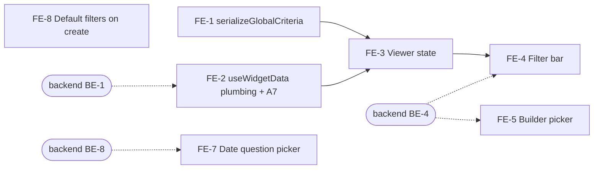

# VIZ-027 Frontend: Global dashboard question filter

**Task ID**: VIZ-027 (GitHub [#478](https://github.com/akvo/akvo-mis/issues/478)), frontend part
**Parent design**: [VIZ-027-global-question-filter.md](VIZ-027-global-question-filter.md)
**Sibling**: [VIZ-027-backend-global-question-filter.md](VIZ-027-backend-global-question-filter.md)
**Branch**: `epic/478-viz-global-question-filter`
**Date**: 2026-10-06 (FE-4 revised 2026-10-07: Filters panel, D-16)
**Status**: Draft

---

## 1. Scope

This document covers **how** the frontend implements VIZ-027. The parent
holds the **why**: context, requirements, the API contract, and decisions
D-1 to D-15. Decision IDs (D-x) and findings (A-x) refer to the parent.

The frontend owns:

- **Viewer**: a "Filters" button in the filter bar that opens a
  checklist per filter question, ticked = shown (D-16). The unticked
  options are serialized into one sorted `global_criteria` list that
  every widget request carries (D-15).
- **Builder**: picking which questions the filter bar offers, with the
  same-named question warning (D-8).
- **A7**: the cross-form series request's wrong parameter name.
- **Date question** (FE-7, D-18): the builder control for the date the
  dashboard's range uses.
- **Defaults** (FE-8, D-19): new dashboards start with the date and
  administration filters on.

Not in this phase: a true "show only" that also hides datapoints with
no answer. The checklist reads like "show only" (ticked = shown), but
it sends the unticked options as `option_not_in`, so unanswered data
stays and the panel says so (D-5, D-16). Hiding unanswered data is the
later phase in D-13; it would add a mode per question in the builder,
and an entry without `mode` keeps today's behaviour.

Not in this phase either: FE-6, option codes without `:`, `,` or `|` in
`akvo-react-form-editor`. The backend enforces the rule (backend BE-7).

Line numbers are as of 2026-10-06 on the epic branch.

## 2. What the backend provides

| Contract | Shape | From backend task |
|---|---|---|
| `global_criteria` query parameter on `/visualization/values`, `/values/formula`, `/escalation/:id`, `/maps/geolocation/:id` | **Repeated**, one `option_not_in:<form_id>:<name>:<value>` per value (D-15, D-20) | BE-1, BE-9 |
| Published snapshot `default_filters.questions[]` | `{form, name, label, options: [{value, label}]}` | BE-4, BE-9 |
| Saved `default_filters.questions[]` | `{form, name}`: the registration form means the whole family, a monitoring form that form only (D-20). A 400 names `field: "default_filters.questions…"` | BE-4, BE-9 |
| `/manage/dashboards/<pk>/sources` question rows | gain `name` | BE-4 |

The viewer never reads form definitions. Everything the filter bar shows
comes from the snapshot, so it works on public dashboards (D-7).

## 3. Delivery order



FE-1, FE-2 and FE-5's UI can start at once; their tests mock the
network. Checking against a running backend needs BE-1 for FE-2/FE-3
and BE-4 for FE-4/FE-5.

---

## 4. Tasks

### FE-1: `serializeGlobalCriteria` (new `util/dashboardGlobalFilter.js`)

**Goal**: one canonical list for a selection, so equal selections share
cache keys.

**User acceptance criteria**
- [ ] Picking the same options in a different order shows the same
      results at once, from cache, without reloading the charts.
- [ ] Clearing every option returns the dashboard to exactly its
      unfiltered view.
- [ ] An option whose value contains `:` or `,` filters like any other.

**Technical acceptance criteria**
- [ ] Takes `{"<form>:<name>": [values]}` and returns an **array** of
      `option_not_in:<form>:<name>:<value>`, one entry per value (D-15,
      D-20): keys sorted (numeric-aware), values sorted within a key.
- [ ] Questions with an empty list are dropped. Returns `null` for `{}`,
      `null`, `undefined` or all-empty input.
- [ ] Values are not escaped or split: `pump:_broken,_leaking` is passed
      through as is.
- [ ] Does not mutate its input. A pure function with no imports.
- [ ] `util/__test__/dashboardGlobalFilter.test.js` green.

```js
// VIZ-027 (D-15, D-20): {"<form>:<name>": [values]} -> one
// "option_not_in:<form>:<name>:<value>" per value, or null. Sorted, so
// equal selections give equal lists and widgets keep sharing cache keys.
// null lets compact() drop the parameter, so an unfiltered dashboard
// sends exactly what it sends today.
export const serializeGlobalCriteria = (exclusions) => {
  const entries = Object.entries(exclusions || {})
    .filter(([, values]) => values?.length)
    .sort(([a], [b]) => a.localeCompare(b, "en", { numeric: true }))
    .flatMap(([key, values]) =>
      [...values].sort().map((v) => `option_not_in:${key}:${v}`)
    );
  return entries.length ? entries : null;
};
```

`[...values]` copies before sorting: the viewer's selection must not be
reordered in place. That is a test case.

**Turns green**: `util/__test__/dashboardGlobalFilter.test.js`.

---

### FE-2: Every request carries `global_criteria` (`util/hooks/useWidgetData.js`)

**Goal**: no widget type can miss the filter.

**User acceptance criteria**
- [ ] Every widget type reflects the filter: KPI, bar, pie, line,
      scatter, table, map pins, map colours, map sizes, and the
      cross-form stacked bar.
- [ ] Cross-form stacked bars load on public dashboards (A7). They fail
      there today.
- [ ] A dashboard without filter questions behaves exactly as before,
      with the same requests and the same cache hits.
- [ ] A table on page 3 goes back to page 1 when a filter changes, as
      the WAI portal does (parent §15).

**Technical acceptance criteria**
- [ ] All eight builders send `global_criteria: filters?.global_criteria`.
      `compact()` drops it when `null`.
- [ ] `buildSeriesRequest` sends `dashboard_slug`, not `dashboard`.
- [ ] The three map requests (`buildRequest` map branch,
      `buildStatusRequest`, `buildValueRequest`) send
      `date_question_id: filters?.date_question_id` too (backend BE-8,
      D-18). The comment "It has no date_question_id either" (line 168)
      is removed.
- [ ] The number of requests per widget is unchanged.
- [ ] The request URL repeats `global_criteria=` once per value, with no
      `[]`. Other parameters are encoded exactly as before.
- [ ] The table's page resets on a filter change. `useWidgetData`
      already resets `page` when `filters` changes; the test "a filter
      change sends the table back to page 1" guards it.
- [ ] `util/__test__/useWidgetData.globalCriteria.test.js` green, and
      `util/__test__/useWidgetData.test.js` stays green.

The endpoints silently drop parameters they do not know (header comment
above `buildRequest`, line 85). A builder that forgets the parameter
does not fail; it shows unfiltered data. Add
`global_criteria: filters?.global_criteria` to each of these:

| Builder | Line | Endpoint |
|---|---|---|
| `buildRequest`, scatter branch | 96 | `/visualization/values` |
| `buildRequest`, table branch | 115 | `/visualization/escalation/:root` |
| `buildRequest`, map branch | 147 | `/maps/geolocation/:root` |
| `buildRequest`, line branch | 190 | `/visualization/values` |
| `buildRequest`, default (kpi, bar, pie) | 219 | `/visualization/values` |
| `buildStatusRequest` (map colours) | 259 | `/visualization/values/formula` |
| `buildValueRequest` (map quantity/range) | 344 | `/visualization/values` |
| `buildSeriesRequest` (cross-form stack) | 401 | `/visualization/values` |

`compact()` (line 65) drops `null`, so nothing changes for a dashboard
without filter questions. The "no request names it when no filter is
set" tests guard that.

**Repeated keys (D-15).** `global_criteria` is an array. Axios 0.25
sends arrays as `global_criteria[]=…`, which Django's `getlist`
("global_criteria") does not read. The backend (as built) also ignores
`global_criteria[0]=…` and `global_criteria[]=…` on purpose, so a
bracketed key silently filters nothing. On a public dashboard only the
questions in the published filter bar are allowed; any other qid is a
404. Give the one call in
`useVisualizationRequest.js` (line 48, `api.get(endpoint, { params })`)
a `paramsSerializer` that repeats the key without brackets:

```js
const toQuery = (params) => {
  const query = new URLSearchParams();
  Object.entries(params || {}).forEach(([key, value]) => {
    if (value === null || typeof value === "undefined") {
      return; // axios skips these too
    }
    (Array.isArray(value) ? value : [value]).forEach((v) =>
      query.append(key, v)
    );
  });
  return query.toString();
};
```

The other parameters are scalars, so their encoding does not change. No
new dependency. The request cache key is unaffected: the array is
already sorted (FE-1).

**A7, same task**: `buildSeriesRequest` sends `dashboard: dashboardSlug`
(line 415). Rename it to `dashboard_slug`. Without the slug, the
cross-form series request on a public dashboard is anonymous with no
dashboard named, and returns 404.

**Turns green**: `util/__test__/useWidgetData.globalCriteria.test.js`
(9 widget kinds, 3 checks each, plus A7).

---

### FE-3: Viewer state (`pages/dashboards/DashboardViewer.jsx`)

**Goal**: the viewer holds the selection and hands every widget the same
serialized filter.

**User acceptance criteria**
- [ ] Applying a filter updates all widgets together.
- [ ] Opening another dashboard starts with no filter.
- [ ] Clearing a filter restores the unfiltered numbers.

**Technical acceptance criteria**
- [ ] `EMPTY_FILTERS` has `exclusions: {}` and is reset on slug change.
- [ ] The grid's filters come from one `useMemo` over `filters`.
      `global_criteria` is derived only through `serializeGlobalCriteria`.
- [ ] `exclusions` never appears as a request parameter.
- [ ] One filter change re-renders the grid once.
- [ ] `pages/dashboards/__test__/DashboardViewer.globalFilter.test.js`
      green, and `DashboardViewer.test.js` stays green.

1. `EMPTY_FILTERS` (line 21) gains `exclusions: {}`. It is already
   reset when the slug changes (line 59).
2. The filter bar keeps writing the whole `filters` object through
   `onChange={setFilters}` (line 201). The grid (line 204) gets a
   derived object:

   ```js
   const gridFilters = useMemo(
     () => ({
       ...filters,
       global_criteria: serializeGlobalCriteria(filters.exclusions),
     }),
     [filters]
   );
   ```

   `filters` only changes identity when the filter bar emits a real
   change (FE-4 contract), so the request builders recompute once per
   change. `global_criteria` is an array or `null` (FE-1, D-15). `DashboardGrid` is already `React.memo` (line 187 there).

3. `exclusions` stays out of the request params: the builders read
   named keys only, and `global_criteria` is the only one added.

**Turns green**: `pages/dashboards/__test__/DashboardViewer.globalFilter.test.js`.

---

### FE-4: Filters panel (`components/dashboard/DashboardViewFilters.jsx`)

**Goal**: the viewer hides options from a "Filters" panel, using the
common checklist idiom (ticked = shown), with one reload per Apply
(D-16).

```
[📅 From → To] [All locations ▾]                         ( ⏷ Filters  1 )
                                   ┌──────────────────────────────────────┐
                                   │ Is the infrastructure operational?   │
                                   │   ☑ Operational                      │
                                   │   ☐ Non-operational                  │
                                   │ What is the water source?            │
                                   │   ☑ Ground water                     │
                                   │   ☑ Surface water                    │
                                   │   ☑ Rainwater                        │
                                   │ Data without an answer to a question │
                                   │ is always shown.                     │
                                   │                [Clear all] [Apply]   │
                                   └──────────────────────────────────────┘
```

**User acceptance criteria**
- [ ] When the dashboard offers filter questions, the filter bar shows a
      "Filters" button on its right, as in the builder mockup
      (`VIZ-Example/index.html:387`), even when the date and
      administration filters are off. Without filter questions it is
      not shown.
- [ ] The button opens a panel listing each question by its label, with
      a checkbox per option. Every option is ticked until the viewer
      unticks it: ticked means shown.
- [ ] Unticking options does not reload the charts. "Apply" reloads
      them once and closes the panel.
- [ ] Closing the panel without "Apply" (click outside, Esc) discards
      the changes.
- [ ] "Apply" is disabled while nothing changed, and while a question
      has no option ticked (the panel says why).
- [ ] The button shows how many questions are filtered (badge "1").
- [ ] "Clear all" ticks every option again and applies at once.
- [ ] The panel says that data without an answer is always shown (D-5).
- [ ] It works on a public dashboard, without logging in.
- [ ] Copy is in English and French.
- [ ] The button, checkboxes and actions work with the keyboard; a
      screen reader announces each question as the group's name, and
      the button's active count.

**Technical acceptance criteria**
- [ ] `data-testid`s: `question-filters-button`, `question-filter-<form>-<name>`
      (one group per question), `question-filters-apply`,
      `question-filters-clear`.
- [ ] State stays `value.exclusions = {"<form>:<name>": [unticked values]}`; the
      panel shows `options − exclusions[qid]` as ticked. FE-1 and the
      backend (`option_not_in`) are unchanged.
- [ ] Ticks hold option `value`s; labels are display only. A renamed or
      translated label must not change what is filtered (the WAI portal
      matches lower-cased names and breaks on renames, parent §15).
- [ ] `onChange` fires only on Apply with a real change, or on Clear
      all when something was filtered. It emits
      `{...value, exclusions: next}`, where `next` keeps only questions
      with at least one unticked value.
- [ ] The badge counts keys of `value.exclusions` (applied state, not
      the draft).
- [ ] The header comment (lines 33–35) no longer says the "Filters"
      pill is not built.
- [ ] New `uiText` keys exist in `en` and `fr`.
- [ ] In the builder canvas (`disabled`), the button is rendered but
      disabled.
- [ ] `VizMap`'s `colorKey` is untouched, so maps do not remount on a
      filter change.
- [ ] `components/dashboard/__test__/DashboardViewFilters.questions.test.js`
      green, and `DashboardViewFilters.test.js` stays green.

1. **Show the bar** when `defaultFilters.questions` is non-empty, even
   with date and administration off. Today the early return (line 53)
   checks only those two.
2. **Update the header comment** (lines 33–35). It says the "Filters"
   pill is "not built" because no format existed to save per-question
   filters. Now one does: `default_filters.questions`.
3. **The button**: an antd `Button` with `FilterOutlined`, pushed right
   in the `dashboard-view-filters-card` row (line 78), wrapped in a
   `Badge` whose count is the number of filtered questions. Its
   `aria-label` includes the count.
4. **The panel**: an antd `Popover` (`trigger="click"`,
   `placement="bottomRight"`), body scrollable past about 60 vh. One
   `<fieldset>` per question with a `<legend>` holding the snapshot's
   `label`, and a `Checkbox.Group` of the snapshot's `options`. For a
   name group (D-14) the snapshot already holds the merged options,
   with labels such as "Fine / Clear sky"; render them as they are.
5. **Draft and apply**: copy `value.exclusions` into a local draft when
   the panel opens; ticking edits the draft only.
   - **Apply**: emit if the draft differs from `value.exclusions`, then
     close.
   - **Close** without Apply: drop the draft.
   - **Clear all**: emit `exclusions: {}` if anything was filtered, then
     close.
   - A question with every option unticked would hide every answered
     datapoint and keep only the unanswered ones. Apply stays disabled
     and the question shows "Tick at least one option".
6. **Text**: add keys to `lib/ui-text.js` in `en` (line 14) and `fr`
   (`uiText.fr`, around line 1440); `de` is empty and falls back. At
   least: "Filters", "Apply", "Clear all", the unanswered note, "Tick at
   least one option", and the button's `aria-label` with the count. The
   question and option labels come from the snapshot, not from
   `uiText`.

**Turns green**: `components/dashboard/__test__/DashboardViewFilters.questions.test.js`,
rewritten for D-16 before the implementation (§6). The existing
`DashboardViewFilters.test.js` must stay green: "both disabled renders
no bar at all" still holds when there are no questions.

---

### FE-5: Builder picker (new `pages/dashboards/DashboardQuestionFilters.jsx`)

**Goal**: the author chooses which questions the filter bar offers.

**User acceptance criteria**
- [ ] In the dashboard settings, next to the date and administration
      toggles, the author finds a control to add filter questions.
- [ ] It offers only questions with options, from the dashboard's own
      forms, each shown by its question text and its scope: "All forms"
      (the registration form: every form of the family that asks it) or
      one monitoring form (that form only) (D-20).
- [ ] Questions already used by a widget on the canvas are listed first,
      under "Used in your widgets"; every other option question of the
      form family stays available under "Other questions in this form
      family" (D-17). Adding or removing a widget updates the groups,
      before saving.
- [ ] The author can add and remove questions. The choice is saved with
      the dashboard and reaches viewers on Publish.
- [ ] A refused save shows an error message.
- [ ] Picking "What is the weather?" for "All forms" shows "Covers:
      Water quality visit, Quick status check": the forms that ask it
      under that name (D-20).
- [ ] If the visit form's weather question has an option the check form
      lacks ("Stormy"), an "All forms" entry warns which forms have it.
      The author can still save.

**Technical acceptance criteria**
- [ ] New file `pages/dashboards/DashboardQuestionFilters.jsx` with props
      `{sources, widgets, value, onChange}`; `BuilderInspector.jsx` only
      mounts it. `DashboardBuilder` passes its `widgets` state to the
      inspector (it already passes it to `AISuggestionDrawer`).
- [ ] The suggested group is computed from `widgets` alone, with no
      request: `widget.question`, and in `widget.config`: `question_y`,
      `stack_question`, `category_question_id`, `value_question`,
      `criteria[].question` and `columns[].question`. Kept only when the
      question is an option or multiple-option question of
      `sources.forms`. A suggestion is the question's **name** at the
      "All forms" scope. An entry is listed once, in one group.
- [ ] `data-testid="question-filter-picker"` and
      `question-filter-entry-<form>-<name>`; a "Remove" button per entry.
- [ ] Offers only types `option` and `multiple_option`, one entry per
      name at "All forms" (the root form id) and one per monitoring form
      asking it; never an entry already picked. Names containing `:`
      are not offered (the backend refuses them).
- [ ] Saves through
      `onDashboardChange("default_filters", {...defaultFilters, questions})`,
      keeping `date`, `administration` and `toolbox`.
- [ ] "Covers" hint for an "All forms" entry: the forms that ask the
      name, listed by form name. No warning role: it is information.
- [ ] Copy in `uiText` for `en` and `fr`.
- [ ] `pages/dashboards/__test__/DashboardQuestionFilters.test.js` green,
      and `BuilderInspector.test.js` stays green.

A new file because `BuilderInspector.jsx` is already 2,353 lines. Mount
it in the inspector's dashboard-level panel, after the date and
administration toggles (around lines 406–430):

```jsx
<DashboardQuestionFilters
  sources={sources}
  widgets={widgets}
  value={defaultFilters?.questions || []}
  onChange={(questions) =>
    onDashboardChange("default_filters", { ...defaultFilters, questions })
  }
/>
```

**Contract** (the tests are written against it):

- **Picker**: an antd `Select` in `data-testid="question-filter-picker"`.
  It offers option and multiple-option questions from every form in
  `sources.forms`, in two `OptGroup`s: "Used in your widgets" first,
  then "Other questions in this form family" (D-17). Each option is
  titled with the question label and shows its scope ("All forms" or a
  monitoring form's name). Entries already picked are not offered
  again. Picking calls `onChange([...value, {form, name}])`, where
  `form` is the root form id for "All forms" (D-20). The groups are a ranking,
  never a restriction: a filter on a question no widget shows (the
  status question while the charts show water samples) is the main use
  case.
- **Entries**: each picked filter renders in
  `data-testid="question-filter-entry-<form>-<name>"`, with a button
  whose accessible name is "Remove".
- **No swap warning**: D-8's "use the visit question instead" is gone;
  "All forms" already includes the visit form (D-20).
- **Covers (D-20)**: an "All forms" entry shows "Covers: <form names>",
  the forms of `sources.forms` with a live option question of that
  `name`. The filter reads the latest answer across them.
- **Option mismatch warning (D-14)**: when the questions an "All forms"
  entry covers do not all have the same option values, the entry shows a
  `role="alert"` warning listing each value that is missing from some
  forms, with its label and the forms that have it, for example
  "Stormy: only on Water quality visit". It does not block saving.
- **Errors**: a save that returns `field: "default_filters.questions…"`
  should be shown on this control. `DashboardBuilder.handleSave` today
  highlights widgets by `widget_index` and falls back to a global
  message; the global message is acceptable for a first version.

Builder copy (warning text, button labels, the picker placeholder) goes
into `lib/ui-text.js` in `en` and `fr`. The tests match the English
strings "Remove", "All forms" and "Covers:".

**Turns green**: `pages/dashboards/__test__/DashboardQuestionFilters.test.js`,
with the D-17 tests added before the implementation (§6).

---

### FE-7: Date question picker in the builder (D-18)

**Goal**: the author chooses which date the dashboard's date range uses.

```
Default filters
  Date                         [●  ]
    Date to filter on
    [ Submission date                          ▾ ]
       Submission date
       Visit date            Water quality visit, Quick status check
       Registration date     Water point registration
  Location (administration)    [●  ]
```

**User acceptance criteria**
- [ ] Under the Date switch, while it is on, the author picks "Submission
      date" (the default) or a date question of the form family.
- [ ] A date question asked on several forms under the same name shows
      once, with the forms that ask it.
- [ ] The viewer's date range then bounds every widget by that date
      (backend BE-8).
- [ ] Copy in English and French.

**Technical acceptance criteria**
- [ ] In the `BuilderInspector.jsx` "Default filters" block (lines
      395–431), a `Select` in `data-testid="date-question-picker"`
      writes `onDashboardChange("default_filters", {...defaultFilters,
      date: {...defaultFilters?.date, date_question: id | null}})`.
- [ ] Options come from `sources.forms`: questions of type `date`,
      grouped by `name`. The stored id is the first question of the
      group, registration form first, then by form order; the backend
      resolves the rest by name.
- [ ] Hidden while Date is off; the stored value is kept.
- [ ] `DashboardViewFilters` keeps sending it as `date_question_id`
      (line 67, unchanged).
- [ ] `pages/dashboards/__test__/BuilderInspector.dateQuestion.test.js`
      green, and `BuilderInspector.test.js` stays green.

---

### FE-8: New dashboards start with date and administration on (D-19)

**Goal**: a new dashboard has a filter bar without extra steps.

**User acceptance criteria**
- [ ] After creating a widgets dashboard, the builder shows Date and
      Location switched on; the author can switch them off.
- [ ] Creating an embed dashboard is unchanged.

**Technical acceptance criteria**
- [ ] `CreateDashboardModal.jsx` `createPayload` (line 184) gains
      `default_filters: {date: {enabled: true}, administration:
      {enabled: true}}`, for the AI and the empty starter alike. The
      embed branch (line 141) does not send it.
- [ ] A test in `pages/dashboards/__test__/CreateDashboardModal.test.js`
      checks both payloads.
- [ ] `CreateDashboardModalAI.test.js` asserts the exact create payload
      (lines 127 and 167); add `default_filters` there. That is an
      expected change, not a regression.

---

### FE-6 (deferred, optional): the form editor drops `:`, `,` and `|`

**Not in this phase** (decided 2026-10-06). The backend enforces the
rule at every entry point (backend BE-7), so `akvo-react-form-editor`
does not need a release for VIZ-027.

What the author sees without it: typing the label "Type A: hand pump"
makes the editor propose the code `type_a:_hand_pump`. Saving shows an
error naming the option and the code; the author edits the code to
`type_a_hand_pump` and saves again. Local data had 0 such values in
1,211, so this should be rare.

If it proves annoying, the change is small and lives in the editor
repository: `snakeCase` in
`src/components/question-type/SettingOption.jsx` (line 20) applies the
backend rule (lower-case, remove `:` `,` `|`, whitespace runs → `_`).
Two cautions for whoever picks it up:
- Line 137 normalizes **every** option's code on blur. It must change
  only the code being edited, or opening an old form would rewrite codes
  that answers already use.
- Line 150 compares `opt.value === snakeCase(opt.label)`; after the
  change an old code such as `a:_b` stops following label edits, which
  keeps stored codes stable.

---

## 5. Keeping re-renders cheap

Already in place: `DashboardGrid` is `React.memo`, the request builders
recompute only when `filters` changes, requests are cached by their
parameters, and a loading widget keeps its previous data. On top of
that:

- Emit only real changes (FE-4: Apply with a change, Clear all when
  filtered). A new `filters` object with the same content re-runs every
  builder and re-renders every chart.
- Sort before serializing (FE-1), so `a|b` and `b|a` share a cache key.
- Do not remount maps. `VizMap`'s `MapCluster` key is `colorKey`
  (`VizMap.jsx:202-214`): colours, `map_mode`, `map_aggregate`,
  thresholds and ranges. Nothing filter-related may be added to it.

## 6. Tests

| File | Task | Now |
|---|---|---|
| `util/__test__/dashboardGlobalFilter.test.js` | FE-1 | Suite fails: module missing |
| `util/__test__/useWidgetData.globalCriteria.test.js` | FE-2 | 18 green (request counts, no param when unset), 10 red; plus the page-reset guard, green (run 2026-10-06) |
| `pages/dashboards/__test__/DashboardViewer.globalFilter.test.js` | FE-3 | 1 green, 3 red |
| `components/dashboard/__test__/DashboardViewFilters.questions.test.js` | FE-4 | To be rewritten for the Filters panel (D-16), see below; was 1 green, 8 red against the multi-select |
| `pages/dashboards/__test__/DashboardQuestionFilters.test.js` | FE-5, including the D-14 "Also asked on" hint and option mismatch warning | Suite fails: module missing |
| `util/__test__/useVisualizationRequest.paramsSerializer.test.js` | FE-2 (D-15 repeated keys) | 3 red: no `paramsSerializer` yet |

The tests use the backend fixture's questions and ids (sibling §5):
700301 "Is the infrastructure operational?" (Operational,
Non-operational), and 700101 "What is the water source?" (Ground water,
Surface water, Rainwater).

### Test changes for D-20 (to make before FE-1, FE-4, FE-5)

The frontend tests still use question ids (`700301`, `700101`). Move
them to `form:name` keys before implementing: `serializeGlobalCriteria`
expects `option_not_in:<form>:<name>:<value>`; the viewer and filter bar
key exclusions by `"<form>:<name>"`; the builder saves `{form, name}`,
offers "All forms" and per-monitoring-form entries, and the D-8 swap
test is replaced by a "Covers:" test.

### Test changes for D-17 (to make before FE-5)

Add to `DashboardQuestionFilters.test.js`, with a bar widget on 700201
("Were you able to take a water sample?") and a table criterion on
700101:

| Test | Checks |
|---|---|
| Widget questions are suggested first | 700201 and 700101 sit under "Used in your widgets", 700301 under "Other questions in this form family" |
| Nothing is restricted | 700301, used by no widget, can still be picked |
| Suggestions follow the canvas | Re-rendering without the bar widget moves 700201 to the other group |
| Non-option widget questions are not suggested | A KPI on a number question adds nothing to either group |

### Test changes for D-16 (to make before FE-4)

`DashboardViewFilters.questions.test.js` was written for one
multi-select per question. Rewrite it against the panel, keeping the
fixture (questions 700301 and 700101):

| Test | Checks |
|---|---|
| The button shows only with questions | No questions and both toggles off renders nothing; questions with both toggles off show the bar and the button |
| The panel lists every option, all ticked | Opening shows both questions by label; all five options ticked |
| Applied state shows as unticked | `exclusions: {700301: ["non_operational"]}` → "Non-operational" unticked, badge 1 |
| Untick two, Apply once | Unticking Surface water and Rainwater calls `onChange` once, on Apply, with `{700101: ["rainwater", "surface_water"]}` (any order) |
| A second question keeps the first | Existing `700301` exclusion stays when `700101` changes |
| Close without Apply discards | Untick, click outside: no `onChange`; reopening shows the applied state |
| Apply disabled when unchanged or a question is empty | Both cases, with the "Tick at least one option" hint |
| Clear all | Calls `onChange` once with `exclusions: {}`; not called when nothing was filtered |
| Disabled in the builder | `disabled` renders the button disabled |

### Test changes for D-15 (made 2026-10-06)

| File | Change |
|---|---|
| `util/__test__/dashboardGlobalFilter.test.js` | Expect arrays: one `option_not_in:<qid>:<value>` per value, sorted; add a value containing `:` and `,` |
| `util/__test__/useWidgetData.globalCriteria.test.js` | `GLOBAL` becomes an array |
| `pages/dashboards/__test__/DashboardViewer.globalFilter.test.js` | `BOTH` becomes `["option_not_in:700301:non_operational", "option_not_in:700301:operational"]` |
| New `util/__test__/useVisualizationRequest.paramsSerializer.test.js` | `paramsSerializer`: an array repeats the key without `[]`; a value with `:` `,` `\|` survives; scalars encode as before; `null` is skipped |

### Running

Use the project's `npm test` script. It carries the
`transformIgnorePatterns` for d3; without it two suites fail to parse.
Limit workers: the full suite in the dev container ran out of memory
and killed the dev server on 2026-10-05.

```bash
./dc.sh exec -e CI=true frontend npm test -- --watchAll=false --maxWorkers=2 \
  "globalCriteria|globalFilter|GlobalFilter|ViewFilters.questions|DashboardQuestionFilters"
./dc.sh exec frontend npx eslint <changed files>
```

ESLint rules to respect (`frontend/.eslintrc.json`): `curly`,
`no-undefined`, `prefer-arrow-callback`, `prefer-const`, prettier. Do not
disable rules.

---

## 7. Definition of done

- [ ] Every task's user and technical acceptance criteria (§4) are
      ticked.
- [ ] All five VIZ-027 frontend suites green, including the tests that
      are green today.
- [ ] Existing suites still green, in particular
      `DashboardViewFilters.test.js`, `DashboardViewer.test.js`,
      `useWidgetData.test.js`, `BuilderInspector.test.js`,
      `viewerPreviewParity.test.js`.
- [ ] `npm run lint` and `npm run prettier` clean.
- [ ] Manual check on a published **public** dashboard: untick two
      options, press Apply, and see one request per widget in the
      network tab, each with the same `global_criteria`.
- [ ] Manual check on a map widget: the map does not remount on a
      filter change.

## 8. Open points for this part

- **Builder error placement**: a field-level error on the picker needs
  `DashboardBuilder.handleSave` to route `default_filters.*` fields.
  Out of scope unless authors find the global message unclear.
- **"All submissions" charts still show a filtered-out option** (parent
  D-2 consequence). The parent asks for a note in the user
  documentation, not a UI change. If support questions come in, a
  tooltip on such widgets is the cheapest follow-up.
